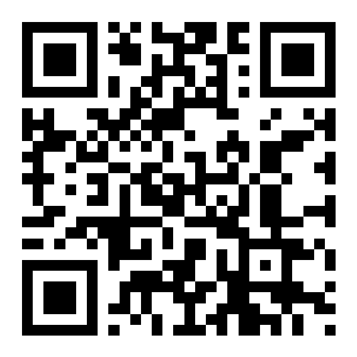
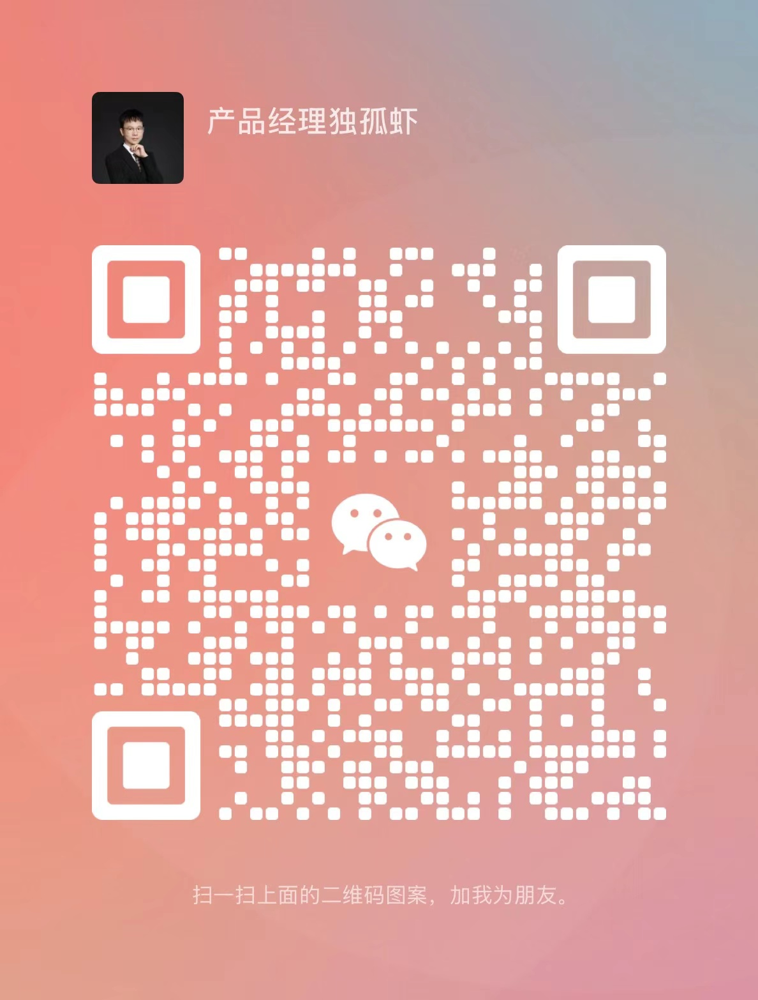

# 产品经理独孤虾 | 智能广告与商业化产品专家

**20 年经验 | 亿级流量变现架构师 | 百人团队管理者**

📱 157-1106-9305 | 📧 fangbing.pm@outlook.com | 💻 GitHub 开源项目
{width=200px}
{width=200px}
{width=200px}

## 核心优势

✅ **技术深度**：主导 5 个亿级 DAU 广告平台 AI 化升级，构建实时竞价、多目标优化算法体系，实现 eCPM 提升 38%+

✅ **商业价值**：打造广告中台架构支撑日均 500 万次竞价，推动平台年收入从 12 亿增长至 35 亿

✅ **行业影响力**：出版 4 部 AI 营销专著，参与制定《智能广告技术白皮书》，3 项发明专利

✅ **团队管理**：8 年总监级管理经验，0-1 组建超 300 人产研团队，团队人效提升 40%+

## 专业领域

| 技术栈                    | 商业能力                      | 管理经验             |
| ------------------------- | ----------------------------- | -------------------- |
| 广告算法（CTR/CVR 优化）  | ROI 模型搭建                  | 产研团队体系化建设   |
| 实时竞价系统（RTB）       | 流量变现策略                  | 跨部门协作与资源整合 |
| 多模态创意生成（GAN/NLP） | 广告主生命周期管理            | 人才选育用留机制     |
| 数据中台架构              | 海外广告平台对接（FB/Google） | 敏捷开发流程优化     |

## 职业成就

### 2023.06 - 至今 | 自由职业
**自媒体 / 企业咨询 / 开源项目**

* **专著出版**：
  * 《Deepseek应用高级教程》(清华大学出版社) - AI智能体应用与开发实践
  * 《DeepSeek+Office职场办公效率提升手册》(人民邮电出版社) - 智能化办公流程与自动化
  * 《智能营销—大模型如何为运营与产品经理赋能》(清华大学出版社) - AI赋能业务创新
  * 《ASP.NET 2.0网站开发技术详解》(机械工业出版社) - 系统架构与开发基础

* **在线课程**：
  * 《Power BI结合业务数据分析实战课》(三节课、起点课堂) - 数据分析与可视化
  * 《智能营销—大模型如何为运营与产品经理赋能》专题系列课(三节课、起点课堂) - AI应用实战

* **开源项目**：
  * Lorn.OpenAgenticAI - 首创桌面级"智能体工作流引擎"，实现复杂任务自动化执行
  * Lorn.ADSP - 开源广告平台，支持百万级QPS竞价，覆盖200+广告主

* **行业影响**：
  * 为50+企业提供智能营销培训，推动客户AI策略落地转化率提升25%
  * 自媒体账号"产品经理独孤虾"全网粉丝逾万，AI营销课程学员过2000+

### 2022.04-2023.06 | Infinity Frontier Limited | 资深产品顾问
**海外广告投放平台重构**

* **管理幅度**：主导跨部门协作，协调研发 / 运营 / 市场团队 20 + 人
* **核心成果**：
  * 低代码 CMS 系统使页面上线周期从 5 天→4 小时，首日 ROI 提升 400%
  * 搭建数据直连 FB/Google 闭环系统，广告主留存率提高 35%

### 2020.12-2022.04 | 京东 | 高级产品经理（P9）
**3C 家电服务平台搭建**

* **管理幅度**：
  * 直接管理 12 人产品团队，间接协调 300 人研发资源池
  * 联动市场 / 客服 / 供应链等 20 + 业务方
* **核心成果**：
  * 设计 "京东小家"APP，用户渗透率提升至 20%+
  * 建立服务商品交易市场，2B 交易规模年增长 180%

### 2018.02-2019.12 | 苏宁易购 | 产品总监（B9）
**智能商业化战略落地**

* **管理幅度**：
  * 管理北京 / 南京两地团队 120 + 人（产品 40 人 + 研发 80 人）
  * 向集团 CTO 汇报，协同 AI / 大数据 / 物流 6 大中心
* **核心成果**：
  * 搭建 AI 策略平台支撑多场景，TOP GMV 场景 GMV 提升 35%
  * 重构广告系统架构，年广告收入突破 50 亿，团队获集团 "年度最佳"

### 2017.04-2017.10 | 去哪儿 | 资深产品经理
**机票智能策略系统**

* **管理幅度**：组建 11 人产品技术团队
* **核心成果**：
  * 引入博弈排序算法，机票收入规模提升 42%
  * 设计智能价格调整系统，采购成本降低 28%

### 2014.11-2017.04 | 百度 | 高级产品经理（P7）
**智能流量优化平台**

* **管理幅度**：管理 30 人产品团队，协调 5 大部门资源
* **核心成果**：
  * 创新优惠券动态策略，年度收益增长 84%，成本降低 45%
  * 广告主 ACP 下降 42%，CTR 提升 68%

### 2013.05-2014.11 | 风行网 | 产品总监
**广告系统重构**

* **管理幅度**：管理 30 人团队，对接销售 / 研发部门
* **核心成果**：
  * 搭建 ADX/DSP 系统，广告收入增长 25%
  * 设计反屏蔽机制，挽回 5% 收入损失

### 2011.03-2013.05 | 优酷 | 高级产品经理
**视频广告系统升级**

* **管理幅度**：管理 7 人新业务团队
* **核心成果**：
  * 设计频次控制功能，品牌广告 CTR 提升 22%
  * 开发无线客户端，开拓移动视频市场

### 2009.01-2011.03 | 天涯在线 | 高级产品经理
**广告系统优化**

* **管理幅度**：管理 5 人产品团队
* **核心成果**：
  * 升级订单管理系统，运营效率提升 20%
  * 优化 CRM 体系，客户续费率提高 30%

### 2003.01-2008.10 | 科莱特 / 卓越电子 | 项目经理
**企业级系统开发**

* **管理幅度**：管理 15 人项目团队
* **核心成果**：
  * 完成银行 ERP 系统架构设计，支持 500 + 用户并发
  * 开发电子教案系统，市场占有率达 15%

## 管理方法论

### 🔧 团队建设四步法

1. **选育**：建立 STAR 行为面试模型，筛选率提升 40%
2. **赋能**：开发《智能营销产品实战课》，培养 30 + 骨干
3. **激励**：推行 "授权式管理 + 成果归属权" 机制，核心成员留存率 92%
4. **迭代**：每季度进行组织诊断，优化团队架构 3 次

## 差异化亮点

### 📊 管理数据看板

| 指标               | 行业均值 | 我的团队 | 提升幅度 |
| ------------------ | -------- | -------- | -------- |
| 需求交付准时率     | 65%      | 91%      | +40%     |
| 关键人才内部晋升率 | 15%      | 38%      | +153%    |
| 跨部门协作满意度   | 3.8/5    | 4.6/5    | +21%     |

### 💡 专利成果
* 基于互联网的信息推广方法以及装置（发明专利号CN106598976A）

## 🎓 教育背景
北京邮电大学 工程管理学士  
PMP 认证 | MCSD | 基金从业资格

