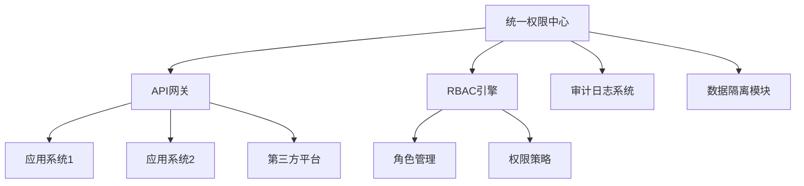
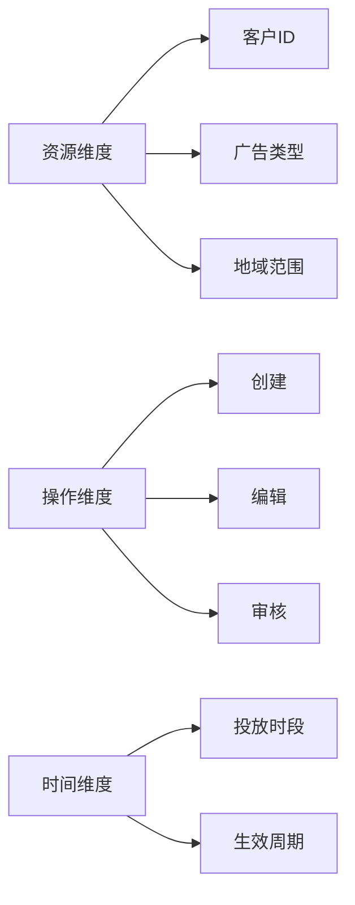
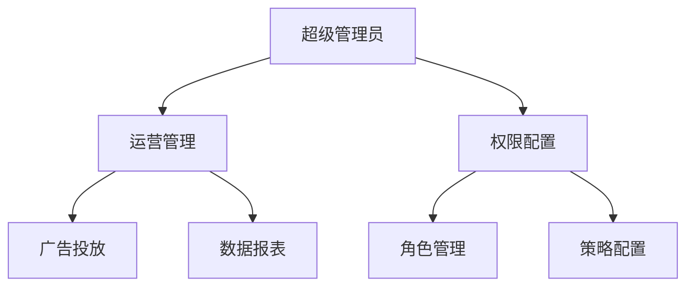
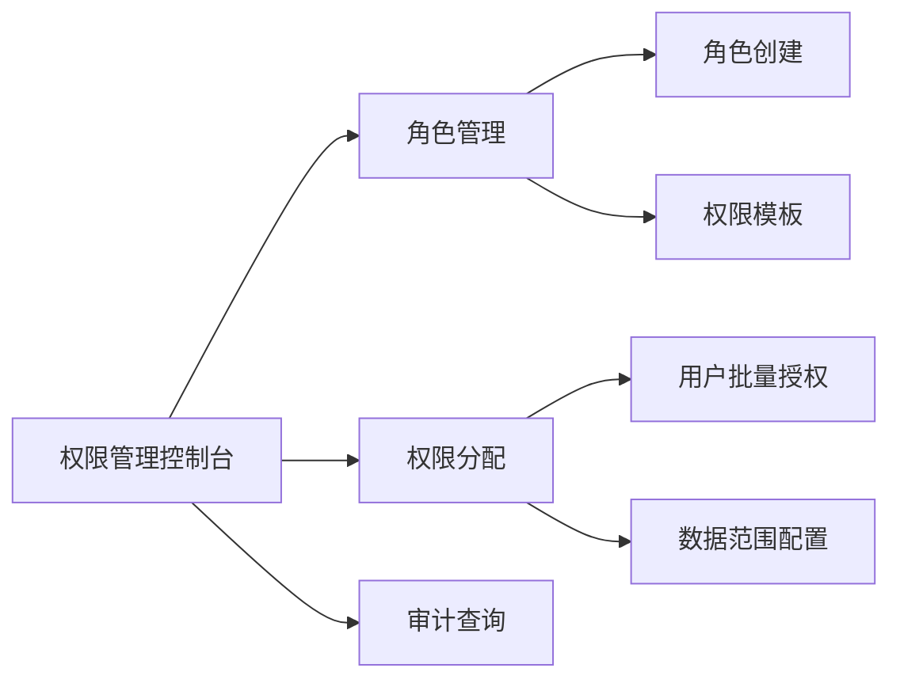

# 广告代运营账号权限设计方案

## 一、系统架构设计


---

## 二、权限模型设计

### 1.三维权限体系



### 2.权限颗粒度矩阵


 控制层级   	 示例场景               	 技术实现               	
 功能级     	 禁止删除高价值广告     	 接口权限控制           	
 数据行级   	 仅查看所属客户数据     	 SQL过滤条件            	
 字段级     	 隐藏客户手机号         	 数据脱敏规则           	
 操作参数级 	 限制每日修改次数       	 请求频率控制           	

---

## 三、角色体系设计

### 1.标准角色模板



### 2.角色权限映射表


 角色名称   	 核心权限项               	 数据范围           	
 运营总监   	 全平台数据看板、预算审批 	 所有客户           	
 优化师     	 广告创意修改、出价调整   	 分配客户组         	
 财务专员   	 账单下载、发票申请       	 本部门客户         	
 客服代表   	 基础数据查询、工单处理   	 归属区域客户       	


---

## 四、技术实现方案

### 1.权限管理系统架构

```mermaid
graph TD
    A[用户请求] --> B[权限校验服务]
    B --> C[缓存层(Redis)]
    C --> D[数据库(MySQL)]
    D --> E[权限策略引擎]
    E --> F[结果返回]
    B --> G[审计日志服务]
```

### 2.关键技术点

数据行级隔离（Java伪代码示例）

```java
// 数据行级隔离伪代码
public class DataFilterInterceptor implements HandlerInterceptor {
    @Override
    public void beforeHandle(HttpServletRequest request, 
        Object handler, ModelAndView modelAndView) {
        String userId = SecurityContextHolder.getUserId();
        String sqlFilter = " WHERE customer_id IN (SELECT customer_id FROM user_customer WHERE user_id = " + userId + ")";
        request.setAttribute("sql_filter", sqlFilter);
    }
}
```

敏感字段加密（Python示例）

```python
# 敏感字段加密与解密示例
from cryptography.fernet import Fernet

def encrypt_field(value, key):
    cipher = Fernet(key)
    return cipher.encrypt(value.encode()).decode()

def decrypt_field(encrypted_value, key):
    cipher = Fernet(key)
    return cipher.decrypt(encrypted_value.encode()).decode()
```
---

## 五、实施步骤规划

### 1.分阶段实施方案


 阶段   	 时间周期 	 主要任务               	 交付物               	
 准备期 	 2周      	 需求调研、系统对接     	 权限清单、接口文档   	
 开发期 	 4周      	 基础功能开发、角色配置 	 测试环境部署         	
 试点期 	 3周      	 客户试点运行、问题收集 	 优化方案报告         	
 推广期 	 2周      	 全量用户上线、培训支持 	 操作手册、FAQ        	

### 2.风险控制措施
- 灰度发布：分批次开放新权限功能。
- 回滚机制：保留旧版权限配置快照。
- 应急响应：7×24小时技术支持团队。

---

## 六、工具推荐清单

### 1.核心工具矩阵


 功能模块       	 推荐工具       	 部署方式   	 成本               	
 权限管理       	 Auth0          	 SaaS       	 按用户数计费       	
 审计日志       	 ELK Stack      	 自建       	 硬件成本+维护费    	
 数据加密       	 AWS KMS        	 云服务     	 按密钥使用量       	
 多租户隔离     	 PostgreSQL + Citus 	 混合部署  	 开源+商业支持      	

### 2.可视化管理界面设计

---

## 七、维护与优化
• 权限健康检查
• 每月生成权限使用报告。
• 自动检测僵尸账号。
• 识别权限冗余角色。
• 智能优化建议（JSON示例）

```json
{
  "优化建议": [
    {
      "用户": "user_001",
      "建议": "合并重复角色editor_v1和editor_v2",
      "风险等级": "中"
    },
    {
      "角色": "supervisor",
      "建议": "移除过期权限delete_ad",
      "影响范围": "12个用户"
    }
  ]
}
```
