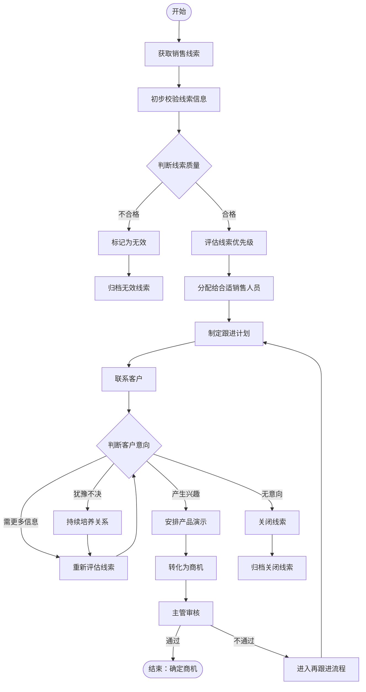
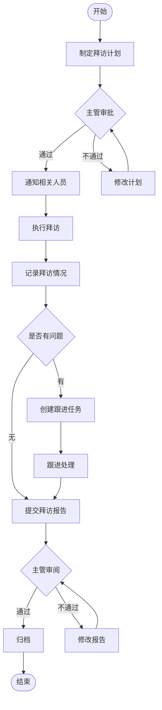
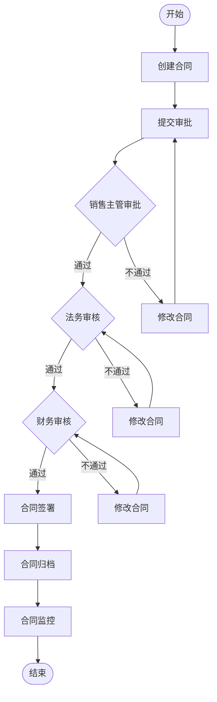
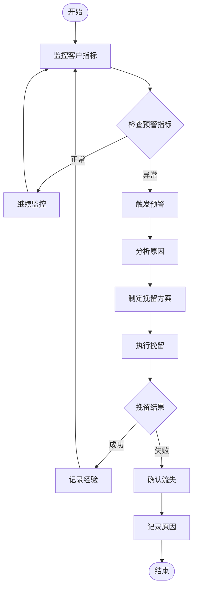

# CRM系统流程设计

## 核心业务流程

### 1. 销售线索管理流程

```mermaid
flowchart TD
    Start([开始])
    Start --> Get[获取销售线索]
    Get --> Validate[初步校验线索信息]
    Validate --> Quality{判断线索质量}
    
    Quality -- 合格 --> Priority[评估线索优先级]
    Quality -- 不合格 --> Invalid[标记为无效]
    
    Invalid --> ArchiveInvalid[归档无效线索]
    
    Priority --> Assign[分配给合适销售人员]
    Assign --> FollowUpPlan[制定跟进计划]
    
    FollowUpPlan --> Contact[联系客户]
    Contact --> Status{判断客户意向}
    
    Status -- 产生兴趣 --> Demo[安排产品演示]
    Status -- 犹豫不决 --> Nurture[持续培养关系]
    Status -- 无意向 --> Close[关闭线索]
    Status -- 需更多信息 --> Reevaluate[重新评估线索]
    
    Demo --> Opportunity[转化为商机]
    Nurture --> Reevaluate
    Reevaluate --> Status
    
    Close --> ArchiveValid[归档关闭线索]
    
    Opportunity --> SupervisorReview[主管审核]
    SupervisorReview -- 通过 --> End([结束：确定商机])
    SupervisorReview -- 不通过 --> Revisit[进入再跟进流程]
    Revisit --> FollowUpPlan
```

### 2. 客户拜访管理流程

```mermaid
flowchart TD
    Start([开始]) --> Plan[制定拜访计划]
    Plan --> Approve{主管审批}
    Approve -- 通过 --> Notify[通知相关人员]
    Approve -- 不通过 --> Modify[修改计划]
    Modify --> Approve
    
    Notify --> Visit[执行拜访]
    Visit --> Record[记录拜访情况]
    Record --> Issue{是否有问题}
    Issue -- 有 --> Task[创建跟进任务]
    Issue -- 无 --> Report[提交拜访报告]
    
    Task --> Track[跟进处理]
    Track --> Report
    Report --> Review{主管审阅}
    Review -- 通过 --> Archive[归档]
    Review -- 不通过 --> Revise[修改报告]
    Revise --> Review
    
    Archive --> End([结束])
```

### 3. 合同审批流程

```mermaid
flowchart TD
    Start([开始]) --> Create[创建合同]
    Create --> Submit[提交审批]
    Submit --> Manager{销售主管审批}
    Manager -- 通过 --> Legal{法务审核}
    Manager -- 不通过 --> Revise1[修改合同]
    Revise1 --> Submit
    
    Legal -- 通过 --> Finance{财务审核}
    Legal -- 不通过 --> Revise2[修改合同]
    Revise2 --> Legal
    
    Finance -- 通过 --> Sign[合同签署]
    Finance -- 不通过 --> Revise3[修改合同]
    Revise3 --> Finance
    
    Sign --> File[合同归档]
    File --> Monitor[合同监控]
    Monitor --> End([结束])
```

### 4. 客户流失预警流程

```mermaid
flowchart TD
    Start([开始]) --> Monitor[监控客户指标]
    Monitor --> Check{检查预警指标}
    Check -- 正常 --> Continue[继续监控]
    Check -- 异常 --> Alert[触发预警]
    
    Alert --> Analyze[分析原因]
    Analyze --> Plan[制定挽留方案]
    Plan --> Execute[执行挽留]
    Execute --> Result{挽留结果}
    
    Result -- 成功 --> Record1[记录经验]
    Result -- 失败 --> Loss[确认流失]
    Loss --> Record2[记录原因]
    
    Continue --> Monitor
    Record1 --> Monitor
    Record2 --> End([结束])
```

