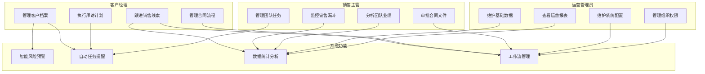

# CRM系统用例设计

## 顶层用例图

## 核心用例说明

### 1. 客户经理用例
1. 管理客户档案
   - 创建/编辑客户信息
   - 维护联系人信息
   - 记录沟通日志
   - 管理相关文档

2. 跟进销售线索
   - 创建商机
   - 更新跟进状态
   - 记录重要事项
   - 评估转化可能

3. 执行拜访计划
   - 制定拜访计划
   - 记录拜访过程
   - 跟进解决问题
   - 提交拜访报告

4. 管理合同流程
   - 创建合同
   - 发起审批流程
   - 跟踪审批状态
   - 维护合同档案

### 2. 销售主管用例
1. 管理团队任务
   - 分配销售任务
   - 监控任务进度
   - 协调团队资源
   - 处理团队问题

2. 监控销售漏斗
   - 查看漏斗状态
   - 分析转化效率
   - 识别问题环节
   - 制定优化方案

3. 分析团队业绩
   - 查看业绩报表
   - 分析业绩指标
   - 评估团队效能
   - 制定改进计划

4. 审批合同文件
   - 审核合同内容
   - 评估合同风险
   - 处理审批流程
   - 跟踪执行情况

### 3. 运营管理员用例
1. 维护系统配置
   - 配置系统参数
   - 设置业务规则
   - 管理工作流程
   - 维护数据字典

2. 管理组织权限
   - 管理用户账号
   - 设置角色权限
   - 配置数据权限
   - 维护组织架构

3. 维护基础数据
   - 管理客户分类
   - 维护产品信息
   - 设置评估指标
   - 更新基础数据

4. 查看运营报表
   - 生成统计报表
   - 分析运营指标
   - 导出报表数据
   - 定制分析维度
