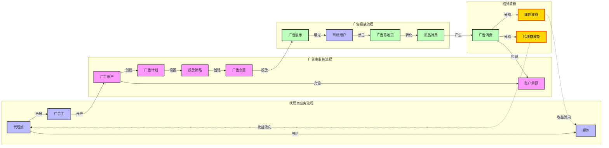

### 广告业务流程

# 广告业务流程说明

## 1. 代理商业务流程

### 1.1 代理商签约
- 代理商与媒体建立合作关系
- 签订代理合作协议
- 确定代理商分成比例
- 建立代理商账户

### 1.2 广告主拓展
- 代理商开拓潜在广告主
- 介绍平台广告产品
- 提供投放建议和服务
- 协助广告主开户

## 2. 广告主业务流程

### 2.1 账户开设
- 提交开户资质材料
- 完成账户实名认证
- 建立广告投放账户
- 分配账户管理权限

### 2.2 账户充值
- 选择充值金额
- 确认支付方式
- 完成充值转账
- 更新账户余额

### 2.3 广告计划创建
- 设定广告目标
- 确定投放预算
- 选择投放时间
- 设置投放区域

### 2.4 投放策略配置
- 定向人群设置
- 出价策略制定
- 投放频次控制
- 预算分配优化

### 2.5 广告创意制作
- 上传广告素材
- 编辑广告文案
- 设置落地页
- 提交创意审核

## 3. 广告投放流程

### 3.1 广告展示
- 触发广告请求
- 竞价系统匹配
- 创意素材展示
- 记录展示数据

### 3.2 用户互动
- 广告曝光统计
- 用户点击行为
- 跳转目标页面
- 追踪转化行为

### 3.3 效果转化
- 记录用户行为
- 统计转化数据
- 评估投放效果
- 优化投放策略

## 4. 结算流程

### 4.1 广告消费
- 计算广告花费
- 扣减账户余额
- 生成消费账单
- 处理退款需求

### 4.2 收益分成
- 确认分成基数
- 计算代理商分成
- 结算平台收益
- 生成结算报表

## 5. 关键节点说明

### 5.1 资金流转
- 广告主充值入账
- 广告消费扣款
- 代理商分成结算
- 平台收益确认

### 5.2 数据流转
- 投放数据采集
- 效果数据统计
- 消费数据核算
- 结算数据汇总

### 5.3 业务流转
- 合同签约管理
- 账户权限管理
- 创意审核流转
- 账单结算流转