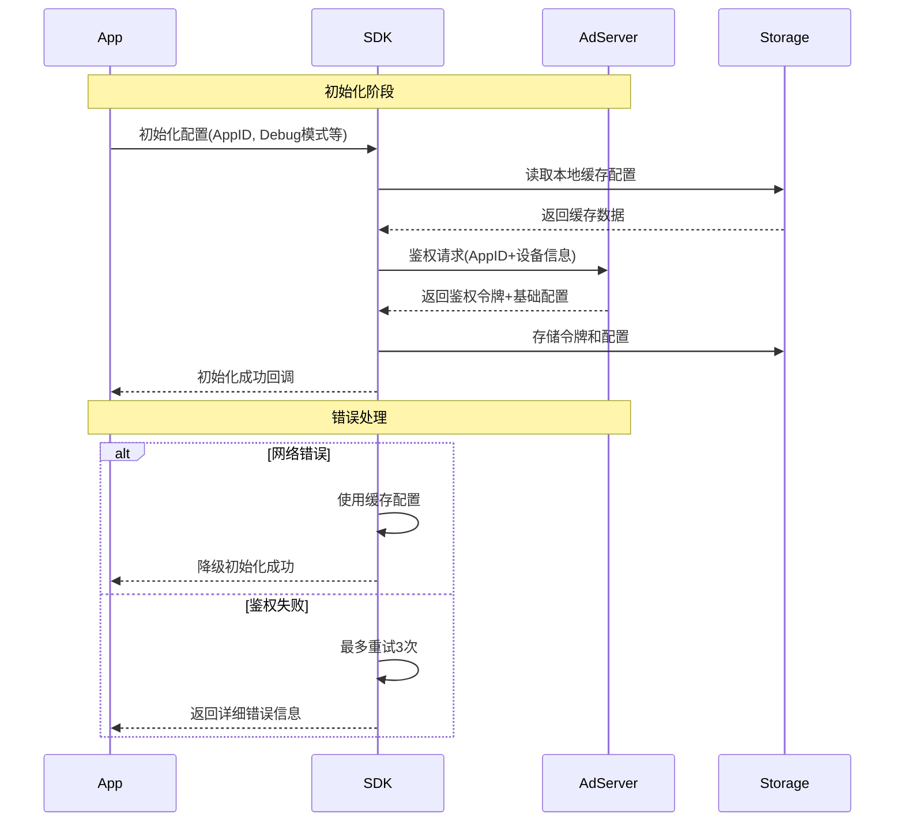
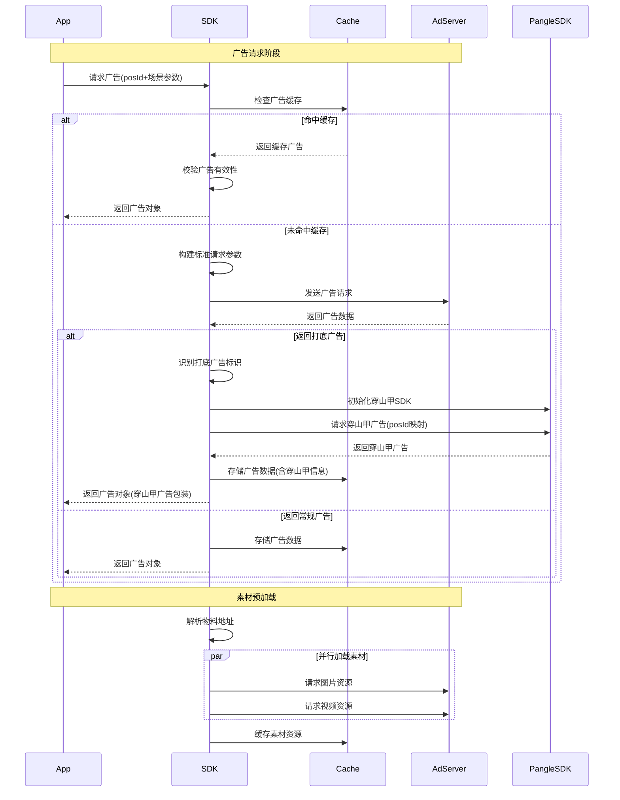
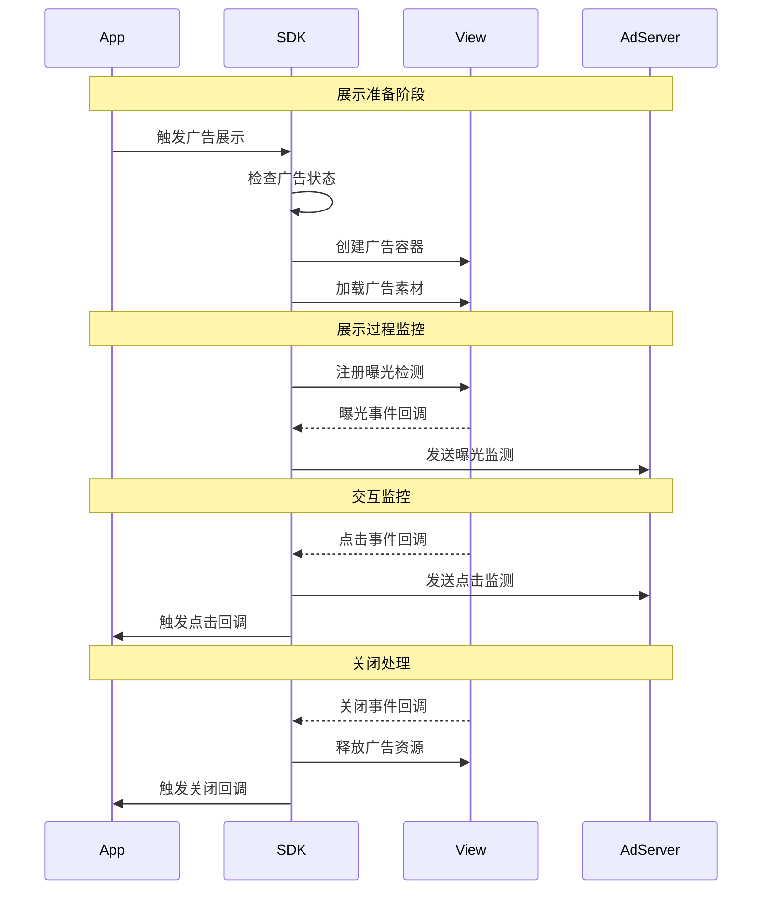
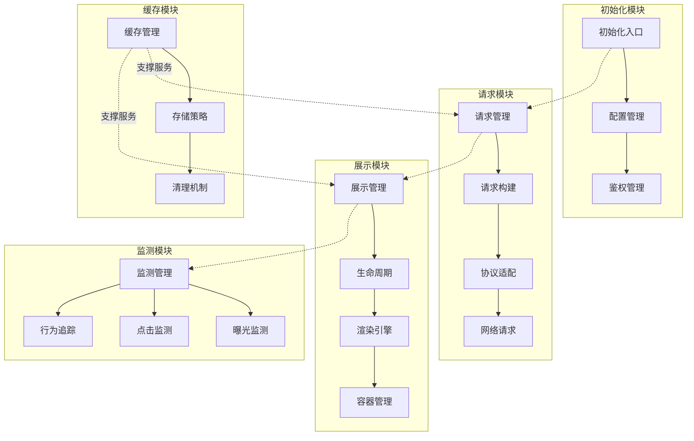
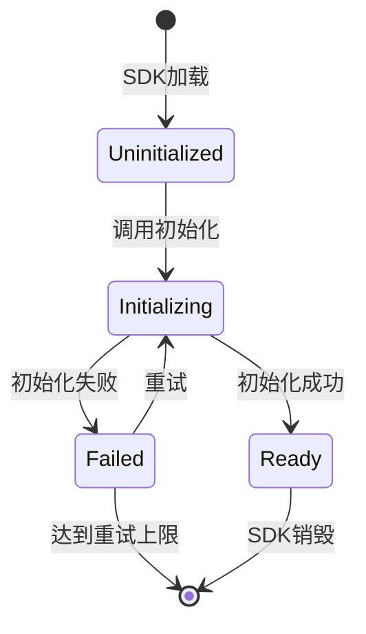
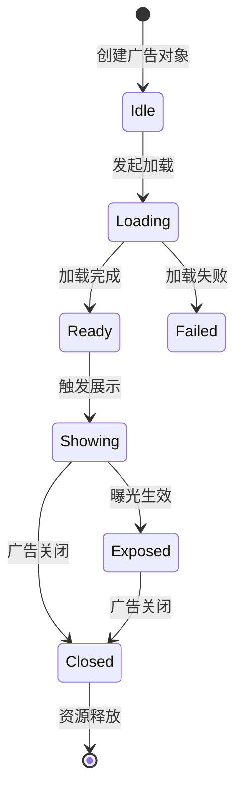
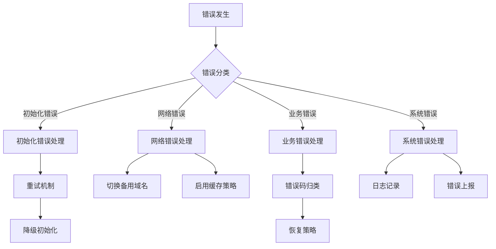
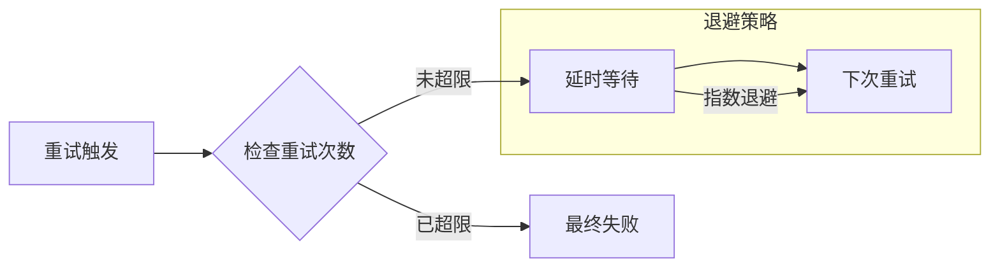

# Lorn.ADSP广告客户端SDK执行流程

## 核心流程时序图
### 1. 初始化流程

### 步骤说明
1. **初始化配置**：
   - 参数解析规则：采用JSON Schema验证配置结构，必填字段包括AppID(32位字符串)、设备ID(SHA256加密)
   - Debug模式激活条件：包含debug=true参数且签名校验通过
   - 配置合并策略：本地缓存配置优先级低于服务端下发的动态配置

2. **鉴权令牌生成**：
   - 令牌组成：AppID + 设备指纹(MD5(设备型号+OS版本+分辨率)) + 时间戳
   - 有效期：服务端下发的token_expire字段控制，默认7200秒
   - 自动续期机制：剩余有效期＜300秒时触发静默更新

3. **降级策略**：
   - 网络超时阈值：TCP连接超时3秒，全链路超时10秒
   - 缓存有效期：根据last_update_time字段，最长使用72小时前的缓存
   - 重试策略：采用指数退避算法(1s, 2s, 4s)

### 2. 广告加载流程

### 步骤说明
1. **缓存校验**：
   - 有效性检查：广告数据的sign字段验证（HMAC-SHA256）
   - 过期机制：根据ad_expire_time与服务端时间比对，误差容忍±300秒
   - 版本控制：优先使用version字段更大的缓存

2. **请求参数构建**：
   - 设备参数：网络类型(WiFi/4G)、设备方向、电池电量
   - 环境参数：GPS模糊化处理(保留小数点后2位)、时区编码
   - 加密传输：采用AES-GCM模式加密请求体

3. **打底广告处理**：
   - 识别机制：通过返回数据中的is_backup_ad=true标识识别打底广告
   - 穿山甲映射：根据广告位ID映射表匹配对应的穿山甲广告位ID
   - SDK初始化：首次请求时动态初始化穿山甲SDK（应用ID由配置下发）
   - 广告请求超时：穿山甲请求默认超时3秒，超时后降级使用默认素材

4. **素材加载**：
   - 优先级策略：首帧图片＞完整视频＞其他素材
   - 预加载触发条件：WiFi环境预加载3个广告，移动网络预加载1个
   - 缓存淘汰：LRU算法维护，最大缓存量500MB

### 3. 广告展示流程

### 步骤说明
1. **容器创建**：
   - 尺寸标准：根据ad_type字段适配，支持百分比(100%x250px)和固定像素
   - 层级管理：z-index默认1000，避免与宿主页面元素冲突
   - 兼容处理：针对WebView容器做硬件加速强制启用

2. **曝光检测**：
   - 算法实现：Intersection Observer API + 滚动事件节流监听
   - 有效曝光标准：可视面积≥50%持续≥1秒
   - 去重机制：相同广告位置10分钟内不重复计数

3. **资源释放**：
   - 内存回收：DOM元素解除事件监听后置null
   - 纹理释放：WebGL渲染器调用gl.deleteTexture()
   - 异常处理：try-catch包裹释放操作+异常日志上报

## 模块交互流程图

## 状态转换说明
### 1. 初始化状态流转

### 2. 广告状态流转

## 关键性能指标与监控
| 阶段     | 监控指标     | 目标值  | 监控方式   | 优化建议                                 |
| -------- | ------------ | ------- | ---------- | ---------------------------------------- |
| 初始化   | 初始化耗时   | <100ms  | 打点统计   | 1. 异步初始化非核心组件 2. 配置懒加载 |
|          | 初始化成功率 | >99.9%  | 服务端统计 | 1. 本地配置容灾 2. 动态重试策略       |
| 广告请求 | 请求耗时     | <300ms  | 打点统计   | 1. 请求参数预处理 2. DNS预解析        |
|          | 请求成功率   | >99.5%  | 服务端统计 | 1. 备用域名策略 2. 请求超时优化       |
| 广告展示 | 渲染耗时     | <500ms  | 打点统计   | 1. 素材预加载 2. 渲染缓存优化         |
|          | 展示成功率   | >99%    | 客户端统计 | 1. 容器预创建 2. 内存优化             |
| 监测上报 | 上报延时     | <50ms   | 打点统计   | 1. 批量上报 2. 本地重试队列           |
|          | 上报到达率   | >99.99% | 服务端统计 | 1. 退避重试 2. 本地持久化             |

## 异常处理流程
### 1. 错误分类与处理策略

### 2. 降级策略
| 错误场景     | 降级方案                           | 恢复策略                                       |
| ------------ | ---------------------------------- | ---------------------------------------------- |
| 网络请求超时 | 1. 使用缓存广告 2. 降低请求频率 | 1. 网络恢复后重试 2. 成功后恢复正常请求频率 |
| 服务端异常   | 1. 启用本地配置 2. 延长缓存时间 | 1. 定期探测服务可用性 2. 服务恢复后刷新配置 |
| 渲染失败     | 1. 降级展示样式 2. 使用备选模板 | 1. 分析失败原因 2. 更新渲染引擎             |

### 3. 重试机制

## 性能优化策略
### 1. 资源预加载
- 配置文件预加载
- 物料资源预缓存
- DNS预解析
- 渲染组件预初始化

### 2. 缁存优化
- 多级缓存架构
- LRU淘汰策略
- 定时清理机制
- 内存使用监控

### 3. 并发控制
- 请求队列管理
- 资源加载并发限制
- 监测上报批处理
- 后台任务优化

### 4. 降级控制
- 监控指标实时分析
- 自动降级阈值
- 手动降级开关
- 灰度发布支持