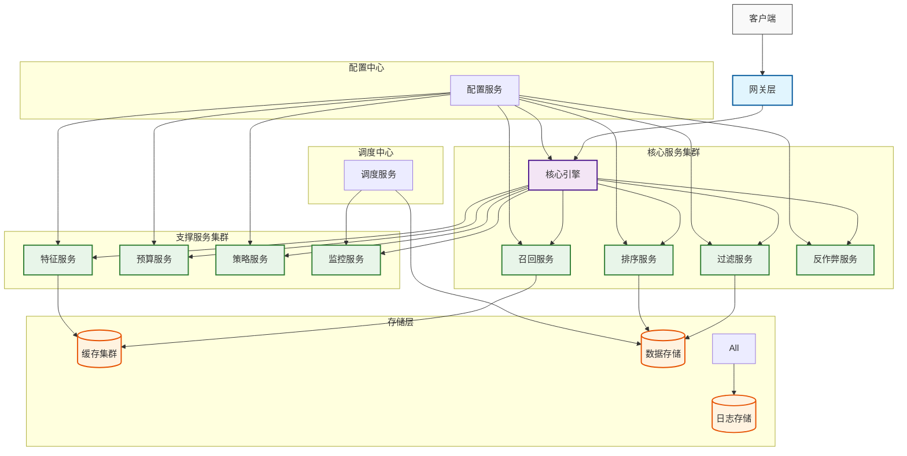
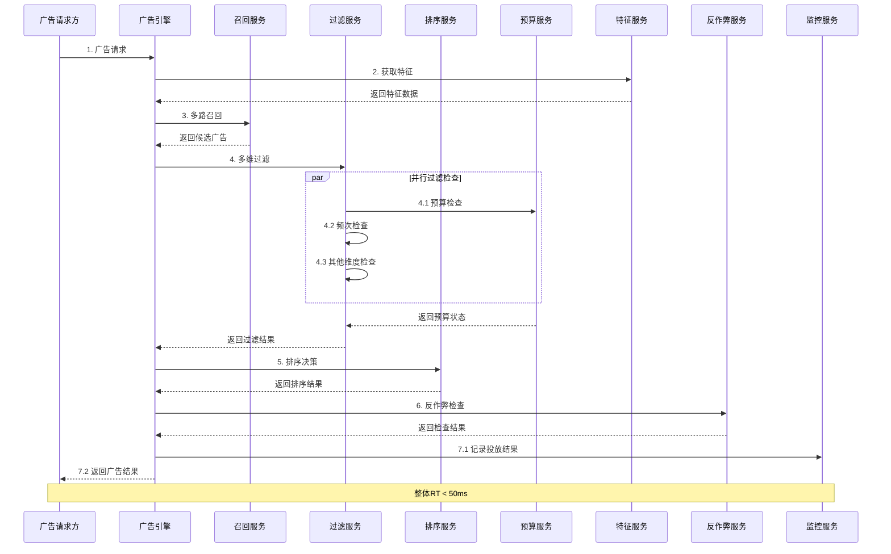

# 广告投放引擎设计方案

## 1. 模块定位

### 整体定位
广告投放引擎是Lorn.ADSP开源广告系统的核心执行引擎，专注于实现广告的实时投放决策、匹配计算和投放控制。作为系统的核心计算引擎，采用高性能、低延迟的设计理念。

系统主要解决以下关键问题：
1. 高性能实时响应：保证毫秒级的广告请求响应速度
2. 精准的匹配计算：确保广告投放的精准性和相关性
3. 可靠的预算控制：实现预算的精确控制和均匀投放
4. 灵活的策略支持：支持复杂的投放策略和业务规则
5. 可扩展的系统架构：支持业务快速发展和功能扩展

### 核心职责
1. 广告请求实时处理
   - 请求参数解析和验证
   - 上下文信息提取和处理
   - 广告位规格匹配
   - 响应数据封装和返回

2. 多维度特征实时匹配
   - 用户画像特征匹配
   - 上下文特征提取
   - 广告特征分析
   - 多维度特征组合

3. 投放策略实时计算
   - 定向规则评估
   - 出价策略计算
   - 排序规则执行
   - 投放控制策略

4. 预算实时控制
   - 预算使用额度检查
   - 花费速度控制
   - 预算分配优化
   - 余额实时更新

5. 投放效果实时反馈
   - 展示数据统计
   - 点击行为分析
   - 转化追踪
   - 效果评估指标

## 2. 核心能力

### 2.1 实时投放决策
1. 毫秒级广告请求响应
   - 请求处理延迟 < 50ms
   - 系统吞吐量 > 50000 QPS
   - 请求超时率 < 0.1%
   - 错误响应率 < 0.01%

2. 多维度实时特征匹配
   - 用户特征实时获取和匹配
   - 场景特征动态识别
   - 广告特征快速索引
   - 特征组合实时计算

3. 智能投放策略执行
   - 多层级策略规则支持
   - 复杂条件组合处理
   - 优先级动态调整
   - A/B测试支持

4. 实时预算控制
   - 预算使用实时跟踪
   - 智能调速算法
   - 预算超投防控
   - 预警机制

5. 投放效果实时评估
   - 关键指标实时统计
   - 效果预估模型
   - 策略优化建议
   - 异常监测预警

### 2.2 核心服务接口
- 广告请求服务
- 特征匹配服务
- 策略计算服务
- 预算控制服务
- 效果反馈服务

### 2.3 引擎优化能力
- 多级缓存优化
- 并发请求处理
- 异步计算处理
- 实时数据同步

## 3. 系统架构

### 3.1 整体架构设计原则
1. 高可用设计原则
   - 服务无状态化：便于水平扩展
   - 多机房部署：实现异地容灾
   - 熔断降级：保护系统稳定性
   - 负载均衡：请求流量分发

2. 高性能设计原则
   - 多级缓存：降低访问延迟
   - 异步处理：提高系统吞吐
   - 数据预加载：减少实时计算
   - 资源池化：提高资源利用

3. 可扩展设计原则
   - 模块化设计：便于功能扩展
   - 插件化架构：支持能力扩展
   - 配置化驱动：灵活策略调整
   - 服务化接口：支持集成对接

4. 可维护设计原则
   - 统一监控：系统运行状态
   - 链路追踪：请求处理过程
   - 日志管理：问题定位分析
   - 配置管理：参数动态调整

### 3.2 核心服务组件

#### 3.2.1 网关层设计
1. 请求接入处理
   - 协议适配：支持HTTP/HTTPS/GRPC
   - 参数验证：请求完整性检查
   - 流量控制：QPS限制保护
   - 安全防护：防攻击、防刷

2. 负载均衡
   - 多机房流量调度
   - 服务实例选择
   - 失败重试策略
   - 健康检查机制

#### 3.2.2 核心引擎层
1. 召回服务设计
   - 多路召回策略
   - 定向规则匹配
   - 智能推荐召回
   - 候选集合并

2. 过滤服务设计
   - 预算过滤器
   - 频次过滤器
   - 定向过滤器
   - 质量分过滤

3. 排序服务设计
   - 特征处理模块
   - 排序模型服务
   - 策略调整模块
   - 排序结果优化

4. 反作弊服务设计
   - 流量质量检测
   - 作弊行为识别
   - 风险评估模型
   - 防护策略执行

#### 3.2.3 服务组件说明

| 服务组件   | 核心职责                               | 关键特性                             |
| ---------- | -------------------------------------- | ------------------------------------ |
| 召回服务   | 基于用户特征和广告定向规则召回候选广告 | 多路召回、并行处理、结果去重         |
| 过滤服务   | 基于预算、频次、行业等维度过滤候选广告 | 多维过滤、交集处理、实时检查         |
| 排序服务   | 粗排、精排和重排实现广告排序决策       | 轻量级模型、深度学习模型、多样性优化 |
| 反作弊服务 | 检测和防御作弊流量                     | 设备指纹分析、行为模式识别、风险评估 |
| 特征服务   | 提供用户、广告、上下文等特征数据       | 多级缓存、特征组合、增量更新         |
| 预算服务   | 控制广告预算使用和分配                 | 预算检查、消耗控制、配额管理         |
| 策略服务   | 提供广告投放策略配置                   | 策略下发、动态调整、A/B实验          |
| 监控服务   | 收集和分析系统运行状态和业务指标       | 多维监控、告警策略、实时大盘         |

#### 3.2.4 流程交互关系

### 3.3 处理流程

#### 3.3.1 广告请求处理流程
1. **请求接收和参数校验**
   - 解析请求参数和头信息
   - 校验必要参数完整性和有效性
   - 提取上下文信息（设备、地点、时间等）
   - 加载广告位规格要求

2. **多路召回阶段**
   - 定向规则召回：基于用户画像、地域、兴趣等规则匹配
   - 智能定向召回：Look-alike模型、场景智能匹配
   - 相似广告召回：基于内容相似度、人群相似度
   - 实时兴趣召回：基于用户实时行为序列
   - 召回结果合并：多路结果去重、优先级控制

3. **多维度过滤阶段**
   - 预算过滤：日预算、总预算检查
   - 频次过滤：用户维度、设备维度频次控制
   - 行业过滤：同行业间隔、竞品屏蔽规则
   - 品牌过滤：品牌安全控制、品牌竞争规则
   - 过滤结果交集处理：多维结果合并、空集快速返回

4. **智能排序阶段**
   - 粗排：轻量级特征处理、快速模型计算
   - 精排：完整特征处理、深度模型预估
   - 重排：多样性优化、策略调整、商业价值平衡

5. **反作弊检查**
   - 流量质量检查：设备指纹分析、行为模式检测
   - 风险等级评估：历史数据分析、规则匹配

6. **效果监控记录**
   - 投放结果记录：展示、点击、转化等事件
   - 监控指标更新：实时指标计算和更新
   - 异步处理：数据统计、日志记录并行处理

#### 3.3.2 调度流程
1. **定时调度触发**
   - 周期性执行（如每小时一次）
   - 支持手动紧急调度
   - 错峰调度避免资源竞争

2. **日志数据收集**
   - 并行从多监控服务器读取日志
   - 日志合并与去重处理
   - 保证数据完整性

3. **投放量结算**
   - 统计点击、展示、转化数据
   - 核对预算使用情况
   - 更新计划剩余额度

4. **负载均衡分配**
   - 评估服务器负载状态
   - 动态分配投放量
   - 服务器扩缩容支持

### 3.4 关键优化技术

1. **多级缓存架构**
   - L1: 本地内存缓存(10ms)
   - L2: 分布式缓存(50ms)
   - L3: 持久化存储(100ms)
   - 热点数据预加载、冷数据淘汰

2. **并行处理机制**
   - 多路召回并行执行
   - 多维度过滤并行处理
   - 线程池动态调整

3. **异步处理策略**
   - 日志异步写入
   - 监控指标异步更新
   - 非关键计算异步执行

4. **降级和容错机制**
   - 功能降级：简化特征、降级模型复杂度
   - 容量降级：请求限流、超时调整
   - 熔断保护：错误率阈值、半开状态检测

## 4. 核心指标

### 4.1 性能指标
1. 请求处理性能
   - 请求处理延迟 P99 < 50ms
   - 请求处理延迟 P999 < 100ms
   - 系统可用性 > 99.99%
   - 并发处理能力 > 50000 QPS
   - 数据一致性延迟 < 1s

2. 资源使用效率
   - CPU 利用率 < 70%
   - 内存使用率 < 80%
   - 磁盘 IO 使用率 < 60%
   - 网络带宽使用率 < 70%

3. 缓存性能
   - 缓存命中率 > 95%
   - 缓存更新延迟 < 100ms
   - 缓存同步延迟 < 500ms

4. 数据处理能力
   - 日志处理延迟 < 5s
   - 数据统计延迟 < 1min
   - 报表生成延迟 < 5min

### 4.2 准确性指标
1. 匹配准确性
   - 特征匹配准确率 > 99%
   - 定向规则匹配准确率 > 99.9%
   - 召回结果准确率 > 95%
   - 排序结果准确率 > 90%

2. 预算控制精度
   - 预算控制精度 > 99.9%
   - 日预算偏差率 < 1%
   - 总预算偏差率 < 0.5%
   - 预算均匀性误差 < 5%

3. 策略执行准确性
   - 策略执行准确率 > 99%
   - 规则处理准确率 > 99.9%
   - A/B测试准确率 > 99%
   - 配置生效准确率 100%

### 4.3 监控指标
1. 系统监控指标
   - 服务可用性监控
   - 资源使用率监控
   - 接口调用监控
   - 错误日志监控

2. 业务监控指标
   - 广告请求量监控
   - 广告响应率监控
   - 广告展示率监控
   - 点击率监控

3. 告警指标
   - 服务可用性告警
   - 性能劣化告警
   - 错误率告警
   - 业务异常告警

## 5. 文档导航

### 5.1 业务需求与架构
1. [产品需求说明](./产品需求说明.md)
   - 产品定位与价值
   - 功能需求详述
   - 非功能需求说明
   - 系统限制与约束
   - 演进规划说明

2. [运行流程设计](./运行流程设计.md)
   - 系统初始化流程
   - 广告调度流程设计
   - 广告展现流程方案
   - 商业场景适配设计
   - 特殊场景处理方案
   - 性能优化策略

### 5.2 接口与数据设计
1. [接口规范设计](./接口规范设计.md)
   - 广告请求服务接口
   - 特征查询服务接口
   - 策略查询服务接口
   - 错误处理规范
   - 安全访问规范
   - 版本管理规范

2. [数据模型设计](./数据模型设计.md)
   - 核心实体模型设计
   - 关系模型设计方案
   - 存储方案设计说明
   - 缓存架构设计方案

### 5.3 技术实现设计
1. [时序交互设计](./时序交互设计.md)
   - 系统组件交互设计
   - 核心业务流程时序
   - 异常处理流程设计
   - 数据同步机制设计

2. [系统配置设计](./系统配置设计.md)
   - 系统参数配置方案
   - 业务规则配置设计
   - 策略引擎配置说明
   - 监控告警配置规范

### 5.4 质量保障设计
1. [性能设计](./性能设计.md)
   - 性能指标体系设计
   - 性能优化策略方案
   - 容量规划设计方案
   - 监控指标体系设计

2. [安全设计](./安全设计.md)
   - 安全架构设计方案
   - 访问控制策略设计
   - 数据安全保护方案
   - 风险控制措施设计

## 6. 后续规划

### 6.1 性能优化规划
1. 计算性能优化
   - 特征计算优化
   - 模型计算优化
   - 并发处理优化
   - 内存使用优化

2. 缓存架构优化
   - 多级缓存优化
   - 缓存预热机制
   - 缓存淘汰策略
   - 缓存一致性保证

3. 并发处理优化
   - 线程模型优化
   - 队列管理优化
   - 锁优化方案
   - 资源池优化

4. 实时性提升
   - 请求处理优化
   - 数据同步优化
   - 配置下发优化
   - 监控反馈优化

### 6.2 能力增强规划
1. 特征计算优化
   - 特征处理框架升级
   - 特征计算性能优化
   - 特征存储优化
   - 特征服务高可用

2. 策略执行增强
   - 策略引擎升级
   - 规则处理优化
   - 策略配置优化
   - 策略执行监控

3. 预算控制精细化
   - 智能预算控制
   - 预算分配优化
   - 预算使用预警
   - 预算调整建议

4. 实时反馈优化
   - 实时统计优化
   - 实时分析增强
   - 反馈链路优化
   - 监控体系完善

### 6.3 平台化演进
1. 服务能力开放
   - API网关建设
   - 服务管理平台
   - 开发者门户
   - SDK工具包

2. 运营能力增强
   - 运营后台建设
   - 数据分析平台
   - 监控运维平台
   - 配置管理平台

## 版本历史
| 版本   | 更新内容               | 更新人 | 更新时间   |
| ------ | ---------------------- | ------ | ---------- |
| v1.0.0 | 初始版本设计完成       | -      | 2025-02-20 |
| v1.1.0 | 补充性能优化与运维方案 | -      | 2025-02-21 |
