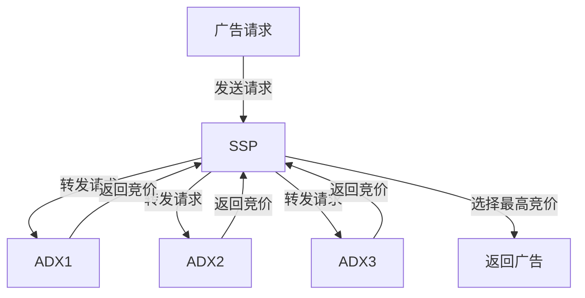
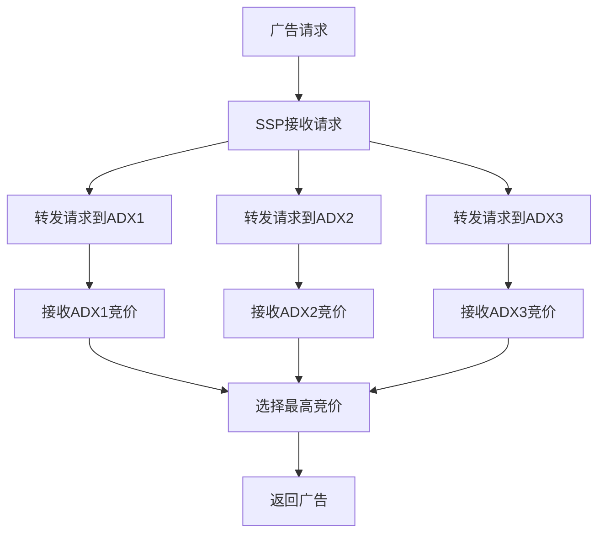
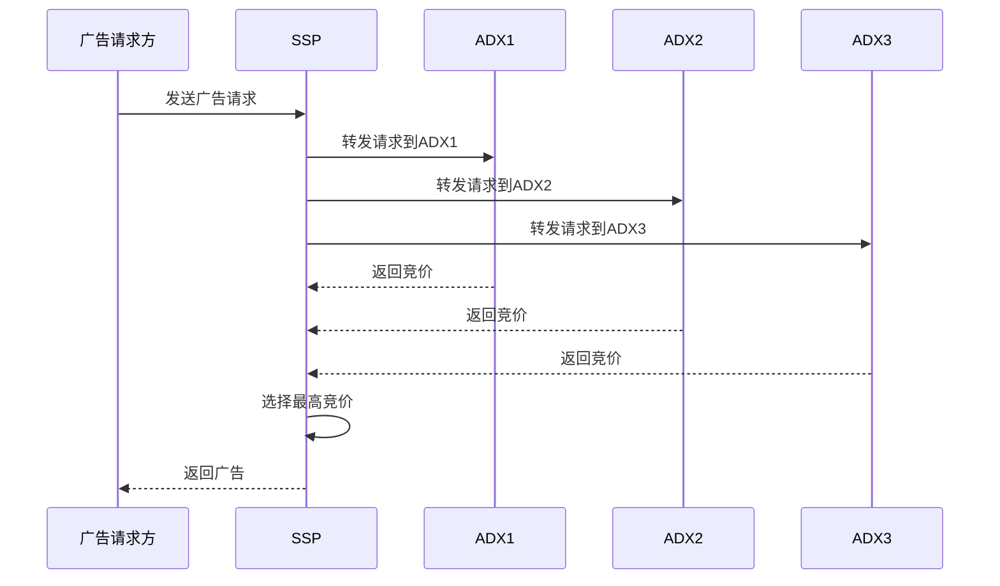

# 以SSP身份S2S方式接入多个第三方ADX并进行竞价的产品设计

## 1. 用例图

### 1.1 用例描述



#### 1.1.1 广告请求
- 描述：广告请求方发送广告请求到SSP。
- 参与者：广告请求方（Client）
- 前置条件：广告请求方已准备好广告请求数据。
- 后置条件：SSP接收到广告请求并开始处理。

#### 1.1.2 转发请求
- 描述：SSP将广告请求转发给多个ADX。
- 参与者：SSP、ADX1、ADX2、ADX3
- 前置条件：SSP接收到广告请求。
- 后置条件：各ADX接收到广告请求并开始竞价。

#### 1.1.3 返回竞价
- 描述：各ADX返回竞价结果给SSP。
- 参与者：SSP、ADX1、ADX2、ADX3
- 前置条件：各ADX完成竞价。
- 后置条件：SSP接收到所有ADX的竞价结果。

#### 1.1.4 选择最高竞价
- 描述：SSP从多个竞价结果中选择最高竞价。
- 参与者：SSP
- 前置条件：SSP接收到所有ADX的竞价结果。
- 后置条件：SSP选择最高竞价并返回广告。

## 2. 流程图

### 2.1 流程描述



#### 2.1.1 广告请求
- 步骤：广告请求方发送广告请求到SSP。
- 说明：广告请求包含广告位信息、用户信息、设备信息等。

#### 2.1.2 SSP接收请求
- 步骤：SSP接收广告请求并进行解析。
- 说明：SSP解析广告请求中的各项参数，准备转发给ADX。

#### 2.1.3 转发请求到ADX
- 步骤：SSP将广告请求转发给多个ADX。
- 说明：SSP根据配置将广告请求转发给ADX1、ADX2、ADX3。

#### 2.1.4 接收ADX竞价
- 步骤：各ADX返回竞价结果给SSP。
- 说明：各ADX完成竞价后，将竞价结果返回给SSP。

#### 2.1.5 选择最高竞价
- 步骤：SSP从多个竞价结果中选择最高竞价。
- 说明：SSP比较各ADX的竞价结果，选择最高竞价。

#### 2.1.6 返回广告
- 步骤：SSP返回选择的广告给广告请求方。
- 说明：SSP将选择的广告返回给广告请求方，完成广告请求处理。

## 3. 序列图

### 3.1 序列描述



#### 3.1.1 发送广告请求
- 描述：广告请求方发送广告请求到SSP。
- 交互：Client -> SSP
- 数据：广告请求数据（广告位信息、用户信息、设备信息等）

#### 3.1.2 转发请求到ADX
- 描述：SSP将广告请求转发给多个ADX。
- 交互：SSP -> ADX1、ADX2、ADX3
- 数据：广告请求数据（广告位信息、用户信息、设备信息等）

#### 3.1.3 返回竞价
- 描述：各ADX返回竞价结果给SSP。
- 交互：ADX1、ADX2、ADX3 -> SSP
- 数据：竞价结果（竞价金额、广告素材等）

#### 3.1.4 选择最高竞价
- 描述：SSP从多个竞价结果中选择最高竞价。
- 交互：SSP -> SSP
- 数据：最高竞价结果

#### 3.1.5 返回广告
- 描述：SSP返回选择的广告给广告请求方。
- 交互：SSP -> Client
- 数据：广告素材

## 4. 接口规范

### 4.1 广告请求接口

#### 请求示例

```json
{
  "openrtb": {
    "ver": "3.0",
    "domainspec": "adcom",
    "domainver": "1.0",
    "request": {
      "id": "0123456789ABCDEF",
      "tmax": 150,
      "at": 2,
      "cur": ["USD", "EUR"],
      "source": {
        "tid": "FEDCBA9876543210",
        "ts": 1541796182157,
        "ds": "AE23865DF890100BECCD76579DD4769DBBA9812CEE8ED90BF",
        "dsmap": "...",
        "cert": "ads-cert.1.txt",
        "pchain": "..."
      },
      "package": 0,
      "item": [
        {
          "id": "1",
          "qty": 1,
          "private": 0,
          "deal": [
            {
              "id": "1234",
              "flr": 1.50
            }
          ],
          "spec": {
            "placement": { /* Refer to the AdCOM Specification */ }
          }
        }
      ],
      "context": {
        "site": { /* Refer to the AdCOM Specification */ },
        "user": { /* Refer to the AdCOM Specification */ },
        "device": { /* Refer to the AdCOM Specification */ },
        "regs": { /* Refer to the AdCOM Specification */ },
        "restrictions": { /* Refer to the AdCOM Specification */ }
      }
    }
  }
}
```

#### 请求参数说明

| 参数名               | 类型     | 是否必填 | 描述                 | 示例值                                              | 取值范围                       |
| -------------------- | -------- | -------- | -------------------- | --------------------------------------------------- | ------------------------------ |
| ver                  | string   | 是       | OpenRTB版本号        | "3.0"                                               | 当前支持版本: 3.0              |
| domainspec           | string   | 是       | 域模型规范           | "adcom"                                             | 默认值: "adcom"                |
| domainver            | string   | 是       | 域模型版本号         | "1.0"                                               | 当前支持版本: 1.0              |
| id                   | string   | 是       | 请求唯一标识         | "0123456789ABCDEF"                                  | 长度不超过64字符               |
| tmax                 | number   | 否       | 最大响应时间（毫秒） | 150                                                 | 单位：毫秒                     |
| at                   | number   | 否       | 拍卖类型             | 2                                                   | 1=第一价格拍卖, 2=第二价格拍卖 |
| cur                  | string[] | 否       | 接受的货币类型       | ["USD", "EUR"]                                      | ISO-4217货币代码               |
| source.tid           | string   | 是       | 交易ID               | "FEDCBA9876543210"                                  | 长度不超过64字符               |
| source.ts            | number   | 是       | 请求时间戳（毫秒）   | 1541796182157                                       | 当前时间前后5分钟内的时间戳    |
| source.ds            | string   | 是       | 数字签名             | "AE23865DF890100BECCD76579DD4769DBBA9812CEE8ED90BF" | 签名字符串                     |
| source.dsmap         | string   | 否       | 签名映射             | "..."                                               | 签名映射字符串                 |
| source.cert          | string   | 是       | 证书文件名           | "ads-cert.1.txt"                                    | 证书文件名                     |
| source.pchain        | string   | 否       | 支付链               | "..."                                               | 支付链字符串                   |
| package              | number   | 否       | 是否为包裹竞价       | 0                                                   | 0=否, 1=是                     |
| item.id              | string   | 是       | 商品唯一标识         | "1"                                                 | 长度不超过64字符               |
| item.qty             | number   | 否       | 商品数量             | 1                                                   | 默认值: 1                      |
| item.private         | number   | 否       | 是否为私有竞价       | 0                                                   | 0=否, 1=是                     |
| item.deal.id         | string   | 是       | 交易唯一标识         | "1234"                                              | 长度不超过64字符               |
| item.deal.flr        | number   | 否       | 最低竞价价格         | 1.50                                                | 单位：CPM                      |
| item.spec            | object   | 是       | 商品规格             | { /* Refer to the AdCOM Specification */ }          | 参见AdCOM规范                  |
| context.site         | object   | 否       | 站点信息             | { /* Refer to the AdCOM Specification */ }          | 参见AdCOM规范                  |
| context.user         | object   | 否       | 用户信息             | { /* Refer to the AdCOM Specification */ }          | 参见AdCOM规范                  |
| context.device       | object   | 否       | 设备信息             | { /* Refer to the AdCOM Specification */ }          | 参见AdCOM规范                  |
| context.regs         | object   | 否       | 合规信息             | { /* Refer to the AdCOM Specification */ }          | 参见AdCOM规范                  |
| context.restrictions | object   | 否       | 限制信息             | { /* Refer to the AdCOM Specification */ }          | 参见AdCOM规范                  |

### 4.2 广告响应接口

#### 响应示例

```json
{
  "openrtb": {
    "ver": "3.0",
    "domainspec": "adcom",
    "domainver": "1.0",
    "response": {
      "id": "0123456789ABCDEF",
      "bidid": "0011223344AABBCC",
      "seatbid": [
        {
          "seat": "XYZ",
          "bid": [
            {
              "id": "yaddayadda",
              "item": "1",
              "deal": "1234",
              "price": 1.50,
              "tactic": "...",
              "purl": "...",
              "burl": "...",
              "lurl": "...",
              "mid": "...",
              "macro": [
                {
                  "key": "TIMESTAMP",
                  "value": "1127987134"
                },
                {
                  "key": "CLICKTOKEN",
                  "value": "A7D800F2716DB"
                }
              ],
              "media": {
                "ad": { /* Refer to the AdCOM Specification */ }
              }
            }
          ]
        }
      ]
    }
  }
}
```

#### 响应参数说明

| 参数名                        | 类型     | 是否必填 | 描述          | 示例值                                     | 取值范围          |
| ----------------------------- | -------- | -------- | ------------- | ------------------------------------------ | ----------------- |
| ver                           | string   | 是       | OpenRTB版本号 | "3.0"                                      | 当前支持版本: 3.0 |
| domainspec                    | string   | 是       | 域模型规范    | "adcom"                                    | 默认值: "adcom"   |
| domainver                     | string   | 是       | 域模型版本号  | "1.0"                                      | 当前支持版本: 1.0 |
| id                            | string   | 是       | 请求唯一标识  | "0123456789ABCDEF"                         | 长度不超过64字符  |
| bidid                         | string   | 否       | 竞价唯一标识  | "0011223344AABBCC"                         | 长度不超过64字符  |
| seatbid                       | object[] | 是       | 竞价结果数组  | [{...}]                                    | 竞价结果列表      |
| seatbid[].seat                | string   | 否       | 买方席位ID    | "XYZ"                                      | 买方席位唯一标识  |
| seatbid[].bid                 | object[] | 是       | 竞价数组      | [{...}]                                    | 竞价列表          |
| seatbid[].bid[].id            | string   | 否       | 竞价唯一标识  | "yaddayadda"                               | 长度不超过64字符  |
| seatbid[].bid[].item          | string   | 是       | 商品唯一标识  | "1"                                        | 长度不超过64字符  |
| seatbid[].bid[].deal          | string   | 否       | 交易唯一标识  | "1234"                                     | 长度不超过64字符  |
| seatbid[].bid[].price         | number   | 是       | 竞价价格      | 1.50                                       | 单位：CPM         |
| seatbid[].bid[].tactic        | string   | 否       | 策略标识      | "..."                                      | 策略标识字符串    |
| seatbid[].bid[].purl          | string   | 否       | 待定通知URL   | "..."                                      | URL字符串         |
| seatbid[].bid[].burl          | string   | 否       | 计费通知URL   | "..."                                      | URL字符串         |
| seatbid[].bid[].lurl          | string   | 否       | 失败通知URL   | "..."                                      | URL字符串         |
| seatbid[].bid[].mid           | string   | 否       | 媒体唯一标识  | "..."                                      | 长度不超过64字符  |
| seatbid[].bid[].macro         | object[] | 否       | 宏替换数组    | [{...}]                                    | 宏替换列表        |
| seatbid[].bid[].macro[].key   | string   | 是       | 宏键          | "TIMESTAMP"                                | 宏键字符串        |
| seatbid[].bid[].macro[].value | string   | 是       | 宏值          | "1127987134"                               | 宏值字符串        |
| seatbid[].bid[].media         | object   | 是       | 媒体对象      | { /* Refer to the AdCOM Specification */ } | 参见AdCOM规范     |

### 4.3 事件通知接口

#### 事件类型

- **Pending**: 当竞价被选为胜出时触发。
- **Billing**: 当竞价产生费用时触发。
- **Loss**: 当竞价失败时触发。

#### 事件通知示例

```json
{
  "event": "billing",
  "data": {
    "id": "0123456789ABCDEF",
    "bidid": "0011223344AABBCC",
    "price": 1.50,
    "currency": "USD"
  }
}
```

#### 事件通知参数说明

| 参数名        | 类型   | 是否必填 | 描述         | 示例值             | 取值范围                     |
| ------------- | ------ | -------- | ------------ | ------------------ | ---------------------------- |
| event         | string | 是       | 事件类型     | "billing"          | "pending", "billing", "loss" |
| data.id       | string | 是       | 请求唯一标识 | "0123456789ABCDEF" | 长度不超过64字符             |
| data.bidid    | string | 是       | 竞价唯一标识 | "0011223344AABBCC" | 长度不超过64字符             |
| data.price    | number | 是       | 竞价价格     | 1.50               | 单位：CPM                    |
| data.currency | string | 是       | 货币类型     | "USD"              | ISO-4217货币代码             |
