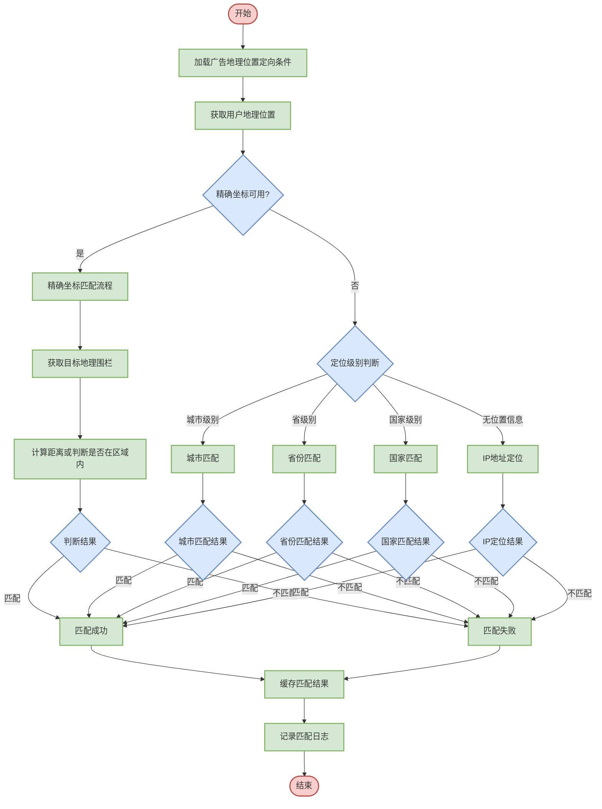

# 地理位置定向匹配逻辑设计

## 1. 流程图设计



## 2. 详细步骤说明

### 2.1 加载广告地理位置定向条件
- **输入**：广告ID
- **处理**：从广告配置中获取地理位置定向条件
- **输出**：地理位置定向规则集合
- **规则格式示例**：
  ```json
  {
    "geoTargeting": {
      "countries": ["CN"],                           // 国家定向列表，使用国家代码
      "provinces": ["110000", "310000", "440000"],   // 省级行政区划定向，分别是：北京、上海、广东
      "cities": ["110100", "310100", "440100"],      // 市级行政区划定向，分别是：北京市、上海市、广州市
      "districts": ["110105", "310104", "440106"],   // 区县级行政区划定向，分别是：朝阳区、徐汇区、天河区
      "businessAreas": ["望京", "陆家嘴", "珠江新城"],  // 商圈定向列表
      "radius": [                                    // 圆形区域定向
        {
          "lat": 39.9087243,                         // 圆心纬度
          "lng": 116.3974799,                        // 圆心经度
          "radius": 5000                             // 半径，单位：米
        }
      ],
      "polygons": [                                  // 多边形区域定向
        {
          "points": [                                // 多边形各顶点坐标
            {"lat": 39.9087243, "lng": 116.3974799}, // 顶点1
            {"lat": 39.9087243, "lng": 116.4974799}, // 顶点2
            {"lat": 39.8087243, "lng": 116.4974799}, // 顶点3
            {"lat": 39.8087243, "lng": 116.3974799}  // 顶点4
          ]
        }
      ],
      "excludeGeo": {                                // 排除地理区域
        "cities": ["500100", "420100"]               // 排除的城市列表，分别是：重庆市、武汉市
      }
    }
  }
  ```

### 2.2 获取用户地理位置
- **输入**：请求参数、用户ID、设备ID
- **处理**：
  * 首先从请求参数中获取位置信息
  * 如果请求无位置，尝试从用户画像中获取最近位置
  * 如果仍无位置信息，尝试通过IP地址定位
- **输出**：用户当前地理位置信息
- **位置数据格式示例**：
  ```json
  {
    "precise": {
      "lat": 39.9087243,                      // 精确纬度坐标
      "lng": 116.3974799,                     // 精确经度坐标
      "accuracy": 10,                         // 位置精度，单位：米
      "timestamp": 1616981234                 // 位置获取时间戳，Unix时间戳格式
    },
    "administrative": {                       // 行政区划信息
      "country": "CN",                        // 国家代码
      "countryName": "中国",                  // 国家名称
      "province": "110000",                   // 省份代码(北京市)
      "provinceName": "北京市",               // 省份名称
      "city": "110100",                       // 城市代码(北京市)
      "cityName": "北京市",                   // 城市名称
      "district": "110105",                   // 区县代码(朝阳区)
      "districtName": "朝阳区"                // 区县名称
    },
    "businessArea": "望京",                   // 商圈名称
    "source": "GPS",                         // 位置来源: GPS(卫星定位), WIFI(网络定位), CELL(基站定位), IP(IP地址定位)
    "ipLocation": {                          // IP定位信息
      "ip": "123.123.123.123",               // IP地址
      "country": "CN",                       // IP对应国家
      "province": "110000",                  // IP对应省份
      "city": "110100"                       // IP对应城市
    }
  }
  ```

### 2.3 判断精确坐标可用性
- **输入**：用户位置信息
- **处理**：
  * 检查是否有精确坐标(lat, lng)
  * 检查坐标精度是否满足要求
  * 检查坐标获取时间是否在有效期内
- **输出**：精确坐标可用性的布尔值
- **判断逻辑**：
  1. 检查是否存在精确坐标数据，如不存在则不可用
  2. 验证经纬度是否在有效范围内（如纬度应在-90至90之间）
  3. 检查精度值是否在可接受范围内（如小于500米）
  4. 确认获取时间是否在合理时间范围内（如15分钟内）
  5. 综合以上条件，所有条件满足才返回可用

### 2.4 精确坐标匹配流程
- **输入**：用户精确坐标，广告地理位置定向条件
- **处理**：
  * 获取广告目标地理围栏信息
  * 计算用户位置与目标区域的关系
  * 判断是否满足地理位置定向条件
- **输出**：匹配结果（布尔值）
- **处理流程**：

#### 2.4.1 获取目标地理围栏
- **处理**：
  * 获取圆形区域定向条件
  * 获取多边形区域定向条件
  * 获取商圈定向条件并转换为地理围栏
- **输出**：目标地理围栏集合

#### 2.4.2 计算距离或判断是否在区域内
- **圆形区域判断**：
  1. 使用Haversine公式计算用户位置与圆心的距离
  2. 将计算得到的距离与定义的半径进行比较
  3. 如果距离小于或等于半径，则用户在区域内
  4. 计算时考虑地球曲率影响，保证计算准确性

- **多边形区域判断**：
  1. 使用射线法（Ray Casting Algorithm）判断点是否在多边形内
  2. 从用户位置向任意方向发射一条射线，计算射线与多边形边界的交点数
  3. 如果交点数为奇数，则用户在多边形内；如果为偶数，则在多边形外
  4. 处理边界情况，如用户正好在多边形边界上

### 2.5 城市匹配
- **输入**：用户位置信息中的城市代码，广告地理位置定向条件
- **处理**：
  * 提取用户所在城市代码
  * 判断是否在广告定向的城市列表中
  * 检查是否在排除的城市列表中
- **输出**：城市匹配结果（布尔值）
- **匹配逻辑**：
  1. 如果广告没有设置城市定向条件，则视为匹配所有城市
  2. 检查用户所在城市是否在排除城市列表中，如在则直接不匹配
  3. 检查用户所在城市是否在目标城市列表中
  4. 只有在目标列表中且不在排除列表中才匹配成功

### 2.6 省份匹配
- **输入**：用户位置信息中的省份代码，广告地理位置定向条件
- **处理**：
  * 提取用户所在省份代码
  * 判断是否在广告定向的省份列表中
  * 检查是否在排除的省份列表中
- **输出**：省份匹配结果（布尔值）
- **匹配逻辑**：
  1. 如果广告没有设置省份定向条件，则视为匹配所有省份
  2. 检查用户所在省份是否在排除省份列表中，如在则直接不匹配
  3. 检查用户所在省份是否在目标省份列表中
  4. 只有在目标列表中且不在排除列表中才匹配成功

### 2.7 国家匹配
- **输入**：用户位置信息中的国家代码，广告地理位置定向条件
- **处理**：
  * 提取用户所在国家代码
  * 判断是否在广告定向的国家列表中
- **输出**：国家匹配结果（布尔值）
- **匹配逻辑**：
  1. 如果广告没有设置国家定向条件，则视为匹配所有国家
  2. 检查用户所在国家是否在目标国家列表中
  3. 需考虑国家代码的标准化问题（如"CN"与"CHN"代表同一国家）

### 2.8 IP地址定位
- **输入**：用户IP地址，广告地理位置定向条件
- **处理**：
  * 使用IP地址库获取地理位置信息
  * 提取国家、省份、城市信息
  * 执行相应级别的匹配逻辑
- **输出**：匹配结果（布尔值）
- **处理流程**：
  1. 调用IP地址库服务获取位置信息
  2. 根据IP位置信息的精度，选择合适的匹配级别：
     - 如果能提取到城市信息，执行城市级匹配
     - 如果仅能提取到省份信息，执行省份级匹配
     - 如果仅能提取到国家信息，执行国家级匹配
  3. 如果IP无法定位，则默认不匹配

### 2.9 缓存匹配结果
- **输入**：用户ID/设备ID，广告ID，匹配结果
- **处理**：
  * 将匹配结果写入缓存
  * 设置合适的过期时间
  * 记录缓存命中率统计
- **输出**：无
- **缓存策略**：
  * 缓存键：用户ID/设备ID + 广告ID + 位置哈希
  * 缓存值：匹配结果
  * 过期时间：移动用户较短(如1小时)，固定位置较长(如24小时)
  * 位置变化超过阈值时，自动失效缓存

### 2.10 记录匹配日志
- **输入**：匹配过程相关信息
- **处理**：
  * 记录用户位置信息来源
  * 记录定向条件类型
  * 记录匹配结果
  * 记录匹配耗时
- **输出**：无
- **日志格式**：
  ```json
  {
    "timestamp": 1616981234,            // 日志记录时间戳
    "adId": "ad123456",                 // 广告ID
    "userId": "user789",                // 用户ID
    "deviceId": "dev456",               // 设备ID
    "locationSource": "GPS",            // 位置信息来源(GPS、WIFI、CELL、IP)
    "locationType": "PRECISE",          // 位置信息类型(精确位置、城市级别、省级别等)
    "matchResult": true,                // 匹配结果(是否匹配成功)
    "matchTime": 5,                     // 匹配耗时(单位：毫秒)
    "cacheMiss": true                   // 是否缓存未命中(true表示未命中缓存，需要重新计算)
  }
  ```

## 3. 系统配置参数

| 参数名称                    | 说明                     | 默认值  | 取值范围       | 调优建议                   |
| --------------------------- | ------------------------ | ------- | -------------- | -------------------------- |
| geo.cache.size              | 地理位置匹配缓存大小     | 1000000 | 10000-10000000 | 根据用户规模调整           |
| geo.cache.mobile.expiration | 移动设备缓存过期时间(秒) | 3600    | 60-43200       | 根据用户移动频率调整       |
| geo.cache.fixed.expiration  | 固定位置缓存过期时间(秒) | 86400   | 3600-604800    | 根据位置变更频率调整       |
| geo.match.timeout           | 匹配超时时间(ms)         | 15      | 5-50           | 根据系统响应时间要求调整   |
| geo.position.max.age        | 位置有效期(秒)           | 600     | 60-3600        | 根据业务场景调整           |
| geo.position.accuracy       | 位置精度要求(米)         | 1000    | 10-10000       | 根据定向精度要求调整       |
| geo.ip.database.update      | IP库更新周期(小时)       | 24      | 1-168          | 根据IP地址分配变化频率调整 |

## 4. 异常处理

### 4.1 位置信息缺失处理
- **无任何位置信息**：
  * 处理方式：默认不匹配任何地理定向广告
  * 可选策略：根据用户历史位置信息进行概率匹配
  * 日志记录：标记为"NO_LOCATION"

- **仅有IP定位**：
  * 处理方式：使用IP定位结果但降低置信度
  * 匹配范围：仅匹配到城市或省级别
  * 日志记录：标记为"IP_ONLY"

### 4.2 边界情况处理
- **位置在多个行政区域边界**：
  * 处理方式：同时匹配相邻的行政区域
  * 实现机制：设置边界重叠缓冲区(Buffer Zone)
  * 示例：某些城市交界处，距离边界100米内的位置同时匹配两侧城市

- **跨国用户**：
  * 处理方式：考虑时区和用户常驻地
  * 匹配策略：优先匹配最近24小时出现频率最高的国家
  * 风险控制：短时间内国家频繁变化标记为可疑位置

### 4.3 错误数据处理
- **非法坐标**：
  * 处理方式：丢弃并使用备选位置信息
  * 坐标验证：经度(-180~180)，纬度(-90~90)
  * 异常上报：记录非法坐标来源，以便修复数据问题

- **明显错误的位置跳变**：
  * 处理方式：丢弃异常位置，使用上一个有效位置
  * 跳变检测：短时间内位置变化超过合理速度(如500km/h)
  * 数据修正：使用卡尔曼滤波等算法进行轨迹平滑

### 4.4 性能保障
- **计算超时**：
  * 处理方式：多边形复杂计算设置超时中断
  * 降级策略：超时后降级为行政区划匹配
  * 指标监控：记录超时频率，动态调整复杂度阈值

- **高并发处理**：
  * 处理方式：设置请求队列和优先级
  * 降级策略：负载过高时优先处理精确位置匹配请求
  * 流量控制：超过系统承载能力时启动流量控制

## 5. 性能优化

### 5.1 空间索引优化
- **四叉树索引**：
  * 应用场景：大规模多边形区域快速查询
  * 优化效果：将O(n)复杂度降至O(log n)
  * 实现机制：将地理空间划分为递归网格，快速定位包含目标点的多边形

- **地理哈希(Geohash)**：
  * 应用场景：圆形区域和点的匹配
  * 优化效果：快速筛选潜在匹配的地理围栏
  * 实现方法：使用Geohash前缀匹配，减少距离计算次数

### 5.2 多级缓存策略
- **本地内存缓存**：
  * 缓存内容：热门地理位置的广告匹配结果
  * 更新策略：位置变化超过阈值时更新
  * 性能提升：减少50%以上的匹配计算

- **分布式缓存**：
  * 缓存内容：用户常驻地与广告的匹配关系
  * 集群同步：位置数据变更时主动推送更新
  * 容量设计：根据用户基数和广告数量确定

### 5.3 计算优化
- **批量处理**：
  * 实现方式：多个广告同时进行地理位置匹配
  * 优化点：共享位置解析和坐标转换计算
  * 适用场景：一次请求返回多个广告位

- **并行计算**：
  * 实现方式：多个地理围栏并行匹配
  * 优化点：CPU密集型计算充分利用多核心
  * 限制条件：设置适当的并行度，避免线程切换开销

### 5.4 数据压缩与传输优化
- **位置数据压缩**：
  * 压缩算法：使用相对坐标和整数映射
  * 压缩率：通常可达70%以上
  * 应用场景：大量地理围栏数据传输和存储

- **增量更新**：
  * 实现机制：只传输和更新变化的地理围栏
  * 应用场景：定向条件频繁小幅调整
  * 效果：显著减少数据传输量和加载时间

## 6. 可扩展性设计

### 6.1 多级地理围栏支持
- **行政区划**：
  * 支持省市区县四级行政区划
  * 支持自定义组合（如"长三角地区"）
  * 支持行政区划代码动态更新

- **商业区域**：
  * 支持热门商圈（如"西湖景区"）
  * 支持POI点周边（如"机场附近5公里"）
  * 支持自定义业务区域（如"配送范围"）

### 6.2 自定义地理围栏
- **批量导入**：
  * 支持GeoJSON格式导入
  * 支持Shapefile格式转换
  * 支持坐标系自动转换

- **可视化编辑**：
  * 支持地图绘制地理围栏
  * 支持多边形简化算法
  * 支持围栏合并与分割

### 6.3 接口扩展性
- **位置提供者接口**：
  * 支持自定义位置数据源接入
  * 支持多种定位方式集成
  * 支持位置融合算法插件

- **匹配算法扩展**：
  * 支持自定义地理匹配算法
  * 支持特殊场景匹配策略
  * 支持算法性能与精度平衡调整

## 7. 配置化增强设计

### 7.1 动态配置模型

```json
{
  "version": "1.0",                             // 配置版本号
  "effectiveTime": "2025-03-27T00:00:00Z",      // 配置生效时间
  "expiryTime": "2025-12-31T23:59:59Z",         // 配置过期时间
  "matchingRules": {                            // 匹配规则优先级配置
    "precisePriority": 10,                      // 精确坐标匹配优先级(数值越小优先级越高)
    "cityPriority": 20,                         // 城市匹配优先级
    "provincePriority": 30,                     // 省份匹配优先级
    "countryPriority": 40,                      // 国家匹配优先级
    "ipBasedPriority": 50                       // IP定位匹配优先级(最低)
  },
  "dataCompleteness": {                         // 数据完整性配置
    "minimumRequiredAttributes": 1,             // 最少需要的位置属性数量
    "criticalAttributes": ["administrative.country"], // 关键位置属性列表
    "defaultMatchPolicy": "LENIENT"             // 默认匹配策略，LENIENT(宽松)或STRICT(严格)
  },
  "standardization": {                          // 数据标准化配置
    "coordinateSystem": "WGS84",                // 坐标系统标准
    "administrativeCodeFormat": "GB2260",       // 行政区划代码标准
    "geohashPrecision": 7,                      // 地理哈希精度(1-12，越大越精确)
    "countryCodeStandard": "ISO3166"            // 国家代码标准
  },
  "inferenceRules": [                           // 数据推断规则列表
    {
      "missingAttribute": "administrative.city", // 缺失的属性名
      "condition": {                            // 触发推断的条件
        "attribute": "ipLocation.city",         // 条件属性名
        "operator": "exists"                    // 条件操作符，exists(存在)
      },
      "inferredValue": "${ipLocation.city}",    // 推断的属性值(从IP定位获取城市)
      "confidence": 0.8                         // 推断结果的置信度(0-1)
    },
    {
      "missingAttribute": "administrative.province", // 缺失的属性名
      "condition": {                            // 触发推断的条件
        "attribute": "administrative.city",     // 条件属性名
        "operator": "startsWith",               // 条件操作符，startsWith(以...开头)
        "value": "110100"                       // 条件属性值(北京市)
      },
      "inferredValue": "110000",                // 推断的属性值(北京市对应的省份代码)
      "confidence": 1.0                         // 推断结果的置信度(完全确定)
    }
  ],
  "matchingAlgorithms": {                       // 匹配算法配置
    "polygon": {                                // 多边形匹配算法
      "type": "RAY_CASTING",                    // 算法类型，射线法
      "optimizationLevel": "HIGH",              // 优化级别
      "edgeCases": "INCLUSIVE"                  // 边界情况处理，INCLUSIVE(包含边界)
    },
    "radius": {                                 // 圆形区域匹配算法
      "type": "HAVERSINE",                      // 算法类型，半正矢公式
      "earthRadius": 6371000,                   // 地球半径(米)
      "optimizationLevel": "MEDIUM"             // 优化级别
    },
    "boundary": {                               // 边界处理算法
      "type": "BUFFER_ZONE",                    // 算法类型，缓冲区
      "bufferDistance": 100,                    // 缓冲距离
      "unit": "METER"                           // 距离单位
    }
  },
  "spatialIndexing": {                          // 空间索引配置
    "indexType": "QUADTREE",                    // 索引类型，四叉树
    "maxDepth": 12,                             // 最大深度
    "minTileSize": 100,                         // 最小瓦片大小(米)
    "inMemoryIndexing": true,                   // 是否使用内存索引
    "precomputedGeofences": ["POPULAR_CITIES", "BUSINESS_DISTRICTS"] // 预计算的地理围栏列表
  },
  "cacheSettings": {                            // 缓存设置
    "strategy": "HIERARCHICAL",                 // 缓存策略，分层缓存
    "l1CacheTTL": 300,                          // 一级缓存过期时间(秒)
    "l2CacheTTL": 3600,                         // 二级缓存过期时间(秒)
    "mobileTTL": 1800,                          // 移动用户缓存过期时间(秒)
    "fixedLocationTTL": 43200,                  // 固定位置缓存过期时间(秒)
    "positionDeltaThreshold": 500               // 位置变化阈值(米)，超过此值清除缓存
  },
  "performanceSettings": {                      // 性能设置
    "distanceCalculationTimeout": 15,           // 距离计算超时时间(毫秒)
    "polygonComplexityThreshold": 100,          // 多边形复杂度阈值(顶点数)
    "maxCacheEntries": 5000000,                 // 最大缓存条目数
    "batchSize": 50,                            // 批处理大小
    "threadPoolSize": 4                         // 线程池大小
  }
}
```

### 7.2 规则管理界面

地理位置定向规则支持通过管理界面进行配置，主要功能包括：

- **规则版本管理**：
  * 创建、修改、删除规则版本
  * 设置规则生效和过期时间
  * 支持规则回滚和版本比对

- **匹配优先级设置**：
  * 调整各位置层级的匹配优先级
  * 设置位置数据源的优先级
  * 配置精确定位与区域匹配的优先关系

- **数据标准化配置**：
  * 坐标系统和投影方式设置
  * 行政区划代码标准选择
  * 国家代码标准化配置

- **推断规则管理**：
  * 配置位置数据缺失时的推断逻辑
  * 基于IP、网络或其他属性推断位置
  * 设置推断结果的可信度阈值

- **空间索引配置**：
  * 四叉树索引参数调整
  * 地理哈希精度设置
  * 预计算地理围栏列表维护

- **匹配算法定制**：
  * 为不同地理围栏类型配置专用算法
  * 调整计算精度与性能的平衡参数
  * 设置边界情况处理策略

- **缓存策略管理**：
  * 分层缓存参数配置
  * 移动用户与固定位置的差异化策略
  * 位置变化失效阈值设置

### 7.3 监控与调优

- **规则效果监控**：
  * 实时监控各级别位置匹配成功率
  * 分析不同数据源的可用性和准确性
  * 评估推断规则的有效性和准确性

- **性能指标监控**：
  * 各类地理计算的耗时统计
  * 空间索引查询效率监控
  * 缓存命中率和热点区域分析

- **精度分析**：
  * 位置数据质量评估
  * 不同级别位置匹配的置信度分析
  * IP定位与精确定位的差异对比

- **计算资源监控**：
  * 复杂多边形计算资源消耗监控
  * 并发处理能力和线程池利用率
  * 内存占用和GC影响分析

- **A/B测试支持**：
  * 支持多版本地理规则并行测试
  * 按流量比例或区域分配测试规则
  * 比较不同配置的匹配效果和广告效果

- **自动优化建议**：
  * 基于匹配统计识别优化空间
  * 推荐缓存参数和索引配置调整
  * 提供热点地区的专项优化建议

## 8. 集成接口

### 8.1 规则配置接口

```java
/**
 * 地理位置定向规则配置接口
 */
public interface GeoRuleConfigService {
    
    /**
     * 获取当前生效的规则配置
     * @return 规则配置对象
     */
    GeoRuleConfig getCurrentConfig();
    
    /**
     * 创建新的规则配置
     * @param config 规则配置对象
     * @return 创建结果
     */
    Result createConfig(GeoRuleConfig config);
    
    /**
     * 更新规则配置
     * @param config 规则配置对象
     * @return 更新结果
     */
    Result updateConfig(GeoRuleConfig config);
    
    /**
     * 激活指定版本的规则配置
     * @param version 规则版本
     * @return 激活结果
     */
    Result activateConfig(String version);
    
    /**
     * 获取规则配置历史版本列表
     * @param pageSize 每页大小
     * @param pageNum 页码
     * @return 历史版本列表
     */
    PagedResult<GeoRuleConfig> getHistoryConfigs(int pageSize, int pageNum);
    
    /**
     * 导入地理围栏数据
     * @param geoFences 地理围栏数据
     * @param format 数据格式(GEOJSON, WKT等)
     * @return 导入结果
     */
    Result importGeoFences(List<GeoFence> geoFences, String format);
    
    /**
     * 更新行政区划数据
     * @param administrativeAreas 行政区划数据
     * @return 更新结果
     */
    Result updateAdministrativeAreas(List<AdministrativeArea> administrativeAreas);
    
    /**
     * 更新IP地址库
     * @param ipDatabaseFile IP地址库文件
     * @param provider 提供商(如MaxMind)
     * @return 更新结果
     */
    Result updateIPDatabase(File ipDatabaseFile, String provider);
    
    /**
     * 设置商圈定义
     * @param businessAreas 商圈定义列表
     * @return 设置结果
     */
    Result setBusinessAreas(List<BusinessArea> businessAreas);
}
```

### 8.2 匹配服务接口

```java
/**
 * 地理位置定向匹配服务接口
 */
public interface GeoMatchingService {
    
    /**
     * 判断位置是否匹配广告地理位置定向条件
     * @param locationInfo 位置信息
     * @param adId 广告ID
     * @return 匹配结果
     */
    MatchResult match(LocationInfo locationInfo, String adId);
    
    /**
     * 批量判断位置是否匹配多个广告地理位置定向条件
     * @param locationInfo 位置信息
     * @param adIds 广告ID列表
     * @return 批量匹配结果
     */
    Map<String, MatchResult> batchMatch(LocationInfo locationInfo, List<String> adIds);
    
    /**
     * 获取位置匹配的所有广告ID
     * @param locationInfo 位置信息
     * @param adIds 候选广告ID列表
     * @return 匹配的广告ID列表
     */
    List<String> getMatchedAds(LocationInfo locationInfo, List<String> adIds);
    
    /**
     * 验证地理位置信息
     * @param locationInfo 位置信息
     * @return 验证结果
     */
    ValidationResult validateLocation(LocationInfo locationInfo);
    
    /**
     * 提取位置的行政区划信息
     * @param coordinates 坐标
     * @return 行政区划信息
     */
    AdministrativeInfo getAdministrativeInfo(Coordinates coordinates);
    
    /**
     * 计算两个位置间距离
     * @param source 源位置
     * @param target 目标位置
     * @param unit 距离单位(METER, KILOMETER等)
     * @return 距离值
     */
    double calculateDistance(Coordinates source, Coordinates target, DistanceUnit unit);
    
    /**
     * 根据IP获取位置信息
     * @param ip IP地址
     * @return IP位置信息
     */
    IPLocationInfo getLocationByIP(String ip);
    
    /**
     * 判断坐标是否在地理围栏内
     * @param coordinates 坐标
     * @param geoFenceId 地理围栏ID
     * @return 判断结果
     */
    boolean isPointInGeoFence(Coordinates coordinates, String geoFenceId);
    
    /**
     * 清除位置匹配缓存
     * @param pattern 缓存键模式
     * @return 操作结果
     */
    Result clearLocationCache(String pattern);
}
```

### 8.3 监控接口

```java
/**
 * 地理位置定向匹配监控接口
 */
public interface GeoMatchingMonitor {
    
    /**
     * 获取各位置级别匹配统计数据
     * @param startTime 开始时间
     * @param endTime 结束时间
     * @return 级别匹配统计
     */
    Map<String, LevelMatchStats> getLevelMatchStats(Date startTime, Date endTime);
    
    /**
     * 获取位置数据来源分布
     * @param days 统计天数
     * @return 数据来源分布
     */
    Map<String, Double> getLocationSourceDistribution(int days);
    
    /**
     * 获取地理围栏命中热力图数据
     * @param geoFenceId 地理围栏ID
     * @param resolution 分辨率
     * @return 热力图数据
     */
    HeatmapData getGeoFenceHitHeatmap(String geoFenceId, int resolution);
    
    /**
     * 获取行政区域匹配统计
     * @param level 行政级别(COUNTRY, PROVINCE, CITY, DISTRICT)
     * @param limit 返回记录限制
     * @return 区域匹配统计
     */
    List<AreaMatchStats> getAreaMatchStats(String level, int limit);
    
    /**
     * 获取IP定位准确性统计
     * @return IP定位准确性统计
     */
    IPAccuracyStats getIPAccuracyStats();
    
    /**
     * 获取缓存性能统计
     * @return 缓存性能统计
     */
    CachePerformanceStats getCacheStats();
    
    /**
     * 获取地理计算性能统计
     * @return 地理计算性能统计
     */
    GeoCalculationStats getGeoCalculationStats();
    
    /**
     * 获取规则效果评估数据
     * @param ruleVersion 规则版本
     * @return 规则效果评估
     */
    RuleEffectivenessReport getRuleEffectivenessReport(String ruleVersion);
    
    /**
     * 获取系统健康状态
     * @return 系统健康状态
     */
    HealthStatus getHealthStatus();
}
```