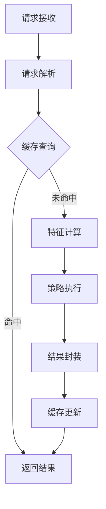
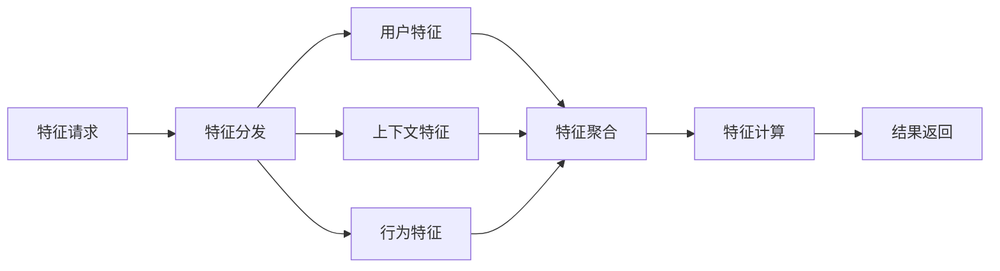
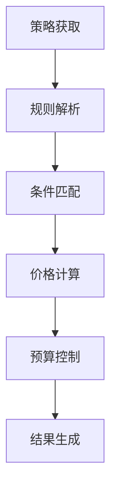

# 广告投放引擎性能设计

## 1. 性能目标

### 1.1 核心指标
| 指标类型 | 指标名称       | 指标值  | 说明                   | 监控周期 | 告警阈值 |
| -------- | -------------- | ------- | ---------------------- | -------- | -------- |
| 延迟指标 | P99延迟        | < 50ms  | 请求处理总延迟         | 实时     | > 50ms   |
| 延迟指标 | P95延迟        | < 30ms  | 请求处理总延迟         | 实时     | > 30ms   |
| 延迟指标 | 平均延迟       | < 20ms  | 请求处理平均延迟       | 实时     | > 20ms   |
| 吞吐指标 | 峰值QPS        | > 50000 | 单集群最大请求处理能力 | 实时     | < 45000  |
| 吞吐指标 | 平均QPS        | > 20000 | 单集群稳定处理能力     | 分钟     | < 18000  |
| 资源指标 | CPU使用率      | < 70%   | 单机CPU使用率          | 分钟     | > 75%    |
| 资源指标 | 内存使用率     | < 80%   | 单机内存使用率         | 分钟     | > 85%    |
| 资源指标 | 网络带宽使用率 | < 70%   | 单机网络带宽使用率     | 分钟     | > 80%    |
| 缓存指标 | 缓存命中率     | > 95%   | 所有级别缓存综合命中率 | 分钟     | < 90%    |
| 缓存指标 | 缓存延迟       | < 5ms   | 缓存访问延迟           | 实时     | > 10ms   |

### 1.2 可用性指标
| 指标类型 | 指标名称       | 指标值     | 说明             | 统计周期 | 告警阈值  |
| -------- | -------------- | ---------- | ---------------- | -------- | --------- |
| 可用性   | 系统可用性     | > 99.99%   | 系统整体可用性   | 天       | < 99.99%  |
| 可用性   | 接口可用性     | > 99.995%  | 核心接口可用性   | 天       | < 99.995% |
| 恢复能力 | 故障恢复时间   | < 1min     | 自动恢复时间     | 次       | > 2min    |
| 一致性   | 数据一致性延迟 | < 1s       | 数据同步延迟     | 实时     | > 2s      |
| 降级时间 | 服务降级时间   | < 10min/月 | 每月累计降级时间 | 月       | > 15min   |

## 2. 性能优化设计

### 2.1 请求处理优化

#### 多级缓存架构
- 本地缓存
  * JVM 堆内缓存
  * 堆外内存缓存
  * 淘汰策略：LRU
  
- 分布式缓存
  * Redis 集群
  * 数据分片策略
  * 热点数据复制

#### 多级缓存参数配置
| 缓存层级     | 容量  | 过期时间 | 淘汰策略   | 最大延迟 | 命中率目标 |
| ------------ | ----- | -------- | ---------- | -------- | ---------- |
| JVM堆内缓存  | 4GB   | 1分钟    | LRU        | 1ms      | > 90%      |
| 堆外内存缓存 | 8GB   | 5分钟    | LRU        | 2ms      | > 85%      |
| Redis集群    | 512GB | 动态配置 | 按业务配置 | 5ms      | > 95%      |

#### 并发处理优化
- 线程池设计
  * 核心线程数：CPU核心数 * 2
  * 最大线程数：CPU核心数 * 4
  * 任务队列：有界队列
  * 拒绝策略：快速失败

- 异步处理机制
  * 非关键路径异步化
  * 批量处理优化
  * 结果异步聚合
  * 超时控制机制

#### 线程池配置参数
| 参数名称   | 配置值        | 说明         | 调整策略          | 监控指标   |
| ---------- | ------------- | ------------ | ----------------- | ---------- |
| 核心线程数 | CPU核心数 * 2 | 常驻线程数   | 根据CPU使用率调整 | 线程使用率 |
| 最大线程数 | CPU核心数 * 4 | 最大线程数   | 根据负载调整      | 线程池满率 |
| 队列容量   | 10000         | 任务队列容量 | 根据内存调整      | 队列使用率 |
| 空闲时间   | 60s           | 线程回收时间 | 根据负载调整      | 线程回收率 |

### 2.2 特征计算优化

#### 计算优化策略
- 特征预计算
  * 离线计算任务
  * 增量更新机制
  * 实时特征合并
  
- 计算并行化
  * 特征并行获取
  * 多维度并行计算
  * 结果并行聚合

### 2.3 策略执行优化

#### 规则执行优化
- 规则预编译
  * 规则解析缓存
  * 表达式编译缓存
  * 执行计划优化

- 批量处理机制
  * 规则批量执行
  * 结果批量处理
  * 数据批量写入

## 3. 容量规划

### 3.1 资源评估
- 计算资源需求
  * CPU：32核心/实例
  * 内存：64GB/实例
  * 网络：10Gbps
  * 磁盘：SSD，500GB

#### 服务器配置要求
| 资源类型 | 最小配置 | 推荐配置 | 说明     | 扩展建议                 |
| -------- | -------- | -------- | -------- | ------------------------ |
| CPU      | 16核     | 32核     | x86架构  | 当单核心使用率>70%时扩容 |
| 内存     | 32GB     | 64GB     | DDR4     | 当使用率>80%时扩容       |
| 网络带宽 | 5Gbps    | 10Gbps   | 万兆网卡 | 当使用率>70%时扩容       |
| 系统盘   | 200GB    | 500GB    | SSD      | 当使用率>70%时扩容       |
| 数据盘   | 500GB    | 1TB      | SSD      | 当使用率>70%时扩容       |

- 缓存资源配置
  * 本地缓存：16GB/实例
  * Redis集群：512GB
  * 连接池：1000/实例

#### 缓存资源配置
| 资源类型  | 单实例配置 | 集群总容量 | 说明         | 扩展建议            |
| --------- | ---------- | ---------- | ------------ | ------------------- |
| 本地缓存  | 16GB       | -          | 单机本地     | 根据命中率调整      |
| Redis主从 | 32GB       | 512GB      | 主从架构     | 当使用率>70%时扩容  |
| Redis集群 | 16GB       | 256GB      | 集群架构     | 当分片数>1000时扩容 |
| 连接池    | 1000/实例  | -          | 单实例连接数 | 当使用率>80%时扩容  |

### 3.2 扩展策略
- 水平扩展
  * 无状态服务设计
  * 自动扩缩容策略
  * 负载均衡机制
  * 数据一致性保证

- 限流降级
  * 入口限流策略
  * 服务降级方案
  * 过载保护机制
  * 优雅降级设计

## 4. 监控与告警

### 4.1 监控指标
- 核心性能指标
  * RT分布统计
  * QPS监控
  * 错误率统计
  * 资源使用率

#### 核心性能监控指标
| 指标类型 | 指标名称   | 采集周期 | 统计维度  | 告警阈值 | 处理策略 |
| -------- | ---------- | -------- | --------- | -------- | -------- |
| 延迟分布 | P99延迟    | 1s       | 实例/集群 | > 50ms   | 自动扩容 |
| 延迟分布 | P95延迟    | 1s       | 实例/集群 | > 30ms   | 自动扩容 |
| 吞吐量   | QPS        | 1s       | 实例/集群 | 超出80%  | 自动扩容 |
| 错误率   | 请求错误率 | 1s       | 实例/集群 | > 0.1%   | 自动切换 |
| 资源使用 | CPU使用率  | 1分钟    | 实例      | > 75%    | 自动扩容 |
| 资源使用 | 内存使用率 | 1分钟    | 实例      | > 85%    | 自动扩容 |
| 资源使用 | 网络流量   | 1分钟    | 实例      | > 80%    | 自动扩容 |

- 业务指标监控
  * 请求成功率
  * 缓存命中率
  * 特征计算耗时
  * 规则执行耗时

#### 业务监控指标
| 指标类型 | 指标名称     | 采集周期 | 统计维度 | 告警阈值 | 处理策略 |
| -------- | ------------ | -------- | -------- | -------- | -------- |
| 请求处理 | 成功率       | 1分钟    | 业务线   | < 99.99% | 人工介入 |
| 缓存性能 | 命中率       | 1分钟    | 缓存维度 | < 90%    | 自动预热 |
| 计算性能 | 特征计算耗时 | 1s       | 特征维度 | > 10ms   | 自动优化 |
| 规则执行 | 规则处理耗时 | 1s       | 规则维度 | > 5ms    | 自动优化 |

### 4.2 告警策略
- 实时告警
  * 延迟阈值告警
  * 错误率告警
  * 资源耗尽告警
  * 服务降级告警

#### 实时告警配置
| 告警类型 | 告警指标   | 检测周期 | 告警级别 | 触发条件 | 恢复条件 |
| -------- | ---------- | -------- | -------- | -------- | -------- |
| 容量告警 | CPU使用率  | 1分钟    | P1       | > 80%    | < 70%    |
| 容量告警 | 内存使用率 | 1分钟    | P1       | > 85%    | < 75%    |
| 性能告警 | P99延迟    | 1分钟    | P1       | > 100ms  | < 50ms   |
| 性能告警 | 错误率     | 1分钟    | P0       | > 1%     | < 0.1%   |
| 业务告警 | 请求成功率 | 5分钟    | P1       | < 99.9%  | > 99.99% |
| 业务告警 | 缓存命中率 | 5分钟    | P2       | < 85%    | > 95%    |

- 趋势告警
  * QPS异常波动
  * 延迟趋势异常
  * 资源使用趋势
  * 服务质量下降

## 5. 性能测试方案

### 5.1 测试场景
- 基准测试
  * 单机性能基线
  * 集群性能评估
  * 资源利用评估
  * 稳定性验证

- 压力测试
  * 最大QPS测试
  * 长期稳定性测试
  * 故障恢复测试
  * 极限并发测试

### 5.2 监控与分析
- 性能分析
  * CPU profile分析
  * 内存使用分析
  * GC行为分析
  * 线程堆栈分析

- 瓶颈定位
  * 资源瓶颈识别
  * 调用链路分析
  * 慢查询分析
  * 并发冲突分析