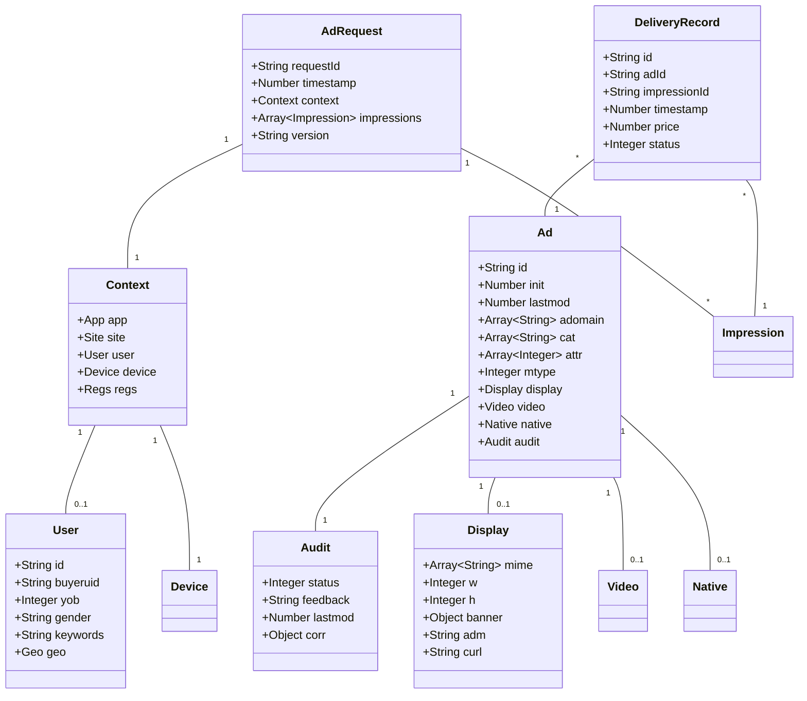
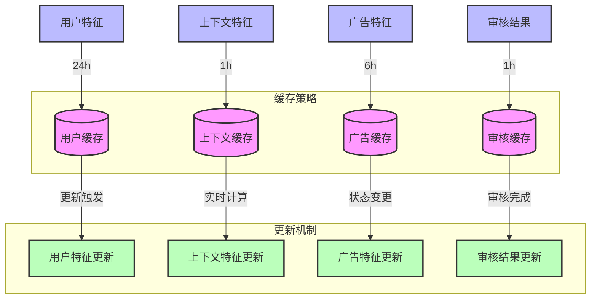

# 广告投放引擎数据模型设计

## 1. 核心数据模型

### 1.0 对象关系模型



### 1.1 广告请求模型 (AdRequest)

| 字段名      | 类型   | 必填 | 描述             | 示例值                                 | 取值范围/说明        |
| ----------- | ------ | ---- | ---------------- | -------------------------------------- | -------------------- |
| requestId   | string | 是   | 请求唯一标识     | "550e8400-e29b-41d4-a716-446655440000" | UUID格式             |
| timestamp   | number | 是   | 请求时间戳(毫秒) | 1612345678901                          | 当前时间前后5分钟内  |
| context     | object | 是   | 请求上下文信息   | -                                      | 见Context对象说明    |
| impressions | array  | 是   | 展示位信息列表   | -                                      | 见Impression对象说明 |
| version     | string | 是   | API版本号        | "1.0"                                  | 当前支持版本: 1.0    |

#### Context 对象说明

| 字段名 | 类型   | 必填 | 描述     | 示例值 | 取值范围/说明    |
| ------ | ------ | ---- | -------- | ------ | ---------------- |
| app    | object | 否   | App信息  | -      | App场景必填      |
| site   | object | 否   | 网站信息 | -      | Web场景必填      |
| user   | object | 否   | 用户信息 | -      | 见User对象说明   |
| device | object | 是   | 设备信息 | -      | 见Device对象说明 |
| regs   | object | 否   | 法规信息 | -      | 见Regs对象说明   |

#### User 对象说明

| 字段名   | 类型    | 必填 | 描述       | 示例值          | 取值范围/说明       |
| -------- | ------- | ---- | ---------- | --------------- | ------------------- |
| id       | string  | 否   | 用户ID     | "u123456"       | 平台用户唯一标识    |
| buyeruid | string  | 否   | DSP用户ID  | "d123456"       | DSP的用户唯一标识   |
| yob      | integer | 否   | 出生年份   | 1990            | 1900-当前年份       |
| gender   | string  | 否   | 性别       | "M"             | M(男),F(女),O(其他) |
| keywords | string  | 否   | 用户关键词 | "sports,travel" | 逗号分隔的关键词    |
| geo      | object  | 否   | 地理位置   | -               | 见Geo对象说明       |

### 1.2 广告对象模型 (Ad)

| 字段名  | 类型    | 必填 | 描述           | 示例值          | 取值范围/说明             |
| ------- | ------- | ---- | -------------- | --------------- | ------------------------- |
| id      | string  | 是   | 广告ID         | "ad123456"      | 广告主/平台定义的唯一标识 |
| init    | number  | 是   | 初始创建时间   | 1612345678901   | 毫秒时间戳                |
| lastmod | number  | 是   | 最后修改时间   | 1612345678901   | 毫秒时间戳                |
| adomain | array   | 是   | 广告主域名列表 | ["example.com"] | 广告主根域名              |
| cat     | array   | 否   | 广告类目列表   | ["IAB1-1"]      | IAB内容分类               |
| attr    | array   | 否   | 广告属性列表   | [1,2]           | 见IAB属性枚举             |
| mtype   | integer | 否   | 媒体类型       | 1               | 1:图片,2:视频,3:原生      |
| display | object  | 条件 | 展示广告信息   | -               | 展示广告必填              |
| video   | object  | 条件 | 视频广告信息   | -               | 视频广告必填              |
| native  | object  | 条件 | 原生广告信息   | -               | 原生广告必填              |
| audit   | object  | 是   | 审核信息       | -               | 见Audit对象说明           |

#### Display 对象说明

| 字段名 | 类型    | 必填 | 描述           | 示例值         | 取值范围/说明    |
| ------ | ------- | ---- | -------------- | -------------- | ---------------- |
| mime   | array   | 是   | 支持的媒体类型 | ["image/jpeg"] | MIME类型列表     |
| w      | integer | 是   | 宽度           | 300            | 像素值           |
| h      | integer | 是   | 高度           | 250            | 像素值           |
| banner | object  | 条件 | 横幅广告信息   | -              | 简单图片广告必填 |
| adm    | string  | 条件 | 广告HTML标签   | "<!-- ad -->"  | HTML广告必填     |
| curl   | string  | 条件 | 广告素材URL    | "http://..."   | 第三方广告必填   |

### 1.3 审核对象模型 (Audit)

| 字段名   | 类型    | 必填 | 描述         | 示例值        | 取值范围/说明                                   |
| -------- | ------- | ---- | ------------ | ------------- | ----------------------------------------------- |
| status   | integer | 是   | 审核状态     | 1             | 1:待审核,2:审核中,3:通过,4:拒绝,5:需修改,6:过期 |
| feedback | string  | 否   | 审核反馈     | "违规内容"    | 审核意见说明                                    |
| lastmod  | number  | 是   | 最后更新时间 | 1612345678901 | 毫秒时间戳                                      |
| corr     | object  | 否   | 修正信息     | -             | 平台修正的广告信息                              |

### 1.4 投放记录模型 (DeliveryRecord)

| 字段名       | 类型    | 必填 | 描述     | 示例值        | 取值范围/说明            |
| ------------ | ------- | ---- | -------- | ------------- | ------------------------ |
| id           | string  | 是   | 记录ID   | "r123456"     | 唯一标识                 |
| adId         | string  | 是   | 广告ID   | "ad123456"    | 关联的广告ID             |
| impressionId | string  | 是   | 展示ID   | "imp123456"   | 关联的展示请求ID         |
| timestamp    | number  | 是   | 投放时间 | 1612345678901 | 毫秒时间戳               |
| price        | number  | 是   | 结算价格 | 2.5           | 单位:元,精确到0.01       |
| status       | integer | 是   | 投放状态 | 1             | 1:成功,2:失败,3:部分成功 |

## 2. 缓存数据结构

### 2.1 特征缓存结构

| 字段名 | 类型   | 必填 | 描述     | 示例值        | 取值范围/说明   |
| ------ | ------ | ---- | -------- | ------------- | --------------- |
| key    | string | 是   | 缓存键   | "f:u123456"   | 特征类型:ID     |
| type   | string | 是   | 特征类型 | "user"        | user/context/ad |
| value  | object | 是   | 特征数据 | -             | 特征具体内容    |
| expire | number | 是   | 过期时间 | 1612345678901 | 毫秒时间戳      |

### 2.2 索引设计

#### 请求索引
```sql
-- 广告投放记录索引
CREATE INDEX idx_delivery_ad ON delivery_record(ad_id, timestamp);
CREATE INDEX idx_delivery_imp ON delivery_record(impression_id, timestamp);

-- 特征匹配索引
CREATE INDEX idx_feature_user ON feature_match(user_id, type);
CREATE INDEX idx_feature_context ON feature_match(context_id, type);
```

#### 审核状态索引
```sql
-- 广告审核状态索引
CREATE INDEX idx_audit_status ON ad(audit.status, audit.lastmod);
CREATE INDEX idx_audit_adomain ON ad(adomain, audit.status);
```

### 2.3 对象缓存关系图



### 2.4 缓存策略

#### 缓存键设计
- 用户特征缓存键: `user:{userId}:feature`
- 上下文特征缓存键: `context:{contextId}:feature`
- 广告特征缓存键: `ad:{adId}:feature`
- 审核结果缓存键: `audit:{adId}:result`

#### 缓存生命周期
- 用户特征: 24小时
- 上下文特征: 1小时
- 广告特征: 6小时
- 审核结果: 1小时

#### 缓存更新策略
1. 用户特征更新
   - 登录触发更新
   - 行为变化触发更新
   - 定时任务批量更新
   
2. 上下文特征更新
   - 请求时实时计算
   - 相似场景共享
   - 热点场景预加载

3. 广告特征更新
   - 创建时生成缓存
   - 修改时强制更新
   - 审核状态变更时更新

4. 审核结果更新
   - 审核完成时更新
   - 定时任务检查过期
   - 状态变更时更新