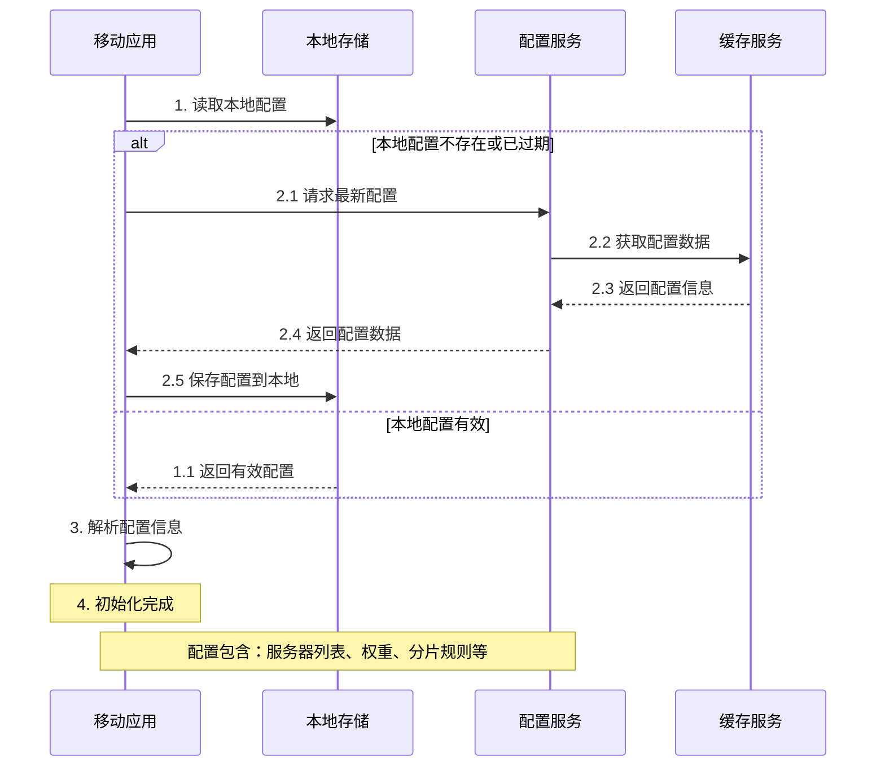
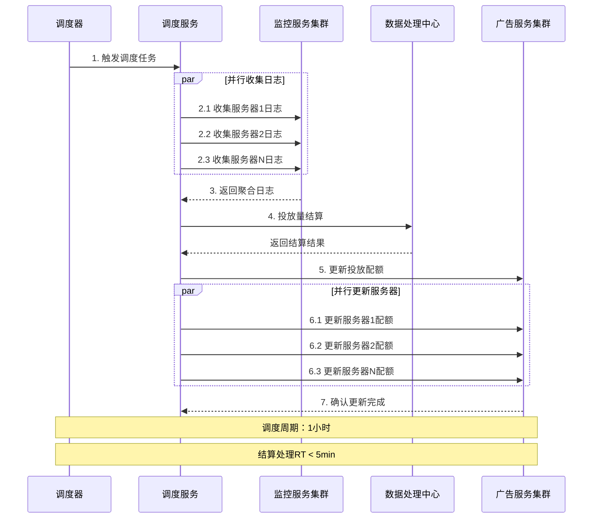
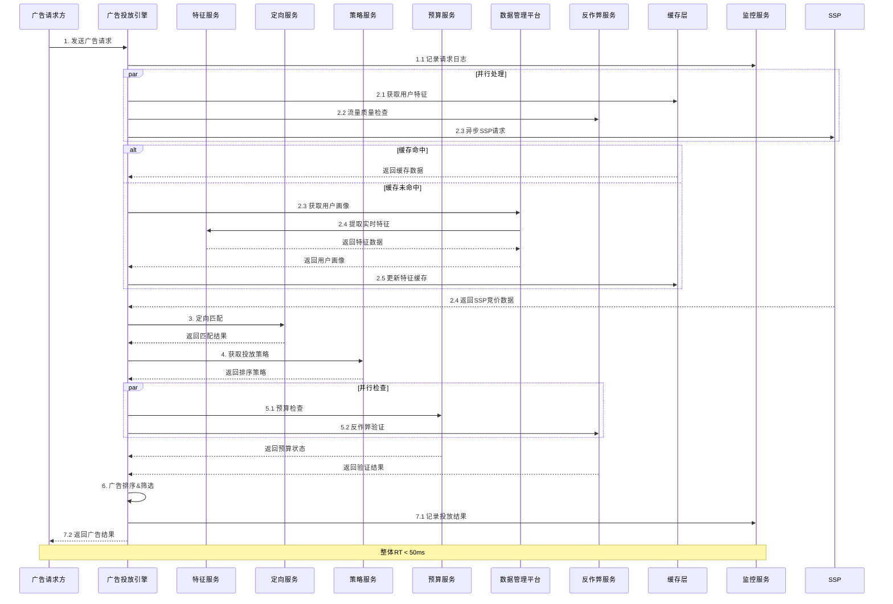
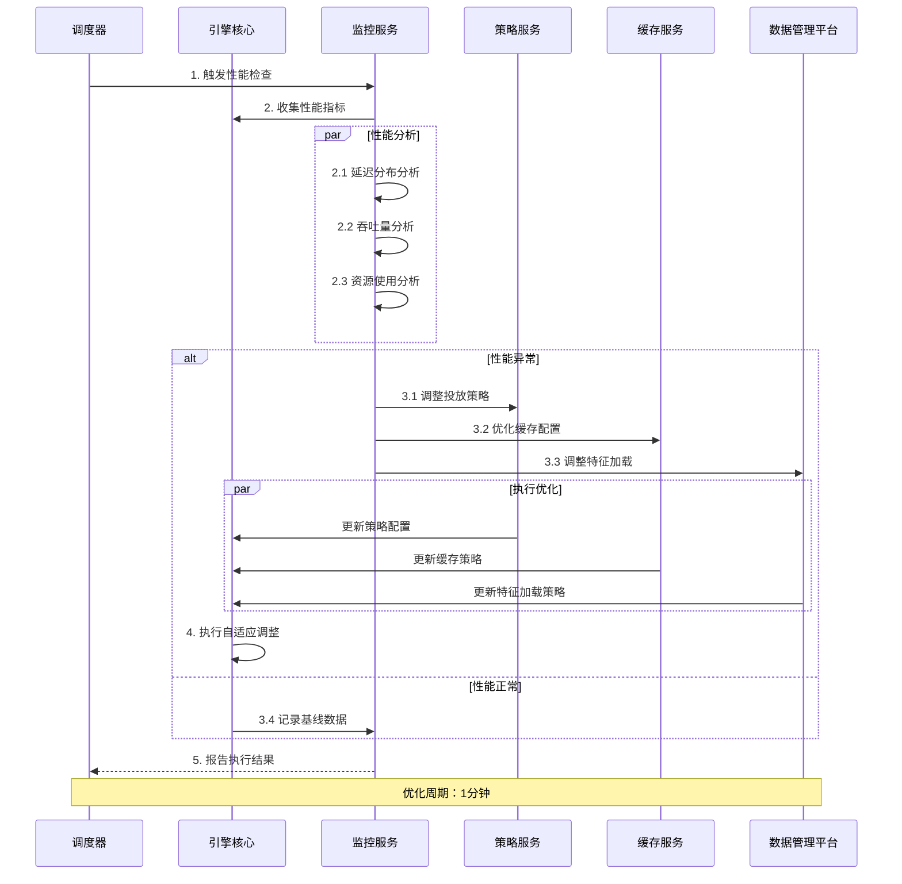
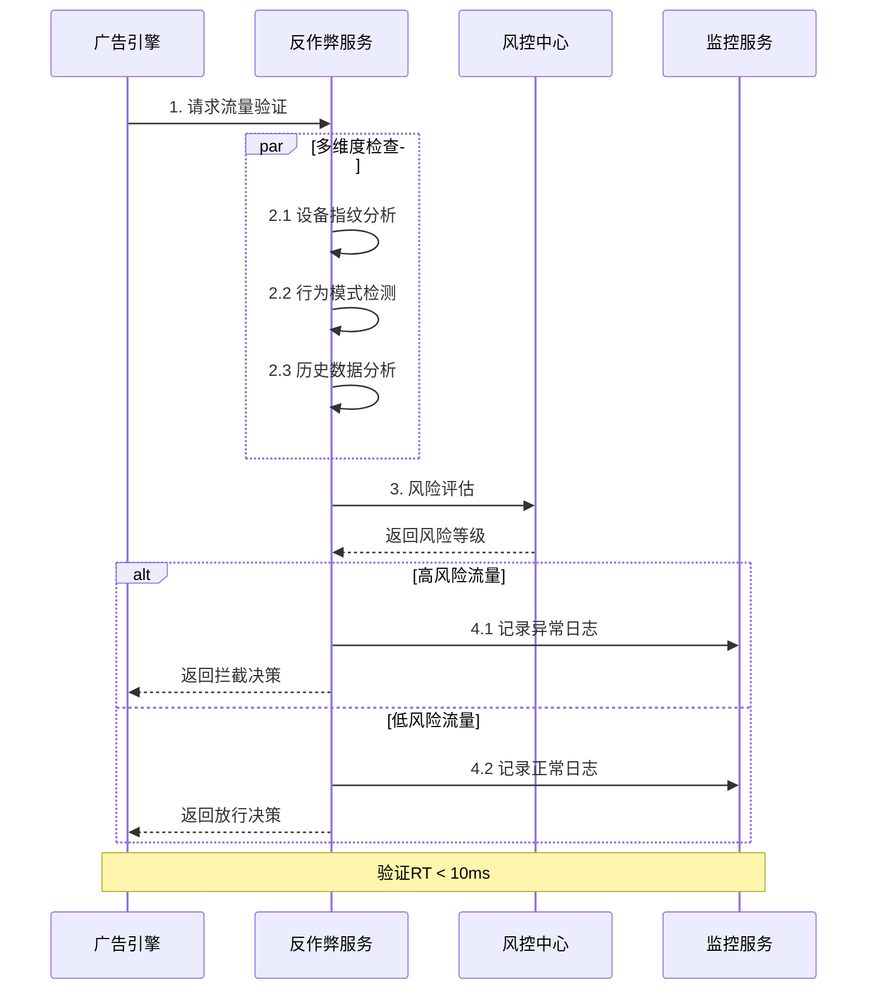
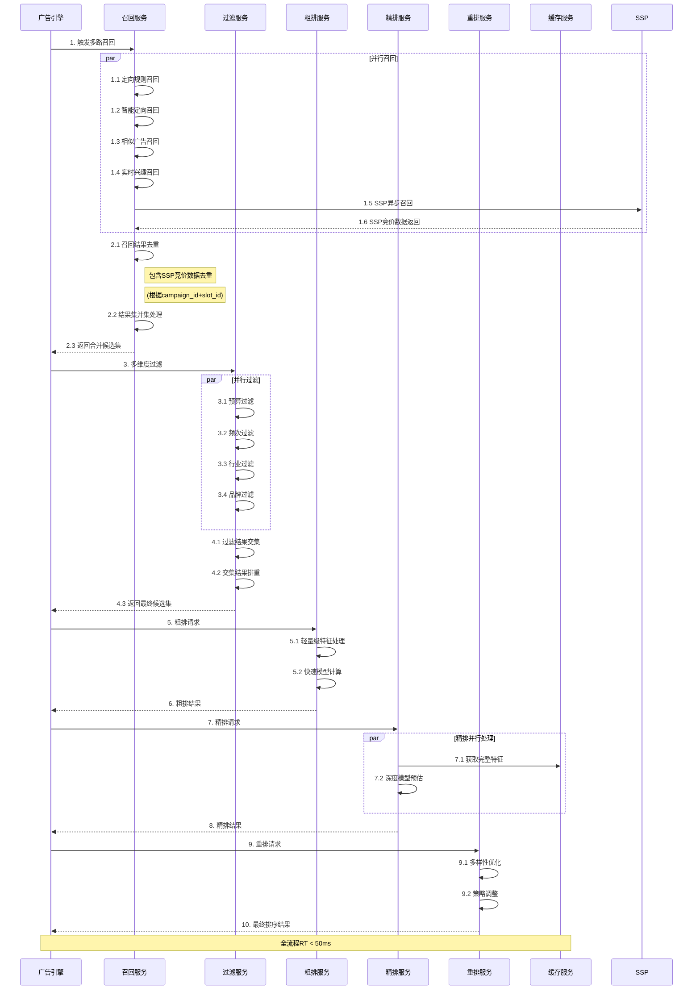

# 广告投放引擎时序交互设计

## 1. APP初始化配置流程

### 1.1 流程概述
这个阶段主要解决APP在启动时如何获取正确的广告配置,保证广告功能正常运行。主要包含以下业务目标:

1. 配置快速生效
   - 优先读取本地配置,实现快速启动
   - 检测配置是否需要更新,确保使用最新策略
   - 增量更新配置,减少网络传输
   - 配置更新后即时生效

2. 配置安全可靠
   - 本地配置加密存储,防止篡改
   - 配置签名校验,确保来源可信
   - 配置版本管理,支持回滚
   - 异常情况使用默认配置

3. 用户体验保障
   - 启动过程无感知卡顿
   - 配置更新不影响当前操作
   - 弱网环境下也能正常使用
   - 确保广告功能连续可用

### 1.2 流程图示

### 1.3 详细流程说明

#### 1.3.1 初始配置获取
- 用户首次打开APP
  * 无本地配置时自动从服务器获取初始配置 
  * 获取配置期间展示品牌加载页面
  * 配置获取完成后进入应用首页
  * 后台完成配置的本地存储

- 常规启动流程
  * 优先加载本地配置确保快速启动
  * 后台检查配置版本是否需要更新
  * 若需更新则异步进行配置更新
  * 更新完成后在合适时机切换配置

#### 1.3.2 配置更新策略
- 定时更新检查
  * 每日固定时段检查配置更新
  * 用户活跃时段内错峰更新
  * 配置更新异步执行不影响用户操作
  * 更新失败后有自动重试机制

- 条件触发更新  
  * 版本升级后强制检查配置更新
  * 长期未更新配置时触发检查
  * 关键配置变更时接收服务端通知更新
  * 配置校验失败时触发更新

#### 1.3.3 配置容灾保障
- 异常场景处理
  * 网络异常时使用本地缓存配置
  * 服务不可用时使用默认配置
  * 配置解析异常时进行自动修复
  * 提供紧急配置回滚机制

- 配置质量保障
  * 配置发布前进行自动化校验
  * 逐步放量观察配置效果
  * 问题配置及时回滚
  * 保持可用配置副本

## 2 广告调度流程

### 2.1 业务价值

这个阶段主要解决广告投放过程中的资源调度问题,确保广告投放的稳定性和效率。主要包含以下业务目标:

1. 投放节奏控制
   - 预算平滑分配,避免突发消耗
   - 重点时段运营保障
   - 投放优先级管理
   - 流量价值最大化

2. 系统负载均衡  
   - 服务器资源合理分配
   - 峰值流量可靠承载
   - 故障自动转移恢复
   - 服务质量稳定保障

3. 数据一致性保证
   - 投放数据准确记录
   - 预算额度实时统计
   - 计费数据可靠性
   - 账务数据一致性

### 2.2 调度流程图

### 2.3 关键环节说明

#### 2.3.1 调度策略执行
- 常规调度周期
  * 每小时调度：适用于预算充足的常规计划
  * 半小时调度：适用于大额预算的重点广告
  * 15分钟调度：适用于竞价出价实时调整
  * 5分钟调度：适用于节假日等特殊时期

- 特殊调度触发
  * 重大营销活动预热
  * 突发热点事件响应
  * 客户投诉应急处理
  * 系统异常恢复同步

- 智能调度优化
  * 基于历史数据预测峰值
  * 根据实时流量动态调整
  * 重点客户个性化调度
  * 关键时段优先保障

#### 2.3.2 投放数据处理 
- 数据采集维度
  * 广告展示数据
    - 展示时间和位置
    - 广告内容信息
    - 用户基础画像
    - 展示场景数据

  * 互动行为数据
    - 点击行为记录
    - 到达页面信息
    - 交互路径跟踪
    - 转化行为记录

  * 消耗数据统计
    - 预算使用情况
    - 计费类型统计
    - 消耗金额核算
    - 效果数据分析

## 3. 广告请求处理链路

### 3.1 请求参数验证
- 必要参数校验
  * 广告位参数
    - 广告位ID
    - 广告位类型
    - 展示页面类型
    - 广告位尺寸
  * 设备信息
    - 设备ID
    - 操作系统
    - 网络环境
    - 屏幕分辨率
  * 用户信息
    - 用户ID(可选)
    - 地理位置信息
    - 时间戳
    - 渠道来源

### 3.2 广告规格说明
#### 3.2.1 展示位置规格
- 广告位尺寸（宽x高）
- 广告位位置（顶部/底部/插屏等）
- 广告位类型（Banner/视频/信息流等）
- 展示页面类型（首页/列表页/详情页等）

#### 3.2.2 素材规格要求
- 图片尺寸限制
- 视频时长限制
- 文件大小限制
- 素材格式要求（JPG/PNG/MP4等）
- 图文比例要求

#### 3.2.3 内容展示规格
- 标题字数限制
- 描述文字限制
- Logo展示要求
- 角标展示规则
- 动画效果支持

#### 3.2.4 交互规格
- 点击跳转方式
- 落地页类型限制
- 触发事件定义
- 手势响应要求
- 关闭按钮要求

#### 3.2.5 加载性能规格
- 素材加载超时限制
- 预加载要求
- 缓存策略要求
- 带宽占用限制
- 渲染性能要求

### 3.3 实时请求处理流程

### 3.4 关键节点设计

#### 特征获取流程
- 缓存查询策略
  * 多级缓存设计
    - L1: 本地内存缓存(10ms)
    - L2: Redis集群缓存(50ms)
    - L3: 持久化存储(100ms)
  * 缓存预热机制
    - 定时预热热门特征
    - 按流量自适应调整
  * 缓存更新策略
    - 定期更新
    - 实时更新阈值控制
    - 异步更新机制

- 特征计算处理
  * 实时特征提取
    - 行为特征计算
    - 上下文特征提取
    - 环境特征采集
  * 特征组合计算
    - 多维特征融合
    - 特征权重动态调整
    - 特征有效期管理
  * 特征数据同步
    - 增量更新机制
    - 全量同步策略
    - 版本一致性保证

#### 策略执行流程
- 定向匹配
  * 用户特征匹配
    - 人群包匹配
    - 标签匹配
    - 行为匹配
  * 上下文匹配
    - 时间地点匹配
    - 场景匹配
    - 设备匹配
  * 智能定向
    - 相似人群扩展
    - 兴趣模型匹配
    - 转化预估

##### 定向匹配条件类型
1. 人口属性定向
   - 年龄段
   - 性别
   - 教育程度
   - 职业类型
   - 收入水平
   - 婚恋状况

2. 地理位置定向
   - 国家/地区
   - 省份/直辖市
   - 城市等级
   - 商圈位置
   - 精确坐标
   - GPS区域

3. 行为兴趣定向
   - 历史浏览行为
   - 搜索关键词
   - 购物偏好
   - APP使用习惯
   - 兴趣标签
   - 场景行为

4. 设备定向
   - 操作系统
   - 设备品牌
   - 机型价位
   - 网络环境
   - 运营商
   - 设备类型

5. 时间定向
   - 投放时段
   - 周期设置
   - 节假日
   - 季节性
   - 活动时间

6. 场景定向
   - APP分类
   - 使用场景
   - 用户状态
   - 天气条件
   - 温度范围

7. 社交属性定向
   - 社交影响力
   - 社交活跃度
   - 社交圈层
   - 兴趣社群

8. 消费能力定向
   - 消费等级
   - 购买力指数
   - 消费频次
   - 品类偏好
   - 价格敏感度

9. 智能定向
   - 相似用户群
   - 购买意向强度
   - 转化倾向
   - 品牌亲和度
   - AI预测人群

- 投放策略执行
  * 广告排序策略
    - 出价排序
    - 质量度排序
    - 综合得分排序
  * 流量分配策略
    - 预算控制
    - 频次控制
    - 流量分配优化
  * 投放优化策略
    - ROI优化
    - 转化率优化
    - 点击率优化

## 4. 引擎内部优化流程

### 4.1 性能优化时序

### 4.2 优化执行节点

#### 性能监控分析
- 指标采集
  * RT分布统计
    - 平均响应时间
    - 分位值统计(P99/P95)
    - 超时率监控
  * QPS监控
    - 总请求量
    - 成功率统计
    - 峰值分析
  * 资源使用率
    - CPU使用率
    - 内存使用率
    - 网络IO状况
  * 业务指标
    - 广告填充率
    - 定向成功率
    - 策略命中率

- 性能诊断
  * 瓶颈识别
    - 调用链分析
    - 资源瓶颈定位
    - 性能热点识别
  * 异常检测
    - 时延异常检测
    - 错误率监控
    - 资源异常告警
  * 趋势分析
    - 容量预测
    - 性能趋势分析
    - 资源使用预测

#### 自适应优化
- 资源调度优化
  * 线程池动态调整
    - 核心线程数调整
    - 队列大小优化
    - 拒绝策略配置
  * 内存使用优化
    - 缓存大小调整
    - 内存回收策略
    - 对象池优化
  * 连接池管理
    - 连接数动态调整
    - 超时时间优化
    - 重试策略配置

- 策略动态调整
  * 超时阈值调整
    - 服务超时配置
    - 降级阈值设置
    - 重试间隔调整
  * 并发度控制
    - 请求限流策略
    - 并发度动态调整
    - 队列调度优化
  * 熔断策略更新
    - 错误率阈值调整
    - 熔断恢复策略
    - 降级方案优化

## 5. 反作弊流程

### 5.1 流量质量控制

### 5.2 反作弊策略
- 实时检测
  * 设备环境检测
  * 用户行为分析
  * 点击模式识别
  * 流量来源验证
- 离线分析
  * 历史行为分析
  * 聚类分析
  * 规则挖掘
  * 黑名单管理

## 6. 监控告警流程

### 6.1 实时监控
- 核心指标
  * 系统指标监控
    - CPU/内存/磁盘
    - 网络延迟/丢包
    - 连接池状态
  * 业务指标监控
    - 请求量/成功率
    - 广告填充率
    - 定向转化率
  * 质量指标监控
    - 响应时延
    - 错误率统计
    - 并发量监控

### 6.2 告警处理
- 告警规则
  * 阈值告警
    - 静态阈值
    - 动态阈值
    - 同环比异常
  * 趋势告警
    - 突增突降检测
    - 周期性异常
    - 趋势预警
  * 组合告警
    - 多指标组合
    - 告警关联分析
    - 告警风暴抑制

- 处理流程
  * 告警触发
    - 告警级别划分
    - 告警渠道配置
    - 告警合并策略
  * 问题诊断
    - 根因定位
    - 影响面分析
    - 处理建议生成
  * 自动恢复
    - 自动化处理
    - 降级策略
    - 人工确认

## 7. 智能决策流程

### 7.1 整体流程时序

### 7.2 多路召回设计
1. 召回并集处理
   * 结果合并策略
     - 多路召回结果去重
     - SSP竞价数据去重（根据campaign_id+slot_id）
     - 广告ID唯一性检查
     - 合并优先级控制
     - 异步结果超时补偿机制
   * 并集优化
     - 高效集合运算
     - 内存使用优化
     - 并发合并处理

2. 定向规则召回
   * 定向规则匹配
     - 人群画像匹配
     - 地域定向匹配
     - 兴趣定向匹配
   * 规则优化策略
     - 规则预处理
     - 索引优化
     - 并行匹配

3. 智能定向召回
   * 相似受众扩展
     - Look-alike模型
     - 协同过滤
     - 兴趣扩展
   * 场景智能匹配
     - 场景识别
     - 实时意图识别
     - 环境因素匹配

4. 相似广告召回
   * 广告相似度计算
     - 内容相似度
     - 目标人群相似度
     - 效果相似度
   * 历史效果关联
     - CTR表现关联
     - 转化效果关联
     - ROI表现关联

5. SSP异步召回
   * 异步触发机制
     - 预竞价数据获取
     - SSP接口异步调用
     - 超时控制策略
   * 数据处理流程
     - 响应结果解析
     - 竞价数据预处理
     - 优先级队列管理

6. 实时兴趣召回
   * 实时行为分析
     - 浏览行为序列
     - 搜索关键词
     - 点击行为
   * 兴趣衰减模型
     - 时间衰减函数
     - 权重动态调整
     - 新鲜度计算

### 7.3 多维度过滤
1. 过滤交集处理
   * 交集计算策略
     - 多维过滤结果合并
     - 交集计算性能优化
     - 过滤条件优先级
   * 结果优化
     - 增量过滤处理
     - 快速集合运算
     - 空集快速返回

2. 预算过滤
   * 预算余量检查
     - 日预算检查
     - 总预算检查
     - 预算消耗速度
   * 智能调控
     - 预算平滑分配
     - 流量预估控制
     - ROI目标控制

3. 频次过滤
   * 展示频次控制
     - 用户维度频次
     - 设备维度频次
     - 时间窗口控制
   * 智能频次
     - 效果衰减模型
     - 用户反馈调整
     - 场景自适应

4. 行业过滤
   * 行业竞品控制
     - 同行业广告间隔
     - 竞品屏蔽规则
     - 类目均衡投放
   * 合规审核
     - 行业准入检查
     - 资质审核
     - 内容安全检查

5. 品牌过滤
   * 品牌安全控制
     - 品牌屏蔽规则
     - 品牌竞争规则
     - 品牌调性匹配
   * 品牌价值
     - 品牌等级划分
     - 品牌声誉评估
     - 品牌适应度

### 7.4 粗排设计
1. 特征工程
   * 轻量级特征
     - 基础统计特征
     - 简单组合特征
     - 历史效果特征
   * 快速处理
     - 特征预计算
     - 维度规约
     - 实时特征选择

2. 模型设计
   * 模型选型
     - LR/GBDT等轻量模型
     - 基础特征交叉
     - 增量学习策略
   * 性能优化
     - 模型压缩
     - 批量预估优化
     - 计算资源控制

### 7.5 精排设计
1. 完整特征处理
   * 多维度特征
     - 用户画像特征
     - 广告属性特征
     - 上下文场景特征
     - 交叉组合特征
   * 特征预处理
     - 归一化处理
     - 编码转换
     - 缺失值处理

2. 深度模型预估
   * 模型架构
     - DeepFM/DIN/DCN等
     - 注意力机制
     - 序列建模
   * 训练优化
     - 样本质量优化
     - 参数自动调优
     - 模型蒸馏加速

3. 多目标优化
   * 多目标模型
     - CTR预估模型
     - CVR预估模型
     - ROI预估模型
   * 平衡策略
     - ESMM架构
     - MMoE机制
     - PLE策略

### 7.6 重排设计
1. 多样性优化
   * 创意多样性
     - 素材类型均衡
     - 展示样式多样
     - 内容差异控制
   * 品类多样性
     - 行业均衡投放
     - 品类穿插控制
     - 竞品均衡策略

2. 策略调整
   * 商业策略
     - 收益最大化
     - 流量价值评估
     - 生态均衡维护
   * 体验优化
     - 用户反馈利用
     - 疲劳度控制
     - 兴趣探索机制

3. 实验策略
   * 流量分配
     - A/B测试设计
     - 分桶实验控制
     - 探索流量预留
   * 效果评估
     - 短期转化指标
     - 长期价值指标
     - 生态健康指标

## 8. 实时监控告警

### 8.1 监控指标体系
#### 系统层指标
- 基础资源监控
  * CPU使用率（阈值：80%）
  * 内存使用率（阈值：75%）
  * 磁盘IO（阈值：70%）
  * 网络吞吐量
- 服务层监控
  * 服务响应时间
    - P99 < 50ms
    - P95 < 30ms
    - 平均RT < 20ms
  * 服务成功率
    - 总体成功率 > 99.99%
    - 核心接口 > 99.999%
  * 服务容量
    - QPS峰值
    - 并发连接数
    - 队列深度

#### 业务层指标
- 广告投放指标
  * 填充率监控
    - 整体填充率
    - 分渠道填充率
    - 分广告位填充率
  * 定向效果
    - 定向人群覆盖率
    - 定向规则命中率
    - 智能定向效果
  * 投放质量
    - 创意质量分
    - 相关性得分
    - 用户反馈率
- 效果指标
  * 点击率（CTR）
  * 转化率（CVR）
  * 千次展示收益（RPM）
  * 投资回报率（ROI）

### 8.2 告警策略设计
#### 告警级别定义
- P0级别（立即处理）
  * 服务不可用
  * 严重资源异常
  * 核心指标超限
- P1级别（30分钟内）
  * 服务部分降级
  * 性能明显下降
  * 业务指标异常
- P2级别（2小时内）
  * 非核心功能异常
  * 性能轻微波动
  * 预警信息提示

#### 告警处理流程
1. 告警触发
   - 监控指标采集
   - 阈值规则匹配
   - 告警等级判定
2. 告警分发
   - 告警渠道选择
   - 值班人员通知
   - 相关团队同步
3. 问题诊断
   - 日志分析
   - 链路追踪
   - 根因定位
4. 处理响应
   - 应急处理方案
   - 降级策略执行
   - 恢复计划制定
5. 复盘总结
   - 问题原因分析
   - 改进方案制定
   - 监控优化建议

### 8.3 自动化处理
#### 自愈策略
- 服务自动重启
- 流量自动切换
- 资源自动扩容
- 配置自动回滚

#### 降级策略
- 功能降级
  * 复杂特征降级
  * 智能策略降级
  * 非核心服务降级
- 容量降级
  * 请求限流
  * 超时时间调整
  * 缓存策略调整
- 算法降级
  * 简化排序策略
  * 减少特征维度
  * 降低模型复杂度

## 9. 降级和容错设计

### 9.1 服务降级方案
#### 核心服务保障
- 投放基础功能
  * 基础定向匹配
  * 简单排序策略
  * 预算基础控制
- 必要数据处理
  * 关键日志记录
  * 核心指标统计
  * 基础数据同步

#### 降级策略触发条件
- 系统负载降级
  * CPU使用率 > 80%
  * 内存使用率 > 75%
  * 请求队列积压
- 服务质量降级
  * RT超过100ms
  * 错误率超过1%
  * 成功率低于99%
- 依赖服务降级
  * 第三方服务超时
  * 外部接口异常
  * 存储服务压力

### 9.2 容错处理机制
#### 请求重试策略
- 重试条件
  * 网络超时
  * 服务暂时不可用
  * 资源竞争失败
- 重试策略
  * 指数退避
  * 最大重试次数
  * 超时时间递增

#### 数据一致性保证
- 缓存一致性
  * 双写一致性
  * 失效更新策略
  * 版本号控制
- 事务完整性
  * 分布式事务
  * 补偿机制
  * 异步确认

#### 熔断保护机制
- 熔断条件
  * 错误率阈值
  * 响应时间阈值
  * 并发量阈值
- 熔断恢复
  * 半开状态检测
  * 流量逐步恢复
  * 完全恢复条件

## 10. 性能优化指标

### 10.1 核心性能指标
- 响应时间要求
  * 广告请求RT：P99 < 50ms
  * 定向匹配RT：P99 < 10ms
  * 特征获取RT：P99 < 20ms
  * 智能决策RT：P99 < 15ms

- 并发处理能力
  * 峰值QPS：10万/秒
  * 单机并发：5000/秒
  * 连接池配置：1000/实例

- 资源使用限制
  * CPU使用率 < 70%
  * 内存使用率 < 65%
  * 网络带宽利用率 < 60%

### 10.2 优化手段
#### 缓存优化
- 多级缓存架构
  * 本地缓存(10ms)
  * 分布式缓存(50ms)
  * 持久化存储(100ms)
- 缓存策略
  * 热点数据预加载
  * 冷数据淘汰机制
  * 缓存空间管理

#### 并发处理优化
- 线程池管理
  * 核心线程配置
  * 队列大小设置
  * 拒绝策略定义
- 异步处理
  * 异步日志
  * 异步统计
  * 异步通知

#### 算法优化
- 特征处理优化
  * 特征预计算
  * 维度削减
  * 实时特征选择
- 模型计算优化
  * 模型压缩
  * 预计算缓存
  * 批量预估
