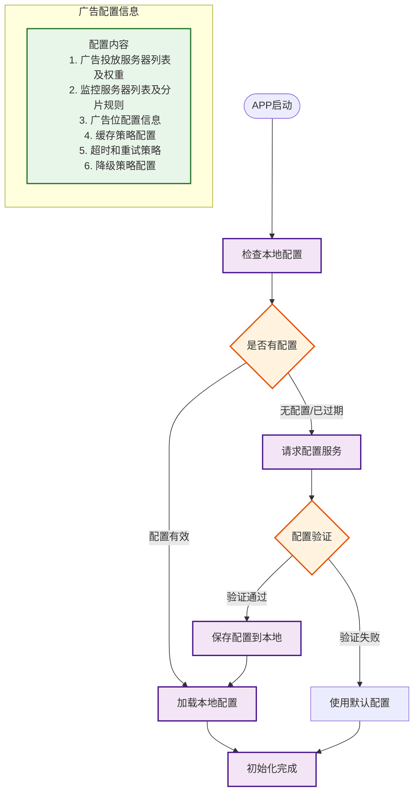
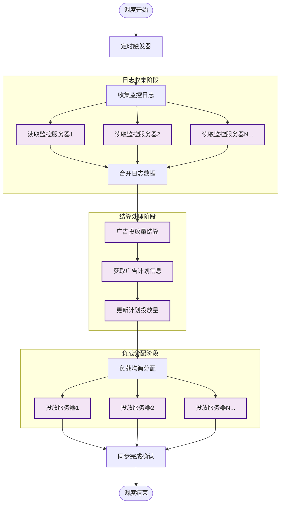
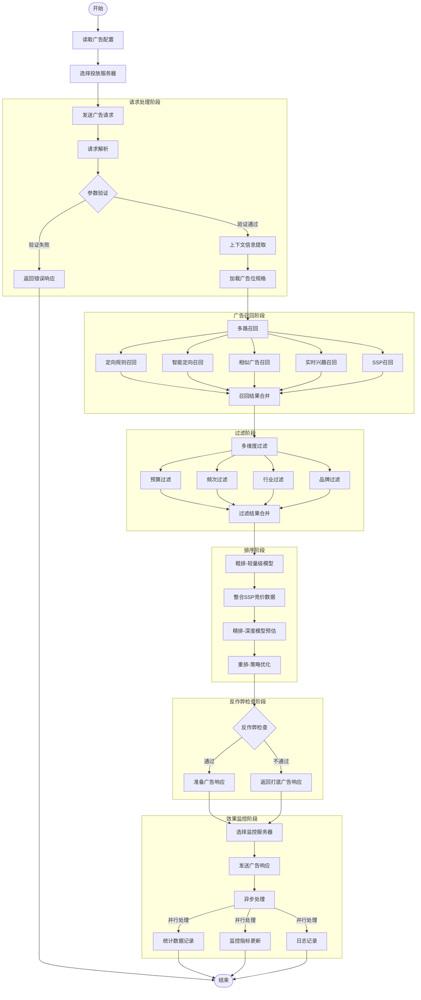

# 广告投放引擎运行流程设计

## APP初始化配置流程

### 初始化配置流程说明

1. 配置获取流程
   - APP启动检查本地配置
     * 首次启动时无本地配置，需要从服务器获取
     * 定期检查配置版本，确保使用最新配置
     * 本地配置存在但已过期，触发更新
     * 网络异常时使用本地缓存配置

   - 配置服务请求
     * 发送设备信息(设备ID、系统版本、APP版本等)
     * 获取该设备对应的最新配置版本
     * 按需下载差异配置内容
     * 支持增量更新以节省流量

   - 配置验证流程
     * 检查配置完整性，确保必要配置项都存在
     * 验证配置格式，确保数据结构正确
     * 检查配置版本号是否正确
     * 验证配置签名以确保安全性

   - 配置存储管理
     * 使用加密方式存储敏感配置
     * 建立配置版本管理机制
     * 保留历史配置用于紧急回滚
     * 定期清理过期配置节省空间

2. 配置内容详细说明
   - 广告投放服务器配置
     * 全球多区域服务器列表，支持就近接入
     * 每个服务器的处理能力权重配置
     * 服务器分组信息用于容灾备份
     * 自动故障转移的触发条件和规则
     * 服务质量监控指标和阈值设置

   - 监控服务器配置
     * 监控数据上报的服务器列表
     * 按设备ID的数据分片存储规则
     * 监控数据本地缓存策略
     * 数据上报重试和补偿机制
     * 监控服务器容量预警配置

   - 广告位配置管理
     * 应用内所有广告位的基础信息
     * 每个广告位的展示规则和限制
     * 广告素材规格要求和校验规则
     * 广告刷新策略和缓存时长
     * 程序化广告位的竞价规则配置

   - 运行时配置选项
     * 网络请求超时和重试策略
     * 服务降级的触发条件和方案
     * 错误处理和异常恢复机制
     * 配置更新周期和触发条件
     * 灰度发布相关配置项

3. 配置更新机制
   - 定时更新策略
     * 每天固定时间检查配置更新
     * 错峰更新避免服务器压力
     * 更新间隔时间可配置
     * 支持强制更新机制

   - 触发式更新
     * 版本升级触发配置更新
     * 服务器推送配置变更通知
     * 异常情况触发配置检查
     * 手动触发配置更新

   - 增量更新支持
     * 只更新变化的配置项
     * 使用配置版本号控制
     * 支持配置的拆分更新
     * 更新过程的原子性保证

4. 配置容灾机制
   - 本地缓存策略
     * 保持最新的可用配置副本
     * 定期清理过期配置缓存
     * 配置加密存储保证安全
     * 紧急情况下的配置恢复

   - 降级处理方案
     * 配置服务不可用时的处理
     * 使用默认配置的场景
     * 部分配置缺失的补偿措施
     * 配置错误的自动修正

## 广告调度流程

### 整体流程图

### 调度流程说明

#### 1. 定时触发机制
- 调度服务定时执行（例如每小时1次）
- 支持手动触发紧急调度
- 错峰调度以避免资源竞争
- 调度任务执行状态监控

- 常规调度周期
  * 每小时调度：适用于一般投放量的广告计划
  * 每30分钟调度：适用于大额预算的重点广告计划
  * 每15分钟调度：适用于竞价类广告的实时预算控制
  * 每5分钟调度：适用于节假日等特殊时期的精细化控制

- 手动紧急调度
  * 重大活动预热期的投放调整
  * 突发热点事件的广告策略调整
  * 客户投诉后的紧急干预
  * 系统异常恢复后的数据同步

- 智能调度策略
  * 基于历史数据的高峰期预测
  * 根据实时流量波动动态调整调度频率
  * 重点客户的个性化调度策略
  * 特殊时段的调度优先级提升

#### 2. 日志收集与处理
- 日志数据采集
  * 广告展示日志：记录展示时间、位置、用户信息等
  * 点击行为日志：记录点击时间、来源、落地页等
  * 转化追踪日志：记录转化类型、金额、路径等
  * 用户行为日志：记录浏览轨迹、停留时长等

- 数据质量保障
  * 实时数据验证：检查数据格式、完整性
  * 异常数据识别：筛选异常流量、刷量行为
  * 数据修复机制：处理延迟、丢失的数据
  * 数据一致性校验：跨服务器数据同步检查

- 实时数据聚合
  * 分钟级聚合：展示、点击等基础指标
  * 小时级聚合：转化、ROI等复合指标
  * 天级聚合：累计消耗、整体效果等
  * 多维度聚合：按广告主、计划、创意等维度

#### 3. 结算处理机制
- 预算控制策略
  * 天级预算：控制日消耗上限
  * 小时级预算：控制投放节奏
  * 总预算：控制整体投放规模
  * 智能出价：根据效果动态调整

- 账户管理
  * 余额实时检查：确保账户资金充足
  * 信用额度管理：支持大客户的垫付投放
  * 透支预警：设置预警阈值自动提醒
  * 自动暂停：余额不足时自动暂停投放

- 数据核算
  * 展示计费：按展示次数计费
  * 点击计费：按实际点击量计费
  * 转化计费：按有效转化数计费
  * 混合计费：支持多种计费方式组合

#### 4. 负载均衡策略
- 服务器评估指标
  * CPU使用率：处理能力指标
  * 内存占用：缓存容量指标
  * 网络带宽：传输能力指标
  * 响应时延：服务质量指标

- 动态扩缩容规则
  * 流量预测：基于历史数据预测负载
  * 容量规划：提前进行资源调度
  * 平滑扩容：逐步增加服务器负载
  * 快速缩容：及时释放空闲资源

- 异常处理机制
  * 服务器宕机：自动切换备用节点
  * 网络抖动：智能重试和恢复
  * 性能劣化：自动降级和限流
  * 资源耗尽：紧急扩容和告警

### 系统架构设计

#### 1. 监控服务集群
- 采用多机分布式部署
- 本地日志缓存机制
- 数据同步时间窗口
- 服务健康检查机制

#### 2. 调度服务设计
- 主从架构保证高可用
- 分布式锁避免重复调度
- 任务执行状态持久化
- 失败重试机制

#### 3. 投放服务集群
- 动态扩缩容能力
- 负载均衡策略
- 服务器状态监控
- 容灾备份方案

### 数据一致性保障

#### 1. 日志处理
- 日志读取位置记录
- 重复数据检测处理
- 数据完整性校验
- 异常数据修正机制

#### 2. 结算处理
- 分布式事务保证
- 账务数据一致性
- 结算原子性保证
- 失败补偿机制

#### 3. 配额管理
- 预算使用记录
- 额度分配锁定
- 超额预警机制
- 配额回收处理

### 性能优化策略

1. 数据处理优化
   - 批量数据处理
   - 多线程并行处理
   - 增量数据同步
   - 数据压缩传输

2. 负载均衡优化
   - 动态权重调整
   - 资源利用率优化
   - 峰值流量应对
   - 平滑扩容策略

3. 调度性能优化
   - 任务分片执行
   - 定向任务调度
   - 资源预留机制
   - 调度策略优化

## 广告展现流程图

### 广告召回阶段
#### 1. 多路召回
- 定向规则召回
  * 人群画像匹配
  * 地域定向匹配
  * 兴趣定向匹配
  * 设备定向匹配
  * 规则预处理优化

- 智能定向召回
  * 相似受众扩展
  * Look-alike模型
  * 场景智能匹配
  * 实时意图识别
  * 环境因素匹配

- 相似广告召回
  * 内容相似度计算
  * 目标人群相似度
  * 历史效果相似度
  * 表现数据关联

- 实时兴趣召回
  * 浏览行为序列分析
  * 搜索关键词关联
  * 点击行为分析
  * 兴趣衰减计算

#### 2. 召回结果处理
- 结果合并策略
  * 多路召回结果去重
  * 广告ID唯一性检查
  * 合并优先级控制
  * 并发合并处理

### 过滤阶段
#### 1. 多维度过滤
- 预算过滤
  * 日预算检查
  * 总预算检查
  * 预算消耗速度
  * 智能预算控制

- 频次过滤
  * 用户维度频次
  * 设备维度频次
  * 时间窗口控制
  * 智能频次调整

- 行业过滤
  * 同行业广告间隔
  * 竞品屏蔽规则
  * 类目均衡投放
  * 行业准入检查

- 品牌过滤
  * 品牌安全控制
  * 品牌竞争规则
  * 品牌调性匹配
  * 品牌价值评估

#### 2. 过滤结果处理
- 交集处理策略
  * 多维过滤结果合并
  * 交集计算优化
  * 空集快速返回
  * 增量过滤处理

### 排序阶段
#### 1. 粗排
- 特征工程
  * 轻量级特征处理
  * 基础统计特征
  * 简单组合特征
  * 历史效果特征

- 轻量级模型
  * LR/GBDT等简单模型
  * 基础特征交叉
  * 增量学习策略
  * 批量预估优化

#### 2. 精排
- 完整特征处理
  * 用户画像特征
  * 广告属性特征
  * 场景上下文特征
  * 交叉组合特征

- 深度模型预估
  * DeepFM/DIN/DCN
  * 多目标模型融合
  * CTR/CVR预估
  * ROI预估优化

#### 3. 重排
- 多样性优化
  * 创意多样性控制
  * 素材类型均衡
  * 内容差异保证
  * 品类穿插控制

- 策略调整
  * 商业价值优化
  * 用户体验平衡
  * 生态均衡维护
  * 探索机制加入

## 流程说明

### 1. 请求处理阶段
- 读取广告配置：从本地读取初始化阶段保存的配置信息
- 选择投放服务器：根据配置的规则选择合适的投放服务器
  - 应用配置的服务器权重
  - 使用配置的地理就近规则
  - 考虑服务器健康状态
  - 执行故障转移策略
- 发送广告请求：向选定的投放服务器发送请求
- 请求解析：解析请求参数和头信息
- 参数验证：验证必要参数的完整性和有效性
- 上下文提取：获取设备信息、地理位置、时间等上下文
- 加载规格：获取目标广告位的规格要求

### 2. 广告匹配阶段
- 加载候选广告：从缓存中获取符合规格的广告
  #### 广告规格说明
  1. 展示位置规格
     - 广告位尺寸（宽x高）
     - 广告位位置（顶部/底部/插屏等）
     - 广告位类型（Banner/视频/信息流等）
     - 展示页面类型（首页/列表页/详情页等）

  2. 素材规格要求
     - 图片尺寸限制
     - 视频时长限制
     - 文件大小限制
     - 素材格式要求（JPG/PNG/MP4等）
     - 图文比例要求

  3. 内容展示规格
     - 标题字数限制
     - 描述文字限制
     - Logo展示要求
     - 角标展示规则
     - 动画效果支持

  4. 交互规格
     - 点击跳转方式
     - 落地页类型限制
     - 触发事件定义
     - 手势响应要求
     - 关闭按钮要求

  5. 加载性能规格
     - 素材加载超时限制
     - 预加载要求
     - 缓存策略要求
     - 带宽占用限制
     - 渲染性能要求

- 定向匹配：检查广告的定向条件是否符合当前用户特征
  #### 定向条件类型
  1. 人口属性定向
     - 年龄段
     - 性别
     - 教育程度
     - 职业类型
     - 收入水平
     - 婚恋状况

  2. 地理位置定向
     - 国家/地区
     - 省份/直辖市
     - 城市等级
     - 商圈位置
     - 精确坐标
     - GPS区域

  3. 行为兴趣定向
     - 历史浏览行为
     - 搜索关键词
     - 购物偏好
     - APP使用习惯
     - 兴趣标签
     - 场景行为

  4. 设备定向
     - 操作系统
     - 设备品牌
     - 机型价位
     - 网络环境
     - 运营商
     - 设备类型

  5. 时间定向
     - 投放时段
     - 周期设置
     - 节假日
     - 季节性
     - 活动时间

  6. 场景定向
     - APP分类
     - 使用场景
     - 用户状态
     - 天气条件
     - 温度范围

  7. 社交属性定向
     - 社交影响力
     - 社交活跃度
     - 社交圈层
     - 兴趣社群

  8. 消费能力定向
     - 消费等级
     - 购买力指数
     - 消费频次
     - 品类偏好
     - 价格敏感度

  9. 智能定向
     - 相似用户群
     - 购买意向强度
     - 转化倾向
     - 品牌亲和度
     - AI预测人群

- 预算检查：验证广告主账户余额和广告预算是否充足
- 频次检查：验证广告对当前用户的展示频次是否超限
- 候选集管理：将符合条件的广告加入候选集

### 3. 智能决策阶段
- 点击率预估：使用机器学习模型预估广告点击概率
- 转化率预估：预估广告转化可能性
- 出价调整：基于预估结果动态调整广告出价
- 排序竞价：结合多个因素对候选广告进行排序

### 4. 反作弊检查阶段
- 流量质量检查：评估当前请求的流量质量
- 反作弊验证：检查是否存在作弊行为
- 广告响应准备：组装最终的广告响应内容

### 5. 效果监控阶段
- 选择监控服务器：根据配置选择合适的监控服务器
  - 按配置的分片规则选择
  - 考虑服务器容量状态
  - 应用就近原则
  - 执行故障转移策略
- 发送响应：向选定的监控服务器发送广告响应内容
- 异步处理：并行进行数据统计、监控更新和日志记录
- 数据一致性：确保多服务器间的数据同步和一致性
- 实时聚合：支持跨服务器的数据聚合和查询

## 性能优化策略
1. 多级缓存：广告数据、用户画像的多级缓存
2. 并行处理：智能决策阶段的并行计算
3. 异步处理：监控和日志的异步处理
4. 降级策略：高峰期的服务降级方案

## 可用性保障
1. 超时控制：各阶段处理超时机制
2. 降级处理：核心服务不可用时的降级方案
3. 兜底策略：候选集为空时的兜底广告
4. 监控报警：关键指标的实时监控告警

### 商业场景说明

#### 1. 场景适配策略
- 电商场景
  * 首页推荐：根据用户画像和历史行为推荐相关商品广告
  * 商品详情：展示相关品类或竞品广告
  * 搜索结果：基于搜索意图的精准广告投放
  * 购物车：基于购物意图的配套商品推广

- 内容场景
  * 信息流：与内容相关的原生广告
  * 视频前贴片：基于视频内容的相关广告
  * 文章详情：与文章主题相关的广告
  * 社区互动：基于用户兴趣的个性化广告

- 应用场景
  * 开屏广告：品牌展示与应用推广
  * 插屏广告：重要节点的促销信息
  * 通知栏广告：时效性强的促销信息
  * 退出广告：最后一次转化机会

#### 2. 营销活动支持
- 节日营销
  * 春节红包活动
  * 618购物节
  * 双11全球购物节
  * 年终促销活动

- 主题营销
  * 新品首发
  * 限时特卖
  * 品牌周活动
  * 跨品类联合促销

- 场景营销
  * 早午晚餐时段
  * 周末休闲时段
  * 上下班通勤
  * 季节性营销

#### 3. 广告效果优化
- 创意优化
  * A/B测试不同创意
  * 动态创意组合
  * 个性化文案生成
  * 多样化素材轮换

- 投放优化
  * 智能出价调整
  * 预算分配优化
  * 投放时段优化
  * 地域定向优化

- 转化优化
  * 落地页优化建议
  * 转化路径分析
  * 用户行为跟踪
  * ROI数据分析

### 特殊场景处理

#### 1. 高并发场景
- 秒杀活动
  * 广告请求削峰
  * 资源预热机制
  * 多级缓存策略
  * 降级预案准备

- 大促活动
  * 容量预估评估
  * 资源动态扩容
  * 监控阈值调整
  * 应急预案准备

#### 2. 异常场景
- 网络异常
  * 请求重试机制
  * 超时策略调整
  * 备用方案切换
  * 服务降级处理

- 服务异常
  * 快速故障转移
  * 服务熔断处理
  * 降级广告备选
  * 恢复预案执行

#### 3. 数据一致性保障
- 实时对账
  * 展现数据核对
  * 点击数据验证
  * 消耗金额校验
  * 差异数据处理

- 定期对账
  * 日终数据校验
  * 周期数据核算
  * 账单数据核对
  * 异常数据修正

### 效果评估体系

#### 1. 效果指标
- 基础指标
  * 曝光量（Impressions）
  * 点击量（Clicks）
  * 点击率（CTR）
  * 转化量（Conversions）

- 成本指标
  * 千次展现成本（CPM）
  * 点击成本（CPC）
  * 转化成本（CPA）
  * 投资回报率（ROI）

- 质量指标
  * 广告相关性得分
  * 用户体验评分
  * 投诉率统计
  * 屏蔽率数据

#### 2. 效果分析
- 维度分析
  * 时间维度：小时/天/周/月
  * 地域维度：国家/省份/城市
  * 人群维度：年龄/性别/兴趣
  * 场景维度：场景/位置/时段

- 对比分析
  * 历史数据对比
  * 同期数据对比
  * 行业均值对比
  * 竞品数据对比

#### 3. 优化建议
- 系统建议
  * 出价调整建议
  * 定向优化建议
  * 创意优化建议
  * 投放时段建议

- 人工运营
  * 客户投放诊断
  * 效果提升方案
  * 预算调整建议
  * 策略优化方案
