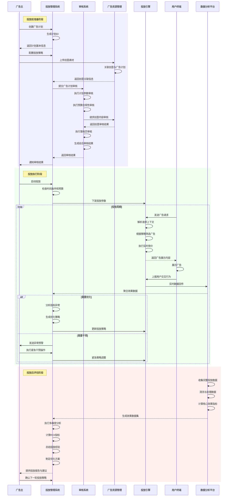
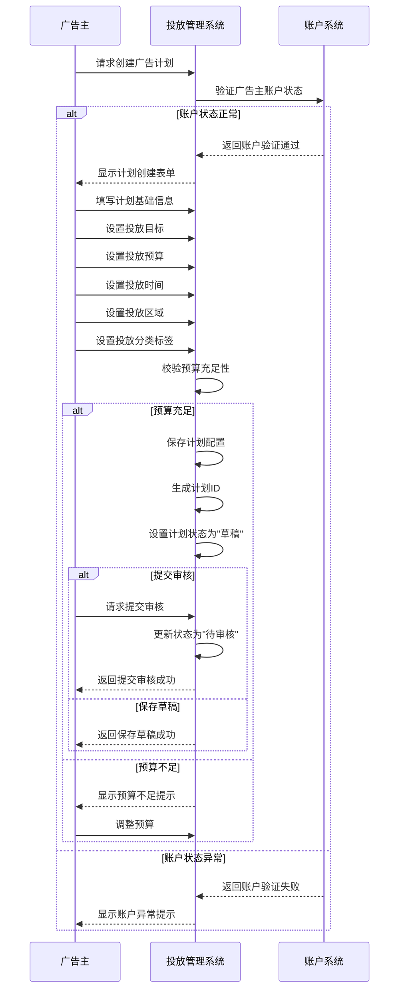
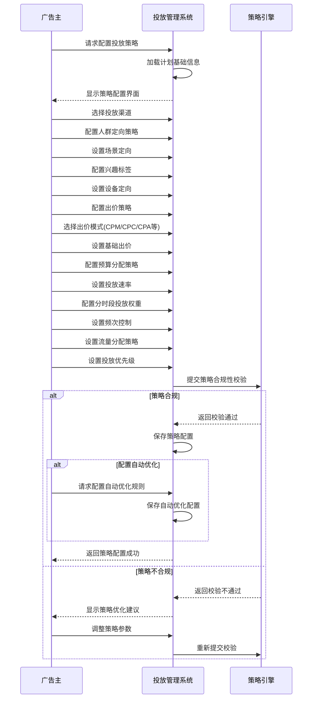
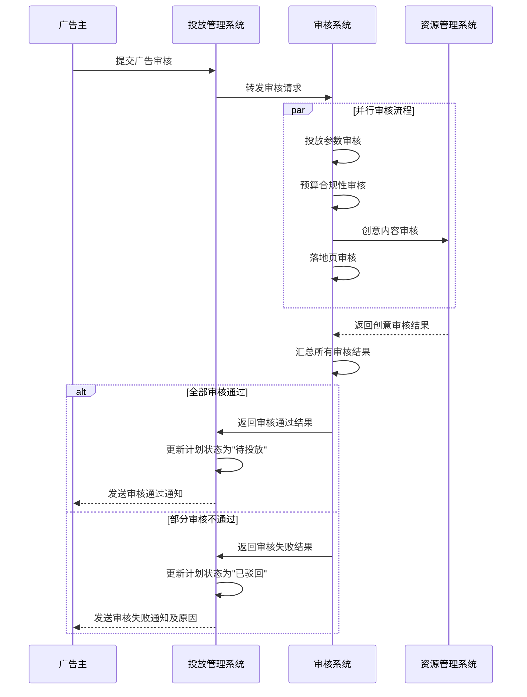
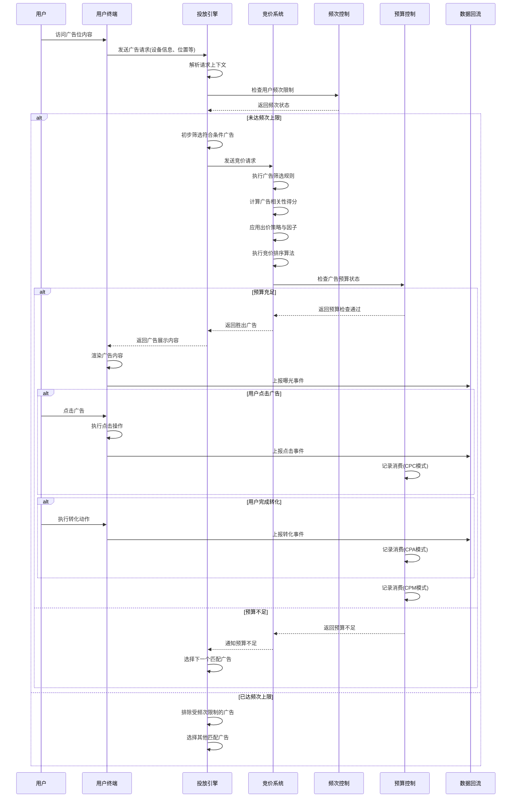
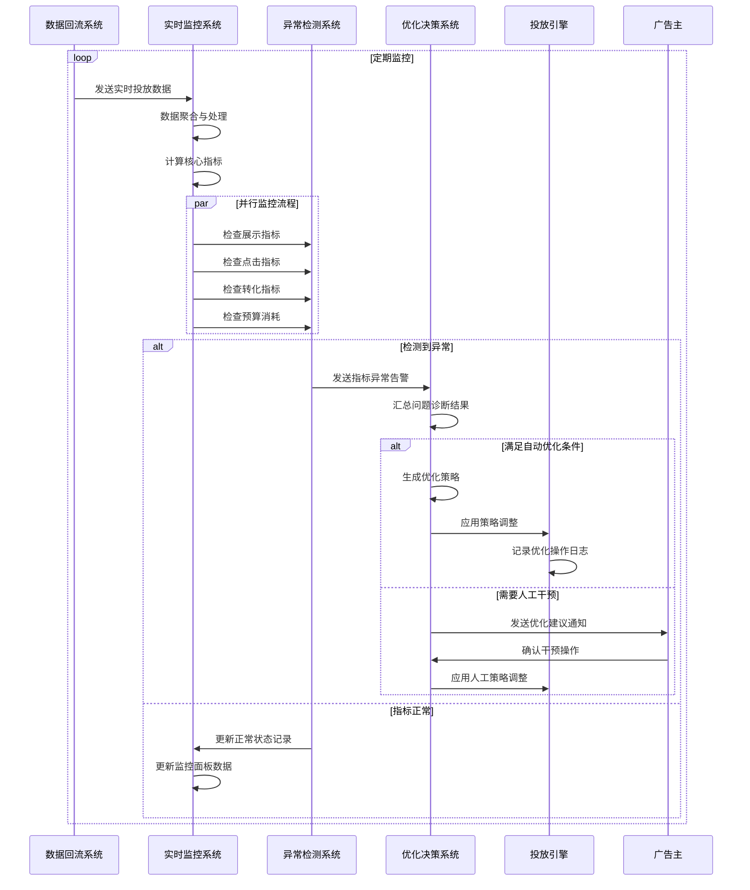
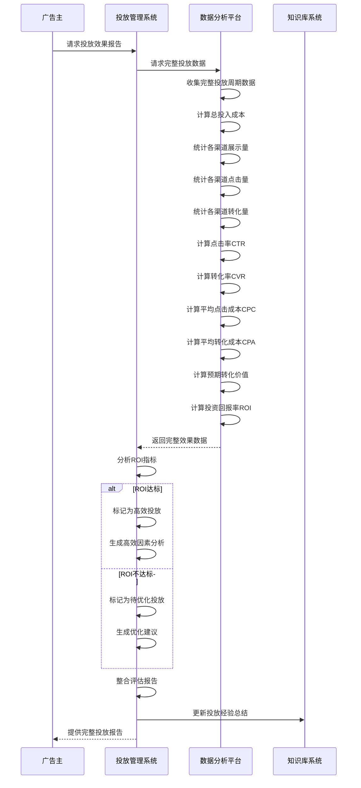
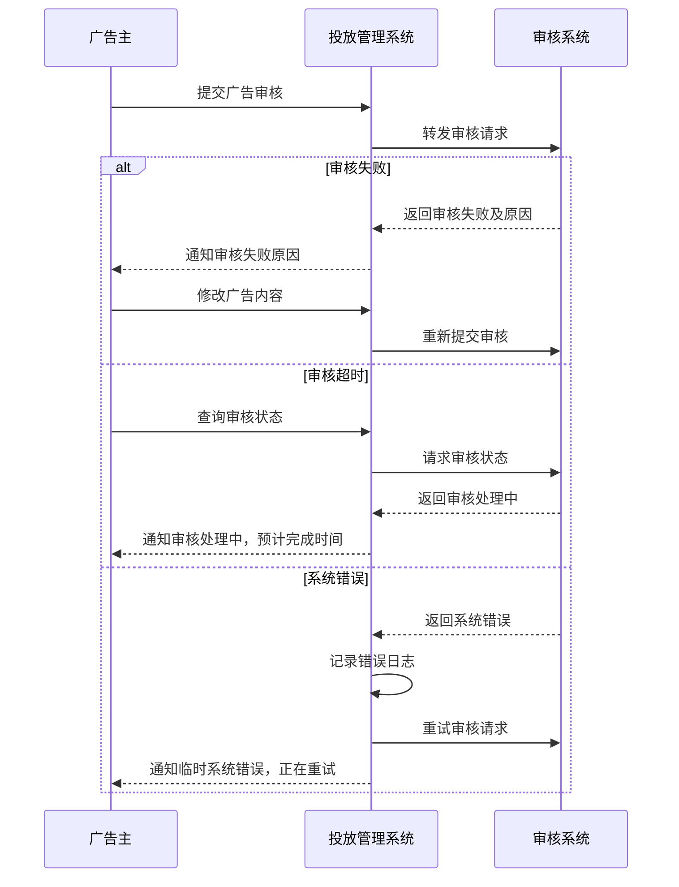
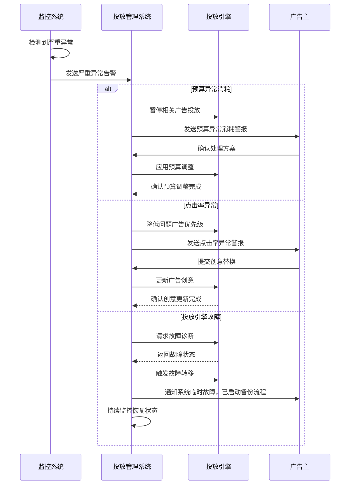

# 广告投放业务序列设计

## 1. 总体业务序列概览

广告投放业务涉及多个角色和系统间的交互，从广告计划创建到最终效果评估，构成了一个完整的业务闭环。以下序列图描述了整体业务流程中关键系统的交互过程。

## 2. 子序列设计

### 2.1 广告计划创建序列图

### 2.2 投放策略配置序列图

### 2.3 投放前审核序列图

### 2.4 实时投放序列图

### 2.5 投放监控与优化序列图

### 2.6 投放后ROI评估序列图

## 3. 关键交互节点说明

### 3.1 投放前准备阶段关键交互

1. **广告计划创建到审核**
   - 广告主通过投放管理系统创建广告计划，设置基本信息和投放策略
   - 系统检查账户状态和预算充足性，确保基础条件满足
   - 投放管理系统与审核系统的交互确保广告计划符合平台规范

2. **创意素材管理与关联**
   - 广告主上传创意素材到资源管理系统
   - 资源管理系统执行素材规范检查
   - 创意素材与广告计划关联，构成完整投放单元

3. **多维度审核协作**
   - 审核系统与资源管理系统协同工作，执行参数、预算、创意、落地页多维度审核
   - 审核结果汇总后决定广告计划是否可投放
   - 审核结果通知机制确保广告主及时了解审核状态

### 3.2 投放执行阶段关键交互

1. **投放启动与参数下发**
   - 广告主启动投放后，投放管理系统检查时间条件和预算状态
   - 投放参数下发到投放引擎，准备响应广告请求
   - 系统状态从"待投放"切换到"投放中"

2. **广告请求与实时竞价**
   - 用户终端发起广告请求，携带上下文信息
   - 投放引擎根据请求上下文和投放策略筛选匹配广告
   - 竞价系统执行排序和选择，考虑频次控制和预算限制

3. **用户交互与数据回流**
   - 用户与广告的交互行为(展示、点击、转化)由终端记录
   - 交互数据实时回传到数据回流系统
   - 数据聚合后用于实时监控和优化决策

4. **实时监控与优化**
   - 监控系统分析实时数据，检测异常指标
   - 优化决策系统根据监控结果生成优化策略
   - 策略调整自动或人工干预方式应用到投放引擎

### 3.3 投放后评估阶段关键交互

1. **数据收集与处理**
   - 数据分析平台收集完整投放周期数据
   - 执行数据清洗、聚合和计算关键指标
   - 生成多维度分析数据集供投放管理系统使用

2. **效果分析与ROI评估**
   - 投放管理系统基于数据集执行多维度分析
   - 计算和评估ROI指标，判断投放效率
   - 根据ROI表现生成相应分析和建议

3. **经验沉淀与策略优化**
   - 投放经验和最佳实践更新至知识库系统
   - 基于历史数据和经验总结制定优化方案
   - 优化建议反馈给广告主，指导下一轮投放

## 4. 异常处理流程

### 4.1 审核阶段异常处理

### 4.2 投放阶段异常处理

## 5. 业务序列优化方向

### 5.1 流程优化方向

1. **审核流程自动化**
   - 引入AI审核辅助工具，提高审核速度和准确性
   - 构建分级审核机制，简单案例自动审核，复杂案例人工审核
   - 建立预审核机制，提前发现潜在问题

2. **实时决策优化**
   - 增强实时优化能力，缩短数据到决策的延迟时间
   - 引入预测模型，实现前瞻性投放调整
   - 构建多层级优化策略库，应对不同场景

3. **跨系统协作优化**
   - 构建系统间事件通知机制，减少轮询依赖
   - 优化系统间数据传输格式，降低处理负担
   - 引入分布式事务管理，确保跨系统操作一致性

### 5.2 技术优化方向

1. **高并发处理优化**
   - 优化实时竞价系统性能，提高并发处理能力
   - 实现请求分级处理机制，确保核心流量稳定性
   - 引入负载均衡和弹性扩缩容机制

2. **数据流处理优化**
   - 实现增量数据同步机制，降低系统间数据传输量
   - 优化数据聚合算法，提高实时统计准确性
   - 构建数据缓存层，减轻数据库压力

3. **异常处理机制优化**
   - 完善故障检测和预警机制，提前发现潜在问题
   - 构建多级降级策略，确保核心功能可用性
   - 优化重试机制，提高系统容错能力