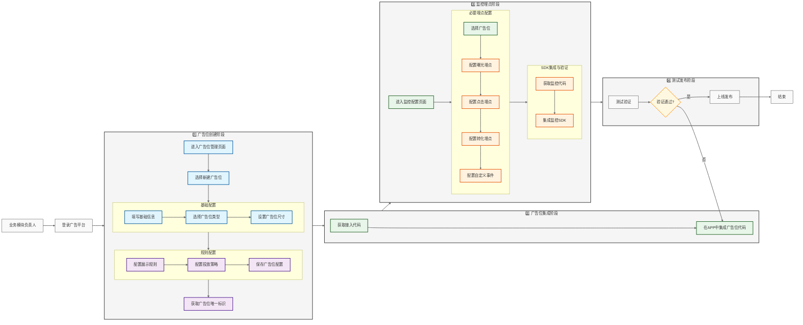
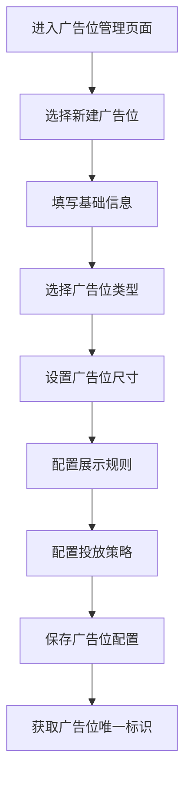
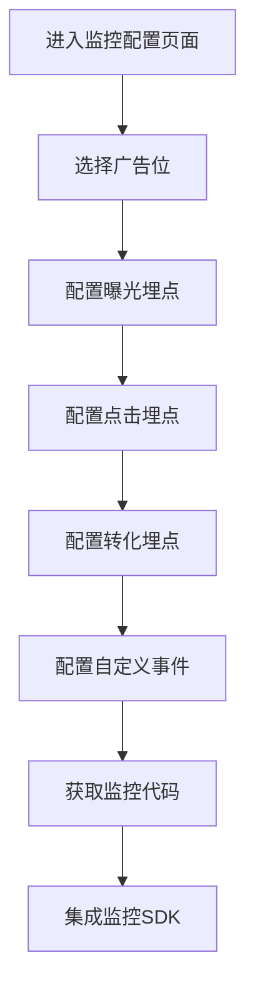
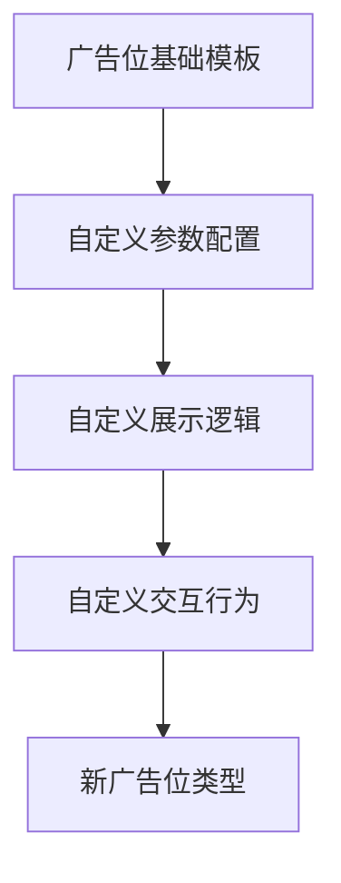
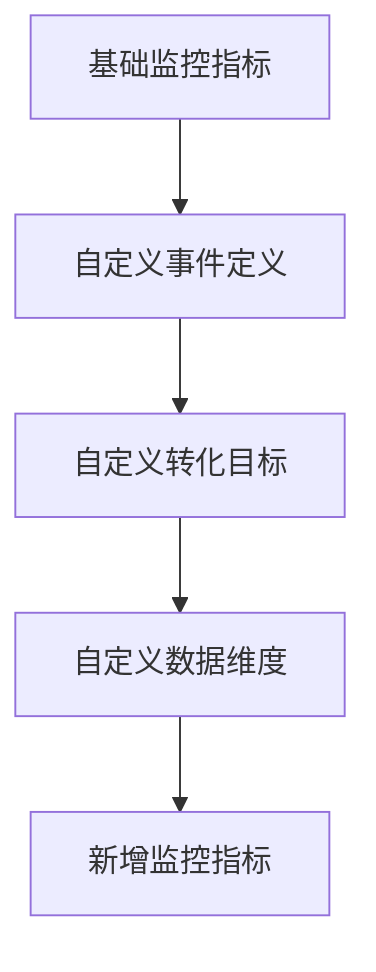

# 广告位接入与监控埋点流程设计

## 一、广告位接入完整流程

## 二、详细流程说明

### 1. 广告位创建流程

#### 1.1 进入广告位管理页面
- 登录广告平台后台管理系统
- 导航至"广告位管理"模块
- 确保有相应的操作权限

#### 1.2 新建广告位操作
- 点击"新建广告位"按钮
- 系统生成唯一的广告位ID
- 进入广告位配置界面

#### 1.3 基础信息配置
必填信息：
- 广告位名称：具有业务标识意义的名称
- 所属板块：选择对应的业务板块
- 广告位描述：描述广告位的使用场景和目的
- 技术负责人：对接的技术开发人员
- 业务负责人：对应的业务方对接人

#### 1.4 广告位类型选择
支持的类型：
- Banner广告：固定或浮动的横幅广告
- 信息流广告：融入内容流的原生广告
- 开屏广告：应用启动时的全屏广告
- 插屏广告：应用切换时的弹窗广告
每种类型都有特定的配置项和展示规则

#### 1.5 广告位尺寸设置
配置项：
- 宽度：支持固定像素或百分比
- 高度：支持固定像素或百分比
- 位置：页面中的展示位置
- 适配规则：不同屏幕尺寸下的展示策略

#### 1.6 展示规则配置
基础规则：
- 展示频次：单用户查看次数限制
- 展示间隔：两次展示之间的最小时间间隔
- 刷新策略：是否支持自动刷新及间隔时间
- 预加载策略：是否支持预加载及触发条件

高级规则：
- 场景限制：特定场景下的展示控制
- 用户群体：目标受众群体设置
- 投放时段：广告展示的时间段限制
- 特殊规则：节假日、活动期间的特殊配置

#### 1.7 投放策略配置
基础策略：
- 优先级设置：多个广告位的展示优先级
- 流量分配：不同广告类型的流量分配比例
- 底价设置：广告位的最低售价
- 定向规则：地域、人群等定向条件

#### 1.8 获取广告位标识
输出信息：
- 广告位ID：系统生成的唯一标识
- 接入代码：客户端集成所需的代码片段
- 配置参数：广告位相关的配置信息
- 测试说明：测试环境的配置说明

### 2. 监控埋点配置流程

#### 2.1 进入监控配置页面
- 选择需要配置监控的广告位
- 确认监控需求和指标要求
- 准备监控配置参数

#### 2.2 配置曝光埋点
必要参数：
- 曝光规则：定义有效曝光的触发条件
- 可见比例：广告内容的最小可见比例
- 可见时长：达到有效曝光的最小时长
- 曝光去重：相同广告的曝光去重规则

#### 2.3 配置点击埋点
必要参数：
- 点击区域：可点击区域的定义
- 点击有效性：有效点击的判定规则
- 防作弊规则：异常点击的过滤规则
- 点击追踪：点击后的跳转链接处理

#### 2.4 配置转化埋点
基础配置：
- 转化目标：定义期望的用户行为
- 转化窗口：有效转化的时间窗口
- 归因规则：多次点击的归因方式
- 深度转化：二次转化行为的跟踪

#### 2.5 配置自定义事件
支持的事件类型：
- 用户行为：如停留时长、滑动等
- 交互事件：如展开、关闭、分享等
- 视频事件：如播放、暂停、完播等
- 表单事件：如填写、提交等

#### 2.6 监控SDK集成
集成步骤：
1. 引入监控SDK到项目中
2. 完成SDK初始化配置
3. 在相应位置添加埋点代码
4. 验证数据上报是否正常

### 3. 测试验证流程

#### 3.1 功能测试
测试项目：
- 广告位展示是否正常
- 监测埋点是否触发
- 数据上报是否准确
- 异常情况处理是否合理

#### 3.2 性能测试
关注指标：
- 广告加载时间
- 页面响应速度
- 内存占用情况
- 网络请求频率

#### 3.3 数据验证
验证项目：
- 埋点数据完整性
- 数据格式正确性
- 数据实时性
- 数据准确性

### 1. 广告位创建流程

### 2. 监控埋点配置流程

## 三、接入规范

### 1. 广告位接入规范
- 遵循标准广告位接口协议
- 支持的广告类型：
  * Banner广告
  * 信息流广告
  * 开屏广告
  * 插屏广告
  * 视频广告

### 2. 监控埋点规范
- 必须埋点项：
  * 广告请求
  * 广告展示
  * 广告点击
- 可选埋点项：
  * 广告关闭
  * 用户行为跟踪
  * 转化跟踪

### 3. 接入步骤
1. 引入广告SDK
2. 初始化配置
3. 创建广告位
4. 加载广告
5. 设置监控回调
6. 处理广告生命周期

## 四、扩展性设计

### 1. 广告位扩展机制

### 2. 监控指标扩展机制

## 五、自助管理功能

### 1. 广告位管理
- 广告位创建
- 广告位编辑
- 广告位预览
- 广告位状态管理
- 广告位数据分析

### 2. 监控管理
- 监控点配置
- 数据可视化
- 实时监控
- 异常告警
- 数据报表

## 六、安全性考虑

### 1. 权限控制
- 广告位管理权限
- 监控配置权限
- 数据访问权限

### 2. 数据安全
- 广告内容审核
- 监控数据加密
- 访问权限控制
- 操作日志记录

## 七、平台支持

### 1. 技术支持
- 接入文档
- 示例代码
- 问题排查指南
- 在线技术支持

### 2. 运营支持
- 数据分析报告
- 优化建议
- 效果评估
- 定期回访

## 八、流程质量标准与注意事项

### 1. 广告位创建质量标准

#### 命名规范
- 广告位ID命名：{业务板块}_{页面位置}_{广告类型}_{序号}
- 示例：home_top_banner_001

#### 参数配置标准
- 尺寸设置：必须符合广告位展示规范要求
- 刷新间隔：建议不低于30秒
- 预加载设置：建议提前一个页面进行预加载

#### 关键注意事项
- 新建广告位必须经过业务方评审确认
- 广告位类型一旦确定后不建议更改
- 重要参数修改需要通知相关业务方

### 2. 监控埋点质量标准

#### 埋点命名规范
- 事件ID格式：{广告位ID}_{事件类型}_{动作}
- 示例：home_top_banner_001_exposure_show

#### 数据采集标准
- 曝光有效性：广告内容可见面积≥50%持续1秒以上
- 点击有效性：用户主动点击，排除意外触发
- 转化跟踪：支持最长7天的转化窗口期

#### 关键注意事项
- 埋点实现必须经过技术评审
- 数据异常必须及时报警
- 重要数据需要进行备份存储

### 3. 接入测试标准

#### 功能验证清单
- 广告位展示正确性检查
  * 尺寸和位置符合设计要求
  * 内容展示完整无遮挡
  * 交互响应正常
  * 动画效果流畅

- 监控数据准确性检查
  * 曝光数据准确记录
  * 点击行为正确跟踪
  * 转化数据及时同步
  * 自定义事件正常触发

#### 性能指标要求
- 广告加载时间：首次加载 < 1秒
- 预加载缓存命中率 > 80%
- CPU占用：峰值 < 10%
- 内存增量：< 20MB

#### 关键注意事项
- 进行多机型适配测试
- 模拟弱网环境测试
- 执行异常场景测试
- 进行压力和稳定性测试

## 九、接入审核清单

### 1. 提测前检查项
- [ ] 广告位参数配置完整性检查
- [ ] 监控埋点实现完整性验证
- [ ] 代码提交规范性审查
- [ ] 测试用例完整性确认

### 2. 测试阶段检查项
- [ ] 功能测试用例执行完整
- [ ] 性能指标达标确认
- [ ] 异常场景处理验证
- [ ] 数据准确性校验

### 3. 上线前检查项
- [ ] 业务方确认签字
- [ ] 技术评审通过
- [ ] 监控报警配置完成
- [ ] 应急预案准备就绪

### 4. 上线后检查项
- [ ] 线上数据监控正常
- [ ] 用户反馈收集汇总
- [ ] 性能指标持续达标
- [ ] 运营数据统计正常