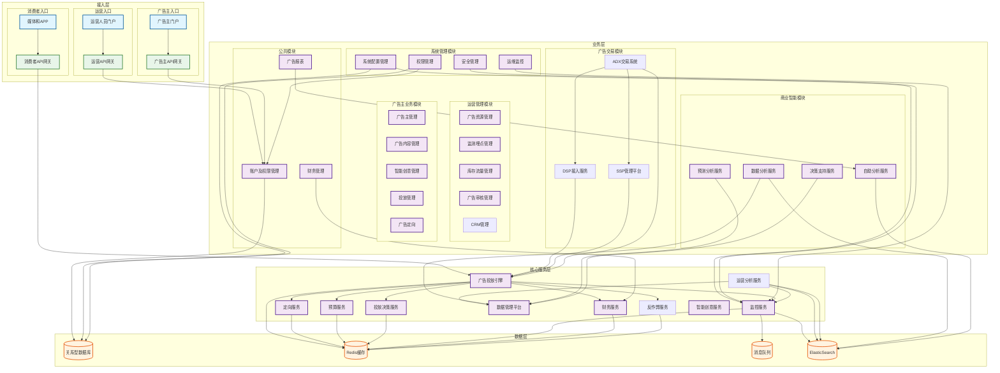

# Lorn.ADSP开源广告系统架构设计

## 系统整体架构图

## 系统架构详解

### 1. 接入层
#### [消费者入口](./广告客户端SDK/Readme.md)
- 定位：面向终端用户的广告展示和交互入口
- 目标：提供流畅、精准的广告展示体验
- 作用：
  - 负责广告内容的最终呈现
  - 收集用户交互数据和反馈
  - 执行前端广告展示策略
- 功能边界：
  - 仅处理广告展示和用户交互相关功能
  - 不涉及广告投放决策和业务规则处理
  - 通过API网关与后端服务交互
- 核心能力：
  - 广告展示渲染
  - 用户行为采集
  - 性能优化处理
  - 客户端缓存管理

#### 运营入口
- 定位：面向内部运营人员的管理平台
- 目标：提供全面的广告系统运营管理能力
- 作用：
  - 系统配置和参数管理
  - 广告资源和流量管理
  - 运营数据分析和决策支持
- 功能边界：
  - 仅面向内部运营人员开放
  - 专注于系统管理和运营决策
  - 不直接参与广告投放流程
- 核心能力：
  - 资源配置管理
  - 运营数据分析
  - 审核流程管理
  - 系统监控告警

#### 广告主入口
- 定位：面向广告主的自助投放平台
- 目标：提供便捷、高效的广告投放管理体验
- 作用：
  - 广告投放全流程管理
  - 广告效果数据查看和分析
  - 账户和财务管理
- 功能边界：
  - 仅面向已认证广告主开放
  - 专注于广告投放管理功能
  - 通过权限控制限制操作范围
- 核心能力：
  - 投放流程管理
  - 效果数据分析
  - 预算控制管理
  - 创意素材管理

### 2. 业务层模块
#### 运营管理模块
##### [广告资源管理](./广告资源管理/Readme.md)
- 定位：广告资源的统一管理平台
- 目标：实现广告资源的精细化运营
- 作用：
  - 广告位资源的规划和管理
  - 广告形式和规格的定义
  - 流量资源的分配和调控
- 功能边界：
  - 不直接参与广告投放决策
  - 仅提供资源管理和配置能力
  - 通过配置影响投放策略
- 核心能力：
  - 广告位管理
  - 流量分配策略
  - 资源价值评估
  - 效果数据分析

##### 监测埋点管理
- 定位：广告效果监测的基础设施
- 目标：提供准确、全面的数据采集能力
- 作用与功能边界：保持原有内容
- 核心能力：
  - 埋点配置管理
  - 数据采集规则
  - 监测代码生成
  - 数据质量监控

##### 库存流量管理
- 定位：广告流量的预测和管理平台
- 目标：优化广告资源利用效率
- 作用与功能边界：保持原有内容
- 核心能力：
  - 流量预测分析
  - 库存管理调控
  - 价值评估模型
  - 资源调度优化

##### 广告审核管理
- 定位：广告内容安全管控中心
- 目标：确保广告内容的合规性和安全性
- 作用：
  - 广告内容自动化审核
  - 人工审核流程管理
  - 违规处理及申诉
  - 审核标准维护
- 功能边界：
  - 专注于内容审核
  - 与投放流程协同
  - 提供审核结果和反馈
- 核心能力：
  - 智能审核引擎
  - 人工审核工作台
  - 违规识别系统
  - 申诉处理平台

##### [CRM管理](./CRM/Readme.md)
- 定位：广告主客户关系管理平台
- 目标：提供完整的客户生命周期管理能力
- 作用：
  - 客户信息档案管理
  - 合同流程管理和审批
  - 拜访计划和记录管理
  - 商机跟踪和客户分析
- 功能边界：
  - 专注于客户关系管理
  - 与广告主管理模块协同
  - 通过客户洞察支持运营决策
- 核心功能：
  1. 客户档案管理
     - 客户基础信息维护
     - 客户分级分类管理
     - 客户画像分析
     - 客户标签管理
  2. 合同管理
     - 合同模板管理
     - 合同创建和编辑
     - 合同审批流程
     - 合同状态跟踪
  3. 拜访管理
     - 拜访计划制定
     - 拜访记录管理
     - 跟进事项管理
     - 工作报告生成
  4. 商机管理
     - 商机创建和跟进
     - 销售漏斗分析
     - 商机转化率统计
     - 竞品情报管理
  5. 数据分析
     - 客户价值评估
     - 客户活跃度分析
     - 客户满意度调研
     - 客户流失预警

#### 广告主业务模块
##### 广告主管理
- 定位：广告主账户生命周期管理中心
- 目标：构建完整的广告主服务体系
- 作用：
  - 广告主准入和资质管理
  - 账户状态和信用管理
  - 服务等级和权益管理
  - 广告主画像分析
- 功能边界：
  - 专注于广告主基础信息管理
  - 与财务模块协同处理额度
  - 通过账户状态控制投放权限
- 核心能力：
  - 认证审核流程
  - 信用评级体系
  - 账户安全管理
  - 广告主分析洞察

##### 广告内容管理
- 定位：创意资源管理中心
- 目标：提供高效的创意管理与优化能力
- 作用：
  - 广告创意全生命周期管理
  - 素材规范检查与优化
  - 创意模板定制管理
  - 创意资源复用与分发
- 功能边界：
  - 专注于创意资源管理
  - 与审核模块协同
  - 支持创意优化服务
- 核心能力：
  - 素材管理系统
  - 规范检查引擎
  - 创意模板引擎
  - 资源分发服务

##### 智能创意管理
- 定位：AI驱动的创意优化平台
- 目标：提升创意制作效率和投放效果
- 作用：
  - AI辅助创意生成
  - 创意效果预测
  - A/B测试管理
  - 创意优化建议
- 功能边界：
  - 专注于创意智能化
  - 与投放引擎协同
  - 通过效果反馈优化
- 核心能力：
  - 智能生成引擎
  - 效果预测模型
  - 测试实验系统
  - 优化建议引擎

##### 投放管理
- 定位：广告投放策略控制中心
- 目标：实现精准、高效的广告投放
- 作用：
  - 投放策略制定与执行
  - 预算和出价管理
  - 投放效果优化
  - 数据分析与报表
- 功能边界：
  - 负责投放策略配置
  - 与投放引擎协同
  - 通过效果数据优化
- 核心能力：
  - 策略配置系统
  - 预算控制引擎
  - 效果优化系统
  - 数据分析平台

##### 定向管理
- 定位：用户定向策略管理中心
- 目标：实现精准的用户触达
- 作用：
  - 定向条件配置
  - 人群包管理
  - 标签系统对接
  - 效果反馈优化
- 功能边界：
  - 专注于定向策略
  - 与DMP平台协同
  - 支持实时优化
- 核心能力：
  - 定向策略引擎
  - 人群管理系统
  - 标签匹配服务
  - 效果优化模型

#### 公共模块
##### 账户及权限管理
- 定位：统一账户和权限管理中心
- 目标：提供完整的账户生命周期管理和权限控制能力
- 作用：
  - 账户信息统一管理
  - 角色权限体系维护
  - 访问控制策略执行
  - 安全审计跟踪
- 功能边界：
  - 专注于账户和权限管理
  - 支持多租户隔离
  - 提供统一认证授权
- 核心能力：
  - 账户管理系统
  - RBAC权限模型
  - SSO单点登录
  - 审计日志平台

##### 广告报表
- 定位：广告数据报表中心
- 目标：提供全面的广告数据分析和报表能力
- 作用：
  - 多维度数据统计
  - 实时报表生成
  - 定制化报表配置
  - 数据导出服务
- 功能边界：
  - 专注于报表服务
  - 支持多样化报表需求
  - 保证数据准确性
- 核心能力：
  - 报表引擎系统
  - 实时计算服务
  - 可视化组件
  - 导出处理服务

##### 财务管理
- 定位：广告财务管理中心
- 目标：提供完整的广告财务管理能力
- 作用：
  - 账户资金管理
  - 广告费用结算
  - 发票开具管理
  - 对账单处理
- 功能边界：
  - 专注于财务管理
  - 确保资金安全
  - 提供完整的财务闭环
- 核心能力：
  - 资金管理系统
  - 结算处理引擎
  - 发票管理平台
  - 对账系统

#### 广告交易模块
##### DSP接入服务
- 定位：需求方平台接入管理中心
- 目标：提供标准化、高性能的DSP接入服务
- 作用：
  - DSP接入管理和认证
  - 竞价请求的转发与处理
  - 广告素材审核与缓存
  - 预算额度实时控制
- 功能边界：
  - 专注于DSP接入管理
  - 遵循OpenRTB协议
  - 保证接口性能
- 核心能力：
  - 接入认证系统
  - 高性能竞价网关
  - 素材审核引擎
  - 预算控制系统

##### SSP管理平台
- 定位：供应方平台管理中心
- 目标：实现广告资源的高效管理和变现
- 作用：
  - 媒体资源统一管理
  - 广告位规格配置
  - 流量分级和控制
  - 收益优化策略执行
- 功能边界：
  - 专注于流量管理
  - 对接多种变现方式
  - 确保流量质量
- 核心能力：
  - 媒体管理系统
  - 流量控制引擋
  - 收益优化算法
  - 效果分析平台

##### ADX交易系统
- 定位：广告交易撮合中心
- 目标：构建高效、公平的广告交易平台
- 作用：
  - 实时竞价撮合
  - 多方竞价管理
  - 交易规则执行
  - 结算清分处理
- 功能边界：
  - 专注于交易撮合
  - 确保交易公平
  - 支持多种竞价模式
- 核心能力：
  - 实时竞价引擎
  - 流量调度系统
  - 质量控制平台
  - 结算清分服务

#### 系统管理模块
##### 系统配置管理
- 定位：系统参数统一配置中心
- 目标：实现系统的灵活配置和动态调整
- 作用：
  - 系统参数统一管理
  - 业务规则配置维护
  - 计费规则动态调整
  - 审核规则标准设置
- 功能边界：
  - 专注于系统配置
  - 确保配置生效
  - 维护配置历史
- 核心能力：
  - 配置管理引擎
  - 参数验证服务
  - 动态加载机制
  - 版本管理系统

##### 权限管理
- 定位：统一权限控制中心
- 目标：确保系统安全和资源访问控制
- 作用：
  - 用户角色管理
  - 权限策略配置
  - 访问控制执行
  - 权限审计跟踪
- 功能边界：
  - 专注于权限控制
  - 支持细粒度授权
  - 确保权限隔离
- 核心能力：
  - RBAC权限模型
  - 动态权限校验
  - 数据权限控制
  - 权限审计日志

##### 安全管理
- 定位：系统安全防护中心
- 目标：保障系统运行安全
- 作用：
  - 安全策略制定
  - 访问控制管理
  - 风险监控预警
  - 安全审计跟踪
- 功能边界：
  - 专注于安全防护
  - 不影响正常业务
  - 提供实时防护
- 核心能力：
  - 安全策略引擎
  - 风险控制系统
  - 实时监控预警
  - 安全审计平台

##### 运维监控
- 定位：系统运维管理中心
- 目标：确保系统稳定高效运行
- 作用：
  - 系统运行监控
  - 性能指标跟踪
  - 故障预警处理
  - 基础设施管理
- 功能边界：
  - 专注于系统运维
  - 支持多维度监控
  - 提供实时告警
- 核心能力：
  - 资源监控系统
  - 性能监控平台
  - 告警管理中心
  - 运维工具集成

#### 商业智能模块
##### 数据分析服务
- 定位：多维数据分析中心
- 目标：提供全方位的数据分析能力
- 作用：
  - 业务数据多维分析
  - 用户行为分析
  - 投放效果分析
  - 实时数据监控
- 功能边界：
  - 专注于数据分析
  - 对接多个数据源
  - 提供分析API
- 核心能力：
  - 多维分析引擎
  - 实时计算服务
  - 可视化平台
  - 指标监控系统

##### 预测分析服务
- 定位：智能预测分析中心
- 目标：提供准确的业务预测能力
- 作用：
  - 业务趋势预测
  - 异常行为预警
  - 风险评估预警
  - 容量规划建议
- 功能边界：
  - 专注于预测分析
  - 持续优化算法
  - 提供预警服务
- 核心能力：
  - 预测模型引擎
  - 机器学习平台
  - 预警规则引擎
  - 趋势分析系统

##### 决策支持服务
- 定位：智能决策支持中心
- 目标：提供数据驱动的决策支持
- 作用：
  - 优化建议生成
  - 策略推荐分析
  - 资源调度建议
  - ROI优化方案
- 功能边界：
  - 专注于决策支持
  - 提供建议方案
  - 支持人工干预
- 核心能力：
  - 决策推荐引擎
  - 优化算法平台
  - 效果评估系统
  - 方案生成器

##### 自助分析服务
- 定位：自助数据分析平台
- 目标：支持灵活的自定义分析
- 作用：
  - 自定义报表设计
  - 交互式数据分析
  - 可视化图表生成
  - 数据导出服务
- 功能边界：
  - 专注于自助分析
  - 提供分析工具
  - 保障数据安全
- 核心能力：
  - 报表设计器
  - OLAP分析引擎
  - 可视化组件
  - 权限控制系统

### 3. 核心服务层
- 模块包括：广告投放引擎、定向服务、预算服务、投放决策、监控服务、数据管理平台、财务服务、反作弊服务、智能创意服务及运营分析服务
- 作用：各模块职责明确，通过接口协同支持实时广告投放与数据处理

#### 核心服务层详解
##### [广告投放引擎](./广告投放引擎/Readme.md)
- 定位：实时广告投放决策引擎
- 目标：提供高性能、精准的广告投放服务
- 作用：
  - 广告请求实时处理
  - 多维度定向匹配
  - 智能竞价排序
  - 投放策略执行
- 功能边界：
  - 专注于核心投放决策
  - 与其他服务解耦
  - 保持无状态设计
- 核心能力：
  - 毫秒级响应
  - 智能竞价系统
  - 流量调度引擎
  - 实时优化能力

##### 定向服务
- 定位：用户特征匹配服务中心
- 目标：提供精准的人群定向能力
- 作用：
  - 用户特征实时匹配
  - 定向条件评估
  - 人群包圈选服务
  - 定向效果优化
- 功能边界：
  - 专注于定向计算
  - 与DMP平台协同
  - 支持实时服务
- 核心能力：
  - 特征匹配引擎
  - 规则评估系统
  - 人群圈选服务
  - 实时计算能力

##### 预算服务
- 定位：广告预算控制中心
- 目标：确保预算执行的准确性和效率
- 作用：
  - 预算分配和控制
  - 实时计费处理
  - 额度管理服务
  - 消耗预警监控
- 功能边界：
  - 专注于预算管理
  - 与财务系统协同
  - 保证数据一致性
- 核心能力：
  - 预算控制引擎
  - 实时计费系统
  - 额度管理服务
  - 预警监控系统

##### 投放决策服务
- 定位：广告投放策略决策中心
- 目标：实现最优的广告投放效果
- 作用：
  - 投放策略智能决策
  - 流量价值评估
  - 出价策略优化
  - 效果数据反馈
- 功能边界：
  - 专注于决策计算
  - 与投放引擎协同
  - 支持实时优化
- 核心能力：
  - 智能决策引擎
  - 价值评估模型
  - 策略优化系统
  - 实时反馈处理

##### 监控服务
- 定位：系统运行状态监控中心
- 目标：保障系统稳定运行
- 作用：
  - 系统指标监控
  - 业务数据监控
  - 告警管理服务
  - 日志分析处理
- 功能边界：
  - 专注于监控告警
  - 不干预业务逻辑
  - 支持多维度监控
- 核心能力：
  - 实时监控系统
  - 告警管理平台
  - 日志分析引擎
  - 监控大盘服务

##### 数据管理平台（DMP）
- 定位：用户数据资产管理平台
- 目标：构建完整的数据资产体系
- 作用：
  - 用户数据整合
  - 标签体系管理
  - 画像模型服务
  - 数据服务支持
- 功能边界：
  - 专注于数据管理
  - 确保数据安全
  - 提供数据服务
- 核心能力：
  - 数据整合引擎
  - 标签管理系统
  - 画像计算引擎
  - 数据服务平台

##### 财务服务
- 定位：广告系统财务结算中心
- 目标：保障广告费用结算的准确性和及时性
- 作用：
  - 广告费用计算
  - 账户额度管理
  - 财务清结算
  - 发票管理
- 功能边界：
  - 专注于财务处理
  - 确保资金安全
  - 提供完整对账能力
- 核心能力：
  - 实时计费引擎
  - 额度控制系统
  - 清结算平台
  - 财务报表中心

##### 反作弊服务
- 定位：广告流量质量保障中心
- 目标：识别和防范各类作弊行为
- 作用：
  - 流量作弊识别
  - 异常行为监控
  - 黑名单管理
  - 风险预警
- 功能边界：
  - 专注于作弊防范
  - 不影响正常流量
  - 提供实时防护
- 核心能力：
  - 作弊识别引擎
  - 行为分析系统
  - 风控规则引擎
  - 实时拦截服务

##### 智能创意服务
- 定位：创意智能生成与优化中心
- 目标：提供智能化的创意生成和优化能力
- 作用：
  - 创意智能生成
  - 创意效果预测
  - 素材智能处理
  - 创意优化建议
- 功能边界：
  - 专注于创意服务
  - 与内容管理协同
  - 支持个性化定制
- 核心能力：
  - AI创意生成器
  - 效果预测模型
  - 素材处理引擎
  - 优化建议系统

##### 运营分析服务
- 定位：运营数据分析服务中心
- 目标：提供全方位的运营数据分析与洞察能力
- 作用：
  - 运营指标分析
  - 业务健康度评估
  - 系统性能分析
  - 容量规划支持
- 功能边界：
  - 专注于运营数据分析
  - 面向运营决策支持
  - 不干预业务流程
- 核心能力：
  - 运营指标分析引擎
  - 业务健康度评估系统
  - 容量预测模型
  - 性能分析平台

### 4. 数据层
- 组成：关系型数据库（核心存储）、Redis缓存（性能加速）、消息队列（异步处理）及ElasticSearch（日志及数据检索）
- 目标：确保数据一致性与高效访问

#### 数据层详解
##### 关系型数据库
- 定位：核心业务数据存储
- 目标：保障数据可靠性和一致性
- 作用：
  - 业务数据持久化
  - 事务处理支持
  - 数据一致性保证
  - 复杂查询支持
- 功能边界：
  - 专注于数据存储
  - 保证数据一致性
  - 支持复杂查询
- 核心能力：
  - 事务处理引擎
  - 索引优化管理
  - 分库分表服务
  - 数据备份恢复

##### Redis缓存
- 定位：高性能数据缓存层
- 目标：提升系统访问性能
- 作用：
  - 热点数据缓存
  - 计数器服务
  - 分布式锁支持
  - 实时队列服务
- 功能边界：
  - 专注于性能优化
  - 容忍数据短暂不一致
  - 支持分布式场景
- 核心能力：
  - 高速缓存服务
  - 分布式锁服务
  - 计数器服务
  - 实时队列处理

##### 消息队列
- 定位：异步任务处理中心
- 目标：提供可靠的消息服务
- 作用：
  - 异步任务处理
  - 系统解耦支持
  - 削峰填谷
  - 顺序消息保证
- 功能边界：
  - 专注于消息服务
  - 保证消息可靠性
  - 支持多种消息模式
- 核心能力：
  - 消息路由服务
  - 顺序消息处理
  - 死信队列管理
  - 消息监控平台

##### ElasticSearch
- 定位：实时日志与数据检索平台
- 目标：提供高效的数据检索服务
- 作用：
  - 日志实时检索
  - 数据统计分析
  - 全文搜索服务
  - 多维度聚合
- 功能边界：
  - 专注于数据检索
  - 支持准实时查询
  - 提供分析能力
- 核心能力：
  - 实时检索引擎
  - 统计分析服务
  - 聚合计算能力
  - 可视化支持
