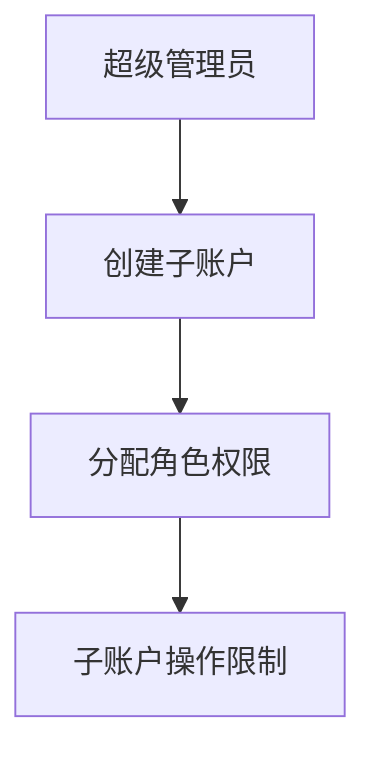

# 广告代运营账号权限设计调研报告

## 一、调研背景

在广告代运营业务中，账号权限管理至关重要。合理的权限设计能够保障数据安全、提升运营效率，同时满足多角色协作、数据隔离等核心需求。本报告结合主流权限管理模型（如RBAC）与广告行业特性，深入探讨适用于广告代运营场景的账号权限设计方案。

## 二、权限管理核心模型分析

### 1. RBAC模型体系

- **RBAC0（基础模型）**
    - **结构**：用户、角色、权限之间形成多对多的关系。
    - **特点**：通过角色来简化权限分配，一个用户可拥有多个角色，一个角色也能关联多个权限。
    - **图示**：
    ```mermaid
    graph LR
    A[用户] -->|多对多| B[角色]
    B -->|多对多| C[权限]
    ```

- **RBAC1（角色分级）**
    - **结构**：引入角色继承机制，上级角色自动包含下级角色的权限。
    - **特点**：适合层级化的组织架构，例如财务总监可继承财务主管和出纳员的权限。
    - **图示**：
    ```mermaid
    graph TD
    A[上级角色] --> B[下级角色1]
    A --> C[下级角色2]
    B --> D[权限1]
    C --> E[权限2]
    ```

- **RBAC2（约束模型）**
    - **结构**：在RBAC0基础上增加多种约束条件。
    - **约束类型**：
        - **角色互斥**：如会计与审核员角色不能同时分配给同一用户。
        - **基数限制**：限制超级管理员角色的用户数量。
        - **先决条件约束**：用户需先拥有下级角色才能被赋予上级角色。
    - **图示**：
    ```mermaid
    graph LR
    A[用户] --> B[角色1]
    A --> C[角色2]
    B -->|互斥| C
    ```

- **RBAC3（统一模型）**：整合了RBAC1和RBAC2的特点，既支持角色分级，又能设置多种约束条件。

### 2. 广告行业适配

- **权限分类**
    - **资源权限**：包括客户信息、广告素材、投放数据等资产的访问权限。
    - **操作权限**：涵盖增删改查、审核、投放等功能权限。

- **数据隔离需求**：同一角色的不同用户需根据区域、客户类型等维度进行数据隔离。

## 三、广告代运营权限设计方案

### 1. 角色体系设计

| 角色类型   | 典型角色       | 核心权限                                                                 |
|------------|----------------|--------------------------------------------------------------------------|
| 基础角色   | 超级管理员     | 全局权限，负责系统配置与高级策略制定                                     |
|            | 运营人员       | 客户管理、广告投放、数据分析等操作权限                                   |
|            | 财务人员       | 账单管理、费用结算等财务相关权限                                         |
|            | 客服人员       | 客户咨询响应、基础数据查询权限                                           |
| 扩展角色   | 代理商管理员   | 管理子账户权限与资源分配                                                 |
|            | 广告主代表     | 有限的数据查看与需求提交权限                                             |

### 2. 权限分配策略

- **基于角色的批量授权**：通过角色模板快速分配权限，减少重复操作。
- **数据维度精细化控制**：结合客户ID、地域、广告类型等字段实现数据行级权限控制。
- **操作审计与日志**：记录所有权限变更与敏感操作，便于追溯与合规检查。

### 3. 技术实现要点

- **数据JSON化存储**：动态扩展权限字段，适应业务变化。
- **多级缓存与分布式存储**：保障高并发场景下的权限校验性能。
- **SDK化接口**：简化第三方平台接入，提升系统扩展性。

## 四、典型问题与解决方案

### 1. 问题场景

| 问题类型   | 具体场景                                                                 |
|------------|--------------------------------------------------------------------------|
| 权限冲突   | 同一用户同时拥有互斥角色（如“编辑”与“审核”）                             |
| 数据泄露风险 | 低权限用户越权访问敏感数据                                               |
| 跨平台权限同步 | 广告主账号在多个代运营平台的权限一致性问题                               |

### 2. 解决方案

- **角色互斥规则**：在系统中预设互斥角色组合，阻止冲突分配。
- **字段级权限控制**：对客户手机号、银行卡号等敏感字段设置单独访问开关。
- **统一权限中心**：通过API同步各平台权限数据，确保实时一致性。

## 五、行业实践案例

### 1. 腾讯广告代理商平台

- **权限结构**：
    - **超级管理员**：由开户账号直接绑定，拥有最高权限。
    - **子账户管理**：支持创建广告主员工账号，通过角色分配控制其访问范围。
    - **操作限制**：非管理员账号无法修改核心投放策略，降低误操作风险。

- **流程图**：



### 2.第三方代运营系统


• 权限管理界面：

• 用户组与组织架构绑定：自动同步企业部门结构，实现权限的动态继承与调整。

• 广告位分级管理：根据广告位价值设置不同操作权限（如“高价值广告位需双人审核”）。


## 六、实施建议


### 1.分阶段落地


• 基础阶段：实现RBAC0模型，完成角色与基础权限配置。

• 进阶阶段：引入数据维度控制与操作审计功能。

• 优化阶段：结合AI分析用户行为，自动调整权限分配策略。


### 2.工具推荐


 工具类型       	 推荐工具                  	 功能描述                                 	
 权限管理系统   	 IAM（Identity and Access Management）工具，如Okta、Azure AD 	 提供身份认证、权限分配等功能             	
 数据安全工具   	 DLP（Data Loss Prevention）系统 	 防止敏感数据泄露                         	
 审计工具       	 日志管理平台（如ELK Stack） 	 实现操作全链路追踪                       	


## 七、总结

广告代运营账号权限设计是一个复杂且关键的环节。通过合理运用RBAC模型及其扩展，结合数据维度的精细化控制和自动化工具的应用，能够构建出高效且合规的权限体系。未来，随着技术的发展，结合机器学习技术实现权限的智能预测与动态调整，将进一步提升运营效率与风险防控能力。