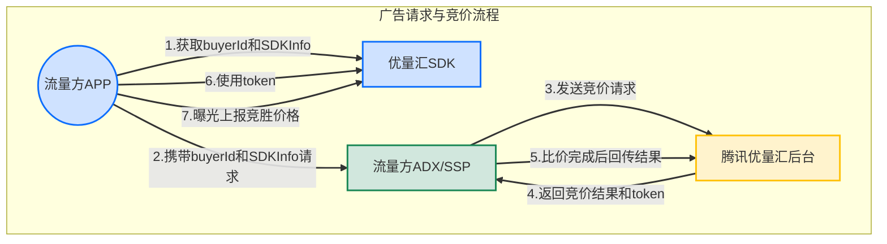
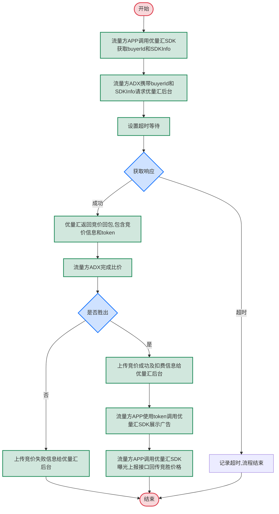

# 以SSP身份接入腾讯优量汇ADX的产品设计

## 1. 用例图

### 1.1 用例描述



#### 1.1.1 获取buyerId和SDKInfo
- 描述：流量方App调用优量汇SDK接口获取竞价所需的buyerId和SDKInfo信息
- 参与者：流量方APP、优量汇SDK
- 前置条件：流量方APP已集成优量汇SDK
- 后置条件：获取到用于竞价请求的必要参数

#### 1.1.2 携带buyerId和SDKInfo请求
- 描述：流量方APP将获取到的buyerId和SDKInfo信息提交给流量方ADX/SSP系统
- 参与者：流量方APP、流量方ADX/SSP
- 前置条件：已获取buyerId和SDKInfo信息
- 后置条件：流量方ADX/SSP接收请求，准备进行竞价

#### 1.1.3 发送竞价请求
- 描述：流量方ADX/SSP将携带buyerId和SDKInfo的请求发送至腾讯优量汇后台
- 参与者：流量方ADX/SSP、腾讯优量汇后台
- 前置条件：流量方ADX/SSP已接收到有效请求参数
- 后置条件：腾讯优量汇后台接收竞价请求并开始处理

#### 1.1.4 返回竞价结果和token
- 描述：腾讯优量汇后台返回竞价结果和SDK渲染广告所需的token
- 参与者：腾讯优量汇后台、流量方ADX/SSP
- 前置条件：腾讯优量汇后台完成竞价
- 后置条件：流量方ADX/SSP接收到竞价结果和token

#### 1.1.5 比价完成后回传结果
- 描述：流量方ADX/SSP完成比价后，上传竞价成功/失败及扣费信息给腾讯优量汇后台
- 参与者：流量方ADX/SSP、腾讯优量汇后台
- 前置条件：流量方ADX/SSP完成内部比价
- 后置条件：腾讯优量汇后台接收竞价结果信息

#### 1.1.6 使用token展示广告
- 描述：流量方APP使用竞价回包中的token调用优量汇SDK展示广告
- 参与者：流量方APP、优量汇SDK
- 前置条件：优量汇竞价成功且获得token（在收到token后90秒内有效）
- 后置条件：流量方APP通过SDK展示优量汇广告

#### 1.1.7 曝光上报竞胜价格
- 描述：流量方APP通过优量汇SDK上报广告曝光及竞胜价格
- 参与者：流量方APP、优量汇SDK
- 前置条件：广告已成功展示
- 后置条件：上报竞胜价格信息给腾讯优量汇平台

## 2. 流程图

### 2.1 流程描述



#### 2.1.1 获取buyerId和SDKInfo
- 步骤：流量方APP调用优量汇SDK接口获取请求buyerId和SDKInfo。
- 说明：buyerId和SDKInfo用于从优量汇后端获取竞价信息，SDKInfo为必传参数。

#### 2.1.2 请求优量汇后台
- 步骤：流量方ADX携带buyerId和SDKInfo信息请求优量汇后台。
- 说明：通过HTTP POST方式发送请求，包含必要的认证信息和参数。

#### 2.1.3 设置超时等待
- 步骤：设置请求超时时间，等待优量汇后台响应。
- 说明：设置合理的超时时间，确保总体响应时间可控。

#### 2.1.4 获取响应
- 步骤：接收优量汇后台的响应或超时。
- 说明：判断是否在超时时间内收到有效响应。

#### 2.1.5 接收竞价回包
- 步骤：优量汇后台返回竞价回包，其中包含竞价信息和sdk渲染广告的token。
- 说明：回包中包含的token用于后续广告展示。

#### 2.1.6 完成比价
- 步骤：流量方ADX完成内部比价流程。
- 说明：将优量汇的竞价与其他广告源进行比较，决定最终展示的广告。

#### 2.1.7 上传竞价结果
- 步骤：上传竞价成功/失败及扣费等信息给优量汇后台服务。
- 说明：无论竞价成功还是失败，都需要将结果通知优量汇后台。

#### 2.1.8 使用token展示广告
- 步骤：竞价成功后，流量方APP使用竞价回包中的token调用优量汇SDK展示广告接口。
- 说明：从收到token到调用展示接口的时延不可超过90秒，否则可能无法拉取广告。

#### 2.1.9 曝光上报
- 步骤：流量方APP调用优量汇SDK曝光上报接口回传竞胜价格。
- 说明：确保广告展示后进行正确的曝光上报，以便进行计费和数据统计。

## 3. 序列图

### 3.1 序列描述

```mermaid
sequenceDiagram
    participant App as 流量方APP
    participant SDK as 优量汇SDK
    participant SSP as 流量方ADX/SSP
    participant Tencent as 腾讯优量汇后台
    
    Note over App,Tencent: 广告请求和返回流程
    
    App->>SDK: 1.调用SDK接口获取buyerId和SDKInfo
    SDK-->>App: 返回buyerId和SDKInfo
    App->>SSP: 2.携带buyerId和SDKInfo请求广告
    SSP->>Tencent: 3.携带buyerId和SDKInfo请求优量汇后台
    
    alt 正常响应
        Tencent-->>SSP: 4.返回竞价回包(含竞价信息和token)
        SSP->>SSP: 内部比价流程
        
        alt 竞价成功
            SSP->>Tencent: 5a.上传竞价成功及扣费信息
            SSP-->>App: 返回广告结果及token
            App->>SDK: 6.使用token调用优量汇SDK展示广告
            App->>SDK: 7.调用SDK曝光上报接口回传竞胜价格
        else 竞价失败
            SSP->>Tencent: 5b.上传竞价失败信息
            SSP-->>App: 返回其他广告源广告
        end
    else 超时或错误
        Tencent--xSSP: 请求超时或失败
        SSP->>SSP: 记录错误信息
        SSP-->>App: 返回其他广告源广告或空
    end
    
    Note over App,Tencent: 备注说明
    Note right of SSP: STEP4和STEP5无严格顺序
    Note right of App: STEP3返回token与STEP6使用token时延不可超过90s
    Note right of SDK: SDKInfo为必传参数，缺失将影响推荐效果
```



#### 3.1.1 获取buyerId和SDKInfo
- 描述：流量方APP调用优量汇SDK接口获取请求buyerId和SDKInfo
- 交互：App -> SDK
- 数据：SDK接口调用请求
- 返回：buyerId和SDKInfo信息

#### 3.1.2 携带buyerId和SDKInfo请求广告
- 描述：流量方APP将buyerId和SDKInfo信息提交给流量方ADX/SSP
- 交互：App -> SSP
- 数据：广告请求数据（包含buyerId和SDKInfo）

#### 3.1.3 请求优量汇后台
- 描述：流量方ADX/SSP携带buyerId和SDKInfo信息请求优量汇后台
- 交互：SSP -> Tencent
- 数据：符合腾讯优量汇规范的竞价请求数据

#### 3.1.4 返回竞价回包
- 描述：优量汇后台返回流量方ADX竞价回包，包含竞价信息和SDK渲染广告的token
- 交互：Tencent -> SSP
- 数据：竞价回包，包含竞价价格和token

#### 3.1.5a 上传竞价成功及扣费信息
- 描述：竞价成功后，流量方ADX上传竞价成功及扣费等信息给优量汇后台
- 交互：SSP -> Tencent
- 数据：竞价成功和扣费信息

#### 3.1.5b 上传竞价失败信息
- 描述：竞价失败后，流量方ADX上传竞价失败信息给优量汇后台
- 交互：SSP -> Tencent
- 数据：竞价失败信息

#### 3.1.6 使用token调用优量汇SDK展示广告
- 描述：流量方APP使用竞价回包中的token调用优量汇SDK展示广告接口
- 交互：App -> SDK
- 数据：token及展示广告请求
- 备注：从收到token到调用展示接口的时延不可超过90秒

#### 3.1.7 曝光上报回传竞胜价格
- 描述：流量方APP调用优量汇SDK曝光上报接口回传竞胜价格
- 交互：App -> SDK
- 数据：曝光上报及竞胜价格信息

## 4. 接口协议规范

### 4.1 YLH SDK接入规范

#### 4.1.1 获取竞价请求buyerID和SDKInfo

**名词解释**：
- **服务端竞标出价**：通过服务端向腾讯优量汇发送竞价请求，获取广告资源和价格

##### 4.1.1.1 Android示例

通过 `GDTAdSdk.getGDTAdManger().getBuyerId(Map<String, Object> map)` 获取 `buyerId`, 用来获取本条竞价广告的 token。

通过 `GDTAdSdk.getGDTAdManger().getSDKInfo(String posId)` 获取 `sdkInfo`, 用来获取本条竞价广告的 sdkInfo (4.430.1300及以上SDK版本支持)。

```java
/**
 * 获取 buyerId 用于 Server Bidding 请求获取 token, 建议每次请求前调用一次, 并使用最新值请求
 * @param map 开发者自定义参数，无具体定义时可传null
 */
public String getBuyerId(Map<String, Object> map)

/**
 * 获取 sdkInfo 参数，用于 Server Bidding 请求获取 sdkInfo, 建议每次请求前调用一次, 并使用最新值请求
 * @param posId 广告位ID
 */
public String getSDKInfo(String posId)
```

##### 4.1.1.2 iOS示例

通过 `[GDTSDKConfig getBuyerIdWithContext:nil]` 获取 `buyerId`, 用来获取本条竞价广告的 token。

通过 `[GDTSDKConfig getSDKInfoWithPlacementId]`获取 `SDKInfo`，用来获取本条竞价广告的 token (4.13.30及以上SDK版本支持)。

```objective-c
/**
 *  获取 buyerId 用于 Server Bidding 请求获取 token, 建议每次请求前调用一次, 并使用最新值请求
 */
+ (NSString *)getBuyerIdWithContext:(NSDictionary *)info;

/**
 *  获取用于 Server Bidding 请求SDK侧相关请求参数信息, 建议每次请求前调用一次, 并使用最新值请求
 *  @param placementId  广告位 ID
 */
+ (NSString *)getSDKInfoWithPlacementId:(NSString *)placementId;
```

### 4.2 Server端竞价请求协议

#### 4.2.1 竞价请求

采用OpenRTB协议

**请求路径**： `https://mi.gdt.qq.com/server_bidding`

**请求方式**： `POST`

**请求头**：
```
Content-Type: application/json
Accept: application/json
```

**Bid请求**

| 字段   | 类型       | 必填 | 描述                                                                                                        |
| ------ | ---------- | ---- | ----------------------------------------------------------------------------------------------------------- |
| id     | 字符串     | 是   | 流量方ADX生成的出价请求 ID；例如，'570b0eb14e67c98f761a0ca0'。                                              |
| imp    | 对象数组   | 是   | 请参阅Imp对象。                                                                                             |
| app    | 对象       | 是   | 请参阅应用程序对象。                                                                                        |
| device | 对象       | 是   | 请参阅设备对象。                                                                                            |
| cur    | 字符串数组 | 否   | 以ISO-4217-alpha 显示的允许的拍卖货币，每次请求仅选择支持一种货币，目前仅支持CNY，例如，["CNY"]，单次请求。 |
| ext    | 对象       | 是   | 请求BuyerId以及其他功能支持开关                                                                             |

**Imp对象**

| 字段        | 类型    | 必填 | 描述                                                                                           |
| ----------- | ------- | ---- | ---------------------------------------------------------------------------------------------- |
| id          | 字符串  | 是   | 流量方ADX生成的展示 ID；例如，'3a06eb14e67c98f761add01'。                                      |
| bidfloor    | 浮动    | 否   | 让出价合格的最低出价价格；例如，'8.72'，精度为小数点后两位，单位（分/千次）;目前已屏蔽底价功能 |
| bidfloorcur | 字符串  | 否   | 以 ISO-4217-alpha 显示的展示货币；目前仅支持CNY，例如，'CNY'。                                 |
| video       | 对象    | 可选 | 请参阅视频对象，召回视频素材时必填，建议填写，提升变现效率。                                   |
| tagid       | 字符串  | 是   | 广告位 ID。                                                                                    |
| ad_count    | integer | 否   | 一次请求返回的广告数（最大可支持条数=10，超过10条时按照10条返回）                              |

**视频对象**

| 字段        | 类型    | 必填 | 描述                       |
| ----------- | ------- | ---- | -------------------------- |
| h           | integer | 否   | 视频高度，可能影响展示效果 |
| w           | integer | 否   | 视频宽度，可能影响展示效果 |
| minduration | integer | 否   | 视频必须播放的最少秒数。   |
| maxduration | integer | 否   | 视频可以播放的最长秒数。   |

**应用程序对象**

| 字段   | 类型   | 必填 | 描述                                           |
| ------ | ------ | ---- | ---------------------------------------------- |
| id     | 字符串 | 是   | 优量汇的appid；例如，'3709293'。               |
| bundle | 字符串 | 是   | 捆绑包或包名称（例如，'com.supercell.hayday'） |
| name   | 字符串 | 否   | 应用程序名称；例如，'hay day'。                |

**设备对象**

| 字段           | 类型    | 必填 | 描述                                                                                                                                                                                                                                                                              |
| -------------- | ------- | ---- | --------------------------------------------------------------------------------------------------------------------------------------------------------------------------------------------------------------------------------------------------------------------------------- |
| ua             | 字符串  | 是   | 设备浏览器用户代理字符串；例如，'Mozilla/5.0 (iPhone; CPU iPhone OS 9_1 like Mac OS X) AppleWebKit/601.1.46 (KHTML, like Gecko) Version/9.0 Mobile/13B143 Safari/601.1'。                                                                                                         |
| ip             | 字符串  | 是   | 当ipv6存在时，非必须。展示的IP地址，例如： '212.14.27.104'。                                                                                                                                                                                                                      |
| ipv6           | 字符串  | 是   | 当IP地址存在时，该字段非必须。展示的IPv6地址，示例：'3ffe:1900:4545:3:200:f8ff:fe21:67cf'。                                                                                                                                                                                       |
| h              | integer | 是   | 以像素计的设备屏幕高度。                                                                                                                                                                                                                                                          |
| w              | integer | 是   | 以像素计的设备屏幕宽度。                                                                                                                                                                                                                                                          |
| connectiontype | integer | 是   | 请参阅 OpenRTB 2.6 第 5.22 部分。                                                                                                                                                                                                                                                 |
| ifa            | 字符串  | 是   | 支持的供广告客户用于纯文本的 ID，安卓系统为imei，ios系统为idfa；例如，'e4fe9bdecaa047b6908dffba3fa184f2'。                                                                                                                                                                        |
| didmd5         | 字符串  | 是   | (仅Android端) imei信息的MD5值，用以补充无法传明文imei的请求。取值方法：调用的系统 API 为 TelephonyManager#getDeviceId，该 API 返回的可能是 IMEI(GSM 设备，纯数字)，也可能是 MEID(CDMA 设备，可能有字母)。需要将imei 信息转化为小写，并对其结果计算MD5值，且确保其最终结果为小写。 |
| geo            | 对象    | 否   | 请参阅地理对象。                                                                                                                                                                                                                                                                  |
| make           | 字符串  | 否   | 设备制造。                                                                                                                                                                                                                                                                        |
| model          | 字符串  | 否   | 设备型号。                                                                                                                                                                                                                                                                        |
| os             | 字符串  | 是   | 设备操作系统；例如，'iOS', 'Android'。枚举值：<br>- 'iOS'<br>- 'Android'<br>- 'Windows'                                                                                                                                                                                           |
| osv            | 字符串  | 否   | 设备操作系统的版本；例如，'9.1', '8.0'。                                                                                                                                                                                                                                          |
| devicetype     | integer | 否   | 请参阅 OpenRTB 2.5 第5.21部分                                                                                                                                                                                                                                                     |
| language       | 字符串  | 否   | 以 ISO-639-1-alpha-2 显示的设备语言；例如，'en'。                                                                                                                                                                                                                                 |
| ext            | 字符串  | 是   | 请参阅设备ext对象                                                                                                                                                                                                                                                                 |

**设备ext对象** 备注：设备ext对象会做校验，ios如无上传信息，可以上传空对象

| 字段       | 类型   | 必填 | 描述                                                                                  |
| ---------- | ------ | ---- | ------------------------------------------------------------------------------------- |
| oaid       | 字符串 | 是   | 安卓oaid，能获取到则上传，可能影响广告效果                                            |
| android_id | 字符串 | 是   | 安卓id，能获取到则上传，可能影响广告效果                                              |
| time_zone  | 字符串 | 否   | 在 IANA 时区数据库中使用时区名称作为格式的设备时区设置；例如，'America/Los_Angeles'。 |

**地理对象**

| 字段    | 类型   | 必填 | 描述                                                     |
| ------- | ------ | ---- | -------------------------------------------------------- |
| country | 字符串 | 是   | 以 ISO-3166-1-alpha-3 显示的国家/地区代码；例如，'USA'。 |
| lat     | 浮动   | 否   | 设备的纬度；例如，'[-90, 90]'。                          |
| long    | 浮动   | 否   | 设备的经度；例如，'[-180, 180]'。                        |

**ext对象**

| 字段                   | 类型    | 必填 | 描述                                                                     |
| ---------------------- | ------- | ---- | ------------------------------------------------------------------------ |
| buyer_id               | 字符串  | 是   | 优量汇SDK获取的buyerID                                                   |
| wx_installed           | boolean | 是   | 是否安装微信，用于判断是否能支持微信小程序广告                           |
| opensdk_ver            | string  | 否   | openSDK 版本，用于判断是否能支持微信小程序广告                           |
| support_h265           | boolean | 否   | 是否支持h265                                                             |
| support_splash_zoomout | boolean | 否   | 是否支持开屏 V+                                                          |
| sdk_info               | string  | 是   | 优量汇SDK获取的SDKInfo，缺失时将影响广告推荐效果，强烈建议开发者全量上传 |

#### 4.2.2 竞价响应

**回包Header**
```
Content-Type: application/json 
X-OpenRTB-Version: 2.5或2.3
```

**BidResponse**

| 字段    | 类型     | 必填 | 描述                                                                                                |
| ------- | -------- | ---- | --------------------------------------------------------------------------------------------------- |
| id      | 字符串   | 是   | BidRequest ID是由请求生成的，示例 '570ffeb14e67998f761a791c'。这必须与 BidRequest object 的ID匹配。 |
| bidid   | 字符串   | 否   | 帮助记录/跟踪的出价人生成的唯一响应 ID                                                              |
| cur     | 字符串   | 否   | 使用 ISO-4217 alpha 代码的出价货币，目前支持CNY                                                     |
| seatbid | 对象数组 | 是   | seatbid 对象数组；如果进行了出价则需要。                                                            |
| nbr     | integer  | 否   | 未参与竞价的原因，详见 错误码含义。                                                                 |
| token   | 字符串   | 是   | 优量汇有广告参与竞价时必填，为返回展示广告的token，竞价成功后调用优量汇SDK展示广告时使用            |

**SeatBid 对象**

| 字段 | 类型     | 必填 | 描述                                                       |
| ---- | -------- | ---- | ---------------------------------------------------------- |
| seat | 字符串   | 否   | Bidder seat ID是该代表该竞价请求来源。请参阅 OpenRTB 2.5。 |
| bid  | 对象数组 | 是   | 请查看Bid object。 至少拥有一个竞价                        |

**Bid Object**

| 字段   | 类型    | 必填 | 描述                                                                                                                                                                           |
| ------ | ------- | ---- | ------------------------------------------------------------------------------------------------------------------------------------------------------------------------------ |
| id     | 字符串  | 是   | traceid。                                                                                                                                                                      |
| impid  | 字符串  | 是   | 与为其出价的出价请求的展示有关的展示 ID。必须与出价请求中imp对象中的 ID 相同。                                                                                                 |
| price  | 浮动    | 是   | 以 CPM 单位表示的出价价格；例如，'10.30'。单位：分/千次，精度为小数点后两位                                                                                                    |
| nurl   | 字符串  | 是   | 竞价胜出时 调用的胜出通知 URL。                                                                                                                                                |
| lurl   | 字符串  | 是   | 竞价失败时，调用的通知URL。                                                                                                                                                    |
| cid    | 字符串  | 建议 | 广告 ID。                                                                                                                                                                      |
| crid   | 字符串  | 建议 | 创意 ID。                                                                                                                                                                      |
| bundle | 字符串  | 建议 | 唯一的市场 ID，这是平台特定的应用程序识别码，对于应用是唯一的。<br>- 在 Android 上，这应该是捆绑包或包名称（例如，'com.supercell.hayday'）。<br>- 在 iOS 上，这是一个数字 ID。 |
| h      | integer | 建议 | 创意的高度。                                                                                                                                                                   |
| w      | integer | 建议 | 创意的宽度。                                                                                                                                                                   |

### 4.3 接口示例

#### 4.3.1 请求示例

##### 4.3.1.1 视频广告请求示例

```json
{
    "id": "5f0417f6354b680001e94518",
    "imp": [{
        "id": "1",
        "video": {
            "minduration": 0,
            "maxduration": 46,
            "w": 720,
            "h": 1422,
            "linearity": 1,
            "minbitrate": 250,
            "maxbitrate": 15000
        },
        "tagid": "9040714184494018",
        "bidfloor": 1.00,
        "bidfloorcur": "CNY",
        "secure": 1
    }],
    "app": {
        "id": "5afa947e9c8119360fba1bea",
        "name": "VungleApp123",
        "bundle": "com.qq.e.union.demo.union"
    },
    "device": {
        "ua": "Mozilla/5.0 (Linux; Android 9; SM-A207F Build/PPR1.180610.011; wv) AppleWebKit/537.36 KHTML, like Gecko) Version/4.0 Chrome/74.0.3729.136 Mobile Safari/537.36",
        "geo": {
            "lat": -7.2484,
            "lon": 112.7419
        },
        "ip": "115.178.227.128",
        "devicetype": 1,
        "make": "samsung",
        "model": "SM-A207F",
        "os": "android",
        "osv": "9",
        "h": 1422,
        "w": 720,
        "language": "en",
        "connectiontype": 2,
        "ifa": "dd94e183d8790d057fc73d9c761ea2fa",
        "ext": {
            "oaid": "0176863C3B9A5E419BCAF702B37BEFB38B8D05CEA84022FB76BD723BA89D2ED2116F960A73FE1FFB12499E31EF664F5EAE87386F19D8A41390FEBAA5362042BC7A601D4CB006DA4E66"
        }
    },
    "cur": ["CNY"],
    "ext": {
        "buyer_id": "W8IBAhGgFP7LXv2b8wdmSDwVBeBShqIq5gV7fO7-6dP0Pof9HwP0UvxvXRc5D-zMao8rh3m6nuPyI_BCZ52zddpY1-itIMyUmeQXRePiNiIeXpNW4vn6kzlrVHwfVvVfNNHaI_FwczJQZSE4rKF-W2VwFrPM8ISY5hJytk6mWpDt_CIGCx4u9nDTdXFUISduddvJJzHsHRrB6VbtwX3vaKG2d0Y"
    }
}
```

**说明**：以上示例展示了视频广告的请求。请注意device.ext中包含了Android设备的oaid信息，这对于广告定向和效果优化非常重要。

##### 4.3.1.2 横幅广告请求示例

```json
{
  "id": "123e4567-e89b-12d3-a456-426614174000",
  "imp": [
    {
      "id": "1",
      "tagid": "广告位ID",
      "bidfloor": 0.5,
      "bidfloorcur": "CNY",
      "secure": 1,
      "banner": {
        "w": 640,
        "h": 100,
        "mimes": ["image/jpeg", "image/png"]
      }
    }
  ],
  "app": {
    "id": "应用ID",
    "name": "应用名称",
    "bundle": "com.example.app",
    "ver": "1.0.0",
    "publisher": {
      "id": "媒体ID"
    }
  },
  "device": {
    "ua": "用户代理字符串",
    "ip": "123.123.123.123",
    "geo": {
      "lat": 39.9042,
      "lon": 116.4074,
      "country": "CHN",
      "city": "北京"
    },
    "make": "Apple",
    "model": "iPhone X",
    "os": "iOS",
    "osv": "14.0",
    "connectiontype": 2,
    "ifa": "IDFA或OAID值"
  },
  "user": {
    "id": "用户ID",
    "gender": "M",
    "yob": 1990
  },
  "at": 2,
  "tmax": 150
}
```

**说明**：此示例展示了横幅广告的请求格式，包含了banner对象来指定广告尺寸和支持的媒体类型。

#### 4.3.2 响应示例

##### 4.3.2.1 参与竞价响应示例

```json
{
    "bidid": "sgorcyoria55s",
    "cur": "CNY",
    "id": "5f0417f6354b680001e94518",
    "seatbid": [{
        "bid": [{
            "bundle": "",
            "cid": "1954948",
            "crid": "1366623",
            "h": 1920,
            "id": "aiknzfwzv345a01",
            "impid": "1",
            "lurl": "https://win.gdt.qq.com/win_notice.fcg?adx_id=6&viewid=ZVcbrgjA7F4NkZu!F3oy4Q3cMNg6wnvSuCwsYpCfPiD1IhGmO5P6aZBdP8r_9udpyWjmXGaOq8b_vQXvPn3MtShVFpZc07qHqTihtZ!rd_Ajsl4RZNYCGtMdmGGGed!f7nosRPUks9LzrvvSmOGgFuuIX0xHS3Xhzb078GHynEz9SpZo!jyUlXvxPMMpBctuknggFEbMhXh42I8wZDt9UNGbomUi4r2b3k2b!oKnz5uuZmWYdyWqu9DFJ5pIqmeNZA0ROFpxGg0212l91GKRkc7nAPhyNt6uujLLAYYHpuoVyeumBhuO3Hqw5Qbx1yA97HspxciEJQrgJcYkQ2WIqET1UffM8wBLXDgJQMz7BX4&win_price=${AUCTION_PRICE}&server_bidding_type=1&win_seat=${AUCTION_SEAT_ID}&loss=${AUCTION_LOSS}&exchange_rate=6.46",
            "nurl": "https://win.gdt.qq.com/win_notice.fcg?adx_id=6&viewid=ZVcbrgjA7F4NkZu!F3oy4Q3cMNg6wnvSuCwsYpCfPiD1IhGmO5P6aZBdP8r_9udpyWjmXGaOq8b_vQXvPn3MtShVFpZc07qHqTihtZ!rd_Ajsl4RZNYCGtMdmGGGed!f7nosRPUks9LzrvvSmOGgFuuIX0xHS3Xhzb078GHynEz9SpZo!jyUlXvxPMMpBctuknggFEbMhXh42I8wZDt9UNGbomUi4r2b3k2b!oKnz5uuZmWYdyWqu9DFJ5pIqmeNZA0ROFpxGg0212l91GKRkc7nAPhyNt6uujLLAYYHpuoVyeumBhuO3Hqw5Qbx1yA97HspxciEJQrgJcYkQ2WIqET1UffM8wBLXDgJQMz7BX4&win_price=${AUCTION_PRICE}&server_bidding_type=1&exchange_rate=6.46&highest_loss_price=${HIGHEST_LOSS_PRICE}",
            "price": 39.62,
            "w": 1080
        }],
        "seat": "Tencent"
    }],
    "token": "SampleTokenString123456789" // 实际token会更长，此处为演示简化
}
```

**说明**：此示例展示了优量汇参与竞价并返回出价信息的情况。响应中包含了竞价信息、获胜通知URL(nurl)、失败通知URL(lurl)以及用于SDK渲染广告的token。

##### 4.3.2.2 带广告素材的响应示例

```json
{
  "id": "123e4567-e89b-12d3-a456-426614174000",
  "bidid": "bid-123456789",
  "seatbid": [
    {
      "bid": [
        {
          "id": "1",
          "impid": "1",
          "price": 2.5,
          "adm": "<a href=\"https://click.example.com?id=123\"></a>",
          "adomain": ["example.com"],
          "crid": "creative-123456",
          "w": 640,
          "h": 100,
          "nurl": "https://win.example.com/win?price=${AUCTION_PRICE}",
          "burl": "https://billing.example.com/bill?price=${AUCTION_PRICE}",
          "lurl": "https://loss.example.com/loss?price=${AUCTION_PRICE}"
        }
      ]
    }
  ],
  "cur": "CNY"
}
```

**说明**：此示例展示了包含广告素材(adm字段)的响应，主要用于HTML广告形式。

##### 4.3.2.3 不参与竞价响应示例

```json
{
    "id": "1234567890", 
    "nbr": 10001
}
```

**说明**：此示例展示了优量汇不参与竞价的情况。nbr字段表示不参与竞价的原因代码，详细错误码含义可参考[优量汇开发者文档](https://e.qq.com/dev/help_detail.html?cid=2911&pid=7902)。

### 4.4 事件通知接口

#### 4.4.1 竞价获胜通知(nurl)
- **URL**: 由腾讯优量汇在响应中提供的nurl
- **方法**: GET
- **说明**: SSP在广告被选中展示时，向该URL发送请求，通知腾讯优量汇竞价获胜

#### 4.4.2 计费通知(burl)
- **URL**: 由腾讯优量汇在响应中提供的burl
- **方法**: GET
- **说明**: SSP在广告被成功展示时，向该URL发送请求，通知腾讯优量汇进行计费

#### 4.4.3 竞价失败通知(lurl)
- **URL**: 由腾讯优量汇在响应中提供的lurl
- **方法**: GET
- **说明**: SSP在腾讯优量汇竞价失败(未胜出)时，向该URL发送请求，通知腾讯优量汇竞价失败

#### 4.4.4 宏替换规则
URL中的宏将被替换为实际值：
- ${AUCTION_PRICE}: 广告竞价获胜的价格(CPM)
- ${AUCTION_ID}: 竞价ID
- ${AUCTION_BID_ID}: 出价ID
- ${AUCTION_IMP_ID}: 展示ID
- ${AUCTION_SEAT_ID}: 席位ID
- ${AUCTION_AD_ID}: 广告ID

### 4.5 优量汇SDK展示广告接口

流量方ADX完成比价后，若优量汇竞价获胜，需要使用竞价回包中的token调用优量汇SDK接口来展示广告。

#### 4.5.1 Android端接口调用

以激励视频广告形态为例：

```java
/**
 * 构造函数, S2S bidding 后获取到 token 再调用此方法
 * 以激励视频为例，增加了如下构造函数
 * @param context 上下文
 * @param posID 广告位 ID
 * @param rewardVideoADListener 广告回调监听器
 * @param volumeOn 是否开启声音
 * @param token 通过 Server Bidding 请求回来的 token
 */
public RewardVideoAD(final Context context, final String posID,
                   final RewardVideoADListener rewardVideoADListener, final boolean volumeOn,
                   String token)
```

**使用示例**：

```java
RewardVideoAD rewardVideoAD = new RewardVideoAD(context, posID, adListener, true, token);
// 加载广告
rewardVideoAD.loadAD();
```

#### 4.5.2 iOS端接口调用

```objective-c
/**
 * 构造方法, S2S bidding 后获取到 token 再调用此方法
 * @param placementId 广告位 ID
 * @param token 通过 Server Bidding 请求回来的 token
 */
- (instancetype)initWithPlacementId:(NSString *)placementId token:(NSString *)token;
```

**使用示例**：

```objective-c
GDTRewardVideoAd *rewardVideoAd = [[GDTRewardVideoAd alloc] initWithPlacementId:@"placementId" token:token];
rewardVideoAd.delegate = self;
[rewardVideoAd loadAd];
```

### 4.6 竞价结果上报

#### 4.6.1 宏替换规则

上报URL中的宏参数将被替换为实际值。替换时需替换等号后面的整个字符串，例如`${AUCTION_LOSS}`替换为具体的数值。

**竞价成功通知URL示例**：
```
https://win.gdt.qq.com/win_notice.fcg?adx_id=6&viewid=&win_price=${AUCTION_PRICE}&server_bidding_type=1&highest_loss_price=${HIGHEST_LOSS_PRICE}
```

**竞价失败通知URL示例**：
```
https://win.gdt.qq.com/win_notice.fcg?adx_id=6&viewid=&win_price=${AUCTION_PRICE}&server_bidding_type=1&win_seat=${AUCTION_SEAT_ID}&loss=${AUCTION_LOSS}
```

#### 4.6.2 宏参数说明

| 宏参数                | 含义                       | 格式说明                                                                                                                                                                                 |
| --------------------- | -------------------------- | ---------------------------------------------------------------------------------------------------------------------------------------------------------------------------------------- |
| ${AUCTION_PRICE}      | 竞胜价格                   | 单位：分/千次，精度为小数点后两位，例如：10.12。<br>**安全要求**：使用RSA加密算法进行加密，之后进行base64编码，编码后再进行URL编码。<br>请向优量汇技术支持或运营经理申请RSA加密公钥。    |
| ${HIGHEST_LOSS_PRICE} | 竞胜时其他参竞方的最高出价 | 格式同上，需要使用相同的RSA加密算法处理。                                                                                                                                                |
| ${AUCTION_SEAT_ID}    | 竞胜方来源                 | 枚举值：<br>1=输给优量汇其它非bidding广告位<br>2=输给第三方ADN<br>3=输给自售广告主<br>4=输给优量汇其它bidding广告位                                                                      |
| ${AUCTION_LOSS}       | 失败原因                   | 枚举值：<br>1=有广告回包，竞败（优量汇不是本次竞价的最高出价方）<br>2=无广告回包（无填充、超时等原因）<br>101=有广告回包，但没有参与竞价（无比价机会）<br>10001=其他（优量汇有广告回包） |

#### 4.6.3 上报时机

- **竞价成功时**：在确认优量汇竞价获胜后，应立即调用nurl进行竞价获胜通知
- **竞价失败时**：在确认优量汇竞价失败后，应立即调用lurl进行竞价失败通知
- **重要提醒**：无论竞价成功或失败，都应进行对应通知，以确保优量汇能获得完整的竞价反馈数据，优化后续竞价策略

#### 4.6.4 联调测试工具

优量汇提供了在线联调测试工具，对于常见问题，会在返回中提示问题原因，并提供改进建议，提高接入效率。

**平台地址**：[https://utest.gdt.qq.com/joint/uniontest/](https://utest.gdt.qq.com/joint/uniontest/)

使用开发者平台账号登录即可访问测试平台。

### 4.7 接入注意事项

1. **SDK与服务端通信时效性**：从获取token到调用SDK展示广告的时延不可超过90秒，否则可能导致无法拉取广告

2. **必传参数**：请确保请求中包含完整的buyerId和SDKInfo，缺失这些信息将影响广告推荐效果

3. **STEP4和STEP5无严格顺序**：竞价成功/失败上报与使用token拉取广告没有严格的先后顺序要求

4. **安全要求**：价格宏替换时，必须按要求进行RSA加密处理，确保价格信息安全性

5. **错误处理**：当获取响应失败时，应有合理的降级和错误处理机制

6. **监控机制**：建议实现实时监控，及时发现并处理接入过程中的问题

## 5. 技术实现要点

### 5.1 腾讯优量汇账户配置
- 媒体ID与密钥管理
- 广告位ID映射关系维护
- 请求参数配置管理

### 5.2 请求转换处理
- OpenRTB标准请求到腾讯优量汇请求格式的转换
- 参数映射与数据转换
- 身份认证信息添加

### 5.3 响应处理
- 响应解析与验证
- 广告素材处理与转换
- 价格转换与标准化

### 5.4 错误处理与监控
- 请求超时处理
- 错误响应处理
- 性能监控与告警
- 日志记录与分析

### 5.5 计费与结算
- 展示计费事件触发
- 点击跟踪与转化归因
- 计费数据统计与对账

## 6. 数据映射关系

### 6.1 广告位类型映射

| 系统内部广告位类型 | 腾讯优量汇广告位类型 |
| ------------------ | -------------------- |
| 横幅广告           | BANNER               |
| 开屏广告           | SPLASH               |
| 插屏广告           | INTERSTITIAL         |
| 信息流广告         | NATIVE               |
| 视频广告           | VIDEO                |

### 6.2 设备类型映射

| 系统内部设备类型 | 腾讯优量汇设备类型 |
| ---------------- | ------------------ |
| 手机             | PHONE              |
| 平板             | TABLET             |
| 电视             | TV                 |
| 电脑             | PC                 |
| 其他             | OTHER              |

### 6.3 网络类型映射

| 系统内部网络类型 | 腾讯优量汇网络类型值 |
| ---------------- | -------------------- |
| 未知             | 0                    |
| 以太网           | 1                    |
| WiFi             | 2                    |
| 蜂窝网络-未知代  | 3                    |
| 2G               | 4                    |
| 3G               | 5                    |
| 4G               | 6                    |
| 5G               | 7                    |

## 7. 接入步骤

### 7.1 前期准备
1. 向腾讯优量汇申请媒体接入资格
2. 获取媒体ID和密钥
3. 配置广告位信息
4. 进行接口测试

### 7.2 开发实施
1. 实现请求转换适配器
2. 实现响应处理适配器
3. 实现事件通知机制
4. 进行测试环境联调

### 7.3 上线与验收
1. 小流量测试
2. 数据监控与验证
3. 全量上线
4. 效果评估与优化

## 8. 风险与应对措施

### 8.1 技术风险
- **请求延迟风险**: 实现请求超时机制，设置合理的超时阈值
- **格式转换错误**: 进行完整的单元测试和集成测试
- **接口变更风险**: 建立接口监控机制，及时响应接口变更

### 8.2 业务风险
- **填充率不足**: 分析原因并优化请求参数
- **收益不达预期**: 调整底价策略，优化广告位配置
- **广告质量问题**: 建立广告内容审核机制，及时反馈问题广告

### 8.3 运营风险
- **账号安全风险**: 严格管理账号密钥，定期更新密码
- **结算争议风险**: 建立完善的日志记录，保证数据可追溯
- **合规性风险**: 确保广告内容和用户数据处理符合相关法规