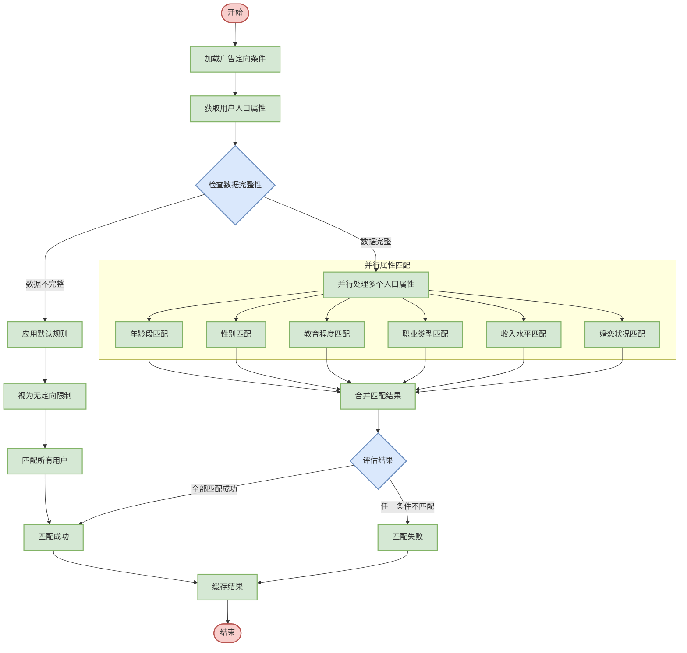

# 人口属性定向匹配逻辑设计

## 1. 流程图设计



## 2. 详细步骤说明

### 2.1 加载广告定向条件
- **输入**：广告ID
- **处理**：从广告配置中获取人口属性定向条件
- **输出**：人口属性定向规则集合
- **规则格式示例**：
  ```json
  {
    "age": {
      "ranges": [  // 年龄范围列表
        {"min": 18, "max": 23},  // 最小年龄18岁，最大年龄23岁
        {"min": 30, "max": 40}   // 最小年龄30岁，最大年龄40岁
      ]
    },
    "gender": ["F"],  // 性别列表，F-女性，M-男性
    "education": ["大专", "本科", "硕士"],  // 教育程度列表
    "occupation": ["学生", "IT", "金融"],   // 职业类别列表
    "income": {
      "min": 5000,  // 最低收入，单位：元/月
      "max": 20000  // 最高收入，单位：元/月
    },
    "maritalStatus": ["单身", "已婚"]  // 婚恋状况列表
  }
  ```

### 2.2 获取用户人口属性
- **输入**：用户ID
- **处理**：
  * 首先尝试从用户画像缓存中获取
  * 缓存未命中则查询用户画像服务
  * 提取用户基本人口属性信息
- **输出**：用户人口属性数据
- **数据格式示例**：
  ```json
  {
    "age": 25,                // 用户年龄，整数，单位：岁
    "gender": "M",            // 用户性别，M-男性，F-女性
    "education": "本科",      // 教育程度
    "occupation": "IT",       // 职业类别
    "income": 12000,          // 月收入，单位：元/月
    "maritalStatus": "单身"   // 婚恋状况
  }
  ```

### 2.3 检查数据完整性
- **输入**：用户人口属性数据
- **处理**：
  * 检查必要字段是否存在（如年龄、性别等）
  * 验证字段格式是否正确
  * 检查值是否在合法范围内
- **输出**：数据完整性检查结果
- **判断逻辑**：
  * 如果用户属性数据缺失较多（如超过3个关键属性缺失），视为数据不完整
  * 如果仅缺少非关键属性（如收入、教育程度），仍可进行部分匹配
  * 对于数据错误（如年龄为负数），需要进行修正或使用默认值

### 2.4 应用默认规则
- **输入**：广告定向规则，不完整的用户数据
- **处理**：
  * 对于数据不完整的情况，应用宽松匹配策略
  * 将缺失的属性视为"匹配任意值"
  * 只对可获取到的属性进行匹配判断
- **输出**：调整后的匹配策略
- **策略调整**：
  * 若广告对未知属性有严格要求，则标记为不匹配
  * 若广告无特定要求，则认为该维度不影响匹配结果

### 2.5 并行属性匹配
- **输入**：广告定向规则，用户人口属性数据
- **处理**：并行执行各属性的匹配逻辑
- **输出**：各属性的匹配结果（布尔值）
- **执行方式**：
  * 使用线程池并行处理多个属性匹配
  * 设置超时机制确保总体响应时间可控
  * 对计算复杂度大的属性匹配优先分配资源

### 2.6 各属性匹配逻辑

#### 2.6.1 年龄段匹配
- **判断逻辑**：
  * 检查用户年龄是否落在广告定向的任一年龄段范围内
  * 对于多个年龄段范围，满足任一范围即视为匹配成功
  * 年龄计算基于出生日期和当前日期，而非直接使用年龄字段
- **匹配步骤**：
  1. 检查定向规则是否包含年龄限制，无限制则直接返回匹配成功
  2. 验证用户年龄是否有效（正整数且在合理范围内）
  3. 遍历所有目标年龄段范围，检查用户年龄是否在范围内
  4. 如果用户年龄落在任一范围内，返回匹配成功
  5. 如果所有范围都不匹配，返回匹配失败

#### 2.6.2 性别匹配
- **判断逻辑**：
  * 检查用户性别是否在广告定向的性别列表中
  * 对于未指定性别的广告，视为匹配所有性别
  * 对于用户性别未知的情况，根据广告策略决定是否匹配
- **匹配步骤**：
  1. 检查定向规则是否包含性别限制，无限制则直接返回匹配成功
  2. 验证用户性别信息是否存在，不存在则根据默认策略处理
  3. 将用户性别与目标性别列表进行比较，检查是否包含
  4. 如果目标列表包含用户性别，返回匹配成功
  5. 否则返回匹配失败

#### 2.6.3 教育程度匹配
- **判断逻辑**：
  * 检查用户教育程度是否在广告定向的教育程度列表中
  * 教育程度可按层级关系处理（如研究生以上自动满足本科要求）
  * 缺失教育程度信息时，可根据年龄和职业推断
- **匹配步骤**：
  1. 检查定向规则是否包含教育程度限制，无限制则直接返回匹配成功
  2. 验证用户教育程度信息是否存在，不存在则根据默认策略处理
  3. 将用户教育程度转换为标准层级值（如博士=6，硕士=5，本科=4等）
  4. 遍历目标教育程度列表，将每个教育程度也转换为层级值
  5. 如果用户教育层级大于或等于任一目标层级，返回匹配成功
  6. 否则返回匹配失败

#### 2.6.4 职业类型匹配
- **判断逻辑**：
  * 检查用户职业是否在广告定向的职业列表中
  * 考虑职业的上下级关系（如IT工程师属于IT行业）
  * 支持模糊匹配（如"软件开发"匹配"IT"类别）
- **匹配步骤**：
  1. 检查定向规则是否包含职业限制，无限制则直接返回匹配成功
  2. 验证用户职业信息是否存在，不存在则根据默认策略处理
  3. 首先进行精确匹配，检查用户职业是否在目标列表中
  4. 如果精确匹配失败，获取用户职业所属的大类别
  5. 检查该大类别是否在目标列表中，如在则返回匹配成功
  6. 如果精确匹配和类别匹配都失败，返回匹配失败

#### 2.6.5 收入水平匹配
- **判断逻辑**：
  * 检查用户收入是否在广告定向的收入范围内
  * 收入可按月收入或年收入处理，需统一单位
  * 缺失收入信息时，可根据职业和地区推断
- **匹配步骤**：
  1. 检查定向规则是否包含收入限制，无限制则直接返回匹配成功
  2. 验证用户收入信息是否存在且有效，不存在或无效则根据默认策略处理
  3. 检查收入范围的上下限设置情况：
     - 如果仅有下限无上限，检查用户收入是否大于等于下限
     - 如果仅有上限无下限，检查用户收入是否小于等于上限
     - 如果同时有上下限，检查用户收入是否在范围内
  4. 根据比较结果返回匹配成功或失败

#### 2.6.6 婚恋状况匹配
- **判断逻辑**：
  * 检查用户婚恋状况是否在广告定向的婚恋状况列表中
  * 对于定向的多种状态，满足任一状态即匹配成功
  * 婚恋状况未知时，可根据年龄等因素进行推断
- **匹配步骤**：
  1. 检查定向规则是否包含婚恋状况限制，无限制则直接返回匹配成功
  2. 验证用户婚恋状况信息是否存在，不存在则根据默认策略处理
  3. 将用户婚恋状况与目标列表进行比较，检查是否包含
  4. 如果目标列表包含用户婚恋状况，返回匹配成功
  5. 否则返回匹配失败

### 2.7 合并匹配结果
- **输入**：各属性的匹配结果
- **处理**：
  * 采用"与"逻辑合并各属性匹配结果
  * 所有属性都匹配成功，才视为整体匹配成功
  * 记录不匹配的具体属性信息，用于分析和优化
- **输出**：最终匹配结果（布尔值）和不匹配原因
- **合并步骤**：
  1. 初始化最终结果为"匹配成功"
  2. 创建不匹配属性列表用于记录问题
  3. 遍历所有属性匹配结果
  4. 如有任何属性不匹配，将最终结果设为"匹配失败"并记录该属性
  5. 返回最终匹配结果和不匹配属性列表

### 2.8 缓存结果
- **输入**：匹配结果、用户ID、广告ID
- **处理**：
  * 将匹配结果缓存，避免短时间内重复计算
  * 设置合理的缓存过期时间
  * 记录缓存命中率，用于系统优化
- **输出**：更新缓存系统
- **缓存策略**：
  * 缓存键：用户ID + 广告ID
  * 缓存值：匹配结果 + 不匹配原因
  * 过期时间：根据用户信息更新频率设定，通常为1-24小时
  * 淘汰策略：LRU (Least Recently Used)

## 3. 系统配置参数

| 参数名称                     | 说明                   | 默认值  | 取值范围       | 调优建议                   |
| ---------------------------- | ---------------------- | ------- | -------------- | -------------------------- |
| demographic.cache.size       | 人口属性缓存大小       | 1000000 | 10000-10000000 | 根据用户规模和内存配置调整 |
| demographic.cache.expiration | 缓存过期时间(秒)       | 3600    | 60-86400       | 根据数据更新频率调整       |
| demographic.match.timeout    | 匹配超时时间(ms)       | 20      | 5-100          | 根据总体RT预算调整         |
| demographic.thread.pool.size | 属性匹配线程池大小     | 10      | 2-50           | 根据CPU核心数调整          |
| demographic.default.match    | 数据缺失时默认匹配策略 | false   | true/false     | 根据业务需求调整           |

## 4. 异常处理

### 4.1 数据缺失处理
- **年龄缺失**：
  * 如广告定向年龄为18-23岁，而用户年龄未知
  * 处理方式：按配置项demographic.default.match决定是否匹配
  * 可基于其他属性（如学历为"大学生"）推断年龄段

- **性别缺失**：
  * 如广告定向女性，而用户性别未知
  * 处理方式：默认不匹配
  * 可基于用户行为（如浏览女性商品较多）推断性别

### 4.2 异常值处理
- **年龄异常**：
  * 如用户年龄为0或超过100
  * 处理方式：标记为无效值，不参与匹配
  * 记录异常数据，供后续清洗和修正

- **收入异常**：
  * 如用户收入为负值或超过合理范围
  * 处理方式：使用行业均值或区域均值代替
  * 记录异常数据，供后续清洗和修正

### 4.3 超时处理
- **单属性匹配超时**：
  * 如职业匹配计算耗时过长
  * 处理方式：中断计算，默认为匹配成功
  * 记录超时事件，供后续优化

- **整体匹配超时**：
  * 如总体匹配时间超过预设阈值
  * 处理方式：返回部分结果，对未完成的属性默认匹配成功
  * 确保服务整体RT可控

## 5. 性能优化

### 5.1 缓存优化
- **多级缓存**：
  * L1缓存：进程内内存缓存，容量小但访问速度最快
  * L2缓存：分布式缓存（如Redis），容量大但有网络开销
  * 根据访问频率和重要性选择缓存级别

- **预热策略**：
  * 系统启动时预加载热门用户的人口属性数据
  * 根据历史投放数据确定预热用户范围
  * 分批加载避免系统启动延迟

- **缓存一致性**：
  * 设置合理的TTL (Time-To-Live)
  * 用户信息更新时主动失效相关缓存
  * 维护版本号，确保缓存数据时效性

### 5.2 算法优化
- **快速失败**：
  * 优先检查限制条件最严格的属性
  * 任一属性不匹配立即返回结果，避免不必要计算
  * 对历史数据分析，识别最有区分度的属性优先检查

- **并行计算**：
  * 多属性并行匹配减少总体耗时
  * 对计算密集型属性使用异步处理
  * 控制并发度，避免资源竞争

- **批量处理**：
  * 支持批量匹配请求
  * 对共同的用户属性数据只获取一次
  * 减少RPC调用次数和网络开销

## 6. 配置化增强设计

### 6.1 动态配置模型

```json
{
  "version": "1.0",                                // 配置版本号
  "effectiveTime": "2025-03-27T00:00:00Z",        // 配置生效时间
  "expiryTime": "2025-12-31T23:59:59Z",           // 配置过期时间
  "matchingRules": {                              // 匹配规则优先级配置
    "agePriority": 10,                            // 年龄匹配优先级，数值越小优先级越高
    "genderPriority": 20,                         // 性别匹配优先级
    "educationPriority": 30,                      // 教育程度匹配优先级
    "occupationPriority": 40,                     // 职业匹配优先级
    "incomePriority": 50,                         // 收入匹配优先级
    "maritalStatusPriority": 60                   // 婚恋状况匹配优先级
  },
  "dataCompleteness": {                           // 数据完整性配置
    "minimumRequiredAttributes": 3,               // 最少需要的有效属性数量
    "criticalAttributes": ["age", "gender"],      // 关键属性列表，必须存在
    "defaultMatchPolicy": "STRICT"                // 默认匹配策略，STRICT-严格，LENIENT-宽松
  },
  "inferenceRules": [                             // 数据推断规则列表
    {
      "missingAttribute": "education",            // 缺失的属性名
      "condition": {                              // 触发推断的条件
        "attribute": "occupation",                // 条件属性名
        "value": "学生"                           // 条件属性值
      },
      "inferredValue": "本科"                     // 推断的属性值
    },
    {
      "missingAttribute": "maritalStatus",        // 缺失的属性名
      "condition": {                              // 触发推断的条件
        "attribute": "age",                       // 条件属性名
        "operator": "lessThan",                   // 条件操作符，lessThan-小于
        "value": 22                               // 条件属性值
      },
      "inferredValue": "单身"                     // 推断的属性值
    }
  ],
  "matchingAlgorithms": {                         // 匹配算法配置
    "age": {                                      // 年龄匹配算法
      "type": "RANGE",                           // 算法类型，RANGE-范围匹配
      "fuzzyMatchPercentage": 10,                // 模糊匹配百分比，允许偏差范围
      "exactMatchRequired": true                 // 是否要求精确匹配
    },
    "education": {                               // 教育程度匹配算法
      "type": "HIERARCHY",                       // 算法类型，HIERARCHY-层级匹配
      "hierarchyDefinition": {                   // 层级定义，数值越大层级越高
        "博士": 7,
        "硕士": 6,
        "本科": 5,
        "大专": 4,
        "高中": 3,
        "初中": 2,
        "小学": 1
      },
      "matchDirection": "GREATER_OR_EQUAL"       // 匹配方向，GREATER_OR_EQUAL-大于等于即匹配
    },
    "occupation": {                              // 职业匹配算法
      "type": "CATEGORY_TREE",                   // 算法类型，CATEGORY_TREE-类别树匹配
      "treeDefinition": {                        // 类别树定义
        "IT": ["软件开发", "网络工程", "数据分析", "人工智能"],
        "金融": ["银行", "证券", "保险", "投资"],
        "教育": ["教师", "培训", "教育管理"]
      },
      "fuzzyMatch": true                         // 是否启用模糊匹配
    }
  },
  "performanceSettings": {                        // 性能设置
    "cacheStrategy": "TWO_LEVEL",                // 缓存策略，TWO_LEVEL-两级缓存
    "l1CacheTTL": 1800,                          // 一级缓存过期时间(秒)
    "l2CacheTTL": 7200,                          // 二级缓存过期时间(秒)
    "matchingTimeout": 30,                       // 匹配超时时间(毫秒)
    "threadPoolSize": 12,                        // 线程池大小
    "batchSize": 100                             // 批处理大小
  }
}
```

### 6.2 规则管理界面

人口属性定向规则支持通过管理界面进行配置，主要功能包括：

- **规则版本管理**：
  * 创建、修改、删除规则版本
  * 设置规则生效和过期时间
  * 支持规则回滚和版本比对

- **匹配优先级设置**：
  * 调整各属性的匹配优先级
  * 优先级影响匹配执行顺序
  * 高优先级属性不匹配时快速失败

- **数据完整性配置**：
  * 设置最少需要的属性数量
  * 定义关键属性清单
  * 配置数据缺失时的默认策略（严格/宽松）

- **推断规则管理**：
  * 配置数据缺失时的推断逻辑
  * 基于已有属性推断缺失属性
  * 提高数据完整性和匹配准确率

- **匹配算法定制**：
  * 为不同属性配置专用匹配算法
  * 支持范围、层次、树形分类等算法
  * 调整模糊匹配参数

- **性能参数调优**：
  * 缓存策略和过期时间设置
  * 线程池大小和超时时间调整
  * 批处理大小优化

### 6.3 监控与调优

- **规则效果监控**：
  * 实时监控各属性的匹配成功率
  * 识别匹配失败最多的属性
  * 分析用户属性数据缺失情况

- **性能指标监控**：
  * 每个属性的匹配耗时统计
  * 缓存命中率和加载延迟
  * 推断规则的计算开销

- **A/B测试支持**：
  * 支持多版本规则并行测试
  * 按流量比例分配用户到不同规则
  * 比较不同规则的匹配效果和广告效果

- **自动优化建议**：
  * 基于历史数据自动生成规则优化建议
  * 识别可能的性能瓶颈
  * 推荐最佳缓存策略和参数配置

## 7. 集成接口

### 7.1 规则配置接口

```java
/**
 * 人口属性规则配置接口
 */
public interface DemographicRuleConfigService {
    
    /**
     * 获取当前生效的规则配置
     * @return 规则配置对象
     */
    DemographicRuleConfig getCurrentConfig();
    
    /**
     * 创建新的规则配置
     * @param config 规则配置对象
     * @return 创建结果
     */
    Result createConfig(DemographicRuleConfig config);
    
    /**
     * 更新规则配置
     * @param config 规则配置对象
     * @return 更新结果
     */
    Result updateConfig(DemographicRuleConfig config);
    
    /**
     * 激活指定版本的规则配置
     * @param version 规则版本
     * @return 激活结果
     */
    Result activateConfig(String version);
    
    /**
     * 获取规则配置历史版本列表
     * @param pageSize 每页大小
     * @param pageNum 页码
     * @return 历史版本列表
     */
    PagedResult<DemographicRuleConfig> getHistoryConfigs(int pageSize, int pageNum);
}
```

### 7.2 匹配服务接口

```java
/**
 * 人口属性匹配服务接口
 */
public interface DemographicMatchingService {
    
    /**
     * 判断用户是否匹配广告人口属性定向条件
     * @param userId 用户ID
     * @param adId 广告ID
     * @return 匹配结果
     */
    MatchResult match(String userId, String adId);
    
    /**
     * 批量判断用户是否匹配广告人口属性定向条件
     * @param userIds 用户ID列表
     * @param adId 广告ID
     * @return 批量匹配结果
     */
    List<MatchResult> batchMatch(List<String> userIds, String adId);
    
    /**
     * 获取指定用户匹配的所有广告ID
     * @param userId 用户ID
     * @param adIds 候选广告ID列表
     * @return 匹配的广告ID列表
     */
    List<String> getMatchedAds(String userId, List<String> adIds);
    
    /**
     * 清除用户匹配结果缓存
     * @param userId 用户ID
     * @return 操作结果
     */
    Result clearUserCache(String userId);
}
```

### 7.3 监控接口

```java
/**
 * 人口属性匹配监控接口
 */
public interface DemographicMatchingMonitor {
    
    /**
     * 获取各属性匹配统计数据
     * @param startTime 开始时间
     * @param endTime 结束时间
     * @return 属性匹配统计
     */
    Map<String, AttributeMatchStats> getAttributeMatchStats(Date startTime, Date endTime);
    
    /**
     * 获取缓存性能统计
     * @return 缓存性能统计
     */
    CachePerformanceStats getCacheStats();
    
    /**
     * 获取规则效果评估数据
     * @param ruleVersion 规则版本
     * @return 规则效果评估
     */
    RuleEffectivenessReport getRuleEffectivenessReport(String ruleVersion);
    
    /**
     * 获取系统健康状态
     * @return 系统健康状态
     */
    HealthStatus getHealthStatus();
}
```