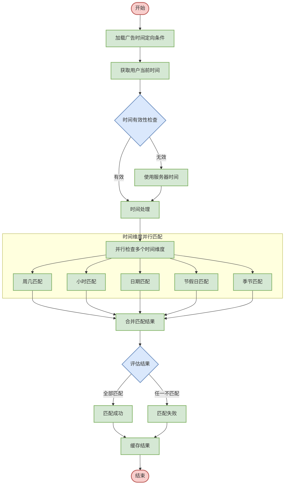

# 时间定向匹配逻辑设计

## 1. 流程图设计



## 2. 详细步骤说明

### 2.1 加载广告时间定向条件
- **输入**：广告ID
- **处理**：从广告配置中获取时间定向条件
- **输出**：时间定向规则集合
- **规则格式示例**：
  ```json
  {
    "timeTargeting": {
      "schedule": {
        "weekdays": [1, 2, 3, 4, 5],         // 投放星期，1-7分别代表周一至周日
        "hours": [9, 10, 11, 12, 13, 14, 15, 16, 17, 18],  // 投放小时，0-23
        "timeZone": "Asia/Shanghai"           // 时区设置
      },
      "dateRange": {                          // 日期范围
        "startDate": "2025-02-01",            // 开始日期
        "endDate": "2025-04-30"               // 结束日期
      },
      "holidays": {                           // 节假日设置
        "include": ["NEW_YEAR", "SPRING_FESTIVAL", "LABOR_DAY"],  // 包含的节假日
        "exclude": []                         // 排除的节假日
      },
      "seasons": ["SPRING", "SUMMER"],        // 季节定向，包含春季和夏季
      "specialPeriods": [                     // 特殊时间段定向
        {
          "name": "618购物节",                // 特殊时期名称
          "startDate": "2025-06-01",          // 开始日期
          "endDate": "2025-06-18",            // 结束日期
          "priority": "HIGH"                  // 优先级：HIGH(高)、MEDIUM(中)、LOW(低)
        },
        {
          "name": "双十一",                   // 特殊时期名称
          "startDate": "2025-11-01",          // 开始日期
          "endDate": "2025-11-11",            // 结束日期
          "priority": "HIGH"                  // 优先级设置
        }
      ]
    }
  }
  ```

### 2.2 获取用户当前时间
- **输入**：请求参数、用户ID
- **处理**：
  * 从请求参数中提取时间信息
  * 应用时区转换
  * 规范化时间格式
- **输出**：用户当前时间对象
- **时间数据格式示例**：
  ```json
  {
    "timestamp": 1648093412345,             // Unix时间戳（毫秒）
    "iso8601": "2025-03-24T10:30:12.345+08:00",  // ISO 8601格式的时间字符串
    "timezone": "Asia/Shanghai",            // 时区ID
    "timezoneOffset": 28800000,             // 时区偏移量（毫秒，+8小时）
    "sourceType": "CLIENT",                 // 时间来源：CLIENT(客户端)或SERVER(服务器)
    "reliability": "HIGH"                   // 时间可靠性：HIGH(高)、MEDIUM(中)、LOW(低)
  }
  ```

### 2.3 时间有效性检查
- **输入**：用户时间信息
- **处理**：
  * 检查时间是否在合理范围内
  * 验证时区信息是否有效
  * 检查客户端时间是否被篡改
- **输出**：时间有效性检查结果
- **判断逻辑**：
  1. 检查时间戳是否在合理范围（不能是未来时间，不能太过久远）
  2. 验证时区信息是否合法（是否是有效的时区ID）
  3. 检查客户端与服务器时间差异是否在可接受范围内
  4. 检查时间连续性（与用户历史请求时间比较）
  5. 综合评估时间的可靠性

### 2.4 使用服务器时间
- **输入**：服务器当前时间
- **处理**：
  * 获取服务器当前时间
  * 根据请求信息推断用户所在时区
  * 转换为用户所在时区的时间
- **输出**：转换后的用户时间
- **推断步骤**：
  1. 首先尝试使用请求中的时区信息
  2. 如果无时区信息，尝试使用用户画像中的常用时区
  3. 如果仍无法确定，尝试根据IP地址推断时区
  4. 最后使用应用默认时区（通常为"Asia/Shanghai"）

### 2.5 时间处理
- **输入**：用户时间，广告时区配置
- **处理**：
  * 应用广告主指定的时区
  * 计算相关时间属性（周几、小时等）
  * 准备节假日和特殊时期判断
- **输出**：处理后的时间对象，包含各种时间属性
- **处理步骤**：
  1. 将用户时间转换为广告主指定的时区
  2. 提取日期（年、月、日）信息
  3. 计算周几（1-7，其中1代表周一）
  4. 提取小时（0-23）信息
  5. 判断是否是节假日或特殊时期
  6. 确定当前季节

### 2.6 并行检查多个时间维度
- **输入**：处理后的时间对象，广告时间定向条件
- **处理**：
  * 并行执行各时间维度的匹配判断
  * 对于特殊时期优先级更高的情况进行特殊处理
- **输出**：各时间维度的匹配结果
- **特殊处理**：
  * 高优先级特殊时期可能会覆盖常规时间规则
  * 节假日规则可能覆盖常规工作日规则
  * 处理时区边界情况

### 2.7 各时间维度匹配逻辑

#### 2.7.1 周几匹配
- **判断逻辑**：
  * 检查当前是周几
  * 判断是否在广告指定的周几列表中
- **匹配步骤**：
  1. 获取当前日期是周几（1-7，代表周一到周日）
  2. 检查广告定向条件中是否指定了周几限制
  3. 如果未指定周几限制，视为匹配所有日期
  4. 检查当前周几是否在广告指定的周几列表中
  5. 返回匹配结果

#### 2.7.2 小时匹配
- **判断逻辑**：
  * 检查当前小时
  * 判断是否在广告指定的小时列表中
- **匹配步骤**：
  1. 获取当前时间的小时值（0-23）
  2. 检查广告定向条件中是否指定了小时限制
  3. 如果未指定小时限制，视为匹配全天小时
  4. 检查当前小时是否在广告指定的小时列表中
  5. 返回匹配结果

#### 2.7.3 日期匹配
- **判断逻辑**：
  * 检查当前日期是否在广告的投放日期范围内
- **匹配步骤**：
  1. 获取当前日期
  2. 检查广告定向条件中是否指定了日期范围
  3. 如果未指定日期范围，视为匹配所有日期
  4. 检查当前日期是否大于等于开始日期
  5. 检查当前日期是否小于等于结束日期
  6. 两个条件同时满足则匹配成功

#### 2.7.4 节假日匹配
- **判断逻辑**：
  * 检查当前日期是否是节假日
  * 判断是否在广告指定的节假日列表中
- **匹配步骤**：
  1. 查询节假日服务，判断当前日期是否为节假日
  2. 如果是节假日，确定是哪种类型的节假日
  3. 检查广告定向条件中是否指定了节假日限制
  4. 检查当前节假日类型是否在广告包含的节假日列表中
  5. 检查当前节假日类型是否在广告排除的节假日列表中
  6. 综合判断节假日匹配结果

#### 2.7.5 季节匹配
- **判断逻辑**：
  * 确定当前季节
  * 判断是否在广告指定的季节列表中
- **匹配步骤**：
  1. 根据当前日期和位置信息确定当前季节
  2. 检查广告定向条件中是否指定了季节限制
  3. 如果未指定季节限制，视为匹配所有季节
  4. 检查当前季节是否在广告指定的季节列表中
  5. 返回匹配结果

### 2.8 合并匹配结果
- **输入**：各时间维度的匹配结果
- **处理**：
  * 采用"与"逻辑合并各时间维度匹配结果
  * 所有时间维度都匹配成功，才视为整体匹配成功
  * 记录不匹配的维度，用于后续分析
- **输出**：最终匹配结果和不匹配原因
- **合并步骤**：
  1. 初始化最终结果为"匹配成功"
  2. 创建一个不匹配维度列表
  3. 遍历所有时间维度匹配结果
  4. 如有任一维度不匹配，将最终结果设为"匹配失败"并记录该维度
  5. 特殊处理高优先级时期规则（如可能覆盖其他规则）
  6. 返回最终结果和不匹配维度列表

### 2.9 缓存结果
- **输入**：用户/设备ID，广告ID，匹配结果
- **处理**：
  * 将匹配结果存入缓存
  * 设置合适的缓存过期时间
- **输出**：无
- **缓存策略**：
  * 缓存键：用户/设备ID + 广告ID + 时间段标识
  * 缓存值：匹配结果 + 时间戳
  * 缓存期限：根据最近的时间边界计算，例如：
    - 如果只有小时限制，缓存至下一个小时
    - 如果有日期限制，缓存至当天结束
  * 缓存清理：定时任务清理过期缓存

## 3. 系统配置参数

| 参数名称              | 说明                     | 默认值        | 取值范围       | 调优建议                     |
| --------------------- | ------------------------ | ------------- | -------------- | ---------------------------- |
| time.cache.size       | 时间匹配缓存大小         | 1000000       | 10000-10000000 | 根据广告数量和访问频率调整   |
| time.cache.expiration | 缓存过期检查间隔(秒)     | 60            | 10-300         | 根据系统负载调整             |
| time.match.timeout    | 匹配超时时间(ms)         | 5             | 1-20           | 时间匹配逻辑较简单，可设较短 |
| time.server.delta     | 客户端时间可接受偏差(秒) | 300           | 60-3600        | 根据业务精确度要求调整       |
| time.default.timezone | 默认时区                 | Asia/Shanghai | 有效时区ID     | 根据主要用户群体调整         |
| time.holiday.refresh  | 节假日数据刷新周期(小时) | 24            | 1-168          | 节假日数据变化不频繁         |

## 4. 异常处理

### 4.1 时间异常处理
- **客户端时间不可靠**：
  * 处理方式：切换使用服务器时间
  * 判定条件：客户端时间与服务器时间差异过大
  * 阈值设置：通常设置5分钟作为判断阈值
  * 日志记录：标记为"UNRELIABLE_CLIENT_TIME"

- **日期超出范围**：
  * 处理方式：使用边界日期进行处理
  * 示例：如果日期早于1970年或晚于2100年，视为无效
  * 降级策略：使用服务器当前时间
  * 日志记录：标记为"DATE_OUT_OF_RANGE"

### 4.2 时区处理
- **无效时区**：
  * 处理方式：使用默认时区（Asia/Shanghai）
  * 判定条件：时区ID不在标准时区列表中
  * 日志记录：标记为"INVALID_TIMEZONE"

- **跨时区用户**：
  * 处理方式：根据最新位置信息动态调整时区
  * 示例：识别到用户从北京到纽约，自动调整时区
  * 优化建议：设置时区变更的平滑过渡期

### 4.3 节假日数据问题
- **节假日数据缺失**：
  * 处理方式：降级为仅使用日期和周几匹配
  * 日志记录：标记为"HOLIDAY_DATA_MISSING"
  * 恢复策略：节假日数据恢复后自动使用

- **临时节假日调整**：
  * 处理方式：支持紧急节假日数据更新
  * 场景：如政府临时宣布的假期调整
  * 更新机制：支持推送式更新和定时拉取更新

### 4.4 性能保障
- **节假日查询优化**：
  * 处理方式：预加载常用节假日数据到内存
  * 缓存机制：使用高效缓存减少重复查询
  * 异步更新：后台定时更新节假日数据

- **时间计算超时**：
  * 处理方式：设置时间匹配的超时限制
  * 降级策略：超时后使用简化匹配逻辑
  * 指标监控：记录超时频率，针对性优化

## 5. 性能优化

### 5.1 时间边界优化
- **时间预计算**：
  * 优化方式：提前计算时间边界并缓存
  * 实现机制：为常见时间模式预先生成判定表
  * 应用场景：工作日9点-18点等常见模式
  * 效果：减少90%以上的重复计算

- **时段压缩表示**：
  * 优化方式：使用位图表示时间段
  * 实现机制：7位表示周几，24位表示小时
  * 优化效果：时间匹配变为简单的位操作
  * 示例：
    周一至周五的位表示：0111110
    9点至18点的位表示：0000000000111111111000000

### 5.2 缓存策略优化
- **多级缓存**：
  * 一级缓存：当前小时的匹配结果（内存）
  * 二级缓存：当天的匹配结果（分布式缓存）
  * 三级缓存：长期有效的匹配规则（持久化存储）

- **智能缓存过期**：
  * 优化方式：根据时间规则特征设置过期时间
  * 实现机制：计算下一个时间边界作为过期时间
  * 示例：小时规则到整点过期，日期规则到午夜过期

### 5.3 并行处理优化
- **批量时间匹配**：
  * 优化方式：一次请求处理多个广告的时间匹配
  * 实现机制：时间对象解析和处理只做一次
  * 应用场景：广告请求同时匹配多个广告位

- **规则预处理**：
  * 优化方式：广告规则上传时预处理并优化存储
  * 实现机制：转换为位图或其他高效数据结构
  * 效果：减少实时匹配时的计算复杂度

### 5.4 节假日处理优化
- **节假日数据优化**：
  * 优化方式：分国家/地区存储节假日数据
  * 实现机制：按年度预加载常用国家的节假日
  * 更新策略：增量更新节假日数据

- **工作日智能识别**：
  * 优化方式：动态识别调休工作日和假日
  * 实现机制：维护特殊日期调整表
  * 示例：法定假日周末调休为工作日的情况

## 6. 可扩展性设计

### 6.1 时间规则扩展
- **自定义时段**：
  * 扩展支持：明确定义任意时间段组合
  * 实现机制：时间段规则引擎
  * 示例：每月第一个周末，或每季度最后一周

- **相对时间规则**：
  * 扩展支持：基于相对时间的规则定义
  * 实现机制：时间表达式解析引擎
  * 示例：广告开始前3天，活动结束后1周

### 6.2 国际化支持
- **多国家节假日**：
  * 扩展支持：全球主要国家的节假日系统
  * 数据来源：与各国官方日历集成
  * 实时更新：支持紧急节假日变更推送

- **时区智能处理**：
  * 扩展支持：自动处理全球各地的夏令时调整
  * 实现机制：与IANA时区数据库集成
  * 特殊处理：处理时区变更边界情况

### 6.3 场景化时间规则
- **天气关联时间**：
  * 扩展支持：根据天气状况动态调整投放时间
  * 实现机制：与天气API集成
  * 示例：雨天+周末的特殊投放策略

- **事件驱动时间**：
  * 扩展支持：与重大事件关联的时间规则
  * 实现机制：事件流处理引擎
  * 示例：体育赛事前后特定时段投放

### 6.4 规则复合与继承
- **规则模板**：
  * 扩展支持：预定义常用时间规则模板
  * 实现机制：规则模板库和继承机制
  * 示例：继承"工作时间模板"并自定义修改

- **规则优先级**：
  * 扩展支持：多重规则间的优先级处理
  * 实现机制：规则冲突解决引擎
  * 示例：特殊活动规则优先于常规时间规则

## 7. 配置化增强设计

### 7.1 动态配置模型

```json
{
  "version": "1.0",                             // 配置版本号
  "effectiveTime": "2025-03-27T00:00:00Z",      // 配置生效时间
  "expiryTime": "2025-12-31T23:59:59Z",         // 配置过期时间
  "matchingRules": {                            // 匹配规则优先级配置
    "weekdayPriority": 10,                      // 周几匹配优先级(数值越小优先级越高)
    "hourPriority": 20,                         // 小时匹配优先级
    "datePriority": 30,                         // 日期匹配优先级
    "holidayPriority": 40,                      // 节假日匹配优先级
    "seasonPriority": 50,                       // 季节匹配优先级
    "specialPeriodPriority": 5                  // 特殊时期优先级(最高)
  },
  "dataCompleteness": {                         // 数据完整性配置
    "minimumRequiredAttributes": 2,             // 最少需要的时间属性数量
    "criticalAttributes": ["currentTime", "timezone"], // 关键时间属性列表
    "defaultMatchPolicy": "STRICT"              // 默认匹配策略，STRICT(严格)或LENIENT(宽松)
  },
  "timezoneSettings": {                         // 时区设置
    "defaultTimezone": "Asia/Shanghai",         // 默认时区
    "fallbackOrder": ["REQUEST", "USER_PROFILE", "IP_BASED", "DEFAULT"], // 时区回退顺序
    "validationEnabled": true                   // 是否启用时区验证
  },
  "holidayConfig": {                            // 节假日配置
    "holidayDataSources": [                     // 节假日数据来源列表
      {
        "country": "CN",                        // 国家代码
        "source": "OFFICIAL_CALENDAR",          // 数据来源(官方日历)
        "refreshInterval": 24,                  // 刷新间隔(小时)
        "priority": 1                           // 优先级(值越大优先级越低)
      },
      {
        "country": "CN",                        // 国家代码
        "source": "MANUAL_UPDATE",              // 数据来源(手动更新)
        "refreshInterval": 1,                   // 刷新间隔(小时)
        "priority": 0                           // 手动更新优先级最高
      }
    ],
    "specialHolidays": [                        // 特殊节假日列表
      {
        "name": "特殊调休日",                    // 特殊节假日名称
        "date": "2025-10-10",                   // 日期
        "type": "WORKDAY",                      // 类型(工作日)
        "originalType": "HOLIDAY"               // 原始类型(假日)
      }
    ]
  },
  "inferenceRules": [                           // 数据推断规则列表
    {
      "missingAttribute": "season",             // 缺失的属性名(季节)
      "condition": {                            // 触发推断的条件
        "attribute": "date",                    // 条件属性名(日期)
        "operator": "between",                  // 条件操作符(范围)
        "startValue": "2025-03-01",             // 开始值
        "endValue": "2025-05-31"                // 结束值
      },
      "inferredValue": "SPRING"                 // 推断的属性值(春季)
    },
    {
      "missingAttribute": "businessDate",       // 缺失的属性名(工作日期)
      "condition": {                            // 触发推断的条件
        "attribute": "weekday",                 // 条件属性名(周几)
        "operator": "in",                       // 条件操作符(包含)
        "values": [1, 2, 3, 4, 5]               // 条件属性值(周一至周五)
      },
      "inferredValue": "WORKDAY"                // 推断的属性值(工作日)
    }
  ],
  "matchingAlgorithms": {                       // 匹配算法配置
    "specialPeriod": {                          // 特殊时期算法
      "type": "PRIORITY_BASED",                 // 算法类型(基于优先级)
      "overrideRegularRules": true              // 是否覆盖常规规则
    },
    "holiday": {                                // 节假日算法
      "type": "HIERARCHY",                      // 算法类型(层级)
      "overrideWeekdayRules": true              // 是否覆盖周几规则
    },
    "timeWindow": {                             // 时间窗口算法
      "type": "CROSS_DAY_SUPPORT",              // 算法类型(支持跨天)
      "crossDayFormat": "HH:MM-HH:MM+1"         // 跨天格式
    }
  },
  "performanceSettings": {                      // 性能设置
    "cacheStrategy": "MULTI_LEVEL",             // 缓存策略(多级缓存)
    "timeBoundaryRefresh": true,                // 是否在时间边界刷新
    "maxCacheSize": 1000000,                    // 最大缓存条目数
    "l1CacheTTL": 60,                           // 一级缓存生存时间(秒)
    "l2CacheTTL": 3600,                         // 二级缓存生存时间(秒)
    "matchingTimeout": 5,                       // 匹配超时时间(毫秒)
    "batchSize": 100,                           // 批处理大小
    "preComputeEnabled": true                   // 是否启用预计算
  }
}
```

### 7.2 规则管理界面

时间定向规则支持通过管理界面进行配置，主要功能包括：

- **规则版本管理**：
  * 创建、修改、删除规则版本
  * 设置规则生效和过期时间
  * 支持规则回滚和版本比对

- **匹配优先级设置**：
  * 调整各时间维度的匹配优先级
  * 设置特殊时期规则的覆盖策略
  * 配置时间规则间的层级关系

- **节假日配置管理**：
  * 导入年度节假日数据
  * 设置临时调休和特殊工作日
  * 配置节假日数据更新来源和频率

- **时区管理**：
  * 配置默认时区和备选时区策略
  * 设置多时区匹配规则
  * 管理时区验证和转换规则

- **特殊时期管理**：
  * 定义特殊营销时期（如双十一、618）
  * 设置特殊时期的优先级和覆盖规则
  * 配置重复性特殊时期的年度更新

- **性能参数调优**：
  * 缓存策略和失效规则设置
  * 预计算范围和频率调整
  * 匹配超时控制和批处理配置

### 7.3 监控与调优

- **规则效果监控**：
  * 实时监控各时间维度的匹配成功率
  * 识别匹配失败最多的时间条件
  * 分析时间规则覆盖度和有效性

- **性能指标监控**：
  * 各时间维度匹配的计算耗时
  * 缓存命中率和时间边界刷新频率
  * 节假日数据查询和计算开销

- **A/B测试支持**：
  * 支持多版本时间规则并行测试
  * 按流量比例或时间段分配流量
  * 比较不同时间策略的广告效果

- **自动优化建议**：
  * 基于历史数据识别最佳投放时段
  * 优化缓存策略和预计算参数
  * 推荐规则简化和合并方案

## 8. 集成接口

### 8.1 规则配置接口

```java
/**
 * 时间定向规则配置接口
 */
public interface TimeRuleConfigService {
    
    /**
     * 获取当前生效的规则配置
     * @return 规则配置对象
     */
    TimeRuleConfig getCurrentConfig();
    
    /**
     * 创建新的规则配置
     * @param config 规则配置对象
     * @return 创建结果
     */
    Result createConfig(TimeRuleConfig config);
    
    /**
     * 更新规则配置
     * @param config 规则配置对象
     * @return 更新结果
     */
    Result updateConfig(TimeRuleConfig config);
    
    /**
     * 激活指定版本的规则配置
     * @param version 规则版本
     * @return 激活结果
     */
    Result activateConfig(String version);
    
    /**
     * 获取规则配置历史版本列表
     * @param pageSize 每页大小
     * @param pageNum 页码
     * @return 历史版本列表
     */
    PagedResult<TimeRuleConfig> getHistoryConfigs(int pageSize, int pageNum);
    
    /**
     * 导入节假日数据
     * @param country 国家代码
     * @param year 年份
     * @param holidays 节假日数据列表
     * @return 导入结果
     */
    Result importHolidayData(String country, int year, List<Holiday> holidays);
    
    /**
     * 添加特殊时期配置
     * @param specialPeriod 特殊时期配置
     * @return 添加结果
     */
    Result addSpecialPeriod(SpecialPeriod specialPeriod);
    
    /**
     * 更新时区配置
     * @param timezoneConfig 时区配置
     * @return 更新结果
     */
    Result updateTimezoneConfig(TimezoneConfig timezoneConfig);
}
```

### 8.2 匹配服务接口

```java
/**
 * 时间定向匹配服务接口
 */
public interface TimeMatchingService {
    
    /**
     * 判断当前时间是否匹配广告时间定向条件
     * @param timeInfo 时间信息
     * @param adId 广告ID
     * @return 匹配结果
     */
    MatchResult match(TimeInfo timeInfo, String adId);
    
    /**
     * 批量判断当前时间是否匹配多个广告时间定向条件
     * @param timeInfo 时间信息
     * @param adIds 广告ID列表
     * @return 批量匹配结果
     */
    Map<String, MatchResult> batchMatch(TimeInfo timeInfo, List<String> adIds);
    
    /**
     * 获取特定时间点匹配的所有广告ID
     * @param timeInfo 时间信息
     * @param adIds 候选广告ID列表
     * @return 匹配的广告ID列表
     */
    List<String> getMatchedAds(TimeInfo timeInfo, List<String> adIds);
    
    /**
     * 检查时间信息有效性
     * @param timeInfo 时间信息
     * @return 验证结果
     */
    ValidationResult validateTimeInfo(TimeInfo timeInfo);
    
    /**
     * 获取当前节假日信息
     * @param date 日期
     * @param country 国家代码
     * @return 节假日信息
     */
    HolidayInfo getHolidayInfo(LocalDate date, String country);
    
    /**
     * 清除时间匹配缓存
     * @param pattern 缓存键模式
     * @return 操作结果
     */
    Result clearTimeCache(String pattern);
}
```

### 8.3 监控接口

```java
/**
 * 时间定向匹配监控接口
 */
public interface TimeMatchingMonitor {
    
    /**
     * 获取各时间维度匹配统计数据
     * @param startTime 开始时间
     * @param endTime 结束时间
     * @return 维度匹配统计
     */
    Map<String, DimensionMatchStats> getDimensionMatchStats(Date startTime, Date endTime);
    
    /**
     * 获取按小时的匹配成功率分布
     * @param days 统计天数
     * @return 小时分布统计
     */
    Map<Integer, Double> getHourlyMatchDistribution(int days);
    
    /**
     * 获取按星期的匹配成功率分布
     * @param weeks 统计周数
     * @return 星期分布统计
     */
    Map<Integer, Double> getWeekdayMatchDistribution(int weeks);
    
    /**
     * 获取节假日匹配统计
     * @param year 年份
     * @param country 国家代码
     * @return 节假日匹配统计
     */
    Map<String, HolidayMatchStats> getHolidayMatchStats(int year, String country);
    
    /**
     * 获取缓存性能统计
     * @return 缓存性能统计
     */
    CachePerformanceStats getCacheStats();
    
    /**
     * 获取时间计算性能统计
     * @return 时间计算性能统计
     */
    TimeCalculationStats getTimeCalculationStats();
    
    /**
     * 获取规则效果评估数据
     * @param ruleVersion 规则版本
     * @return 规则效果评估
     */
    RuleEffectivenessReport getRuleEffectivenessReport(String ruleVersion);
    
    /**
     * 获取系统健康状态
     * @return 系统健康状态
     */
    HealthStatus getHealthStatus();
}
```