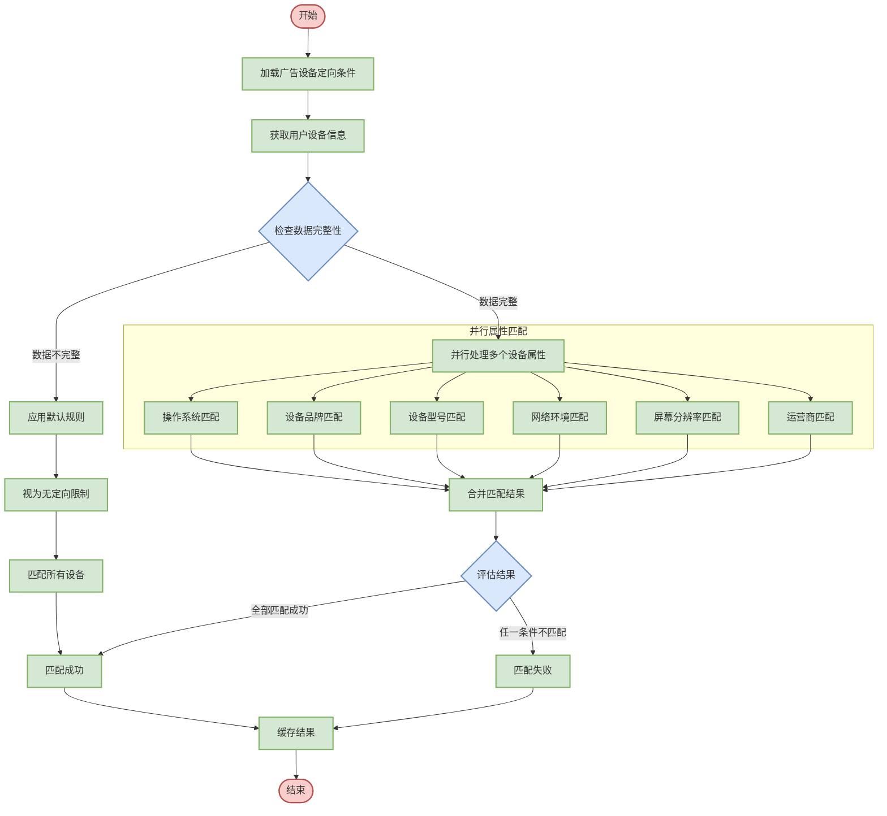

# 设备定向匹配逻辑设计

## 1. 流程图设计



## 2. 详细步骤说明

### 2.1 加载广告设备定向条件
- **输入**：广告ID
- **处理**：从广告配置中获取设备定向条件
- **输出**：设备定向规则集合
- **规则格式示例**：
  ```json
  {
    "deviceTargeting": {
      "os": {                                 // 操作系统定向
        "include": ["Android", "iOS"],        // 包含的操作系统类型
        "exclude": []                         // 排除的操作系统类型
      },
      "osVersion": {                          // 操作系统版本定向
        "Android": {                          // Android版本范围
          "min": "8.0.0",                     // 最低支持版本
          "max": "13.0.0"                     // 最高支持版本
        },
        "iOS": {                              // iOS版本范围
          "min": "12.0.0",                    // 最低支持版本
          "max": "16.0.0"                     // 最高支持版本
        }
      },
      "brand": ["Apple", "Samsung", "Xiaomi", "OPPO", "vivo", "Huawei"],  // 支持的设备品牌列表
      "model": {                              // 设备型号定向
        "include": [],                        // 包含的设备型号列表
        "exclude": ["iPhone6,1", "iPhone6,2"] // 排除的设备型号列表(这里排除iPhone 5s)
      },
      "network": ["WIFI", "4G", "5G"],        // 支持的网络类型列表
      "carrier": ["中国移动", "中国联通", "中国电信"],  // 支持的运营商列表
      "screenSize": {                         // 屏幕尺寸定向
        "width": {                            // 屏幕宽度范围
          "min": 720,                         // 最小宽度(像素)
          "max": 3840                         // 最大宽度(像素)
        },
        "height": {                           // 屏幕高度范围
          "min": 1280,                        // 最小高度(像素)
          "max": 2160                         // 最大高度(像素)
        }
      },
      "deviceType": ["PHONE", "TABLET"],      // 支持的设备类型列表
      "price": {                              // 设备价格范围定向
        "min": 2000,                          // 最低价格(人民币)
        "max": 10000                          // 最高价格(人民币)
      }
    }
  }
  ```

### 2.2 获取用户设备信息
- **输入**：请求参数、设备ID
- **处理**：
  * 解析请求中的设备信息
  * 补充设备画像库中的历史设备信息
  * 规范化设备信息（如品牌名称标准化）
- **输出**：设备信息对象
- **设备数据格式示例**：
  ```json
  {
    "deviceId": "abc123456789",               // 设备唯一标识符
    "os": "Android",                          // 操作系统类型
    "osVersion": "11.0.0",                    // 操作系统版本
    "brand": "Samsung",                       // 设备品牌
    "model": "SM-G998B",                      // 设备型号(硬件代码)
    "modelName": "Galaxy S21 Ultra",          // 设备型号名称(市场名称)
    "network": "WIFI",                        // 当前网络连接类型
    "carrier": "中国移动",                    // 运营商名称
    "screen": {                               // 屏幕信息
      "width": 1440,                          // 屏幕宽度(像素)
      "height": 3200,                         // 屏幕高度(像素)
      "density": 3.0                          // 屏幕像素密度
    },
    "deviceType": "PHONE",                    // 设备类型(手机/平板等)
    "language": "zh-CN",                      // 设备语言设置
    "timeZone": "Asia/Shanghai",              // 时区设置
    "priceRange": "高端",                     // 设备价格区间
    "estimatedPrice": 7999,                   // 估计价格(人民币)
    "cpuArch": "arm64-v8a",                   // CPU架构
    "ramSize": 12,                            // 内存大小(GB)
    "storageSize": 256,                       // 存储容量(GB)
    "firstSeen": "2023-01-15",                // 首次识别日期
    "lastSeen": "2025-03-26"                  // 最近识别日期
  }
  ```

### 2.3 检查数据完整性
- **输入**：设备信息对象
- **处理**：
  * 检查必要设备信息是否存在
  * 验证信息格式是否正确
  * 检查信息是否可信（防止伪造）
- **输出**：数据完整性检查结果
- **判断逻辑**：
  * 核心属性（如OS、品牌）必须存在
  * 非核心属性缺失不影响整体判断
  * 属性值需在合理范围内
  * 关联属性需相互一致（如品牌与型号匹配）

### 2.4 应用默认规则
- **输入**：广告定向规则，不完整的设备数据
- **处理**：
  * 对数据不完整的情况，采用宽松匹配策略
  * 缺失的属性视为"匹配任意值"
  * 针对特定缺失属性应用行业通用值
- **输出**：调整后的匹配策略
- **默认规则示例**：
  * 未知操作系统版本：视为匹配最低版本限制
  * 未知屏幕分辨率：按设备类型应用典型值
  * 未知网络状态：默认为"4G"
  * 未知品牌设备：降低定向优先级

### 2.5 并行属性匹配
- **输入**：广告定向规则，设备信息对象
- **处理**：
  * 并行执行各设备属性的匹配判断
  * 对于复杂匹配逻辑使用专用匹配器
  * 记录各属性的匹配结果和匹配依据
- **输出**：各属性的匹配结果
- **处理机制**：
  * 使用线程池或工作队列并行处理
  * 设置匹配计算超时控制
  * 优先处理简单快速的匹配项

### 2.6 各属性匹配逻辑

#### 2.6.1 操作系统匹配
- **判断逻辑**：
  * 检查设备操作系统类型是否在目标列表中
  * 检查操作系统版本是否在指定范围内
  * 处理操作系统别名问题（如"iPadOS"与"iOS"）
- **匹配步骤**：
  1. 检查操作系统类型是否在排除列表中，如在则直接不匹配
  2. 检查操作系统类型是否在包含列表中，如果包含列表非空且不匹配则返回失败
  3. 标准化操作系统版本字符串（如"Android 11"转为"11.0.0"）
  4. 解析版本字符串为可比较格式（主版本、次版本、补丁版本）
  5. 检查版本是否在指定的最小和最大范围内
  6. 返回最终匹配结果

#### 2.6.2 设备品牌匹配
- **判断逻辑**：
  * 检查设备品牌是否在目标品牌列表中
  * 处理品牌别名和收购情况（如"荣耀"曾属于"华为"）
  * 支持品牌分组匹配（如"国产品牌"、"高端品牌"）
- **匹配步骤**：
  1. 标准化设备品牌名称（大小写、空格处理）
  2. 解析品牌别名（如"MI"对应"Xiaomi"）
  3. 检查标准化后的品牌是否在目标列表中
  4. 如果使用品牌分组，检查品牌是否属于目标分组
  5. 返回匹配结果

#### 2.6.3 设备型号匹配
- **判断逻辑**：
  * 支持精确型号匹配（如"SM-G998B"）
  * 支持型号类别匹配（如"Galaxy S系列"）
  * 支持通配符匹配（如"iPhone*"匹配所有iPhone）
- **匹配步骤**：
  1. 标准化设备型号字符串（去除特殊字符）
  2. 检查型号是否在排除列表中，如在则直接不匹配
  3. 如果包含列表为空，视为匹配所有未被排除的型号
  4. 对于具体型号，执行精确匹配或通配符匹配
  5. 对于型号系列，检查设备型号是否属于目标系列
  6. 返回最终匹配结果

#### 2.6.4 网络环境匹配
- **判断逻辑**：
  * 检查设备当前网络类型是否在目标列表中
  * 处理网络类型的层级关系（如5G >4G >3G）
  * 支持网络质量定向（如"良好网络"对应WiFi和5G）
- **匹配步骤**：
  1. 标准化网络类型名称（如"5g"、"5G"统一为"5G"）
  2. 如果目标列表为空，视为匹配所有网络类型
  3. 检查设备当前网络类型是否在目标列表中
  4. 如果使用网络质量分组，检查当前网络类型是否满足质量要求
  5. 返回匹配结果

#### 2.6.5 屏幕分辨率匹配
- **判断逻辑**：
  * 检查设备屏幕宽高是否在指定范围内
  * 考虑设备方向（横屏/竖屏）问题
  * 支持屏幕分辨率分组（如"高清屏"、"超高清屏"）
- **匹配步骤**：
  1. 获取设备屏幕宽度和高度
  2. 确保宽度小于等于高度（标准化为竖屏方向）
  3. 检查宽度是否在目标范围内
  4. 检查高度是否在目标范围内
  5. 如果使用分辨率分组，检查设备分辨率是否满足分组条件
  6. 返回匹配结果

#### 2.6.6 运营商匹配
- **判断逻辑**：
  * 检查设备当前使用的运营商是否在目标列表中
  * 处理运营商的别名问题（如"中国移动"与"CMCC"）
  * 支持运营商分组（如"国内运营商"、"国际运营商"）
- **匹配步骤**：
  1. 标准化运营商名称
  2. 解析运营商代码为正式名称（如"46000"解析为"中国移动"）
  3. 如果目标列表为空，视为匹配所有运营商
  4. 检查标准化后的运营商是否在目标列表中
  5. 如果使用运营商分组，检查当前运营商是否属于目标分组
  6. 返回匹配结果

### 2.7 合并匹配结果
- **输入**：各属性的匹配结果
- **处理**：
  * 采用"与"逻辑合并各属性匹配结果
  * 所有属性都匹配成功，才视为整体匹配成功
  * 记录不匹配的属性，用于后续分析
- **输出**：最终匹配结果和不匹配原因
- **合并步骤**：
  1. 初始化最终结果为"匹配成功"
  2. 创建一个不匹配属性列表
  3. 遍历所有属性匹配结果
  4. 如有任一属性不匹配，将最终结果设为"匹配失败"并记录该属性
  5. 返回最终结果和不匹配属性列表

### 2.8 缓存结果
- **输入**：设备ID，广告ID，匹配结果
- **处理**：
  * 将匹配结果存入缓存
  * 设置合理的缓存过期时间
  * 监控缓存命中率
- **输出**：无
- **缓存策略**：
  * 缓存键：设备ID + 广告ID + 规则版本
  * 缓存值：匹配结果 + 时间戳
  * 缓存期限：设备信息通常较稳定，可设置较长时间（如12小时）
  * 缓存更新：广告规则更新时自动失效相关缓存

## 3. 系统配置参数

| 参数名称                   | 说明                   | 默认值  | 取值范围       | 调优建议                         |
| -------------------------- | ---------------------- | ------- | -------------- | -------------------------------- |
| device.cache.size          | 设备匹配缓存大小       | 2000000 | 10000-50000000 | 根据广告数量和设备类型多样性调整 |
| device.cache.expiration    | 缓存过期时间(秒)       | 43200   | 3600-86400     | 根据设备信息更新频率调整         |
| device.match.timeout       | 匹配超时时间(ms)       | 10      | 5-50           | 根据系统负载调整                 |
| device.thread.pool.size    | 并行匹配线程池大小     | 8       | 2-32           | 根据服务器CPU核心数调整          |
| device.default.match       | 数据缺失时默认匹配策略 | false   | true/false     | 根据广告主需求调整               |
| device.brand.alias.refresh | 品牌别名刷新周期(小时) | 24      | 1-168          | 品牌信息变化不频繁，可设置较长   |

## 4. 异常处理

### 4.1 数据缺失处理
- **设备操作系统未知**：
  * 处理方式：根据设备ID前缀推断可能的OS
  * 匹配策略：降级为只匹配设备品牌和型号
  * 日志记录：标记为"MISSING_OS"

- **设备型号未知**：
  * 处理方式：使用品牌默认设备配置
  * 匹配策略：跳过型号匹配，只匹配其他属性
  * 例外情况：如广告主特别指定型号为必要条件，则不匹配

### 4.2 数据异常处理
- **操作系统版本异常**：
  * 处理方式：修正明显错误（如"Android 99.0"）
  * 判定规则：检查版本号是否在合理范围内
  * 修正策略：使用最近已知的合理版本或行业均值

- **屏幕分辨率异常**：
  * 处理方式：对明显错误值进行修正
  * 判定规则：检查分辨率是否符合设备常见规格
  * 修正策略：基于设备型号查找标准规格或使用类似设备的典型值

### 4.3 版本比较处理
- **版本格式不一致**：
  * 处理方式：统一标准化为主.次.补丁格式
  * 示例：将"Android 10"转换为"10.0.0"
  * 处理特例："Android 4.4.4 KitKat"需提取数字部分

- **预发布版本**：
  * 处理方式：处理alpha、beta、rc等特殊版本标识
  * 版本排序：正式版 > rc > beta > alpha
  * 示例："iOS 14.0 beta"版本低于"iOS 14.0"正式版

### 4.4 性能保障
- **复杂规则超时**：
  * 处理方式：设置单条规则的执行时间上限
  * 超时策略：超时后简化匹配逻辑或使用默认结果
  * 监控指标：记录超时频率，针对高频超时规则进行优化

- **缓存管理**：
  * 处理方式：设置缓存淘汰策略
  * 淘汰算法：采用LRU（最近最少使用）策略
  * 内存保护：设置缓存占用上限，防止内存溢出

## 5. 性能优化

### 5.1 预计算与缓存优化
- **常见设备预计算**：
  * 优化方式：预先计算常见设备与热门广告的匹配结果
  * 实现机制：定时作业批量计算并更新缓存
  * 效果：减少80%以上的实时计算需求

- **多级缓存**：
  * 本地内存缓存：最近访问的匹配结果
  * 分布式缓存：所有设备的匹配结果
  * 持久化存储：常见设备的预计算结果
  * 策略：读多写少场景，优先使用本地缓存

### 5.2 计算优化
- **快速失败策略**：
  * 优化方式：优先检查最容易失败的条件
  * 实现机制：根据历史数据动态调整条件检查顺序
  * 效果：平均减少40%的匹配计算量

- **批量处理**：
  * 优化方式：一次请求处理多个广告的设备匹配
  * 实现机制：设备信息解析和标准化只做一次
  * 应用场景：广告检索请求中同时筛选多个广告

### 5.3 并行优化
- **多线程匹配**：
  * 优化方式：多属性并行匹配
  * 实现机制：使用工作线程池执行匹配任务
  * 调优点：根据服务器CPU核心数调整线程池大小

- **SIMD指令优化**：
  * 优化方式：使用向量化指令处理批量比较
  * 应用场景：同时处理多个设备与同一广告规则的匹配
  * 限制条件：需要硬件支持，逻辑必须可向量化

### 5.4 数据结构优化
- **位图索引**：
  * 优化方式：使用位图表示设备属性集合
  * 实现机制：预计算常见属性组合的位图表示
  * 效果：通过位运算快速完成匹配判断

- **组合索引**：
  * 优化方式：为常见属性组合创建复合索引
  * 实现机制：预先生成"品牌+操作系统"等组合的匹配表
  * 适用场景：针对高频查询模式优化

## 6. 可扩展性设计

### 6.1 新增设备属性支持
- **配置化设计**：
  * 扩展方式：通过配置文件定义新属性
  * 实现机制：属性解析器和匹配器的插件架构
  * 示例：新增"设备电池容量"属性定向

- **自定义匹配逻辑**：
  * 扩展方式：允许自定义属性的匹配规则
  * 实现机制：基于规则引擎或脚本引擎
  * 示例：设备电池容量 > 4000mAh AND 屏幕尺寸 > 6.5英寸

### 6.2 设备模型库
- **设备指纹识别**：
  * 功能：通过请求特征精确识别设备型号
  * 实现机制：维护特征指纹数据库
  * 更新策略：通过机器学习不断优化识别准确率

- **设备能力推断**：
  * 功能：基于已知信息推断设备其他能力
  * 实现机制：建立设备型号与硬件能力映射
  * 应用：推断设备是否支持AR、NFC等特性

### 6.3 自适应匹配策略
- **基于效果的优化**：
  * 功能：根据广告效果数据自动调整匹配策略
  * 实现机制：A/B测试不同匹配参数
  * 示例：发现某品牌设备效果好，自动扩大该品牌设备匹配范围

- **智能降级**：
  * 功能：根据系统负载动态调整匹配复杂度
  * 实现机制：设置多级匹配策略
  * 策略：高负载时使用简化匹配规则，确保系统稳定

## 7. 配置化增强设计

### 7.1 动态配置模型

```json
{
  "version": "1.0",                             // 配置版本号
  "effectiveTime": "2025-03-27T00:00:00Z",      // 配置生效时间
  "expiryTime": "2025-12-31T23:59:59Z",         // 配置过期时间
  "matchingRules": {                            // 匹配规则优先级配置
    "osPriority": 10,                           // 操作系统匹配优先级(数值越小优先级越高)
    "brandPriority": 20,                        // 品牌匹配优先级
    "modelPriority": 30,                        // 型号匹配优先级
    "networkPriority": 40,                      // 网络类型匹配优先级
    "screenPriority": 50,                       // 屏幕匹配优先级
    "carrierPriority": 60                       // 运营商匹配优先级(最低)
  },
  "dataCompleteness": {                         // 数据完整性配置
    "minimumRequiredAttributes": 2,             // 最少需要的设备属性数量
    "criticalAttributes": ["os", "brand"],      // 关键设备属性列表
    "defaultMatchPolicy": "LENIENT"             // 默认匹配策略，LENIENT(宽松)或STRICT(严格)
  },
  "standardization": {                          // 数据标准化配置
    "brands": {                                 // 品牌别名标准化
      "MI": "Xiaomi",                           // 小米品牌别名
      "XM": "Xiaomi",                           // 小米品牌别名
      "HUAWEI": "Huawei",                       // 华为品牌别名
      "HW": "Huawei",                           // 华为品牌别名
      "HONOR": "Honor",                         // 荣耀品牌
      "APPLE": "Apple"                          // 苹果品牌别名
    },
    "osVersions": {                             // 操作系统版本标准化
      "patterns": [                             // 版本格式模式列表
        {
          "regex": "Android (\\d+)",            // Android主版本正则匹配
          "format": "$1.0.0"                    // 转换为标准三段式版本格式
        },
        {
          "regex": "iOS (\\d+)",                // iOS主版本正则匹配
          "format": "$1.0.0"                    // 转换为标准三段式版本格式
        }
      ]
    },
    "networkTypes": {                           // 网络类型标准化
      "WIFI": ["WiFi", "wifi", "WLAN", "wlan"], // WIFI的多种表示形式
      "4G": ["LTE", "lte", "4g"],               // 4G网络的多种表示形式
      "5G": ["5g", "NR"]                        // 5G网络的多种表示形式
    }
  },
  "inferenceRules": [                           // 数据推断规则列表
    {
      "missingAttribute": "osVersion",          // 缺失的属性名(操作系统版本)
      "condition": {                            // 触发推断的条件
        "attribute": "model",                   // 条件属性名(设备型号)
        "value": "iPhone14,2"                   // 条件属性值(iPhone 13 Pro的硬件标识)
      },
      "inferredValue": "15.0.0"                 // 推断的属性值(iOS 15.0.0)
    },
    {
      "missingAttribute": "brand",              // 缺失的属性名(品牌)
      "condition": {                            // 触发推断的条件
        "attribute": "model",                   // 条件属性名(设备型号)
        "operator": "startsWith",               // 条件操作符(以...开头)
        "value": "SM-"                          // 条件属性值(三星设备型号前缀)
      },
      "inferredValue": "Samsung"                // 推断的属性值(三星品牌)
    }
  ],
  "matchingAlgorithms": {                       // 匹配算法配置
    "osVersion": {                              // 操作系统版本匹配算法
      "type": "VERSION_COMPARE",                // 算法类型(版本比较)
      "compareStrategy": "SEMANTIC"             // 比较策略(语义化比较)
    },
    "screen": {                                 // 屏幕匹配算法
      "type": "RANGE",                          // 算法类型(范围匹配)
      "standardizeOrientation": true            // 是否标准化屏幕方向
    },
    "model": {                                  // 设备型号匹配算法
      "type": "PATTERN_MATCH",                  // 算法类型(模式匹配)
      "supportWildcard": true,                  // 支持通配符
      "caseSensitive": false                    // 不区分大小写
    }
  },
  "performanceSettings": {                      // 性能设置
    "cacheStrategy": "TWO_LEVEL",               // 缓存策略(两级缓存)
    "l1CacheTTL": 1800,                         // 一级缓存生存时间(秒)
    "l2CacheTTL": 86400,                        // 二级缓存生存时间(秒)
    "matchingTimeout": 10,                      // 匹配超时时间(毫秒)
    "threadPoolSize": 8,                        // 线程池大小
    "batchSize": 200,                           // 批处理大小
    "fastFailEnabled": true                     // 启用快速失败策略
  }
}
```

### 7.2 规则管理界面

设备定向规则支持通过管理界面进行配置，主要功能包括：

- **规则版本管理**：
  * 创建、修改、删除规则版本
  * 设置规则生效和过期时间
  * 支持规则回滚和版本比对

- **匹配优先级设置**：
  * 调整各设备属性的匹配优先级
  * 优先级影响匹配执行顺序
  * 高优先级属性不匹配时快速失败

- **数据标准化配置**：
  * 配置品牌别名映射表
  * 设置操作系统版本格式化规则
  * 维护网络类型标准化映射

- **推断规则管理**：
  * 配置数据缺失时的推断逻辑
  * 基于已有属性推断缺失属性
  * 提高设备识别准确率

- **匹配算法定制**：
  * 为不同设备属性配置专用匹配算法
  * 支持版本比较、范围匹配、通配符等算法
  * 调整匹配精确度和容错度

- **性能参数调优**：
  * 缓存策略和过期时间设置
  * 线程池大小和超时时间调整
  * 批处理大小优化

### 7.3 监控与调优

- **规则效果监控**：
  * 实时监控各设备属性的匹配成功率
  * 识别匹配失败最多的属性
  * 分析设备数据质量和完整性

- **性能指标监控**：
  * 每个属性的匹配耗时统计
  * 缓存命中率和加载延迟
  * 设备信息检索和标准化开销

- **A/B测试支持**：
  * 支持多版本规则并行测试
  * 按流量比例分配设备到不同规则
  * 比较不同规则的匹配效果和广告效果

- **自动优化建议**：
  * 基于设备分布数据自动生成规则优化建议
  * 识别可能的性能瓶颈
  * 推荐最佳缓存策略和参数配置

## 8. 集成接口

### 8.1 规则配置接口

```java
/**
 * 设备定向规则配置接口
 */
public interface DeviceRuleConfigService {
    
    /**
     * 获取当前生效的规则配置
     * @return 规则配置对象
     */
    DeviceRuleConfig getCurrentConfig();
    
    /**
     * 创建新的规则配置
     * @param config 规则配置对象
     * @return 创建结果
     */
    Result createConfig(DeviceRuleConfig config);
    
    /**
     * 更新规则配置
     * @param config 规则配置对象
     * @return 更新结果
     */
    Result updateConfig(DeviceRuleConfig config);
    
    /**
     * 激活指定版本的规则配置
     * @param version 规则版本
     * @return 激活结果
     */
    Result activateConfig(String version);
    
    /**
     * 获取规则配置历史版本列表
     * @param pageSize 每页大小
     * @param pageNum 页码
     * @return 历史版本列表
     */
    PagedResult<DeviceRuleConfig> getHistoryConfigs(int pageSize, int pageNum);
    
    /**
     * 导入品牌别名映射
     * @param brandAliasMap 品牌别名映射
     * @return 导入结果
     */
    Result importBrandAliasMap(Map<String, String> brandAliasMap);
    
    /**
     * 更新设备型号库
     * @param modelDatabase 设备型号数据库
     * @return 更新结果
     */
    Result updateModelDatabase(DeviceModelDatabase modelDatabase);
}
```

### 8.2 匹配服务接口

```java
/**
 * 设备定向匹配服务接口
 */
public interface DeviceMatchingService {
    
    /**
     * 判断设备是否匹配广告设备定向条件
     * @param deviceInfo 设备信息
     * @param adId 广告ID
     * @return 匹配结果
     */
    MatchResult match(DeviceInfo deviceInfo, String adId);
    
    /**
     * 批量判断设备是否匹配广告设备定向条件
     * @param deviceInfos 设备信息列表
     * @param adId 广告ID
     * @return 批量匹配结果
     */
    List<MatchResult> batchMatch(List<DeviceInfo> deviceInfos, String adId);
    
    /**
     * 获取指定设备匹配的所有广告ID
     * @param deviceInfo 设备信息
     * @param adIds 候选广告ID列表
     * @return 匹配的广告ID列表
     */
    List<String> getMatchedAds(DeviceInfo deviceInfo, List<String> adIds);
    
    /**
     * 设备信息标准化
     * @param rawDeviceInfo 原始设备信息
     * @return 标准化后的设备信息
     */
    DeviceInfo standardizeDeviceInfo(Map<String, Object> rawDeviceInfo);
    
    /**
     * 清除设备匹配结果缓存
     * @param deviceId 设备ID
     * @return 操作结果
     */
    Result clearDeviceCache(String deviceId);
}
```

### 8.3 监控接口

```java
/**
 * 设备定向匹配监控接口
 */
public interface DeviceMatchingMonitor {
    
    /**
     * 获取各设备属性匹配统计数据
     * @param startTime 开始时间
     * @param endTime 结束时间
     * @return 属性匹配统计
     */
    Map<String, AttributeMatchStats> getAttributeMatchStats(Date startTime, Date endTime);
    
    /**
     * 获取设备型号分布统计
     * @param topN 返回前N个结果
     * @return 设备型号分布
     */
    List<DeviceDistribution> getDeviceModelDistribution(int topN);
    
    /**
     * 获取操作系统版本分布统计
     * @return 操作系统版本分布
     */
    Map<String, Map<String, Integer>> getOSVersionDistribution();
    
    /**
     * 获取缓存性能统计
     * @return 缓存性能统计
     */
    CachePerformanceStats getCacheStats();
    
    /**
     * 获取规则效果评估数据
     * @param ruleVersion 规则版本
     * @return 规则效果评估
     */
    RuleEffectivenessReport getRuleEffectivenessReport(String ruleVersion);
    
    /**
     * 获取系统健康状态
     * @return 系统健康状态
     */
    HealthStatus getHealthStatus();
}
```