# 广告效果监测服务产品设计文档

## 产品概述

### 产品定位
广告效果监控服务是互联网广告平台的核心组件之一，其最基础和核心的功能是**接收广告客户端通过HTTP Request发送的上报数据**，包括曝光、点击以及其他定义的行为事件。服务通过Request URL和HTTP Header等渠道获取相应的效果监测数据，并进行实时处理和存储，为广告投放引擎的调度服务和其他业务模块提供数据支撑。

### 核心价值
- **数据接收处理**：作为广告监测数据的统一接收入口，处理来自各种客户端的监测事件
- **实时统计计算**：对接收的原始数据进行实时统计计算，为调度服务提供决策数据
- **监测日志存储**：将原始监测数据批次写入数据库，为后续分析和功能提供数据基础
- **标准协议支持**：严格遵循IAB标准（VAST 4.1、OMID 1.3、MRC可见性测量标准）

### 业务目标
1. **高效数据接收**：确保监测数据的实时、准确、完整接收处理
2. **调度服务支撑**：为广告投放引擎的调度服务提供实时统计数据
3. **数据质量保障**：通过数据验证和质量控制，确保监测数据的可靠性
4. **系统性能优化**：支持高并发监测数据处理，满足大规模广告投放需求

### 系统架构概览
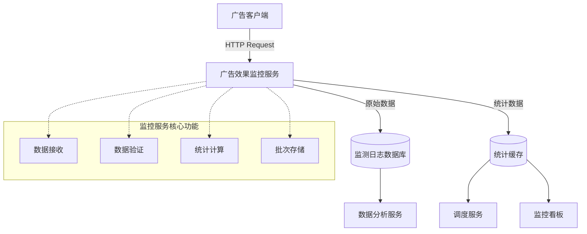

## 业务场景分析

### 1. 监测数据接收场景

#### 客户端监测数据上报
- **场景描述**：广告客户端（移动端SDK、Web端JS、视频播放器等）在广告展示、点击、播放等关键节点，需要向监控服务上报监测数据
- **数据来源**：
  - 移动端SDK：APP内广告的展示、点击、转化等事件
  - Web端JS：网页广告的用户行为监测
  - 视频播放器：视频广告的播放进度、完成度监测
  - 第三方监测：合作伙伴的监测回调数据
- **核心需求**：
  - 支持高并发的监测数据接收（10万+QPS）
  - 确保数据接收的实时性（<50ms响应）
  - 保证数据传输的可靠性和完整性
  - 兼容多种数据传输格式和协议

#### 监测事件类型处理
- **基础事件**：广告请求、加载、展示、点击、关闭、错误等核心事件
- **视频事件**：视频开始、播放进度、暂停、恢复、跳过、完成等播放事件
- **互动事件**：用户与广告的交互行为，如展开、收起、滑动等
- **转化事件**：下载、注册、购买等业务转化行为
- **处理要求**：
  - 按照广告监测上报规范进行事件分类和处理
  - 实现事件数据的标准化和规范化
  - 支持自定义事件的扩展和处理

### 2. 调度服务数据支撑场景

#### 实时效果数据查询
- **场景描述**：广告投放引擎的调度服务需要实时查询广告位、广告活动的效果数据，用于投放决策
- **查询需求**：
  - 广告位实时展示率、点击率、错误率
  - 广告活动近期效果趋势
  - 异常广告位识别和降级判断
  - 地域、时段等维度的效果差异
- **响应要求**：
  - 查询响应时间<100ms
  - 数据更新频率为分钟级
  - 支持多维度统计查询
  - 提供数据推送和订阅机制

#### 历史效果数据分析
- **场景描述**：调度服务需要基于历史数据进行趋势分析和预测，优化投放策略
- **分析维度**：
  - 时间维度：小时、天、周的效果对比
  - 地域维度：不同地区的投放效果差异
  - 人群维度：不同用户群体的广告响应情况
  - 创意维度：不同创意素材的表现对比
- **数据要求**：
  - 提供至少30天的历史数据查询
  - 支持多维度交叉分析
  - 数据准确性>99.9%
  - 支持数据聚合和统计计算

### 3. 数据存储和管理场景

#### 监测日志存储
- **场景描述**：将接收到的原始监测数据进行批次存储，为后续分析和审计提供数据基础
- **存储要求**：
  - 支持大规模数据的批次写入
  - 数据按时间和业务维度分区存储
  - 实现数据生命周期管理
  - 保证数据完整性和一致性
- **访问模式**：
  - 写入密集型：大量监测数据的实时写入
  - 查询优化：支持时间范围和条件筛选
  - 归档管理：冷数据自动归档和清理
  - 备份恢复：关键数据的备份和恢复机制

#### 数据质量管理
- **场景描述**：对接收到的监测数据进行质量控制和异常处理
- **质量控制**：
  - 数据完整性检查：必填字段验证
  - 数据格式验证：类型、范围、格式校验
  - 业务逻辑验证：事件时序、重复性检查
  - 异常数据处理：标记、修复、隔离
- **质量指标**：
  - 数据完整率>99%
  - 数据准确率>99.9%
  - 异常数据识别率>95%
  - 数据处理延迟<1秒

### 4. 系统性能和可用性场景

#### 高并发处理
- **场景描述**：在广告投放高峰期，系统需要处理大量并发的监测数据上报
- **性能要求**：
  - 支持10万+QPS的并发处理能力
  - 系统响应时间<50ms
  - 处理成功率>99.95%
  - 支持水平扩展和弹性伸缩
- **优化策略**：
  - 负载均衡和分布式处理
  - 数据缓存和批量处理
  - 异步处理和消息队列
  - 服务降级和熔断机制

#### 故障恢复和容灾
- **场景描述**：确保监控服务在异常情况下的可用性和数据安全
- **容灾措施**：
  - 多机房部署和数据同步
  - 服务健康监控和自动故障转移
  - 数据备份和恢复机制
  - 降级策略和应急处理
- **可用性指标**：
  - 系统可用性>99.95%
  - 故障恢复时间<5分钟
  - 数据丢失率<0.01%
  - 服务恢复时间<1分钟

## 功能模块设计

### 1. 监测数据接收模块

#### 1.1 HTTP监测数据接收服务
广告效果监控服务的基础功能是接收来自广告客户端的监测数据上报，这是整个监控体系的数据入口。

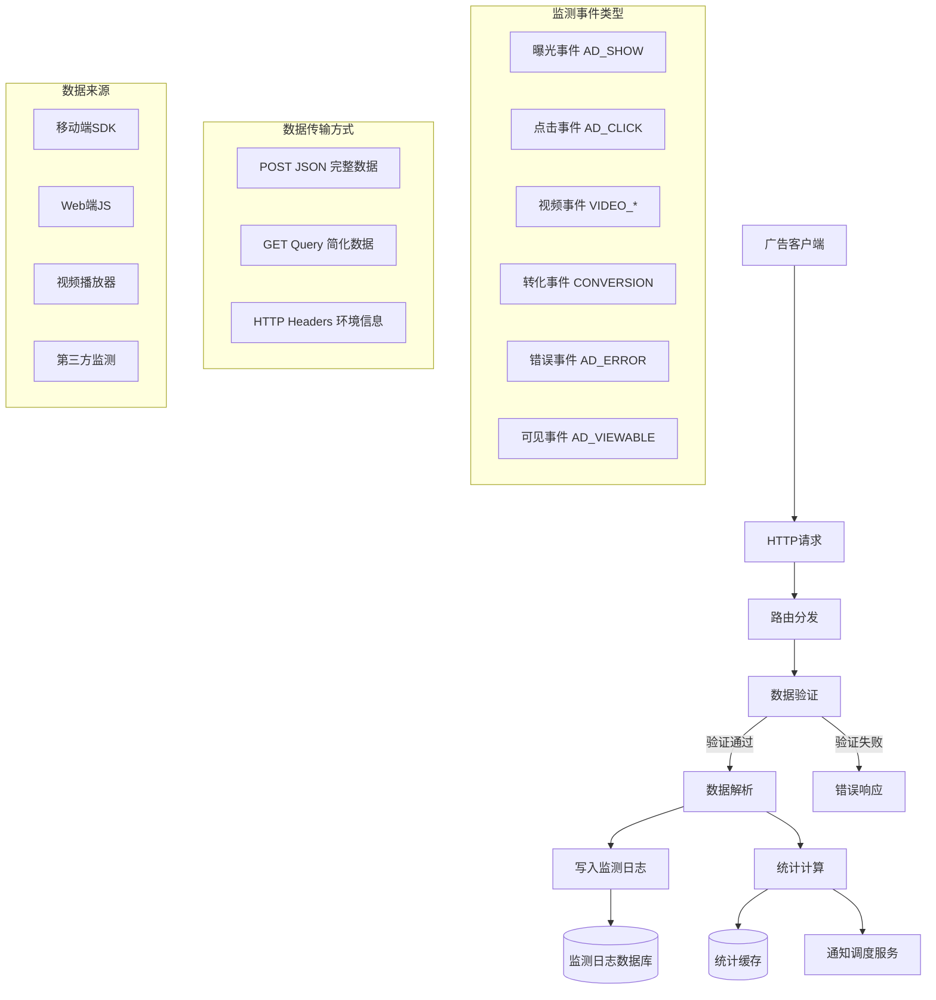

**数据接收规范**：
- **支持协议**：遵循广告监测上报规范，支持IAB VAST 4.1、OMID 1.3标准
- **传输方式**：支持POST JSON、GET Query、HTTP Headers三种数据传输方式
- **数据格式**：完全兼容监测上报规范中定义的数据结构
- **响应延迟**：监测数据接收响应时间<50ms
- **并发处理**：支持10万+QPS的监测数据接收能力
- **数据完整性**：支持必填字段验证、数据格式校验、时间戳有效性检查

#### 1.2 监测事件处理流程
基于广告监测上报规范中定义的事件体系，监控服务需要处理以下类型的监测事件：

**基础监测事件处理**：
- **AD_REQUEST**：广告请求事件，记录请求发起时的上下文信息
- **AD_LOAD**：广告加载事件，评估广告加载性能和成功率
- **AD_SHOW**：广告展示事件，统计广告实际展示次数（最重要）
- **AD_VIEWABLE**：广告可见事件，衡量广告实际被用户看到的机会
- **AD_CLICK**：广告点击事件，记录用户交互行为（最重要）
- **AD_CLOSE**：广告关闭事件，分析用户对广告的抗拒程度
- **AD_ERROR**：广告错误事件，监控广告投放质量问题

**视频广告事件处理**（符合VAST 4.1标准）：
- **VIDEO_START**：视频开始播放，记录视频广告开始播放时刻
- **VIDEO_FIRST_QUARTILE**：播放25%，分析用户早期观看行为
- **VIDEO_MIDPOINT**：播放50%，评估用户持续观看意愿
- **VIDEO_THIRD_QUARTILE**：播放75%，分析用户后期观看粘性
- **VIDEO_COMPLETE**：播放完成，统计完整观看率
- **VIDEO_SKIP**：跳过广告，分析用户抗拒程度

**互动广告事件处理**（基于SIMID 1.1标准）：
- **INTERACTION_START**：开始互动，评估广告吸引力
- **INTERACTION_END**：结束互动，分析互动深度
- **INTERACTION_EXPAND**：广告展开，评估内容吸引力
- **INTERACTION_COLLAPSE**：广告收起，分析用户主动结束行为

#### 1.3 数据质量控制与验证
**数据验证规则**：
- **基础字段验证**：eventType、timestamp、adspaceId、adId、creativeId、campaignId必填
- **设备信息验证**：ua、os、osv、make、model、ifa等设备标识完整性
- **数据格式验证**：时间戳格式、数值范围、枚举值有效性
- **业务逻辑验证**：事件时序逻辑、重复事件过滤、异常数据识别
- **第三方监测**：支持监测URL宏替换，处理第三方监测回调

**异常数据处理**：
- **数据修复**：自动补全部分缺失字段，IP地址服务端获取
- **质量评分**：为每条监测数据计算质量评分
- **异常标记**：标记异常数据但不丢弃，用于后续分析
- **重复去重**：基于设备标识和时间戳进行智能去重

### 2. 监测日志存储模块

#### 2.1 原始数据批次写入
接收到监测数据后，系统需要将原始数据批次写入监测日志数据库，为后续的数据分析和其他功能提供数据支撑。

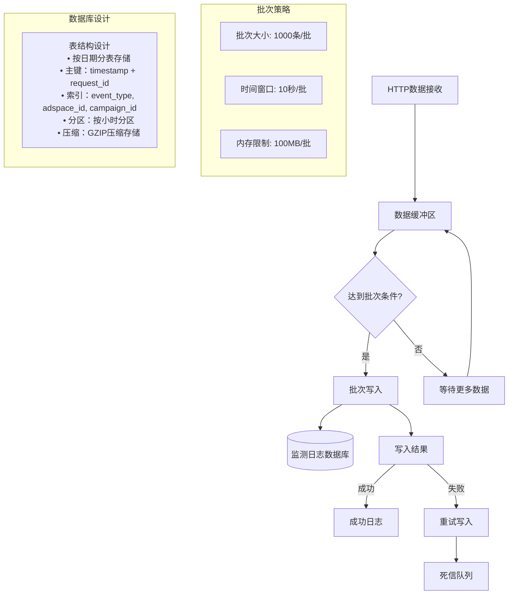

**存储策略设计**：

- **批次写入策略**：
  - 批次大小：1000条监测数据为一个批次
  - 时间窗口：超过10秒自动触发写入
  - 内存限制：缓冲区达到100MB时强制写入
  - 错误处理：写入失败的数据进入重试队列，最终进入死信队列

- **数据库表设计**：
  - **分表策略**：按日期分表，格式为monitoring_log_YYYYMMDD
  - **分区策略**：每张表按小时分区，便于查询和维护
  - **字段设计**：
    - request_id (主键1)：请求唯一标识
    - timestamp (主键2)：事件时间戳，精确到毫秒
    - event_type：事件类型，如AD_SHOW、AD_CLICK等
    - raw_data：原始JSON数据，GZIP压缩存储
    - adspace_id：广告位ID，用于数据检索
    - campaign_id：广告活动ID，用于效果统计
    - device_id：设备标识，用于用户行为分析
    - ip_address：IP地址，用于地域分析
    - create_time：入库时间

- **索引优化设计**：
  - **主键索引**：(timestamp, request_id) 保证唯一性
  - **业务索引**：(event_type, adspace_id, timestamp) 支持效果查询
  - **统计索引**：(campaign_id, timestamp) 支持活动统计
  - **分析索引**：(device_id, timestamp) 支持用户分析

#### 2.2 数据保留与归档策略

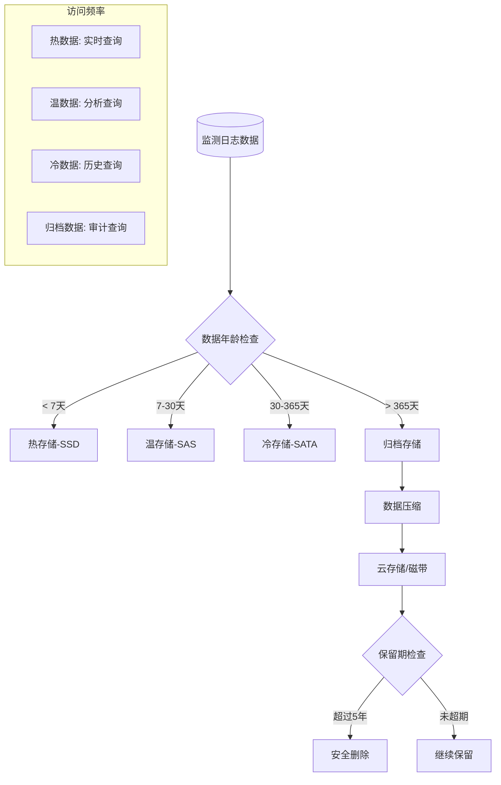

**数据生命周期管理**：

- **热数据（0-7天）**：存储在SSD高速存储上，支持实时查询和分析
- **温数据（7-30天）**：迁移到SAS存储，支持日常分析查询
- **冷数据（30-365天）**：存储在SATA大容量存储，支持历史数据分析
- **归档数据（1-5年）**：压缩后存储在云存储或磁带库，仅用于审计和合规
- **数据销毁（5年后）**：按照数据保护法规要求进行安全删除

### 3. 实时统计计算模块

#### 3.1 实时指标计算
为了支持广告投放引擎中调度服务的实时决策，监控服务需要对接收到的监测数据进行实时统计计算。

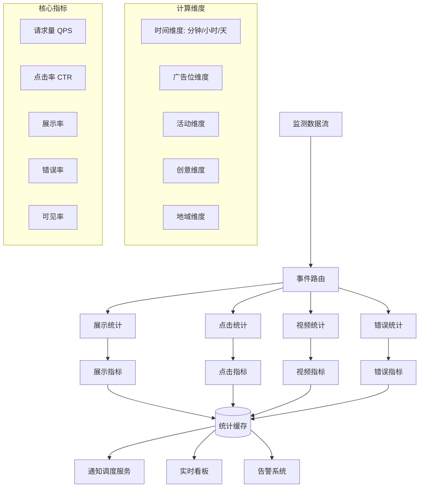

**实时计算指标定义**：

- **基础计数指标**：
  - 广告请求数：AD_REQUEST事件计数
  - 广告展示数：AD_SHOW事件计数  
  - 广告点击数：AD_CLICK事件计数
  - 广告错误数：AD_ERROR事件计数
  - 可见展示数：AD_VIEWABLE事件计数

- **效果比率指标**：
  - 展示率 = 广告展示数 / 广告请求数
  - 点击率 CTR = 广告点击数 / 广告展示数
  - 可见率 = 可见展示数 / 广告展示数
  - 错误率 = 广告错误数 / 广告请求数

- **视频专项指标**：
  - 视频开始率 = VIDEO_START数 / 视频广告展示数
  - 视频完成率 = VIDEO_COMPLETE数 / VIDEO_START数
  - 视频跳过率 = VIDEO_SKIP数 / VIDEO_START数

#### 3.2 多维度统计聚合

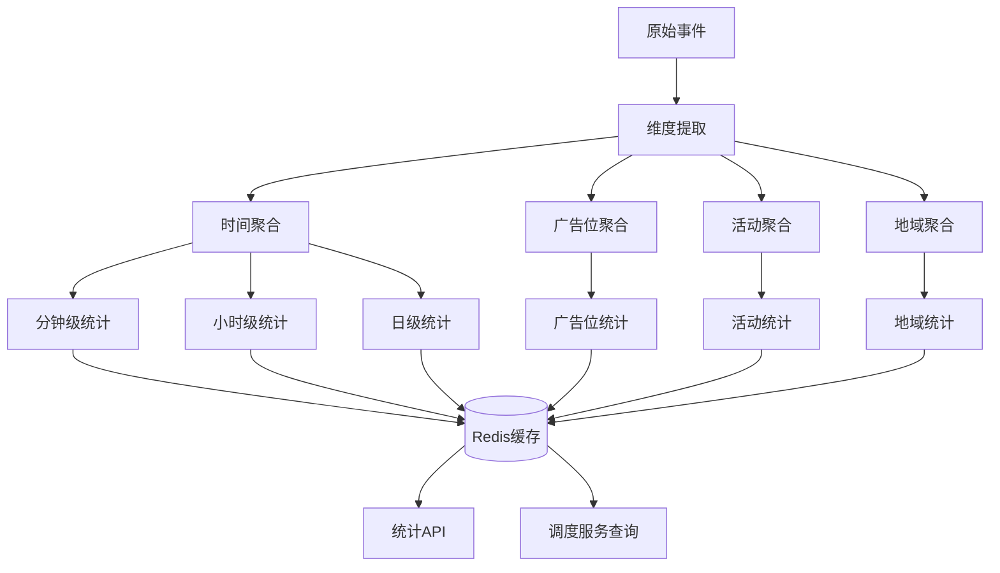

**统计聚合策略**：

- **时间维度聚合**：
  - 分钟级：实时计算最近1分钟的统计指标，用于监控告警
  - 小时级：每小时汇总统计，用于趋势分析
  - 日级：每日汇总统计，用于日报和对账
  - 周级/月级：定期汇总，用于长期趋势分析

- **业务维度聚合**：
  - 广告位维度：按adspace_id聚合，分析广告位效果
  - 活动维度：按campaign_id聚合，分析广告活动效果  
  - 创意维度：按creative_id聚合，分析创意效果
  - 地域维度：按IP地址聚合，分析地域投放效果

- **缓存策略设计**：
  - **Redis集群**：使用Redis集群存储实时统计数据
  - **键值设计**：stats:{dimension}:{id}:{time_range}
  - **过期策略**：分钟级数据保留1小时，小时级数据保留7天，日级数据保留30天
  - **数据结构**：使用Hash结构存储多个指标值

#### 3.3 调度服务数据接口

为了支持广告投放引擎运行流程设计中的调度服务，监控服务需要提供实时的统计数据接口：

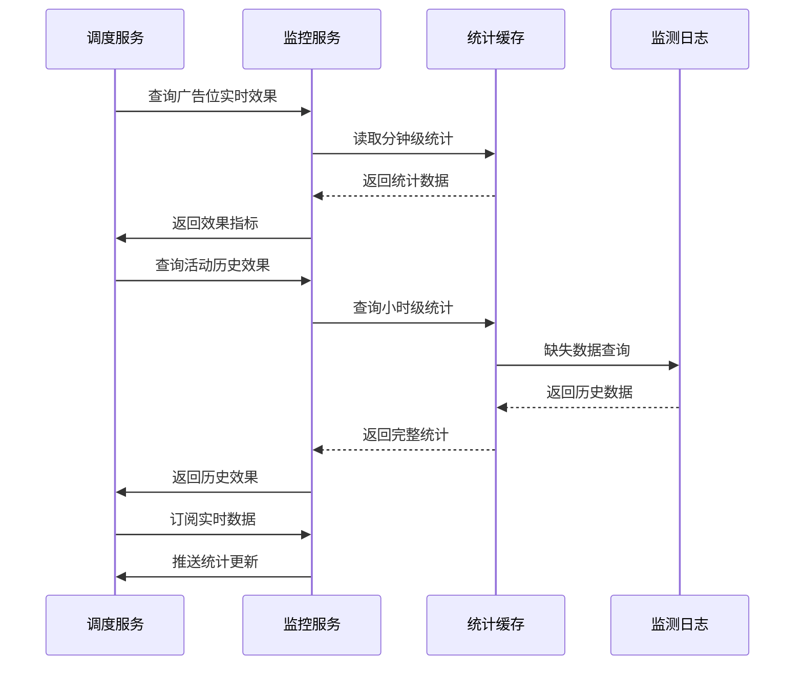

**调度服务支持接口**：

- **实时效果查询接口**：
  - 接口：`GET /api/stats/realtime/{adspace_id}`
  - 返回：最近5分钟的展示量、点击量、CTR等指标
  - 用途：调度服务实时评估广告位表现

- **历史效果查询接口**：
  - 接口：`GET /api/stats/history/{campaign_id}?hours=24`
  - 返回：指定时间范围内的历史效果数据
  - 用途：调度服务进行历史表现分析

- **异常监控接口**：
  - 接口：`GET /api/stats/anomaly/{adspace_id}`
  - 返回：广告位异常指标（高错误率、低填充率等）
  - 用途：调度服务识别问题广告位并降级处理

- **实时推送服务**：
  - 协议：WebSocket推送
  - 频率：每分钟推送关键指标更新
  - 用途：调度服务订阅实时数据变化

**性能优化设计**：
- **查询响应时间**：统计查询接口响应时间<100ms
- **数据更新频率**：统计数据更新频率为10秒一次
- **缓存命中率**：统计数据缓存命中率>95%
- **并发支持**：支持1000+并发的统计查询请求

#### 2.1 实时流处理
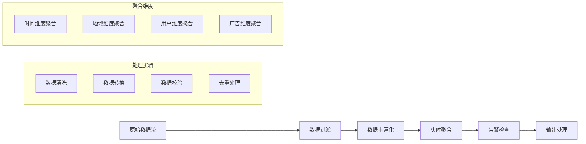

**处理能力要求**：
- **处理吞吐量**：每秒处理10万条以上数据记录
- **处理延迟**：端到端处理延迟<1秒
- **数据准确性**：处理准确率>99.9%
- **系统可用性**：服务可用性>99.95%

**聚合计算规则**：
- **分钟级聚合**：基础指标（曝光、点击、转化）实时计算
- **小时级聚合**：复合指标（CTR、CVR、ROI）定时计算
- **天级聚合**：累计指标和趋势分析数据计算
- **自定义聚合**：支持用户自定义的聚合维度和指标

#### 2.2 批处理分析
**批处理任务类型**：
- **日终对账**：每日数据完整性校验和差异处理
- **历史数据分析**：周期性的数据挖掘和洞察分析
- **模型训练**：机器学习模型的训练和更新
- **报表生成**：定期生成各类统计报表

**数据一致性保障**：
- 实时数据与批处理数据的一致性校验
- 分布式系统间的数据同步机制
- 数据修正和补偿处理流程
- 数据版本管理和回滚机制

### 3. 监控告警模块

#### 3.1 实时监控看板
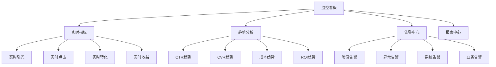

**看板功能特性**：
- **实时刷新**：数据实时更新，刷新频率可配置
- **多维筛选**：支持按时间、地域、人群、广告等维度筛选
- **自定义配置**：用户可自定义看板布局和指标展示
- **移动适配**：支持PC端和移动端的响应式显示

**关键指标定义**：
- **基础指标**：曝光量、点击量、转化量、消耗金额
- **比率指标**：CTR、CVR、ROI、填充率
- **成本指标**：CPM、CPC、CPA、ROAS
- **质量指标**：广告相关性、用户满意度、投诉率

#### 3.2 智能告警系统
**告警规则类型**：
- **阈值告警**：指标超过预设阈值时触发
- **趋势告警**：指标变化趋势异常时触发
- **同比告警**：与历史同期数据对比异常时触发
- **异常检测告警**：基于机器学习的异常模式识别

**告警处理流程**：
1. **告警触发**：系统检测到异常情况
2. **告警分级**：根据严重程度进行分级处理
3. **告警通知**：通过多种渠道发送告警通知
4. **告警确认**：相关人员确认并处理告警
5. **告警关闭**：问题解决后关闭告警

**通知渠道配置**：
- 邮件通知：详细告警信息和处理建议
- 短信通知：紧急告警的快速通知
- 微信/钉钉：团队协作工具的集成通知
- 系统内通知：平台内的消息提醒

### 4. 数据分析模块

#### 4.1 多维度分析
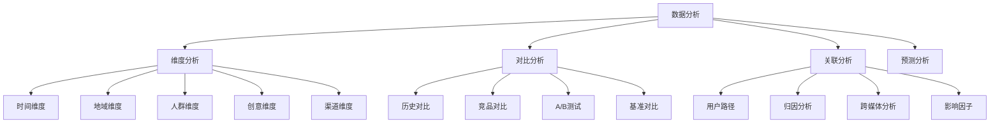

**分析维度详解**：

**时间维度分析**：
- 小时级分析：识别投放高峰时段和低谷时段
- 日级分析：分析工作日和节假日的投放效果差异
- 周级分析：发现周期性的投放规律和趋势
- 月级分析：评估长期投放策略的效果

**地域维度分析**：
- 国家/地区：跨国投放效果对比分析
- 省份/城市：区域化投放策略优化
- 城市等级：一二三线城市的差异化分析
- 商圈位置：基于LBS的精准投放分析

**人群维度分析**：
- 人口属性：年龄、性别、教育、职业等维度分析
- 行为特征：浏览习惯、购买偏好、使用场景分析
- 兴趣偏好：基于用户画像的兴趣标签分析
- 生命周期：新用户、活跃用户、流失用户分析

#### 4.2 归因分析模型
**归因模型类型**：

**最后点击归因**：
- 适用场景：简单的转化路径分析
- 优点：计算简单，易于理解
- 缺点：忽略了转化路径中的其他触点贡献

**首次点击归因**：
- 适用场景：品牌认知和首次接触分析
- 优点：重视用户获取渠道的价值
- 缺点：忽略了后续触点的影响

**时间衰减归因**：
- 适用场景：考虑时间因素的复杂转化路径
- 计算方法：距离转化时间越近，权重越高
- 应用场景：长周期的B2B销售或高价值商品

**位置权重归因**：
- 适用场景：平衡首次接触和最终转化的影响
- 权重分配：首次和最终触点权重较高，中间触点平均分配
- 优化效果：综合考虑全链路的营销价值

**数据驱动归因**：
- 技术实现：基于机器学习算法的动态权重分配
- 优势特点：根据实际数据自动优化归因权重
- 适用场景：数据量充足的复杂营销场景

#### 4.3 预测分析能力
**预测模型类型**：

**效果预测**：
- CTR预测：基于历史数据预测广告点击率
- CVR预测：预测广告转化率和转化价值
- ROI预测：预测投放回报率和盈利能力
- 流量预测：预测未来时段的流量变化

**异常检测**：
- 异常流量检测：识别非正常的流量模式
- 作弊行为检测：检测点击作弊和转化作弊
- 系统异常检测：监控系统性能异常
- 业务异常检测：识别业务指标异常波动

**优化建议**：
- 出价优化：基于效果预测的智能出价建议
- 定向优化：基于人群分析的定向策略优化
- 创意优化：基于A/B测试的创意优化建议
- 预算分配：基于ROI预测的预算分配优化

### 5. 报表中心模块

#### 5.1 标准报表体系
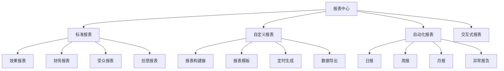

**标准报表类型**：

**效果报表**：
- 投放概览报表：整体投放效果的汇总展示
- 趋势分析报表：各项指标的时间趋势分析
- 对比分析报表：不同维度的效果对比分析
- 详细数据报表：明细数据的全量展示

**财务报表**：
- 消耗统计报表：按各维度统计的消耗金额
- 成本分析报表：各类成本指标的分析报告
- 收益分析报表：投放收益和ROI分析
- 预算执行报表：预算使用情况和执行进度

**受众报表**：
- 人群画像报表：目标受众的详细画像分析
- 行为分析报表：用户行为路径和偏好分析
- 地域分布报表：受众地域分布和效果差异
- 设备分析报表：不同设备类型的投放效果

**创意报表**：
- 创意效果报表：不同创意的效果对比分析
- 素材分析报表：各类素材的表现分析
- A/B测试报表：创意A/B测试结果报告
- 创意优化报表：创意优化建议和方案

#### 5.2 自定义报表功能
**报表构建器特性**：
- **拖拽式操作**：通过拖拽方式快速构建报表
- **丰富的图表类型**：支持柱状图、折线图、饼图、热力图等
- **灵活的筛选条件**：支持多维度、多条件的数据筛选
- **实时数据更新**：报表数据可配置实时或定时更新

**报表模板管理**：
- 预置模板：提供行业通用的报表模板
- 自定义模板：用户可创建和保存自定义报表模板
- 模板分享：支持团队内部的模板分享和复用
- 版本管理：报表模板的版本控制和历史记录

**数据导出功能**：
- 多格式支持：Excel、CSV、PDF、图片等格式导出
- 定时导出：设置定时任务自动生成和发送报表
- 权限控制：数据导出的权限管理和审批流程
- 数据脱敏：敏感数据的脱敏处理和保护

## 技术架构要求

### 1. 系统架构设计
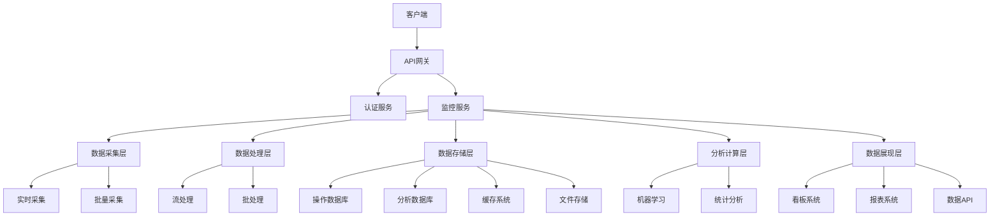

### 2. 性能要求规范
**响应时间要求**：
- 实时监控看板：页面加载时间<3秒，数据刷新时间<1秒
- 报表查询：简单查询<5秒，复杂查询<30秒
- 数据导出：小型报表<10秒，大型报表<5分钟
- API接口：平均响应时间<500毫秒，99分位响应时间<2秒

**并发处理能力**：
- 支持1000+并发用户同时访问
- 支持10万+QPS的数据采集能力
- 支持TB级数据的实时处理能力
- 支持PB级数据的存储和查询能力

**可用性要求**：
- 系统可用性：99.95%以上
- 数据准确性：99.99%以上
- 故障恢复时间：RTO<5分钟，RPO<1分钟
- 异地容灾：支持异地多活和数据备份

### 3. 数据安全保障
**数据传输安全**：
- 全链路HTTPS加密传输
- API接口的身份认证和授权
- 数据传输的完整性校验
- 敏感数据的加密处理

**数据存储安全**：
- 数据库访问权限控制
- 敏感数据的字段级加密
- 数据备份和恢复机制
- 数据保留策略和自动清理

**隐私保护合规**：
- 用户数据匿名化处理
- 符合GDPR、CCPA等隐私法规
- 数据使用范围和目的限制
- 用户数据删除和撤回机制

## 用户体验设计

### 1. 界面设计原则
**简洁直观**：
- 界面布局清晰，信息层次分明
- 核心功能突出，次要功能收敛
- 色彩搭配协调，符合品牌调性
- 图标设计统一，易于理解

**高效操作**：
- 常用功能快速访问
- 支持键盘快捷键操作
- 批量操作和快速筛选
- 智能搜索和推荐

**响应式设计**：
- 适配PC、平板、手机等多种设备
- 保持各设备上的一致体验
- 针对移动端优化交互方式
- 支持触摸手势操作

### 2. 用户角色权限
**权限级别设计**：

**超级管理员**：
- 系统配置和参数设置
- 用户账户和权限管理
- 数据备份和恢复操作
- 系统监控和运维管理

**数据分析师**：
- 查看所有数据和报表
- 创建自定义分析报表
- 数据导出和分享功能
- 高级分析工具使用

**广告主用户**：
- 查看自己的广告数据
- 生成投放效果报表
- 设置监控告警规则
- 基础数据分析功能

**媒体方用户**：
- 查看流量和收益数据
- 广告位效果分析
- 流量质量监控
- 收益优化建议

**只读用户**：
- 查看授权范围内的数据
- 使用预设的报表模板
- 基础的数据筛选功能
- 数据可视化图表查看

### 3. 移动端适配
**移动端特性**：
- 关键指标的卡片式展示
- 手势操作和滑动交互
- 离线数据缓存和同步
- 推送通知和告警提醒

**功能优先级**：
1. 实时监控看板
2. 关键告警通知
3. 简化版报表查看
4. 基础数据筛选

## 数据治理规范

### 1. 数据标准化
**数据模型规范**：
- 统一的数据字典和编码规范
- 标准化的数据格式和类型
- 规范化的字段命名约定
- 一致的数据关联关系

**数据质量标准**：
- 数据完整性：必填字段完整率>99%
- 数据准确性：数据准确率>99.9%
- 数据及时性：实时数据延迟<1秒
- 数据一致性：跨系统数据一致性>99.99%

### 2. 数据生命周期管理
**数据保留策略**：
- 实时数据：保留7天
- 聚合数据：保留2年
- 历史数据：保留5年后归档
- 备份数据：保留10年

**数据归档策略**：
- 冷数据自动识别和迁移
- 归档数据的压缩和加密
- 归档数据的检索和恢复
- 归档成本控制和优化

### 3. 数据合规管理
**合规要求**：
- 遵循《网络安全法》、《数据安全法》、《个人信息保护法》
- 符合行业监管要求和标准
- 建立数据分类分级制度
- 实施数据安全评估机制

**审计追踪**：
- 数据操作日志记录
- 用户访问行为追踪
- 数据变更历史记录
- 异常行为告警机制

## 运营支持体系

### 1. 用户培训体系
**培训内容设计**：
- 产品功能介绍和操作指南
- 数据分析方法和最佳实践
- 常见问题解答和故障处理
- 高级功能使用和案例分享

**培训方式**：
- 在线视频教程和文档
- 定期的线上培训直播
- 一对一的客户培训服务
- 用户社区和经验分享

### 2. 客户服务支持
**服务渠道**：
- 7×24小时在线客服支持
- 电话和邮件技术支持
- 专属客户成功经理服务
- 用户反馈和建议收集

**服务标准**：
- 一般问题4小时内响应
- 紧急问题1小时内响应
- 系统故障30分钟内响应
- 客户满意度90%以上

### 3. 产品迭代优化
**需求收集机制**：
- 用户反馈收集和分析
- 市场调研和竞品分析
- 数据驱动的产品决策
- 敏捷开发和快速迭代

**版本发布计划**：
- 大版本：季度发布，重大功能更新
- 小版本：月度发布，功能优化和bug修复
- 热修复：紧急发布，关键问题修复
- 功能预览：Beta版本提前体验

## 成功指标与评估

### 1. 产品指标
**用户增长指标**：
- 注册用户数月增长率>20%
- 活跃用户数日增长率>5%
- 用户留存率：次日留存>80%，7日留存>60%，30日留存>40%

**使用深度指标**：
- 日均使用时长>30分钟
- 功能使用覆盖率>70%
- 自定义报表创建率>30%
- 数据导出使用率>50%

### 2. 业务指标
**效果提升指标**：
- 广告主投放ROI提升>15%
- 媒体方收益提升>20%
- 平台整体效率提升>25%
- 客户投诉率降低>50%

**服务质量指标**：
- 系统可用性>99.95%
- 数据准确率>99.99%
- 平均响应时间<2秒
- 客户满意度>90%

### 3. 技术指标
**性能指标**：
- 数据处理延迟<1秒
- 并发用户支持>1000
- 数据吞吐量>10万QPS
- 存储查询性能<5秒

**稳定性指标**：
- 系统故障次数<1次/月
- 故障恢复时间<5分钟
- 数据丢失率<0.01%
- 安全事件零容忍

## 风险评估与应对

### 1. 技术风险
**系统稳定性风险**：
- 风险描述：大流量冲击导致系统不稳定
- 应对措施：弹性扩容、熔断降级、多地容灾
- 监控指标：系统负载、响应时间、错误率
- 预警机制：自动扩容、故障转移、告警通知

**数据安全风险**：
- 风险描述：数据泄露或被恶意攻击
- 应对措施：多层防护、权限控制、加密传输
- 安全审计：定期安全评估、渗透测试
- 应急预案：入侵检测、快速响应、损失控制

### 2. 业务风险
**合规风险**：
- 风险描述：违反数据保护和隐私法规
- 应对措施：合规审查、数据治理、隐私保护
- 定期评估：法规更新跟踪、合规状态检查
- 整改机制：问题识别、快速整改、持续改进

**竞争风险**：
- 风险描述：竞品功能超越或价格竞争
- 应对措施：持续创新、差异化定位、价值提升
- 市场监控：竞品分析、用户反馈、市场趋势
- 策略调整：产品迭代、价格策略、服务升级

### 3. 运营风险
**用户流失风险**：
- 风险描述：用户满意度下降导致流失
- 应对措施：用户体验优化、客户成功管理
- 监控指标：用户活跃度、满意度调研、流失率
- 挽回策略：问题快速解决、主动沟通、价值重塑

**团队能力风险**：
- 风险描述：团队技能不足影响产品质量
- 应对措施：人才引进、培训提升、知识管理
- 能力评估：技能矩阵、绩效考核、能力盘点
- 发展计划：培训规划、职业发展、团队建设

## 总结

广告效果监控服务作为广告平台的核心基础组件，其最重要的功能是作为监测数据的统一接收和处理中心。该服务的设计重点聚焦在以下几个核心方面：

### 核心功能定位

1. **监测数据接收中心**
   - 作为广告客户端监测数据的统一入口
   - 支持多种传输方式（POST JSON、GET Query、HTTP Headers）
   - 严格遵循广告监测上报规范，确保数据标准化
   - 提供高并发、低延迟的数据接收能力

2. **原始数据存储管理**
   - 将接收到的原始监测数据批次写入监测日志数据库
   - 为后续的数据分析、报表生成、审计等功能提供数据基础
   - 实现数据生命周期管理，优化存储成本
   - 保证数据完整性和一致性

3. **实时统计计算引擎**
   - 对监测数据进行实时统计计算，生成关键效果指标
   - 为广告投放引擎的调度服务提供决策支持数据
   - 支持多维度统计聚合，满足不同业务场景需求
   - 提供高性能的统计数据查询接口

### 系统价值体现

- **数据驱动决策**：为调度服务提供实时、准确的效果数据，支持智能投放决策
- **业务流程支撑**：作为广告投放链路中的关键环节，连接前端投放和后端分析
- **标准化处理**：统一监测数据的接收、验证、存储标准，确保数据质量
- **扩展性设计**：为未来的高级分析、机器学习、报表系统等功能预留数据基础

该产品设计强调以数据接收和基础处理为核心，通过高效的数据处理能力为整个广告平台提供坚实的数据基础，确保广告投放的实时性和精准性。同时，通过标准化的设计和模块化的架构，为后续功能扩展和系统演进奠定基础。
