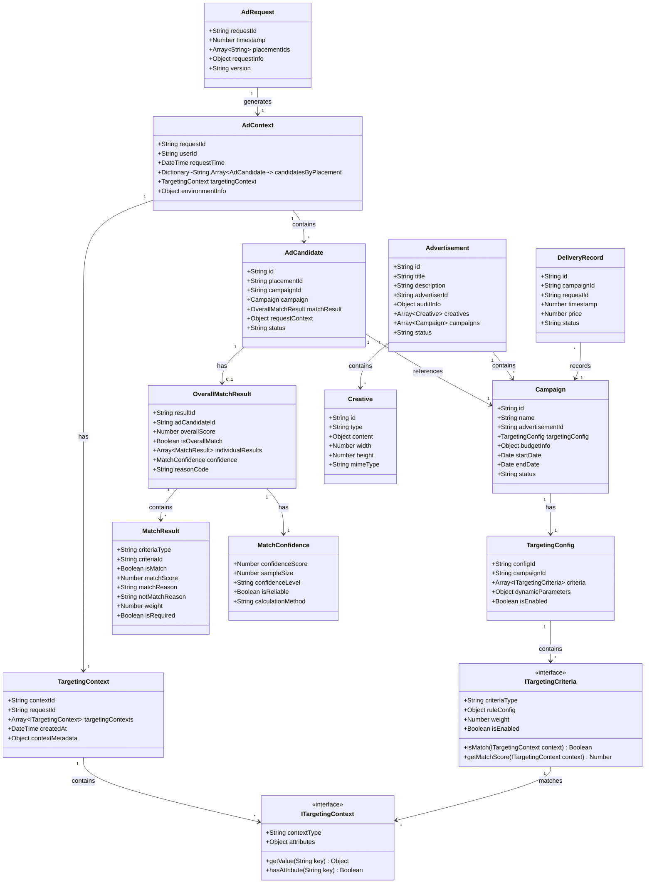
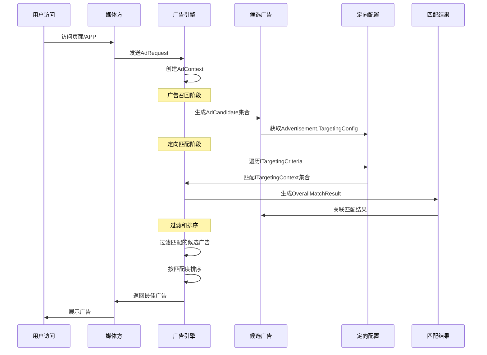
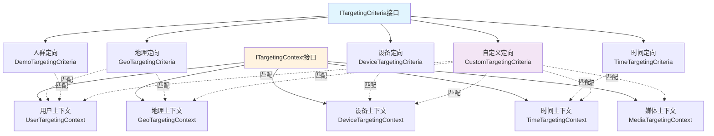
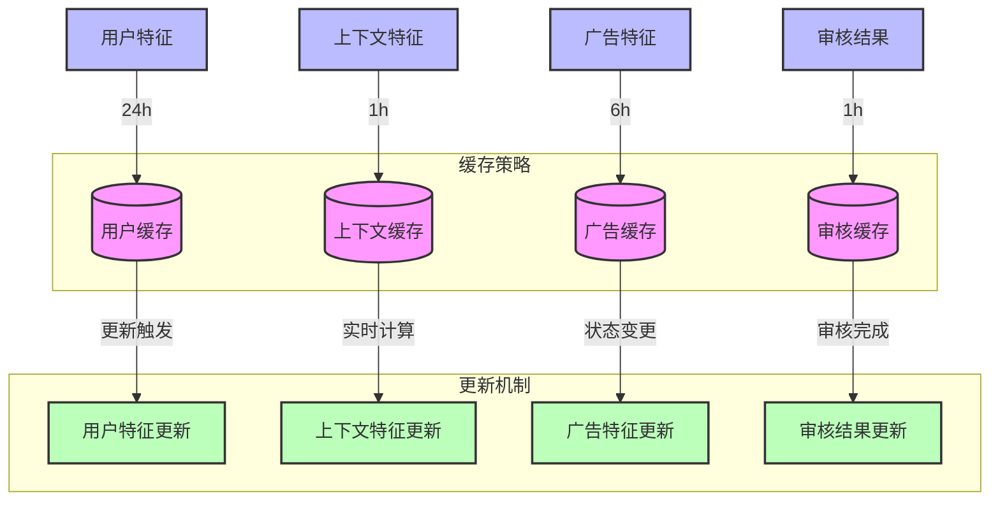

# 广告投放引擎数据模型设计

## 1. 核心数据模型

### 1.0 对象关系模型



### 1.1 广告请求模型 (AdRequest)

广告请求是媒体方向广告引擎发起的批量广告展示请求，支持一次请求多个广告位的广告。

| 字段名       | 类型   | 必填 | 描述             | 示例值                                 | 取值范围/说明              |
| ------------ | ------ | ---- | ---------------- | -------------------------------------- | -------------------------- |
| requestId    | string | 是   | 请求唯一标识     | "550e8400-e29b-41d4-a716-446655440000" | UUID格式                   |
| timestamp    | number | 是   | 请求时间戳(毫秒) | 1612345678901                          | 当前时间前后5分钟内        |
| placementIds | array  | 是   | 广告位ID集合     | ["p123456", "p123457"]                 | 批量请求的广告位标识       |
| requestInfo  | object | 是   | 请求基础信息     | -                                      | 包含用户、设备、媒体等信息 |
| version      | string | 是   | API版本号        | "1.0"                                  | 当前支持版本: 1.0          |

### 1.2 广告上下文模型 (AdContext)

广告上下文是广告引擎根据AdRequest和其他信息组成的完整请求上下文，按广告位组织候选广告集合。

| 字段名                | 类型       | 必填 | 描述                   | 示例值        | 取值范围/说明                         |
| --------------------- | ---------- | ---- | ---------------------- | ------------- | ------------------------------------- |
| requestId             | string     | 是   | 请求标识               | "req123456"   | 关联的原始请求ID                      |
| userId                | string     | 否   | 用户标识               | "u123456"     | 平台用户唯一标识                      |
| requestTime           | number     | 是   | 请求时间               | 1612345678901 | 毫秒时间戳                            |
| candidatesByPlacement | dictionary | 是   | 按广告位分组的候选广告 | -             | Key为广告位ID，Value为AdCandidate数组 |
| targetingContext      | object     | 是   | 定向上下文             | -             | TargetingContext对象                  |
| environmentInfo       | object     | 是   | 环境信息               | -             | 包含时间、竞争情况等环境数据          |

### 1.3 定向上下文模型 (TargetingContext)

定向上下文包含用于广告定向匹配的用户和环境信息，从AdContext中独立出来便于管理。

| 字段名          | 类型   | 必填 | 描述       | 示例值             | 取值范围/说明              |
| --------------- | ------ | ---- | ---------- | ------------------ | -------------------------- |
| userId          | string | 否   | 用户标识   | "u123456"          | 平台用户唯一标识           |
| deviceInfo      | object | 是   | 设备信息   | -                  | DeviceInfo对象             |
| locationInfo    | object | 否   | 位置信息   | -                  | LocationInfo对象           |
| userProfile     | object | 否   | 用户画像   | -                  | UserProfile对象            |
| behaviorData    | object | 否   | 行为数据   | -                  | 用户历史行为和偏好信息     |
| contextualTags  | array  | 否   | 上下文标签 | ["tech", "mobile"] | 当前页面/内容相关的标签    |
| realtimeFactors | object | 否   | 实时因子   | -                  | 实时竞争度、时段等动态因子 |

### 1.4 候选广告模型 (AdCandidate)

候选广告是经过初步筛选后可能投放的广告实体，包含广告位关联信息和匹配结果。

| 字段名         | 类型   | 必填 | 描述           | 示例值       | 取值范围/说明                   |
| -------------- | ------ | ---- | -------------- | ------------ | ------------------------------- |
| id             | string | 是   | 候选广告标识   | "c123456"    | 唯一标识                        |
| campaignId     | string | 是   | 关联活动ID     | "camp123456" | 关联的Campaign对象ID            |
| placementId    | string | 是   | 广告位标识     | "p123456"    | 目标投放的广告位ID              |
| campaign       | object | 是   | 活动对象引用   | -            | Campaign对象                    |
| matchResult    | object | 否   | 定向匹配结果   | -            | OverallMatchResult对象          |
| requestContext | object | 是   | 请求上下文信息 | -            | 存储请求相关的临时数据          |
| status         | string | 是   | 候选状态       | "matched"    | created/matched/filtered/ranked |

### 1.5 广告模型 (Advertisement)

广告是广告主创建的投放内容，包含完整的广告信息和创意素材。

| 字段名       | 类型   | 必填 | 描述         | 示例值     | 取值范围/说明                        |
| ------------ | ------ | ---- | ------------ | ---------- | ------------------------------------ |
| id           | string | 是   | 广告ID       | "ad123456" | 广告唯一标识                         |
| title        | string | 是   | 广告标题     | "优质商品" | 广告展示标题                         |
| description  | string | 否   | 广告描述     | "详细描述" | 广告详细描述                         |
| advertiserId | string | 是   | 广告主ID     | "adv123"   | 关联的广告主标识                     |
| auditInfo    | object | 是   | 审核信息     | -          | 审核状态和相关信息                   |
| creatives    | array  | 是   | 创意素材集合 | -          | Creative对象数组                     |
| campaigns    | array  | 是   | 广告活动集合 | -          | Campaign对象数组                     |
| status       | string | 是   | 广告状态     | "active"   | draft/pending/approved/active/paused |

### 1.5 广告活动模型 (Campaign)

广告活动是广告的具体投放实例，包含定向配置、预算控制和时间管理。

| 字段名          | 类型   | 必填 | 描述       | 示例值       | 取值范围/说明                      |
| --------------- | ------ | ---- | ---------- | ------------ | ---------------------------------- |
| id              | string | 是   | 活动ID     | "camp123456" | 活动唯一标识                       |
| name            | string | 是   | 活动名称   | "春季推广"   | 活动展示名称                       |
| advertisementId | string | 是   | 关联广告ID | "ad123456"   | 所属广告标识                       |
| targetingConfig | object | 是   | 定向配置   | -            | TargetingConfig对象                |
| budgetInfo      | object | 是   | 预算信息   | -            | 包含总预算、日预算等               |
| startDate       | date   | 是   | 开始时间   | -            | 活动投放开始时间                   |
| endDate         | date   | 是   | 结束时间   | -            | 活动投放结束时间                   |
| status          | string | 是   | 活动状态   | "active"     | draft/active/paused/ended/archived |

### 1.6 定向配置模型 (TargetingConfig)

定向配置是每个广告活动的投放定向设置，包含定向条件集合和动态参数。

| 字段名            | 类型    | 必填 | 描述         | 示例值       | 取值范围/说明                  |
| ----------------- | ------- | ---- | ------------ | ------------ | ------------------------------ |
| configId          | string  | 是   | 配置标识     | "tc123456"   | 定向配置唯一标识               |
| campaignId        | string  | 是   | 关联活动ID   | "camp123456" | 所属活动标识                   |
| criteria          | array   | 是   | 定向条件集合 | -            | ITargetingCriteria实现对象数组 |
| dynamicParameters | object  | 否   | 动态参数     | -            | 运行时优化参数                 |
| isEnabled         | boolean | 是   | 是否启用     | true         | 定向配置开关                   |

### 1.7 定向条件接口 (ITargetingCriteria)

定向条件是可扩展的定向判断逻辑，支持不同类型的定向策略。

| 方法/属性       | 类型     | 必填 | 描述         | 示例值 | 取值范围/说明          |
| --------------- | -------- | ---- | ------------ | ------ | ---------------------- |
| criteriaType    | string   | 是   | 条件类型     | "geo"  | geo/demo/device/time等 |
| ruleConfig      | object   | 是   | 规则配置     | -      | 具体定向规则配置       |
| weight          | number   | 是   | 权重         | 1.0    | 定向条件权重           |
| isEnabled       | boolean  | 是   | 是否启用     | true   | 条件开关               |
| isMatch()       | function | 是   | 匹配判断方法 | -      | 返回是否匹配           |
| getMatchScore() | function | 是   | 匹配评分方法 | -      | 返回匹配度分数(0-1)    |

### 1.7 定向上下文接口 (ITargetingContext)

定向上下文提供定向判断所需的环境信息，支持可扩展的上下文数据。

| 方法/属性      | 类型     | 必填 | 描述         | 示例值 | 取值范围/说明          |
| -------------- | -------- | ---- | ------------ | ------ | ---------------------- |
| contextType    | string   | 是   | 上下文类型   | "user" | user/device/geo/time等 |
| attributes     | object   | 是   | 属性集合     | -      | 上下文相关属性数据     |
| getValue()     | function | 是   | 获取属性值   | -      | 根据键获取属性值       |
| hasAttribute() | function | 是   | 判断属性存在 | -      | 判断是否包含指定属性   |

### 1.8 整体匹配结果模型 (OverallMatchResult)

整体匹配结果存储候选广告的定向匹配计算结果，用于过滤和排序决策。

| 字段名            | 类型    | 必填 | 描述         | 示例值          | 取值范围/说明            |
| ----------------- | ------- | ---- | ------------ | --------------- | ------------------------ |
| resultId          | string  | 是   | 结果标识     | "r123456"       | 匹配结果唯一标识         |
| adCandidateId     | string  | 是   | 候选广告ID   | "c123456"       | 关联的候选广告标识       |
| overallScore      | number  | 是   | 整体匹配度   | 0.85            | 0-1之间的匹配度分数      |
| isOverallMatch    | boolean | 是   | 是否整体匹配 | true            | 整体匹配判断结果         |
| individualResults | array   | 是   | 单项匹配结果 | -               | 各定向条件的匹配结果数组 |
| reasonCode        | string  | 是   | 匹配原因码   | "MATCH_SUCCESS" | 匹配或不匹配的原因说明   |

### 1.8.1 单项匹配结果模型 (MatchResult)

单项匹配结果表示单个定向条件的匹配计算结果，是整体匹配结果的组成部分。

| 字段名         | 类型    | 必填 | 描述       | 示例值               | 取值范围/说明            |
| -------------- | ------- | ---- | ---------- | -------------------- | ------------------------ |
| criteriaType   | string  | 是   | 条件类型   | "geo"                | 定向条件类型标识         |
| criteriaId     | string  | 是   | 条件ID     | "geo_001"            | 具体定向条件实例标识     |
| isMatch        | boolean | 是   | 是否匹配   | true                 | 该条件的匹配判断结果     |
| matchScore     | number  | 是   | 匹配度分数 | 0.9                  | 0-1之间的匹配度分数      |
| matchReason    | string  | 否   | 匹配原因   | "用户位于目标区域"   | 匹配成功的具体原因       |
| notMatchReason | string  | 否   | 不匹配原因 | "用户不在目标年龄段" | 不匹配的具体原因         |
| weight         | number  | 是   | 权重       | 0.3                  | 该条件在整体评分中的权重 |
| isRequired     | boolean | 是   | 是否必选   | false                | 是否为必须满足的条件     |

### 1.8.2 匹配置信度模型 (MatchConfidence)

匹配置信度表示匹配结果的可靠性评估，基于统计学方法计算。

| 字段名            | 类型    | 必填 | 描述       | 示例值     | 取值范围/说明                    |
| ----------------- | ------- | ---- | ---------- | ---------- | -------------------------------- |
| confidenceScore   | number  | 是   | 置信度分数 | 0.85       | 0-1之间的置信度分数              |
| sampleSize        | number  | 是   | 样本数量   | 1000       | 统计计算基础的样本数量           |
| confidenceLevel   | string  | 是   | 置信度等级 | "High"     | VeryLow/Low/Medium/High/VeryHigh |
| isReliable        | boolean | 是   | 是否可靠   | true       | 基于阈值判断的可靠性标识         |
| calculationMethod | string  | 是   | 计算方法   | "Bayesian" | 置信度计算使用的统计方法         |
```

## 2. 核心业务流程

### 2.1 广告投放流程



### 2.2 定向扩展机制



### 2.3 数据流转说明

1. **用户请求阶段**：
   - 用户访问媒体触发AdRequest
   - 广告引擎根据AdRequest创建AdContext
   - AdContext包含该次请求的所有ITargetingContext集合

2. **候选广告生成**：
   - 广告引擎生成AdCandidate集合
   - 每个AdCandidate引用一个Advertisement对象
   - Advertisement包含一个TargetingConfig配置

3. **定向匹配计算**：
   - TargetingConfig包含多个ITargetingCriteria实现
   - 每个ITargetingCriteria与AdContext中的ITargetingContext进行匹配
   - 生成OverallMatchResult存储匹配结果

4. **过滤和排序**：
   - 根据OverallMatchResult.isOverallMatch进行过滤
   - 根据OverallMatchResult.overallScore进行排序
   - 选择最佳候选广告进行投放

## 3. 扩展性设计

### 3.1 定向策略可扩展性

通过ITargetingCriteria和ITargetingContext接口设计，系统支持：

- **新增定向类型**：实现ITargetingCriteria接口即可添加新的定向逻辑
- **新增上下文信息**：实现ITargetingContext接口即可扩展上下文数据
- **灵活组合**：不同定向条件可以自由组合使用
- **动态配置**：定向规则可以通过配置动态调整

### 3.2 常见扩展场景

| 扩展类型   | 实现方式                     | 应用场景             |
| ---------- | ---------------------------- | -------------------- |
| 地理定向   | GeoTargetingCriteria         | 按地区投放广告       |
| 人群定向   | DemographicTargetingCriteria | 按年龄、性别等投放   |
| 行为定向   | BehaviorTargetingCriteria    | 按用户行为历史投放   |
| 兴趣定向   | InterestTargetingCriteria    | 按用户兴趣偏好投放   |
| 设备定向   | DeviceTargetingCriteria      | 按设备类型投放       |
| 时间定向   | TimeTargetingCriteria        | 按时间段投放         |
| 频次控制   | FrequencyTargetingCriteria   | 控制广告展示频次     |
| 竞价策略   | BiddingTargetingCriteria     | 动态竞价逻辑         |
| 媒体定向   | MediaTargetingCriteria       | 按媒体类型或质量投放 |
| 自定义定向 | CustomTargetingCriteria      | 客户特定的定向需求   |

## 4. 缓存数据结构

### 4.1 特征缓存结构

| 字段名 | 类型   | 必填 | 描述     | 示例值        | 取值范围/说明   |
| ------ | ------ | ---- | -------- | ------------- | --------------- |
| key    | string | 是   | 缓存键   | "f:u123456"   | 特征类型:ID     |
| type   | string | 是   | 特征类型 | "user"        | user/context/ad |
| value  | object | 是   | 特征数据 | -             | 特征具体内容    |
| expire | number | 是   | 过期时间 | 1612345678901 | 毫秒时间戳      |

### 4.2 索引设计

#### 请求索引

```sql
-- 广告投放记录索引
CREATE INDEX idx_delivery_ad ON delivery_record(advertisement_id, timestamp);
CREATE INDEX idx_delivery_req ON delivery_record(request_id, timestamp);

-- 特征匹配索引
CREATE INDEX idx_feature_user ON feature_match(user_id, type);
CREATE INDEX idx_feature_context ON feature_match(context_id, type);
```

#### 审核状态索引

```sql
-- 广告审核状态索引
CREATE INDEX idx_audit_status ON advertisement(audit.status, audit.lastmod);
CREATE INDEX idx_audit_advertiser ON advertisement(advertiser_id, audit.status);
```

### 4.3 对象缓存关系图



### 4.4 缓存策略

#### 缓存键设计

- 用户特征缓存键: `user:{userId}:feature`
- 上下文特征缓存键: `context:{contextId}:feature`
- 广告特征缓存键: `ad:{adId}:feature`
- 审核结果缓存键: `audit:{adId}:result`

#### 缓存生命周期

- 用户特征: 24小时
- 上下文特征: 1小时
- 广告特征: 6小时
- 审核结果: 1小时

#### 缓存更新策略

1. 用户特征更新
   - 登录触发更新
   - 行为变化触发更新
   - 定时任务批量更新

2. 上下文特征更新
   - 请求时实时计算
   - 相似场景共享
   - 热点场景预加载

3. 广告特征更新
   - 创建时生成缓存
   - 修改时强制更新
   - 审核状态变更时更新

4. 审核结果更新
   - 审核完成时更新
   - 定时任务检查过期
   - 状态变更时更新