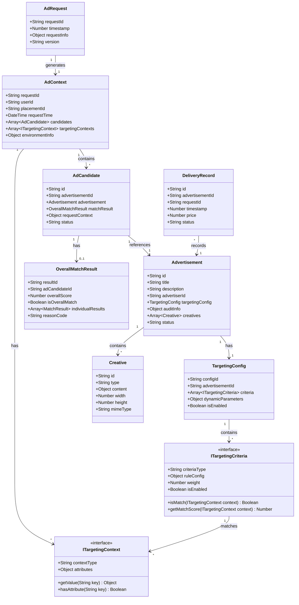

# 广告投放引擎数据模型设计

## 1. 核心数据模型

### 1.0 对象关系模型



### 1.1 广告请求模型 (AdRequest)

广告请求是用户访问媒体时触发的广告展示请求，包含基本的请求信息。

| 字段名      | 类型   | 必填 | 描述             | 示例值                                 | 取值范围/说明              |
| ----------- | ------ | ---- | ---------------- | -------------------------------------- | -------------------------- |
| requestId   | string | 是   | 请求唯一标识     | "550e8400-e29b-41d4-a716-446655440000" | UUID格式                   |
| timestamp   | number | 是   | 请求时间戳(毫秒) | 1612345678901                          | 当前时间前后5分钟内        |
| requestInfo | object | 是   | 请求基础信息     | -                                      | 包含用户、设备、媒体等信息 |
| version     | string | 是   | API版本号        | "1.0"                                  | 当前支持版本: 1.0          |

### 1.2 广告上下文模型 (AdContext)

广告上下文是广告引擎根据AdRequest和其他信息组成的完整请求上下文，包含候选广告集合和定向信息集合。

| 字段名            | 类型   | 必填 | 描述         | 示例值        | 取值范围/说明                 |
| ----------------- | ------ | ---- | ------------ | ------------- | ----------------------------- |
| requestId         | string | 是   | 请求标识     | "req123456"   | 关联的原始请求ID              |
| userId            | string | 否   | 用户标识     | "u123456"     | 平台用户唯一标识              |
| placementId       | string | 是   | 广告位标识   | "p123456"     | 媒体广告位唯一标识            |
| requestTime       | number | 是   | 请求时间     | 1612345678901 | 毫秒时间戳                    |
| candidates        | array  | 是   | 候选广告集合 | -             | AdCandidate对象数组           |
| targetingContexts | array  | 是   | 定向信息集合 | -             | ITargetingContext实现对象数组 |
| environmentInfo   | object | 是   | 环境信息     | -             | 包含时间、竞争情况等环境数据  |

### 1.3 候选广告模型 (AdCandidate)

候选广告是广告引擎在处理过程中对广告对象的包装，包含匹配结果和请求相关的临时信息。

| 字段名          | 类型   | 必填 | 描述           | 示例值     | 取值范围/说明                   |
| --------------- | ------ | ---- | -------------- | ---------- | ------------------------------- |
| id              | string | 是   | 候选广告标识   | "c123456"  | 唯一标识                        |
| advertisementId | string | 是   | 关联广告ID     | "ad123456" | 关联的Advertisement对象ID       |
| advertisement   | object | 是   | 广告对象引用   | -          | Advertisement对象               |
| matchResult     | object | 否   | 定向匹配结果   | -          | OverallMatchResult对象          |
| requestContext  | object | 是   | 请求上下文信息 | -          | 存储请求相关的临时数据          |
| status          | string | 是   | 候选状态       | "matched"  | created/matched/filtered/ranked |

### 1.4 广告模型 (Advertisement)

广告是广告主创建的投放内容，包含完整的广告信息和定向配置。

| 字段名          | 类型   | 必填 | 描述         | 示例值     | 取值范围/说明                        |
| --------------- | ------ | ---- | ------------ | ---------- | ------------------------------------ |
| id              | string | 是   | 广告ID       | "ad123456" | 广告唯一标识                         |
| title           | string | 是   | 广告标题     | "优质商品" | 广告展示标题                         |
| description     | string | 否   | 广告描述     | "详细描述" | 广告详细描述                         |
| advertiserId    | string | 是   | 广告主ID     | "adv123"   | 关联的广告主标识                     |
| targetingConfig | object | 是   | 定向配置     | -          | TargetingConfig对象                  |
| auditInfo       | object | 是   | 审核信息     | -          | 审核状态和相关信息                   |
| creatives       | array  | 是   | 创意素材集合 | -          | Creative对象数组                     |
| status          | string | 是   | 广告状态     | "active"   | draft/pending/approved/active/paused |

### 1.5 定向配置模型 (TargetingConfig)

定向配置是每个广告的投放定向设置，包含定向条件集合和动态参数。

| 字段名            | 类型    | 必填 | 描述         | 示例值     | 取值范围/说明                  |
| ----------------- | ------- | ---- | ------------ | ---------- | ------------------------------ |
| configId          | string  | 是   | 配置标识     | "tc123456" | 定向配置唯一标识               |
| advertisementId   | string  | 是   | 关联广告ID   | "ad123456" | 所属广告标识                   |
| criteria          | array   | 是   | 定向条件集合 | -          | ITargetingCriteria实现对象数组 |
| dynamicParameters | object  | 否   | 动态参数     | -          | 运行时优化参数                 |
| isEnabled         | boolean | 是   | 是否启用     | true       | 定向配置开关                   |

### 1.6 定向条件接口 (ITargetingCriteria)

定向条件是可扩展的定向判断逻辑，支持不同类型的定向策略。

| 方法/属性       | 类型     | 必填 | 描述         | 示例值 | 取值范围/说明          |
| --------------- | -------- | ---- | ------------ | ------ | ---------------------- |
| criteriaType    | string   | 是   | 条件类型     | "geo"  | geo/demo/device/time等 |
| ruleConfig      | object   | 是   | 规则配置     | -      | 具体定向规则配置       |
| weight          | number   | 是   | 权重         | 1.0    | 定向条件权重           |
| isEnabled       | boolean  | 是   | 是否启用     | true   | 条件开关               |
| isMatch()       | function | 是   | 匹配判断方法 | -      | 返回是否匹配           |
| getMatchScore() | function | 是   | 匹配评分方法 | -      | 返回匹配度分数(0-1)    |

### 1.7 定向上下文接口 (ITargetingContext)

定向上下文提供定向判断所需的环境信息，支持可扩展的上下文数据。

| 方法/属性      | 类型     | 必填 | 描述         | 示例值 | 取值范围/说明          |
| -------------- | -------- | ---- | ------------ | ------ | ---------------------- |
| contextType    | string   | 是   | 上下文类型   | "user" | user/device/geo/time等 |
| attributes     | object   | 是   | 属性集合     | -      | 上下文相关属性数据     |
| getValue()     | function | 是   | 获取属性值   | -      | 根据键获取属性值       |
| hasAttribute() | function | 是   | 判断属性存在 | -      | 判断是否包含指定属性   |

### 1.8 整体匹配结果模型 (OverallMatchResult)

整体匹配结果存储候选广告的定向匹配计算结果，用于过滤和排序决策。

| 字段名            | 类型    | 必填 | 描述         | 示例值          | 取值范围/说明            |
| ----------------- | ------- | ---- | ------------ | --------------- | ------------------------ |
| resultId          | string  | 是   | 结果标识     | "r123456"       | 匹配结果唯一标识         |
| adCandidateId     | string  | 是   | 候选广告ID   | "c123456"       | 关联的候选广告标识       |
| overallScore      | number  | 是   | 整体匹配度   | 0.85            | 0-1之间的匹配度分数      |
| isOverallMatch    | boolean | 是   | 是否整体匹配 | true            | 整体匹配判断结果         |
| individualResults | array   | 是   | 单项匹配结果 | -               | 各定向条件的匹配结果数组 |
| reasonCode        | string  | 是   | 匹配原因码   | "MATCH_SUCCESS" | 匹配或不匹配的原因说明   |

### 1.9 创意素材模型 (Creative)

创意素材是广告的展示内容，包含不同类型的广告素材信息。

| 字段名   | 类型   | 必填 | 描述     | 示例值       | 取值范围/说明              |
| -------- | ------ | ---- | -------- | ------------ | -------------------------- |
| id       | string | 是   | 素材ID   | "cr123456"   | 创意素材唯一标识           |
| type     | string | 是   | 素材类型 | "banner"     | banner/video/native        |
| content  | object | 是   | 素材内容 | -            | 根据类型包含不同的内容结构 |
| width    | number | 否   | 宽度     | 300          | 像素值，适用于图片和视频   |
| height   | number | 否   | 高度     | 250          | 像素值，适用于图片和视频   |
| mimeType | string | 否   | 媒体类型 | "image/jpeg" | MIME类型                   |

### 1.10 投放记录模型 (DeliveryRecord)

投放记录用于记录广告的实际投放情况和效果数据。

| 字段名          | 类型   | 必填 | 描述     | 示例值        | 取值范围/说明          |
| --------------- | ------ | ---- | -------- | ------------- | ---------------------- |
| id              | string | 是   | 记录ID   | "dr123456"    | 唯一标识               |
| advertisementId | string | 是   | 广告ID   | "ad123456"    | 关联的广告ID           |
| requestId       | string | 是   | 请求ID   | "req123456"   | 关联的请求ID           |
| timestamp       | number | 是   | 投放时间 | 1612345678901 | 毫秒时间戳             |
| price           | number | 是   | 结算价格 | 2.5           | 单位:元,精确到0.01     |
| status          | string | 是   | 投放状态 | "success"     | success/failed/partial |

## 2. 核心业务流程

### 2.1 广告投放流程


### 2.2 定向扩展机制


### 2.3 数据流转说明

1. **用户请求阶段**：
   - 用户访问媒体触发AdRequest
   - 广告引擎根据AdRequest创建AdContext
   - AdContext包含该次请求的所有ITargetingContext集合

2. **候选广告生成**：
   - 广告引擎生成AdCandidate集合
   - 每个AdCandidate引用一个Advertisement对象
   - Advertisement包含一个TargetingConfig配置

3. **定向匹配计算**：
   - TargetingConfig包含多个ITargetingCriteria实现
   - 每个ITargetingCriteria与AdContext中的ITargetingContext进行匹配
   - 生成OverallMatchResult存储匹配结果

4. **过滤和排序**：
   - 根据OverallMatchResult.isOverallMatch进行过滤
   - 根据OverallMatchResult.overallScore进行排序
   - 选择最佳候选广告进行投放

## 3. 扩展性设计

### 3.1 定向策略可扩展性

通过ITargetingCriteria和ITargetingContext接口设计，系统支持：

- **新增定向类型**：实现ITargetingCriteria接口即可添加新的定向逻辑
- **新增上下文信息**：实现ITargetingContext接口即可扩展上下文数据
- **灵活组合**：不同定向条件可以自由组合使用
- **动态配置**：定向规则可以通过配置动态调整

### 3.2 常见扩展场景

| 扩展类型   | 实现方式                     | 应用场景             |
| ---------- | ---------------------------- | -------------------- |
| 地理定向   | GeoTargetingCriteria         | 按地区投放广告       |
| 人群定向   | DemographicTargetingCriteria | 按年龄、性别等投放   |
| 行为定向   | BehaviorTargetingCriteria    | 按用户行为历史投放   |
| 兴趣定向   | InterestTargetingCriteria    | 按用户兴趣偏好投放   |
| 设备定向   | DeviceTargetingCriteria      | 按设备类型投放       |
| 时间定向   | TimeTargetingCriteria        | 按时间段投放         |
| 频次控制   | FrequencyTargetingCriteria   | 控制广告展示频次     |
| 竞价策略   | BiddingTargetingCriteria     | 动态竞价逻辑         |
| 媒体定向   | MediaTargetingCriteria       | 按媒体类型或质量投放 |
| 自定义定向 | CustomTargetingCriteria      | 客户特定的定向需求   |

## 4. 缓存数据结构

### 4.1 特征缓存结构

| 字段名 | 类型   | 必填 | 描述     | 示例值        | 取值范围/说明   |
| ------ | ------ | ---- | -------- | ------------- | --------------- |
| key    | string | 是   | 缓存键   | "f:u123456"   | 特征类型:ID     |
| type   | string | 是   | 特征类型 | "user"        | user/context/ad |
| value  | object | 是   | 特征数据 | -             | 特征具体内容    |
| expire | number | 是   | 过期时间 | 1612345678901 | 毫秒时间戳      |

### 4.2 索引设计

#### 请求索引

```sql
-- 广告投放记录索引
CREATE INDEX idx_delivery_ad ON delivery_record(advertisement_id, timestamp);
CREATE INDEX idx_delivery_req ON delivery_record(request_id, timestamp);

-- 特征匹配索引
CREATE INDEX idx_feature_user ON feature_match(user_id, type);
CREATE INDEX idx_feature_context ON feature_match(context_id, type);
```

#### 审核状态索引

```sql
-- 广告审核状态索引
CREATE INDEX idx_audit_status ON advertisement(audit.status, audit.lastmod);
CREATE INDEX idx_audit_advertiser ON advertisement(advertiser_id, audit.status);
```

### 4.3 对象缓存关系图


### 4.4 缓存策略

#### 缓存键设计

- 用户特征缓存键: `user:{userId}:feature`
- 上下文特征缓存键: `context:{contextId}:feature`
- 广告特征缓存键: `ad:{adId}:feature`
- 审核结果缓存键: `audit:{adId}:result`

#### 缓存生命周期

- 用户特征: 24小时
- 上下文特征: 1小时
- 广告特征: 6小时
- 审核结果: 1小时

#### 缓存更新策略

1. 用户特征更新
   - 登录触发更新
   - 行为变化触发更新
   - 定时任务批量更新

2. 上下文特征更新
   - 请求时实时计算
   - 相似场景共享
   - 热点场景预加载

3. 广告特征更新
   - 创建时生成缓存
   - 修改时强制更新
   - 审核状态变更时更新

4. 审核结果更新
   - 审核完成时更新
   - 定时任务检查过期
   - 状态变更时更新