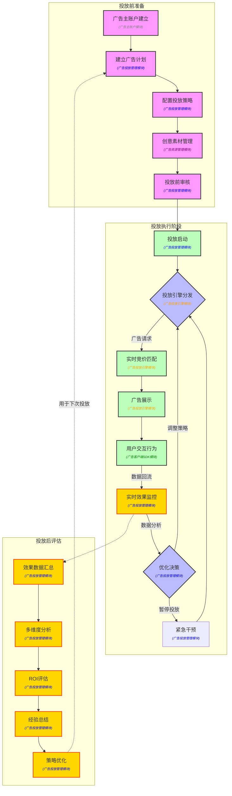
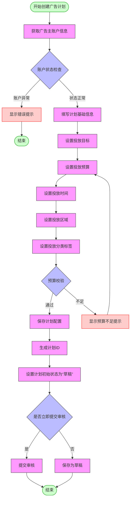
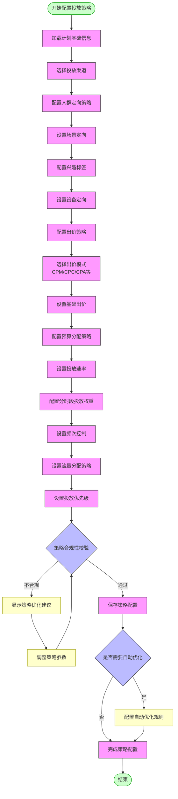
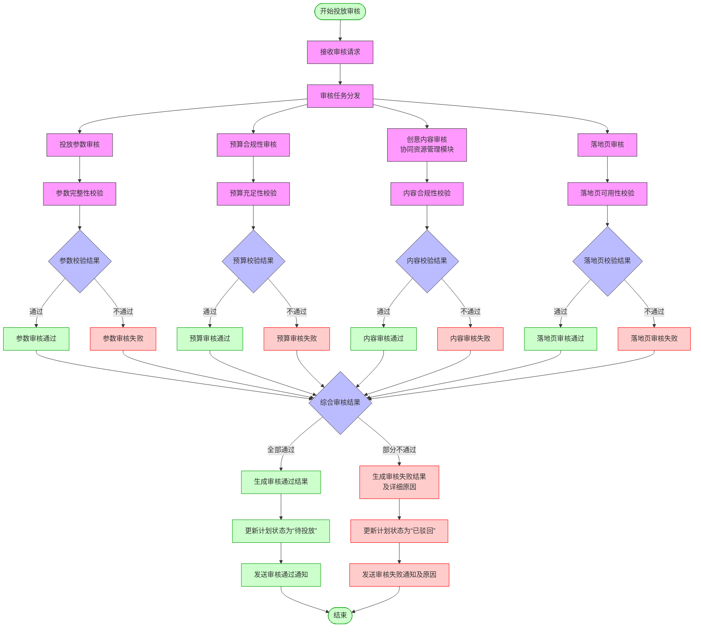
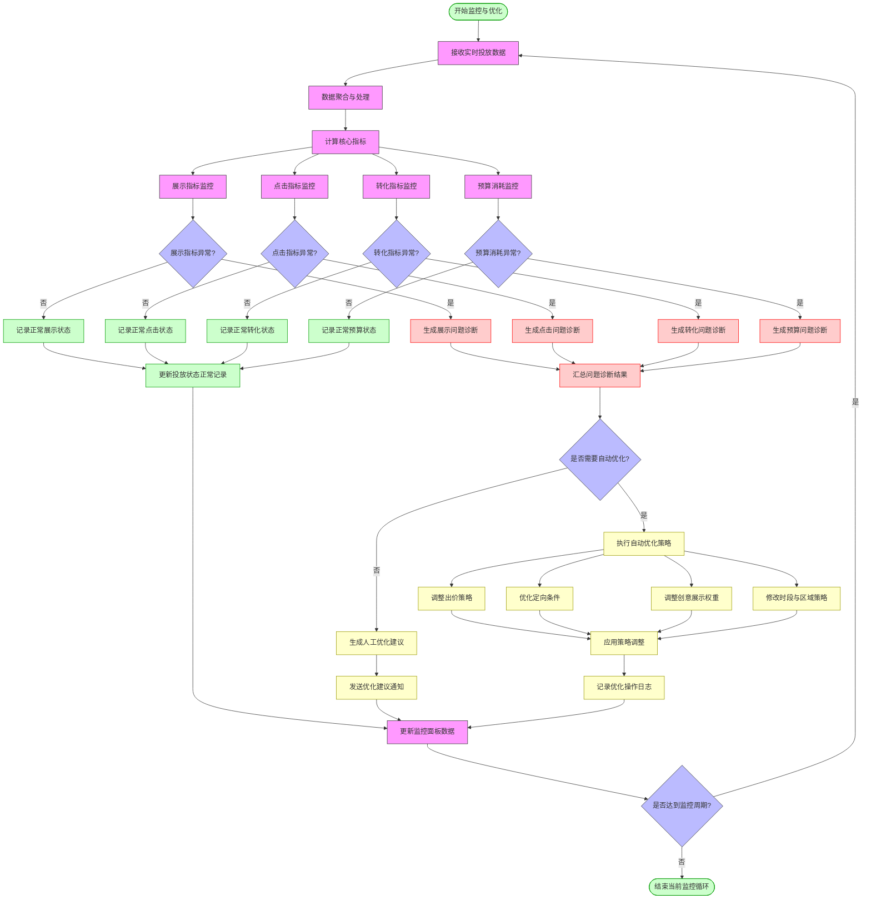
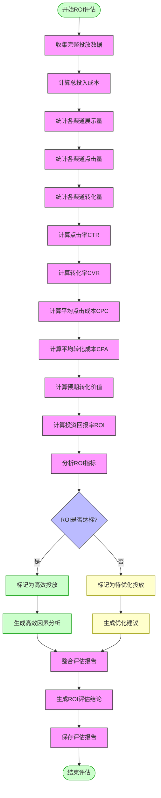

# 广告投放业务流程

## 1. 总体业务流程图

## 2. 广告投放管理模块子流程图

### 2.1 广告计划创建子流程

### 2.2 投放策略配置子流程

### 2.3 投放前审核子流程

### 2.4 投放监控与优化子流程

### 2.5 投放后ROI评估子流程

## 3. 业务流程详细说明

### 2.1 投放前准备阶段

#### 2.1.1 广告主账户建立
- **执行角色**：广告主、平台客服
- **核心任务**：
  * 广告主注册账户并完成实名认证
  * 提交相关资质材料（营业执照、ICP备案等）
  * 账户审核与授权
  * 充值预算金额
  * 设置账户级别的基础信息
- **输出物**：已认证的广告主账户
- **关键指标**：账户建立时长、资质审核通过率
- **所属模块**：广告主账户管理模块

#### 2.1.2 建立广告计划
- **执行角色**：广告主、投放专员
- **核心任务**：
  * 创建广告计划并设定投放目标
  * 设置计划总预算与投放周期
  * 选择投放地域范围
  * 指定目标受众群体
  * 关联业务标签与分类
  * 选择投放渠道与场景
- **输出物**：广告计划配置方案
- **关键指标**：计划创建时长、配置完整度
- **所属模块**：广告投放管理模块

#### 2.1.3 配置投放策略
- **执行角色**：投放专员、投放策略师
- **核心任务**：
  * 设置人群定向条件
  * 配置投放时段与权重
  * 设定出价策略（CPM/CPC/CPA等）
  * 制定预算分配策略
  * 设置频次控制规则
  * 配置流量分配策略
  * 设定投放优先级
- **输出物**：投放策略配置方案
- **关键指标**：策略复杂度、相似策略复用率
- **所属模块**：广告投放管理模块

#### 2.1.4 创意素材管理
- **执行角色**：创意设计师、投放专员
- **核心任务**：
  * 上传创意素材（图片、视频等）
  * 编辑广告文案
  * 设置创意素材与资源的关联关系
  * 配置素材展示规则
  * 设置落地页链接
  * 关联监测代码
  * 设置A/B测试变量
- **输出物**：待投放创意素材包
- **关键指标**：创意审核通过率、创意加载性能指标
- **所属模块**：广告资源管理模块

#### 2.1.5 投放前审核
- **执行角色**：审核专员、系统自动化审核
- **核心任务**：
  * 创意内容审核（合规性、品牌安全）
  * 投放参数校验（规格、大小、格式）
  * 落地页内容审核
  * 技术测试（响应时间、兼容性）
  * 出价与预算合理性评估
  * 关联监测代码验证
  * 最终投放方案确认
- **输出物**：审核报告与投放就绪状态
- **关键决策点**：审核通过或驳回
- **关键指标**：审核时长、一次通过率
- **所属模块**：广告投放管理模块（与资源管理模块协同）

### 2.2 投放执行阶段

#### 2.2.1 投放启动
- **执行角色**：投放专员、系统自动化
- **核心任务**：
  * 时间条件检查（是否达到开始时间）
  * 预算状态检查（是否充足）
  * 投放状态切换（待投放→投放中）
  * 投放初始参数设定
  * 发送投放启动通知
  * 记录投放开始时间戳
- **输出物**：活跃投放任务
- **关键指标**：启动成功率、启动延迟时间
- **所属模块**：广告投放管理模块

#### 2.2.2 投放引擎分发
- **执行角色**：投放引擎、流量分配系统
- **核心任务**：
  * 接收广告请求
  * 解析请求上下文（设备、位置、时间等）
  * 初步筛选符合条件的广告
  * 分配流量（核心流量、尾部流量）
  * 执行投放控制策略（频次、速率）
  * 路由请求至合适的竞价环节
- **输出物**：待竞价广告请求
- **关键指标**：引擎处理延迟、请求分发成功率
- **所属模块**：广告投放引擎模块

#### 2.2.3 实时竞价匹配
- **执行角色**：竞价引擎、预算控制系统
- **核心任务**：
  * 执行广告筛选规则
  * 计算广告相关性得分
  * 应用出价策略与调节因子
  * 执行竞价排序算法
  * 选择胜出广告
  * 记录竞价日志
  * 预算扣减与控制
- **输出物**：胜出广告及展示参数
- **关键指标**：竞价延迟、竞价成功率
- **所属模块**：广告投放引擎模块

#### 2.2.4 广告展示
- **执行角色**：广告投放SDK、前端渲染系统
- **核心任务**：
  * 接收广告投放指令
  * 准备创意素材
  * 执行前置展示校验
  * 渲染广告内容
  * 记录曝光事件
  * 执行展示监测代码
  * 处理展示异常情况
- **输出物**：用户可见广告
- **关键指标**：广告渲染时间、展示成功率
- **所属模块**：广告投放引擎模块

#### 2.2.5 用户交互行为
- **执行角色**：终端用户、行为采集系统
- **核心任务**：
  * 记录用户曝光事件
  * 采集用户点击行为
  * 跟踪转化路径
  * 收集互动数据（悬停、滑动等）
  * 记录会话时长
  * 采集异常行为（关闭、投诉等）
  * 行为数据实时回传
- **输出物**：用户行为数据流
- **关键指标**：点击率(CTR)、转化率(CVR)
- **所属模块**：广告客户端SDK模块

#### 2.2.6 实时效果监控
- **执行角色**：监控系统、投放专员
- **核心任务**：
  * 实时数据聚合与计算
  * 核心指标监控（展示、点击、转化）
  * 预算消耗监控
  * 投放进度跟踪
  * 异常情况检测与告警
  * 指标偏离预警
  * 竞争态势实时分析
- **输出物**：实时监控报表与告警
- **关键指标**：监控延迟、告警准确率
- **所属模块**：广告投放管理模块

#### 2.2.7 优化决策
- **执行角色**：优化算法、投放策略师
- **核心任务**：
  * 分析实时效果数据
  * 识别效果问题点
  * 制定优化策略建议
  * 执行自动优化规则
  * 调整出价策略
  * 优化定向条件
  * 调整创意展示权重
  * 修改投放时段与区域
- **输出物**：优化决策与执行指令
- **关键决策点**：继续、调整或中止投放
- **关键指标**：优化决策成功率、响应时间
- **所属模块**：广告投放管理模块

#### 2.2.8 紧急干预
- **执行角色**：投放专员、风控系统
- **核心任务**：
  * 识别需要紧急干预的情况
  * 执行紧急暂停操作
  * 预算紧急调整
  * 创意紧急替换
  * 投放参数紧急修改
  * 记录干预操作日志
  * 发送干预通知
- **输出物**：干预操作记录
- **关键指标**：干预响应时间、干预成功率
- **所属模块**：广告投放管理模块

### 2.3 投放后评估阶段

#### 2.3.1 效果数据汇总
- **执行角色**：数据分析师、报表系统
- **核心任务**：
  * 收集完整投放周期数据
  * 数据清洗与校验
  * 跨渠道数据整合
  * 构建完整数据集
  * 计算关键效果指标
  * 准备多维度分析数据
  * 生成基础效果报表
- **输出物**：完整投放数据集与基础报表
- **关键指标**：数据完整性、汇总及时性
- **所属模块**：广告投放管理模块

#### 2.3.2 多维度分析
- **执行角色**：数据分析师、BI系统
- **核心任务**：
  * 人群效果分析
  * 时段效果分析
  * 地域效果分析
  * 创意效果分析
  * 渠道效果分析
  * 出价策略效果分析
  * 竞争对比分析
  * A/B测试结果分析
- **输出物**：多维度分析报告
- **关键指标**：分析深度、洞察价值
- **所属模块**：广告投放管理模块

#### 2.3.3 ROI评估
- **执行角色**：投放策略师、财务分析师
- **核心任务**：
  * 计算总投入成本
  * 评估广告产出价值
  * 计算投资回报率
  * 分析成本效益比
  * 对比预期与实际效果
  * 评估预算执行效率
  * 生成ROI分析报告
- **输出物**：ROI评估报告
- **关键指标**：ROI、成本效益比
- **所属模块**：广告投放管理模块

#### 2.3.4 经验总结
- **执行角色**：投放策略师、项目经理
- **核心任务**：
  * 总结投放成功因素
  * 分析失败原因
  * 提取可复用经验
  * 记录问题与解决方案
  * 生成知识库条目
  * 组织经验分享会
  * 更新最佳实践指南
- **输出物**：经验总结报告与知识库更新
- **关键指标**：经验复用率、问题解决效率
- **所属模块**：广告投放管理模块

#### 2.3.5 策略优化
- **执行角色**：投放策略师、产品经理
- **核心任务**：
  * 制定长期投放策略
  * 设计优化后的投放方案
  * 更新定向策略库
  * 完善出价模型
  * 优化创意策略
  * 调整渠道配置
  * 设计下一轮A/B测试
  * 准备优化后的投放计划
- **输出物**：优化后的投放策略方案
- **关键指标**：方案改进幅度、预期效果提升
- **所属模块**：广告投放管理模块

## 3. 投放业务关键节点与决策点

### 3.1 关键决策节点
1. **投放审核决策点**：决定广告是否符合投放标准
2. **预算分配决策点**：决定如何在不同渠道、时段、人群间分配预算
3. **实时优化决策点**：根据实时数据决定是否需要调整投放策略
4. **紧急干预决策点**：决定何时需要人工干预投放过程
5. **投放终止决策点**：决定何时结束投放（预算耗尽、时间到期、效果不佳等）

### 3.2 关键流程衔接点
1. **策略到执行衔接点**：投放策略转化为执行指令的过程
2. **数据到决策衔接点**：如何基于数据做出优化决策
3. **评估到规划衔接点**：如何将投放后评估结果用于下一轮规划
4. **异常到恢复衔接点**：发生异常后如何恢复正常投放流程
5. **手动到自动衔接点**：人工干预后如何恢复到自动化流程

## 4. 投放流程优化方向

### 4.1 流程自动化优化
- 建立自动化审核机制，减少人工审核时间
- 实现智能化预算分配，动态调整预算分配比例
- 开发自动化异常处理机制，降低人工干预频率
- 构建自优化投放系统，根据实时数据自动调整策略

### 4.2 数据驱动优化
- 增强实时数据采集与处理能力
- 构建多维度分析模型，提高数据洞察能力
- 应用机器学习算法预测投放效果
- 建立闭环优化机制，实现持续迭代改进

### 4.3 协同效率优化
- 优化跨团队协作流程，减少沟通成本
- 建立规范化的投放流程模板，提高执行效率
- 开发知识共享平台，促进经验复用
- 实现工具链集成，减少系统切换成本