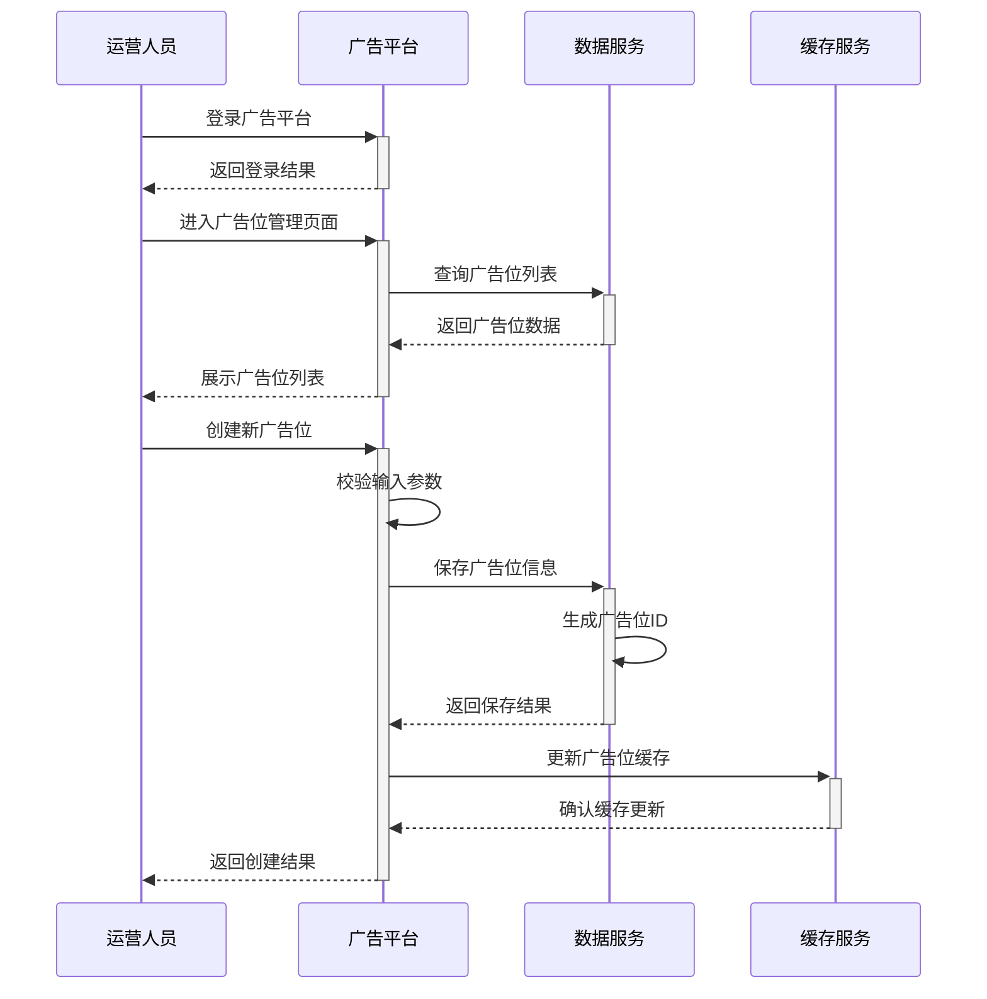
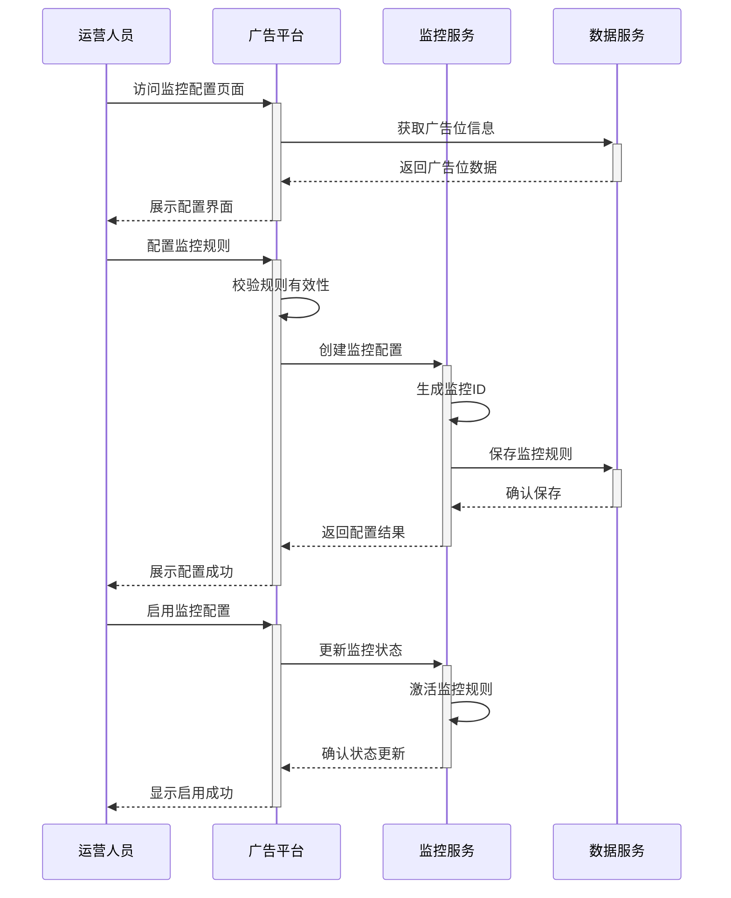
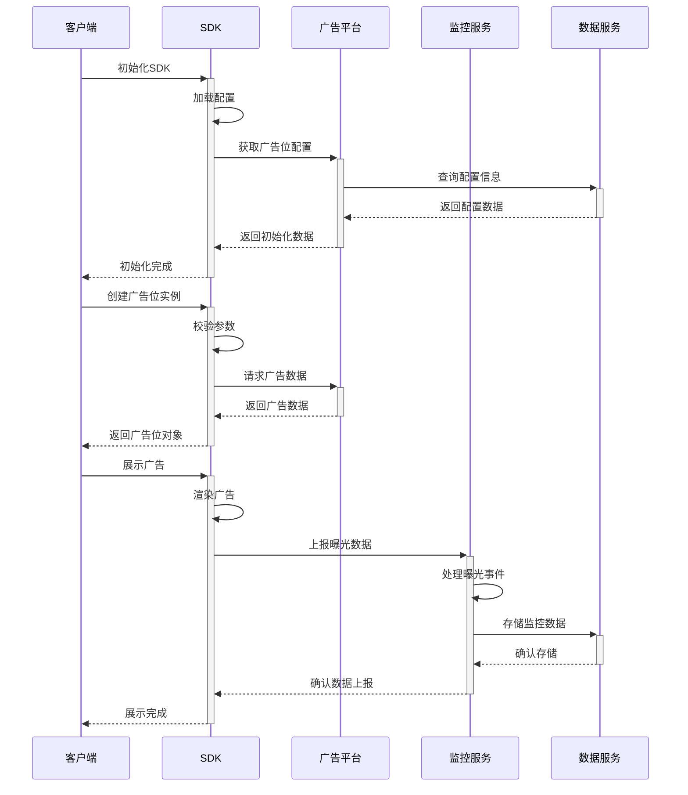
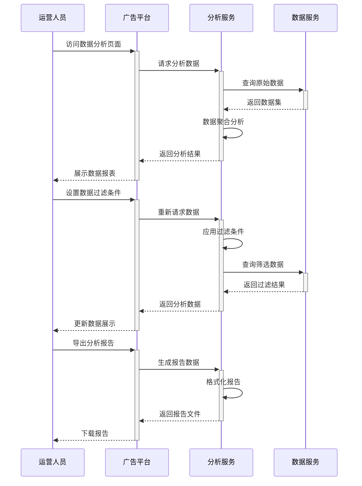
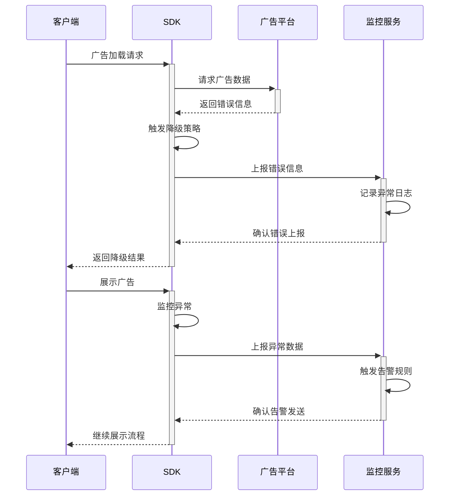

# 广告资源管理序列设计

## 1. 广告位创建与配置序列

### 1.1 时序步骤说明

1. **登录认证流程**
   - 运营人员输入账号密码登录
   - 平台验证身份并返回登录结果
   - 建立会话状态

2. **广告位管理页面访问**
   - 加载广告位列表数据
   - 支持按条件筛选和排序
   - 展示广告位状态和基本信息

3. **广告位创建流程**
   - 校验必填参数完整性
   - 生成全局唯一广告位ID
   - 保存广告位基础配置
   - 更新缓存服务数据

## 2. 广告位监控配置序列

### 2.1 时序步骤说明

1. **监控配置页面访问**
   - 获取广告位详细信息
   - 加载现有监控配置
   - 展示配置界面

2. **监控规则配置**
   - 配置曝光规则
   - 配置点击规则
   - 配置转化规则
   - 保存监控配置

3. **监控启用流程**
   - 更新监控状态
   - 激活监控规则
   - 确认规则生效

## 3. SDK集成与验证序列

### 3.1 时序步骤说明

1. **SDK初始化流程**
   - 加载SDK配置信息
   - 获取广告位配置
   - 完成SDK初始化

2. **广告位创建流程**
   - 校验广告位参数
   - 请求广告数据
   - 创建广告位实例

3. **广告展示流程**
   - 渲染广告内容
   - 触发曝光事件
   - 上报监控数据

## 4. 广告位数据分析序列

### 4.1 时序步骤说明

1. **数据分析页面访问**
   - 加载分析数据
   - 执行数据聚合
   - 展示数据报表

2. **数据过滤操作**
   - 应用过滤条件
   - 重新查询数据
   - 更新数据展示

3. **报告导出流程**
   - 生成分析报告
   - 格式化报告数据
   - 提供报告下载

## 5. 异常处理序列

### 5.1 时序步骤说明

1. **错误处理流程**
   - 检测错误类型
   - 执行降级策略
   - 上报错误信息

2. **异常监控流程**
   - 监控异常情况
   - 触发告警规则
   - 记录异常日志