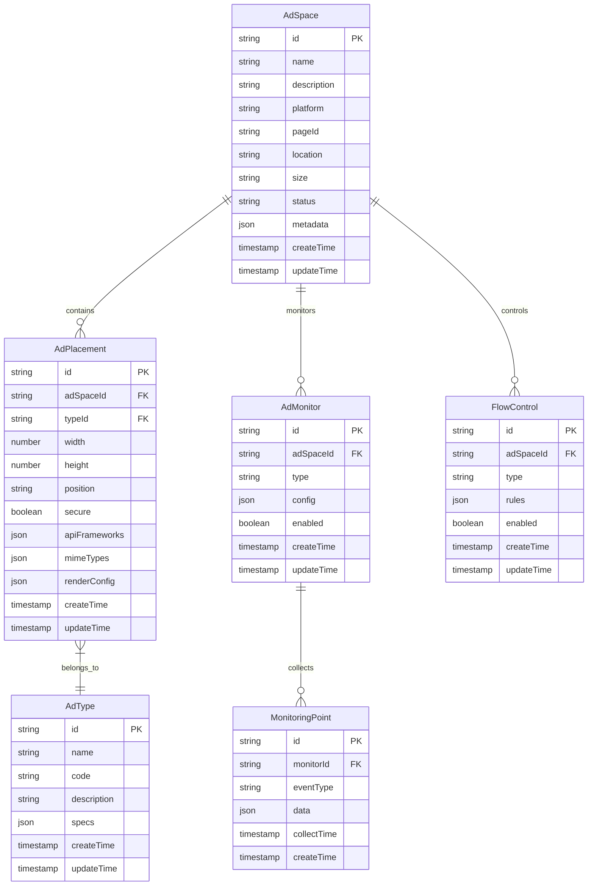

# 广告资源管理数据结构设计

## 1. 整体数据模型

### 1.1 核心实体关系图

## 2. 核心表结构设计

### 2.1 广告位表(ad_space)

存储广告位基本信息。

| 字段名      | 类型      | 必填 | 描述                           | 示例值              |
| ----------- | --------- | ---- | ------------------------------ | ------------------- |
| id          | string    | 是   | 广告位唯一标识                 | ios_home_banner_001 |
| name        | string    | 是   | 广告位名称                     | 首页顶部Banner      |
| description | string    | 否   | 广告位描述                     | 首页顶部广告位      |
| platform    | string    | 是   | 平台标识(ios/android/h5/dooh)  | ios                 |
| page_id     | string    | 是   | 页面标识                       | home                |
| location    | string    | 是   | 位置标识(banner/float/popup等) | banner              |
| size        | string    | 是   | 尺寸规格(640x100/300x250等)    | 640x100             |
| status      | string    | 是   | 状态(active/inactive)          | active              |
| metadata    | json      | 否   | 扩展元数据                     | {"zIndex": 100}     |
| create_time | timestamp | 是   | 创建时间                       | 2023-12-20 10:00:00 |
| update_time | timestamp | 是   | 更新时间                       | 2023-12-20 10:00:00 |

索引设计:
- PRIMARY KEY (id)
- INDEX idx_platform_page (platform, page_id)
- INDEX idx_status (status)

### 2.2 广告位配置表(ad_placement)

存储广告位展示配置信息。

| 字段名         | 类型      | 必填 | 描述                                  | 示例值              |
| -------------- | --------- | ---- | ------------------------------------- | ------------------- |
| id             | string    | 是   | 配置唯一标识                          | plc_001             |
| ad_space_id    | string    | 是   | 关联的广告位ID                        | ios_home_banner_001 |
| type_id        | string    | 是   | 广告类型ID                            | banner_type_001     |
| width          | int       | 是   | 宽度(像素)                            | 640                 |
| height         | int       | 是   | 高度(像素)                            | 100                 |
| position       | string    | 是   | 展示位置(1=顶部/3=中部/4=底部/7=全屏) | 1                   |
| secure         | boolean   | 是   | 是否要求HTTPS                         | true                |
| api_frameworks | json      | 否   | 支持的API框架列表                     | [3,5,6]             |
| mime_types     | json      | 否   | 支持的MIME类型列表                    | ["image/jpeg"]      |
| render_config  | json      | 否   | 渲染配置参数                          | {"animation": true} |
| create_time    | timestamp | 是   | 创建时间                              | 2023-12-20 10:00:00 |
| update_time    | timestamp | 是   | 更新时间                              | 2023-12-20 10:00:00 |

索引设计:
- PRIMARY KEY (id)
- INDEX idx_ad_space (ad_space_id)
- INDEX idx_type (type_id)

### 2.3 广告类型表(ad_type)

存储广告类型定义。

| 字段名      | 类型      | 必填 | 描述         | 示例值                |
| ----------- | --------- | ---- | ------------ | --------------------- |
| id          | string    | 是   | 类型唯一标识 | banner_type_001       |
| name        | string    | 是   | 类型名称     | Banner广告            |
| code        | string    | 是   | 类型编码     | banner                |
| description | string    | 否   | 类型描述     | 横幅展示广告          |
| specs       | json      | 否   | 类型规格定义 | {"sizes":["640x100"]} |
| create_time | timestamp | 是   | 创建时间     | 2023-12-20 10:00:00   |
| update_time | timestamp | 是   | 更新时间     | 2023-12-20 10:00:00   |

索引设计:
- PRIMARY KEY (id)
- UNIQUE INDEX idx_code (code)

### 2.4 监控配置表(ad_monitor)

存储广告位监控配置。

| 字段名      | 类型      | 必填 | 描述                                 | 示例值              |
| ----------- | --------- | ---- | ------------------------------------ | ------------------- |
| id          | string    | 是   | 监控配置唯一标识                     | mon_001             |
| ad_space_id | string    | 是   | 关联的广告位ID                       | ios_home_banner_001 |
| type        | string    | 是   | 监控类型(performance/user/technical) | performance         |
| config      | json      | 是   | 监控配置参数                         | {"interval": 60}    |
| enabled     | boolean   | 是   | 是否启用                             | true                |
| create_time | timestamp | 是   | 创建时间                             | 2023-12-20 10:00:00 |
| update_time | timestamp | 是   | 更新时间                             | 2023-12-20 10:00:00 |

索引设计:
- PRIMARY KEY (id)
- INDEX idx_ad_space_type (ad_space_id, type)
- INDEX idx_enabled (enabled)

### 2.5 监控数据表(monitoring_point)

存储监控采集数据。

| 字段名       | 类型      | 必填 | 描述                         | 示例值              |
| ------------ | --------- | ---- | ---------------------------- | ------------------- |
| id           | string    | 是   | 数据点唯一标识               | point_001           |
| monitor_id   | string    | 是   | 关联的监控配置ID             | mon_001             |
| event_type   | string    | 是   | 事件类型(load/ready/error等) | load                |
| data         | json      | 是   | 采集的数据                   | {"time": 100}       |
| collect_time | timestamp | 是   | 采集时间                     | 2023-12-20 10:00:00 |
| create_time  | timestamp | 是   | 创建时间                     | 2023-12-20 10:00:00 |

索引设计:
- PRIMARY KEY (id)
- INDEX idx_monitor_time (monitor_id, collect_time)
- INDEX idx_event_type (event_type)

### 2.6 流量控制表(flow_control)

存储广告位流量控制规则。

| 字段名      | 类型      | 必填 | 描述                                 | 示例值              |
| ----------- | --------- | ---- | ------------------------------------ | ------------------- |
| id          | string    | 是   | 规则唯一标识                         | rule_001            |
| ad_space_id | string    | 是   | 关联的广告位ID                       | ios_home_banner_001 |
| type        | string    | 是   | 控制类型(capacity/priority/strategy) | capacity            |
| rules       | json      | 是   | 控制规则定义                         | {"max": 3}          |
| enabled     | boolean   | 是   | 是否启用                             | true                |
| create_time | timestamp | 是   | 创建时间                             | 2023-12-20 10:00:00 |
| update_time | timestamp | 是   | 更新时间                             | 2023-12-20 10:00:00 |

索引设计:
- PRIMARY KEY (id)
- INDEX idx_ad_space_type (ad_space_id, type)
- INDEX idx_enabled (enabled)

## 3. 数据存储建议

### 3.1 分表策略

1. 按时间分表的表
- monitoring_point: 按月分表

2. 按ID范围分表的表
- ad_space: 按ID范围分表(适用于大规模广告位场景)

### 3.2 缓存策略

1. 需要缓存的数据
- ad_space: 广告位基础信息
- ad_placement: 广告位配置信息
- flow_control: 流量控制规则

2. 缓存更新策略
- 定时同步: 每5分钟同步一次配置数据
- 实时推送: 配置变更时推送更新
- 异步加载: 首次访问时加载并缓存

3. 缓存粒度
- 按广告位ID缓存
- 按平台+页面组合缓存
- 按控制规则类型缓存