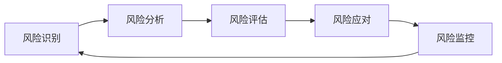

# Lorn.ADSP 风险管理计划

## 文档说明

本文档制定了Lorn.ADSP开源广告平台项目的全面风险管理策略，识别潜在风险、评估风险影响、制定应对措施，确保项目顺利推进和成功交付。

## 风险管理框架

### 风险管理原则

1. **主动识别**：前瞻性识别潜在风险，避免被动应对
2. **量化评估**：客观评估风险概率和影响程度
3. **分级管理**：根据风险等级制定不同的管理策略
4. **持续监控**：动态跟踪风险状态变化
5. **快速响应**：建立风险应急响应机制

### 风险分类体系

- **技术风险**：技术选型、架构设计、性能等
- **业务风险**：需求变更、市场竞争、用户接受度等
- **项目风险**：进度延期、资源不足、团队变动等
- **外部风险**：法规变化、第三方依赖、市场环境等
- **运营风险**：安全漏洞、数据丢失、系统故障等

### 风险等级定义

| 风险等级   | 概率范围 | 影响程度         | 应对策略                       |
| ---------- | -------- | ---------------- | ------------------------------ |
| **高风险** | >50%     | 严重影响项目成功 | 立即制定详细缓解计划，每日监控 |
| **中风险** | 20-50%   | 明显影响项目进度 | 制定应对方案，每周评估         |
| **低风险** | <20%     | 轻微影响或可控   | 定期监控，准备应急方案         |

---

## 风险识别与评估

### 技术风险

#### TR-001: 性能不达标风险
**风险描述**：广告投放引擎无法达到预期的性能指标（响应时间<50ms，支持100万QPS）

**概率评估**：中等 (30%)  
**影响评估**：高  
**风险等级**：中风险

**影响分析**：
- 无法满足实时广告投放需求
- 影响用户体验和广告主满意度
- 可能导致商业化目标无法实现

**应对策略**：
- **预防措施**：
  - 在架构设计阶段进行性能建模
  - 建立性能基准测试
  - 采用经过验证的高性能技术栈
- **缓解措施**：
  - 分阶段性能优化
  - 引入专业性能调优团队
  - 考虑架构重构方案
- **应急计划**：
  - 降级到较低性能目标
  - 分批次上线减少并发压力

**监控指标**：
- 响应时间P95、P99
- QPS吞吐量
- 错误率
- 资源利用率

#### TR-002: 技术选型不当风险
**风险描述**：选择的技术栈不能满足长期发展需求或存在技术债务

**概率评估**：低等 (15%)  
**影响评估**：中等  
**风险等级**：低风险

**影响分析**：
- 开发效率降低
- 维护成本增加
- 可能需要技术重构

**应对策略**：
- **预防措施**：
  - 充分的技术调研和POC验证
  - 选择成熟稳定的技术
  - 建立技术决策评审机制
- **缓解措施**：
  - 渐进式技术升级
  - 建立技术适配层
  - 持续技术债务管理

#### TR-003: 第三方依赖风险
**风险描述**：依赖的第三方服务或组件出现问题影响系统稳定性

**概率评估**：中等 (25%)  
**影响评估**：中等  
**风险等级**：中风险

**影响分析**：
- 系统功能不可用
- 数据同步异常
- 用户体验受影响

**应对策略**：
- **预防措施**：
  - 选择可靠的第三方服务商
  - 建立多供应商备选方案
  - 实现关键功能的本地化备份
- **缓解措施**：
  - 实现服务熔断和降级
  - 建立监控和告警机制
  - 制定快速切换方案

### 业务风险

#### BR-001: 需求频繁变更风险
**风险描述**：业务需求变更频繁，影响开发计划和项目进度

**概率评估**：高等 (60%)  
**影响评估**：中等  
**风险等级**：高风险

**影响分析**：
- 开发计划被打乱
- 技术债务累积
- 团队士气受影响
- 项目延期交付

**应对策略**：
- **预防措施**：
  - 充分的前期需求调研
  - 建立需求变更管理流程
  - 采用敏捷开发方法增强适应性
  - 与业务方建立定期沟通机制
- **缓解措施**：
  - 需求变更影响评估
  - 优先级重新排序
  - 增加开发资源投入
  - 采用MVP方法快速验证

**监控指标**：
- 需求变更频率
- 变更影响评估结果
- Sprint计划完成率
- 团队满意度

#### BR-002: 市场竞争加剧风险
**风险描述**：竞争对手推出类似产品，影响市场定位和用户获取

**概率评估**：中等 (40%)  
**影响评估**：中等  
**风险等级**：中风险

**影响分析**：
- 市场份额被抢占
- 产品差异化优势减弱
- 商业化目标难以实现

**应对策略**：
- **预防措施**：
  - 持续竞品分析和监控
  - 强化产品差异化特色
  - 加快产品迭代速度
- **缓解措施**：
  - 调整产品策略
  - 加强营销推广
  - 寻找细分市场机会

#### BR-003: 法规合规风险
**风险描述**：广告行业法规变化影响产品合规性

**概率评估**：中等 (30%)  
**影响评估**：高  
**风险等级**：中风险

**影响分析**：
- 产品无法合规上线
- 需要重大功能调整
- 市场准入受限

**应对策略**：
- **预防措施**：
  - 持续关注行业法规动态
  - 建立法务合规团队
  - 设计灵活的合规架构
- **缓解措施**：
  - 快速合规功能开发
  - 寻求法律专业支持
  - 调整市场策略

### 项目风险

#### PR-001: 关键人员流失风险
**风险描述**：核心开发人员或技术专家离职影响项目进度

**概率评估**：中等 (35%)  
**影响评估**：高  
**风险等级**：中风险

**影响分析**：
- 项目进度延期
- 技术知识流失
- 团队士气受影响
- 重新招聘和培训成本

**应对策略**：
- **预防措施**：
  - 建立有竞争力的薪酬体系
  - 提供良好的职业发展机会
  - 营造积极的团队文化
  - 实施知识管理制度
- **缓解措施**：
  - 快速招聘替代人员
  - 内部人员技能提升
  - 外部咨询支持
  - 调整项目计划

**监控指标**：
- 团队满意度调查
- 员工离职率
- 知识文档完整度
- 代码复杂度和可维护性

#### PR-002: 资源不足风险
**风险描述**：开发资源、预算或时间不足影响项目交付

**概率评估**：中等 (40%)  
**影响评估**：中等  
**风险等级**：中风险

**影响分析**：
- 项目范围缩减
- 质量标准降低
- 交付时间延期

**应对策略**：
- **预防措施**：
  - 详细的项目计划和资源评估
  - 建立资源缓冲池
  - 多渠道资源获取方案
- **缓解措施**：
  - 优先级重新排序
  - 外包部分工作
  - 寻求额外资源支持

#### PR-003: 沟通协调风险
**风险描述**：团队沟通不畅、协调困难影响开发效率

**概率评估**：中等 (30%)  
**影响评估**：中等  
**风险等级**：中风险

**影响分析**：
- 重复工作和返工
- 集成困难
- 团队冲突

**应对策略**：
- **预防措施**：
  - 建立清晰的沟通机制
  - 定期团队会议和同步
  - 使用协作工具
  - 明确角色和职责
- **缓解措施**：
  - 加强项目管理
  - 团队建设活动
  - 引入外部协调支持

### 运营风险

#### OR-001: 数据安全风险
**风险描述**：用户数据泄露或系统被恶意攻击

**概率评估**：低等 (10%)  
**影响评估**：极高  
**风险等级**：中风险

**影响分析**：
- 用户信任度损失
- 法律法规风险
- 经济损失
- 品牌声誉受损

**应对策略**：
- **预防措施**：
  - 实施全面的安全策略
  - 定期安全审计和渗透测试
  - 员工安全培训
  - 数据加密和访问控制
- **缓解措施**：
  - 安全事件应急响应计划
  - 数据备份和恢复机制
  - 法律合规支持
  - 公关危机处理

#### OR-002: 系统故障风险
**风险描述**：系统出现重大故障影响服务可用性

**概率评估**：中等 (25%)  
**影响评估**：高  
**风险等级**：中风险

**影响分析**：
- 服务中断
- 收入损失
- 用户体验受影响
- SLA违约

**应对策略**：
- **预防措施**：
  - 高可用架构设计
  - 完善的监控和告警
  - 定期容灾演练
  - 自动化运维
- **缓解措施**：
  - 快速故障定位和修复
  - 服务降级和熔断
  - 多机房容灾切换
  - 用户沟通和补偿

---

## 风险监控与控制

### 风险监控机制

#### 定期风险评估
- **频率**：每月进行一次全面风险评估
- **参与者**：项目经理、技术负责人、产品经理
- **输出**：风险评估报告和应对计划更新

#### 日常风险监控
- **每日站会**：关注当日风险变化
- **每周例会**：评估风险应对措施执行情况
- **Sprint回顾**：总结风险管理经验教训

#### 风险指标仪表板
建立风险监控仪表板，实时跟踪关键风险指标：

| 风险类别 | 关键指标                   | 监控频率 | 预警阈值       |
| -------- | -------------------------- | -------- | -------------- |
| 技术风险 | 系统性能指标、代码质量指标 | 实时     | 响应时间>100ms |
| 项目风险 | 进度完成率、缺陷密度       | 每日     | 完成率<80%     |
| 人员风险 | 团队满意度、离职率         | 每月     | 满意度<3.5分   |
| 质量风险 | 测试覆盖率、bug数量        | 每周     | 覆盖率<70%     |

### 风险应对策略

#### 风险避免 (Avoid)
- 通过改变项目计划或方法来完全消除风险
- 适用于高影响、可控制的风险

#### 风险缓解 (Mitigate)
- 降低风险发生的概率或影响程度
- 最常用的风险应对策略

#### 风险转移 (Transfer)
- 将风险转移给第三方承担
- 如购买保险、外包等

#### 风险接受 (Accept)
- 承认风险存在但不采取主动措施
- 适用于低影响、低概率的风险

### 应急响应机制

#### 危机响应团队
- **危机指挥官**：项目总负责人
- **技术响应**：技术架构师、运维负责人
- **业务响应**：产品经理、业务负责人
- **对外沟通**：公关负责人、客户成功经理

#### 响应流程
1. **风险识别** (0-15分钟)
   - 风险事件确认
   - 影响范围评估
   - 紧急程度判断

2. **应急响应** (15分钟-2小时)
   - 启动应急预案
   - 资源快速调配
   - 临时解决方案

3. **问题解决** (2小时-24小时)
   - 根本原因分析
   - 永久解决方案
   - 系统修复验证

4. **事后总结** (24小时-1周)
   - 事件分析报告
   - 流程改进建议
   - 预防措施制定

---

## 风险管理工具和方法

### 风险识别工具

#### 头脑风暴法
- 集合团队成员共同识别风险
- 定期组织风险识别会议

#### 检查表法
- 基于历史项目经验建立风险检查表
- 定期对照检查表进行风险识别

#### SWOT分析
- 分析项目的优势、劣势、机会和威胁
- 识别内外部风险因素

#### 专家判断法
- 邀请行业专家参与风险识别
- 利用专家经验识别潜在风险

### 风险评估工具

#### 风险概率-影响矩阵
```
影响程度
  ↑
高│ 中  高  高
  │
中│ 低  中  高
  │
低│ 低  低  中
  └─────────────→
   低  中  高  概率
```

#### 蒙特卡洛模拟
- 用于复杂风险的定量分析
- 模拟多种可能情况下的项目结果

#### 决策树分析
- 分析风险决策的各种可能结果
- 计算期望价值辅助决策

### 风险监控工具

#### 风险登记册
维护完整的风险信息记录：
- 风险ID和描述
- 风险类别和等级
- 概率和影响评估
- 应对策略和负责人
- 当前状态和趋势

#### 风险燃尽图
跟踪项目过程中风险数量的变化趋势

#### 关键风险指标(KRI)
建立量化的风险监控指标体系

---

## 风险管理流程

### 风险管理生命周期



### 详细流程步骤

#### 1. 风险识别阶段
**输入**：项目计划、需求文档、技术方案
**活动**：
- 组织风险识别会议
- 使用多种识别方法
- 收集风险信息
**输出**：风险清单

#### 2. 风险分析阶段
**输入**：风险清单
**活动**：
- 分析风险根本原因
- 评估风险相互关系
- 分类风险类型
**输出**：风险分析报告

#### 3. 风险评估阶段
**输入**：风险分析报告
**活动**：
- 评估风险概率
- 评估风险影响
- 计算风险等级
**输出**：风险评估结果

#### 4. 风险应对阶段
**输入**：风险评估结果
**活动**：
- 制定应对策略
- 分配责任人
- 制定行动计划
**输出**：风险应对计划

#### 5. 风险监控阶段
**输入**：风险应对计划
**活动**：
- 跟踪风险状态
- 监控应对措施执行
- 识别新风险
**输出**：风险状态报告

---

## 成功指标与KPI

### 风险管理效果指标

#### 过程指标
- **风险识别覆盖率**：识别的风险数量/实际发生的风险数量
- **风险应对及时率**：按计划执行的应对措施/总应对措施
- **风险监控频率**：实际监控次数/计划监控次数

#### 结果指标
- **风险事件发生率**：实际发生的风险事件/识别的风险事件
- **风险影响控制率**：成功控制的风险影响/总风险影响
- **项目目标达成率**：实际达成的项目目标/计划项目目标

### 项目成功指标

#### 时间指标
- 项目按期交付率 > 90%
- 里程碑延期率 < 10%

#### 质量指标
- 重大缺陷发生率 < 1%
- 用户满意度 > 4.5分

#### 成本指标
- 预算控制偏差 < 10%
- 返工成本占比 < 5%

---

## 经验教训与最佳实践

### 成功经验

#### 风险识别经验
- 多角度、全方位识别风险
- 鼓励团队成员主动报告风险
- 定期更新风险识别检查表

#### 风险应对经验
- 制定多套备选方案
- 预防措施比应急措施更重要
- 及时沟通风险状态变化

#### 风险监控经验
- 建立自动化监控机制
- 关注风险指标趋势变化
- 定期评估应对措施有效性

### 常见误区

#### 风险识别误区
- 只关注技术风险，忽视业务风险
- 风险识别不够全面深入
- 低估小概率高影响风险

#### 风险评估误区
- 过度依赖主观判断
- 静态评估，不考虑动态变化
- 忽视风险间的相互影响

#### 风险应对误区
- 所有风险都试图完全避免
- 应对措施缺乏针对性
- 忽视应对措施的成本效益

### 改进建议

1. **建立风险文化**：鼓励开放的风险讨论氛围
2. **持续学习改进**：定期总结风险管理经验
3. **工具方法升级**：采用先进的风险管理工具
4. **跨项目经验共享**：建立风险管理知识库

---

*本风险管理计划将随项目进展持续更新完善，确保风险管理的有效性和适用性*
