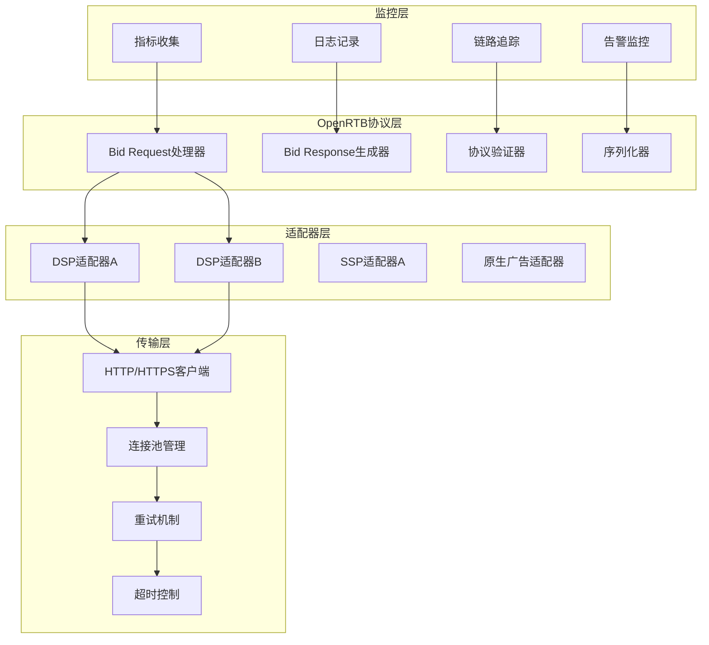

# OpenRTB协议实现技术设计

## 协议概述

OpenRTB（Open Real-Time Bidding）是IAB制定的实时竞价广告协议标准。Lorn.ADSP严格遵循OpenRTB 2.5/3.0规范，实现与外部DSP/SSP平台的标准化对接，支持实时竞价生态的无缝集成。

## 架构设计

### 协议栈架构



### 核心组件设计

#### Bid Request处理器
- **职责**: 构建标准化的竞价请求
- **接口**: IBidRequestProcessor
- **功能**: 
  - 请求参数映射和转换
  - 协议版本兼容性处理
  - 请求数据验证和清洗
  - 多平台格式适配

#### Bid Response解析器
- **职责**: 解析和验证竞价响应
- **接口**: IBidResponseParser
- **功能**:
  - 响应格式验证
  - 数据完整性检查
  - 错误处理和降级
  - 性能指标收集

#### 协议适配器
- **职责**: 不同平台的协议适配
- **接口**: IProtocolAdapter
- **功能**:
  - 平台特有扩展字段处理
  - 版本兼容性管理
  - 自定义业务逻辑集成
  - 配置化参数管理

## 数据模型设计

### OpenRTB对象模型

#### BidRequest核心结构
```json
{
  "id": "请求唯一标识",
  "imp": [
    {
      "id": "展示位标识",
      "banner": {
        "w": 320,
        "h": 50,
        "format": [
          {"w": 320, "h": 50},
          {"w": 300, "h": 250}
        ]
      },
      "video": {
        "mimes": ["video/mp4"],
        "minduration": 5,
        "maxduration": 30,
        "protocols": [2, 3, 5, 6],
        "w": 640,
        "h": 480
      },
      "native": {
        "request": "原生广告请求规范",
        "ver": "1.2"
      },
      "bidfloor": 0.50,
      "bidfloorcur": "USD"
    }
  ],
  "site": {
    "id": "媒体站点ID",
    "name": "媒体站点名称",
    "domain": "example.com",
    "cat": ["IAB1", "IAB2"],
    "page": "当前页面URL",
    "ref": "来源页面URL",
    "publisher": {
      "id": "发布商ID",
      "name": "发布商名称"
    }
  },
  "app": {
    "id": "应用ID",
    "name": "应用名称",
    "bundle": "com.example.app",
    "domain": "example.com",
    "cat": ["IAB1"],
    "ver": "1.0",
    "publisher": {
      "id": "发布商ID",
      "name": "发布商名称"
    }
  },
  "device": {
    "ua": "用户代理字符串",
    "geo": {
      "lat": 40.7128,
      "lon": -74.0060,
      "country": "USA",
      "region": "NY",
      "city": "New York"
    },
    "dnt": 0,
    "lmt": 0,
    "ip": "192.168.1.1",
    "devicetype": 1,
    "make": "Apple",
    "model": "iPhone",
    "os": "iOS",
    "osv": "14.0",
    "h": 1334,
    "w": 750
  },
  "user": {
    "id": "用户ID",
    "buyeruid": "DSP用户ID",
    "yob": 1985,
    "gender": "M",
    "geo": {
      "country": "USA",
      "region": "NY",
      "city": "New York"
    }
  },
  "at": 1,
  "tmax": 100,
  "cur": ["USD"],
  "bcat": ["IAB7-39", "IAB8-18", "IAB8-5"],
  "badv": ["competitor.com"],
  "regs": {
    "coppa": 0,
    "ext": {
      "gdpr": 1
    }
  },
  "ext": {
    "gdpr": 1,
    "consent": "GDPR同意字符串"
  }
}
```

#### BidResponse核心结构
```json
{
  "id": "对应的请求ID",
  "seatbid": [
    {
      "bid": [
        {
          "id": "出价ID",
          "impid": "对应的展示位ID",
          "price": 2.50,
          "adid": "广告ID",
          "nurl": "胜出通知URL",
          "burl": "计费通知URL", 
          "lurl": "失败通知URL",
          "adm": "广告标记内容",
          "adomain": ["advertiser.com"],
          "bundle": "com.advertiser.app",
          "iurl": "广告图片URL",
          "cid": "活动ID",
          "crid": "创意ID",
          "attr": [1, 2, 3],
          "api": [1, 2],
          "protocol": 2,
          "qagmediarating": 1,
          "language": "en",
          "dealid": "私有交易ID",
          "w": 320,
          "h": 50,
          "wratio": 16,
          "hratio": 9,
          "exp": 3600,
          "ext": {
            "advertiser_name": "广告主名称",
            "agency_name": "代理商名称"
          }
        }
      ],
      "seat": "DSP座位ID",
      "group": 0,
      "ext": {
        "dsp_name": "DSP名称"
      }
    }
  ],
  "bidid": "竞价ID",
  "cur": "USD",
  "customdata": "自定义数据",
  "nbr": 0,
  "ext": {
    "responsetimems": 45,
    "matching_ad_id": "匹配的广告ID"
  }
}
```

### 扩展字段设计

#### 自定义扩展
```json
{
  "ext": {
    "lorn_adsp": {
      "version": "2.0",
      "request_source": "mobile_app",
      "user_segment": ["tech_enthusiast", "high_income"],
      "content_category": "news",
      "ad_format_preference": "native",
      "frequency_cap": {
        "daily_limit": 5,
        "weekly_limit": 20
      },
      "targeting_data": {
        "interests": ["technology", "sports"],
        "behaviors": ["frequent_shopper", "early_adopter"],
        "demographics": {
          "age_range": "25-34",
          "income_level": "high"
        }
      },
      "supply_chain": {
        "chain": "1.0,1!exchange.com,1234,1,publisher,pub123",
        "complete": 1
      }
    }
  }
}
```

## 实现架构

### 服务端架构

#### HTTP服务器配置
- **框架**: ASP.NET Core Minimal APIs
- **协议**: HTTP/1.1, HTTP/2支持
- **压缩**: Gzip/Brotli响应压缩
- **Keep-Alive**: 连接复用优化
- **超时**: 100ms默认超时时间

#### 请求处理流水线
```
接收请求 → 协议验证 → 数据解析 → 业务处理 → 响应构建 → 发送响应
    ↓           ↓         ↓         ↓         ↓         ↓
  监控埋点   格式校验   对象映射   竞价逻辑   协议封装   性能统计
```

#### 并发处理模型
- **异步处理**: 全异步I/O操作
- **线程池**: 合理配置工作线程
- **连接池**: HTTP客户端连接复用
- **内存池**: 减少GC压力

### 客户端架构

#### HTTP客户端设计
- **连接管理**: HttpClientFactory管理
- **重试策略**: 指数退避重试机制
- **熔断保护**: Circuit Breaker模式
- **超时控制**: 多级超时控制

#### 负载均衡
- **轮询算法**: 默认轮询分发
- **权重分配**: 基于性能的权重调整
- **健康检查**: 定期健康状态检测
- **故障转移**: 自动故障节点剔除

## 性能优化

### 序列化优化
- **JSON序列化**: System.Text.Json高性能序列化
- **内存优化**: 池化JsonSerializer实例
- **字段映射**: 预编译的属性映射
- **压缩传输**: 启用HTTP压缩

### 网络优化
- **连接复用**: HTTP/1.1 Keep-Alive
- **并发控制**: 限制并发连接数
- **DNS缓存**: 本地DNS解析缓存
- **TCP优化**: 调优TCP参数

### 缓存策略
- **响应缓存**: 相同请求结果缓存
- **连接缓存**: TCP连接池化缓存
- **对象缓存**: 频繁对象内存缓存
- **配置缓存**: 配置信息本地缓存

## 监控和调试

### 性能指标
- **请求延迟**: P50/P95/P99延迟统计
- **成功率**: 请求成功率监控
- **吞吐量**: QPS/TPS实时监控
- **错误率**: 各类错误分布统计

### 业务指标
- **竞价成功率**: 成功竞价比例
- **填充率**: 有效广告填充率
- **平均价格**: 竞价平均价格
- **DSP性能**: 各DSP响应性能

### 日志记录
- **请求日志**: 完整的请求响应日志
- **错误日志**: 详细的错误堆栈信息
- **性能日志**: 关键路径性能数据
- **审计日志**: 重要操作审计记录

### 链路追踪
- **分布式追踪**: OpenTelemetry集成
- **Span标记**: 关键环节Span标记
- **上下文传递**: TraceId全链路传递
- **性能分析**: 链路性能瓶颈分析

## 兼容性设计

### 版本兼容
- **向后兼容**: 支持OpenRTB 2.3/2.4/2.5
- **向前兼容**: 预留OpenRTB 3.0支持
- **平滑升级**: 版本平滑切换机制
- **降级处理**: 不兼容时优雅降级

### 平台适配
- **Google ADX**: Google ADX协议适配
- **Meta Audience**: Facebook Audience Network适配
- **Amazon DSP**: Amazon DSP协议适配
- **私有协议**: 支持私有协议扩展

### 地域合规
- **GDPR合规**: 欧盟数据保护法规
- **CCPA合规**: 加州隐私法规
- **本地化**: 多语言和时区支持
- **法规更新**: 法规变更自动适配

## 安全设计

### 数据安全
- **HTTPS加密**: 强制HTTPS传输
- **数据脱敏**: 敏感数据脱敏处理
- **访问控制**: 基于白名单的访问控制
- **数据完整性**: 请求响应完整性验证

### 防攻击机制
- **限流保护**: 请求频率限制
- **DDoS防护**: 分布式拒绝服务防护
- **参数验证**: 严格的输入参数验证
- **异常监控**: 异常行为实时监控

### 隐私保护
- **用户ID加密**: 用户标识符加密传输
- **地理位置脱敏**: 地理信息精度控制
- **行为数据匿名**: 用户行为数据匿名化
- **数据最小化**: 按需最小数据传输

## 测试策略

### 单元测试
- **协议验证**: 协议格式验证测试
- **数据转换**: 数据映射转换测试
- **错误处理**: 异常情况处理测试
- **性能基准**: 基准性能测试

### 集成测试
- **端到端**: 完整竞价流程测试
- **兼容性**: 多版本协议兼容测试
- **压力测试**: 高并发压力测试
- **稳定性**: 长期稳定性测试

### 生产测试
- **灰度测试**: 生产环境灰度验证
- **A/B测试**: 不同策略效果对比
- **回归测试**: 功能回归测试
- **监控验证**: 监控指标有效性验证

## 总结

OpenRTB协议实现是Lorn.ADSP与外部广告生态对接的关键技术组件。通过严格遵循IAB标准、精心设计的架构、全面的性能优化和完善的监控机制，实现了高性能、高兼容性、高安全性的实时竞价服务，为广告主和媒体提供了标准化、专业化的程序化广告交易能力。
