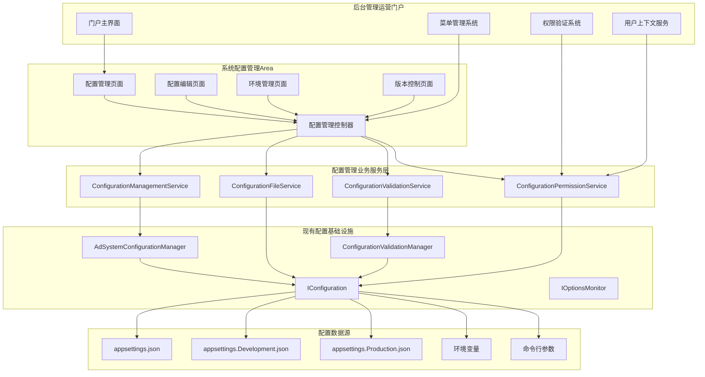

# 系统配置管理模块技术设计文档

## 设计概述

系统配置管理模块基于现有的 `Lorn.ADSP.Infrastructure.Configuration` 配置基础设施，采用ASP.NET Core 9.0 B/S架构为上层提供Web化的配置管理界面。该模块通过配置文件管理、环境配置切换、配置验证等技术手段，为广告系统提供统一、安全、易用的配置管理服务。

### 设计目标

**基于现有基础设施**：
- 基于 `AdSystemConfigurationManager` 的自动配置发现和注册机制
- 利用现有的 `ConfigurationValidationManager` 进行配置验证
- 通过Web界面管理 appsettings.json 等配置文件
- 支持配置的热重载和实时生效

**企业级管理功能**：
- 提供配置分组展示和分类管理界面
- 支持多环境配置文件管理和切换
- 实现配置文件的版本控制和备份回滚
- 提供敏感配置的脱敏显示和安全处理

**高可用性和安全性**：
- 基于配置文件的高性能配置访问（无需数据库）
- 敏感配置的安全显示和权限控制
- 完整的配置变更审计和操作日志

## 技术架构设计

### 整体架构

基于现有的 `Lorn.ADSP.Infrastructure.Configuration` 基础设施，系统配置管理模块提供上层管理界面：



### 核心设计原则

- **基础设施复用**：充分利用现有的 `Lorn.ADSP.Infrastructure.Configuration` 
- **配置文件为准**：系统配置存储于标准的 .NET 配置文件中
- **上层管理界面**：提供Web界面来管理配置文件内容
- **安全优先**：敏感配置的安全处理和权限控制

## 业务服务层设计

### 配置管理服务架构

**IConfigurationManagementService接口职责**：
- 基于现有的 `AdSystemConfigurationManager` 获取已注册的配置类型信息
- 提供配置项的查询、分组展示和搜索功能
- 集成配置验证和权限控制机制
- 支持配置的热重载和实时生效

**核心方法定义**：
```csharp
[Component]
public interface IConfigurationManagementService
{
    /// <summary>
    /// 获取所有已注册的配置类型和配置节信息
    /// </summary>
    Task<IEnumerable<ConfigurationTypeDescriptor>> GetRegisteredConfigurationTypesAsync(CancellationToken cancellationToken = default);
    
    /// <summary>
    /// 获取指定配置节的当前配置值
    /// </summary>
    Task<object> GetConfigurationValueAsync(string sectionName, Type optionsType, CancellationToken cancellationToken = default);
    
    /// <summary>
    /// 获取配置的分组层次结构
    /// </summary>
    Task<ConfigurationGroupTree> GetConfigurationGroupTreeAsync(CancellationToken cancellationToken = default);
    
    /// <summary>
    /// 搜索配置项
    /// </summary>
    Task<IEnumerable<ConfigurationDescriptor>> SearchConfigurationsAsync(string searchTerm, CancellationToken cancellationToken = default);
    
    /// <summary>
    /// 触发配置重新加载
    /// </summary>
    Task ReloadConfigurationAsync(CancellationToken cancellationToken = default);
}
```

### 配置文件管理服务设计

**IConfigurationFileService接口职责**：
- 管理多环境配置文件的读取和写入
- 提供配置文件的备份和恢复功能
- 支持配置文件内容的结构化操作
- 实现配置文件的版本控制机制

**核心功能模块**：
```csharp
[Component]
public interface IConfigurationFileService
{
    /// <summary>
    /// 读取指定环境的配置文件内容
    /// </summary>
    Task<ConfigurationFileContent> ReadConfigurationFileAsync(string environment, CancellationToken cancellationToken = default);
    
    /// <summary>
    /// 更新配置文件中的特定配置节
    /// </summary>
    Task UpdateConfigurationSectionAsync(string environment, string sectionPath, object value, CancellationToken cancellationToken = default);
    
    /// <summary>
    /// 备份当前配置文件
    /// </summary>
    Task<string> BackupConfigurationFileAsync(string environment, string reason, CancellationToken cancellationToken = default);
    
    /// <summary>
    /// 从备份恢复配置文件
    /// </summary>
    Task RestoreConfigurationFileAsync(string environment, string backupId, CancellationToken cancellationToken = default);
    
    /// <summary>
    /// 获取配置文件的变更历史
    /// </summary>
    Task<IEnumerable<ConfigurationChangeRecord>> GetChangeHistoryAsync(string environment, CancellationToken cancellationToken = default);
}
```

### 配置验证服务设计

**IConfigurationValidationService接口职责**：
- 基于现有的 `ConfigurationValidationManager` 进行配置验证
- 提供配置值的格式和业务规则验证
- 支持配置修改前的预验证功能
- 集成自定义验证规则和错误处理

**验证服务实现**：
```csharp
[Component]
public interface IConfigurationValidationService
{
    /// <summary>
    /// 验证指定配置节的值是否有效
    /// </summary>
    Task<ValidationResult> ValidateConfigurationAsync(string sectionName, Type optionsType, object value, CancellationToken cancellationToken = default);
    
    /// <summary>
    /// 批量验证配置文件的完整性
    /// </summary>
    Task<IEnumerable<ValidationResult>> ValidateConfigurationFileAsync(string environment, CancellationToken cancellationToken = default);
    
    /// <summary>
    /// 获取指定配置类型的验证规则
    /// </summary>
    Task<IEnumerable<ValidationRule>> GetValidationRulesAsync(Type optionsType, CancellationToken cancellationToken = default);
}
```

### 环境管理服务设计

**IEnvironmentConfigurationService接口职责**：
- 管理多环境配置文件的隔离和继承关系
- 提供环境间配置差异对比功能
- 支持配置在不同环境间的同步操作
- 实现环境切换和配置生效机制

**核心功能模块**：
- 环境列表管理：支持开发、测试、预生产、生产等环境
- 配置差异分析：对比不同环境间的配置差异
- 环境同步机制：支持配置在环境间的安全同步
- 配置继承处理：处理 appsettings.json 与 appsettings.{Environment}.json 的继承关系

## 数据模型设计

### 配置描述符模型

**ConfigurationTypeDescriptor配置类型描述符**：

基于现有的 `AdSystemConfigurationManager` 自动发现的配置类型信息，构建配置描述符：

```csharp
public class ConfigurationTypeDescriptor
{
    /// <summary>
    /// 配置类型（如：AdEngineOptions）
    /// </summary>
    public Type OptionsType { get; set; }
    
    /// <summary>
    /// 配置节名称（如：AdEngine）
    /// </summary>
    public string SectionName { get; set; }
    
    /// <summary>
    /// 配置分组名称
    /// </summary>
    public string GroupName { get; set; }
    
    /// <summary>
    /// 配置属性列表
    /// </summary>
    public IEnumerable<ConfigurationPropertyDescriptor> Properties { get; set; }
    
    /// <summary>
    /// 是否包含敏感信息
    /// </summary>
    public bool ContainsSensitiveData { get; set; }
    
    /// <summary>
    /// 配置描述信息
    /// </summary>
    public string Description { get; set; }
}

public class ConfigurationPropertyDescriptor
{
    /// <summary>
    /// 属性名称
    /// </summary>
    public string PropertyName { get; set; }
    
    /// <summary>
    /// 属性类型
    /// </summary>
    public Type PropertyType { get; set; }
    
    /// <summary>
    /// 当前值
    /// </summary>
    public object CurrentValue { get; set; }
    
    /// <summary>
    /// 默认值
    /// </summary>
    public object DefaultValue { get; set; }
    
    /// <summary>
    /// 是否敏感数据
    /// </summary>
    public bool IsSensitive { get; set; }
    
    /// <summary>
    /// 验证规则
    /// </summary>
    public IEnumerable<ValidationAttribute> ValidationRules { get; set; }
}
```

### 配置文件模型

**ConfigurationFileContent配置文件内容模型**：

```csharp
public class ConfigurationFileContent
{
    /// <summary>
    /// 环境名称
    /// </summary>
    public string Environment { get; set; }
    
    /// <summary>
    /// 配置文件路径
    /// </summary>
    public string FilePath { get; set; }
    
    /// <summary>
    /// 配置内容（JSON对象）
    /// </summary>
    public JObject Content { get; set; }
    
    /// <summary>
    /// 文件最后修改时间
    /// </summary>
    public DateTime LastModified { get; set; }
    
    /// <summary>
    /// 文件大小
    /// </summary>
    public long FileSize { get; set; }
}

public class ConfigurationChangeRecord
{
    /// <summary>
    /// 变更ID
    /// </summary>
    public string ChangeId { get; set; }
    
    /// <summary>
    /// 环境名称
    /// </summary>
    public string Environment { get; set; }
    
    /// <summary>
    /// 配置节路径
    /// </summary>
    public string SectionPath { get; set; }
    
    /// <summary>
    /// 变更前的值
    /// </summary>
    public object OldValue { get; set; }
    
    /// <summary>
    /// 变更后的值
    /// </summary>
    public object NewValue { get; set; }
    
    /// <summary>
    /// 变更操作者
    /// </summary>
    public string OperatorId { get; set; }
    
    /// <summary>
    /// 变更时间
    /// </summary>
    public DateTime ChangeTime { get; set; }
    
    /// <summary>
    /// 变更原因
    /// </summary>
    public string Reason { get; set; }
}
```

### 配置分组模型

**ConfigurationGroupTree配置分组树模型**：

基于配置类型的命名空间和分类，自动构建配置分组树：

```csharp
public class ConfigurationGroupTree
{
    /// <summary>
    /// 根分组节点列表
    /// </summary>
    public IEnumerable<ConfigurationGroupNode> RootNodes { get; set; }
}

public class ConfigurationGroupNode
{
    /// <summary>
    /// 分组名称
    /// </summary>
    public string GroupName { get; set; }
    
    /// <summary>
    /// 分组显示名称
    /// </summary>
    public string DisplayName { get; set; }
    
    /// <summary>
    /// 分组图标
    /// </summary>
    public string Icon { get; set; }
    
    /// <summary>
    /// 子分组
    /// </summary>
    public IEnumerable<ConfigurationGroupNode> Children { get; set; }
    
    /// <summary>
    /// 该分组下的配置类型
    /// </summary>
    public IEnumerable<ConfigurationTypeDescriptor> ConfigurationTypes { get; set; }
    
    /// <summary>
    /// 排序权重
    /// </summary>
    public int SortOrder { get; set; }
}
```
## 基础设施集成设计

### 配置基础设施集成

**基于现有配置基础设施的上层管理功能设计**：

系统配置管理模块基于现有的 `Lorn.ADSP.Infrastructure.Configuration` 基础设施，提供Web界面来管理各种配置选项类（*Options）。

**现有配置基础设施分析**：

- `AdSystemConfigurationManager`：自动扫描和注册所有 `*Options` 配置类
- `ConfigurationValidationManager`：提供配置验证功能
- 配置数据源：基于 appsettings.json、环境变量等标准 .NET 配置源
- 自动绑定：通过约定自动将配置节绑定到强类型Options类

**上层管理功能实现**：

```csharp
[Component]
public class ConfigurationManagementService : IConfigurationManagementService
{
    private readonly AdSystemConfigurationManager _configurationManager;
    private readonly IConfiguration _configuration;
    private readonly ConfigurationValidationManager _validationManager;
    private readonly IServiceProvider _serviceProvider;

    public async Task<IEnumerable<ConfigurationTypeDescriptor>> GetRegisteredConfigurationTypesAsync(CancellationToken cancellationToken = default)
    {
        // 利用反射机制获取已注册的Options类型
        var optionsTypes = GetRegisteredOptionsTypes();
        var descriptors = new List<ConfigurationTypeDescriptor>();
        
        foreach (var optionsType in optionsTypes)
        {
            var sectionName = GetConfigurationSectionName(optionsType);
            var currentValue = GetCurrentConfigurationValue(optionsType);
            
            descriptors.Add(new ConfigurationTypeDescriptor
            {
                OptionsType = optionsType,
                SectionName = sectionName,
                GroupName = GetGroupNameFromNamespace(optionsType),
                Properties = GetConfigurationProperties(optionsType, currentValue),
                ContainsSensitiveData = ContainsSensitiveProperties(optionsType),
                Description = GetConfigurationDescription(optionsType)
            });
        }
        
        return descriptors;
    }

    private IEnumerable<Type> GetRegisteredOptionsTypes()
    {
        // 通过ServiceProvider获取所有注册的IOptions<T>类型
        var serviceDescriptors = _serviceProvider.GetServices<ServiceDescriptor>();
        return serviceDescriptors
            .Where(sd => sd.ServiceType.IsGenericType && 
                        sd.ServiceType.GetGenericTypeDefinition() == typeof(IOptions<>))
            .Select(sd => sd.ServiceType.GetGenericArguments()[0])
            .Where(t => t.Name.EndsWith("Options"))
            .Distinct();
    }
}
```

### 配置文件管理服务实现

**基于标准 .NET 配置文件的管理服务**：

```csharp
[Component]
public class ConfigurationFileService : IConfigurationFileService
{
    private readonly IWebHostEnvironment _environment;
    private readonly ILogger<ConfigurationFileService> _logger;
    
    public async Task<ConfigurationFileContent> ReadConfigurationFileAsync(string environment, CancellationToken cancellationToken = default)
    {
        var fileName = environment == "Production" ? "appsettings.json" : $"appsettings.{environment}.json";
        var filePath = Path.Combine(_environment.ContentRootPath, fileName);
        
        if (!File.Exists(filePath))
        {
            throw new FileNotFoundException($"Configuration file not found: {fileName}");
        }
        
        var content = await File.ReadAllTextAsync(filePath, cancellationToken);
        var jsonContent = JObject.Parse(content);
        var fileInfo = new FileInfo(filePath);
        
        return new ConfigurationFileContent
        {
            Environment = environment,
            FilePath = filePath,
            Content = jsonContent,
            LastModified = fileInfo.LastWriteTime,
            FileSize = fileInfo.Length
        };
    }
    
    public async Task UpdateConfigurationSectionAsync(string environment, string sectionPath, object value, CancellationToken cancellationToken = default)
    {
        // 1. 备份当前配置文件
        var backupId = await BackupConfigurationFileAsync(environment, $"Update {sectionPath}", cancellationToken);
        
        try
        {
            // 2. 读取配置文件
            var configFile = await ReadConfigurationFileAsync(environment, cancellationToken);
            
            // 3. 更新指定配置节
            UpdateJsonSection(configFile.Content, sectionPath, value);
            
            // 4. 保存配置文件
            var updatedContent = configFile.Content.ToString(Formatting.Indented);
            await File.WriteAllTextAsync(configFile.FilePath, updatedContent, cancellationToken);
            
            // 5. 记录变更日志
            await RecordConfigurationChange(environment, sectionPath, value, cancellationToken);
            
            // 6. 触发配置重载
            await TriggerConfigurationReload();
        }
        catch (Exception ex)
        {
            // 出现异常时恢复备份
            await RestoreConfigurationFileAsync(environment, backupId, cancellationToken);
            throw;
        }
    }
}
```

## Web界面层设计

### ASP.NET Core MVC架构

**控制器层设计**：

- `SystemConfigurationController`：配置管理的主控制器
- `ConfigurationFileController`：配置文件管理控制器
- `ConfigurationValidationController`：配置验证控制器
- `ConfigurationApiController`：提供RESTful API接口

**视图层组织**：

- `Views/SystemConfiguration/`：配置管理相关视图
- `Views/ConfigurationFile/`：配置文件管理相关视图
- `Views/Shared/ConfigurationComponents/`：配置相关的共享组件

### 主要页面设计

**配置管理主页面**：

- 左侧配置分组树形导航（基于Options类的命名空间）
- 右侧配置类型列表和属性展示
- 顶部环境切换和搜索功能
- 支持配置的查看、编辑和验证

**配置编辑页面**：

- 基于Options类属性自动生成的编辑表单
- 根据属性类型提供不同的输入控件
- 实时验证和错误提示功能
- 敏感配置的脱敏显示和特殊处理

**环境管理页面**：

- 环境列表展示（Development、Staging、Production等）
- 环境间配置差异对比界面
- 配置文件内容的可视化展示
- 配置文件的备份和恢复功能

**配置文件编辑页面**：

- JSON格式的配置文件内容编辑器
- 语法高亮和格式化功能
- 配置节的折叠和展开
- 配置文件的版本对比功能

### 前端技术栈

**JavaScript框架选择**：

- 使用现代JavaScript ES6+语法
- 集成Vue.js用于动态表单生成和数据绑定
- 采用Element UI提供丰富的表单组件
- 使用Monaco Editor提供代码编辑功能

**用户交互设计**：

- 动态表单生成基于Options类的属性定义
- 实时配置验证和错误提示
- 配置文件的语法高亮和智能提示
- 配置变更的实时预览功能

## 安全设计

### 权限控制集成

**ConfigurationPermissionService组件职责**：

- 集成统一权限管理系统，控制配置的访问权限
- 提供基于角色和配置类型的细粒度权限控制
- 支持敏感配置和系统配置的特殊权限验证
- 实现配置列表的权限过滤和脱敏处理

**权限验证层次**：

- 基础权限：配置的查看、编辑权限
- 敏感权限：敏感配置的访问和编辑特殊权限
- 环境权限：不同环境的访问和切换权限
- 系统权限：系统核心配置的修改权限

### 数据安全处理

**ConfigurationSecurityService组件职责**：

- 提供配置数据的安全显示和访问控制
- 集成敏感配置的脱敏显示功能
- 实现配置访问的安全审计
- 提供配置文件的安全备份和恢复

**安全处理流程**：

- 显示安全：敏感配置的自动脱敏显示
- 访问安全：基于权限的配置访问控制
- 操作安全：配置修改的权限验证和审计
- 传输安全：配置数据传输的安全保护

## 监控和告警设计

### 配置监控服务架构

**ConfigurationMonitoringService组件职责**：

- 提供配置系统的健康监控和性能指标收集
- 监控配置文件的变更和访问情况
- 实现配置系统的健康检查和异常告警
- 提供配置操作的统计和分析功能

**监控指标体系**：

- 操作指标：配置查看、编辑操作的频率和成功率
- 文件指标：配置文件大小、变更频率、备份状态
- 系统指标：配置重载频率、验证错误、权限拒绝次数
- 用户指标：用户访问模式、操作偏好、错误分布

### 健康检查体系

**多维度健康检查**：

- 配置文件检查：验证配置文件的完整性和可读性
- 配置验证检查：验证当前配置的有效性
- 权限系统检查：验证权限控制的正常运行
- 备份系统检查：验证配置备份机制的正常工作

## 门户集成设计

### 门户模块集成架构

**Area集成方式**：

- 系统配置管理作为 `Lorn.ADSP.Web.Admin` 项目的一个Area实现
- Area名称：SystemConfiguration
- 路由前缀：/SystemConfiguration
- 集成到管理后台的统一布局和导航体系

**菜单注册集成**：

- 通过管理后台的动态菜单注册机制注册配置管理菜单
- 菜单层次：系统管理 → 系统配置管理
- 权限绑定：CONFIG_MANAGEMENT权限控制菜单可见性
- 菜单图标：使用管理后台统一的图标体系

**布局和主题集成**：

- 使用 `Lorn.ADSP.Web.Admin` 的统一布局模板
- 集成管理后台的面包屑导航和页面标题
- 使用管理后台的统一样式系统和主题配置
- 遵循管理后台的响应式布局规范

### 权限集成设计

**权限体系集成**：

- 集成 `Lorn.ADSP.Web.Admin` 的统一权限验证机制
- 使用管理后台的用户上下文服务获取当前用户信息
- 配置操作权限与管理后台权限系统统一管理
- 支持基于角色的配置访问控制

**安全集成要求**：

- 使用管理后台的统一身份认证机制
- 集成管理后台的会话管理和超时控制
- 配置操作审计日志集成到管理后台审计体系
- 敏感配置访问需要额外权限验证

## 总结

系统配置管理模块技术设计基于现有的 `Lorn.ADSP.Infrastructure.Configuration` 配置基础设施，采用ASP.NET Core 9.0 B/S架构为广告系统提供Web化的配置管理功能。

### 核心技术优势

**架构设计优势**：

- 基础设施复用：充分利用现有的配置基础设施，避免重复开发
- 配置文件为准：系统配置存储于标准的 .NET 配置文件中，性能优越
- 上层管理界面：提供Web界面管理配置文件，用户体验良好
- 热重载机制：支持配置的实时生效，无需重启应用

### 实现指导要点

**项目结构组织**：

根据系统整体技术架构设计，系统配置管理功能作为后台管理门户的一个模块：

```
# 01.Presentation 表示层
├── Lorn.ADSP.Web.Admin                    # 管理后台 (ASP.NET Core MVC)
│   ├── Areas/SystemConfiguration/         # 系统配置管理区域
│   │   ├── Controllers/                   # 配置管理控制器
│   │   │   ├── SystemConfigurationController.cs
│   │   │   ├── ConfigurationFileController.cs
│   │   │   └── ConfigurationValidationController.cs
│   │   ├── Views/                         # 配置管理视图
│   │   │   ├── SystemConfiguration/       # 配置管理页面
│   │   │   ├── ConfigurationFile/         # 配置文件管理页面
│   │   │   └── Shared/                    # 配置管理共享视图
│   │   └── Models/                        # 配置管理视图模型
│   │       ├── SystemConfigurationViewModel.cs
│   │       ├── ConfigurationFileViewModel.cs
│   │       └── ConfigurationEditViewModel.cs
│   ├── Controllers/                       # 门户主控制器
│   ├── Views/                             # 门户主视图
│   ├── Areas/                             # 其他业务区域
│   │   ├── UserManagement/                # 用户管理区域
│   │   ├── OrganizationManagement/        # 组织管理区域
│   │   └── PermissionManagement/          # 权限管理区域
│   └── wwwroot/                           # 静态资源
│       ├── css/                           # 样式文件
│       ├── js/                            # JavaScript文件
│       └── lib/                           # 第三方库

# 02.Services 微服务层（如果需要独立的配置管理服务）
├── Lorn.ADSP.ConfigurationManagement/     # 配置管理微服务（可选）
│   ├── Controllers/                       # 配置管理API控制器
│   ├── Services/                          # 配置管理业务服务
│   ├── Models/                            # API数据模型
│   └── Extensions/                        # 服务注册扩展

# 05.Infrastructure 基础设施层（已存在的配置基础设施）
├── Lorn.ADSP.Infrastructure.Configuration/ # 配置管理基础设施（已存在）
│   ├── AdSystemConfigurationManager.cs    # 配置管理器（已存在）
│   ├── ConfigurationValidationManager.cs  # 配置验证管理器（已存在）
│   └── ...                                # 其他配置基础设施

# 配置管理扩展服务（如果需要）
├── Lorn.ADSP.Infrastructure.Configuration.Extensions/
│   ├── Services/                          # 配置文件管理服务
│   │   ├── ConfigurationFileService.cs   # 配置文件操作服务
│   │   ├── ConfigurationReloadService.cs # 配置重载服务
│   │   └── ConfigurationSecurityService.cs # 配置安全服务
│   ├── Models/                            # 配置管理数据模型
│   │   ├── ConfigurationTypeDescriptor.cs
│   │   ├── ConfigurationFileContent.cs
│   │   └── ConfigurationChangeRecord.cs
│   └── Extensions/                        # 配置管理扩展方法
│       └── ServiceCollectionExtensions.cs
```

**项目依赖关系**：

```
Lorn.ADSP.Web.Admin (管理后台主项目)
    ↓ 依赖
Lorn.ADSP.Infrastructure.Configuration.Extensions (配置管理扩展服务，可选)
    ↓ 依赖
Lorn.ADSP.Infrastructure.Configuration (现有配置基础设施)
    ↓ 依赖
Lorn.ADSP.Infrastructure.Common (公共基础设施)
```

**关键技术约束**：

- 系统配置管理作为 `Lorn.ADSP.Web.Admin` 管理后台的一个Area模块
- 所有服务类使用 `[Component]` 特性标记，支持自动注册
- 基于现有的 `AdSystemConfigurationManager` 进行配置类型发现
- 利用现有的 `ConfigurationValidationManager` 进行配置验证
- 配置数据存储于标准的 appsettings.json 等配置文件中
- 通过 `IConfiguration` 和 `IOptionsMonitor<T>` 访问配置
- 支持配置的热重载和实时生效
- 实现完整的权限验证和数据安全控制

**基础设施集成要求**：

- 使用现有的 `Lorn.ADSP.Infrastructure.Configuration` 基础设施
- 通过 `services.AddInfrastructure(configuration)` 自动注册配置组件
- 遵循现有的配置约定和命名规范
- 集成健康检查和性能监控机制

**管理后台集成要求**：

- 通过 `Lorn.ADSP.Web.Admin` 的菜单注册机制注册配置管理菜单
- 使用管理后台的统一布局和主题系统
- 集成管理后台的消息通知和用户上下文
- 遵循管理后台的统一用户体验规范

该技术设计为开发团队提供了完整的实现指导，确保系统配置管理模块能够基于现有的配置基础设施高质量地集成到Lorn.ADSP广告平台的管理后台中。
