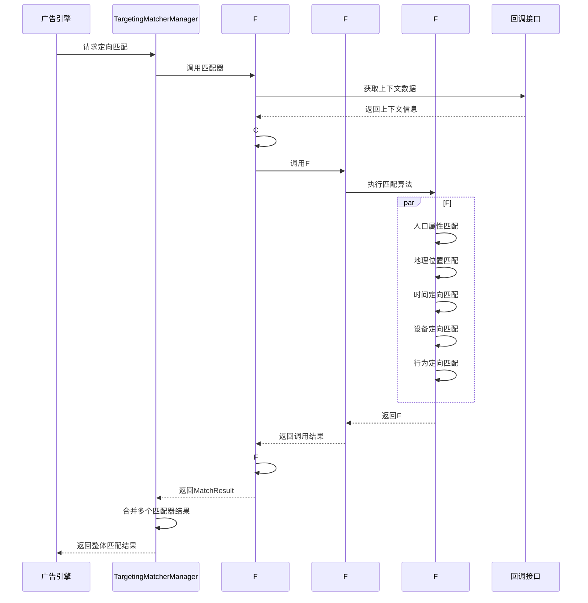
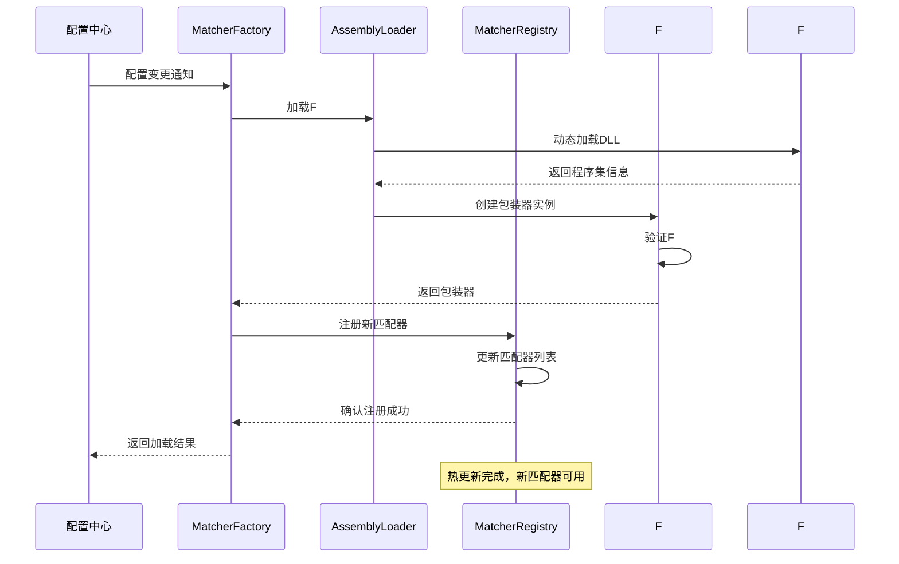

# 广告召回逻辑引擎设计文档

## 概述

广告召回逻辑引擎是基于已有广告引擎抽象层（`Lorn.ADSP.Core.AdEngine.Abstractions`）的可扩展模块实现，专注于定向匹配引擎等核心算法的F#实现。该设计遵循现有的统一策略接口和回调机制，通过F#语言的函数式编程特性，实现高性能、高并发的定向匹配算法，为广告投放引擎提供精准的定向筛选能力。

## 架构设计

### 基于现有抽象层的F#扩展架构

本设计基于已有的广告引擎抽象层架构，专注于F#定向匹配引擎的实现：

```mermaid
graph TB
    subgraph "已有广告引擎抽象层"
        ABS[Core.AdEngine.Abstractions]
        STRATEGY[IAdProcessingStrategy]
        CALLBACK[ICallbackProvider]
        MATCHER[ITargetingMatcher]
        MANAGER[ITargetingMatcherManager]
    end
    
    subgraph "F#定向匹配引擎实现"
        subgraph "F#策略实现项目"
            FS_TARGETING[Lorn.ADSP.Strategies.Targeting]
            FS_DEMO[DemographicMatcher.fs]
            FS_GEO[GeoLocationMatcher.fs]
            FS_TIME[TimeTargetingMatcher.fs]
            FS_DEVICE[DeviceTargetingMatcher.fs]
            FS_INTEREST[UserInterestMatcher.fs]
            FS_BEHAVIOR[UserBehaviorMatcher.fs]
            FS_PREFERENCE[UserPreferenceMatcher.fs]
            FS_TAG[UserTagMatcher.fs]
            FS_VALUE[UserValueMatcher.fs]
        end
        
        subgraph "C#包装器层"
            WRAPPER[TargetingMatcherWrapper]
            FACTORY[TargetingMatcherFactory]
            LOADER[FSharpAssemblyLoader]
        end
        
        subgraph "配置与管理"
            CONFIG[MatcherConfiguration]
            REGISTRY[MatcherRegistry]
            PIPELINE[MatcherPipeline]
        end
    end
    
    subgraph "数据访问回调"
        DATA_CB[IAdEngineContextCallback]
        CONFIG_CB[IAdEngineConfigCallback]
        STATE_CB[IAdEngineStateCallback]
        METRICS_CB[IAdEngineMetricsCallback]
    end
    
    ABS --> STRATEGY
    ABS --> CALLBACK
    ABS --> MATCHER
    ABS --> MANAGER
    
    WRAPPER --> STRATEGY
    WRAPPER --> MATCHER
    FS_TARGETING --> FS_DEMO
    FS_TARGETING --> FS_GEO
    FS_TARGETING --> FS_TIME
    FS_TARGETING --> FS_DEVICE
    FS_TARGETING --> FS_INTEREST
    FS_TARGETING --> FS_BEHAVIOR
    FS_TARGETING --> FS_PREFERENCE
    FS_TARGETING --> FS_TAG
    FS_TARGETING --> FS_VALUE
    
    WRAPPER --> FS_TARGETING
    FACTORY --> WRAPPER
    LOADER --> FS_TARGETING
    
    CONFIG --> REGISTRY
    REGISTRY --> PIPELINE
    
    WRAPPER --> DATA_CB
    WRAPPER --> CONFIG_CB
    WRAPPER --> STATE_CB
    WRAPPER --> METRICS_CB
    
    classDef existing fill:#e3f2fd,stroke:#1976d2,stroke-width:2px
    classDef fsharp fill:#fff8e1,stroke:#f9a825,stroke-width:2px
    classDef wrapper fill:#f3e5f5,stroke:#6a1b9a,stroke-width:2px
    classDef config fill:#e8f5e9,stroke:#2e7d32,stroke-width:2px
    classDef callback fill:#fff3e0,stroke:#f57c00,stroke-width:2px
    
    class ABS,STRATEGY,CALLBACK,MATCHER,MANAGER existing
    class FS_TARGETING,FS_DEMO,FS_GEO,FS_TIME,FS_DEVICE,FS_INTEREST,FS_BEHAVIOR,FS_PREFERENCE,FS_TAG,FS_VALUE fsharp
    class WRAPPER,FACTORY,LOADER wrapper
    class CONFIG,REGISTRY,PIPELINE config
    class DATA_CB,CONFIG_CB,STATE_CB,METRICS_CB callback
```



### 核心组件设计

#### 1. F#定向匹配引擎架构

基于已有的`ITargetingMatcher`接口，使用F#实现高性能的定向匹配算法：

**项目结构设计：**
```
Lorn.ADSP.Strategies.Targeting/
├── Core/
│   ├── TargetingTypes.fs          # 核心类型定义
│   ├── MatchingAlgorithms.fs      # 通用匹配算法
│   └── ScoreCalculation.fs        # 评分计算函数
├── Matchers/
│   ├── DemographicMatcher.fs      # 人口属性匹配
│   ├── GeoLocationMatcher.fs      # 地理位置匹配
│   ├── TimeTargetingMatcher.fs    # 时间定向匹配
│   ├── DeviceTargetingMatcher.fs  # 设备定向匹配
│   ├── UserInterestMatcher.fs     # 用户兴趣匹配
│   ├── UserBehaviorMatcher.fs     # 用户行为匹配
│   ├── UserPreferenceMatcher.fs   # 用户偏好匹配
│   ├── UserTagMatcher.fs          # 用户标签匹配
│   └── UserValueMatcher.fs        # 用户价值匹配
├── Utils/
│   ├── DataValidation.fs          # 数据验证工具
│   ├── CacheHelpers.fs            # 缓存辅助函数
│   └── MetricsCollector.fs        # 指标收集工具
└── Interop/
    ├── CSharpInterop.fs           # C#互操作层
    └── TypeConverters.fs          # 类型转换器
```

#### 2. F#直接接口实现设计

F#匹配器直接实现现有抽象层接口，无需额外包装器：

**F#接口实现职责：**
- 直接实现`ITargetingMatcher`接口规范
- 利用F#的互操作特性与.NET生态集成
- 通过依赖注入获取`ICallbackProvider`实例
- 实现异步匹配计算和结果返回
- 提供配置验证和元数据管理

**F#项目集成方式：**
- F#项目编译为标准.NET程序集
- 通过依赖注入容器注册F#匹配器
- 支持与C#项目的直接引用和调用
- 遵循.NET标准的异常处理机制
- 集成现有的日志和监控体系

#### 3. 动态加载与配置管理

支持F#程序集的动态加载和配置驱动的匹配器管理：

**配置结构：**
```json
{
  "targetingMatchers": {
    "demographic": {
      "assemblyPath": "Lorn.ADSP.Strategies.Targeting.dll",
      "matcherType": "DemographicMatcher",
      "priority": 100,
      "enabled": true,
      "timeout": 50,
      "cacheEnabled": true
    },
    "geolocation": {
      "assemblyPath": "Lorn.ADSP.Strategies.Targeting.dll", 
      "matcherType": "GeoLocationMatcher",
      "priority": 90,
      "enabled": true,
      "timeout": 30,
      "cacheEnabled": true
    },
    "userInterest": {
      "assemblyPath": "Lorn.ADSP.Strategies.Targeting.dll",
      "matcherType": "UserInterestMatcher",
      "priority": 85,
      "enabled": true,
      "timeout": 25,
      "cacheEnabled": true
    },
    "userBehavior": {
      "assemblyPath": "Lorn.ADSP.Strategies.Targeting.dll",
      "matcherType": "UserBehaviorMatcher",
      "priority": 80,
      "enabled": true,
      "timeout": 35,
      "cacheEnabled": true
    },
    "userPreference": {
      "assemblyPath": "Lorn.ADSP.Strategies.Targeting.dll",
      "matcherType": "UserPreferenceMatcher",
      "priority": 95,
      "enabled": true,
      "timeout": 20,
      "cacheEnabled": true
    },
    "userTag": {
      "assemblyPath": "Lorn.ADSP.Strategies.Targeting.dll",
      "matcherType": "UserTagMatcher",
      "priority": 75,
      "enabled": true,
      "timeout": 30,
      "cacheEnabled": true
    },
    "userValue": {
      "assemblyPath": "Lorn.ADSP.Strategies.Targeting.dll",
      "matcherType": "UserValueMatcher",
      "priority": 70,
      "enabled": true,
      "timeout": 25,
      "cacheEnabled": true
    }
  }
}
```

### F#定向匹配引擎实现设计

#### 1. 人口属性匹配引擎 (DemographicMatcher.fs)

**F#函数式实现优势：**
- 使用模式匹配处理不同属性类型的分支逻辑
- 利用管道操作符实现清晰的数据流处理
- 采用不可变数据结构确保线程安全和并发性能
- 使用异步工作流处理高并发匹配请求

**核心算法设计原则：**
- 并行属性匹配：年龄、性别、教育、职业、收入、婚恋状况的并行计算
- 权重化评分机制：支持不同属性的权重配置和动态调整
- 快速失败优化：优先检查最严格的匹配条件，提前终止不匹配的计算
- 缓存友好设计：匹配结果支持多级缓存和智能失效策略

**数据结构设计要点：**
- 使用F#记录类型定义人口属性上下文和匹配条件
- 采用联合类型表示枚举值，提供类型安全的模式匹配
- 利用选项类型处理缺失数据和可选属性
- 通过映射类型管理权重配置和评分细节

#### 2. 地理位置匹配引擎 (GeoLocationMatcher.fs)

**F#空间计算优势：**
- 使用记录类型定义精确的地理坐标和区域结构
- 实现高性能的球面距离计算和空间查询算法
- 采用尾递归优化处理大规模地理数据集
- 使用计算表达式处理异步地理编码和IP定位

**核心算法设计：**
- 精确坐标匹配：支持圆形区域、多边形区域和矩形区域的空间判断
- 行政区划匹配：实现国家、省份、城市、区县的层级匹配算法
- 空间索引优化：采用四叉树索引和地理哈希技术提升查询性能
- IP定位降级：在无精确位置时提供基于IP的地理位置推断

**性能优化策略：**
- Haversine公式优化：高精度球面距离计算
- 射线法算法：高效的点在多边形内判断
- 空间数据预处理：地理边界的预计算和缓存
- 并行空间查询：多个地理条件的并行验证

#### 3. 时间定向匹配引擎 (TimeTargetingMatcher.fs)

**F#时间处理优势：**
- 使用联合类型表示复杂的时间条件和规则
- 实现纯函数的时间计算逻辑，确保结果可预测性
- 采用模式匹配处理多维时间规则的组合逻辑
- 利用F#的日期时间库进行高精度时间计算

**核心算法设计：**
- 多维时间匹配：支持周几、小时、日期、节假日、季节的复合匹配
- 时区智能处理：自动时区转换和夏令时处理
- 时间边界优化：预计算时间边界，提高匹配性能
- 特殊时期处理：节假日、营销活动期间的特殊规则支持

**时间处理策略：**
- 时区标准化：统一转换为广告主指定的目标时区
- 节假日数据集成：支持多国家和地区的官方节假日数据
- 缓存优化策略：按时间边界设置智能缓存过期时间
- 并行时间验证：多个时间维度的并行检查和评分

#### 4. 设备定向匹配引擎 (DeviceTargetingMatcher.fs)

**F#设备匹配优势：**
- 使用判别联合类型表示设备类型的层次结构
- 实现语义化版本比较的纯函数算法
- 采用管道操作符实现设备属性的链式处理
- 使用活动模式简化复杂的设备识别和分类逻辑

**核心算法设计：**
- 多属性并行匹配：操作系统、品牌、型号、网络类型、屏幕规格、运营商的并行验证
- 设备信息标准化：品牌别名映射、版本格式统一、型号规范化处理
- 版本兼容性检查：语义化版本比较和向后兼容性验证
- 设备能力推断：基于设备型号推断硬件能力和价格区间

**匹配优化策略：**
- 快速失败机制：优先检查最容易失败的设备条件
- 批量处理优化：共享设备信息解析和标准化处理
- 预计算缓存：常见设备与广告的匹配结果预先计算
- 并行属性验证：多个设备属性的并行匹配和评分

#### 5. 用户兴趣定向匹配引擎 (UserInterestMatcher.fs)

**F#兴趣匹配优势：**
- 使用函数组合构建兴趣相似度计算算法
- 实现高效的兴趣类别匹配和评分计算
- 采用模式匹配处理不同兴趣类型的分支逻辑
- 利用并行计算提升大规模兴趣数据处理性能

**核心算法设计：**
- 兴趣类别精确匹配：基于兴趣类别字符串的直接匹配
- 兴趣相似度计算：基于语义相似度的模糊匹配算法
- 兴趣评分权重计算：结合兴趣评分和权重的综合评估
- 兴趣时效性处理：基于最后更新时间的时效性衰减

#### 6. 用户行为定向匹配引擎 (UserBehaviorMatcher.fs)

**F#行为分析优势：**
- 使用递归函数处理行为序列的时间模式分析
- 实现高效的行为类型分类和频次统计算法
- 采用管道操作符处理行为数据的流式计算
- 利用异步工作流处理大量行为数据的并行分析

**核心算法设计：**
- 行为类型匹配：基于BehaviorType的精确分类匹配
- 行为频次分析：统计特定时间窗口内的行为频次
- 行为权重计算：结合行为权重和时间衰减的评分算法
- 行为上下文解析：解析JSON格式的行为上下文信息

#### 7. 用户偏好定向匹配引擎 (UserPreferenceMatcher.fs)

**F#偏好匹配优势：**
- 使用判别联合类型表示不同的偏好设置
- 实现高效的偏好规则验证和过滤逻辑
- 采用模式匹配处理复杂的偏好组合条件
- 利用纯函数确保偏好匹配的一致性和可预测性

**核心算法设计：**
- 广告类型偏好匹配：验证广告类型是否符合用户偏好
- 屏蔽类别过滤：排除用户明确屏蔽的广告类别
- 时间偏好验证：检查当前时间是否在用户偏好时段内
- 隐私设置合规：验证广告投放是否符合用户隐私设置

#### 8. 用户标签定向匹配引擎 (UserTagMatcher.fs)

**F#标签匹配优势：**
- 使用集合操作处理多标签的组合匹配逻辑
- 实现高效的标签置信度和权重计算算法
- 采用函数组合构建复杂的标签过滤条件
- 利用并行计算提升多标签匹配的处理性能

**核心算法设计：**
- 标签类型分类匹配：基于TagType的标签分类过滤
- 标签置信度权重：结合置信度和权重的综合评分
- 标签有效性检查：验证标签是否在有效期内
- 多标签组合逻辑：支持AND、OR等逻辑组合的标签匹配

#### 9. 用户价值定向匹配引擎 (UserValueMatcher.fs)

**F#价值匹配优势：**
- 使用记录类型定义用户价值的多维度评估
- 实现高效的价值等级和消费能力分层算法
- 采用函数组合构建价值评估的复合指标
- 利用数值计算库进行精确的价值评分计算

**核心算法设计：**
- 价值等级匹配：基于ValueTier的用户价值分层过滤
- 消费能力评估：基于SpendingLevel的消费能力匹配
- 转化概率预测：基于ConversionProbability的转化潜力评估
- 生命周期价值：基于EstimatedLTV的长期价值评估

## 组件接口设计

### 基于现有抽象层的接口实现

#### 1. F#直接接口实现架构

**F#匹配器接口实现职责：**
- 直接实现`ITargetingMatcher`接口，无需中间包装层
- 利用F#与.NET的原生互操作性，确保类型安全和性能
- 通过依赖注入获取`ICallbackProvider`，访问所需的上下文数据
- 实现异步匹配计算，支持高并发请求处理
- 提供配置验证和匹配器元数据管理功能

#### 2. F#程序集集成管理

**动态程序集加载架构：**
- F#匹配器编译为标准.NET程序集，支持动态加载和热更新
- 通过反射机制发现和注册F#匹配器类型
- 支持程序集版本管理和兼容性检查
- 实现程序集隔离和安全沙箱机制
- 提供程序集加载失败的降级和恢复策略

#### 3. 类型系统互操作设计

**F#与.NET类型互操作：**
- F#记录类型与C#接口的直接映射和转换
- 利用F#的类型提供器实现动态类型生成
- 支持复杂数据结构的序列化和反序列化
- 实现F#选项类型与.NET可空类型的转换
- 提供类型安全的异常处理和错误传播机制

### F#数据模型设计

#### 1. F#核心类型架构

**类型系统设计原则：**
- 使用F#记录类型定义不可变的数据结构，确保线程安全
- 采用判别联合类型表示枚举和状态，提供类型安全的模式匹配
- 利用选项类型处理可空数据，避免空引用异常
- 通过映射类型管理键值对数据，支持动态配置和元数据

#### 2. 领域特定类型设计

**人口属性类型架构：**
- 定义性别、教育程度、婚恋状况等枚举类型的判别联合
- 设计收入范围、年龄区间等数值范围的记录类型
- 实现人口属性画像的复合数据结构
- 支持属性权重配置和动态评分机制

**地理位置类型架构：**
- 定义精确坐标和地理区域的记录类型结构
- 设计多种地理形状（圆形、多边形、矩形）的判别联合
- 实现地理位置上下文的层次化数据模型
- 支持多级地理区域的匹配和权重计算

**用户兴趣类型架构：**
- 定义兴趣类别的字符串匹配和语义相似度类型
- 设计兴趣评分和权重的数值计算记录类型
- 实现兴趣时效性的时间衰减数据模型
- 支持多兴趣的组合匹配和评分聚合

**用户行为类型架构：**
- 定义行为类型的枚举和行为值的记录类型
- 设计行为频次统计和权重计算的数据结构
- 实现行为时间序列的模式识别数据模型
- 支持行为上下文的JSON解析和结构化处理

**用户偏好类型架构：**
- 定义广告类型偏好和屏蔽类别的集合类型
- 设计时间偏好和隐私设置的布尔逻辑类型
- 实现偏好规则的验证和过滤数据模型
- 支持自定义偏好的动态扩展和配置

**用户标签类型架构：**
- 定义标签类型分类和标签名称的字符串类型
- 设计标签置信度和权重的数值评估类型
- 实现标签有效期和过期检查的时间数据模型
- 支持多标签的逻辑组合和条件匹配

**用户价值类型架构：**
- 定义价值等级和消费能力的枚举类型
- 设计价值评分和生命周期价值的数值类型
- 实现转化概率和价值预测的算法数据模型
- 支持价值分层和动态调整的配置机制

#### 3. 配置和元数据架构

**匹配器配置类型设计：**
- 定义匹配器基础配置的记录类型结构
- 设计管道配置和执行策略的数据模型
- 实现A/B测试配置的类型安全表示
- 支持动态参数配置和运行时调整机制

## 数据流设计

### F#定向匹配处理流程



### F#匹配器动态加载流程



## 集成点设计

### 1. 与现有广告引擎抽象层集成

**集成架构设计：**
- F#匹配器直接实现`ITargetingMatcher`接口规范，无需额外包装层
- 通过`ICallbackProvider`获取所需的上下文数据和配置信息
- 遵循`ITargetingMatcherManager`的统一管理和调度机制
- 完全兼容现有的配置管理、监控和日志体系

**服务注册和发现：**
- F#匹配器通过依赖注入容器进行注册和生命周期管理
- 支持运行时动态发现和加载新的F#匹配器类型
- 实现匹配器的版本管理和兼容性检查机制
- 提供匹配器的健康检查和故障恢复能力

### 2. 回调接口数据访问集成

**数据访问抽象层集成：**
- F#匹配器通过回调接口透明访问用户画像、地理位置、设备信息等数据
- 支持批量数据获取和缓存优化，提高匹配性能
- 实现数据访问的异步模式，避免阻塞匹配计算
- 提供数据访问失败的降级和重试机制

**上下文数据管理：**
- 通过泛型化的上下文获取机制，支持强类型的数据访问
- 实现上下文数据的预加载和智能缓存策略
- 支持上下文数据的版本管理和一致性保证
- 提供上下文数据的权限控制和安全访问机制

### 3. 配置管理集成

**动态配置管理：**
- F#匹配器支持基于现有配置体系的动态配置加载和热更新
- 实现配置变更的实时通知和匹配器重新加载机制
- 支持多环境配置管理和A/B测试配置切换
- 提供配置验证和错误处理的统一机制

**参数化配置支持：**
- 支持匹配器算法参数的外部化配置和运行时调整
- 实现配置参数的类型安全验证和范围检查
- 支持配置参数的版本管理和回滚机制
- 提供配置变更的影响分析和风险评估

### 4. 监控和指标集成

**性能监控集成：**
- F#匹配器集成现有的性能监控和指标收集体系
- 支持匹配器执行时间、成功率、错误率等关键指标的实时监控
- 实现匹配器性能的链路追踪和瓶颈分析
- 提供匹配器性能的告警和自动优化建议

**业务指标跟踪：**
- 支持匹配精度、召回率、覆盖率等业务指标的统计和分析
- 实现匹配器效果的A/B测试和效果评估
- 支持匹配器业务价值的量化分析和优化建议
- 提供匹配器业务指标的实时仪表板和报告

## 非功能性需求

### 1. 性能要求

**响应时间：**
- 单次召回请求：平均 < 20ms，99%分位 < 50ms
- 批量召回请求：平均 < 100ms，99%分位 < 200ms
- 配置更新响应：< 1s
- 缓存预热时间：< 30s

**吞吐量：**
- 支持100,000 QPS的召回请求
- 支持1,000 QPS的批量召回请求
- 支持10,000次/分钟的配置查询
- 支持1,000次/小时的配置更新

### 2. 可用性要求

**系统可用性：**
- 服务可用性：99.9%
- 数据可用性：99.99%
- 故障恢复时间：< 1分钟
- 数据丢失容忍：< 0.01%

**容错机制：**
- 熔断器：防止故障扩散
- 限流器：保护系统过载
- 降级策略：关键功能保障
- 重试机制：网络异常恢复

### 3. 可扩展性要求

**水平扩展：**
- 支持无状态水平扩展
- 支持动态负载均衡
- 支持自动扩缩容
- 支持多可用区部署

**垂直扩展：**
- 支持CPU和内存升级
- 支持存储容量扩展
- 支持网络带宽升级
- 支持算法性能优化

### 4. 安全要求

**数据安全：**
- 传输加密：HTTPS/TLS
- 存储加密：敏感数据加密
- 访问控制：RBAC权限模型
- 审计日志：完整操作记录

**系统安全：**
- 输入验证：防止注入攻击
- 访问限制：IP白名单和黑名单
- 异常监控：异常行为检测
- 安全扫描：定期漏洞扫描

## 技术约束

### 1. F#技术栈约束

**F#开发框架：**
- F# 9.0作为函数式编程语言
- FSharp.Core库用于核心功能
- 与.NET 9生态系统完全兼容
- 支持异步工作流和并行计算

**F#特定库依赖：**
- FSharp.Collections.ParallelSeq用于并行集合处理
- FSharp.Data用于数据访问和序列化
- FSharp.Control.AsyncSeq用于异步序列处理
- MathNet.Numerics.FSharp用于数值计算

### 2. 互操作性约束

**C#与F#互操作：**
- 类型转换开销控制在5ms以内
- F#记录类型与C#类的映射优化
- 异步函数调用的性能损耗最小化
- 内存分配和GC压力控制

**程序集加载约束：**
- F#程序集动态加载时间 < 100ms
- 支持程序集热替换和版本管理
- 程序集隔离和安全性保证
- 内存泄漏防护机制

### 3. 性能约束

**F#函数执行性能：**
- 单次匹配计算时间 < 10ms
- 并行匹配支持1000+并发
- 内存使用优化，避免大对象堆
- 尾递归优化和栈溢出防护

**缓存和优化约束：**
- F#函数结果缓存命中率 > 80%
- 类型转换缓存有效期管理
- 编译时优化和运行时性能平衡
- 函数式编程模式的性能最佳实践

### 4. 部署和运维约束

**F#程序集部署：**
- 支持独立F#程序集部署
- F#运行时依赖最小化
- 跨平台部署兼容性保证
- 版本兼容性和向后兼容

**监控和调试约束：**
- F#函数执行链路追踪
- 函数式编程的调试工具支持
- 性能分析和瓶颈识别
- 错误堆栈和异常处理优化

## 测试策略

### 1. F#单元测试策略

**F#测试框架选型：**
- FsUnit用于F#函数式测试，提供流畅的断言语法
- Expecto用于F#原生测试框架，支持并行测试执行
- FsCheck用于属性测试和随机测试，验证算法的数学属性
- Unquote用于F#表达式断言，提供强类型的测试验证

**测试覆盖要求：**
- F#核心算法覆盖率 > 95%，确保关键匹配逻辑的完整测试
- 模式匹配分支覆盖率 > 90%，验证所有可能的数据分支
- 异步工作流测试覆盖率 > 85%，保证并发场景的正确性
- 边界条件和异常处理覆盖率 > 90%，确保系统的鲁棒性

**测试设计原则：**
- 使用属性测试验证匹配算法的数学特性和不变量
- 采用数据驱动测试覆盖各种输入组合和边界条件
- 实现并发测试验证F#异步工作流的线程安全性
- 设计性能基准测试确保算法效率符合要求

### 2. C#与F#集成测试

**互操作测试：**
- C#包装器与F#函数的集成测试
- 类型转换正确性和性能测试
- 异步调用和异常处理测试
- 内存泄漏和资源释放测试

**集成测试框架：**
- xUnit用于C#集成测试
- TestContainers用于依赖服务模拟
- Moq用于回调接口Mock
- FluentAssertions用于复杂断言

### 3. 性能和负载测试

**F#性能测试：**
- BenchmarkDotNet用于微基准测试
- 函数式算法性能对比测试
- 并行计算性能测试
- 内存分配和GC压力测试

**负载测试场景：**
- 高并发匹配请求测试
- 大数据量处理性能测试
- 长时间运行稳定性测试
- 资源消耗和性能退化测试

**性能测试工具：**
- NBomber用于负载测试
- dotMemory用于内存分析
- PerfView用于.NET性能分析
- Application Insights用于生产监控

### 4. 属性测试和模糊测试

**FsCheck属性测试：**
- 匹配算法的数学属性验证
- 边界条件和异常输入测试
- 数据一致性和幂等性测试
- 算法正确性的形式化验证

**模糊测试策略：**
- 随机输入数据生成
- 异常输入处理测试
- 安全性和鲁棒性验证
- 回归测试和变更影响分析