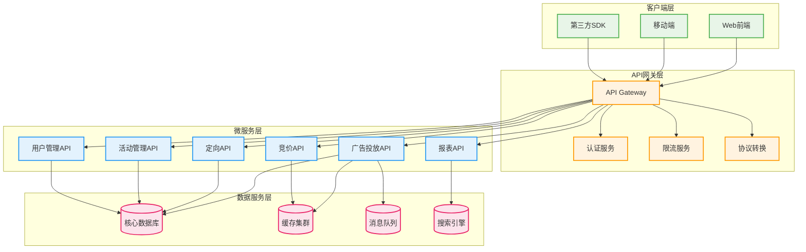
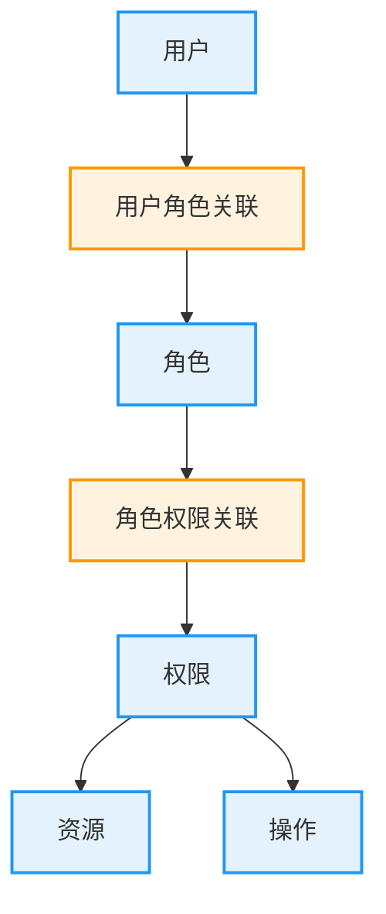

# 广告投放引擎API设计规范

## 1. 设计概述

### 1.1 设计目标

制定统一的API设计规范，确保广告投放引擎各个服务间的接口一致性、可维护性和可扩展性，提供清晰的API文档和最佳实践指导。

### 1.2 设计原则

- **RESTful风格**: 遵循REST架构风格，使用标准HTTP方法
- **版本控制**: 通过URL版本控制支持API演进
- **统一响应**: 标准化的响应格式和错误处理
- **安全性**: 完整的认证授权和数据安全保护
- **性能优化**: 支持缓存、分页、压缩等性能优化
- **可观测性**: 完整的日志记录和链路追踪

### 1.3 技术规范

- **协议**: HTTPS (TLS 1.2+)
- **数据格式**: JSON
- **字符编码**: UTF-8
- **压缩**: Gzip
- **认证**: JWT Bearer Token
- **API版本**: URL路径版本控制

## 2. API架构设计

### 2.1 服务架构



### 2.2 API分层设计

#### 接口分层策略
| 层次      | 职责               | 特点               | 示例                  |
| --------- | ------------------ | ------------------ | --------------------- |
| 网关层API | 统一入口、路由转发 | 高可用、负载均衡   | /api/gateway/v1/*     |
| 业务层API | 核心业务逻辑       | 领域驱动、微服务   | /api/campaigns/v1/*   |
| 数据层API | 数据访问操作       | 高性能、事务性     | /api/data/v1/*        |
| 集成层API | 第三方系统集成     | 协议适配、数据转换 | /api/integration/v1/* |

### 2.3 URL设计规范

#### URL结构标准
**标准格式**: `https://{domain}/api/{service}/{version}/{resource}`

**示例说明**:
- `https://api.adsp.com/api/campaigns/v1/campaigns` - 广告活动列表
- `https://api.adsp.com/api/bidding/v1/bid-requests` - 竞价请求
- `https://api.adsp.com/api/targeting/v1/audiences` - 受众定向
- `https://api.adsp.com/api/reporting/v1/analytics` - 数据分析

#### 资源命名规范
**命名原则**:
- 使用名词复数形式表示资源集合
- 使用小写字母和连字符分隔
- 避免动词，通过HTTP方法表达操作
- 层次结构表示资源关系

**层次资源示例**:
| 资源路径                                  | 说明         | HTTP方法         |
| ----------------------------------------- | ------------ | ---------------- |
| `/campaigns`                              | 广告活动集合 | GET, POST        |
| `/campaigns/{id}`                         | 特定广告活动 | GET, PUT, DELETE |
| `/campaigns/{id}/creatives`               | 活动下的创意 | GET, POST        |
| `/campaigns/{id}/creatives/{creative_id}` | 特定创意     | GET, PUT, DELETE |

## 3. HTTP方法规范

### 3.1 标准HTTP方法

#### 方法语义定义
| HTTP方法 | 语义       | 幂等性 | 安全性 | 使用场景             |
| -------- | ---------- | ------ | ------ | -------------------- |
| GET      | 获取资源   | 是     | 是     | 查询数据、获取列表   |
| POST     | 创建资源   | 否     | 否     | 创建新资源、提交数据 |
| PUT      | 更新资源   | 是     | 否     | 完整更新、覆盖资源   |
| PATCH    | 部分更新   | 否     | 否     | 字段级别的部分更新   |
| DELETE   | 删除资源   | 是     | 否     | 删除资源、逻辑删除   |
| HEAD     | 获取元数据 | 是     | 是     | 检查资源存在性       |
| OPTIONS  | 获取选项   | 是     | 是     | CORS预检、API发现    |

### 3.2 操作设计模式

#### CRUD操作映射
**标准CRUD操作**:
- **Create**: `POST /api/campaigns/v1/campaigns`
- **Read**: `GET /api/campaigns/v1/campaigns/{id}`
- **Update**: `PUT /api/campaigns/v1/campaigns/{id}`
- **Delete**: `DELETE /api/campaigns/v1/campaigns/{id}`

#### 复杂操作设计
**批量操作**:
- 批量创建: `POST /api/campaigns/v1/campaigns/batch`
- 批量更新: `PUT /api/campaigns/v1/campaigns/batch`
- 批量删除: `DELETE /api/campaigns/v1/campaigns/batch`

**动作操作**:
- 启动活动: `POST /api/campaigns/v1/campaigns/{id}/start`
- 暂停活动: `POST /api/campaigns/v1/campaigns/{id}/pause`
- 审核活动: `POST /api/campaigns/v1/campaigns/{id}/review`

## 4. 请求响应设计

### 4.1 请求格式规范

#### 请求头标准
**必需请求头**:
| 请求头        | 值               | 说明         |
| ------------- | ---------------- | ------------ |
| Authorization | Bearer {token}   | JWT认证令牌  |
| Content-Type  | application/json | 请求内容类型 |
| Accept        | application/json | 期望响应类型 |
| User-Agent    | {client_info}    | 客户端标识   |
| X-Request-ID  | {uuid}           | 请求唯一标识 |

#### 请求体设计
**JSON格式要求**:
- 使用驼峰命名法(camelCase)
- 避免嵌套层次过深(≤3层)
- 必填字段明确标识
- 数据类型严格匹配

### 4.2 响应格式规范

#### 统一响应结构
**成功响应格式**:
```json
{
  "success": true,
  "code": "200",
  "message": "操作成功",
  "data": {
    // 业务数据
  },
  "pagination": {
    "page": 1,
    "size": 20,
    "total": 100,
    "pages": 5
  },
  "timestamp": "2023-12-01T10:30:00Z",
  "requestId": "550e8400-e29b-41d4-a716-446655440000"
}
```

**错误响应格式**:
```json
{
  "success": false,
  "code": "4001",
  "message": "参数验证失败",
  "errors": [
    {
      "field": "campaignName",
      "code": "REQUIRED",
      "message": "活动名称不能为空"
    }
  ],
  "timestamp": "2023-12-01T10:30:00Z",
  "requestId": "550e8400-e29b-41d4-a716-446655440000"
}
```

#### 响应状态码规范
**HTTP状态码使用标准**:
| 状态码 | 含义       | 使用场景             |
| ------ | ---------- | -------------------- |
| 200    | 成功       | 操作成功完成         |
| 201    | 已创建     | 资源创建成功         |
| 204    | 无内容     | 删除成功，无返回内容 |
| 400    | 请求错误   | 参数错误、格式错误   |
| 401    | 未授权     | 认证失败、令牌无效   |
| 403    | 禁止访问   | 权限不足             |
| 404    | 未找到     | 资源不存在           |
| 409    | 冲突       | 资源冲突、重复操作   |
| 422    | 不可处理   | 业务逻辑错误         |
| 429    | 请求过多   | 限流触发             |
| 500    | 服务器错误 | 内部系统错误         |
| 503    | 服务不可用 | 服务维护、过载       |

## 5. 错误处理设计

### 5.1 错误码体系

#### 错误码分类标准
**错误码格式**: `{类别}{子类别}{序号}`
- 类别: 1位数字 (1-通用, 2-认证, 3-业务, 4-外部, 5-系统)
- 子类别: 1位数字 (0-9)
- 序号: 2位数字 (01-99)

#### 错误类别定义
| 错误类别 | 错误码范围 | 说明                 | 示例                |
| -------- | ---------- | -------------------- | ------------------- |
| 通用错误 | 1000-1999  | 参数、格式、资源相关 | 1001-参数无效       |
| 认证错误 | 2000-2999  | 身份认证、权限相关   | 2001-未授权访问     |
| 业务错误 | 3000-3999  | 业务逻辑、规则相关   | 3001-预算不足       |
| 外部错误 | 4000-4999  | 第三方服务相关       | 4001-支付服务异常   |
| 系统错误 | 5000-5999  | 系统内部错误         | 5001-数据库连接失败 |

### 5.2 国际化支持

#### 多语言错误消息
**消息结构设计**:
- 错误代码统一
- 消息模板化
- 参数化支持
- 本地化资源

**支持语言**:
- 中文简体 (zh-CN)
- 中文繁体 (zh-TW)
- 英文 (en-US)
- 日文 (ja-JP)

## 6. 认证授权设计

### 6.1 JWT认证机制

#### Token结构设计
**JWT组成部分**:
- **Header**: 算法类型和令牌类型
- **Payload**: 用户信息和权限声明
- **Signature**: 签名验证数据完整性

#### 权限模型设计
**RBAC权限体系**:


### 6.2 API权限控制

#### 权限验证流程
**验证步骤**:
1. Token有效性验证
2. 用户身份确认
3. 权限范围检查
4. 资源访问授权
5. 操作级别验证

#### 权限粒度设计
| 权限级别   | 控制范围     | 示例                 |
| ---------- | ------------ | -------------------- |
| 系统级权限 | 全局系统功能 | 系统配置、用户管理   |
| 模块级权限 | 功能模块访问 | 广告管理、报表查看   |
| 数据级权限 | 数据范围控制 | 只能查看自己的广告   |
| 操作级权限 | 具体操作控制 | 可读不可写、审批权限 |

## 7. 性能优化设计

### 7.1 缓存策略

#### 缓存层次设计
**多级缓存架构**:
- **浏览器缓存**: 静态资源、API响应缓存
- **CDN缓存**: 全局内容分发缓存
- **网关缓存**: API网关层响应缓存  
- **应用缓存**: 业务数据内存缓存
- **数据库缓存**: 查询结果缓存

#### HTTP缓存控制
**缓存头设置**:
| 缓存头        | 值                   | 适用场景          |
| ------------- | -------------------- | ----------------- |
| Cache-Control | public, max-age=3600 | 公共数据1小时缓存 |
| Cache-Control | private, max-age=300 | 用户数据5分钟缓存 |
| Cache-Control | no-cache             | 实时数据不缓存    |
| ETag          | "version-hash"       | 内容版本控制      |
| Last-Modified | "datetime"           | 最后修改时间      |

### 7.2 分页设计

#### 分页参数标准
**查询参数**:
| 参数名 | 类型    | 默认值 | 最大值 | 说明               |
| ------ | ------- | ------ | ------ | ------------------ |
| page   | integer | 1      | -      | 页码(从1开始)      |
| size   | integer | 20     | 100    | 每页条数           |
| sort   | string  | -      | -      | 排序字段           |
| order  | string  | asc    | -      | 排序方向(asc/desc) |

#### 游标分页设计
**大数据量分页优化**:
- 使用游标(cursor)替代offset
- 基于唯一标识符分页
- 支持向前向后翻页
- 避免深度分页性能问题

### 7.3 压缩优化

#### 内容压缩策略
**压缩算法选择**:
- **Gzip**: 通用压缩，兼容性好
- **Brotli**: 更高压缩率，现代浏览器支持
- **自适应压缩**: 根据客户端能力选择

**压缩配置**:
| 内容类型 | 压缩算法 | 压缩阈值 | 压缩级别 |
| -------- | -------- | -------- | -------- |
| JSON数据 | Gzip     | 1KB      | 6        |
| 文本内容 | Brotli   | 512B     | 4        |
| 静态资源 | Gzip     | 2KB      | 9        |

## 8. API文档设计

### 8.1 文档规范

#### OpenAPI规范
**文档结构要求**:
- 使用OpenAPI 3.0标准
- 完整的接口描述
- 请求响应示例
- 错误码说明
- 认证方式说明

#### 文档内容标准
**必需文档内容**:
- API概述和使用说明
- 认证和授权指南
- 接口详细说明
- 请求响应示例
- 错误码参考
- SDK和工具支持
- 变更日志

### 8.2 文档生成

#### 自动化文档生成
**生成工具链**:
- 代码注释生成文档
- 接口测试用例生成示例
- 持续集成自动更新
- 多版本文档管理

#### 交互式文档
**功能特性**:
- 在线API测试
- 参数自动补全
- 响应结果展示
- 代码示例生成
- 多语言SDK支持

## 9. 版本管理设计

### 9.1 版本控制策略

#### 语义化版本控制
**版本号格式**: `v{major}.{minor}.{patch}`
- **major**: 不兼容的API修改
- **minor**: 向下兼容的功能性新增
- **patch**: 向下兼容的问题修正

#### 版本生命周期
**版本管理阶段**:
| 阶段   | 状态       | 维护策略       | 时间周期  |
| ------ | ---------- | -------------- | --------- |
| 开发版 | Alpha      | 功能开发       | 2-4周     |
| 测试版 | Beta       | 测试修复       | 2-3周     |
| 稳定版 | Stable     | 维护更新       | 12-18个月 |
| 废弃版 | Deprecated | 只修复关键问题 | 6个月     |
| 下线版 | EOL        | 不再维护       | -         |

### 9.2 兼容性策略

#### 向后兼容原则
**兼容性规则**:
- 新增字段不影响现有客户端
- 删除字段需要渐进式废弃
- 修改字段需要保持语义一致
- 错误码变更需要充分通知

#### 迁移支持
**版本迁移机制**:
- 版本映射和转换
- 迁移工具提供
- 详细迁移指南
- 技术支持服务

## 10. 监控与追踪

### 10.1 API监控

#### 关键指标监控
**性能指标**:
| 指标名称 | 监控维度    | 告警阈值 | 统计周期 |
| -------- | ----------- | -------- | -------- |
| 响应时间 | P50/P95/P99 | P95>2s   | 1分钟    |
| 请求量   | QPS         | >10000/s | 1分钟    |
| 错误率   | 4xx/5xx比例 | >5%      | 5分钟    |
| 可用性   | 服务健康度  | <99.9%   | 5分钟    |
| 并发数   | 活跃连接数  | >5000    | 1分钟    |

#### 业务指标监控
**业务维度监控**:
- API调用分布
- 客户端使用统计
- 功能使用热度
- 错误模式分析
- 性能趋势分析

### 10.2 链路追踪

#### 分布式追踪
**追踪数据结构**:
- 请求唯一标识(TraceID)
- 服务调用树(SpanID)
- 调用时序信息
- 错误和异常记录
- 性能瓶颈分析

#### 追踪数据利用
**应用场景**:
- 性能瓶颈定位
- 错误根因分析
- 调用链路优化
- 服务依赖梳理
- 容量规划支撑

## 11. 安全设计

### 11.1 API安全策略

#### 输入验证
**验证机制**:
- 参数类型和格式验证
- 数据长度和范围检查
- 特殊字符过滤和转义
- SQL注入和XSS防护
- 文件上传安全检查

#### 输出安全
**输出保护**:
- 敏感数据脱敏
- 信息泄露防护
- 响应头安全设置
- 内容类型验证
- 缓存敏感控制

### 11.2 限流与防护

#### 限流策略设计
**限流维度**:
| 限流类型 | 限流粒度 | 限流阈值      | 时间窗口   |
| -------- | -------- | ------------- | ---------- |
| 用户限流 | 用户ID   | 1000次/分钟   | 滑动窗口   |
| IP限流   | IP地址   | 500次/分钟    | 固定窗口   |
| 接口限流 | API路径  | 10000次/分钟  | 令牌桶     |
| 全局限流 | 集群级别 | 100000次/分钟 | 分布式限流 |

#### DDoS防护
**防护措施**:
- 异常流量检测
- 自动封禁机制
- 挑战响应验证
- 流量清洗服务
- CDN防护加速

## 12. 总结

### 12.1 API设计优势

本广告投放引擎API设计规范通过统一的设计原则和最佳实践，为系统提供了标准化的接口体系：

**技术架构优势**:
- **标准化设计**: 遵循RESTful和行业最佳实践
- **安全性保障**: 多层次的安全控制和防护机制
- **高性能优化**: 缓存、压缩、分页等性能优化策略
- **可扩展性**: 支持版本演进和功能扩展
- **可观测性**: 完整的监控、追踪和文档体系

**开发效率提升**:
- **一致性体验**: 统一的接口风格和响应格式
- **文档完整**: 自动化的API文档生成和维护
- **工具支持**: SDK生成和测试工具支持
- **版本管理**: 清晰的版本策略和兼容性保障
- **错误处理**: 标准化的错误码和国际化支持

### 12.2 持续改进建议

#### 技术演进方向
- **GraphQL支持**: 引入GraphQL提供更灵活的数据查询
- **实时API**: 支持WebSocket和Server-Sent Events
- **API网关增强**: 更智能的路由、限流和安全控制
- **微服务治理**: 更完善的服务发现和治理机制

#### 生态建设方向
- **开发者社区**: 建设活跃的开发者社区和生态
- **合作伙伴集成**: 标准化的合作伙伴接入流程
- **API市场**: 构建API服务市场和计费体系
- **行业标准**: 推动行业API标准的制定和普及

API设计规范作为广告投放引擎的接口标准，需要在业务发展过程中持续完善和优化。通过标准化的设计原则、完善的安全保障、高效的性能优化和全面的治理体系，确保API服务能够为客户和合作伙伴提供稳定、安全、高效的接入体验，支撑广告技术生态的繁荣发展。
