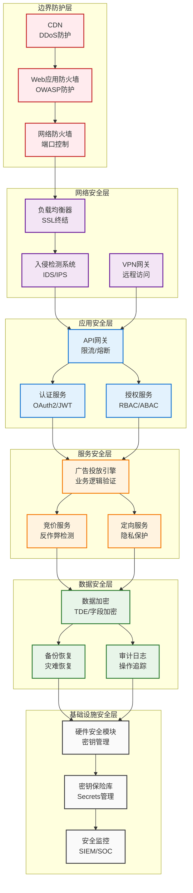
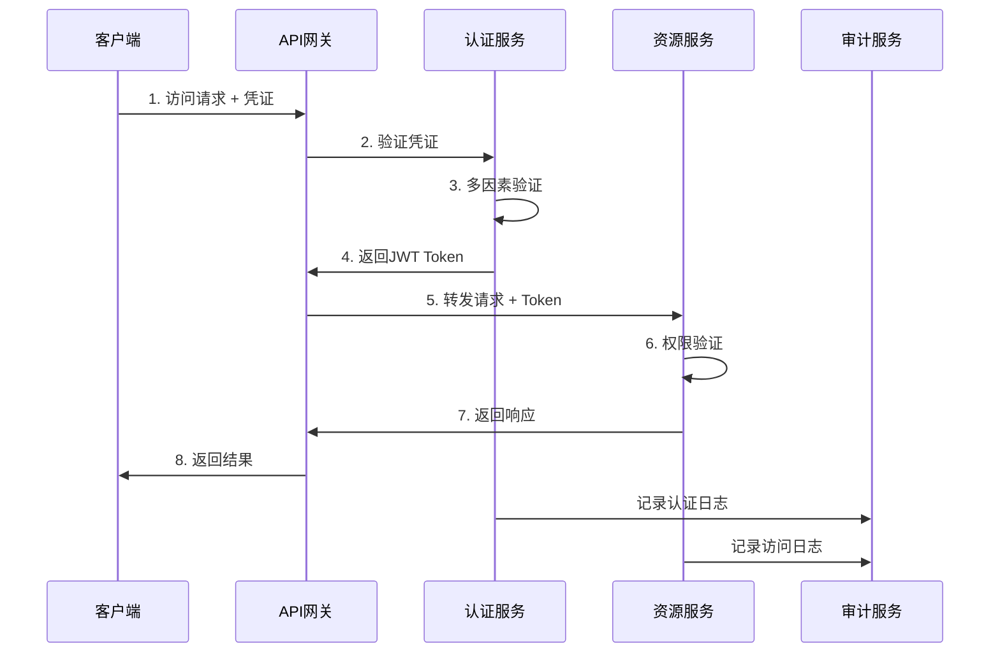
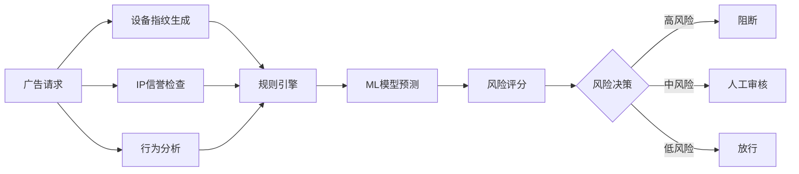
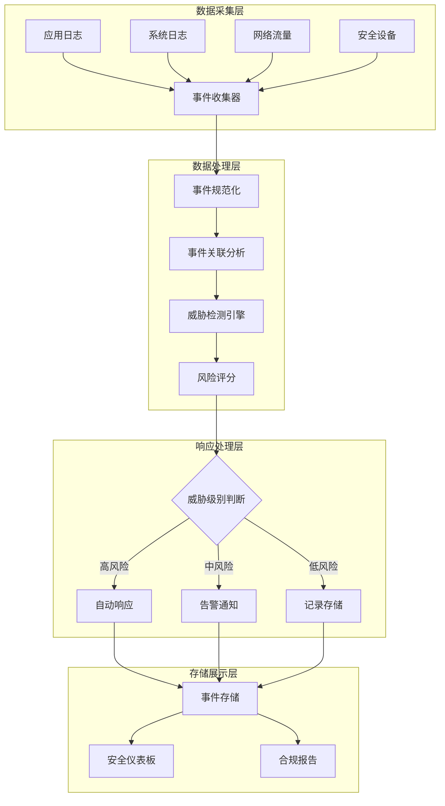
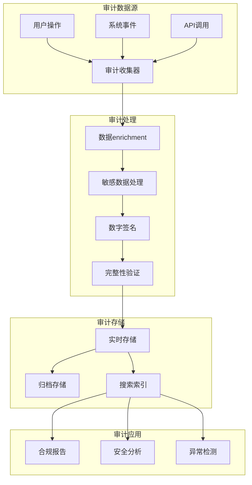
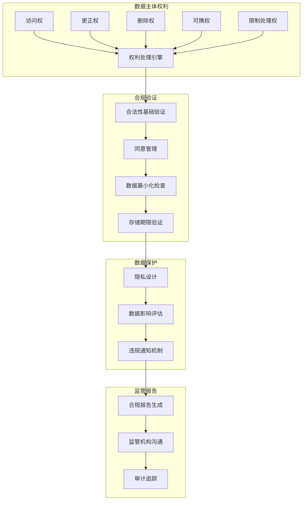
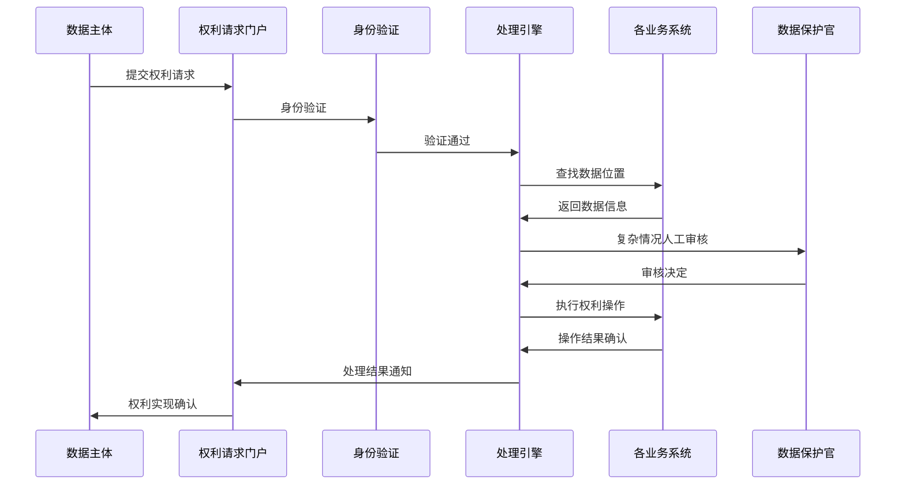
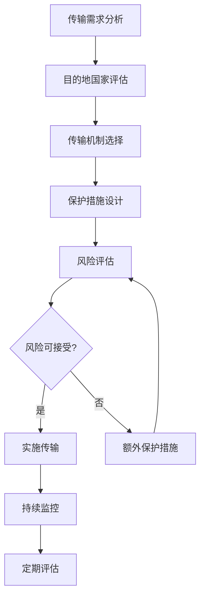

# 广告投放引擎安全架构设计

## 1. 设计概述

### 1.1 安全目标

构建多层次、纵深防御的安全架构，确保广告投放引擎在面对各种安全威胁时能够提供可靠的数据保护、访问控制和业务连续性保障。

### 1.2 安全原则

- **零信任架构**: 默认不信任，持续验证和授权
- **最小权限原则**: 用户和服务仅获得必需的最小权限
- **纵深防御**: 多层安全控制，单点失效不影响整体安全
- **数据保护**: 敏感数据的全生命周期保护
- **可审计性**: 完整的安全审计日志和合规跟踪
- **安全左移**: 在开发阶段就集成安全控制

### 1.3 威胁模型

#### 主要威胁类型

| 威胁类型 | 威胁描述           | 风险等级 | 影响范围   | 防护措施            |
| -------- | ------------------ | -------- | ---------- | ------------------- |
| DDoS攻击 | 分布式拒绝服务攻击 | 高       | 服务可用性 | 流量清洗、限流、CDN |
| SQL注入  | 恶意SQL代码注入    | 高       | 数据泄露   | 参数化查询、WAF     |
| XSS攻击  | 跨站脚本攻击       | 中       | 用户会话   | 输入验证、CSP       |
| 数据泄露 | 敏感数据未授权访问 | 高       | 用户隐私   | 加密、访问控制      |
| 身份伪造 | 用户身份冒用       | 高       | 系统完整性 | 多因素认证          |
| API滥用  | 恶意API调用        | 中       | 资源消耗   | 限流、监控          |
| 内部威胁 | 内部人员恶意操作   | 中       | 数据安全   | 权限分离、审计      |

## 2. 安全架构设计

### 2.1 安全架构图



### 2.2 安全域划分

#### 网络安全域

| 安全域   | 信任级别 | 部署组件          | 访问控制   | 监控级别 |
| -------- | -------- | ----------------- | ---------- | -------- |
| 公网区域 | 不信任   | CDN、WAF          | 严格过滤   | 实时监控 |
| DMZ区域  | 低信任   | 负载均衡、API网关 | 白名单访问 | 高级监控 |
| 应用区域 | 中信任   | 业务服务          | 服务认证   | 标准监控 |
| 数据区域 | 高信任   | 数据库、缓存      | 强制加密   | 严密监控 |
| 管理区域 | 最高信任 | 管理工具、监控    | 多因素认证 | 完整审计 |

## 3. 身份认证与访问控制设计

### 3.1 多层认证架构设计

#### 认证流程架构


#### 认证服务架构设计
**多因素认证机制**
- **第一因素**：用户名密码 + 密码强度策略
- **第二因素**：TOTP动态令牌 + 硬件Token支持
- **第三因素**：生物识别 + 设备信任管理

**认证流程控制**
1. **基础凭证验证**：用户名密码验证和账户状态检查
2. **多因素认证**：根据风险级别动态启用MFA
3. **设备信任检查**：基于设备指纹的信任评估
4. **会话管理**：JWT令牌生成和会话状态维护
5. **审计记录**：完整的认证过程审计日志

**安全增强措施**
- 账户锁定策略：连续失败后自动锁定
- 密码防暴力破解：渐进式延迟机制
- 设备指纹识别：异常设备访问检测
- 地理位置验证：异常地理位置访问告警

### 3.2 JWT令牌管理设计

#### JWT令牌架构规范
**Token结构设计**
| 组件      | 内容               | 安全要求         |
| --------- | ------------------ | ---------------- |
| Header    | 算法类型、令牌类型 | 使用安全签名算法 |
| Payload   | 用户信息、权限声明 | 避免敏感信息明文 |
| Signature | 数字签名           | 强密钥管理和轮换 |

**核心Claims定义**
| Claim     | 类型   | 描述         | 必需 |
| --------- | ------ | ------------ | ---- |
| sub       | string | 用户唯一标识 | 是   |
| iss       | string | 令牌签发者   | 是   |
| aud       | string | 令牌受众     | 是   |
| exp       | number | 过期时间戳   | 是   |
| iat       | number | 签发时间戳   | 是   |
| jti       | string | 令牌唯一ID   | 是   |
| scope     | string | 权限范围     | 是   |
| role      | string | 用户角色     | 是   |
| tenant_id | string | 租户标识     | 否   |

**令牌生命周期管理**
- **短期访问令牌**：15-60分钟有效期，用于API访问
- **长期刷新令牌**：7-30天有效期，用于令牌刷新
- **令牌黑名单**：支持令牌主动撤销和黑名单管理
- **自动刷新机制**：无感知的令牌自动刷新

### 3.3 基于角色的访问控制(RBAC)设计

#### RBAC模型架构
**角色权限模型**
```
用户(User) ←→ 用户角色(UserRole) ←→ 角色(Role) ←→ 角色权限(RolePermission) ←→ 权限(Permission)
```

**核心实体设计**
| 实体       | 属性                    | 描述             |
| ---------- | ----------------------- | ---------------- |
| User       | ID, Username, Email     | 系统用户基本信息 |
| Role       | ID, Name, Description   | 角色定义和描述   |
| Permission | Resource, Action, Scope | 具体权限定义     |
| UserRole   | UserId, RoleId, Scope   | 用户角色关联     |

**权限资源分类**
| 资源类型  | 操作权限                   | 权限标识        | 说明         |
| --------- | -------------------------- | --------------- | ------------ |
| campaigns | read, write, delete, admin | campaigns:read  | 广告活动管理 |
| creatives | read, write, delete, admin | creatives:write | 广告创意管理 |
| reports   | view, export, admin        | reports:view    | 报表查看权限 |
| settings  | config, admin              | settings:config | 系统配置权限 |
| users     | read, write, admin         | users:admin     | 用户管理权限 |

**权限验证机制**
- **权限继承**：支持角色层次结构和权限继承
- **权限聚合**：用户最终权限为所有角色权限的并集
- **权限缓存**：15分钟权限缓存提升验证性能
- **权限审计**：所有权限验证过程的审计记录

### 3.4 基于属性的访问控制(ABAC)设计

#### ABAC策略引擎架构
**策略评估模型**
```
AccessRequest → PolicyEngine → [Policy1, Policy2, ...] → CombinedDecision
```

**属性分类设计**
| 属性类别 | 属性示例                   | 用途描述           |
| -------- | -------------------------- | ------------------ |
| 主体属性 | 用户角色、部门、级别       | 描述访问者特征     |
| 资源属性 | 数据分类、所有者、敏感级别 | 描述被访问资源特征 |
| 动作属性 | 操作类型、时间、方式       | 描述访问行为特征   |
| 环境属性 | 时间、地点、设备、网络     | 描述访问环境特征   |

**策略表达式设计**
- **条件语法**：支持逻辑运算符(AND、OR、NOT)
- **比较操作**：支持等于、大于、小于、包含等比较
- **函数支持**：支持时间、字符串、数学函数
- **变量引用**：支持属性变量和常量定义

**策略示例**
```
策略1：广告主只能访问自己的活动
"subject.role == 'advertiser' AND resource.type == 'campaign' AND resource.owner == subject.id"

策略2：工作时间内的数据访问
"action == 'read' AND environment.time >= '09:00' AND environment.time <= '18:00'"

策略3：基于数据分类的访问控制
"subject.clearance_level >= resource.classification_level"
```

**决策组合策略**
- **Deny优先**：任何Deny决策都会拒绝访问
- **Permit优先**：任何Permit决策都会允许访问
- **第一适用**：使用第一个匹配策略的决策
- **加权评估**：基于策略优先级进行加权决策


## 4. 数据安全保护设计

### 4.1 数据加密架构设计

#### 加密策略框架
**多层加密设计**
- **传输层加密**：TLS 1.3端到端加密，确保数据传输安全
- **应用层加密**：业务敏感数据字段级加密
- **存储层加密**：数据库TDE透明加密和文件系统加密
- **密钥层加密**：硬件安全模块(HSM)密钥保护

**加密算法选择**
| 加密类型   | 算法        | 密钥长度 | 应用场景     |
| ---------- | ----------- | -------- | ------------ |
| 对称加密   | AES-256-GCM | 256位    | 数据字段加密 |
| 非对称加密 | RSA-4096    | 4096位   | 密钥交换     |
| 哈希算法   | SHA-256     | 256位    | 数据完整性   |
| 数字签名   | ECDSA-P256  | 256位    | 数据签名     |

#### 敏感数据加密设计
**数据分类加密策略**
| 数据类型 | 加密方式      | 密钥管理   | 访问控制     |
| -------- | ------------- | ---------- | ------------ |
| 用户PII  | 字段级AES加密 | 专用密钥   | 严格权限控制 |
| 财务信息 | 字段级AES加密 | 金融密钥   | 多重验证     |
| 业务数据 | 表级TDE加密   | 数据库密钥 | 角色访问控制 |
| 日志数据 | 批量加密存储  | 归档密钥   | 只读访问     |

**加密服务架构**
- **密钥管理服务**：集中式密钥生成、分发、轮换
- **加密代理服务**：透明的加解密代理层
- **密钥轮换机制**：定期自动密钥轮换和版本管理
- **密钥恢复机制**：安全的密钥备份和恢复流程

### 4.2 数据脱敏设计

#### 脱敏策略架构
**多场景脱敏设计**
- **开发测试环境**：生产数据的脱敏副本
- **报表展示**：敏感字段的实时脱敏
- **日志输出**：自动检测和脱敏敏感信息
- **数据分析**：保留数据特征的统计脱敏

**脱敏算法策略**
| 数据类型 | 脱敏方法     | 脱敏效果           | 保留特征     |
| -------- | ------------ | ------------------ | ------------ |
| 邮箱地址 | 中间字符替换 | u***@domain.com    | 长度、域名   |
| 手机号码 | 中间数字替换 | 138****5678        | 前缀、长度   |
| 身份证号 | 分段替换     | 1101**********1234 | 地区、校验位 |
| 银行卡号 | 保留前后4位  | 6222****1234       | 银行标识     |
| 姓名     | 姓氏保留     | 张**               | 姓氏特征     |

#### 动态脱敏机制
**基于角色的脱敏**
- **管理员角色**：可查看完整敏感数据
- **业务角色**：查看部分脱敏数据
- **分析角色**：查看完全脱敏数据
- **访客角色**：无法查看敏感数据

**上下文感知脱敏**
- **业务场景判断**：根据具体业务场景选择脱敏策略
- **数据用途分析**：基于数据使用目的调整脱敏级别
- **时间维度控制**：不同时间段的差异化脱敏策略

### 4.3 数据分类与标记设计

#### 数据分类框架
**数据敏感度分级**
| 敏感级别           | 描述               | 示例数据           | 保护要求     |
| ------------------ | ------------------ | ------------------ | ------------ |
| 公开(Public)       | 可公开访问的数据   | 产品介绍、公告     | 基础访问控制 |
| 内部(Internal)     | 仅内部使用的数据   | 业务统计、配置     | 员工访问控制 |
| 机密(Confidential) | 需要保护的敏感数据 | 用户信息、交易数据 | 加密存储传输 |
| 限制(Restricted)   | 高度敏感的核心数据 | 支付信息、身份证   | 最高级别保护 |

**数据分类标记机制**
- **自动分类**：基于数据内容和格式的自动识别
- **手动标记**：数据创建者手动指定分类级别
- **继承标记**：子数据继承父数据的分类标记
- **动态调整**：根据数据变化动态调整分类级别

#### 数据生命周期管理
**数据保留策略**
| 数据类型     | 保留期限 | 存储位置   | 销毁方式 |
| ------------ | -------- | ---------- | -------- |
| 用户行为日志 | 3年      | 冷存储     | 安全擦除 |
| 交易记录     | 7年      | 归档存储   | 物理销毁 |
| 临时数据     | 30天     | 临时存储   | 自动清理 |
| 缓存数据     | 24小时   | 内存/Redis | 自动过期 |

**数据流转控制**
- **数据标记传递**：数据流转过程中保持分类标记
- **跨境传输控制**：基于数据分类的跨境传输审批
- **第三方共享**：严格的数据共享协议和监控
- **数据血缘追踪**：完整的数据流转链路追踪

## 5. 反作弊与风控设计

### 5.1 反作弊架构设计

#### 多维度反作弊框架
**检测维度设计**
- **设备维度**：设备指纹、硬件特征、环境参数
- **网络维度**：IP地理位置、ISP信息、代理检测
- **行为维度**：访问模式、点击行为、时间分布
- **内容维度**：广告内容、着陆页、转化路径

**实时检测架构**


#### 作弊检测规则引擎
**规则分类体系**
| 规则类型 | 检测对象   | 触发条件 | 处置措施  |
| -------- | ---------- | -------- | --------- |
| 频率规则 | 请求频率   | 超过阈值 | 限流/阻断 |
| 地理规则 | IP地理位置 | 异常地区 | 风险标记  |
| 设备规则 | 设备指纹   | 异常设备 | 设备封禁  |
| 行为规则 | 用户行为   | 异常模式 | 账户限制  |

**规则更新机制**
- **实时规则推送**：基于最新威胁情报更新规则
- **A/B测试验证**：新规则的小流量验证机制
- **效果评估反馈**：规则效果的持续监控和优化
- **规则版本管理**：规则变更的版本控制和回滚

### 5.2 设备指纹技术设计

#### 设备指纹体系架构
**多维度指纹采集**
| 指纹类型 | 采集方式           | 唯一性 | 稳定性 |
| -------- | ------------------ | ------ | ------ |
| 硬件指纹 | 设备ID、MAC地址    | 高     | 高     |
| 软件指纹 | 操作系统、浏览器   | 中     | 中     |
| 网络指纹 | IP、端口、协议     | 低     | 低     |
| 行为指纹 | 操作习惯、时间模式 | 中     | 中     |

**指纹生成算法**
- **特征提取**：从多维度数据中提取设备特征
- **特征融合**：多种特征的加权组合和归一化
- **哈希生成**：使用一致性哈希生成设备唯一标识
- **相似度计算**：基于汉明距离的设备相似度评估

#### 设备信任管理
**信任等级划分**
| 信任等级 | 描述           | 验证要求     | 访问权限 |
| -------- | -------------- | ------------ | -------- |
| 可信设备 | 长期使用的设备 | 无需额外验证 | 完整权限 |
| 已知设备 | 曾经使用的设备 | 短信验证     | 部分权限 |
| 新设备   | 首次使用的设备 | 多重验证     | 受限权限 |
| 可疑设备 | 异常行为设备   | 人工审核     | 拒绝访问 |

### 5.3 风险评分模型设计

#### 机器学习风险模型
**特征工程设计**
- **基础特征**：用户属性、设备信息、网络环境
- **统计特征**：历史行为统计、趋势分析
- **时序特征**：时间序列模式、周期性分析
- **图特征**：用户关系网络、设备关联图谱

**模型架构选择**
| 模型类型 | 应用场景   | 优势       | 局限性     |
| -------- | ---------- | ---------- | ---------- |
| 逻辑回归 | 实时评分   | 可解释性强 | 线性假设   |
| 随机森林 | 特征重要性 | 处理非线性 | 容易过拟合 |
| 神经网络 | 复杂模式   | 表达能力强 | 黑盒模型   |
| 集成模型 | 综合评分   | 性能稳定   | 计算复杂   |

#### 动态风险阈值
**自适应阈值调整**
- **业务场景适配**：不同业务场景的差异化阈值
- **时间周期调整**：基于时间模式的动态阈值
- **反馈优化**：基于人工审核结果的阈值优化
- **A/B测试验证**：新阈值的效果验证机制

## 6. 网络安全设计

### 6.1 DDoS防护设计

#### 分层防护架构
**多层防护体系**
- **边界防护层**：CDN分布式防护和流量清洗
- **网络防护层**：硬件防火墙和流量整形
- **应用防护层**：应用级限流和熔断机制
- **业务防护层**：业务逻辑验证和风险控制

**DDoS攻击分类与防护**
| 攻击类型   | 攻击特征   | 防护策略  | 防护效果 |
| ---------- | ---------- | --------- | -------- |
| SYN Flood  | TCP半连接  | SYN Proxy | 有效防护 |
| UDP Flood  | UDP包洪泛  | 流量限制  | 基础防护 |
| HTTP Flood | 应用层请求 | 行为分析  | 精准防护 |
| CC攻击     | 恶意爬虫   | 验证码    | 人机识别 |

#### 流量分析与检测
**异常流量识别**
- **基线建模**：正常流量模式的基线建立
- **异常检测**：基于统计学和机器学习的异常检测
- **模式识别**：已知攻击模式的快速识别
- **威胁情报**：外部威胁情报的集成和应用

### 6.2 WAF防护设计

#### Web应用防火墙架构
**防护规则体系**
- **OWASP Top 10防护**：针对常见Web漏洞的防护规则
- **自定义规则**：基于业务特点的定制化防护规则
- **威胁情报规则**：基于最新威胁情报的动态规则
- **机器学习规则**：基于行为分析的智能防护规则

**攻击检测与防护**
| 攻击类型 | 检测方法 | 防护措施 | 误报处理   |
| -------- | -------- | -------- | ---------- |
| SQL注入  | 模式匹配 | 请求阻断 | 白名单机制 |
| XSS攻击  | 内容分析 | 内容过滤 | 上下文分析 |
| 文件上传 | 文件检测 | 类型限制 | 沙箱扫描   |
| 爬虫识别 | 行为分析 | 频率限制 | 验证码验证 |

#### 自适应防护机制
**智能规则调优**
- **攻击模式学习**：从攻击流量中学习新的攻击模式
- **误报分析优化**：基于误报反馈的规则精度优化
- **性能影响评估**：规则对系统性能影响的评估
- **规则效果监控**：规则防护效果的实时监控


## 7. 安全监控与审计

### 7.1 安全事件监控设计

#### SIEM集成架构
**安全信息与事件管理系统架构**


**事件收集与处理流程**
| 处理阶段   | 处理内容               | 技术要求         | 性能指标        |
| ---------- | ---------------------- | ---------------- | --------------- |
| 事件采集   | 多源数据统一采集       | 支持多种日志格式 | >10K events/sec |
| 数据规范化 | 统一事件格式和字段     | 标准化数据模型   | <100ms延迟      |
| 事件关联   | 基于时间窗口的关联分析 | 时序数据库支持   | 10分钟窗口      |
| 威胁检测   | 规则引擎+ML模型        | 实时检测能力     | <500ms响应      |
| 风险评分   | 多维度风险量化         | 动态评分算法     | 0-1风险值       |

#### 事件关联分析设计
**关联分析维度**
- **时间维度**：同一时间窗口内的相关事件聚合
- **空间维度**：相同IP、地理位置的事件关联
- **身份维度**：同一用户、设备的行为轨迹分析
- **行为维度**：相似行为模式的事件聚类

**关联算法策略**
| 关联类型 | 关联键    | 时间窗口 | 阈值设置        |
| -------- | --------- | -------- | --------------- |
| IP关联   | 源IP地址  | 10分钟   | 频率>100/min    |
| 用户关联 | 用户ID    | 30分钟   | 异常行为>5次    |
| 设备关联 | 设备指纹  | 60分钟   | 设备变化>3个    |
| 地理关联 | GeoIP位置 | 24小时   | 地理跳跃>1000km |

#### 威胁检测引擎设计
**检测模型架构**
- **规则引擎**：基于预定义规则的实时检测
- **异常检测**：基于统计学的异常行为识别
- **机器学习**：基于历史数据的模式学习
- **威胁情报**：基于外部情报的威胁匹配

**风险评分算法**
| 评分因子 | 权重 | 计算方式       | 评分范围 |
| -------- | ---- | -------------- | -------- |
| 基础风险 | 30%  | 事件类型基础分 | 0-0.3    |
| 频率风险 | 25%  | 频率异常程度   | 0-0.25   |
| 地理风险 | 20%  | 地理位置异常   | 0-0.2    |
| 行为风险 | 25%  | 行为模式异常   | 0-0.25   |

**威胁级别定义**
| 威胁级别 | 风险分值 | 响应策略          | 处理时效 |
| -------- | -------- | ----------------- | -------- |
| 极危险   | 0.8-1.0  | 立即阻断+人工处理 | 5分钟内  |
| 高危险   | 0.6-0.8  | 自动响应+告警     | 15分钟内 |
| 中危险   | 0.4-0.6  | 告警通知+记录     | 1小时内  |
| 低危险   | 0.2-0.4  | 记录监控          | 24小时内 |
| 信息级   | 0.0-0.2  | 仅记录            | 定期回顾 |


### 7.2 审计日志设计

#### 审计日志架构
**分层审计设计**


**审计日志分类**
| 审计类型     | 记录内容             | 存储策略        | 保留期限 |
| ------------ | -------------------- | --------------- | -------- |
| 用户行为审计 | 登录、操作、权限变更 | 实时存储+冷备份 | 7年      |
| 系统操作审计 | 配置变更、服务重启   | 实时存储        | 3年      |
| 数据访问审计 | 数据查询、修改、删除 | 加密存储        | 5年      |
| 安全事件审计 | 攻击尝试、异常行为   | 高可用存储      | 永久     |

#### 审计数据模型设计
**核心审计字段**
| 字段名     | 类型     | 必需 | 描述             | 示例                                 |
| ---------- | -------- | ---- | ---------------- | ------------------------------------ |
| audit_id   | string   | 是   | 审计记录唯一标识 | audit_20231201_001                   |
| timestamp  | datetime | 是   | 事件发生时间戳   | 2023-12-01T10:30:00Z                 |
| user_id    | string   | 是   | 操作用户标识     | user_12345                           |
| session_id | string   | 是   | 用户会话标识     | sess_abcdef123                       |
| action     | string   | 是   | 具体操作动作     | CREATE_CAMPAIGN                      |
| resource   | string   | 是   | 操作资源对象     | campaign/123456                      |
| result     | string   | 是   | 操作结果状态     | SUCCESS/FAILURE                      |
| ip_address | string   | 是   | 客户端IP地址     | 192.168.1.100                        |
| user_agent | string   | 否   | 客户端User-Agent | Chrome/98.0                          |
| details    | json     | 否   | 详细操作信息     | {"old_value": "A", "new_value": "B"} |
| risk_score | float    | 否   | 操作风险评分     | 0.75                                 |
| signature  | string   | 是   | 数字签名验证     | sha256_hash                          |

#### 审计日志处理流程
**数据enrichment过程**
1. **基础信息补充**：自动填充时间戳、会话信息、用户上下文
2. **地理位置解析**：基于IP地址解析地理位置和ISP信息
3. **设备信息识别**：解析User-Agent获取设备和浏览器信息
4. **风险评分计算**：基于行为模式计算操作风险评分
5. **关联信息附加**：关联相关的业务对象和历史操作

**敏感数据处理策略**
- **数据脱敏**：敏感字段的格式保留脱敏处理
- **哈希存储**：敏感数据的不可逆哈希存储
- **加密保护**：关键敏感数据的可恢复加密存储
- **访问控制**：基于权限的敏感数据访问控制

#### 审计完整性保护
**数字签名机制**
- **签名算法**：使用ECDSA-P256算法进行数字签名
- **签名内容**：包含关键审计字段的JSON序列化
- **密钥管理**：签名私钥存储在HSM中，定期轮换
- **验证机制**：审计查询时自动验证签名完整性

**防篡改设计**
- **只写模式**：审计日志只允许追加，不允许修改删除
- **区块链验证**：使用区块链技术确保审计链完整性
- **定时校验**：定期进行审计日志完整性校验
- **异常告警**：发现篡改或异常时立即告警

#### 审计查询与分析
**查询接口设计**
- **时间范围查询**：支持灵活的时间范围筛选
- **多维度筛选**：支持用户、操作、资源等多维度组合查询
- **全文搜索**：支持审计详情的全文检索
- **聚合分析**：支持统计分析和趋势分析

**合规报告生成**
| 报告类型     | 生成频率 | 包含内容           | 目标受众   |
| ------------ | -------- | ------------------ | ---------- |
| 用户活动报告 | 月度     | 用户登录、关键操作 | 管理员     |
| 数据访问报告 | 周度     | 敏感数据访问记录   | 数据保护官 |
| 安全事件报告 | 实时     | 安全威胁和响应     | 安全团队   |
| 合规审计报告 | 年度     | 全面合规状况       | 合规官     |


## 8. 合规性设计

### 8.1 GDPR合规设计

#### 数据处理合规架构
**GDPR合规框架**


**数据处理合法性基础**
| 合法性基础    | 适用场景       | 验证要求         | 撤回机制   |
| ------------- | -------------- | ---------------- | ---------- |
| 同意(Consent) | 营销推广、分析 | 明确、具体、知情 | 随时可撤回 |
| 合同履行      | 服务提供、交付 | 合同必需性       | 合同期限内 |
| 法律义务      | 财务记录、审计 | 法律强制要求     | 不可撤回   |
| 生命利益保护  | 紧急情况处理   | 生命安全必需     | 特殊情况   |
| 公共任务      | 公共服务提供   | 公共利益需要     | 监管决定   |
| 正当利益      | 业务运营、安全 | 利益平衡测试     | 可提出异议 |

#### 数据主体权利实现设计
**权利处理流程**


**数据主体权利响应时限**
| 权利类型   | 响应期限 | 复杂情况延期 | 拒绝通知要求 |
| ---------- | -------- | ------------ | ------------ |
| 访问权     | 1个月    | 可延期2个月  | 需说明理由   |
| 更正权     | 1个月    | 可延期2个月  | 需说明理由   |
| 删除权     | 1个月    | 可延期2个月  | 需说明理由   |
| 限制处理权 | 1个月    | 可延期2个月  | 需说明理由   |
| 数据携带权 | 1个月    | 可延期2个月  | 需说明理由   |

#### 同意管理设计
**同意记录模型**
| 字段名               | 类型     | 描述             | 示例                                       |
| -------------------- | -------- | ---------------- | ------------------------------------------ |
| consent_id           | string   | 同意记录唯一标识 | consent_20231201_001                       |
| data_subject_id      | string   | 数据主体标识     | user_12345                                 |
| processing_purpose   | string   | 处理目的         | marketing_analysis                         |
| data_categories      | array    | 数据类别         | ["personal_data", "behavioral_data"]       |
| consent_given        | boolean  | 是否给予同意     | true                                       |
| consent_timestamp    | datetime | 同意时间戳       | 2023-12-01T10:30:00Z                       |
| consent_method       | string   | 同意获取方式     | website_form                               |
| withdrawal_mechanism | string   | 撤回方式说明     | email_or_website                           |
| retention_period     | string   | 数据保留期限     | 2_years                                    |
| consent_evidence     | json     | 同意证据         | {"ip": "192.168.1.1", "user_agent": "..."} |

**同意获取最佳实践**
- **粒度化同意**：不同处理目的分别获取同意
- **明确语言**：使用简洁明了的语言说明用途
- **积极行为**：要求用户主动选择，避免预勾选
- **撤回便利**：提供简单易用的同意撤回机制
- **记录保存**：完整保存同意获取和撤回记录

#### 数据影响评估(DPIA)设计
**DPIA触发条件**
- **大规模处理**：大量个人数据的系统性处理
- **敏感数据**：特殊类别个人数据的处理
- **自动决策**：基于个人数据的自动决策
- **监控活动**：系统性监控公共区域
- **新技术应用**：使用新技术进行数据处理

**DPIA评估框架**
| 评估维度     | 评估内容               | 风险等级 | 缓解措施   |
| ------------ | ---------------------- | -------- | ---------- |
| 数据性质     | 数据敏感度、数量、范围 | 高/中/低 | 数据最小化 |
| 处理目的     | 目的合法性、必要性     | 高/中/低 | 目的限制   |
| 技术措施     | 加密、访问控制、匿名化 | 高/中/低 | 技术强化   |
| 组织措施     | 政策流程、培训、监督   | 高/中/低 | 流程完善   |
| 数据主体影响 | 权利限制、歧视风险     | 高/中/低 | 权利保障   |

### 8.2 数据跨境传输合规设计

#### 跨境传输合规框架
**充分性决定评估**
- **欧盟充分性国家**：直接允许的数据传输目的地
- **充分性待定国家**：需要额外保护措施的传输
- **非充分性国家**：需要特定传输机制的国家

**传输机制选择**
| 传输机制            | 适用场景       | 实施要求     | 监管批准 |
| ------------------- | -------------- | ------------ | -------- |
| 标准合同条款(SCC)   | 第三方服务商   | 签署标准合同 | 无需预批 |
| 约束性公司规则(BCR) | 集团内部传输   | 监管机构批准 | 需要批准 |
| 行为准则            | 行业特定传输   | 遵循行业准则 | 监管认证 |
| 认证机制            | 服务提供商认证 | 获得相关认证 | 认证有效 |
| 特定情况下的克减    | 紧急或特殊情况 | 满足特定条件 | 个案评估 |

#### 数据本地化要求
**本地化合规策略**
- **数据存储本地化**：个人数据存储在境内服务器
- **数据处理本地化**：数据处理活动在境内进行
- **数据出境审批**：遵循数据出境安全评估要求
- **本地代表委托**：在相关司法管辖区委托代表

**跨境传输影响评估(TIA)**


#### 数据处理协议(DPA)设计
**DPA核心条款**
- **处理目的和范围**：明确数据处理的具体目的和范围
- **数据类别和主体**：详细说明处理的数据类型和主体
- **技术组织措施**：具体的数据保护技术和管理措施
- **分处理商管理**：对进一步委托处理的管理要求
- **数据主体权利**：协助实现数据主体权利的义务
- **违规通知**：数据违规的发现和通知机制
- **审计和监督**：定期审计和合规性监督要求

### 8.3 其他合规框架

#### CCPA合规设计
**加州消费者隐私法合规要点**
- **透明度要求**：提供详细的隐私政策和数据使用说明
- **消费者权利**：访问、删除、不出售个人信息的权利
- **选择退出机制**：明显的"不要出售我的个人信息"链接
- **数据最小化**：仅收集和使用必要的个人信息
- **第三方披露**：明确披露向第三方出售或共享的信息

#### SOX合规设计
**萨班斯-奥克斯利法案合规**
- **内部控制**：建立和维护有效的财务报告内部控制
- **管理层认证**：管理层对财务报告准确性的认证
- **审计师独立性**：确保外部审计师的独立性
- **关键人员认证**：CEO和CFO对财务报告的个人认证
- **举报人保护**：建立安全的举报机制和保护措施

#### PCI DSS合规设计
**支付卡行业数据安全标准合规**
- **网络安全**：建立和维护安全的网络和系统
- **数据保护**：保护存储的持卡人数据
- **漏洞管理**：维护漏洞管理程序
- **访问控制**：实施强访问控制措施
- **网络监控**：定期监控和测试网络
- **信息安全政策**：维护解决信息安全的政策

## 9. 总结

### 9.1 安全架构优势

本广告投放引擎安全架构通过多层次、全方位的安全设计，为广告业务提供了坚实的安全保障基础：

**技术架构优势**
- **纵深防御体系**：从边界到应用的六层安全防护，单点失效不影响整体安全
- **零信任架构**：默认不信任原则，持续验证每个访问请求的合法性
- **智能威胁检测**：结合规则引擎、异常检测和机器学习的多维威胁识别
- **实时响应能力**：毫秒级威胁检测和自动化响应机制
- **弹性扩展设计**：支持业务增长的水平扩展和性能优化

**业务价值体现**
- **数据安全保障**：全生命周期的数据保护，确保用户隐私和商业机密安全
- **合规风险控制**：满足GDPR、CCPA等国际法规要求，降低合规风险
- **业务连续性**：高可用架构设计确保广告投放业务7×24小时稳定运行
- **运营效率提升**：自动化安全控制减少人工干预，提升运营效率
- **成本效益优化**：统一安全平台降低安全运营总成本

### 9.2 关键安全能力

#### 身份与访问管理能力
- **多因素认证**：支持密码、动态令牌、生物识别的组合认证
- **精细权限控制**：基于RBAC和ABAC的灵活权限管理机制
- **会话安全管理**：JWT令牌的安全生成、刷新和撤销机制
- **设备信任管理**：设备指纹识别和信任等级评估

#### 数据保护能力
- **端到端加密**：传输层TLS 1.3和存储层AES-256-GCM加密
- **动态数据脱敏**：基于角色和上下文的敏感数据脱敏
- **数据分类标记**：自动化的数据敏感度分级和标记管理
- **生命周期管理**：数据从创建到销毁的全程保护控制

#### 威胁检测与响应能力
- **实时监控分析**：SIEM系统的实时事件收集和关联分析
- **智能反作弊**：多维度设备指纹和行为模式分析
- **自动化响应**：基于威胁级别的分级自动响应机制
- **溯源取证支持**：完整的安全审计链和数字签名验证

#### 合规治理能力
- **隐私保护合规**：GDPR数据主体权利的完整技术实现
- **跨境传输管控**：数据跨境传输的合规评估和审批机制
- **审计追踪完整性**：防篡改的审计日志和合规报告生成
- **持续合规监控**：动态合规状态监控和风险预警

### 9.3 安全运营建议

#### 安全治理结构
**组织架构建议**
- **安全委员会**：由高管层组成的安全治理决策机构
- **安全运营团队**：7×24小时的安全监控和响应团队
- **数据保护官(DPO)**：负责隐私合规和数据保护的专职角色
- **安全架构师**：负责安全技术架构演进和风险评估

**流程制度建设**
- **安全事件响应流程**：标准化的安全事件分级响应处理流程
- **漏洞管理流程**：从发现到修复的完整漏洞管理生命周期
- **变更管理流程**：系统变更的安全审查和风险评估机制
- **合规检查流程**：定期的合规性检查和审计流程

#### 持续改进机制
**安全能力成熟度提升**
- **威胁情报集成**：持续集成外部威胁情报提升检测能力
- **机器学习优化**：基于历史数据优化ML模型的检测精度
- **红蓝对抗演练**：定期进行攻防演练验证安全防护效果
- **安全技能培训**：持续的安全意识培训和技能提升计划

**技术架构演进**
- **新兴威胁应对**：跟踪新兴安全威胁和攻击技术发展趋势
- **技术栈更新**：定期评估和更新安全技术组件
- **性能优化调优**：持续监控和优化安全控制的性能影响
- **标准规范更新**：跟踪行业标准和法规变化及时调整架构

安全架构作为广告投放引擎的重要基础设施，需要在业务发展过程中持续演进和完善。通过多层次的技术防护、智能化的威胁检测、完善的合规治理和高效的运营机制，确保广告业务在复杂的网络环境中安全稳定运行，为企业创造可持续的商业价值。
