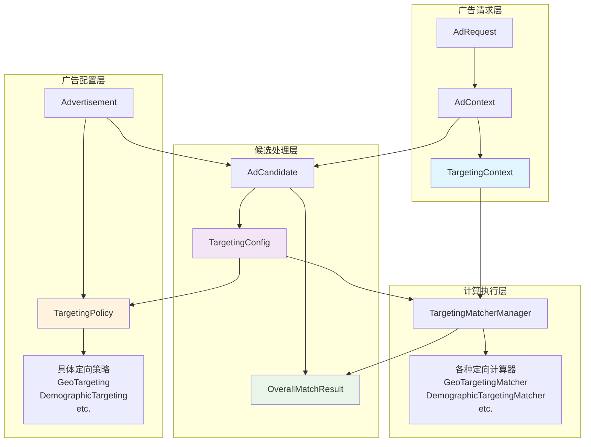
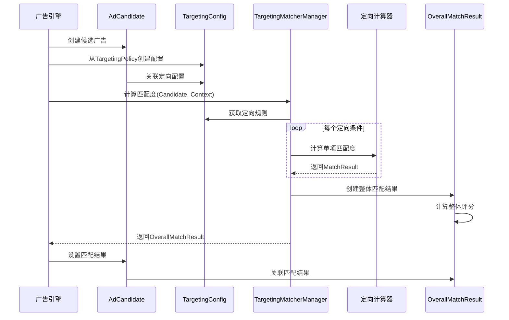

# 定向相关实体关系详解

## 概述

本文档详细说明了广告投放引擎中定向相关实体之间的关系，澄清了TargetingConfig、TargetingPolicy、OverallMatchResult等核心概念及其相互关系。

## 核心实体关系图



## 详细关系说明

### 1. TargetingPolicy ↔ TargetingConfig 关系

**设计目的**：
- **TargetingPolicy**：广告主设置的静态定向策略模板
- **TargetingConfig**：TargetingPolicy在运行时的动态配置实例

**关系特征**：
- **一对多关系**：一个TargetingPolicy可以生成多个TargetingConfig实例
- **继承关系**：TargetingConfig继承TargetingPolicy的基础规则
- **扩展关系**：TargetingConfig可以包含额外的动态优化参数

**具体实现**：
```csharp
public class TargetingConfig : EntityBase
{
    // 来源策略
    public string PolicyId { get; private set; }
    public TargetingPolicy SourcePolicy { get; private set; }
    
    // 基础配置（从Policy复制）
    public Dictionary<string, ITargetingCriteria> Criteria { get; private set; }
    
    // 动态优化参数
    public Dictionary<string, object> DynamicParameters { get; private set; }
    
    // 从TargetingPolicy创建实例
    public static TargetingConfig CreateFromPolicy(TargetingPolicy policy, string adCandidateId)
    {
        var config = new TargetingConfig
        {
            PolicyId = policy.PolicyId,
            AdCandidateId = adCandidateId,
            Criteria = policy.Criteria.ToDictionary(kvp => kvp.Key, kvp => kvp.Value.Clone()),
            DynamicParameters = new Dictionary<string, object>()
        };
        
        return config;
    }
    
    // 应用动态优化
    public void ApplyDynamicOptimization(OptimizationContext context)
    {
        // 根据实时数据调整定向参数
        // 例如：根据竞争情况调整地理定向半径
        // 例如：根据用户行为调整兴趣权重
    }
}
```

**使用场景**：
1. **静态配置**：直接使用TargetingPolicy的配置
2. **动态优化**：基于实时数据调整定向参数
3. **A/B测试**：为同一广告创建不同的配置版本
4. **个性化定向**：为特定用户群体定制定向策略

### 2. AdCandidate ↔ OverallMatchResult 关系

**设计目的**：
- **AdCandidate**：候选广告对象，包含广告信息和配置
- **OverallMatchResult**：该候选广告对特定请求上下文的匹配结果

**关系特征**：
- **一对一关系**：每个AdCandidate对应一个OverallMatchResult
- **计算结果关系**：OverallMatchResult是AdCandidate匹配计算的输出
- **生命周期绑定**：OverallMatchResult与AdCandidate同生命周期

**具体实现**：
```csharp
public class AdCandidate : EntityBase
{
    // 广告基础信息
    public string AdId { get; private set; }
    public string CampaignId { get; private set; }
    
    // 定向配置
    public TargetingConfig Targeting { get; private set; }
    
    // 匹配结果
    public OverallMatchResult MatchResult { get; private set; }
    
    // 设置匹配结果
    public void SetMatchResult(OverallMatchResult result)
    {
        if (result.AdCandidateId != this.Id)
            throw new ArgumentException("MatchResult does not belong to this AdCandidate");
            
        MatchResult = result;
        
        // 可以根据匹配结果调整候选状态
        if (result.IsOverallMatch)
        {
            Status = CandidateStatus.Matched;
        }
        else
        {
            Status = CandidateStatus.Filtered;
        }
    }
    
    // 便捷访问方法
    public bool IsMatched => MatchResult?.IsOverallMatch ?? false;
    public decimal MatchScore => MatchResult?.OverallScore ?? 0m;
}

public class OverallMatchResult : EntityBase
{
    // 关联信息
    public string AdCandidateId { get; private set; }
    public string AdContextId { get; private set; }
    
    // 匹配结果
    public decimal OverallScore { get; private set; }
    public bool IsOverallMatch { get; private set; }
    
    // 详细结果
    public List<MatchResult> IndividualResults { get; private set; }
    public Dictionary<string, decimal> WeightedScores { get; private set; }
    
    // 执行信息
    public TimeSpan TotalExecutionTime { get; private set; }
    public DateTime CalculatedAt { get; private set; }
    public string ReasonCode { get; private set; }
    
    // 创建匹配结果
    public static OverallMatchResult Create(
        string adCandidateId,
        string adContextId,
        List<MatchResult> individualResults)
    {
        var result = new OverallMatchResult
        {
            AdCandidateId = adCandidateId,
            AdContextId = adContextId,
            IndividualResults = individualResults,
            CalculatedAt = DateTime.UtcNow
        };
        
        // 计算整体匹配度
        result.CalculateOverallScore();
        
        return result;
    }
    
    private void CalculateOverallScore()
    {
        if (!IndividualResults.Any())
        {
            OverallScore = 0m;
            IsOverallMatch = false;
            ReasonCode = "NO_CRITERIA";
            return;
        }
        
        // 加权平均计算
        decimal totalWeight = IndividualResults.Sum(r => r.Weight);
        OverallScore = IndividualResults.Sum(r => r.Score * r.Weight) / totalWeight;
        
        // 匹配判断（所有条件都必须匹配）
        IsOverallMatch = IndividualResults.All(r => r.IsMatch);
        
        // 设置原因码
        if (IsOverallMatch)
        {
            ReasonCode = "MATCH_SUCCESS";
        }
        else
        {
            var failedCriteria = IndividualResults.Where(r => !r.IsMatch).Select(r => r.MatcherType);
            ReasonCode = $"MATCH_FAILED: {string.Join(",", failedCriteria)}";
        }
    }
}
```

### 3. 计算流程设计

**整体计算流程**：



**关键决策点**：

1. **配置创建时机**：
   - 召回阶段：从TargetingPolicy创建TargetingConfig
   - 可选优化：根据上下文进行动态调整

2. **匹配计算时机**：
   - 过滤阶段：计算匹配度并创建OverallMatchResult
   - 排序阶段：使用匹配度作为排序因子

3. **结果存储策略**：
   - 临时存储：在AdCandidate处理期间保存
   - 可选缓存：对于频繁查询的结果进行缓存

### 4. 性能优化考虑

**缓存策略**：
```csharp
public class TargetingResultCache
{
    // 缓存键：AdId + ContextHash
    private readonly IMemoryCache _cache;
    
    public async Task<OverallMatchResult> GetOrCalculateAsync(
        AdCandidate candidate,
        TargetingContext context,
        ITargetingMatcherManager manager)
    {
        string cacheKey = $"{candidate.AdId}:{context.GetHashCode()}";
        
        if (_cache.TryGetValue(cacheKey, out OverallMatchResult cachedResult))
        {
            return cachedResult;
        }
        
        var result = await manager.CalculateOverallScore(context, candidate.Targeting);
        
        _cache.Set(cacheKey, result, TimeSpan.FromMinutes(5));
        
        return result;
    }
}
```

**批量计算优化**：
```csharp
public class BatchTargetingCalculator
{
    public async Task<Dictionary<string, OverallMatchResult>> CalculateBatchAsync(
        List<AdCandidate> candidates,
        TargetingContext context)
    {
        // 按定向类型分组，减少重复计算
        var groupedCandidates = candidates
            .GroupBy(c => c.Targeting.GetSignature())
            .ToList();
        
        var results = new Dictionary<string, OverallMatchResult>();
        
        foreach (var group in groupedCandidates)
        {
            var matchResult = await CalculateForGroup(group.Key, context);
            
            foreach (var candidate in group)
            {
                results[candidate.Id] = matchResult.Clone(candidate.Id);
            }
        }
        
        return results;
    }
}
```

## 总结

通过以上设计，我们建立了清晰的定向相关实体关系：

1. **TargetingPolicy → TargetingConfig**：从静态模板到动态实例的转换
2. **AdCandidate ↔ OverallMatchResult**：候选广告与其匹配结果的一一对应
3. **TargetingContext → 计算过程**：请求上下文驱动整个匹配计算流程

这个设计确保了：
- **职责清晰**：每个实体有明确的职责边界
- **关系明确**：实体间的关系和依赖明确定义
- **可扩展性**：支持动态优化和个性化配置
- **性能优化**：支持缓存和批量处理
- **可追溯性**：完整的计算过程和结果记录
