# 广告引擎抽象层设计

## 设计概述

广告引擎抽象层（`Lorn.ADSP.Core.AdEngine.Abstractions`）是广告投放引擎的核心抽象接口层，定义了基于策略集合模式的广告处理架构。该抽象层采用统一策略接口设计，通过配置驱动的方式支持策略集合的动态组装和调用，实现高度灵活和可扩展的广告处理流程。

### 系统架构总览

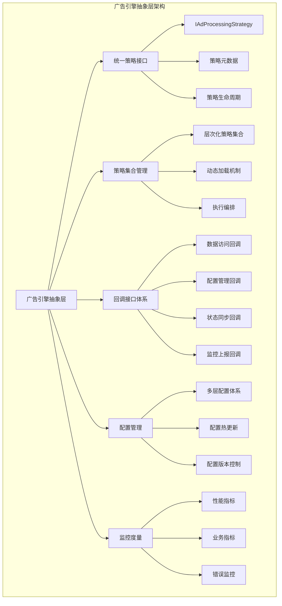

## 架构设计理念

### 核心设计原则
- **统一策略接口**：所有策略都实现相同的统一接口，便于动态加载和调用
- **策略集合模式**：通过策略集合的层次化组织，支持复杂的处理流程编排
- **配置驱动架构**：策略集合的组合和调用顺序完全由配置文件定义
- **依赖注入加载**：策略程序集通过依赖注入方式动态加载，支持运行时扩展
- **回调机制设计**：策略通过回调接口获取所需的上下文和数据

### 架构灵活性考量
- **非固化阶段**：不固化为三阶段架构，支持任意数量和类型的处理阶段
- **动态扩展**：支持在不修改核心代码的情况下增加新的策略类型和处理阶段
- **热插拔能力**：支持策略的热插拔和在线更新
- **多租户隔离**：支持不同租户使用不同的策略集合配置

## 统一策略接口设计

### 策略接口架构

#### 统一策略接口定义

所有策略都实现统一的`IAdProcessingStrategy`接口，该接口定义了策略执行的标准规范。

**注意**：以下核心类型已迁移到域层：
- `AdCandidate`类型已迁移到`Lorn.ADSP.Core.Domain.Entities`命名空间
- `AdContext`类型已迁移到`Lorn.ADSP.Core.Domain.Entities`命名空间  
- `UserProfile`类型定义在`Lorn.ADSP.Core.Domain.Entities`命名空间（由DMP系统管理）
- 相关枚举类型已迁移到`Lorn.ADSP.Core.Shared.Enums`命名空间


**接口职责**：
- 定义策略的基本元数据（名称、版本、优先级等）
- 规范策略的执行方法和参数传递
- 提供策略执行结果的标准格式
- 支持策略的动态配置和状态管理

**接口设计要点**：
- 输入输出标准化：统一使用广告候选集合作为处理对象
- 上下文获取抽象：通过回调接口获取所需的上下文信息
- 异步执行支持：支持高并发场景下的异步处理
- 错误处理规范：统一的异常处理和错误报告机制

#### 策略元数据定义
每个策略需要提供以下元数据信息：

**基础元数据**：
- 策略唯一标识符
- 策略版本信息
- 策略类型分类
- 执行优先级设置

**运行时属性**：
- 策略启用状态
- 并行执行能力
- 预期处理时间
- 资源消耗评估

**配置依赖**：
- 所需配置参数定义
- 依赖的外部服务接口
- 数据访问权限要求
- 回调接口使用声明

### 广告引擎回调接口设计

#### 回调接口架构

广告投放引擎需要提供一系列回调接口，供策略获取所需的上下文信息和数据：

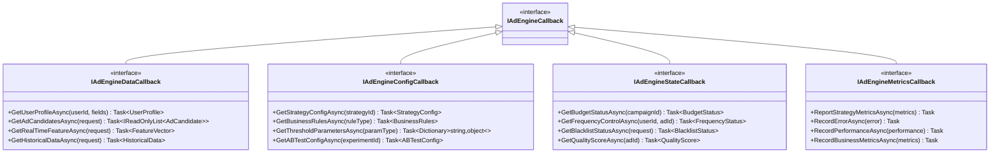

**数据访问回调**：
- 用户画像数据获取接口
- 广告候选池查询接口
- 实时特征数据获取接口
- 历史行为数据查询接口

**配置管理回调**：
- 策略配置参数获取接口
- 业务规则配置查询接口
- 阈值参数动态获取接口
- A/B测试配置获取接口

**状态同步回调**：
- 预算状态查询接口
- 频次控制状态接口
- 黑名单状态查询接口
- 质量评分获取接口

**监控上报回调**：
- 策略执行指标上报接口
- 错误信息记录接口
- 性能数据统计接口
- 业务指标记录接口

#### 回调接口设计原则

**高性能考量**：
- 批量数据获取支持
- 缓存友好的接口设计
- 异步回调机制
- 连接池和资源复用

**安全性保障**：
- 接口访问权限控制
- 数据脱敏和隐私保护
- 审计日志记录
- 异常访问检测

**可靠性设计**：
- 重试机制和熔断保护
- 降级策略和兜底方案
- 超时控制和资源限制
- 错误恢复和状态同步

## 回调接口设计规范

### 回调提供者接口设计

#### ICallbackProvider接口定义

为了解决您提出的问题，我们引入了`ICallbackProvider`接口来提供类型安全的回调访问机制：

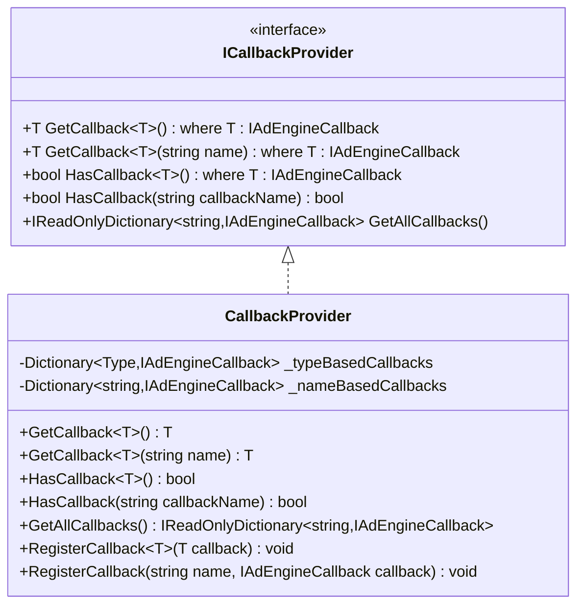

**设计特点**：

1. **类型安全访问**：通过泛型方法`GetCallback<T>()`提供编译时类型检查
2. **命名访问**：支持通过字符串名称访问回调，满足动态配置需求
3. **存在性检查**：提供`HasCallback`方法检查回调是否可用
4. **完整访问**：提供`GetAllCallbacks`方法获取所有可用回调

#### 策略中的回调使用示例

```csharp
public class UserInterestRecallStrategy : IAdProcessingStrategy
{
    public async Task<StrategyResult> ExecuteAsync(
        AdContext context, 
        IReadOnlyList<AdCandidate> candidates, 
        ICallbackProvider callbackProvider, 
        CancellationToken cancellationToken)
    {
        // 方式1：类型安全的回调获取
        var dataCallback = callbackProvider.GetCallback<IAdEngineDataCallback>();
        var userProfile = await dataCallback.GetUserProfileAsync(context.UserId, ["interests", "demographics"]);
        
        // 方式2：通过名称获取回调（用于动态配置场景）
        if (callbackProvider.HasCallback("CustomDataSource"))
        {
            var customCallback = callbackProvider.GetCallback<IAdEngineDataCallback>("CustomDataSource");
            var customData = await customCallback.GetHistoricalDataAsync(new HistoricalDataRequest());
        }
        
        // 业务逻辑处理...
        
        return new StrategyResult
        {
            IsSuccess = true,
            ProcessedCandidates = filteredCandidates
        };
    }
    
    public StrategyMetadata GetMetadata()
    {
        return new StrategyMetadata
        {
            Id = "UserInterestRecall",
            RequiredCallbackTypes = new[] { typeof(IAdEngineDataCallback), typeof(IAdEngineConfigCallback) },
            RequiredCallbackNames = new[] { "DataCallback", "ConfigCallback", "CustomDataSource?" } // ?表示可选
        };
    }
}
```

### 回调机制设计考量

#### 设计决策说明

针对您提出的问题，我们选择了`ICallbackProvider`接口而不是简单的`Dictionary<string, IAdEngineCallback>`的原因如下：

**1. 类型安全性**
```csharp
// 类型安全的访问方式
var dataCallback = callbackProvider.GetCallback<IAdEngineDataCallback>();

// 而不是容易出错的字符串键访问
var dataCallback = callbacks["DataCallback"] as IAdEngineDataCallback; // 可能为null
```

**2. 接口契约明确**
```csharp
public StrategyMetadata GetMetadata()
{
    return new StrategyMetadata
    {
        // 编译时类型检查
        RequiredCallbackTypes = new[] { typeof(IAdEngineDataCallback) },
        // 运行时字符串匹配（用于配置）
        RequiredCallbackNames = new[] { "DataCallback", "ConfigCallback" }
    };
}
```

**3. 灵活的获取方式**
- 通过类型获取：`GetCallback<T>()`适用于静态编译时已知的回调类型
- 通过名称获取：`GetCallback<T>(string name)`适用于动态配置场景
- 存在性检查：避免运行时空引用异常

**4. 向后兼容**
```csharp
// 提供底层字典访问以支持特殊场景
public IReadOnlyDictionary<string, IAdEngineCallback> GetAllCallbacks()
{
    return _nameBasedCallbacks.AsReadOnly();
}
```

#### 实现示例

```csharp
public class CallbackProvider : ICallbackProvider
{
    private readonly Dictionary<Type, IAdEngineCallback> _typeBasedCallbacks;
    private readonly Dictionary<string, IAdEngineCallback> _nameBasedCallbacks;
    
    public T GetCallback<T>() where T : IAdEngineCallback
    {
        if (_typeBasedCallbacks.TryGetValue(typeof(T), out var callback))
        {
            return (T)callback;
        }
        throw new CallbackNotFoundException($"Callback of type {typeof(T).Name} not found");
    }
    
    public T GetCallback<T>(string name) where T : IAdEngineCallback
    {
        if (_nameBasedCallbacks.TryGetValue(name, out var callback) && callback is T typedCallback)
        {
            return typedCallback;
        }
        throw new CallbackNotFoundException($"Callback named '{name}' of type {typeof(T).Name} not found");
    }
    
    public bool HasCallback<T>() where T : IAdEngineCallback
    {
        return _typeBasedCallbacks.ContainsKey(typeof(T));
    }
    
    public bool HasCallback(string callbackName)
    {
        return _nameBasedCallbacks.ContainsKey(callbackName);
    }
}
```

### 核心回调接口架构

#### 广告引擎上下文回调接口

**上下文访问接口设计要点**：

- 提供统一的上下文信息访问接口
- 支持多种数据源的透明访问
- 实现数据的延迟加载和缓存机制
- 保障数据访问的线程安全性

**主要回调接口类型**：

**广告数据访问回调**：

- 广告候选集合的获取和筛选
- 广告创意内容的动态加载
- 广告活动和计划信息的实时获取
- 广告主账户和权限信息的访问

**用户和媒体上下文回调**：

- 用户画像和行为数据的获取
- 媒体环境和设备信息的访问
- 地理位置和时间上下文的获取
- 用户偏好和历史互动数据的查询

**业务规则和策略回调**：

- 投放规则和约束条件的查询
- 黑名单和白名单的实时验证
- 预算和计费规则的获取
- 频次控制和用户体验策略的访问

**实时数据和统计回调**：

- 实时竞价和市场数据的获取
- 广告效果和转化数据的查询
- 系统性能和负载状态的监控
- 异常和风险事件的报告

#### 回调接口性能设计

**异步访问机制**：

- 支持异步数据获取避免阻塞
- 批量数据请求的合并和优化
- 并发访问的控制和协调
- 超时和重试机制的统一管理

**缓存和预加载策略**：

- 热点数据的智能缓存
- 数据预加载的时机控制
- 缓存一致性的保障机制
- 缓存失效和更新的策略

**数据访问优化**：

- 数据查询的SQL优化和索引利用
- 分页和流式处理的支持
- 数据格式的标准化和压缩
- 网络传输的优化和错误处理

### 回调接口安全设计

#### 数据访问权限控制

**权限验证机制**：

- 策略身份的验证和授权
- 数据访问权限的细粒度控制
- 敏感数据的脱敏和保护
- 访问日志的记录和审计

**数据安全传输**：

- 数据传输的加密和完整性校验
- API调用的签名和防篡改
- 敏感信息的安全存储和访问
- 数据泄露的监控和防护

#### 故障隔离和降级

**回调接口的故障隔离**：

- 单个回调失败不影响整体流程
- 回调服务的熔断和降级机制
- 备用数据源的自动切换
- 故障恢复的自动检测和处理

**数据一致性保障**：

- 分布式数据的一致性控制
- 数据更新的事务性保障
- 并发访问的冲突检测和解决
- 数据同步的延迟监控和告警

## 策略集合架构设计

### 层次化策略集合模型

#### 策略集合层次结构

采用层次化的策略集合组织模型，支持复杂的处理流程编排：

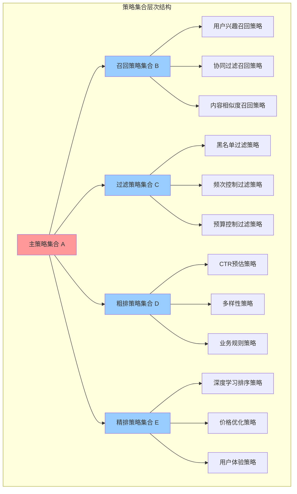

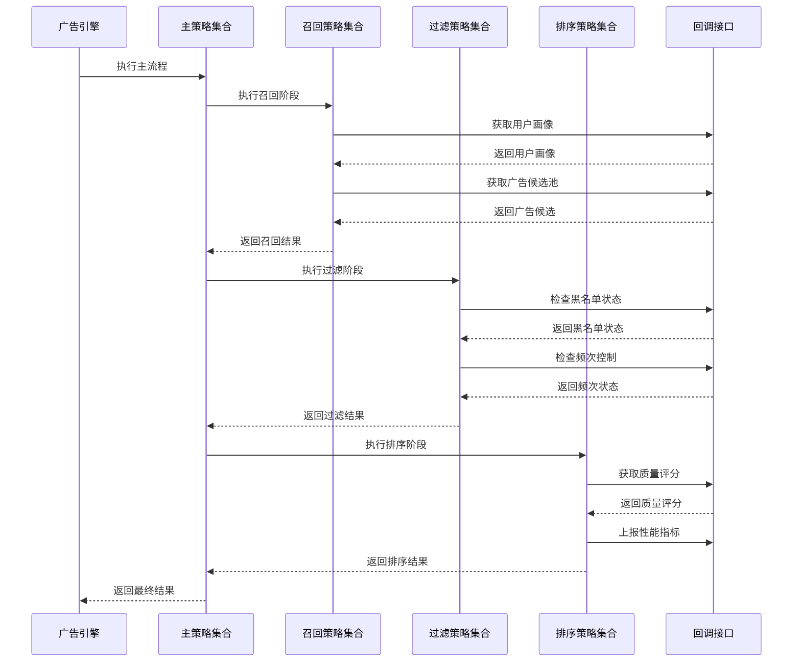

**顶层策略集合（策略集合A）**：

- 作为广告处理的主流程定义
- 包含多个子策略集合的引用
- 定义子策略集合的执行顺序
- 控制整体处理流程的超时和错误处理

**子策略集合（策略集合B、C、D、E等）**：

- 每个子策略集合专注特定的处理阶段
- 包含多个具体策略的组合
- 支持策略间的并行和串行执行
- 提供阶段级别的配置和控制

**具体策略实现**：

- 实现统一的策略接口
- 专注单一的算法逻辑
- 通过回调接口获取所需数据
- 提供标准化的执行结果

#### 策略集合配置模型

**配置结构设计**：

```text
策略集合配置
├── 主流程定义
│   ├── 策略集合A配置
│   │   ├── 子策略集合执行顺序
│   │   ├── 全局超时设置
│   │   ├── 错误处理策略
│   │   └── 监控上报配置
│   └── 执行环境配置
├── 子策略集合定义
│   ├── 召回策略集合B
│   │   ├── 策略列表和优先级
│   │   ├── 并行执行配置
│   │   ├── 结果合并规则
│   │   └── 阶段性能要求
│   ├── 过滤策略集合C
│   ├── 粗排策略集合D
│   └── 精排策略集合E
└── 策略实例配置
    ├── 各策略的参数配置
    ├── 启用状态和版本设置
    ├── 资源限制和超时配置
    └── 监控和告警设置
```

**配置管理机制**：

- 配置版本控制和回滚机制
- 配置变更的实时生效
- 多环境配置管理（开发、测试、生产）
- 配置校验和安全检查

### 动态加载和执行机制

#### 策略动态加载设计

**程序集加载机制**：

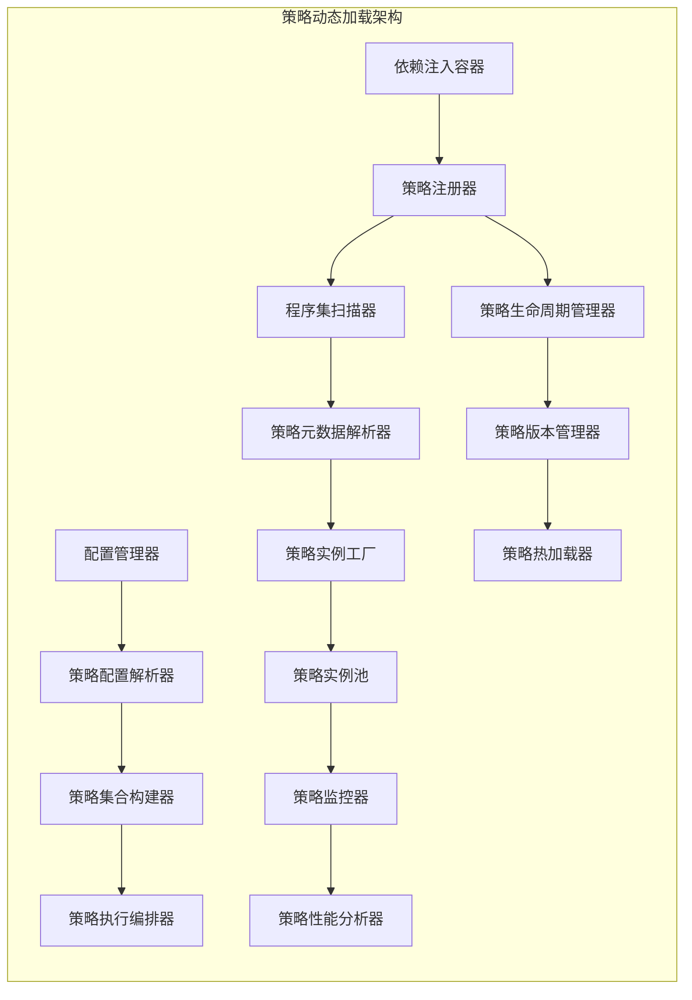

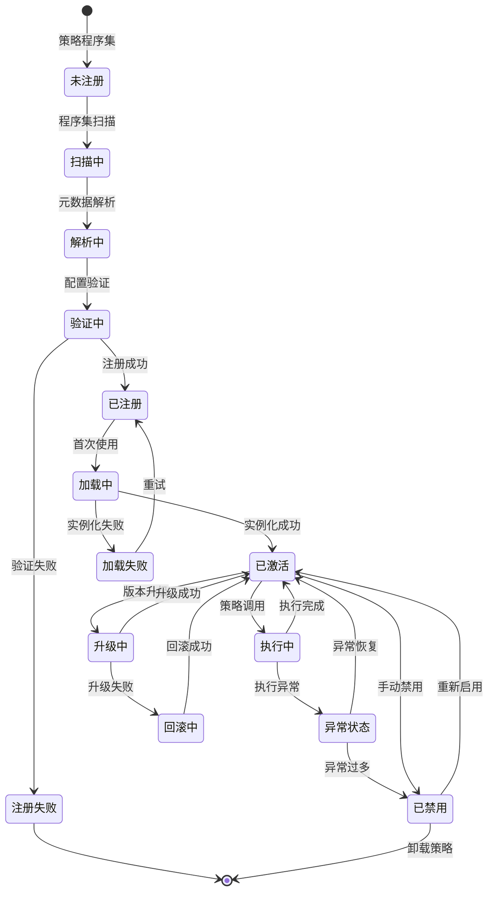

- 基于依赖注入容器的策略注册
- 支持策略程序集的热加载
- 策略版本兼容性检查
- 策略依赖关系解析

**策略生命周期管理**：

- 策略实例的创建和销毁
- 策略状态的持久化和恢复
- 策略升级和平滑迁移
- 策略资源的清理和回收

**执行时策略选择**：

- 基于配置的策略集合构建
- 运行时策略可用性检查
- 策略执行顺序的动态调整
- 异常策略的自动替换

#### 策略执行编排设计

**执行流程控制**：

- 策略集合的顺序执行机制
- 策略间的数据传递和状态同步
- 并行策略的协调和结果合并
- 错误传播和异常处理

**性能优化机制**：

- 策略执行的并行度控制
- 资源池化和连接复用
- 缓存策略和数据预加载
- 执行路径的智能优化

**监控和度量**：

- 策略执行时间的统计和分析
- 策略成功率和错误率监控
- 系统资源使用情况跟踪
- 业务指标的实时监控

## 数据流和状态管理

### 数据传递机制设计

#### 标准化数据模型

定义统一的数据模型，确保策略间的数据传递标准化：

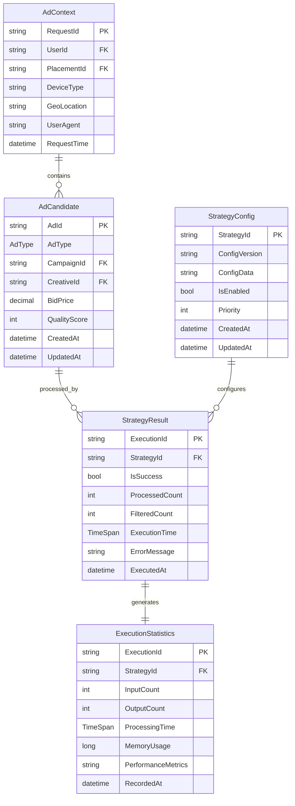

**广告候选对象模型**：
- 广告基础信息（ID、类型、创意等）
- 投放配置信息（定向、预算、出价等）
- 质量评估信息（历史表现、质量分等）
- 上下文匹配信息（匹配度、相关性等）

**处理结果模型**：
- 策略执行状态和结果
- 数据处理的统计信息
- 错误信息和异常详情
- 性能监控和度量数据

**上下文信息模型**：
- 用户相关信息（画像、行为、偏好等）
- 请求相关信息（广告位、设备、地理位置等）
- 环境相关信息（时间、竞争情况、库存状态等）
- 系统相关信息（配置、状态、限制等）

#### 状态管理机制

**策略执行状态**：
- 策略集合的执行进度跟踪
- 各策略的执行状态管理
- 异常情况的状态恢复
- 执行上下文的持久化

**数据一致性保障**：
- 策略间数据传递的一致性检查
- 并行执行的数据同步机制
- 异常情况下的数据回滚
- 分布式环境下的状态同步

**缓存和临时数据管理**：
- 策略执行过程中的临时数据存储
- 缓存数据的生命周期管理
- 内存使用的优化和控制
- 垃圾回收和资源清理

## 配置管理和治理

### 配置架构设计

#### 多层配置体系
建立多层次的配置管理体系，支持不同粒度的配置控制：

**全局配置层**：
- 系统级别的全局参数配置
- 性能阈值和资源限制设置
- 安全策略和访问控制配置
- 监控告警的全局配置

**策略集合配置层**：
- 策略集合的组合和编排配置
- 执行顺序和并行度设置
- 阶段级别的超时和重试配置
- 策略集合间的依赖关系配置

**策略实例配置层**：
- 各具体策略的参数配置
- 策略的启用状态和版本设置
- 策略特定的性能和资源配置
- 策略的个性化定制参数

#### 配置动态管理

**配置热更新机制**：
- 配置变更的实时推送和生效
- 配置变更的影响范围分析
- 配置回滚和版本恢复机制
- 配置变更的安全检查和验证

**配置版本控制**：
- 配置变更的版本管理和追踪
- 配置分支和合并机制
- 配置审计和变更历史记录
- 配置同步和环境一致性保障

**配置校验和安全**：
- 配置参数的有效性校验
- 配置权限的访问控制
- 敏感配置的加密和脱敏
- 配置变更的审批流程

### 治理和监控

#### 策略治理机制

**策略生命周期管理**：
- 策略的注册、发布、下线流程
- 策略版本的兼容性管理
- 策略依赖关系的分析和管理
- 策略影响范围的评估和控制

**策略质量保障**：
- 策略的性能基准测试
- 策略执行结果的质量监控
- 策略异常情况的检测和处理
- 策略优化建议的生成和推送

**策略合规管理**：
- 策略的安全审计和风险评估
- 策略的合规性检查和认证
- 策略的权限管理和访问控制
- 策略的数据使用合规监控

#### 运维监控体系

**实时监控指标**：
- 策略执行的性能指标监控
- 系统资源使用情况监控
- 业务指标的实时跟踪
- 异常情况的自动检测和告警

**运维自动化**：
- 策略异常的自动恢复机制
- 系统负载的自动调节
- 资源的自动扩缩容
- 运维任务的自动化执行

**数据分析和优化**：
- 策略执行数据的统计分析
- 系统性能瓶颈的识别和优化
- 业务效果的数据挖掘和洞察
- 优化建议的自动生成和推荐

## 扩展性和演进设计

### 架构扩展能力

#### 横向扩展设计
支持系统在不同维度的横向扩展：

**策略类型扩展**：
- 新策略类型的无缝接入
- 策略接口的向后兼容保障
- 策略分类和标签管理机制
- 策略生态的开放和治理

**处理阶段扩展**：
- 非固化的处理阶段定义
- 新处理阶段的动态添加
- 处理流程的灵活编排
- 阶段间依赖关系的管理

**数据源扩展**：
- 新数据源的接入和适配
- 数据模型的扩展和兼容
- 数据质量的监控和保障
- 数据安全和隐私保护

#### 纵向扩展设计

**性能扩展能力**：
- 计算资源的弹性伸缩
- 存储容量的动态扩展
- 网络带宽的智能调节
- 缓存策略的优化升级

**功能深度扩展**：
- 算法模型的持续优化
- 业务逻辑的深度定制
- 用户体验的持续改进
- 智能化水平的不断提升

### 技术演进规划

#### 短期演进目标
- 策略集合架构的稳定实现
- 配置管理系统的完善
- 监控和治理体系的建立
- 基础性能和稳定性的保障

#### 中期演进目标
- 智能化策略推荐和优化
- 自适应的负载均衡和资源调度
- 高级的数据分析和洞察能力
- 多租户和多环境的完善支持

#### 长期演进愿景
- 全面的人工智能驱动优化
- 自主的系统运维和管理
- 开放的策略生态和市场
- 下一代广告技术的引领创新

## 总结

广告引擎抽象层采用统一策略接口和策略集合模式的设计，为广告投放引擎提供了高度灵活和可扩展的架构基础。该设计的核心优势包括：

### 系统交互全流程图

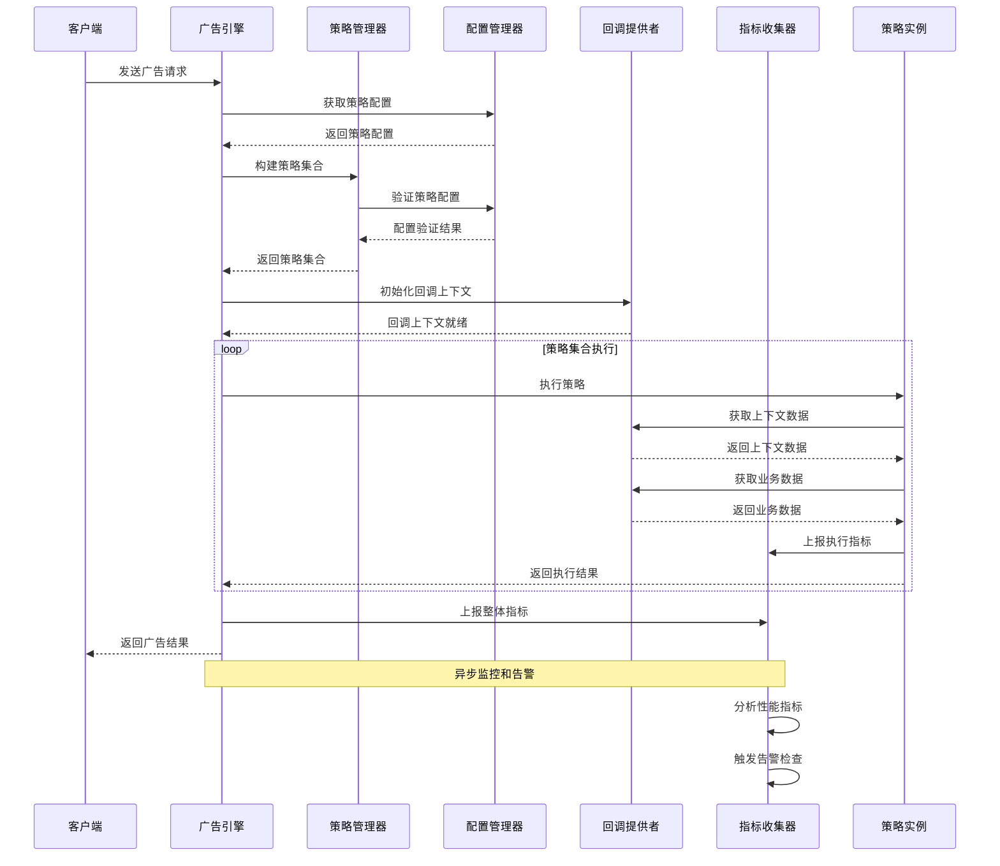

### 核心设计优势

**架构灵活性**：

- 非固化的处理阶段定义，支持任意复杂的处理流程
- 配置驱动的策略组合，支持业务需求的快速适配
- 统一接口设计，降低系统复杂度和维护成本

**技术先进性**：

- 基于依赖注入的动态加载机制
- 完善的回调接口和上下文管理
- 全面的监控、治理和运维支持

**业务适应性**：

- 支持多租户和多环境的差异化配置
- 支持策略的热插拔和在线升级
- 支持业务规则的灵活定制和快速迭代

该抽象层设计将为广告投放引擎的长期发展提供坚实的技术基础，确保系统能够适应不断变化的业务需求和技术发展趋势。

## 项目结构设计

### Visual Studio解决方案中的项目组织

#### 抽象层项目结构

`Lorn.ADSP.Core.AdEngine.Abstractions` 项目的推荐组织结构：

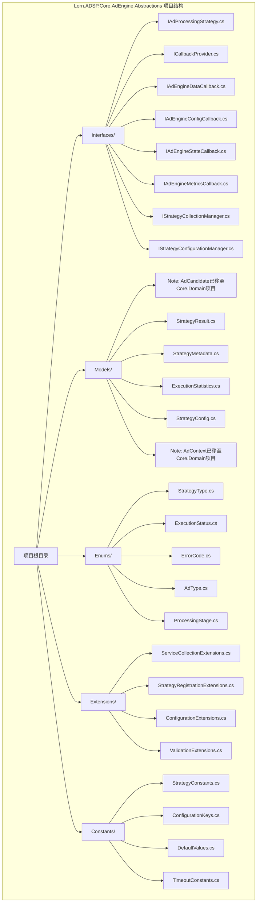

#### 项目间依赖关系设计

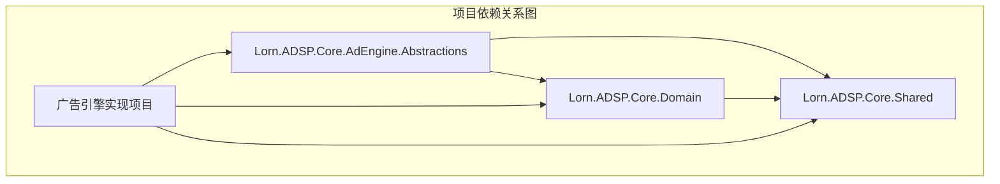

#### 命名空间调整

**移动到Core.Domain的类型**：
```csharp
// 原命名空间
namespace Lorn.ADSP.Core.AdEngine.Abstractions.Models
{
    public class AdCandidate { }
}

// 新命名空间
namespace Lorn.ADSP.Core.Domain.Entities
{
    public class AdCandidate { }
}
```

**移动到Core.Shared的类型**：
```csharp
// 原命名空间
namespace Lorn.ADSP.Core.AdEngine.Abstractions.Enums
{
    public enum AdType { }
}

// 新命名空间
namespace Lorn.ADSP.Core.Shared.Enums
{
    public enum AdType { }
}
```

#### 接口调整

**IAdProcessingStrategy接口调整**：
```csharp
// 调整前
using Lorn.ADSP.Core.AdEngine.Abstractions.Models;

// 调整后
using Lorn.ADSP.Core.Domain.Entities;
using Lorn.ADSP.Core.Shared.Enums;

namespace Lorn.ADSP.Core.AdEngine.Abstractions.Interfaces
{
    public interface IAdProcessingStrategy
    {
        Task<StrategyResult> ExecuteAsync(
            AdEngineContext context,
            IReadOnlyList<AdCandidate> candidates,  // 来自Core.Domain
            ICallbackProvider callbackProvider,
            CancellationToken cancellationToken);
    }
}
```

### 迁移指导

#### 1. 代码迁移步骤

1. **创建新的类文件**：在目标项目中创建对应的类文件
2. **复制类定义**：将类定义复制到新项目中
3. **调整命名空间**：修改类的命名空间为新项目的命名空间
4. **更新引用**：更新所有引用这些类的地方的using语句
5. **删除旧文件**：确认迁移完成后删除旧的类文件

#### 2. 编译验证

```bash
# 构建所有项目验证无编译错误
dotnet build Lorn.ADSP.sln
```

#### 3. 测试验证

```bash
# 运行单元测试确保功能正常
dotnet test Lorn.ADSP.sln
```

## 数据结构归属说明

### 项目间数据结构分布

根据系统整体技术架构设计，广告引擎抽象层涉及的数据结构需要按照以下原则进行分布：

#### 归属到 `Lorn.ADSP.Core.Domain` 项目的数据结构

以下数据结构属于**领域模型**概念，应该放在领域层项目中：

| 数据结构        | 归属理由                   | 原位置                | 新位置      |
| --------------- | -------------------------- | --------------------- | ----------- |
| AdCandidate     | 广告候选是核心领域实体     | AdEngine.Abstractions | Core.Domain |
| AdContext       | 广告上下文是核心领域实体   | AdEngine.Abstractions | Core.Domain |
| CreativeInfo    | 创意信息是广告领域的值对象 | AdEngine.Abstractions | Core.Domain |
| TargetingConfig | 定向配置是广告投放的值对象 | AdEngine.Abstractions | Core.Domain |
| BiddingInfo     | 竞价信息是广告竞价的值对象 | AdEngine.Abstractions | Core.Domain |
| QualityScore    | 质量评分是广告质量的值对象 | AdEngine.Abstractions | Core.Domain |

#### 归属到 `Lorn.ADSP.Core.Shared` 项目的数据结构

以下数据结构属于**共享组件**概念，应该放在共享层项目中：

| 数据结构            | 归属理由               | 原位置                | 新位置      |
| ------------------- | ---------------------- | --------------------- | ----------- |
| AdType              | 广告类型是系统级枚举   | AdEngine.Abstractions | Core.Shared |
| StrategyType        | 策略类型是系统级枚举   | AdEngine.Abstractions | Core.Shared |
| ValidationResult    | 验证结果是通用辅助类   | AdEngine.Abstractions | Core.Shared |
| ResourceRequirement | 资源需求是通用配置结构 | AdEngine.Abstractions | Core.Shared |

#### 保留在 `Lorn.ADSP.Core.AdEngine.Abstractions` 项目的数据结构

以下数据结构属于**广告引擎抽象层**特有概念，应该保留在当前项目中：

| 数据结构                    | 保留理由                 | 依赖关系                       |
| --------------------------- | ------------------------ | ------------------------------ |
| IAdProcessingStrategy       | 策略接口是抽象层核心     | 依赖Core.Domain中的AdCandidate |
| ICallbackProvider           | 回调提供者是抽象层专有   | 依赖各种回调接口               |
| StrategyMetadata            | 策略元数据是抽象层专有   | 依赖Core.Shared中的枚举        |
| StrategyResult              | 策略结果是抽象层专有     | 依赖Core.Domain中的AdCandidate |
| IAdEngineCallback系列       | 回调接口是抽象层专有     | 依赖Core.Domain中的实体        |
| StrategyExecutionStatistics | 策略执行统计是抽象层专有 | 独立结构                       |
| StrategyError               | 策略错误是抽象层专有     | 独立结构                       |

### 依赖关系调整

#### 项目引用关系

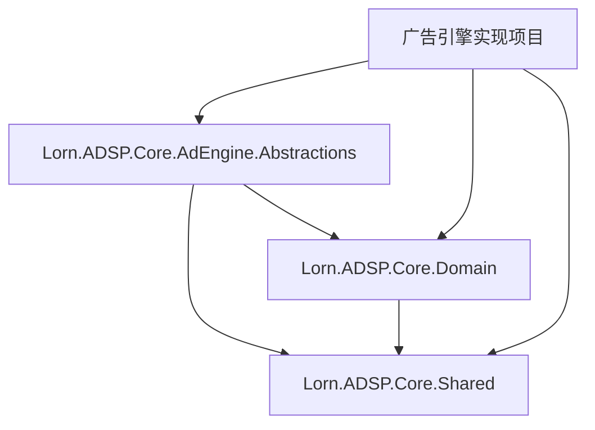

#### 命名空间调整

**移动到Core.Domain的类型**：
```csharp
// 原命名空间
namespace Lorn.ADSP.Core.AdEngine.Abstractions.Models
{
    public class AdCandidate { }
}

// 新命名空间
namespace Lorn.ADSP.Core.Domain.Entities
{
    public class AdCandidate { }
}
```

**移动到Core.Shared的类型**：
```csharp
// 原命名空间
namespace Lorn.ADSP.Core.AdEngine.Abstractions.Enums
{
    public enum AdType { }
}

// 新命名空间
namespace Lorn.ADSP.Core.Shared.Enums
{
    public enum AdType { }
}
```

#### 接口调整

**IAdProcessingStrategy接口调整**：
```csharp
// 调整前
using Lorn.ADSP.Core.AdEngine.Abstractions.Models;

// 调整后
using Lorn.ADSP.Core.Domain.Entities;
using Lorn.ADSP.Core.Shared.Enums;

namespace Lorn.ADSP.Core.AdEngine.Abstractions.Interfaces
{
    public interface IAdProcessingStrategy
    {
        Task<StrategyResult> ExecuteAsync(
            AdEngineContext context,
            IReadOnlyList<AdCandidate> candidates,  // 来自Core.Domain
            ICallbackProvider callbackProvider,
            CancellationToken cancellationToken);
    }
}
```

### 迁移指导

#### 1. 代码迁移步骤

1. **创建新的类文件**：在目标项目中创建对应的类文件
2. **复制类定义**：将类定义复制到新项目中
3. **调整命名空间**：修改类的命名空间为新项目的命名空间
4. **更新引用**：更新所有引用这些类的地方的using语句
5. **删除旧文件**：确认迁移完成后删除旧的类文件

#### 2. 编译验证

```bash
# 构建所有项目验证无编译错误
dotnet build Lorn.ADSP.sln
```

#### 3. 测试验证

```bash
# 运行单元测试确保功能正常
dotnet test Lorn.ADSP.sln
```
