# 广告引擎抽象层设计

## 设计概述

广告引擎抽象层（`Lorn.ADSP.Core.AdEngine.Abstractions`）是广告投放引擎的核心抽象接口层，定义了基于策略集合模式的广告处理架构。该抽象层采用统一策略接口设计，通过配置驱动的方式支持策略集合的动态组装和调用，实现高度灵活和可扩展的广告处理流程。

### 系统架构总览
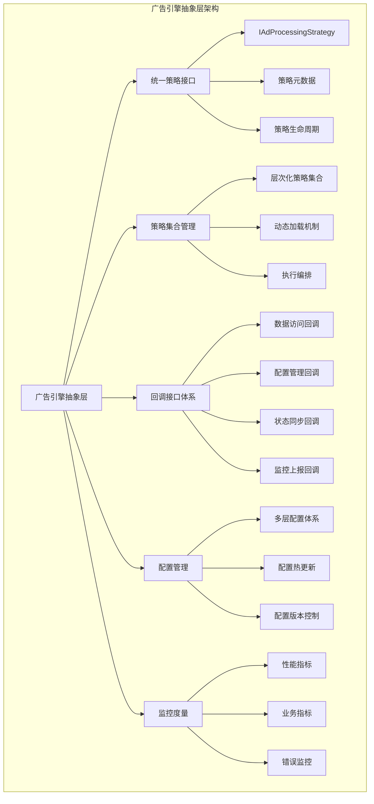

## 架构设计理念

### 核心设计原则
- **统一策略接口**：所有策略都实现相同的统一接口，便于动态加载和调用
- **策略集合模式**：通过策略集合的层次化组织，支持复杂的处理流程编排
- **配置驱动架构**：策略集合的组合和调用顺序完全由配置文件定义
- **依赖注入加载**：策略程序集通过依赖注入方式动态加载，支持运行时扩展
- **回调机制设计**：策略通过回调接口获取所需的上下文和数据

### 架构灵活性考量
- **非固化阶段**：不固化为三阶段架构，支持任意数量和类型的处理阶段
- **动态扩展**：支持在不修改核心代码的情况下增加新的策略类型和处理阶段
- **热插拔能力**：支持策略的热插拔和在线更新
- **多租户隔离**：支持不同租户使用不同的策略集合配置

## 统一策略接口设计

### 策略接口架构

#### 统一策略接口定义

所有策略都实现统一的`IAdProcessingStrategy`接口，该接口定义了策略执行的标准规范。

**注意**：以下核心类型已迁移到域层：
- `AdCandidate`类型已迁移到`Lorn.ADSP.Core.Domain.Entities`命名空间
- `AdContext`类型已迁移到`Lorn.ADSP.Core.Domain.Entities`命名空间  
- `UserProfile`类型定义在`Lorn.ADSP.Core.Domain.Entities`命名空间（由DMP系统管理）
- 相关枚举类型已迁移到`Lorn.ADSP.Core.Shared.Enums`命名空间

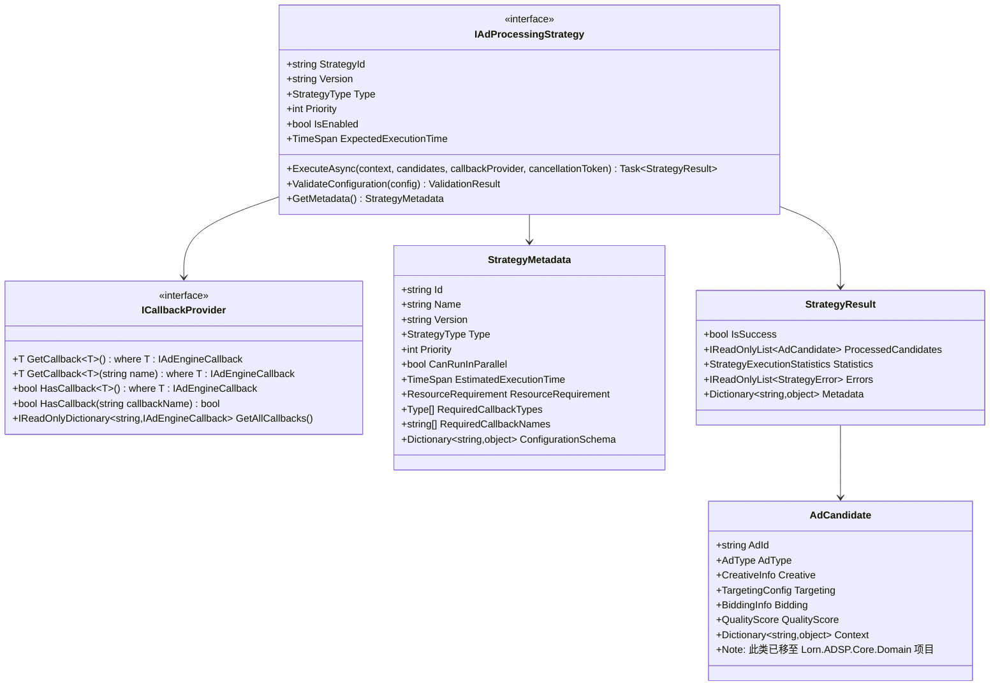

**接口职责**：
- 定义策略的基本元数据（名称、版本、优先级等）
- 规范策略的执行方法和参数传递
- 提供策略执行结果的标准格式
- 支持策略的动态配置和状态管理

**接口设计要点**：
- 输入输出标准化：统一使用广告候选集合作为处理对象
- 上下文获取抽象：通过回调接口获取所需的上下文信息
- 异步执行支持：支持高并发场景下的异步处理
- 错误处理规范：统一的异常处理和错误报告机制

#### 策略元数据定义
每个策略需要提供以下元数据信息：

**基础元数据**：
- 策略唯一标识符
- 策略版本信息
- 策略类型分类
- 执行优先级设置

**运行时属性**：
- 策略启用状态
- 并行执行能力
- 预期处理时间
- 资源消耗评估

**配置依赖**：
- 所需配置参数定义
- 依赖的外部服务接口
- 数据访问权限要求
- 回调接口使用声明

### 广告引擎回调接口设计

#### 回调接口架构

广告投放引擎需要提供一系列回调接口，供策略获取所需的上下文信息和数据。为了提高扩展性和灵活性，我们采用**泛型化的上下文获取机制**设计：

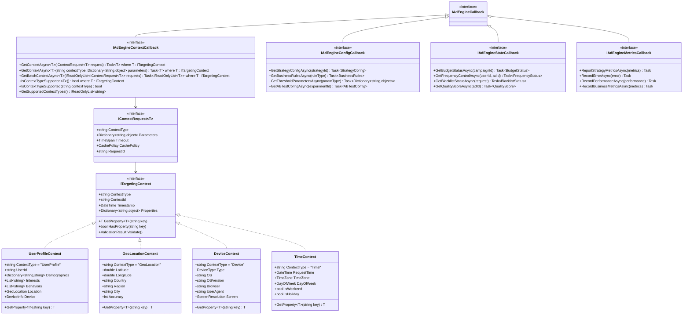

#### 泛型化上下文获取机制设计

**核心设计理念**：

1. **统一的泛型接口**：使用泛型方法 `GetContextAsync<T>()` 替代硬编码的具体方法
2. **类型安全的请求对象**：通过 `IContextRequest<T>` 封装不同类型上下文的请求参数
3. **可扩展的上下文类型**：所有上下文类型都实现 `ITargetingContext` 接口
4. **灵活的参数传递**：支持字典形式的动态参数传递

**请求-响应关系模型**：

**关系说明**：
- `IContextRequest<T>`：请求对象接口，封装获取特定类型上下文所需的参数
- `ITargetingContext`：响应对象接口，定义返回的上下文数据的标准格式
- `T`：具体的上下文类型，必须实现`ITargetingContext`接口
- 它们是请求-响应模式，而非继承关系

**接口关系图**：

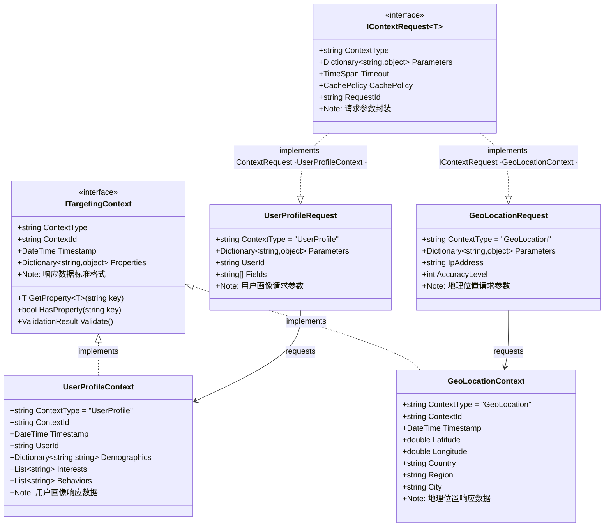

**技术实现指导**：

**请求对象设计原则**：
- 在`Lorn.ADSP.Core.AdEngine.Abstractions`项目的`Models/Requests`目录下设计请求对象
- 每个请求类实现`IContextRequest<T>`接口，其中T是对应的上下文类型
- 请求对象封装获取特定上下文所需的所有参数
- 包含超时设置、缓存策略等控制信息

**响应对象设计原则**：
- 在`Lorn.ADSP.Core.AdEngine.Abstractions`项目的`Models/Contexts`目录下设计上下文对象
- 所有上下文类型实现`ITargetingContext`基础接口
- 提供标准化的属性访问方法和验证机制
- 包含时间戳、上下文ID等元数据信息

**泛型约束机制**：
- `GetContextAsync<T>(IContextRequest<T> request)`方法中的T必须实现`ITargetingContext`
- 编译时确保请求对象和返回类型的一致性
- 通过泛型约束实现类型安全的请求-响应匹配

**使用模式示例**：

**强类型请求-响应模式**：
```text
UserProfileRequest (请求) → UserProfileContext (响应)
GeoLocationRequest (请求) → GeoLocationContext (响应)
DeviceRequest (请求) → DeviceContext (响应)

```

**接口方法签名说明**：
```text
Task<UserProfileContext> GetContextAsync<UserProfileContext>(
    IContextRequest<UserProfileContext> request
)

其中：
- IContextRequest<UserProfileContext>：具体为 UserProfileRequest
- UserProfileContext：实现了 ITargetingContext 的具体上下文类型

```

**项目组织结构建议**：

```text
Lorn.ADSP.Core.AdEngine.Abstractions/
├── Interfaces/
│   ├── IAdProcessingStrategy.cs
│   ├── ICallbackProvider.cs
│   ├── IAdEngineCallback.cs
│   ├── IAdEngineContextCallback.cs
│   ├── IAdEngineConfigCallback.cs
│   ├── IAdEngineStateCallback.cs
│   ├── IAdEngineMetricsCallback.cs
│   ├── IContextRequest.cs
│   └── Targeting/
│       ├── ITargetingMatcher.cs
│       └── ITargetingMatcherManager.cs
├── Models/
│   ├── Requests/
│   │   ├── UserProfileRequest.cs
│   │   ├── GeoLocationRequest.cs
│   │   └── DeviceRequest.cs
│   ├── Results/
│   │   ├── StrategyResult.cs
│   │   ├── StrategyMetadata.cs
│   │   └── MatchResult.cs
│   └── Targeting/
│       └── OverallMatchResult.cs
└── Enums/
    ├── StrategyType.cs
    ├── MatcherType.cs
    └── CriteriaType.cs

Lorn.ADSP.Core.Domain/
├── ...existing domain entities...
├── Entities/
│   ├── AdCandidate.cs
│   ├── AdContext.cs
│   ├── UserProfile.cs
│   └── ...other entities...
└── ValueObjects/
    └── Targeting/
        ├── ITargetingContext.cs
        ├── ITargetingCriteria.cs
        ├── UserProfileContext.cs
        ├── GeoLocationContext.cs
        ├── DeviceContext.cs
        ├── TargetingPolicy.cs
        └── TargetingRule.cs

Lorn.ADSP.Infrastructure.Data.Abstractions/
├── Interfaces/
│   ├── IRepository.cs
│   ├── IUnitOfWork.cs
│   ├── DataAccess/
│   │   ├── IAdEngineCacheProvider.cs
│   │   ├── ICacheStrategy.cs
│   │   ├── ICacheKeyGenerator.cs
│   │   ├── IAdvertisementDataProvider.cs
│   │   ├── IUserContextDataProvider.cs
│   │   ├── ITargetingDataProvider.cs
│   │   └── IDeliveryDataProvider.cs
│   └── ...other data abstractions...
└── Models/
    ├── CacheContext.cs
    ├── CacheDecision.cs
    ├── AdRequestContext.cs
    ├── TargetingContext.cs
    ├── DeliveryContext.cs
    ├── DataPreloadRequest.cs
    └── ...other data models...
```

**修正后的依赖关系**：

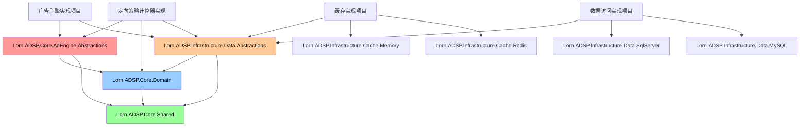

这种设计清晰地分离了请求参数和响应数据的职责，确保了类型安全性，同时提供了良好的扩展性。

## 数据访问抽象接口设计

### 数据访问架构概述

为了解决广告投放引擎中数据访问透明化的问题，我们设计了清晰的分层架构。数据访问相关接口将放在`Lorn.ADSP.Infrastructure.Data.Abstractions`项目中，通过回调机制为广告投放引擎提供透明的数据访问能力。

#### 设计目标

**完全透明的数据访问**：
- 广告投放引擎无需感知缓存、数据库等底层实现
- 通过回调接口统一访问所有数据
- 数据访问的复杂性完全封装在基础设施层
- 引擎层只关注业务逻辑，不关心数据来源

**清晰的分层职责**：
- `Core.AdEngine.Abstractions`：定义引擎相关的回调接口
- `Infrastructure.Data.Abstractions`：定义数据访问相关的抽象接口
- `Core.Domain`：定义领域模型和值对象接口
- 各层职责清晰，避免跨层依赖

#### 修正后的数据访问架构

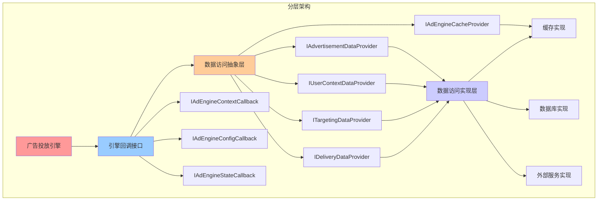

## 回调接口设计规范

### 回调提供者接口设计

#### ICallbackProvider接口定义

为了解决您提出的问题，我们引入了`ICallbackProvider`接口来提供类型安全的回调访问机制：

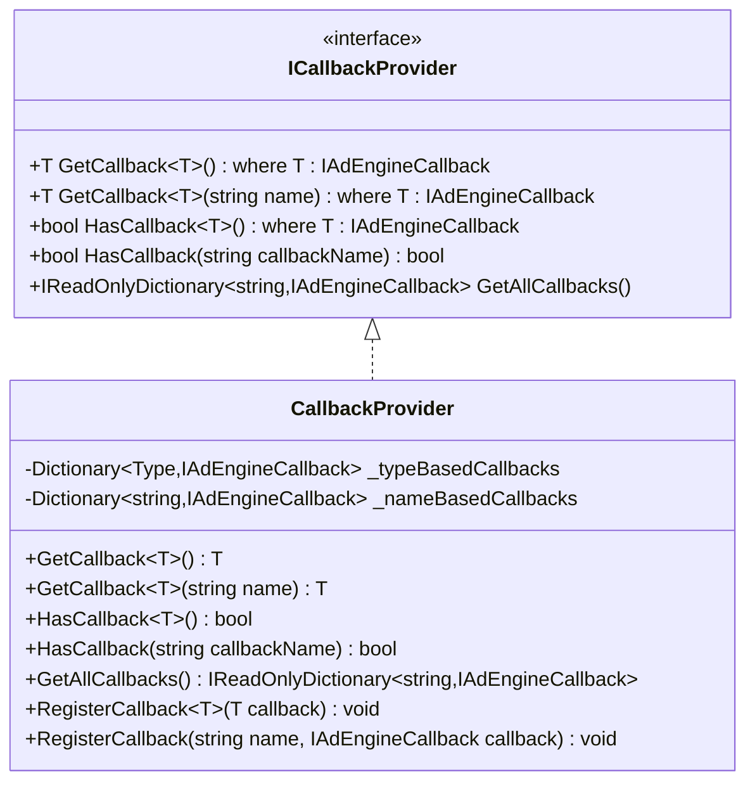

**设计特点**：

1. **类型安全访问**：通过泛型方法`GetCallback<T>()`提供编译时类型检查
2. **命名访问**：支持通过字符串名称访问回调，满足动态配置需求
3. **存在性检查**：提供`HasCallback`方法检查回调是否可用
4. **完整访问**：提供`GetAllCallbacks`方法获取所有可用回调

#### 策略中的回调使用示例

```cs
public class UserInterestRecallStrategy : IAdProcessingStrategy
{
    public async Task<StrategyResult> ExecuteAsync(
        AdContext context, 
        IReadOnlyList<AdCandidate> candidates, 
        ICallbackProvider callbackProvider, 
        CancellationToken cancellationToken)
    {
        // 方式1：类型安全的回调获取
        var dataCallback = callbackProvider.GetCallback<IAdEngineDataCallback>();
        var userProfile = await dataCallback.GetUserProfileAsync(context.UserId, ["interests", "demographics"]);
        
        // 方式2：通过名称获取回调（用于动态配置场景）
        if (callbackProvider.HasCallback("CustomDataSource"))
        {
            var customCallback = callbackProvider.GetCallback<IAdEngineDataCallback>("CustomDataSource");
            var customData = await customCallback.GetHistoricalDataAsync(new HistoricalDataRequest());
        }
        
        // 业务逻辑处理...
        
        return new StrategyResult
        {
            IsSuccess = true,
            ProcessedCandidates = filteredCandidates
        };
    }
    
    public StrategyMetadata GetMetadata()
    {
        return new StrategyMetadata
        {
            Id = "UserInterestRecall",
            RequiredCallbackTypes = new[] { typeof(IAdEngineDataCallback), typeof(IAdEngineConfigCallback) },
            RequiredCallbackNames = new[] { "DataCallback", "ConfigCallback", "CustomDataSource?" } // ?表示可选
        };
    }
}

```

### 回调机制设计考量

#### 设计决策说明

针对您提出的问题，我们选择了`ICallbackProvider`接口而不是简单的`Dictionary<string, IAdEngineCallback>`的原因如下：

**1. 类型安全性**
```cs
// 类型安全的访问方式
var dataCallback = callbackProvider.GetCallback<IAdEngineDataCallback>();

// 而不是容易出错的字符串键访问
var dataCallback = callbacks["DataCallback"] as IAdEngineDataCallback; // 可能为null

```

**2. 接口契约明确**
```cs
public StrategyMetadata GetMetadata()
{
    return new StrategyMetadata
    {
        // 编译时类型检查
        RequiredCallbackTypes = new[] { typeof(IAdEngineDataCallback) },
        // 运行时字符串匹配（用于配置）
        RequiredCallbackNames = new[] { "DataCallback", "ConfigCallback" }
    };
}

```

**3. 灵活的获取方式**
- 通过类型获取：`GetCallback<T>()`适用于静态编译时已知的回调类型
- 通过名称获取：`GetCallback<T>(string name)`适用于动态配置场景
- 存在性检查：避免运行时空引用异常

**4. 向后兼容**
```cs
// 提供底层字典访问以支持特殊场景
public IReadOnlyDictionary<string, IAdEngineCallback> GetAllCallbacks()
{
    return _nameBasedCallbacks.AsReadOnly();
}

```

#### 实现示例

```cs
public class CallbackProvider : ICallbackProvider
{
    private readonly Dictionary<Type, IAdEngineCallback> _typeBasedCallbacks;
    private readonly Dictionary<string, IAdEngineCallback> _nameBasedCallbacks;
    
    public T GetCallback<T>() where T : IAdEngineCallback
    {
        if (_typeBasedCallbacks.TryGetValue(typeof(T), out var callback))
        {
            return (T)callback;
        }
        throw new CallbackNotFoundException($"Callback of type {typeof(T).Name} not found");
    }
    
    public T GetCallback<T>(string name) where T : IAdEngineCallback
    {
        if (_nameBasedCallbacks.TryGetValue(name, out var callback) && callback is T typedCallback)
        {
            return typedCallback;
        }
        throw new CallbackNotFoundException($"Callback named '{name}' of type {typeof(T).Name} not found");
    }
    
    public bool HasCallback<T>() where T : IAdEngineCallback
    {
        return _typeBasedCallbacks.ContainsKey(typeof(T));
    }
    
    public bool HasCallback(string callbackName)
    {
        return _nameBasedCallbacks.ContainsKey(callbackName);
    }
}

```

### 核心回调接口架构

#### 广告引擎上下文回调接口

**上下文访问接口设计要点**：

- 提供统一的上下文信息访问接口，整合数据访问抽象层
- 支持多种数据源的透明访问，包括缓存和数据库
- 实现数据的延迟加载和缓存机制，对策略透明
- 保障数据访问的线程安全性和高并发支持

**主要回调接口类型**：

**广告数据访问回调（基于IAdEngineDataCallback）**：

- 通过IAdvertisementDataProvider获取广告候选集合和筛选
- 通过IUserContextDataProvider获取用户画像和行为数据
- 通过ITargetingDataProvider获取定向策略和匹配逻辑
- 通过IDeliveryDataProvider获取投放状态和预算信息
- 集成IAdEngineCacheProvider提供透明的缓存访问

**配置和状态回调**：

- 策略配置的动态获取和热更新
- 系统状态和性能指标的实时监控
- 业务规则和约束条件的查询
- 异常和风险事件的报告

**指标和监控回调**：

- 策略执行性能的统计和分析
- 业务指标的实时跟踪和告警
- 缓存命中率和数据访问统计
- 系统资源使用情况监控

#### 回调接口性能设计

**异步访问机制**：

- 所有数据访问都采用异步模式，避免阻塞策略执行
- 支持批量数据请求的合并和优化，提高吞吐量
- 实现并发访问的控制和协调，防止资源争用
- 提供超时和重试机制的统一管理

**缓存和预加载策略**：

- 基于IAdEngineCacheProvider的智能缓存管理
- 支持数据预加载机制，优化关键路径性能
- 实现缓存一致性保障，确保数据准确性
- 提供缓存失效和更新的精确控制

**数据访问优化**：

- 通过数据访问抽象层，自动进行查询优化
- 支持分页和流式处理，处理大数据集
- 实现数据格式的标准化和压缩
- 提供网络传输优化和错误处理

### 回调接口安全设计

#### 数据访问权限控制

**权限验证机制**：

- 策略身份的验证和授权
- 数据访问权限的细粒度控制
- 敏感数据的脱敏和保护
- 访问日志的记录和审计

**数据安全传输**：

- 数据传输的加密和完整性校验
- API调用的签名和防篡改
- 敏感信息的安全存储和访问
- 数据泄露的监控和防护

#### 故障隔离和降级

**回调接口的故障隔离**：

- 单个回调失败不影响整体流程
- 回调服务的熔断和降级机制
- 备用数据源的自动切换
- 故障恢复的自动检测和处理

**数据一致性保障**：

- 分布式数据的一致性控制
- 数据更新的事务性保障
- 并发访问的冲突检测和解决
- 数据同步的延迟监控和告警

## 策略集合架构设计

### 层次化策略集合模型

#### 策略集合层次结构

采用层次化的策略集合组织模型，支持复杂的处理流程编排：

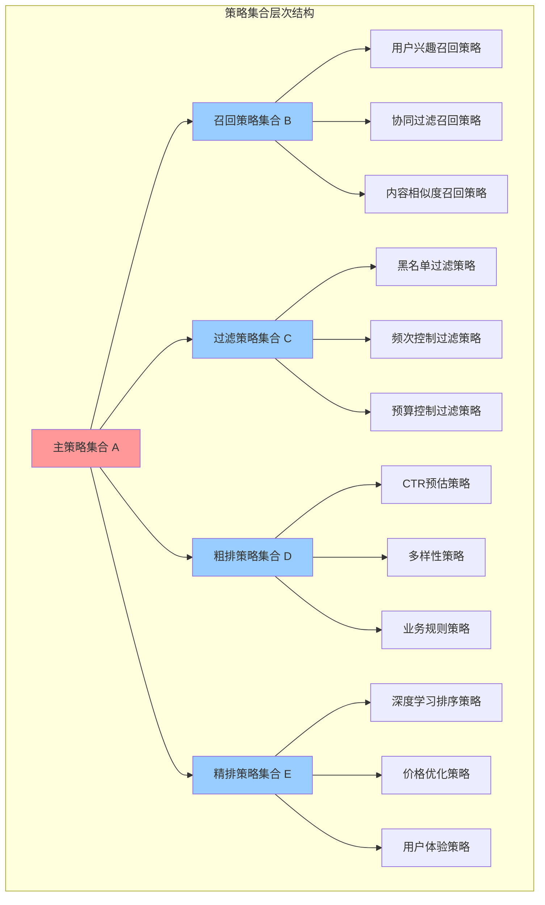

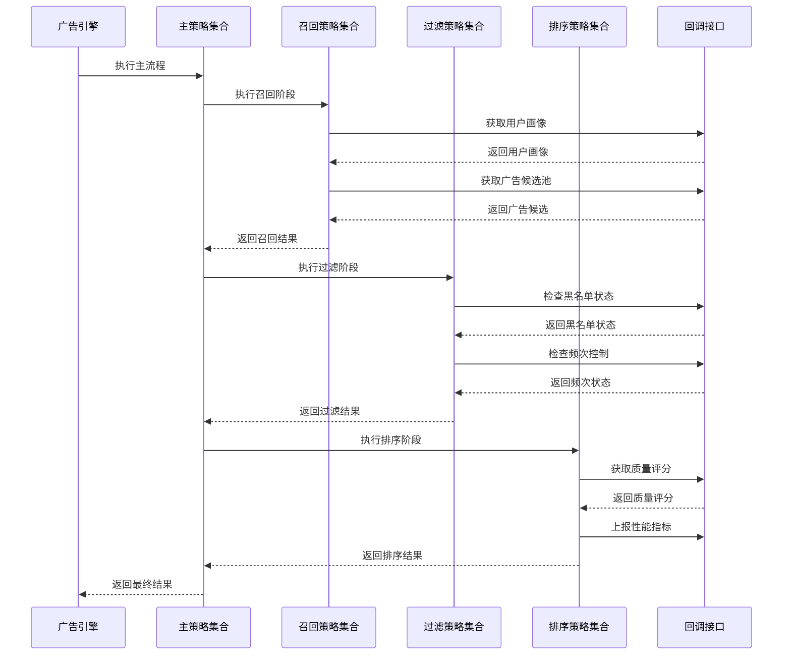

**顶层策略集合（策略集合A）**：

- 作为广告处理的主流程定义
- 包含多个子策略集合的引用
- 定义子策略集合的执行顺序
- 控制整体处理流程的超时和错误处理

**子策略集合（策略集合B、C、D、E等）**：

- 每个子策略集合专注特定的处理阶段
- 包含多个具体策略的组合
- 支持策略间的并行和串行执行
- 提供阶段级别的配置和控制

**具体策略实现**：

- 实现统一的策略接口
- 专注单一的算法逻辑
- 通过回调接口获取所需数据
- 提供标准化的执行结果

#### 策略集合配置模型

**配置结构设计**：

```text
策略集合配置
├── 主流程定义
│   ├── 策略集合A配置
│   │   ├── 子策略集合执行顺序
│   │   ├── 全局超时设置
│   │   ├── 错误处理策略
│   │   └── 监控上报配置
│   └── 执行环境配置
├── 子策略集合定义
│   ├── 召回策略集合B
│   │   ├── 策略列表和优先级
│   │   ├── 并行执行配置
│   │   ├── 结果合并规则
│   │   └── 阶段性能要求
│   ├── 过滤策略集合C
│   ├── 粗排策略集合D
│   └── 精排策略集合E
└── 策略实例配置
    ├── 各策略的参数配置
    ├── 启用状态和版本设置
    ├── 资源限制和超时配置
    └── 监控和告警设置

```

**配置管理机制**：

- 配置版本控制和回滚机制
- 配置变更的实时生效
- 多环境配置管理（开发、测试、生产）
- 配置校验和安全检查

## 定向策略计算器抽象设计

### 定向策略计算器架构概述

定向策略计算器是广告引擎抽象层的重要组成部分，采用统一的策略接口设计，支持各种定向条件的匹配度计算。该设计遵循**单一职责原则**和**开闭原则**，将定向数据存储与匹配算法分离，实现高度可扩展和可测试的架构。

#### 设计理念

**职责分离**：

- 定向上下文信息（TargetingContext）：负责存储和管理各种定向相关的上下文数据
- 定向策略信息（TargetingPolicy）：负责存储广告的定向配置和规则
- 定向策略计算器：专注于实现各种匹配算法和评分逻辑

**统一接口**：

- 所有定向策略计算器都实现统一的 `ITargetingMatcher` 接口
- 支持依赖注入和动态加载
- 提供标准化的输入输出格式

**可扩展架构**：

- 支持运行时动态注册新的定向类型和计算器
- 配置驱动的计算器选择和组合
- 支持计算器的版本管理和热更新

### 定向策略计算器接口设计

#### 核心接口定义

```mermaid
classDiagram
    class ITargetingMatcher {
        <<interface>>
        +string MatcherType
        +string Version
        +int Priority
        +CalculateMatchScore(ITargetingContext context, ITargetingCriteria criteria) Task~MatchResult~
        +IsSupported(string criteriaType) bool
        +GetRequiredContextTypes() IReadOnlyList~string~
        +ValidateCriteria(ITargetingCriteria criteria) ValidationResult
    }
    
    class ITargetingContext {
        <<interface>>
        +string ContextType
        +string ContextId
        +DateTime Timestamp
        +Dictionary~string,object~ Properties
        +T GetProperty~T~(string key)
        +bool HasProperty(string key)
        +ValidationResult Validate()
        +Note: "定义在 Core.Domain 项目中"
    }
    
    class ITargetingCriteria {
        <<interface>>
        +string CriteriaType
        +Dictionary~string,object~ Rules
        +T GetRule~T~(string key)
        +bool HasRule(string key)
        +decimal Weight
        +bool IsEnabled
        +Note: "定义在 Core.Domain 项目中"
    }
    
    class MatchResult {
        +decimal Score
        +bool IsMatch
        +string MatcherType
        +Dictionary~string,object~ Details
        +string ReasonCode
        +TimeSpan ExecutionTime
    }
    
    class GeoTargetingMatcher {
        +CalculateMatchScore(ITargetingContext context, ITargetingCriteria criteria) Task~MatchResult~
        +IsSupported(string criteriaType) bool
        -CalculateDistanceScore(GeoLocation userLocation, GeoLocation targetLocation) decimal
        -CalculateRegionScore(string userRegion, List~string~ targetRegions) decimal
    }
    
    class DemographicTargetingMatcher {
        +CalculateMatchScore(ITargetingContext context, ITargetingCriteria criteria) Task~MatchResult~
        +IsSupported(string criteriaType) bool
        -CalculateAgeScore(int userAge, AgeRange targetRange) decimal
        -CalculateGenderScore(Gender userGender, List~Gender~ targetGenders) decimal
    }
    
    class DeviceTargetingMatcher {
        +CalculateMatchScore(ITargetingContext context, ITargetingCriteria criteria) Task~MatchResult~
        +IsSupported(string criteriaType) bool
        -CalculateDeviceTypeScore(DeviceType userDevice, List~DeviceType~ targetDevices) decimal
        -CalculateOSScore(string userOS, List~string~ targetOS) decimal
    }
    
    class TimeTargetingMatcher {
        +CalculateMatchScore(ITargetingContext context, ITargetingCriteria criteria) Task~MatchResult~
        +IsSupported(string criteriaType) bool
        -CalculateTimeSlotScore(DateTime requestTime, List~TimeSlot~ targetSlots) decimal
        -CalculateDayOfWeekScore(DayOfWeek requestDay, List~DayOfWeek~ targetDays) decimal
    }
    
    class BehaviorTargetingMatcher {
        +CalculateMatchScore(ITargetingContext context, ITargetingCriteria criteria) Task~MatchResult~
        +IsSupported(string criteriaType) bool
        -CalculateInterestScore(List~string~ userInterests, List~string~ targetInterests) decimal
        -CalculateBehaviorPatternScore(UserBehavior userBehavior, BehaviorPattern targetPattern) decimal
    }
    
    ITargetingMatcher <|.. GeoTargetingMatcher
    ITargetingMatcher <|.. DemographicTargetingMatcher
    ITargetingMatcher <|.. DeviceTargetingMatcher
    ITargetingMatcher <|.. TimeTargetingMatcher
    ITargetingMatcher <|.. BehaviorTargetingMatcher
    
    ITargetingMatcher --> MatchResult : creates
    ITargetingMatcher --> ITargetingContext : uses
    ITargetingMatcher --> ITargetingCriteria : uses
```

#### 接口设计说明

**ITargetingMatcher 接口**：

- `MatcherType`：计算器类型标识，用于配置和注册
- `Version`：计算器版本，支持版本管理和兼容性检查
- `Priority`：计算器优先级，影响执行顺序
- `CalculateMatchScore`：核心匹配计算方法，返回匹配结果
- `IsSupported`：检查是否支持指定的条件类型
- `GetRequiredContextTypes`：返回所需的上下文类型列表
- `ValidateCriteria`：验证条件配置的有效性

**ITargetingContext 接口（位于Core.Domain项目）**：

- 统一的上下文数据访问接口
- 支持强类型的属性获取
- 提供属性存在性检查
- 包含时间戳信息用于缓存管理

**ITargetingCriteria 接口（位于Core.Domain项目）**：

- 统一的条件规则访问接口
- 支持强类型的规则获取
- 包含权重和启用状态配置
- 支持复杂的条件规则定义

**依赖关系说明**：

- `ITargetingMatcher`在抽象层项目中定义，作为策略计算器的统一接口
- `ITargetingContext`和`ITargetingCriteria`在Core.Domain项目中定义，作为值对象接口
- 这样的设计避免了循环依赖，符合DDD的分层架构原则

### 定向策略计算器管理器设计

#### 计算器管理器接口

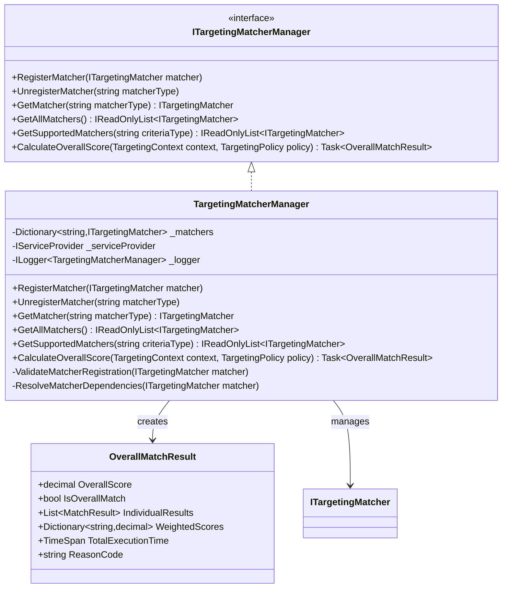

#### 管理器职责说明

**计算器注册管理**：

- 支持运行时动态注册和注销计算器
- 验证计算器的有效性和兼容性
- 管理计算器的依赖关系和生命周期

**计算器查找和选择**：

- 根据条件类型查找支持的计算器
- 按优先级排序计算器执行顺序
- 提供计算器的缓存和性能优化

**整体评分计算**：

- 协调多个计算器的执行
- 合并个体匹配结果为整体评分
- 应用权重配置和聚合策略
- 提供详细的执行统计和调试信息

### 依赖注入和配置管理

#### 服务注册架构设计

**扩展方法设计指导**：

- 在`Lorn.ADSP.Core.AdEngine.Abstractions`项目的`Extensions`目录下设计服务注册扩展方法
- 提供`AddTargetingMatchers`扩展方法，支持链式配置
- 自动扫描和注册所有实现`ITargetingMatcher`接口的类型
- 支持配置选项的强类型绑定

**注册策略设计**：

- 管理器使用单例模式注册，确保全局唯一
- 计算器使用瞬态模式注册，支持并发访问
- 通过配置文件控制计算器的启用状态和参数
- 提供配置验证和默认值设置机制

#### 配置文件架构设计

**配置层次结构**：

- 全局配置：默认阈值、并行执行、最大执行时间等系统级参数
- 计算器配置：每个计算器的权重、启用状态、优先级、特定参数
- 环境配置：支持开发、测试、生产环境的差异化配置

**配置管理原则**：

- 使用强类型配置类，提供编译时检查
- 支持配置热更新，无需重启应用程序
- 实现配置验证机制，防止无效配置
- 提供配置变更的审计和回滚能力

### 计算器执行流程设计

#### 执行编排策略

**流程控制设计**：

- 管理器负责计算器的选择、调度和结果聚合
- 支持串行和并行两种执行模式
- 实现超时控制和异常隔离机制
- 提供执行进度跟踪和性能监控

**结果聚合算法**：

- 根据权重配置计算加权平均分
- 支持多种聚合策略：最大值、最小值、平均值等
- 实现短路机制，当某个计算器分数过低时提前终止
- 提供详细的执行统计和调试信息

#### 性能优化策略

**并发控制机制**：

- 使用`Task.WhenAll`实现异步并行执行
- 通过信号量控制并发度，避免资源过载
- 实现计算器间的依赖关系管理
- 支持优先级调度和资源分配

**缓存策略设计**：

- 实现多层缓存：计算器实例缓存、配置缓存、结果缓存
- 使用LRU算法管理缓存淘汰
- 支持缓存预热和智能预加载
- 实现缓存一致性保证机制

**错误处理策略**：

- 单个计算器失败不影响整体流程
- 提供默认评分和降级策略
- 实现错误传播控制和异常聚合
- 支持故障恢复和自动重试机制

## 扩展性和演进设计

### 新计算器接入指导

**开发流程设计**：

1. **接口实现**：在`Lorn.ADSP.Infrastructure.AdEngine.Targeting`项目中创建新的计算器类，实现`ITargetingMatcher`接口
2. **值对象定义**：如需要新的定向上下文或条件类型，在`Lorn.ADSP.Core.Domain`项目的`ValueObjects/Targeting`目录下定义
3. **依赖注入**：通过自动扫描机制注册，或在扩展方法中显式注册
4. **配置管理**：在appsettings.json中添加计算器配置项
5. **测试验证**：编写单元测试和集成测试确保功能正确性
6. **部署策略**：支持热部署和灰度发布

**设计规范要求**：

- 计算器必须是无状态的，支持并发调用
- 实现幂等性，相同输入产生相同输出
- 提供详细的元数据和配置约束定义
- 支持版本兼容性检查和升级路径
- 遵循DDD分层架构，正确引用Core.Domain中的值对象接口

#### 算法优化和升级策略

**版本管理机制**：

- 支持同类型计算器的多版本共存
- 通过配置控制版本选择和切换
- 提供A/B测试框架验证新算法效果
- 实现渐进式升级和快速回滚能力

**配置驱动优化**：

- 算法参数外化为配置项，支持运行时调整
- 提供参数有效性验证和范围检查
- 实现参数变更的影响分析和风险评估
- 支持参数优化建议和自动调优

**机器学习集成准备**：

- 预留模型推理接口和特征工程框架
- 设计模型版本管理和在线更新机制
- 实现模型性能监控和效果评估
- 支持模型训练数据的收集和标注

**监控和度量体系**：

- 实现计算器执行时间和成功率监控
- 提供业务指标的实时跟踪和告警
- 支持性能瓶颈识别和优化建议
- 实现执行链路追踪和问题诊断

### 与数据访问接口的集成

#### 定向数据访问集成

定向策略计算器通过数据访问抽象接口获取所需数据：

```cs
public class GeoTargetingMatcher : ITargetingMatcher
{
    private readonly ITargetingDataProvider _targetingDataProvider;
    
    public async Task<MatchResult> CalculateMatchScore(
        ITargetingContext context, 
        ITargetingCriteria criteria, 
        CancellationToken cancellationToken)
    {
        // 通过数据访问接口获取地理定向数据，自动处理缓存
        var geoData = await _targetingDataProvider.GetGeoTargetingDataAsync(
            context.GetProperty<string>("LocationHash"), 
            cancellationToken);
            
        var userLocation = context.GetProperty<GeoLocation>("UserLocation");
        var targetLocation = criteria.GetRule<GeoLocation>("TargetLocation");
        
        // 执行匹配算法
        var score = CalculateDistanceScore(userLocation, targetLocation);
        
        return new MatchResult
        {
            Score = score,
            IsMatch = score >= criteria.GetRule<decimal>("MinScore"),
            MatcherType = MatcherType,
            ExecutionTime = stopwatch.Elapsed
        };
    }
}
```

**集成优势**：

1. **透明缓存**：定向计算器无需关心数据缓存逻辑
2. **统一访问**：通过标准化接口访问所有定向相关数据
3. **性能优化**：自动的批量数据获取和预加载
4. **一致性保障**：数据访问接口确保缓存和数据库的一致性

### DDD分层架构合规性说明

#### 分层原则遵循

根据数据模型分层设计文档和DDD最佳实践，我们严格遵循以下分层原则：

**Core.Domain层职责**：
- 定义领域实体（如`AdCandidate`、`Campaign`、`UserProfile`等）
- 定义值对象接口（如`ITargetingContext`、`ITargetingCriteria`）
- 定义聚合根和领域事件
- 包含业务规则和领域逻辑

**Core.AdEngine.Abstractions层职责**：
- 定义引擎抽象接口（如`ITargetingMatcher`、`IAdProcessingStrategy`）
- 定义数据访问抽象接口
- 定义回调机制接口
- 提供扩展点和插件机制

**避免循环依赖**：
- `Core.AdEngine.Abstractions` → `Core.Domain`：抽象层依赖领域层，获取值对象接口
- `Infrastructure.*` → `Core.AdEngine.Abstractions`：基础设施层依赖抽象层，实现具体接口
- `Infrastructure.*` → `Core.Domain`：基础设施层依赖领域层，实现数据持久化

**正确的依赖方向**：
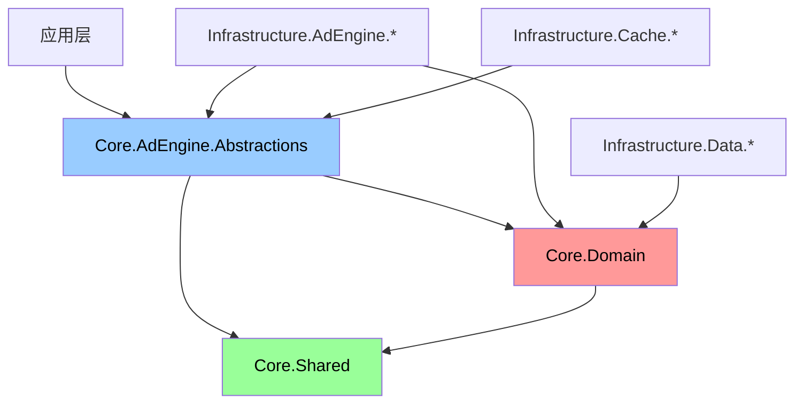

#### 接口定义位置原则

**值对象接口**（定义在Core.Domain）：
- `ITargetingContext`：定向上下文数据结构
- `ITargetingCriteria`：定向条件规则结构
- 这些接口定义了领域概念的数据结构和行为契约

**服务接口**（定义在Core.AdEngine.Abstractions）：
- `ITargetingMatcher`：定向匹配计算服务
- `ITargetingMatcherManager`：定向匹配管理服务
- 这些接口定义了应用服务和基础设施服务的行为契约

#### 实现项目职责

**定向策略计算器实现项目**：
```text
Lorn.ADSP.Infrastructure.AdEngine.Targeting/
├── Matchers/
│   ├── GeoTargetingMatcher.cs
│   ├── DemographicTargetingMatcher.cs
│   ├── DeviceTargetingMatcher.cs
│   ├── TimeTargetingMatcher.cs
│   └── BehaviorTargetingMatcher.cs
├── Managers/
│   └── TargetingMatcherManager.cs
├── Extensions/
│   └── ServiceCollectionExtensions.cs
└── Configuration/
    └── TargetingMatcherOptions.cs
```

**依赖引用**：
- `Core.AdEngine.Abstractions`：获取`ITargetingMatcher`等服务接口
- `Core.Domain`：获取`ITargetingContext`、`ITargetingCriteria`等值对象接口
- `Core.Shared`：获取通用枚举和常量

这样的设计确保了清晰的分层边界，避免了循环依赖，同时符合DDD的设计理念。
