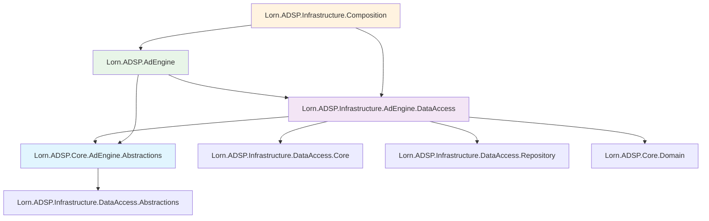
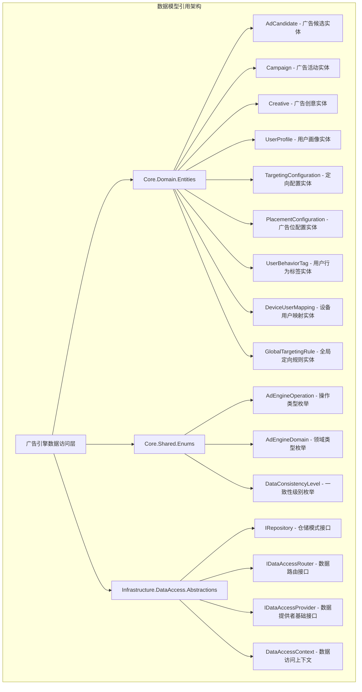
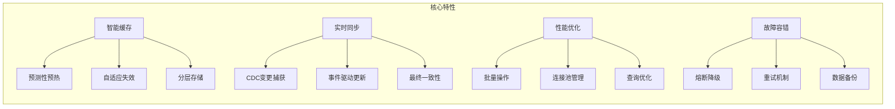
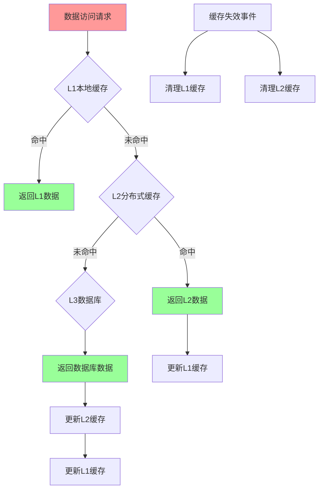
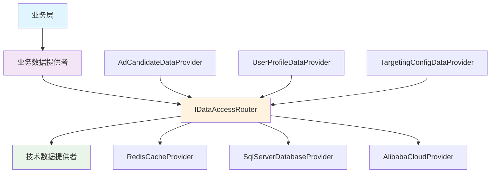

# 广告投放引擎数据访问层技术设计

## 0. 数据提供者职责边界说明

### 0.1 数据提供者严格职责定义

**⚠️ 重要原则：数据提供者绝对不包含任何业务逻辑！**

数据提供者的唯一职责是：
- **纯数据访问**：根据路由配置，与缓存或数据库进行简单的CRUD操作
- **数据格式转换**：将存储格式转换为领域模型格式
- **路由配合**：配合 `IDataAccessRouter` 进行数据源选择，但不实现路由逻辑

**数据提供者绝对禁止的行为**：
- ❌ 调用业务服务（如 `ITargetingService`、`IBiddingService` 等）
- ❌ 实现业务规则和计算逻辑（如定向匹配、竞价计算等）
- ❌ 执行复杂的数据筛选和过滤（应由召回策略、过滤策略等处理）
- ❌ 实现聚合和统计逻辑（应由分析服务处理）
- ❌ 硬编码路由决策逻辑（应由 `IDataAccessRouter` 处理）

**正确的业务逻辑放置位置**：
- 广告候选筛选 → 召回策略（Recall Strategy）
- 定向匹配计算 → 定向策略（Targeting Strategy）
- 竞价逻辑 → 竞价策略（Bidding Strategy）
- 排序算法 → 排序策略（Ranking Strategy）

## 1. 概述

### 1.1 项目架构与依赖关系

#### 1.1.1 Visual Studio解决方案中的项目位置

本技术设计基于现有项目架构，**引用而不重复创建**以下组件：

**引用现有的领域模型（来自数据模型分层设计）**：
```
Lorn.ADSP.sln
├── Core/                                          # 核心业务层
│   ├── Lorn.ADSP.Core.Domain/                     # 【引用】核心领域层
│   │   ├── Entities/                              # 【引用】领域实体
│   │   │   ├── Advertisement.cs                   # 广告信息实体
│   │   │   ├── Campaign.cs                        # 广告活动实体
│   │   │   ├── Advertiser.cs                      # 广告主实体
│   │   │   ├── MediaResource.cs                   # 媒体资源实体
│   │   │   ├── DeliveryRecord.cs                  # 投放记录实体
│   │   │   ├── AdCandidate.cs                     # 广告候选实体
│   │   │   ├── AdContext.cs                       # 广告上下文实体
│   │   │   ├── AdRequest.cs                       # 广告请求实体
│   │   │   ├── UserProfile.cs                     # 用户画像实体
│   │   │   ├── OverallMatchResult.cs              # 匹配结果实体
│   │   │   ├── TargetingConfig.cs                 # 定向配置实体
│   │   │   └── TargetingPolicy.cs                 # 定向策略模板实体
│   │   ├── ValueObjects/                          # 【引用】值对象
│   │   └── Aggregates/                            # 【引用】聚合根
│   │
│   ├── Lorn.ADSP.Core.AdEngine.Abstractions/     # 【新建】广告引擎抽象层
│   │   ├── Interfaces/                            # 数据提供者接口定义
│   │   │   ├── IAdEngineDataProvider.cs          # 广告引擎数据提供者基础接口
│   │   │   ├── IAdCandidateDataProvider.cs       # 广告候选数据提供者接口
│   │   │   ├── IUserProfileDataProvider.cs       # 用户画像数据提供者接口
│   │   │   └── ITargetingConfigDataProvider.cs   # 定向配置数据提供者接口
│   │   ├── Models/                                # 请求响应模型
│   │   │   ├── AdCandidateRequest.cs             # 广告候选查询请求
│   │   │   ├── UserProfileRequest.cs             # 用户画像查询请求
│   │   │   └── TargetingConfigRequest.cs         # 定向配置查询请求
│   │   ├── Enums/                                 # 枚举定义
│   │   │   ├── AdEngineDomain.cs                 # 广告引擎领域枚举
│   │   │   └── AdEngineOperation.cs              # 广告引擎操作枚举
│   │   └── Extensions/                            # 扩展方法
│   │       └── DataAccessExtensions.cs           # 数据访问扩展方法
│
├── Infrastructure/                                # 基础设施层
│   ├── Lorn.ADSP.Infrastructure.DataAccess.Abstractions/  # 【引用】数据访问抽象层
│   ├── Lorn.ADSP.Infrastructure.DataAccess.Core/         # 【引用】数据访问核心层
│   ├── Lorn.ADSP.Infrastructure.DataAccess.Repository/    # 【引用】数据访问仓储层
│   ├── Lorn.ADSP.Infrastructure.Configuration/           # 【引用】统一配置基础设施
│   ├── Lorn.ADSP.Infrastructure.DependencyInjection/     # 【引用】统一依赖注入基础设施
│   │
│   └── Lorn.ADSP.Infrastructure.AdEngine.DataAccess/     # 【新建】广告引擎数据访问实现层
│       ├── Providers/                             # 数据提供者实现
│       │   ├── AdCandidateDataProvider.cs        # 广告候选数据提供者实现
│       │   ├── UserProfileDataProvider.cs        # 用户画像数据提供者实现
│       │   ├── TargetingConfigDataProvider.cs    # 定向配置数据提供者实现
│       │   └── AdEngineDataAccessRouter.cs       # 广告引擎路由器实现
│       ├── Configuration/                         # 配置类
│       │   ├── AdEngineDataAccessOptions.cs      # 数据访问配置选项
│       │   ├── CacheConfiguration.cs             # 缓存配置
│       │   └── RoutingConfiguration.cs           # 路由配置
│       ├── Caching/                               # 缓存策略
│       │   ├── AdEngineCacheStrategy.cs          # 广告引擎缓存策略
│       │   └── CacheKeyBuilder.cs               # 缓存键构建器
│       ├── Monitoring/                            # 监控组件
│       │   ├── DataAccessMetrics.cs             # 数据访问指标
│       │   └── PerformanceCounters.cs           # 性能计数器
│       └── Extensions/                            # 扩展方法
│           └── ServiceCollectionExtensions.cs    # 服务注册扩展
│
└── Services/                                      # 服务层
    └── Lorn.ADSP.AdEngine/                       # 广告引擎服务（已存在）
        ├── Services/                             # 业务服务
        └── Controllers/                          # 控制器
```

#### 1.1.2 项目依赖关系设计



**依赖关系说明**：
- **抽象层**：`Core.AdEngine.Abstractions` 仅依赖基础设施抽象层
- **实现层**：`Infrastructure.AdEngine.DataAccess` 依赖抽象层和基础设施核心组件
- **服务层**：`AdEngine` 服务依赖抽象层和实现层
- **组合层**：`Infrastructure.Composition` 负责整体依赖注入配置

**防止循环引用的设计原则**：
1. 抽象层永远不依赖实现层
2. 上层可以依赖下层，下层不能依赖上层
3. 同层级项目之间通过接口通信，避免直接依赖

#### 1.1.3 核心接口与数据结构定义

**位置**：`Lorn.ADSP.Core.AdEngine.Abstractions/Interfaces/`

```csharp
// IAdEngineDataProvider.cs - 广告引擎数据提供者基础接口
namespace Lorn.ADSP.Core.AdEngine.Abstractions.Interfaces
{
    /// <summary>
    /// 广告引擎数据提供者统一接口
    /// 继承自基础设施层的IDataAccessProvider
    /// </summary>
    public interface IAdEngineDataProvider : IDataAccessProvider
    {
        /// <summary>
        /// 业务领域类型 - 用于路由决策
        /// </summary>
        AdEngineDomain Domain { get; }
        
        /// <summary>
        /// 支持的操作类型 - 用于路由匹配
        /// </summary>
        AdEngineOperation[] SupportedOperations { get; }
        
        /// <summary>
        /// 数据一致性级别 - 影响缓存策略
        /// </summary>
        DataConsistencyLevel ConsistencyLevel { get; }
        
        /// <summary>
        /// 健康检查 - 监控组件调用
        /// 输入：CancellationToken
        /// 输出：bool - 健康状态
        /// </summary>
        Task<bool> HealthCheckAsync(CancellationToken cancellationToken = default);
    }
}

// IAdCandidateDataProvider.cs - 广告候选数据提供者接口
namespace Lorn.ADSP.Core.AdEngine.Abstractions.Interfaces
{
    /// <summary>
    /// 广告候选数据提供者专用接口
    /// 职责：纯数据访问，只提供CRUD操作，不包含任何业务逻辑
    /// </summary>
    public interface IAdCandidateDataProvider : IAdEngineDataProvider
    {
        /// <summary>
        /// 根据广告位ID获取活跃的广告活动列表
        /// 输入参数：
        /// - placementId: string - 广告位ID
        /// - cancellationToken: CancellationToken
        /// 输出参数：
        /// - List<Campaign> - 符合基本条件的活跃广告活动
        /// 注意：只返回数据库中的原始记录，不进行业务过滤
        /// </summary>
        Task<List<Campaign>> GetActiveCampaignsByPlacementAsync(
            string placementId,
            CancellationToken cancellationToken = default);
        
        /// <summary>
        /// 根据广告活动ID获取广告创意
        /// 输入参数：
        /// - campaignIds: List<string> - 广告活动ID列表
        /// - cancellationToken: CancellationToken
        /// 输出参数：
        /// - Dictionary<string, List<Creative>> - 活动ID到创意列表的映射
        /// </summary>
        Task<Dictionary<string, List<Creative>>> GetCreativesByCampaignIdsAsync(
            List<string> campaignIds,
            CancellationToken cancellationToken = default);
        
        /// <summary>
        /// 根据广告活动ID获取定向配置
        /// 输入参数：
        /// - campaignIds: List<string> - 广告活动ID列表
        /// - cancellationToken: CancellationToken
        /// 输出参数：
        /// - Dictionary<string, TargetingConfiguration> - 活动ID到定向配置的映射
        /// </summary>
        Task<Dictionary<string, TargetingConfiguration>>> GetTargetingConfigurationsByCampaignIdsAsync(
            List<string> campaignIds,
            CancellationToken cancellationToken = default);
        
        /// <summary>
        /// 获取广告位配置信息
        /// 输入参数：
        /// - placementId: string - 广告位ID
        /// - cancellationToken: CancellationToken
        /// 输出参数：
        /// - PlacementConfiguration - 广告位配置
        /// </summary>
        Task<PlacementConfiguration> GetPlacementConfigurationAsync(
            string placementId,
            CancellationToken cancellationToken = default);
        
        /// <summary>
        /// 批量获取广告位配置信息
        /// 输入参数：
        /// - placementIds: List<string> - 广告位ID列表
        /// - cancellationToken: CancellationToken
        /// 输出参数：
        /// - Dictionary<string, PlacementConfiguration> - 广告位ID到配置的映射
        /// </summary>
        Task<Dictionary<string, PlacementConfiguration>> GetPlacementConfigurationsBatchAsync(
            List<string> placementIds,
            CancellationToken cancellationToken = default);
    }
}

// IUserProfileDataProvider.cs - 用户画像数据提供者接口
namespace Lorn.ADSP.Core.AdEngine.Abstractions.Interfaces
{
    /// <summary>
    /// 用户画像数据提供者专用接口
    /// 职责：纯数据访问，只提供用户相关的CRUD操作
    /// </summary>
    public interface IUserProfileDataProvider : IAdEngineDataProvider
    {
        /// <summary>
        /// 根据用户ID获取用户基础信息
        /// 输入参数：
        /// - userId: string - 用户ID
        /// - cancellationToken: CancellationToken
        /// 输出参数：
        /// - UserProfile - 用户基础画像信息，如果不存在返回null
        /// </summary>
        Task<UserProfile> GetUserProfileAsync(
            string userId,
            CancellationToken cancellationToken = default);
        
        /// <summary>
        /// 批量获取用户基础信息
        /// 输入参数：
        /// - userIds: List<string> - 用户ID列表
        /// - cancellationToken: CancellationToken
        /// 输出参数：
        /// - Dictionary<string, UserProfile> - 用户ID到画像的映射
        /// </summary>
        Task<Dictionary<string, UserProfile>> GetUserProfilesBatchAsync(
            List<string> userIds,
            CancellationToken cancellationToken = default);
        
        /// <summary>
        /// 根据设备ID获取用户ID映射
        /// 输入参数：
        /// - deviceId: string - 设备ID
        /// - cancellationToken: CancellationToken
        /// 输出参数：
        /// - string - 关联的用户ID，如果不存在返回null
        /// </summary>
        Task<string> GetUserIdByDeviceAsync(
            string deviceId,
            CancellationToken cancellationToken = default);
        
        /// <summary>
        /// 根据用户ID获取行为标签
        /// 输入参数：
        /// - userId: string - 用户ID
        /// - cancellationToken: CancellationToken
        /// 输出参数：
        /// - List<UserBehaviorTag> - 用户行为标签列表
        /// </summary>
        Task<List<UserBehaviorTag>> GetUserBehaviorTagsAsync(
            string userId,
            CancellationToken cancellationToken = default);
    }
}

// ITargetingConfigDataProvider.cs - 定向配置数据提供者接口
namespace Lorn.ADSP.Core.AdEngine.Abstractions.Interfaces
{
    /// <summary>
    /// 定向配置数据提供者专用接口
    /// 职责：纯数据访问，只提供定向配置的CRUD操作
    /// </summary>
    public interface ITargetingConfigDataProvider : IAdEngineDataProvider
    {
        /// <summary>
        /// 根据广告活动ID获取定向配置
        /// 输入参数：
        /// - campaignId: string - 广告活动ID
        /// - cancellationToken: CancellationToken
        /// 输出参数：
        /// - TargetingConfiguration - 定向配置，如果不存在返回null
        /// </summary>
        Task<TargetingConfiguration> GetTargetingConfigurationAsync(
            string campaignId,
            CancellationToken cancellationToken = default);
        
        /// <summary>
        /// 批量获取定向配置
        /// 输入参数：
        /// - campaignIds: List<string> - 广告活动ID列表
        /// - cancellationToken: CancellationToken
        /// 输出参数：
        /// - Dictionary<string, TargetingConfiguration> - 活动ID到配置的映射
        /// </summary>
        Task<Dictionary<string, TargetingConfiguration>> GetTargetingConfigurationsBatchAsync(
            List<string> campaignIds,
            CancellationToken cancellationToken = default);
        
        /// <summary>
        /// 获取全局定向规则
        /// 输入参数：
        /// - ruleType: string - 规则类型（如"geo", "device", "behavior"等）
        /// - cancellationToken: CancellationToken
        /// 输出参数：
        /// - List<GlobalTargetingRule> - 全局定向规则列表
        /// </summary>
        Task<List<GlobalTargetingRule>> GetGlobalTargetingRulesAsync(
            string ruleType,
            CancellationToken cancellationToken = default);
    }
}
```

#### 1.1.4 数据模型引用关系

**重要说明**：广告引擎数据访问层不重复定义数据模型，严格遵循"不重复造轮子"原则，直接引用现有的数据模型设计。

**数据模型引用关系**：



**引用的核心实体**（详细定义参见 `数据模型分层设计.md`）：

| 实体名称                 | 定义位置               | 业务职责         | 数据访问层使用场景                        |
| ------------------------ | ---------------------- | ---------------- | ----------------------------------------- |
| `AdCandidate`            | `Core.Domain.Entities` | 广告候选数据模型 | AdCandidateDataProvider返回的核心数据类型 |
| `Campaign`               | `Core.Domain.Entities` | 广告活动实体     | 通过CampaignRepository查询的实体类型      |
| `Creative`               | `Core.Domain.Entities` | 广告创意实体     | 广告候选数据关联的创意信息                |
| `UserProfile`            | `Core.Domain.Entities` | 用户画像实体     | UserProfileDataProvider返回的核心数据类型 |
| `TargetingConfiguration` | `Core.Domain.Entities` | 定向配置实体     | TargetingConfigDataProvider返回的配置数据 |
| `PlacementConfiguration` | `Core.Domain.Entities` | 广告位配置实体   | 广告位相关的配置信息                      |

**引用的基础设施接口**（详细定义参见 `数据访问层技术设计.md`）：

| 接口名称              | 定义位置                                 | 职责描述           | 数据访问层实现方式                 |
| --------------------- | ---------------------------------------- | ------------------ | ---------------------------------- |
| `IRepository<T>`      | `Infrastructure.DataAccess.Abstractions` | 仓储模式统一接口   | 各DataProvider通过此接口访问数据库 |
| `IDataAccessRouter`   | `Infrastructure.DataAccess.Abstractions` | 数据访问路由器     | 实现缓存优先的数据访问路由决策     |
| `IDataAccessProvider` | `Infrastructure.DataAccess.Abstractions` | 数据提供者基础接口 | 所有广告引擎数据提供者的基础接口   |
| `DataAccessContext`   | `Infrastructure.DataAccess.Abstractions` | 数据访问上下文     | 封装数据访问请求的上下文信息       |

**数据访问层特化接口**：

广告引擎数据访问层只定义业务特化的接口，不重复定义数据模型：

```csharp
namespace Lorn.ADSP.Core.AdEngine.Abstractions.Interfaces
{
    /// <summary>
    /// 广告引擎数据提供者基础接口
    /// 继承自基础设施层的IDataAccessProvider，添加广告引擎特有的元数据
    /// </summary>
    public interface IAdEngineDataProvider : IDataAccessProvider
    {
        /// <summary>
        /// 业务领域类型 - 标识数据提供者的业务领域
        /// </summary>
        AdEngineDomain Domain { get; }
        
        /// <summary>
        /// 支持的操作类型 - 用于路由匹配
        /// </summary>
        AdEngineOperation[] SupportedOperations { get; }
        
        /// <summary>
        /// 数据一致性级别 - 影响缓存策略
        /// </summary>
        DataConsistencyLevel ConsistencyLevel { get; }
    }
}
```

**设计原则**：
- **单一数据源**：所有数据模型定义都在`Core.Domain`项目中，避免重复定义
- **接口特化**：数据访问层只定义特化的接口，不定义实体类
- **依赖引用**：通过项目引用使用现有的数据模型和基础设施
#### 1.1.5 组件实现指导

##### 1.1.5.1 AdCandidateDataProvider 实现指导

**实现位置**：`Lorn.ADSP.Infrastructure.AdEngine.DataAccess/Providers/AdCandidateDataProvider.cs`

**功能职责**：
- 纯数据访问，不包含任何业务逻辑
- 通过IDataAccessRouter进行数据路由
- 使用现有的Repository模式进行数据库操作
- 支持缓存集成但不实现缓存逻辑

**实现要求**：

1. **依赖注入配置**：
   - 注入 `IDataAccessRouter` 用于数据路由
   - 注入 `IRepository<Campaign>` 用于活动数据访问
   - 注入 `IRepository<Creative>` 用于创意数据访问
   - 注入 `IRepository<TargetingConfiguration>` 用于定向配置访问
   - 注入 `IRepository<PlacementConfiguration>` 用于广告位配置访问
   - 注入 `ILogger<AdCandidateDataProvider>` 用于日志记录

2. **核心方法实现逻辑**：
   ```
   GetActiveCampaignsByPlacementAsync() 方法实现：
   1. 构建 DataAccessContext，设置操作类型和参数
   2. 调用 _dataAccessRouter.RouteAsync<List<Campaign>>() 进行路由
   3. 如果路由返回缓存提供者，直接返回缓存结果
   4. 如果是数据库提供者，通过 ICampaignRepository 查询数据库
   5. 返回原始数据，不进行任何业务过滤
   ```

3. **禁止的操作**：
   - 不能调用任何业务服务（如ITargetingService）
   - 不能实现业务逻辑（如定向匹配、过滤等）
   - 不能进行数据转换（除了基本的ORM映射）
   - 不能实现缓存逻辑（由路由器决定）

##### 1.1.5.2 UserProfileDataProvider 实现指导

**实现位置**：`Lorn.ADSP.Infrastructure.AdEngine.DataAccess/Providers/UserProfileDataProvider.cs`

**功能职责**：
- 纯数据访问，只负责用户相关数据的CRUD操作
- 通过IDataAccessRouter进行数据路由
- 使用Repository模式访问用户数据

**实现要求**：

1. **依赖注入配置**：
   - 注入 `IDataAccessRouter` 用于数据路由
   - 注入 `IRepository<UserProfile>` 用于用户画像访问
   - 注入 `IRepository<UserBehaviorTag>` 用于行为标签访问
   - 注入 `IRepository<DeviceUserMapping>` 用于设备用户映射
   - 注入 `ILogger<UserProfileDataProvider>` 用于日志记录

2. **核心方法实现逻辑**：
   ```
   GetUserProfileAsync() 方法实现：
   1. 构建 DataAccessContext，设置用户ID参数
   2. 调用 _dataAccessRouter.RouteAsync<UserProfile>() 进行路由
   3. 如果路由返回缓存提供者，直接返回缓存结果
   4. 如果是数据库提供者，通过 IUserProfileRepository 查询数据库
   5. 返回原始用户画像数据，不进行任何业务处理
   ```

3. **禁止的操作**：
   - 不能调用任何业务服务（如IUserBehaviorService）
   - 不能构建用户画像（只能返回数据库中的原始数据）
   - 不能进行数据整合或计算
   - 不能处理匿名用户逻辑（由业务层处理）

##### 1.1.5.3 TargetingConfigDataProvider 实现指导

**实现位置**：`Lorn.ADSP.Infrastructure.AdEngine.DataAccess/Providers/TargetingConfigDataProvider.cs`

**功能职责**：
- 纯数据访问，只负责定向配置的CRUD操作
- 通过IDataAccessRouter进行数据路由
- 使用Repository模式访问定向配置数据

**实现要求**：

1. **依赖注入配置**：
   - 注入 `IDataAccessRouter` 用于数据路由
   - 注入 `IRepository<TargetingConfiguration>` 用于定向配置访问
   - 注入 `IRepository<GlobalTargetingRule>` 用于全局规则访问
   - 注入 `ILogger<TargetingConfigDataProvider>` 用于日志记录

2. **核心方法实现逻辑**：
   ```
   GetTargetingConfigurationAsync() 方法实现：
   1. 构建 DataAccessContext，设置活动ID参数
   2. 调用 _dataAccessRouter.RouteAsync<TargetingConfiguration>() 进行路由
   3. 如果路由返回缓存提供者，直接返回缓存结果
   4. 如果是数据库提供者，通过 ITargetingConfigurationRepository 查询数据库
   5. 返回原始定向配置数据，不进行任何业务处理
   ```

3. **禁止的操作**：
   - 不能进行配置验证（由业务层处理）
   - 不能实现配置覆盖逻辑
   - 不能处理配置范围（由业务层决定）
   - 不能实现缓存失效逻辑（由路由器处理）

#### 1.1.6 服务注册与配置

**实现位置**：`Lorn.ADSP.Infrastructure.AdEngine.DataAccess/Extensions/ServiceCollectionExtensions.cs`

```csharp
namespace Lorn.ADSP.Infrastructure.AdEngine.DataAccess.Extensions
{
    /// <summary>
    /// 广告引擎数据访问层服务注册扩展
    /// </summary>
    public static class ServiceCollectionExtensions
    {
        /// <summary>
        /// 注册广告引擎数据访问服务
        /// 调用位置：Lorn.ADSP.Infrastructure.Composition/CompositionRoot.cs
        /// </summary>
        public static IServiceCollection AddAdEngineDataAccess(
            this IServiceCollection services, 
            IConfiguration configuration)
        {
            // 注册配置选项
            services.Configure<AdEngineDataAccessOptions>(
                configuration.GetSection("AdEngine:DataAccess"));
            
            // 注册数据提供者
            services.AddScoped<IAdCandidateDataProvider, AdCandidateDataProvider>();
            services.AddScoped<IUserProfileDataProvider, UserProfileDataProvider>();
            services.AddScoped<ITargetingConfigDataProvider, TargetingConfigDataProvider>();
            
            // 注册路由器扩展
            services.AddScoped<IDataAccessRouter, AdEngineDataAccessRouter>();
            
            // 注册缓存策略
            services.AddSingleton<IAdEngineCacheStrategy, AdEngineCacheStrategy>();
            
            // 注册监控组件
            services.AddSingleton<IDataAccessMetrics, DataAccessMetrics>();
            
            return services;
        }
    }
}
```

**调用位置**：`Lorn.ADSP.Infrastructure.Composition/CompositionRoot.cs`

```csharp
public void ConfigureServices(IServiceCollection services, IConfiguration configuration)
{
    // 注册基础设施服务
    services.AddDataAccessCore(configuration);
    
    // 注册广告引擎数据访问服务
    services.AddAdEngineDataAccess(configuration);
    
    // 其他服务注册...
}
```

#### 1.1.7 配置文件结构

**位置**：`appsettings.json` 或 `appsettings.Production.json`

```json
{
  "AdEngine": {
    "DataAccess": {
      "AdCandidate": {
        "TimeoutMs": 5,
        "MaxCandidatesPerRequest": 50,
        "BatchSize": 10,
        "CacheSettings": {
          "DefaultTTL": "00:05:00",
          "MaxCacheSize": "100MB"
        }
      },
      "UserProfile": {
        "TimeoutMs": 20,
        "BatchSize": 20,
        "CacheSettings": {
          "DefaultTTL": "01:00:00",
          "MaxCacheSize": "500MB"
        }
      },
      "TargetingConfig": {
        "TimeoutMs": 30,
        "CacheSettings": {
          "DefaultTTL": "04:00:00",
          "MaxCacheSize": "50MB"
        }
      },
      "Routing": {
        "DefaultStrategy": "Balanced",
        "EnableMetrics": true,
        "HealthCheckInterval": "00:01:00"
      }
    }
  }
}
```

### 1.2 设计目标

广告投放引擎数据访问层基于Lorn.ADSP统一数据架构设计，为广告投放引擎提供高性能、高可用、智能化的数据访问能力。该层遵循系统统一配置化和依赖注入架构原则，通过约定优于配置的方式实现零配置的数据提供者扩展。

**核心设计目标**：
- **超低延迟**：P99响应时间 < 5ms，支持实时竞价场景
- **高并发支持**：单节点支持10万QPS数据访问请求
- **智能缓存**：缓存命中率 > 95%，自动缓存预热和失效
- **多云适配**：支持阿里云、AWS、Azure等多云平台无缝切换
- **业务专用**：针对广告投放业务特点定制的数据访问优化

### 1.3 架构原则

基于Lorn.ADSP统一基础设施的数据访问层专用设计原则：

- **统一接口抽象**：所有数据提供者实现统一的`IAdEngineDataProvider`接口
- **缓存优先策略**：热点数据缓存优先，数据库作为后备存储
- **业务领域分离**：按广告投放业务领域划分数据提供者
- **异步访问模式**：全异步数据操作，提升系统吞吐量
- **智能路由决策**：基于数据特征和访问模式的智能路由
- **多级缓存架构**：L1(本地)→L2(分布式)→L3(数据库)的缓存体系

### 1.4 技术特性



## 2. 数据提供者架构设计

### 2.1 基于领域模型的数据提供者分类

根据广告投放引擎的领域模型，设计以下业务数据提供者：

#### 2.1.1 核心业务数据提供者

| 数据提供者名称               | 业务职责     | 关联领域实体   | 缓存策略          | 性能要求   |
| ---------------------------- | ------------ | -------------- | ----------------- | ---------- |
| `AdvertisementDataProvider`  | 广告信息管理 | Advertisement  | 热数据缓存30分钟  | P99 < 3ms  |
| `CampaignDataProvider`       | 广告活动管理 | Campaign       | 活跃活动缓存1小时 | P99 < 2ms  |
| `AdvertiserDataProvider`     | 广告主管理   | Advertiser     | 基础信息缓存2小时 | P99 < 5ms  |
| `MediaResourceDataProvider`  | 媒体资源管理 | MediaResource  | 配置信息缓存4小时 | P99 < 3ms  |
| `DeliveryRecordDataProvider` | 投放记录管理 | DeliveryRecord | 仅写入，无缓存    | P99 < 10ms |

#### 2.1.2 实时决策数据提供者

| 数据提供者名称                | 业务职责       | 关联领域实体    | 缓存策略            | 性能要求  |
| ----------------------------- | -------------- | --------------- | ------------------- | --------- |
| `AdCandidateDataProvider`     | 广告候选管理   | AdCandidate     | 实时计算，缓存5分钟 | P99 < 1ms |
| `AdContextDataProvider`       | 广告上下文管理 | AdContext       | 请求级缓存          | P99 < 1ms |
| `UserProfileDataProvider`     | 用户画像管理   | UserProfile     | 用户级缓存30分钟    | P99 < 2ms |
| `TargetingConfigDataProvider` | 定向配置管理   | TargetingConfig | 配置缓存1小时       | P99 < 2ms |
| `TargetingPolicyDataProvider` | 定向策略管理   | TargetingPolicy | 模板缓存24小时      | P99 < 3ms |

#### 2.1.3 匹配计算数据提供者

| 数据提供者名称                | 业务职责       | 关联领域实体       | 缓存策略           | 性能要求  |
| ----------------------------- | -------------- | ------------------ | ------------------ | --------- |
| `MatchResultDataProvider`     | 匹配结果管理   | OverallMatchResult | 计算结果缓存10分钟 | P99 < 2ms |
| `MatchConfidenceDataProvider` | 匹配置信度管理 | MatchConfidence    | 统计信息缓存1小时  | P99 < 3ms |

### 2.2 数据提供者接口设计

#### 2.2.1 统一抽象接口

```csharp
/// <summary>
/// 广告引擎数据提供者统一接口
/// 基于Lorn.ADSP.Infrastructure.DataAccess.Abstractions.IDataAccessProvider扩展
/// </summary>
public interface IAdEngineDataProvider : IDataAccessProvider
{
    /// <summary>
    /// 业务领域类型
    /// </summary>
    AdEngineDomain Domain { get; }
    
    /// <summary>
    /// 支持的操作类型
    /// </summary>
    AdEngineOperation[] SupportedOperations { get; }
    
    /// <summary>
    /// 缓存策略配置
    /// </summary>
    CacheStrategy CacheStrategy { get; }
    
    /// <summary>
    /// 性能指标配置
    /// </summary>
    PerformanceMetrics PerformanceMetrics { get; }
}

/// <summary>
/// 广告引擎业务领域枚举
/// </summary>
public enum AdEngineDomain
{
    Advertisement,      // 广告管理域
    Campaign,          // 活动管理域  
    Targeting,         // 定向管理域
    Matching,          // 匹配计算域
    Delivery,          // 投放执行域
    Analytics          // 数据分析域
}

/// <summary>
/// 广告引擎操作类型枚举
/// </summary>
public enum AdEngineOperation
{
    GetCandidates,     // 获取广告候选
    GetProfile,        // 获取用户画像
    CalculateMatch,    // 计算匹配度
    RecordDelivery,    // 记录投放
    GetStatistics,     // 获取统计
    BatchQuery,        // 批量查询
    RealTimeSync       // 实时同步
}
```

#### 2.2.2 业务专用接口

```csharp
/// <summary>
/// 广告候选数据提供者接口
/// </summary>
public interface IAdCandidateDataProvider : IAdEngineDataProvider
{
    /// <summary>
    /// 获取广告候选列表
    /// </summary>
    Task<List<AdCandidate>> GetCandidatesAsync(
        AdRequest request, 
        TargetingContext targetingContext,
        CancellationToken cancellationToken = default);
    
    /// <summary>
    /// 批量获取广告候选
    /// </summary>
    Task<Dictionary<string, List<AdCandidate>>> GetBatchCandidatesAsync(
        List<AdRequest> requests,
        CancellationToken cancellationToken = default);
    
    /// <summary>
    /// 预热广告候选缓存
    /// </summary>
    Task WarmupCandidateCacheAsync(
        List<string> campaignIds,
        CancellationToken cancellationToken = default);
}

/// <summary>
/// 用户画像数据提供者接口
/// </summary>
public interface IUserProfileDataProvider : IAdEngineDataProvider
{
    /// <summary>
    /// 获取用户画像
    /// </summary>
    Task<UserProfile> GetUserProfileAsync(
        string userId,
        CancellationToken cancellationToken = default);
    
    /// <summary>
    /// 批量获取用户画像
    /// </summary>
    Task<Dictionary<string, UserProfile>> GetBatchUserProfilesAsync(
        List<string> userIds,
        CancellationToken cancellationToken = default);
    
    /// <summary>
    /// 获取用户兴趣标签
    /// </summary>
    Task<List<string>> GetUserInterestTagsAsync(
        string userId,
        CancellationToken cancellationToken = default);
    
    /// <summary>
    /// 更新用户行为数据
    /// </summary>
    Task UpdateUserBehaviorAsync(
        string userId,
        UserBehaviorData behaviorData,
        CancellationToken cancellationToken = default);
}

/// <summary>
/// 定向配置数据提供者接口
/// </summary>
public interface ITargetingConfigDataProvider : IAdEngineDataProvider
{
    /// <summary>
    /// 获取活动定向配置
    /// </summary>
    Task<TargetingConfig> GetTargetingConfigAsync(
        string campaignId,
        CancellationToken cancellationToken = default);
    
    /// <summary>
    /// 批量获取定向配置
    /// </summary>
    Task<Dictionary<string, TargetingConfig>> GetBatchTargetingConfigsAsync(
        List<string> campaignIds,
        CancellationToken cancellationToken = default);
    
    /// <summary>
    /// 创建定向配置
    /// </summary>
    Task<TargetingConfig> CreateTargetingConfigAsync(
        string campaignId,
        string sourcePolicyId,
        Dictionary<string, object> dynamicParameters,
        CancellationToken cancellationToken = default);
    
    /// <summary>
    /// 更新定向配置
    /// </summary>
    Task UpdateTargetingConfigAsync(
        TargetingConfig config,
        CancellationToken cancellationToken = default);
}
```

### 2.3 缓存架构设计

#### 2.3.1 多级缓存策略



#### 2.3.2 缓存配置策略

```json
{
  "CacheStrategies": {
    "AdvertisementDataProvider": {
      "L1Cache": {
        "Enabled": true,
        "MaxSize": "100MB",
        "TTL": "00:30:00",
        "EvictionPolicy": "LRU"
      },
      "L2Cache": {
        "Enabled": true,
        "KeyPrefix": "adsp:ad:",
        "TTL": "01:00:00",
        "CompressionEnabled": true
      },
      "WarmupStrategy": {
        "Enabled": true,
        "WarmupOnStartup": true,
        "PredictivePreload": true
      }
    },
    "UserProfileDataProvider": {
      "L1Cache": {
        "Enabled": true,
        "MaxSize": "200MB",
        "TTL": "00:15:00",
        "EvictionPolicy": "LFU"
      },
      "L2Cache": {
        "Enabled": true,
        "KeyPrefix": "adsp:user:",
        "TTL": "00:30:00",
        "CompressionEnabled": true
      },
      "PrivacyMode": {
        "Enabled": true,
        "DataMasking": true,
        "AutoExpiration": true
      }
    },
    "AdCandidateDataProvider": {
      "L1Cache": {
        "Enabled": true,
        "MaxSize": "500MB",
        "TTL": "00:05:00",
        "EvictionPolicy": "TTL"
      },
      "L2Cache": {
        "Enabled": true,
        "KeyPrefix": "adsp:candidate:",
        "TTL": "00:10:00",
        "CompressionEnabled": false
      },
      "RealTimeUpdate": {
        "Enabled": true,
        "EventDriven": true,
        "BatchUpdate": false
      }
    }
  }
}
```

### 2.4 路由决策架构

#### 2.4.1 智能路由策略

```csharp
/// <summary>
/// 广告引擎数据路由策略
/// </summary>
public enum AdEngineRoutingStrategy
{
    /// <summary>
    /// 缓存优先策略：L1 → L2 → Database
    /// 适用于：广告信息、用户画像等相对稳定的数据
    /// </summary>
    CacheFirst,
    
    /// <summary>
    /// 数据库优先策略：Database → Cache Update
    /// 适用于：投放记录、实时统计等强一致性数据
    /// </summary>
    DatabaseFirst,
    
    /// <summary>
    /// 实时计算策略：Cache + Real-time Calculation
    /// 适用于：广告候选、匹配结果等动态计算数据
    /// </summary>
    RealTimeCalculation,
    
    /// <summary>
    /// 仅缓存策略：Cache Only
    /// 适用于：热点数据、高频访问的只读数据
    /// </summary>
    CacheOnly,
    
    /// <summary>
    /// 混合策略：根据数据特征动态选择
    /// 适用于：复杂业务场景的自适应路由
    /// </summary>
    Hybrid
}
```

#### 2.4.2 路由决策配置

```json
{
  "AdEngineRoutingStrategies": {
    "Advertisement": "CacheFirst",
    "Campaign": "CacheFirst", 
    "Advertiser": "CacheFirst",
    "MediaResource": "CacheFirst",
    "DeliveryRecord": "DatabaseFirst",
    "AdCandidate": "RealTimeCalculation",
    "AdContext": "CacheOnly",
    "UserProfile": "CacheFirst",
    "TargetingConfig": "CacheFirst",
    "TargetingPolicy": "CacheOnly",
    "MatchResult": "RealTimeCalculation",
    "MatchConfidence": "CacheFirst"
  },
  "RoutingRules": {
    "RealTime": {
      "MaxLatency": "00:00:00.001",
      "FallbackStrategy": "CacheOnly",
      "EnableCircuitBreaker": true
    },
    "Batch": {
      "BatchSize": 100,
      "MaxWaitTime": "00:00:00.050",
      "FallbackStrategy": "DatabaseFirst"
    }
  }
}
```

## 3. 具体数据提供者实现设计

### 3.1 设计修正说明

**重要修正**：之前的设计存在严重的架构错误，将路由决策逻辑硬编码到了具体数据提供者中，这违背了统一数据访问层的设计原则。

**正确的架构分工**：
- **数据提供者**：只负责纯粹的数据访问逻辑，不包含任何路由决策
- **路由决策引擎**：`IDataAccessRouter` 负责根据配置决定使用哪个数据提供者
- **业务数据提供者**：通过 `IDataAccessRouter` 调用技术提供者（缓存、数据库）

### 3.2 广告候选数据提供者（修正版）

#### 3.2.1 纯数据访问提供者

```csharp
[Component(ConfigurationSection = "DataProviders:AdCandidate")]
public class AdCandidateDataProvider : IAdCandidateDataProvider, IHealthCheckable
{
    private readonly IDataAccessRouter _dataAccessRouter;
    private readonly IRepository<AdCandidate> _adCandidateRepository;
    private readonly AdCandidateDataProviderOptions _options;
    private readonly ILogger<AdCandidateDataProvider> _logger;

    public AdEngineDomain Domain => AdEngineDomain.Matching;
    
    public AdEngineOperation[] SupportedOperations => new[]
    {
        AdEngineOperation.GetCandidates,
        AdEngineOperation.BatchQuery,
        AdEngineOperation.RealTimeSync
    };
    
    /// <summary>
    /// 根据广告位ID列表获取广告候选
    /// 注意：此方法只负责数据访问，不包含任何业务逻辑
    /// 业务筛选逻辑应在召回策略中实现
    /// </summary>
    public async Task<List<AdCandidate>> GetCandidatesByPlacementIdsAsync(
        List<string> placementIds,
        CancellationToken cancellationToken = default)
    {
        // 构建数据访问上下文
        var context = new DataAccessContext
        {
            OperationType = "GetCandidatesByPlacementIds",
            EntityType = "AdCandidate",
            Parameters = new Dictionary<string, object>
            {
                ["PlacementIds"] = placementIds,
                ["CacheKey"] = BuildPlacementCacheKey(placementIds)
            },
            ConsistencyLevel = DataConsistencyLevel.EventualConsistency,
            Timeout = TimeSpan.FromMilliseconds(50), // 实时竞价要求
            Tags = new[] { "RealTime", "AdCandidates" }
        };
        
        // 通过路由器获取合适的数据提供者
        var provider = await _dataAccessRouter.RouteAsync(context, cancellationToken);
        
        // 如果路由到缓存提供者，尝试从缓存获取
        if (provider is ICacheProvider cacheProvider)
        {
            var cacheKey = BuildPlacementCacheKey(placementIds);
            var cachedCandidates = await cacheProvider.GetAsync<List<AdCandidate>>(cacheKey, cancellationToken);
            if (cachedCandidates != null)
            {
                return cachedCandidates;
            }
        }
        
        // 如果缓存未命中或路由到数据库提供者，从数据源获取
        var candidates = await QueryCandidatesFromSourceAsync(placementIds, cancellationToken);
        
        // 如果有缓存提供者，更新缓存
        if (provider is ICacheProvider updateCacheProvider && candidates != null)
        {
            var cacheKey = BuildPlacementCacheKey(placementIds);
            await updateCacheProvider.SetAsync(cacheKey, candidates, TimeSpan.FromMinutes(5), cancellationToken);
        }
        
        return candidates ?? new List<AdCandidate>();
    }
    
    /// <summary>
    /// 根据活动ID列表获取广告候选
    /// 注意：此方法只负责数据访问，不包含任何业务逻辑
    /// </summary>
    public async Task<List<AdCandidate>> GetCandidatesByCampaignIdsAsync(
        List<string> campaignIds,
        CancellationToken cancellationToken = default)
    {
        // 构建数据访问上下文
        var context = new DataAccessContext
        {
            OperationType = "GetCandidatesByCampaignIds",
            EntityType = "AdCandidate",
            Parameters = new Dictionary<string, object>
            {
                ["CampaignIds"] = campaignIds,
                ["CacheKey"] = BuildCampaignCacheKey(campaignIds)
            },
            ConsistencyLevel = DataConsistencyLevel.EventualConsistency,
            Timeout = TimeSpan.FromMilliseconds(50),
            Tags = new[] { "RealTime", "AdCandidates" }
        };
        
        // 通过路由器获取合适的数据提供者
        var provider = await _dataAccessRouter.RouteAsync(context, cancellationToken);
        
        // 如果路由到缓存提供者，尝试从缓存获取
        if (provider is ICacheProvider cacheProvider)
        {
            var cacheKey = BuildCampaignCacheKey(campaignIds);
            var cachedCandidates = await cacheProvider.GetAsync<List<AdCandidate>>(cacheKey, cancellationToken);
            if (cachedCandidates != null)
            {
                return cachedCandidates;
            }
        }
        
        // 从数据源获取
        var candidates = await QueryCandidatesByCampaignIdsFromSourceAsync(campaignIds, cancellationToken);
        
        // 更新缓存
        if (provider is ICacheProvider updateCacheProvider && candidates != null)
        {
            var cacheKey = BuildCampaignCacheKey(campaignIds);
            await updateCacheProvider.SetAsync(cacheKey, candidates, TimeSpan.FromMinutes(5), cancellationToken);
        }
        
        return candidates ?? new List<AdCandidate>();
    }
    
    /// <summary>
    /// 批量获取广告候选 - 用于批量处理场景
    /// </summary>
    public async Task<Dictionary<string, List<AdCandidate>>> GetBatchCandidatesAsync(
        List<string> batchKeys,
        CancellationToken cancellationToken = default)
    {
        var result = new Dictionary<string, List<AdCandidate>>();
        var batchSize = Math.Min(batchKeys.Count, _options.BatchSize);
        
        for (int i = 0; i < batchKeys.Count; i += batchSize)
        {
            var batch = batchKeys.Skip(i).Take(batchSize);
            var batchTasks = batch.Select(async key =>
            {
                // 假设key是placementId，实际应根据业务需求调整
                var candidates = await GetCandidatesByPlacementIdsAsync(new List<string> { key }, cancellationToken);
                return new { Key = key, Candidates = candidates };
            });
            
            var batchResults = await Task.WhenAll(batchTasks);
            
            foreach (var batchResult in batchResults)
            {
                result[batchResult.Key] = batchResult.Candidates;
            }
        }
        
        return result;
    }
    
    // 私有辅助方法 - 纯数据访问，无业务逻辑
    
    /// <summary>
    /// 纯粹的数据源查询逻辑 - 根据广告位ID查询
    /// 注意：不包含任何业务筛选逻辑
    /// </summary>
    private async Task<List<AdCandidate>> QueryCandidatesFromSourceAsync(
        List<string> placementIds,
        CancellationToken cancellationToken)
    {
        using var activity = Activity.StartActivity("QueryCandidatesFromSource");
        
        try
        {
            // 纯粹的数据库查询 - 根据广告位ID获取所有候选
            var candidates = await _adCandidateRepository.GetByPredicateAsync(
                c => placementIds.Contains(c.PlacementId) && c.Status == CandidateStatus.Active,
                cancellationToken);
            
            _logger.LogDebug("Retrieved {CandidateCount} ad candidates for placements: {PlacementIds}", 
                candidates.Count, string.Join(",", placementIds));
            
            return candidates.ToList();
        }
        catch (Exception ex)
        {
            _logger.LogError(ex, "Error querying ad candidates for placements: {PlacementIds}", 
                string.Join(",", placementIds));
            throw;
        }
    }
    
    /// <summary>
    /// 纯粹的数据源查询逻辑 - 根据活动ID查询
    /// 注意：不包含任何业务筛选逻辑
    /// </summary>
    private async Task<List<AdCandidate>> QueryCandidatesByCampaignIdsFromSourceAsync(
        List<string> campaignIds,
        CancellationToken cancellationToken)
    {
        using var activity = Activity.StartActivity("QueryCandidatesByCampaignIds");
        
        try
        {
            // 纯粹的数据库查询 - 根据活动ID获取所有候选
            var candidates = await _adCandidateRepository.GetByPredicateAsync(
                c => campaignIds.Contains(c.CampaignId) && c.Status == CandidateStatus.Active,
                cancellationToken);
            
            _logger.LogDebug("Retrieved {CandidateCount} ad candidates for campaigns: {CampaignIds}", 
                candidates.Count, string.Join(",", campaignIds));
            
            return candidates.ToList();
        }
        catch (Exception ex)
        {
            _logger.LogError(ex, "Error querying ad candidates for campaigns: {CampaignIds}", 
                string.Join(",", campaignIds));
            throw;
        }
    }
    
    private string BuildPlacementCacheKey(List<string> placementIds)
    {
        var sortedIds = placementIds.OrderBy(x => x);
        return $"candidates:placement:{string.Join("-", sortedIds)}";
    }
    
    private string BuildCampaignCacheKey(List<string> campaignIds)
    {
        var sortedIds = campaignIds.OrderBy(x => x);
        return $"candidates:campaign:{string.Join("-", sortedIds)}";
    }
    
    public async Task<bool> HealthCheckAsync(CancellationToken cancellationToken = default)
    {
        try
        {
            // 检查仓储的健康状态
            var repositoryHealthy = await _adCandidateRepository.HealthCheckAsync(cancellationToken);
            
            // 检查路由器是否能正常工作
            var testContext = new DataAccessContext
            {
                OperationType = "HealthCheck",
                EntityType = "AdCandidate"
            };
            
            var provider = await _dataAccessRouter.RouteAsync(testContext, cancellationToken);
            var routerHealthy = provider != null;
            
            return repositoryHealthy && routerHealthy;
        }
        catch
        {
            return false;
        }
    }
}
        CancellationToken cancellationToken)
    {
        using var activity = Activity.StartActivity("QueryCandidatesFromSource");
        
        try
        {
            // 1. 获取活跃的广告活动
            var activeCampaigns = await _campaignRepository.GetActiveCampaignsAsync(
                request.PlacementIds, 
                cancellationToken);
            
            if (!activeCampaigns.Any())
            {
                _logger.LogInformation("No active campaigns found for placements: {PlacementIds}", 
                    string.Join(",", request.PlacementIds));
                return new List<AdCandidate>();
            }
            
            // 2. 应用定向筛选
            var targetedCampaigns = await _targetingService.FilterCampaignsByTargetingAsync(
                activeCampaigns, 
                targetingContext, 
                cancellationToken);
            
            // 3. 构建广告候选
            var candidates = new List<AdCandidate>();
            foreach (var campaign in targetedCampaigns)
            {
                foreach (var placementId in request.PlacementIds)
                {
                    if (campaign.SupportsPlacement(placementId))
                    {
                        var candidate = new AdCandidate
                        {
                            Id = Guid.NewGuid().ToString(),
                            CampaignId = campaign.Id.ToString(),
                            PlacementId = placementId,
                            Campaign = campaign,
                            BidPrice = campaign.BiddingStrategy.CalculateBidPrice(targetingContext),
                            RequestContext = request.Metadata,
                            CreatedAt = DateTime.UtcNow,
                            Status = CandidateStatus.Active
                        };
                        
                        candidates.Add(candidate);
                    }
                }
            }
            
            // 4. 应用候选数量限制
            if (candidates.Count > _options.MaxCandidatesPerRequest)
            {
                candidates = candidates
                    .OrderByDescending(c => c.BidPrice)
                    .Take(_options.MaxCandidatesPerRequest)
                    .ToList();
            }
            
            _logger.LogDebug("Generated {CandidateCount} ad candidates for request {RequestId}", 
                candidates.Count, request.RequestId);
            
            return candidates;
        }
        catch (Exception ex)
        {
            _logger.LogError(ex, "Error querying ad candidates for request {RequestId}", request.RequestId);
            throw;
        }
    }
    
    public async Task<Dictionary<string, List<AdCandidate>>> GetBatchCandidatesAsync(
        List<AdRequest> requests,
        CancellationToken cancellationToken = default)
    {
        var result = new Dictionary<string, List<AdCandidate>>();
        var batchSize = Math.Min(requests.Count, _options.BatchSize);
        
        for (int i = 0; i < requests.Count; i += batchSize)
        {
            var batch = requests.Skip(i).Take(batchSize);
            var batchTasks = batch.Select(async request =>
            {
                var targetingContext = await BuildTargetingContextAsync(request, cancellationToken);
                var candidates = await GetCandidatesAsync(request, targetingContext, cancellationToken);
                return new { request.RequestId, Candidates = candidates };
            });
            
            var batchResults = await Task.WhenAll(batchTasks);
            
            foreach (var batchResult in batchResults)
            {
                result[batchResult.RequestId] = batchResult.Candidates;
            }
        }
        
        return result;
    }
    
    private string BuildCandidateCacheKey(AdRequest request, TargetingContext targetingContext)
    {
        var keyComponents = new[]
        {
            string.Join("-", request.PlacementIds.OrderBy(x => x)),
            targetingContext.GetUserSegments().FirstOrDefault() ?? "anonymous",
            targetingContext.GetTimeSlot().ToString(),
            request.DeviceInfo?.DeviceType.ToString() ?? "unknown"
        };
        
        return $"candidates:{string.Join(":", keyComponents)}";
    }
    
    private async Task<TargetingContext> BuildTargetingContextAsync(AdRequest request, CancellationToken cancellationToken)
    {
        return new TargetingContext
        {
            RequestId = request.RequestId,
            UserId = request.UserInfo?.UserId,
            DeviceInfo = request.DeviceInfo,
            LocationInfo = request.LocationInfo,
            RequestTime = request.RequestTime
        };
    }
    
    public async Task<bool> HealthCheckAsync(CancellationToken cancellationToken = default)
    {
        try
        {
            // 检查依赖服务的健康状态
            var campaignHealthy = await _campaignRepository.HealthCheckAsync(cancellationToken);
            var targetingHealthy = await _targetingService.HealthCheckAsync(cancellationToken);
            
            // 检查路由器是否能正常工作
            var testContext = new DataAccessContext
            {
                OperationType = "HealthCheck",
                EntityType = "AdCandidate"
            };
            
            var provider = await _dataAccessRouter.RouteAsync(testContext, cancellationToken);
            var routerHealthy = provider != null;
            
            return campaignHealthy && targetingHealthy && routerHealthy;
        }
        catch
        {
            return false;
        }
    }
}
```

#### 3.2.2 配置选项

```csharp
public class AdCandidateDataProviderOptions
{
    [Range(1, 1000)]
    public int MaxCandidatesPerRequest { get; set; } = 100;
    
    [Range(1, 10000)]
    public int BatchSize { get; set; } = 50;
    
    public TimeSpan DatabaseTimeout { get; set; } = TimeSpan.FromMilliseconds(500);
    
    public bool EnableRealTimeUpdate { get; set; } = true;
    
    public bool EnableDebugLogging { get; set; } = false;
}
```

### 3.3 用户画像数据提供者（修正版）

#### 3.3.1 业务数据提供者

```csharp
[Component(ConfigurationSection = "DataProviders:UserProfile")]
public class UserProfileDataProvider : IUserProfileDataProvider, IHealthCheckable
{
    private readonly IDataAccessRouter _dataAccessRouter;
    private readonly IUserProfileRepository _userProfileRepository;
    private readonly IPrivacyManager _privacyManager;
    private readonly UserProfileDataProviderOptions _options;
    private readonly ILogger<UserProfileDataProvider> _logger;

    public AdEngineDomain Domain => AdEngineDomain.Targeting;
    
    public AdEngineOperation[] SupportedOperations => new[]
    {
        AdEngineOperation.GetProfile,
        AdEngineOperation.BatchQuery
    };
    
    public async Task<UserProfile> GetUserProfileAsync(
        string userId,
        CancellationToken cancellationToken = default)
    {
        // 隐私保护前置检查
        if (!_privacyManager.CanAccessUserData(userId))
        {
            return CreateAnonymousProfile(userId);
        }
        
        // 构建数据访问上下文
        var context = new DataAccessContext
        {
            OperationType = "GetUserProfile",
            EntityType = "UserProfile",
            Parameters = new Dictionary<string, object>
            {
                ["UserId"] = userId,
                ["CacheKey"] = $"user:{userId}"
            },
            ConsistencyLevel = DataConsistencyLevel.EventualConsistency,
            Timeout = TimeSpan.FromMilliseconds(200),
            Tags = new[] { "UserProfile", "PersonalData" }
        };
        
        // 通过路由器获取数据
        var profile = await _dataAccessRouter.GetDataAsync<UserProfile>(
            context,
            async ctx => await QueryUserProfileFromSourceAsync(userId, cancellationToken),
            cancellationToken);
        
        // 应用隐私保护
        return ApplyPrivacyMasking(profile ?? CreateDefaultProfile(userId));
    }
    
    public async Task<Dictionary<string, UserProfile>> GetBatchUserProfilesAsync(
        List<string> userIds,
        CancellationToken cancellationToken = default)
    {
        var result = new Dictionary<string, UserProfile>();
        var validUserIds = new List<string>();
        
        // 隐私保护批量检查
        foreach (var userId in userIds)
        {
            if (!_privacyManager.CanAccessUserData(userId))
            {
                result[userId] = CreateAnonymousProfile(userId);
            }
            else
            {
                validUserIds.Add(userId);
            }
        }
        
        if (!validUserIds.Any())
        {
            return result;
        }
        
        // 构建批量数据访问上下文
        var context = new DataAccessContext
        {
            OperationType = "GetBatchUserProfiles",
            EntityType = "UserProfile",
            Parameters = new Dictionary<string, object>
            {
                ["UserIds"] = validUserIds,
                ["BatchSize"] = _options.BatchSize
            },
            ConsistencyLevel = DataConsistencyLevel.EventualConsistency,
            Timeout = TimeSpan.FromMilliseconds(500),
            Tags = new[] { "UserProfile", "BatchQuery" }
        };
        
        // 通过路由器获取批量数据
        var profiles = await _dataAccessRouter.GetDataAsync<Dictionary<string, UserProfile>>(
            context,
            async ctx => await QueryBatchUserProfilesFromSourceAsync(validUserIds, cancellationToken),
            cancellationToken);
        
        // 应用隐私保护并合并结果
        foreach (var userId in validUserIds)
        {
            var profile = profiles?.GetValueOrDefault(userId) ?? CreateDefaultProfile(userId);
            result[userId] = ApplyPrivacyMasking(profile);
        }
        
        return result;
    }
    
    /// <summary>
    /// 纯粹的数据源查询逻辑
    /// </summary>
    private async Task<UserProfile> QueryUserProfileFromSourceAsync(
        string userId, 
        CancellationToken cancellationToken)
    {
        try
        {
            return await _userProfileRepository.GetByUserIdAsync(userId, cancellationToken);
        }
        catch (Exception ex)
        {
            _logger.LogError(ex, "Error querying user profile for user {UserId}", userId);
            return null;
        }
    }
    
    /// <summary>
    /// 纯粹的批量数据源查询逻辑
    /// </summary>
    private async Task<Dictionary<string, UserProfile>> QueryBatchUserProfilesFromSourceAsync(
        List<string> userIds,
        CancellationToken cancellationToken)
    {
        try
        {
            return await _userProfileRepository.GetBatchByUserIdsAsync(userIds, cancellationToken);
        }
        catch (Exception ex)
        {
            _logger.LogError(ex, "Error querying batch user profiles for {UserCount} users", userIds.Count);
            return new Dictionary<string, UserProfile>();
        }
    }
    
    public async Task<List<string>> GetUserInterestTagsAsync(
        string userId,
        CancellationToken cancellationToken = default)
    {
        var profile = await GetUserProfileAsync(userId, cancellationToken);
        return profile?.Tags ?? new List<string>();
    }
    
    public async Task UpdateUserBehaviorAsync(
        string userId,
        UserBehaviorData behaviorData,
        CancellationToken cancellationToken = default)
    {
        // 行为数据更新通过数据库优先策略
        var context = new DataAccessContext
        {
            OperationType = "UpdateUserBehavior",
            EntityType = "UserProfile",
            Parameters = new Dictionary<string, object>
            {
                ["UserId"] = userId,
                ["BehaviorData"] = behaviorData
            },
            ConsistencyLevel = DataConsistencyLevel.StrongConsistency,
            BypassCache = true, // 写操作绕过缓存
            Tags = new[] { "UserProfile", "WriteOperation" }
        };
        
        await _dataAccessRouter.ExecuteAsync(
            context,
            async ctx => await _userProfileRepository.UpdateBehaviorAsync(userId, behaviorData, cancellationToken),
            cancellationToken);
    }
    
    private UserProfile ApplyPrivacyMasking(UserProfile profile)
    {
        if (!_options.PrivacyMode.Enabled || profile == null)
            return profile;
        
        return new UserProfile
        {
            UserId = profile.UserId,
            SegmentId = profile.SegmentId,
            Demographics = _privacyManager.MaskDemographics(profile.Demographics),
            Interests = profile.Interests, // 兴趣标签可以保留
            Behaviors = _privacyManager.MaskBehaviors(profile.Behaviors),
            Tags = profile.Tags,
            LastUpdateTime = profile.LastUpdateTime,
            DataSource = "masked",
            Status = profile.Status
        };
    }
    
    private UserProfile CreateAnonymousProfile(string userId)
    {
        return new UserProfile
        {
            UserId = userId,
            SegmentId = "anonymous",
            Demographics = new Dictionary<string, object>(),
            Interests = new Dictionary<string, object>(),
            Behaviors = new Dictionary<string, object>(),
            Tags = new List<string> { "anonymous" },
            LastUpdateTime = DateTime.UtcNow,
            DataSource = "anonymous",
            Status = ProfileStatus.Anonymous
        };
    }
    
    private UserProfile CreateDefaultProfile(string userId)
    {
        return new UserProfile
        {
            UserId = userId,
            SegmentId = "default",
            Demographics = new Dictionary<string, object>(),
            Interests = new Dictionary<string, object>(),
            Behaviors = new Dictionary<string, object>(),
            Tags = new List<string>(),
            LastUpdateTime = DateTime.UtcNow,
            DataSource = "default",
            Status = ProfileStatus.Active
        };
    }
    
    public async Task<bool> HealthCheckAsync(CancellationToken cancellationToken = default)
    {
        try
        {
            var repositoryHealthy = await _userProfileRepository.HealthCheckAsync(cancellationToken);
            var routerHealthy = await _dataAccessRouter.HealthCheckAsync(cancellationToken);
            
            return repositoryHealthy && routerHealthy;
        }
        catch
        {
            return false;
        }
    }
}
```

#### 3.3.2 配置选项

```csharp
public class UserProfileDataProviderOptions
{
    [Range(1, 1000)]
    public int BatchSize { get; set; } = 100;
    
    public PrivacyModeOptions PrivacyMode { get; set; } = new();
    
    public bool EnableDebugLogging { get; set; } = false;
    
    public class PrivacyModeOptions
    {
        public bool Enabled { get; set; } = true;
        public bool DataMasking { get; set; } = true;
        public bool AutoExpiration { get; set; } = true;
    }
}
```

### 3.3 用户画像数据提供者

#### 3.3.1 纯数据访问提供者

```csharp
[Component(ConfigurationSection = "DataProviders:UserProfile")]
public class UserProfileDataProvider : IUserProfileDataProvider, IHealthCheckable
{
    private readonly IDataAccessRouter _dataAccessRouter;
    private readonly IRepository<UserProfile> _userProfileRepository;
    private readonly UserProfileDataProviderOptions _options;
    private readonly ILogger<UserProfileDataProvider> _logger;

    public AdEngineDomain Domain => AdEngineDomain.UserData;
    
    public AdEngineOperation[] SupportedOperations => new[]
    {
        AdEngineOperation.GetUserProfile,
        AdEngineOperation.BatchUserQuery,
        AdEngineOperation.RealTimeSync
    };
    
    /// <summary>
    /// 根据用户ID获取用户画像
    /// 注意：此方法只负责数据访问，不包含任何业务逻辑
    /// 用户画像的构建和分析逻辑应在专门的用户画像服务中实现
    /// </summary>
    public async Task<UserProfile> GetUserProfileByIdAsync(
        string userId,
        CancellationToken cancellationToken = default)
    {
        // 构建数据访问上下文
        var context = new DataAccessContext
        {
            OperationType = "GetUserProfileById",
            EntityType = "UserProfile",
            Parameters = new Dictionary<string, object>
            {
                ["UserId"] = userId,
                ["CacheKey"] = BuildUserProfileCacheKey(userId)
            },
            ConsistencyLevel = DataConsistencyLevel.EventualConsistency,
            Timeout = TimeSpan.FromMilliseconds(_options.TimeoutMs),
            Tags = new[] { "UserProfile", "SingleUser" }
        };
        
        // 通过路由器获取合适的数据提供者
        var provider = await _dataAccessRouter.RouteAsync(context, cancellationToken);
        
        // 如果路由到缓存提供者，尝试从缓存获取
        if (provider is ICacheProvider cacheProvider)
        {
            var cacheKey = BuildUserProfileCacheKey(userId);
            var cachedProfile = await cacheProvider.GetAsync<UserProfile>(cacheKey, cancellationToken);
            if (cachedProfile != null)
            {
                return cachedProfile;
            }
        }
        
        // 从数据源查询用户画像
        var profile = await QueryUserProfileFromSourceAsync(userId, cancellationToken);
        
        // 如果有缓存提供者，更新缓存
        if (provider is ICacheProvider updateCacheProvider && profile != null)
        {
            var cacheKey = BuildUserProfileCacheKey(userId);
            await updateCacheProvider.SetAsync(cacheKey, profile, TimeSpan.FromHours(1), cancellationToken);
        }
        
        return profile;
    }
    
    /// <summary>
    /// 批量获取用户画像
    /// 注意：此方法只负责数据访问，不包含任何业务逻辑
    /// </summary>
    public async Task<Dictionary<string, UserProfile>> GetBatchUserProfilesAsync(
        List<string> userIds,
        CancellationToken cancellationToken = default)
    {
        var result = new Dictionary<string, UserProfile>();
        var batchSize = Math.Min(userIds.Count, _options.BatchSize);
        
        for (int i = 0; i < userIds.Count; i += batchSize)
        {
            var batch = userIds.Skip(i).Take(batchSize);
            var batchTasks = batch.Select(async userId =>
            {
                var profile = await GetUserProfileByIdAsync(userId, cancellationToken);
                return new { UserId = userId, Profile = profile };
            });
            
            var batchResults = await Task.WhenAll(batchTasks);
            
            foreach (var batchResult in batchResults)
            {
                if (batchResult.Profile != null)
                {
                    result[batchResult.UserId] = batchResult.Profile;
                }
            }
        }
        
        return result;
    }
    
    /// <summary>
    /// 根据用户分群获取用户画像列表
    /// 注意：此方法只负责数据访问，不包含分群逻辑
    /// </summary>
    public async Task<List<UserProfile>> GetUserProfilesBySegmentAsync(
        string segmentId,
        int limit = 100,
        CancellationToken cancellationToken = default)
    {
        // 构建数据访问上下文
        var context = new DataAccessContext
        {
            OperationType = "GetUserProfilesBySegment",
            EntityType = "UserProfile",
            Parameters = new Dictionary<string, object>
            {
                ["SegmentId"] = segmentId,
                ["Limit"] = limit,
                ["CacheKey"] = BuildSegmentCacheKey(segmentId, limit)
            },
            ConsistencyLevel = DataConsistencyLevel.EventualConsistency,
            Timeout = TimeSpan.FromMilliseconds(_options.TimeoutMs),
            Tags = new[] { "UserProfile", "Segment" }
        };
        
        // 通过路由器获取合适的数据提供者
        var provider = await _dataAccessRouter.RouteAsync(context, cancellationToken);
        
        // 如果路由到缓存提供者，尝试从缓存获取
        if (provider is ICacheProvider cacheProvider)
        {
            var cacheKey = BuildSegmentCacheKey(segmentId, limit);
            var cachedProfiles = await cacheProvider.GetAsync<List<UserProfile>>(cacheKey, cancellationToken);
            if (cachedProfiles != null)
            {
                return cachedProfiles;
            }
        }
        
        // 从数据源查询
        var profiles = await QueryUserProfilesBySegmentFromSourceAsync(segmentId, limit, cancellationToken);
        
        // 更新缓存
        if (provider is ICacheProvider updateCacheProvider && profiles != null)
        {
            var cacheKey = BuildSegmentCacheKey(segmentId, limit);
            await updateCacheProvider.SetAsync(cacheKey, profiles, TimeSpan.FromMinutes(30), cancellationToken);
        }
        
        return profiles ?? new List<UserProfile>();
    }
    
    // 私有辅助方法 - 纯数据访问，无业务逻辑
    
    /// <summary>
    /// 纯粹的用户画像查询逻辑 - 根据用户ID查询
    /// 注意：不包含任何业务逻辑，只是简单的数据库查询
    /// </summary>
    private async Task<UserProfile> QueryUserProfileFromSourceAsync(
        string userId,
        CancellationToken cancellationToken)
    {
        using var activity = Activity.StartActivity("QueryUserProfileFromSource");
        activity?.SetTag("UserId", userId);
        
        try
        {
            // 纯粹的数据库查询 - 根据用户ID获取画像
            var profile = await _userProfileRepository.GetByIdAsync(userId, cancellationToken);
            
            if (profile == null)
            {
                _logger.LogWarning("User profile not found: {UserId}", userId);
                return null;
            }
            
            _logger.LogDebug("User profile loaded for user {UserId}", userId);
            
            return profile;
        }
        catch (Exception ex)
        {
            _logger.LogError(ex, "Error querying user profile for user {UserId}", userId);
            throw;
        }
    }
    
    /// <summary>
    /// 纯粹的数据源查询逻辑 - 根据分群查询
    /// 注意：不包含任何业务逻辑
    /// </summary>
    private async Task<List<UserProfile>> QueryUserProfilesBySegmentFromSourceAsync(
        string segmentId,
        int limit,
        CancellationToken cancellationToken)
    {
        using var activity = Activity.StartActivity("QueryUserProfilesBySegment");
        activity?.SetTag("SegmentId", segmentId);
        
        try
        {
            // 纯粹的数据库查询 - 根据分群ID获取用户画像
            var profiles = await _userProfileRepository.GetByPredicateAsync(
                p => p.Segments.Contains(segmentId) && p.Status == ProfileStatus.Active,
                limit,
                cancellationToken);
            
            _logger.LogDebug("Retrieved {ProfileCount} user profiles for segment {SegmentId}", 
                profiles.Count(), segmentId);
            
            return profiles.ToList();
        }
        catch (Exception ex)
        {
            _logger.LogError(ex, "Error querying user profiles for segment {SegmentId}", segmentId);
            throw;
        }
    }
    
    private string BuildUserProfileCacheKey(string userId)
    {
        return $"userprofile:{userId}";
    }
    
    private string BuildSegmentCacheKey(string segmentId, int limit)
    {
        return $"userprofile:segment:{segmentId}:limit:{limit}";
    }
    
    public async Task<bool> HealthCheckAsync(CancellationToken cancellationToken = default)
    {
        try
        {
            // 检查仓储的健康状态
            var repositoryHealthy = await _userProfileRepository.HealthCheckAsync(cancellationToken);
            
            // 检查路由器是否能正常工作
            var testContext = new DataAccessContext
            {
                OperationType = "HealthCheck",
                EntityType = "UserProfile"
            };
            
            var provider = await _dataAccessRouter.RouteAsync(testContext, cancellationToken);
            var routerHealthy = provider != null;
            
            return repositoryHealthy && routerHealthy;
        }
        catch
        {
            return false;
        }
    }
}
        CancellationToken cancellationToken = default)
    {
        var result = new Dictionary<string, UserProfile>();
        var batchSize = Math.Min(userIds.Count, _options.BatchSize);
        
        for (int i = 0; i < userIds.Count; i += batchSize)
        {
            var batch = userIds.Skip(i).Take(batchSize);
            var batchTasks = batch.Select(async userId =>
            {
                var profile = await GetUserProfileAsync(userId, requirements, cancellationToken);
                return new { UserId = userId, Profile = profile };
            });
            
            var batchResults = await Task.WhenAll(batchTasks);
            
            foreach (var batchResult in batchResults)
            {
                if (batchResult.Profile != null)
                {
                    result[batchResult.UserId] = batchResult.Profile;
                }
            }
        }
        
        return result;
    }
    
    private string BuildUserProfileCacheKey(string userId, ProfileRequirements requirements)
    {
        var requirementsHash = requirements.GetHashCode().ToString("X8");
        return $"profile:{userId}:{requirementsHash}";
    }
    
    private DataConsistencyLevel DetermineConsistencyLevel(ProfileRequirements requirements)
    {
        return requirements.RequireRealTimeData 
            ? DataConsistencyLevel.StrongConsistency 
            : DataConsistencyLevel.EventualConsistency;
    }
    
    private TimeSpan DetermineCacheExpiry(ProfileRequirements requirements)
    {
        return requirements.RequireRealTimeData 
            ? TimeSpan.FromMinutes(5) 
            : TimeSpan.FromHours(1);
    }
    
    private bool IsProfileFresh(UserProfile profile, ProfileRequirements requirements)
    {
        if (requirements.RequireRealTimeData)
        {
            return DateTime.UtcNow - profile.LastUpdated < TimeSpan.FromMinutes(5);
        }
        
        return DateTime.UtcNow - profile.LastUpdated < TimeSpan.FromHours(1);
    }
    
    private UserProfile CreateAnonymousProfile(string userId)
    {
        return new UserProfile
        {
            UserId = userId,
            Demographics = new Demographics { IsAnonymous = true },
            Segments = new List<string> { "anonymous" },
            CreatedAt = DateTime.UtcNow,
            LastUpdated = DateTime.UtcNow,
            Status = ProfileStatus.Anonymous
        };
    }
    
    public async Task<bool> HealthCheckAsync(CancellationToken cancellationToken = default)
    {
        try
        {
            // 检查依赖服务的健康状态
            var userRepoHealthy = await _userRepository.HealthCheckAsync(cancellationToken);
            var behaviorServiceHealthy = await _behaviorService.HealthCheckAsync(cancellationToken);
            
            // 检查路由器是否能正常工作
            var testContext = new DataAccessContext
            {
                OperationType = "HealthCheck",
                EntityType = "UserProfile"
            };
            
            var provider = await _dataAccessRouter.RouteAsync(testContext, cancellationToken);
            var routerHealthy = provider != null;
            
            return userRepoHealthy && behaviorServiceHealthy && routerHealthy;
        }
        catch
        {
            return false;
        }
    }
}
```

### 3.4 定向配置数据提供者（修正版）

```csharp
[Component(ConfigurationSection = "DataProviders:TargetingConfig")]
public class TargetingConfigDataProvider : ITargetingConfigDataProvider, IHealthCheckable
{
    private readonly IDataAccessRouter _dataAccessRouter;
    private readonly ITargetingRepository _targetingRepository;
    private readonly IConfigurationService _configurationService;
    private readonly TargetingConfigDataProviderOptions _options;
    private readonly ILogger<TargetingConfigDataProvider> _logger;

    public AdEngineDomain Domain => AdEngineDomain.Configuration;
    
    public AdEngineOperation[] SupportedOperations => new[]
    {
        AdEngineOperation.GetTargetingConfig,
        AdEngineOperation.UpdateConfig,
        AdEngineOperation.ConfigSync
    };
    
    public async Task<TargetingConfig> GetTargetingConfigAsync(
        string campaignId, 
        ConfigurationScope scope,
        CancellationToken cancellationToken = default)
    {
        // 构建数据访问上下文
        var context = new DataAccessContext
        {
            OperationType = "GetTargetingConfig",
            EntityType = "TargetingConfig",
            Parameters = new Dictionary<string, object>
            {
                ["CampaignId"] = campaignId,
                ["Scope"] = scope,
                ["CacheKey"] = BuildTargetingConfigCacheKey(campaignId, scope)
            },
            ConsistencyLevel = DataConsistencyLevel.StrongConsistency, // 配置要求强一致性
            Timeout = TimeSpan.FromMilliseconds(_options.TimeoutMs),
            Tags = new[] { "TargetingConfig", "Campaign" }
        };
        
        // 通过路由器获取合适的数据提供者
        var provider = await _dataAccessRouter.RouteAsync(context, cancellationToken);
        
        // 如果路由到缓存提供者，尝试从缓存获取
        if (provider is ICacheProvider cacheProvider)
        {
            var cacheKey = BuildTargetingConfigCacheKey(campaignId, scope);
            var cachedConfig = await cacheProvider.GetAsync<TargetingConfig>(cacheKey, cancellationToken);
            if (cachedConfig != null && IsConfigFresh(cachedConfig))
            {
                return cachedConfig;
            }
        }
        
        // 从数据源查询配置
        var config = await QueryTargetingConfigFromSourceAsync(campaignId, scope, cancellationToken);
        
        // 如果有缓存提供者，更新缓存
        if (provider is ICacheProvider updateCacheProvider && config != null)
        {
            var cacheKey = BuildTargetingConfigCacheKey(campaignId, scope);
            await updateCacheProvider.SetAsync(cacheKey, config, TimeSpan.FromMinutes(30), cancellationToken);
        }
        
        return config;
    }
    
    /// <summary>
    /// 纯粹的定向配置查询逻辑，不包含路由和缓存逻辑
    /// </summary>
    private async Task<TargetingConfig> QueryTargetingConfigFromSourceAsync(
        string campaignId, 
        ConfigurationScope scope,
        CancellationToken cancellationToken)
    {
        using var activity = Activity.StartActivity("QueryTargetingConfigFromSource");
        activity?.SetTag("CampaignId", campaignId);
        activity?.SetTag("Scope", scope.ToString());
        
        try
        {
            // 1. 获取基础定向配置
            var config = await _targetingRepository.GetConfigByCampaignIdAsync(campaignId, cancellationToken);
            if (config == null)
            {
                _logger.LogWarning("Targeting config not found for campaign: {CampaignId}", campaignId);
                return CreateDefaultConfig(campaignId);
            }
            
            // 2. 根据范围加载额外配置
            switch (scope)
            {
                case ConfigurationScope.Full:
                    await LoadFullConfigurationAsync(config, cancellationToken);
                    break;
                case ConfigurationScope.Runtime:
                    await LoadRuntimeConfigurationAsync(config, cancellationToken);
                    break;
                case ConfigurationScope.Basic:
                    // 基础配置已加载，无需额外操作
                    break;
            }
            
            // 3. 应用全局配置覆盖
            await ApplyGlobalConfigOverridesAsync(config, cancellationToken);
            
            _logger.LogDebug("Targeting config loaded for campaign {CampaignId} with scope {Scope}", 
                campaignId, scope);
            
            return config;
        }
        catch (Exception ex)
        {
            _logger.LogError(ex, "Error querying targeting config for campaign {CampaignId}", campaignId);
            return CreateDefaultConfig(campaignId);
        }
    }
    
    public async Task<bool> UpdateTargetingConfigAsync(
        string campaignId,
        TargetingConfig config,
        CancellationToken cancellationToken = default)
    {
        // 构建数据访问上下文
        var context = new DataAccessContext
        {
            OperationType = "UpdateTargetingConfig",
            EntityType = "TargetingConfig",
            Parameters = new Dictionary<string, object>
            {
                ["CampaignId"] = campaignId,
                ["Config"] = config
            },
            ConsistencyLevel = DataConsistencyLevel.StrongConsistency,
            Timeout = TimeSpan.FromMilliseconds(_options.TimeoutMs),
            Tags = new[] { "TargetingConfig", "Update" }
        };
        
        // 通过路由器获取合适的数据提供者
        var provider = await _dataAccessRouter.RouteAsync(context, cancellationToken);
        
        // 执行更新操作
        if (provider is IDatabaseProvider databaseProvider)
        {
            var success = await databaseProvider.ExecuteAsync(async () =>
            {
                await _targetingRepository.UpdateConfigAsync(campaignId, config, cancellationToken);
                return true;
            }, cancellationToken);
            
            if (success)
            {
                // 清除相关缓存
                await InvalidateConfigCacheAsync(campaignId, cancellationToken);
            }
            
            return success;
        }
        
        return false;
    }
    
    private async Task InvalidateConfigCacheAsync(string campaignId, CancellationToken cancellationToken)
    {
        var scopes = Enum.GetValues<ConfigurationScope>();
        var invalidationTasks = scopes.Select(async scope =>
        {
            var cacheKey = BuildTargetingConfigCacheKey(campaignId, scope);
            
            // 尝试获取缓存提供者并清除缓存
            var context = new DataAccessContext
            {
                OperationType = "InvalidateCache",
                EntityType = "TargetingConfig",
                Parameters = new Dictionary<string, object> { ["CacheKey"] = cacheKey }
            };
            
            var candidates = await _dataAccessRouter.GetCandidateProvidersAsync(context, cancellationToken);
            var cacheProvider = candidates.OfType<ICacheProvider>().FirstOrDefault();
            
            if (cacheProvider != null)
            {
                await cacheProvider.RemoveAsync(cacheKey, cancellationToken);
            }
        });
        
        await Task.WhenAll(invalidationTasks);
    }
    
    private string BuildTargetingConfigCacheKey(string campaignId, ConfigurationScope scope)
    {
        return $"targeting_config:{campaignId}:{scope}";
    }
    
    private bool IsConfigFresh(TargetingConfig config)
    {
        return DateTime.UtcNow - config.LastUpdated < TimeSpan.FromMinutes(30);
    }
    
    private TargetingConfig CreateDefaultConfig(string campaignId)
    {
        return new TargetingConfig
        {
            CampaignId = campaignId,
            Demographics = new DemographicTargeting { AllowAll = true },
            Geographic = new GeographicTargeting { AllowAll = true },
            Behavioral = new BehavioralTargeting { AllowAll = true },
            Device = new DeviceTargeting { AllowAll = true },
            CreatedAt = DateTime.UtcNow,
            LastUpdated = DateTime.UtcNow,
            Status = ConfigStatus.Default
        };
    }
    
    private async Task LoadFullConfigurationAsync(TargetingConfig config, CancellationToken cancellationToken)
    {
        // 加载完整配置的逻辑
        config.Advanced = await _configurationService.GetAdvancedConfigAsync(config.CampaignId, cancellationToken);
        config.CustomRules = await _configurationService.GetCustomRulesAsync(config.CampaignId, cancellationToken);
    }
    
    private async Task LoadRuntimeConfigurationAsync(TargetingConfig config, CancellationToken cancellationToken)
    {
        // 加载运行时配置的逻辑
        config.RuntimeSettings = await _configurationService.GetRuntimeSettingsAsync(config.CampaignId, cancellationToken);
    }
    
    private async Task ApplyGlobalConfigOverridesAsync(TargetingConfig config, CancellationToken cancellationToken)
    {
        var globalOverrides = await _configurationService.GetGlobalOverridesAsync(cancellationToken);
        config.ApplyGlobalOverrides(globalOverrides);
    }
    
    public async Task<bool> HealthCheckAsync(CancellationToken cancellationToken = default)
    {
        try
        {
            // 检查依赖服务的健康状态
            var targetingRepoHealthy = await _targetingRepository.HealthCheckAsync(cancellationToken);
            var configServiceHealthy = await _configurationService.HealthCheckAsync(cancellationToken);
            
            // 检查路由器是否能正常工作
            var testContext = new DataAccessContext
            {
                OperationType = "HealthCheck",
                EntityType = "TargetingConfig"
            };
            
            var provider = await _dataAccessRouter.RouteAsync(testContext, cancellationToken);
            var routerHealthy = provider != null;
            
            return targetingRepoHealthy && configServiceHealthy && routerHealthy;
        }
        catch
        {
            return false;
        }
    }
}
```

#### 3.4.1 业务数据提供者

```csharp
[Component(ConfigurationSection = "DataProviders:TargetingConfig")]
public class TargetingConfigDataProvider : ITargetingConfigDataProvider, IHealthCheckable
{
    private readonly IDataAccessRouter _dataAccessRouter;
    private readonly ITargetingRepository _targetingRepository;
    private readonly ITargetingPolicyProvider _targetingPolicyProvider;
    private readonly IEventPublisher _eventPublisher;
    private readonly TargetingConfigDataProviderOptions _options;
    private readonly ILogger<TargetingConfigDataProvider> _logger;

    public AdEngineDomain Domain => AdEngineDomain.Targeting;
    
    public async Task<TargetingConfig> GetTargetingConfigAsync(
        string campaignId,
        CancellationToken cancellationToken = default)
    {
        // 构建数据访问上下文
        var context = new DataAccessContext
        {
            OperationType = "GetTargetingConfig",
            EntityType = "TargetingConfig",
            Parameters = new Dictionary<string, object>
            {
                ["CampaignId"] = campaignId,
                ["CacheKey"] = $"targeting:{campaignId}"
            },
            ConsistencyLevel = DataConsistencyLevel.EventualConsistency,
            Timeout = TimeSpan.FromMilliseconds(100),
            Tags = new[] { "TargetingConfig", "CacheFirst" }
        };
        
        // 通过路由器获取数据
        var config = await _dataAccessRouter.GetDataAsync<TargetingConfig>(
            context,
            async ctx => await QueryTargetingConfigFromSourceAsync(campaignId, cancellationToken),
            cancellationToken);
        
        return config;
    }
    
    public async Task<Dictionary<string, TargetingConfig>> GetBatchTargetingConfigsAsync(
        List<string> campaignIds,
        CancellationToken cancellationToken = default)
    {
        // 构建批量数据访问上下文
        var context = new DataAccessContext
        {
            OperationType = "GetBatchTargetingConfigs",
            EntityType = "TargetingConfig",
            Parameters = new Dictionary<string, object>
            {
                ["CampaignIds"] = campaignIds,
                ["BatchSize"] = _options.BatchSize
            },
            ConsistencyLevel = DataConsistencyLevel.EventualConsistency,
            Timeout = TimeSpan.FromMilliseconds(300),
            Tags = new[] { "TargetingConfig", "BatchQuery" }
        };
        
        // 通过路由器获取批量数据
        var configs = await _dataAccessRouter.GetDataAsync<Dictionary<string, TargetingConfig>>(
            context,
            async ctx => await QueryBatchTargetingConfigsFromSourceAsync(campaignIds, cancellationToken),
            cancellationToken);
        
        return configs ?? new Dictionary<string, TargetingConfig>();
    }
    
    public async Task<TargetingConfig> CreateTargetingConfigAsync(
        string campaignId,
        string sourcePolicyId,
        Dictionary<string, object> dynamicParameters,
        CancellationToken cancellationToken = default)
    {
        try
        {
            // 1. 获取策略模板
            var policy = await _targetingPolicyProvider.GetTargetingPolicyAsync(sourcePolicyId, cancellationToken);
            if (policy == null)
            {
                throw new ArgumentException($"Targeting policy not found: {sourcePolicyId}");
            }
            
            // 2. 创建配置实例
            var config = policy.CreateConfig(campaignId);
            
            // 3. 应用动态参数
            foreach (var parameter in dynamicParameters)
            {
                config.DynamicParameters[parameter.Key] = parameter.Value;
            }
            
            // 4. 写入数据库（强一致性，绕过缓存）
            var context = new DataAccessContext
            {
                OperationType = "CreateTargetingConfig",
                EntityType = "TargetingConfig",
                Parameters = new Dictionary<string, object>
                {
                    ["Config"] = config
                },
                ConsistencyLevel = DataConsistencyLevel.StrongConsistency,
                BypassCache = true,
                Tags = new[] { "TargetingConfig", "WriteOperation" }
            };
            
            await _dataAccessRouter.ExecuteAsync(
                context,
                async ctx => await _targetingRepository.CreateAsync(config, cancellationToken),
                cancellationToken);
            
            // 5. 发布创建事件
            await _eventPublisher.PublishAsync(new TargetingConfigCreatedEvent
            {
                ConfigId = config.ConfigId,
                CampaignId = campaignId,
                SourcePolicyId = sourcePolicyId,
                CreatedAt = DateTime.UtcNow
            }, cancellationToken);
            
            _logger.LogInformation("Created targeting config {ConfigId} for campaign {CampaignId} from policy {PolicyId}", 
                config.ConfigId, campaignId, sourcePolicyId);
            
            return config;
        }
        catch (Exception ex)
        {
            _logger.LogError(ex, "Error creating targeting config for campaign {CampaignId}", campaignId);
            throw;
        }
    }
    
    public async Task UpdateTargetingConfigAsync(
        TargetingConfig config,
        CancellationToken cancellationToken = default)
    {
        // 更新操作使用强一致性
        var context = new DataAccessContext
        {
            OperationType = "UpdateTargetingConfig",
            EntityType = "TargetingConfig",
            Parameters = new Dictionary<string, object>
            {
                ["Config"] = config
            },
            ConsistencyLevel = DataConsistencyLevel.StrongConsistency,
            BypassCache = true,
            Tags = new[] { "TargetingConfig", "WriteOperation" }
        };
        
        await _dataAccessRouter.ExecuteAsync(
            context,
            async ctx => await _targetingRepository.UpdateAsync(config, cancellationToken),
            cancellationToken);
        
        // 发布更新事件
        await _eventPublisher.PublishAsync(new TargetingConfigUpdatedEvent
        {
            ConfigId = config.ConfigId,
            CampaignId = config.CampaignId,
            UpdatedAt = DateTime.UtcNow
        }, cancellationToken);
    }
    
    /// <summary>
    /// 纯粹的数据源查询逻辑
    /// </summary>
    private async Task<TargetingConfig> QueryTargetingConfigFromSourceAsync(
        string campaignId,
        CancellationToken cancellationToken)
    {
        try
        {
            return await _targetingRepository.GetByCampaignIdAsync(campaignId, cancellationToken);
        }
        catch (Exception ex)
        {
            _logger.LogError(ex, "Error querying targeting config for campaign {CampaignId}", campaignId);
            return null;
        }
    }
    
    /// <summary>
    /// 纯粹的批量数据源查询逻辑
    /// </summary>
    private async Task<Dictionary<string, TargetingConfig>> QueryBatchTargetingConfigsFromSourceAsync(
        List<string> campaignIds,
        CancellationToken cancellationToken)
    {
        try
        {
            return await _targetingRepository.GetBatchByCampaignIdsAsync(campaignIds, cancellationToken);
        }
        catch (Exception ex)
        {
            _logger.LogError(ex, "Error querying batch targeting configs for {CampaignCount} campaigns", campaignIds.Count);
            return new Dictionary<string, TargetingConfig>();
        }
    }
    
    public async Task<bool> HealthCheckAsync(CancellationToken cancellationToken = default)
    {
        try
        {
            var repositoryHealthy = await _targetingRepository.HealthCheckAsync(cancellationToken);
            var routerHealthy = await _dataAccessRouter.HealthCheckAsync(cancellationToken);
            
            return repositoryHealthy && routerHealthy;
        }
        catch
        {
            return false;
        }
    }
}
```

#### 3.4.2 配置选项

```csharp
public class TargetingConfigDataProviderOptions
{
    [Range(1, 100)]
    public int BatchSize { get; set; } = 20;
    
    public bool EnableVersioning { get; set; } = true;
    
    public bool EnableAuditLog { get; set; } = true;
    
    public bool EnableDebugLogging { get; set; } = false;
}
```

### 3.5 技术数据提供者设计说明

**重要说明**：技术数据提供者（如 Redis 缓存提供者、SQL Server 数据库提供者）的实现应该基于统一数据访问层技术设计中的标准实现，不需要在广告引擎中重复实现。

**技术提供者的职责**：

- **RedisCacheProvider**：实现 `IDataAccessProvider` 接口，提供纯粹的缓存访问能力
- **SqlServerDatabaseProvider**：实现 `IDataAccessProvider` 接口，提供纯粹的数据库访问能力
- **路由决策**：由 `IDataAccessRouter` 根据配置决定使用哪个技术提供者

**架构分层清晰性**：



## 4. 路由决策集成设计

### 4.1 IDataAccessRouter 扩展设计

为了支持广告引擎的特殊需求，我们需要扩展统一数据访问路由器的功能：

#### 4.1.1 广告引擎路由器扩展

```csharp
/// <summary>
/// 广告引擎专用数据访问路由器
/// 基于统一 IDataAccessRouter 接口，实现广告引擎特定的路由逻辑
/// </summary>
[Component]
public class AdEngineDataAccessRouter : IDataAccessRouter
{
    private readonly IDataAccessRouter _baseRouter;
    private readonly IConfiguration _configuration;
    private readonly ILogger<AdEngineDataAccessRouter> _logger;
    private readonly IMemoryCache _routingDecisionCache;
    
    public AdEngineDataAccessRouter(
        IDataAccessRouter baseRouter,
        IConfiguration configuration,
        ILogger<AdEngineDataAccessRouter> logger,
        IMemoryCache routingDecisionCache)
    {
        _baseRouter = baseRouter;
        _configuration = configuration;
        _logger = logger;
        _routingDecisionCache = routingDecisionCache;
    }
    
    /// <summary>
    /// 路由到合适的数据提供者 - 增强版本
    /// </summary>
    public async Task<IDataAccessProvider> RouteAsync(DataAccessContext context, CancellationToken cancellationToken = default)
    {
        // 1. 应用广告引擎特定的路由策略
        var adEngineStrategy = DetermineAdEngineStrategy(context);
        context.Parameters["AdEngineStrategy"] = adEngineStrategy;
        
        // 2. 根据实时性要求调整路由策略
        if (IsRealTimeRequest(context))
        {
            context.Timeout = TimeSpan.FromMilliseconds(10); // 超低延迟要求
            context.Tags = context.Tags?.Concat(new[] { "RealTime" }).ToArray() ?? new[] { "RealTime" };
            context.ConsistencyLevel = DataConsistencyLevel.EventualConsistency; // 实时请求可接受弱一致性
        }
        
        // 3. 根据数据热度调整缓存策略
        ApplyDataHotnessPriority(context);
        
        // 4. 委托给基础路由器执行实际路由
        var provider = await _baseRouter.RouteAsync(context, cancellationToken);
        
        // 5. 记录路由决策用于性能分析
        await LogRoutingDecisionAsync(context, provider, cancellationToken);
        
        return provider;
    }
    
    /// <summary>
    /// 获取候选数据提供者列表 - 增强版本
    /// </summary>
    public async Task<IEnumerable<IDataAccessProvider>> GetCandidateProvidersAsync(DataAccessContext context, CancellationToken cancellationToken = default)
    {
        // 应用广告引擎策略后获取候选提供者
        var adEngineStrategy = DetermineAdEngineStrategy(context);
        context.Parameters["AdEngineStrategy"] = adEngineStrategy;
        
        var candidates = await _baseRouter.GetCandidateProvidersAsync(context, cancellationToken);
        
        // 根据广告引擎特定需求重新排序候选者
        return ReorderCandidatesByAdEngineStrategy(candidates, adEngineStrategy);
    }
    
    /// <summary>
    /// 获取路由决策详情 - 增强版本
    /// </summary>
    public async Task<RoutingDecision> GetRoutingDecisionAsync(DataAccessContext context, CancellationToken cancellationToken = default)
    {
        // 检查缓存中是否有相似的路由决策
        var cacheKey = BuildRoutingDecisionCacheKey(context);
        if (_routingDecisionCache.TryGetValue(cacheKey, out RoutingDecision cachedDecision))
        {
            if (IsDecisionStillValid(cachedDecision))
            {
                return cachedDecision;
            }
        }
        
        // 获取基础路由决策
        var decision = await _baseRouter.GetRoutingDecisionAsync(context, cancellationToken);
        
        // 增强决策信息
        decision = EnhanceRoutingDecision(decision, context);
        
        // 缓存决策结果
        _routingDecisionCache.Set(cacheKey, decision, TimeSpan.FromMinutes(5));
        
        return decision;
    }
    
    /// <summary>
    /// 更新路由规则 - 委托给基础路由器
    /// </summary>
    public async Task UpdateRoutingRulesAsync(RoutingRule[] rules, CancellationToken cancellationToken = default)
    {
        // 添加广告引擎特定的路由规则验证
        ValidateAdEngineRoutingRules(rules);
        
        await _baseRouter.UpdateRoutingRulesAsync(rules, cancellationToken);
        
        // 清除路由决策缓存
        _routingDecisionCache.Clear();
        
        _logger.LogInformation("Updated {RuleCount} routing rules for AdEngine", rules.Length);
    }
    
    /// <summary>
    /// 获取当前路由规则 - 委托给基础路由器
    /// </summary>
    public async Task<IEnumerable<RoutingRule>> GetRoutingRulesAsync(CancellationToken cancellationToken = default)
    {
        return await _baseRouter.GetRoutingRulesAsync(cancellationToken);
    }
    
    /// <summary>
    /// 添加路由规则 - 委托给基础路由器
    /// </summary>
    public async Task AddRoutingRuleAsync(RoutingRule rule, CancellationToken cancellationToken = default)
    {
        // 验证广告引擎路由规则
        ValidateAdEngineRoutingRules(new[] { rule });
        
        await _baseRouter.AddRoutingRuleAsync(rule, cancellationToken);
        
        _logger.LogInformation("Added AdEngine routing rule: {RuleId}", rule.Id);
    }
    
    /// <summary>
    /// 移除路由规则 - 委托给基础路由器
    /// </summary>
    public async Task<bool> RemoveRoutingRuleAsync(string ruleId, CancellationToken cancellationToken = default)
    {
        var result = await _baseRouter.RemoveRoutingRuleAsync(ruleId, cancellationToken);
        
        if (result)
        {
            _logger.LogInformation("Removed AdEngine routing rule: {RuleId}", ruleId);
        }
        
        return result;
    }
    
    /// <summary>
    /// 清空所有路由规则 - 委托给基础路由器
    /// </summary>
    public async Task ClearRoutingRulesAsync(CancellationToken cancellationToken = default)
    {
        await _baseRouter.ClearRoutingRulesAsync(cancellationToken);
        
        _logger.LogWarning("Cleared all AdEngine routing rules");
    }
    
    // 私有辅助方法
    
    private AdEngineRoutingStrategy DetermineAdEngineStrategy(DataAccessContext context)
    {
        var entityType = context.Parameters.GetValueOrDefault("EntityType")?.ToString();
        var operationType = context.OperationType;
        
        return entityType switch
        {
            "AdCandidate" when operationType?.Contains("GetCandidates") == true => AdEngineRoutingStrategy.RealTimeCalculation,
            "UserProfile" when IsRealTimeRequest(context) => AdEngineRoutingStrategy.CacheFirst,
            "TargetingConfig" => AdEngineRoutingStrategy.CacheFirst,
            "DeliveryRecord" => AdEngineRoutingStrategy.DatabaseFirst,
            _ => AdEngineRoutingStrategy.Balanced
        };
    }
    
    private bool IsRealTimeRequest(DataAccessContext context)
    {
        return context.Tags?.Contains("RealTime") == true ||
               context.OperationType?.Contains("GetCandidates") == true ||
               context.Timeout < TimeSpan.FromMilliseconds(100);
    }
    
    private void ApplyDataHotnessPriority(DataAccessContext context)
    {
        var entityType = context.Parameters.GetValueOrDefault("EntityType")?.ToString();
        
        // 根据数据热度设置缓存优先级
        switch (entityType)
        {
            case "AdCandidate":
                context.Parameters["CachePriority"] = "High";
                context.Parameters["CacheTTL"] = TimeSpan.FromMinutes(5);
                break;
                
            case "UserProfile":
                context.Parameters["CachePriority"] = "Medium";
                context.Parameters["CacheTTL"] = TimeSpan.FromHours(1);
                break;
                
            case "TargetingConfig":
                context.Parameters["CachePriority"] = "Low";
                context.Parameters["CacheTTL"] = TimeSpan.FromHours(4);
                break;
        }
    }
    
    private IEnumerable<IDataAccessProvider> ReorderCandidatesByAdEngineStrategy(
        IEnumerable<IDataAccessProvider> candidates, 
        AdEngineRoutingStrategy strategy)
    {
        var candidateList = candidates.ToList();
        
        return strategy switch
        {
            AdEngineRoutingStrategy.RealTimeCalculation => candidateList
                .OrderBy(p => p is ICacheProvider ? 0 : 1)
                .ThenBy(p => p is IMemoryProvider ? 0 : 1),
                
            AdEngineRoutingStrategy.CacheFirst => candidateList
                .OrderBy(p => p is ICacheProvider ? 0 : 2)
                .ThenBy(p => p is IDatabaseProvider ? 1 : 2),
                
            AdEngineRoutingStrategy.DatabaseFirst => candidateList
                .OrderBy(p => p is IDatabaseProvider ? 0 : 2)
                .ThenBy(p => p is ICacheProvider ? 1 : 2),
                
            _ => candidateList
        };
    }
    
    private string BuildRoutingDecisionCacheKey(DataAccessContext context)
    {
        var keyParts = new[]
        {
            context.OperationType ?? "unknown",
            context.EntityType ?? "unknown",
            context.ConsistencyLevel.ToString(),
            string.Join("-", context.Tags ?? Array.Empty<string>())
        };
        
        return $"routing_decision:{string.Join(":", keyParts)}";
    }
    
    private bool IsDecisionStillValid(RoutingDecision decision)
    {
        return DateTime.UtcNow - decision.DecisionTime < TimeSpan.FromMinutes(5);
    }
    
    private RoutingDecision EnhanceRoutingDecision(RoutingDecision decision, DataAccessContext context)
    {
        // 添加广告引擎特定的决策信息
        decision.Metadata["AdEngineStrategy"] = context.Parameters.GetValueOrDefault("AdEngineStrategy")?.ToString();
        decision.Metadata["IsRealTimeRequest"] = IsRealTimeRequest(context).ToString();
        decision.Metadata["DataHotness"] = DetermineDataHotness(context).ToString();
        
        return decision;
    }
    
    private DataHotness DetermineDataHotness(DataAccessContext context)
    {
        var entityType = context.Parameters.GetValueOrDefault("EntityType")?.ToString();
        
        return entityType switch
        {
            "AdCandidate" => DataHotness.Hot,
            "UserProfile" => DataHotness.Warm,
            "TargetingConfig" => DataHotness.Cold,
            _ => DataHotness.Warm
        };
    }
    
    private void ValidateAdEngineRoutingRules(RoutingRule[] rules)
    {
        foreach (var rule in rules)
        {
            // 验证广告引擎特定的路由规则
            if (rule.Conditions.Any(c => c.Field == "EntityType"))
            {
                var entityTypeCondition = rule.Conditions.First(c => c.Field == "EntityType");
                var validEntityTypes = new[] { "AdCandidate", "UserProfile", "TargetingConfig", "DeliveryRecord" };
                
                if (!validEntityTypes.Contains(entityTypeCondition.Value))
                {
                    throw new ArgumentException($"Invalid EntityType '{entityTypeCondition.Value}' for AdEngine routing rule");
                }
            }
        }
    }
    
    private async Task LogRoutingDecisionAsync(DataAccessContext context, IDataAccessProvider provider, CancellationToken cancellationToken)
    {
        if (_logger.IsEnabled(LogLevel.Debug))
        {
            var providerType = provider.GetType().Name;
            var entityType = context.Parameters.GetValueOrDefault("EntityType")?.ToString() ?? "unknown";
            
            _logger.LogDebug("AdEngine routing decision: EntityType={EntityType}, Provider={Provider}, Operation={Operation}",
                entityType, providerType, context.OperationType);
        }
    }
}

/// <summary>
/// 广告引擎路由策略枚举
/// </summary>
public enum AdEngineRoutingStrategy
{
    /// <summary>
    /// 实时计算优先 - 适用于广告候选计算
    /// </summary>
    RealTimeCalculation,
    
    /// <summary>
    /// 缓存优先 - 适用于用户画像和配置数据
    /// </summary>
    CacheFirst,
    
    /// <summary>
    /// 数据库优先 - 适用于投放记录等持久化数据
    /// </summary>
    DatabaseFirst,
    
    /// <summary>
    /// 平衡策略 - 默认策略
    /// </summary>
    Balanced
}

/// <summary>
/// 数据热度枚举
/// </summary>
public enum DataHotness
{
    /// <summary>
    /// 热数据 - 频繁访问，需要最高性能
    /// </summary>
    Hot,
    
    /// <summary>
    /// 温数据 - 中等访问频率
    /// </summary>
    Warm,
    
    /// <summary>
    /// 冷数据 - 访问频率低
    /// </summary>
    Cold
}
                break;
                
            case "Campaign":
                var affectedCampaignId = context.Parameters.GetValueOrDefault("Id")?.ToString();
                if (!string.IsNullOrEmpty(affectedCampaignId))
                {
                    await _baseRouter.InvalidateCacheAsync($"candidates:*{affectedCampaignId}*", cancellationToken);
                }
                break;
        }
    }
}
```

### 4.2 路由决策配置集成

#### 4.2.1 广告引擎路由配置

```json
{
  "AdEngineDataAccess": {
    "DefaultRoutingStrategy": "CacheFirst",
    "EnablePerformanceMonitoring": true,
    "EnableDistributedTracing": true,
    "CircuitBreakerEnabled": true,
    "RoutingStrategies": {
      "AdCandidate": "RealTimeCalculation",
      "UserProfile": "CacheFirst",
      "TargetingConfig": "CacheFirst",
      "TargetingPolicy": "CacheOnly",
      "Campaign": "CacheFirst",
      "Advertisement": "CacheFirst",
      "DeliveryRecord": "DatabaseFirst",
      "MatchResult": "RealTimeCalculation"
    },
    "RoutingRules": {
      "RealTime": {
        "MaxLatency": "00:00:00.010",
        "FallbackStrategy": "CacheOnly",
        "EnableCircuitBreaker": true,
        "RetryCount": 0
      },
      "Batch": {
        "BatchSize": 100,
        "MaxWaitTime": "00:00:00.050",
        "FallbackStrategy": "DatabaseFirst",
        "RetryCount": 2
      },
      "WriteOperations": {
        "ConsistencyLevel": "StrongConsistency",
        "BypassCache": true,
        "EnableTransactions": true
      }
    }
  }
}
```

## 5. 性能优化设计

### 5.1 专用于广告引擎的缓存优化

#### 5.1.1 预测性缓存预热

```csharp
public class PredictiveCacheWarmupService : IHostedService
{
    public async Task StartAsync(CancellationToken cancellationToken)
    {
        // 1. 分析历史访问模式
        var accessPatterns = await _analyticsService.GetAccessPatternsAsync(
            DateTime.UtcNow.AddDays(-7), 
            DateTime.UtcNow, 
            cancellationToken);
        
        // 2. 预测热点数据
        var hotDataPredictions = _predictionEngine.PredictHotData(accessPatterns);
        
        // 3. 预热缓存
        foreach (var prediction in hotDataPredictions)
        {
            await WarmupCacheForPredictionAsync(prediction, cancellationToken);
        }
    }
    
    private async Task WarmupCacheForPredictionAsync(
        HotDataPrediction prediction, 
        CancellationToken cancellationToken)
    {
        switch (prediction.DataType)
        {
            case "AdCandidate":
                await _adCandidateProvider.WarmupCandidateCacheAsync(
                    prediction.Keys, cancellationToken);
                break;
                
            case "UserProfile":
                await _userProfileProvider.WarmupUserProfileCacheAsync(
                    prediction.Keys, cancellationToken);
                break;
                
            case "TargetingConfig":
                await _targetingConfigProvider.WarmupTargetingConfigCacheAsync(
                    prediction.Keys, cancellationToken);
                break;
        }
    }
}
```

#### 4.1.2 自适应缓存失效

```csharp
public class AdaptiveCacheInvalidationService
{
    public async Task HandleDataChangeEventAsync(DataChangeEvent changeEvent)
    {
        var invalidationStrategy = DetermineInvalidationStrategy(changeEvent);
        
        switch (invalidationStrategy)
        {
            case InvalidationStrategy.Immediate:
                await InvalidateImmediatelyAsync(changeEvent);
                break;
                
            case InvalidationStrategy.Delayed:
                await ScheduleDelayedInvalidationAsync(changeEvent);
                break;
                
            case InvalidationStrategy.Gradual:
                await InvalidateGraduallyAsync(changeEvent);
                break;
        }
    }
    
    private InvalidationStrategy DetermineInvalidationStrategy(DataChangeEvent changeEvent)
    {
        // 根据数据类型和变更影响范围确定失效策略
        return changeEvent.DataType switch
        {
            "Campaign" when changeEvent.ChangeType == "StatusChange" => InvalidationStrategy.Immediate,
            "UserProfile" when changeEvent.ChangeType == "BehaviorUpdate" => InvalidationStrategy.Delayed,
            "TargetingConfig" when changeEvent.ChangeType == "CriteriaUpdate" => InvalidationStrategy.Gradual,
            _ => InvalidationStrategy.Immediate
        };
    }
}
```

### 4.2 批量操作优化

#### 4.2.1 智能批量聚合

```csharp
public class BatchOperationOptimizer
{
    private readonly ConcurrentDictionary<string, BatchRequest> _pendingBatches = new();
    
    public async Task<T> ExecuteWithBatchingAsync<T>(
        string batchKey,
        Func<List<object>, Task<Dictionary<object, T>>> batchExecutor,
        object request,
        TimeSpan maxWaitTime)
    {
        var batch = _pendingBatches.GetOrAdd(batchKey, key => new BatchRequest
        {
            BatchKey = key,
            MaxWaitTime = maxWaitTime,
            BatchExecutor = async requests => 
            {
                var typedRequests = requests.Cast<object>().ToList();
                var results = await batchExecutor(typedRequests);
                return results.ToDictionary(kv => kv.Key, kv => (object)kv.Value);
            }
        });
        
        return await batch.AddRequestAsync<T>(request);
    }
}

public class BatchRequest
{
    private readonly List<PendingRequest> _pendingRequests = new();
    private readonly Timer _flushTimer;
    
    public async Task<T> AddRequestAsync<T>(object request)
    {
        var pendingRequest = new PendingRequest<T>
        {
            Request = request,
            CompletionSource = new TaskCompletionSource<T>()
        };
        
        lock (_pendingRequests)
        {
            _pendingRequests.Add(pendingRequest);
            
            if (_pendingRequests.Count >= MaxBatchSize)
            {
                _ = Task.Run(FlushBatchAsync);
            }
        }
        
        return await pendingRequest.CompletionSource.Task;
    }
    
    private async Task FlushBatchAsync()
    {
        List<PendingRequest> currentBatch;
        
        lock (_pendingRequests)
        {
            if (_pendingRequests.Count == 0) return;
            
            currentBatch = new List<PendingRequest>(_pendingRequests);
            _pendingRequests.Clear();
        }
        
        try
        {
            var requests = currentBatch.Select(pr => pr.Request).ToList();
            var results = await BatchExecutor(requests);
            
            foreach (var pendingRequest in currentBatch)
            {
                if (results.TryGetValue(pendingRequest.Request, out var result))
                {
                    pendingRequest.SetResult(result);
                }
                else
                {
                    pendingRequest.SetException(new KeyNotFoundException("Result not found"));
                }
            }
        }
        catch (Exception ex)
        {
            foreach (var pendingRequest in currentBatch)
            {
                pendingRequest.SetException(ex);
            }
        }
    }
}
```

### 4.3 连接池管理

#### 4.3.1 智能连接池

```csharp
public class AdEngineConnectionPoolManager
{
    private readonly ConcurrentDictionary<string, IConnectionPool> _connectionPools = new();
    
    public IConnectionPool GetOrCreatePool(string databaseKey, DatabaseConnectionOptions options)
    {
        return _connectionPools.GetOrAdd(databaseKey, key => new AdaptiveConnectionPool
        {
            DatabaseKey = key,
            MinPoolSize = options.MinPoolSize,
            MaxPoolSize = options.MaxPoolSize,
            ConnectionTimeout = options.ConnectionTimeout,
            IdleTimeout = options.IdleTimeout,
            HealthCheckInterval = options.HealthCheckInterval,
            LoadBalancingStrategy = LoadBalancingStrategy.RoundRobin,
            FailoverEnabled = true
        });
    }
}

public class AdaptiveConnectionPool : IConnectionPool
{
    private readonly SemaphoreSlim _poolSemaphore;
    private readonly Queue<IDbConnection> _availableConnections = new();
    private readonly HashSet<IDbConnection> _allConnections = new();
    private readonly Timer _healthCheckTimer;
    
    public async Task<IDbConnection> GetConnectionAsync(CancellationToken cancellationToken = default)
    {
        await _poolSemaphore.WaitAsync(cancellationToken);
        
        try
        {
            // 从池中获取可用连接
            if (_availableConnections.TryDequeue(out var connection))
            {
                if (await IsConnectionHealthyAsync(connection))
                {
                    return connection;
                }
                else
                {
                    // 移除不健康的连接
                    await DisposeConnectionAsync(connection);
                }
            }
            
            // 创建新连接
            if (_allConnections.Count < MaxPoolSize)
            {
                connection = await CreateNewConnectionAsync();
                _allConnections.Add(connection);
                return connection;
            }
            
            throw new InvalidOperationException("Connection pool exhausted");
        }
        finally
        {
            _poolSemaphore.Release();
        }
    }
    
    public async Task ReturnConnectionAsync(IDbConnection connection)
    {
        if (connection == null || connection.State != ConnectionState.Open)
        {
            await DisposeConnectionAsync(connection);
            return;
        }
        
        await _poolSemaphore.WaitAsync();
        try
        {
            _availableConnections.Enqueue(connection);
        }
        finally
        {
            _poolSemaphore.Release();
        }
    }
    
    private async Task PerformHealthCheckAsync()
    {
        var unhealthyConnections = new List<IDbConnection>();
        
        await _poolSemaphore.WaitAsync();
        try
        {
            foreach (var connection in _allConnections.ToList())
            {
                if (!await IsConnectionHealthyAsync(connection))
                {
                    unhealthyConnections.Add(connection);
                }
            }
            
            foreach (var connection in unhealthyConnections)
            {
                _allConnections.Remove(connection);
                await DisposeConnectionAsync(connection);
            }
        }
        finally
        {
            _poolSemaphore.Release();
        }
    }
}
```

## 5. 容错与监控设计

### 5.1 熔断器模式

#### 5.1.1 数据访问熔断器

```csharp
public class DataAccessCircuitBreaker
{
    private readonly CircuitBreakerPolicy _circuitBreaker;
    
    public DataAccessCircuitBreaker(CircuitBreakerOptions options)
    {
        _circuitBreaker = Policy
            .Handle<Exception>()
            .CircuitBreakerAsync(
                exceptionsAllowedBeforeBreaking: options.FailureThreshold,
                durationOfBreak: options.OpenDuration,
                onBreak: (exception, duration) => 
                {
                    _logger.LogWarning("Circuit breaker opened for {Duration}. Exception: {Exception}", 
                        duration, exception.Message);
                },
                onReset: () => 
                {
                    _logger.LogInformation("Circuit breaker reset");
                },
                onHalfOpen: () => 
                {
                    _logger.LogInformation("Circuit breaker half-open");
                });
    }
    
    public async Task<T> ExecuteAsync<T>(
        Func<Task<T>> operation,
        Func<Task<T>> fallback = null,
        CancellationToken cancellationToken = default)
    {
        try
        {
            return await _circuitBreaker.ExecuteAsync(async () =>
            {
                using var cts = CancellationTokenSource.CreateLinkedTokenSource(cancellationToken);
                cts.CancelAfter(TimeSpan.FromMilliseconds(500)); // 超时保护
                
                return await operation();
            });
        }
        catch (CircuitBreakerOpenException)
        {
            _metrics.IncrementCounter("circuit_breaker_open_total");
            
            if (fallback != null)
            {
                return await fallback();
            }
            
            throw;
        }
    }
}
```

### 5.2 性能监控

#### 5.2.1 综合性能指标

```csharp
public class AdEnginePerformanceMonitor
{
    public async Task RecordDataAccessMetricsAsync(
        string operationName,
        string dataProviderName,
        TimeSpan duration,
        bool isSuccess,
        bool isCacheHit,
        int recordCount = 1)
    {
        // 记录延迟指标
        _metrics.RecordValue("data_access_duration_ms", duration.TotalMilliseconds, new Dictionary<string, object>
        {
            ["operation"] = operationName,
            ["provider"] = dataProviderName,
            ["cache_hit"] = isCacheHit
        });
        
        // 记录成功率
        _metrics.IncrementCounter(isSuccess ? "data_access_success_total" : "data_access_error_total", 
            new Dictionary<string, object>
            {
                ["operation"] = operationName,
                ["provider"] = dataProviderName
            });
        
        // 记录缓存命中率
        _metrics.IncrementCounter(isCacheHit ? "cache_hit_total" : "cache_miss_total",
            new Dictionary<string, object>
            {
                ["provider"] = dataProviderName
            });
        
        // 记录数据量
        _metrics.RecordValue("data_access_record_count", recordCount, new Dictionary<string, object>
        {
            ["operation"] = operationName,
            ["provider"] = dataProviderName
        });
        
        // 异常性能告警
        if (duration.TotalMilliseconds > 100) // P99阈值
        {
            await _alertService.SendAlertAsync(new PerformanceAlert
            {
                AlertType = AlertType.HighLatency,
                Operation = operationName,
                Provider = dataProviderName,
                Duration = duration,
                Threshold = TimeSpan.FromMilliseconds(100)
            });
        }
    }
}
```

### 5.3 健康检查

#### 5.3.1 数据提供者健康检查

```csharp
public class AdEngineDataProviderHealthCheck : IHealthCheck
{
    public async Task<HealthCheckResult> CheckHealthAsync(
        HealthCheckContext context,
        CancellationToken cancellationToken = default)
    {
        var healthResults = new Dictionary<string, object>();
        var overallHealthy = true;
        
        // 检查各个数据提供者
        foreach (var provider in _dataProviders)
        {
            try
            {
                var providerHealth = await CheckProviderHealthAsync(provider, cancellationToken);
                healthResults[provider.GetType().Name] = providerHealth;
                
                if (!providerHealth.IsHealthy)
                {
                    overallHealthy = false;
                }
            }
            catch (Exception ex)
            {
                healthResults[provider.GetType().Name] = new { IsHealthy = false, Error = ex.Message };
                overallHealthy = false;
            }
        }
        
        // 检查缓存状态
        var cacheHealth = await CheckCacheHealthAsync(cancellationToken);
        healthResults["Cache"] = cacheHealth;
        if (!cacheHealth.IsHealthy) overallHealthy = false;
        
        // 检查数据库连接
        var databaseHealth = await CheckDatabaseHealthAsync(cancellationToken);
        healthResults["Database"] = databaseHealth;
        if (!databaseHealth.IsHealthy) overallHealthy = false;
        
        return overallHealthy 
            ? HealthCheckResult.Healthy("All data providers are healthy", healthResults)
            : HealthCheckResult.Unhealthy("Some data providers are unhealthy", data: healthResults);
    }
    
    private async Task<ProviderHealthStatus> CheckProviderHealthAsync(
        IAdEngineDataProvider provider,
        CancellationToken cancellationToken)
    {
        var stopwatch = Stopwatch.StartNew();
        
        try
        {
            // 执行简单的健康检查查询
            await provider.HealthCheckAsync(cancellationToken);
            
            return new ProviderHealthStatus
            {
                IsHealthy = true,
                ResponseTime = stopwatch.Elapsed,
                LastCheckTime = DateTime.UtcNow
            };
        }
        catch (Exception ex)
        {
            return new ProviderHealthStatus
            {
                IsHealthy = false,
                ResponseTime = stopwatch.Elapsed,
                LastCheckTime = DateTime.UtcNow,
                Error = ex.Message
            };
        }
    }
}
```

## 6. 配置和部署

### 6.1 完整配置示例

```json
{
  "AdEngineDataAccess": {
    "DefaultRoutingStrategy": "CacheFirst",
    "EnablePerformanceMonitoring": true,
    "EnableDistributedTracing": true,
    "CircuitBreakerEnabled": true
  },
  
  "DataProviders": {
    "AdCandidate": {
      "Cache": {
        "L1TTL": "00:05:00",
        "L2TTL": "00:10:00",
        "KeyPrefix": "adsp:candidate:",
        "CompressionEnabled": false
      },
      "MaxCandidatesPerRequest": 100,
      "BatchSize": 50,
      "DatabaseTimeout": "00:00:00.500",
      "EnableRealTimeUpdate": true
    },
    
    "UserProfile": {
      "Cache": {
        "L1TTL": "00:15:00",
        "L2TTL": "00:30:00",
        "KeyPrefix": "adsp:user:",
        "CompressionEnabled": true
      },
      "PrivacyMode": {
        "Enabled": true,
        "DataMasking": true,
        "AutoExpiration": true
      },
      "BatchSize": 100
    },
    
    "TargetingConfig": {
      "Cache": {
        "L1TTL": "01:00:00",
        "L2TTL": "02:00:00",
        "KeyPrefix": "adsp:targeting:",
        "CompressionEnabled": true
      },
      "EnableVersioning": true,
      "EnableAuditLog": true
    }
  },
  
  "Providers": {
    "RedisCache": {
      "ConnectionString": "localhost:6379",
      "Database": 0,
      "KeyPrefix": "adsp:",
      "CompressionEnabled": true,
      "SerializationFormat": "MessagePack"
    },
    
    "SqlServerDatabase": {
      "ConnectionString": "Server=.;Database=AdspEngine;Integrated Security=true;",
      "CommandTimeout": "00:00:30",
      "RetryPolicy": {
        "MaxRetryCount": 3,
        "RetryInterval": "00:00:01"
      },
      "ConnectionPool": {
        "MinPoolSize": 10,
        "MaxPoolSize": 100,
        "IdleTimeout": "00:05:00"
      }
    }
  },
  
  "Monitoring": {
    "Metrics": {
      "Enabled": true,
      "ExportInterval": "00:00:30"
    },
    "Tracing": {
      "Enabled": true,
      "SamplingRatio": 0.1
    },
    "HealthCheck": {
      "Enabled": true,
      "CheckInterval": "00:01:00"
    }
  }
}
```

### 6.2 依赖注入配置

```csharp
public static class ServiceCollectionExtensions
{
    public static IServiceCollection AddAdEngineDataAccess(
        this IServiceCollection services,
        IConfiguration configuration)
    {
        // 添加基础设施依赖
        services.AddScoped<IDataAccessRouter, AdEngineDataAccessRouter>();
        services.AddScoped<IDataProviderRegistry, AdEngineDataProviderRegistry>();
        
        // 添加缓存服务
        services.AddStackExchangeRedisCache(options =>
        {
            options.Configuration = configuration.GetConnectionString("Redis");
        });
        services.AddMemoryCache();
        
        // 添加数据提供者（自动发现）
        services.AddDataProviders(typeof(AdCandidateDataProvider).Assembly);
        
        // 添加性能监控
        services.AddSingleton<AdEnginePerformanceMonitor>();
        
        // 添加健康检查
        services.AddHealthChecks()
            .AddCheck<AdEngineDataProviderHealthCheck>("adengine-dataproviders");
        
        // 添加熔断器
        services.AddSingleton<DataAccessCircuitBreaker>();
        
        return services;
    }
}
```

## 7. 总结

### 7.1 架构优势

1. **高性能设计**：多级缓存架构和智能路由策略确保超低延迟访问
2. **业务专用优化**：针对广告投放业务特点的专用数据访问优化
3. **统一基础设施**：基于Lorn.ADSP统一配置和依赖注入架构
4. **智能缓存管理**：预测性缓存预热和自适应失效策略
5. **全面监控保障**：性能监控、健康检查和告警机制

### 7.2 关键特性

- **约定优于配置**：零配置的数据提供者自动发现和注册
- **多云平台支持**：透明的云平台适配和切换能力
- **隐私保护设计**：内置的用户数据隐私保护和脱敏机制
- **故障容错机制**：熔断器、重试策略和优雅降级
- **弹性扩展能力**：支持水平扩展和动态配置调整

### 7.3 性能指标

| 指标类型     | 目标值             | 监控方式 |
| ------------ | ------------------ | -------- |
| 响应延迟     | P99 < 5ms          | 实时监控 |
| 缓存命中率   | > 95%              | 定期统计 |
| 系统可用性   | 99.99%             | 健康检查 |
| 并发处理能力 | 10万QPS            | 压力测试 |
| 数据一致性   | 最终一致性 < 100ms | 数据校验 |

这个广告投放引擎数据访问层设计充分结合了系统的统一基础设施架构和广告投放业务的特殊需求，为构建高性能、高可用的广告投放系统提供了坚实的数据访问基础。
