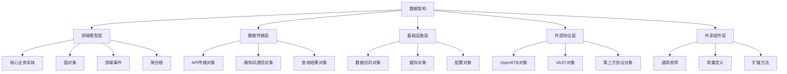
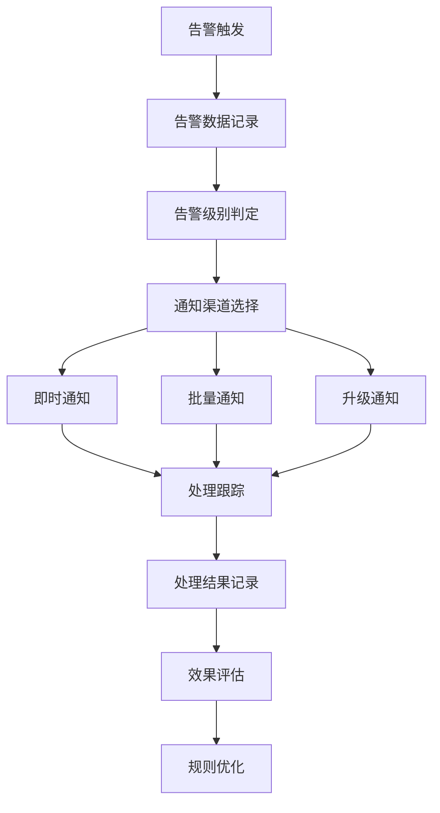
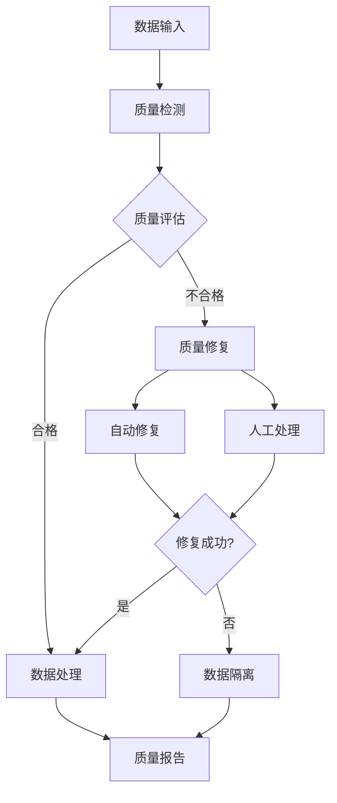
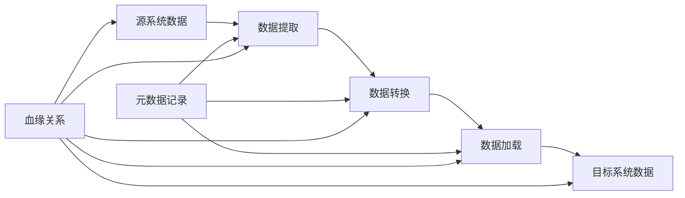
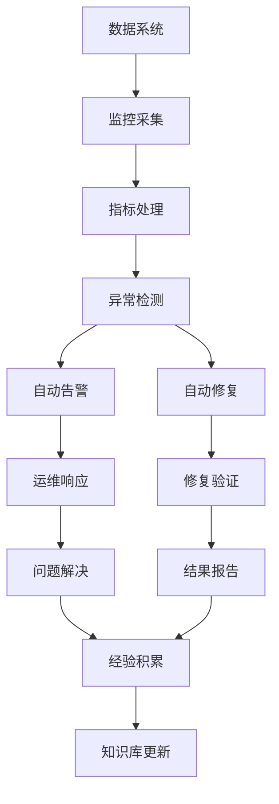

# 广告投放引擎技术数据结构设计

## 1. 设计概述

### 1.1 设计目标

| 设计目标   | 具体要求                     | 衡量标准              |
| ---------- | ---------------------------- | --------------------- |
| 数据一致性 | 保证分布式环境下数据的一致性 | 强一致性场景100%准确  |
| 性能优化   | 数据结构优化，提升处理性能   | 序列化性能提升50%     |
| 标准合规   | 遵循IAB标准和行业规范        | 100%兼容OpenRTB、VAST |
| 扩展性     | 支持业务发展和功能扩展       | 向后兼容，平滑升级    |
| 可维护性   | 清晰的数据结构和层次关系     | 开发效率提升30%       |

### 1.2 设计原则

| 设计原则 | 具体要求                 | 实施策略                     |
| -------- | ------------------------ | ---------------------------- |
| 分层解耦 | 数据对象按业务层次分布   | 领域驱动设计，清晰的层次边界 |
| 单一职责 | 每个数据对象专注特定领域 | 职责明确，功能内聚           |
| 标准合规 | 严格遵循行业标准规范     | IAB标准映射，协议兼容        |
| 性能优先 | 考虑序列化和内存效率     | 结构优化，缓存友好           |
| 可扩展性 | 支持未来业务需求扩展     | 版本化设计，向后兼容         |

### 1.3 数据架构层次

## 2. [数据模型分层设计](数据模型分层设计.md)

## 3. [外部协议对象设计](外部协议对象设计.md)

## 4. [数据一致性设计](数据一致性设计.md)

## 5. [性能优化设计](数据性能优化设计.md)

## 6. [安全与合规设计](数据安全与合规设计.md)

## 7. 运维与监控数据设计

### 7.1 监控数据模型

#### 7.1.1 性能监控数据

| 监控类别 | 数据指标                 | 收集频率 | 存储策略   |
| -------- | ------------------------ | -------- | ---------- |
| 系统性能 | CPU、内存、网络、磁盘    | 30秒     | 时序数据库 |
| 应用性能 | QPS、延迟、错误率        | 实时     | 流式处理   |
| 业务指标 | 转化率、收入、用户活跃度 | 分钟级   | 聚合存储   |
| 用户体验 | 页面加载时间、交互响应   | 实时     | 采样存储   |

#### 7.1.2 日志数据结构

| 日志类型 | 结构化程度 | 数据量级  | 保留策略   |
| -------- | ---------- | --------- | ---------- |
| 访问日志 | 结构化     | GB级别/天 | 30天热存储 |
| 应用日志 | 半结构化   | GB级别/天 | 7天热存储  |
| 错误日志 | 结构化     | MB级别/天 | 90天存储   |
| 审计日志 | 完全结构化 | MB级别/天 | 永久存储   |

### 7.2 告警数据设计

#### 7.2.1 告警规则数据

| 规则类型 | 触发条件       | 数据要求     | 响应策略 |
| -------- | -------------- | ------------ | -------- |
| 阈值告警 | 指标超过设定值 | 实时监控数据 | 立即通知 |
| 趋势告警 | 指标趋势异常   | 历史趋势数据 | 预测通知 |
| 异常告警 | 模式异常检测   | 机器学习模型 | 智能分析 |
| 业务告警 | 业务规则违反   | 业务状态数据 | 业务流程 |

#### 7.2.2 告警处理数据

### 7.3 运维自动化数据

#### 7.3.1 自动化操作数据

| 操作类型 | 触发条件     | 执行数据     | 结果验证     |
| -------- | ------------ | ------------ | ------------ |
| 自动扩容 | 负载超过阈值 | 资源配置数据 | 性能指标验证 |
| 故障恢复 | 服务异常检测 | 恢复脚本数据 | 健康检查验证 |
| 配置更新 | 配置变更请求 | 配置差异数据 | 功能验证     |
| 数据备份 | 定时任务触发 | 备份策略数据 | 完整性验证   |

#### 7.3.2 运维知识库数据

| 知识类型 | 数据结构        | 更新机制     | 应用场景     |
| -------- | --------------- | ------------ | ------------ |
| 故障处理 | 问题-解决方案对 | 专家经验积累 | 自动故障诊断 |
| 性能优化 | 参数-效果映射   | 实验数据驱动 | 自动性能调优 |
| 容量规划 | 负载-资源模型   | 历史数据分析 | 自动容量预测 |
| 安全策略 | 威胁-防护规则   | 威胁情报更新 | 自动安全防护 |

## 8. 数据治理与质量保证

### 8.1 数据质量管理

#### 8.1.1 数据质量维度

| 质量维度 | 评估指标       | 检测方法   | 改进措施         |
| -------- | -------------- | ---------- | ---------------- |
| 完整性   | 字段缺失率     | 自动化检查 | 数据补全、默认值 |
| 准确性   | 数据错误率     | 规则验证   | 数据清洗、纠错   |
| 一致性   | 数据冲突率     | 一致性检查 | 数据同步、标准化 |
| 时效性   | 数据延迟       | 时间戳分析 | 实时处理、优化   |
| 有效性   | 业务规则符合度 | 业务验证   | 规则更新、培训   |

#### 8.1.2 数据质量监控

### 8.2 数据生命周期管理

#### 8.2.1 数据生命周期阶段

| 生命周期阶段 | 管理要求             | 技术实现           | 质量保证               |
| ------------ | -------------------- | ------------------ | ---------------------- |
| 数据创建     | 格式规范、完整性验证 | 数据建模、校验规则 | 输入验证、格式检查     |
| 数据存储     | 分类存储、安全保护   | 存储策略、加密技术 | 备份验证、完整性检查   |
| 数据处理     | 规范化、质量控制     | ETL流程、数据清洗  | 处理监控、质量评估     |
| 数据使用     | 权限控制、审计追踪   | 访问控制、日志记录 | 使用监控、合规检查     |
| 数据归档     | 长期保存、合规要求   | 归档策略、压缩技术 | 可用性验证、完整性保证 |
| 数据销毁     | 安全删除、合规要求   | 安全删除、证明机制 | 删除验证、合规确认     |

#### 8.2.2 数据分类分级

| 数据分类     | 重要程度 | 保护等级 | 管理策略           |
| ------------ | -------- | -------- | ------------------ |
| 核心业务数据 | 极高     | 最高保护 | 实时备份、异地容灾 |
| 重要业务数据 | 高       | 高级保护 | 定期备份、主从复制 |
| 一般业务数据 | 中等     | 标准保护 | 周期备份、基础保护 |
| 临时数据     | 低       | 基础保护 | 简单备份、定期清理 |

### 8.3 元数据管理

#### 8.3.1 元数据类型

| 元数据类型 | 描述内容             | 管理方式           | 应用价值           |
| ---------- | -------------------- | ------------------ | ------------------ |
| 结构元数据 | 数据表结构、字段定义 | 版本控制、变更管理 | 数据理解、影响分析 |
| 业务元数据 | 业务含义、业务规则   | 知识库管理         | 业务理解、需求分析 |
| 操作元数据 | 数据流向、处理逻辑   | 流程管理、监控     | 数据血缘、问题定位 |
| 质量元数据 | 质量规则、质量报告   | 质量管理系统       | 质量监控、持续改进 |

#### 8.3.2 数据血缘追踪

### 9.1 开发规范

#### 9.1.1 编码规范

| 规范类别 | 具体要求             | 检查方式     | 质量标准     |
| -------- | -------------------- | ------------ | ------------ |
| 命名规范 | Pascal/camelCase命名 | 静态分析工具 | 100%合规     |
| 注释规范 | XML文档注释          | 文档生成工具 | 覆盖率>80%   |
| 结构规范 | 单一职责、高内聚     | 代码审查     | 复杂度<10    |
| 性能规范 | 避免性能反模式       | 性能测试     | 响应时间<SLA |

#### 9.1.2 版本管理

| 版本策略   | 适用范围     | 兼容性要求 | 升级策略   |
| ---------- | ------------ | ---------- | ---------- |
| 语义化版本 | API接口版本  | 向后兼容   | 渐进式升级 |
| 数据版本   | 数据结构版本 | 数据迁移   | 平滑迁移   |
| 协议版本   | 外部协议版本 | 多版本支持 | 协商升级   |
| 配置版本   | 配置文件版本 | 配置兼容   | 热更新     |

### 9.2 测试策略

#### 9.2.1 测试分层

| 测试层级 | 测试目标        | 测试方法   | 覆盖要求       |
| -------- | --------------- | ---------- | -------------- |
| 单元测试 | 函数/方法正确性 | 自动化测试 | 代码覆盖率>90% |
| 集成测试 | 组件交互正确性  | 接口测试   | 接口覆盖率>95% |
| 系统测试 | 系统功能完整性  | 端到端测试 | 场景覆盖率>80% |
| 性能测试 | 系统性能指标    | 压力测试   | 性能基线验证   |

#### 9.2.2 数据测试

| 测试类型   | 测试内容           | 测试数据 | 验证标准       |
| ---------- | ------------------ | -------- | -------------- |
| 数据完整性 | 数据约束、关联关系 | 边界数据 | 约束验证通过   |
| 数据一致性 | 跨系统数据一致     | 同步数据 | 一致性检查通过 |
| 数据性能   | 查询响应时间       | 大数据量 | 性能基线达标   |
| 数据安全   | 敏感数据保护       | 敏感数据 | 安全策略生效   |

### 9.3 部署与运维

#### 9.3.1 部署策略

| 部署类型   | 部署场景   | 实施方式   | 风险控制   |
| ---------- | ---------- | ---------- | ---------- |
| 蓝绿部署   | 零停机更新 | 双环境切换 | 快速回滚   |
| 金丝雀部署 | 风险控制   | 灰度发布   | 渐进式验证 |
| 滚动部署   | 资源节约   | 逐步替换   | 健康检查   |
| 影子部署   | 功能验证   | 并行运行   | 流量复制   |

#### 9.3.2 监控运维

## 10. Visual Studio项目架构映射(数据结构VisualStudio项目架构映射.md)
