# 广告投放引擎技术设计

## 1. 系统概述

### 1.1 设计目标

| 设计目标 | 技术指标            | 业务价值                     |
| -------- | ------------------- | ---------------------------- |
| 高性能   | 响应时间P99 < 100ms | 提升用户体验，增加广告填充率 |
| 高并发   | 支持50万QPS         | 满足大流量广告投放需求       |
| 高可用   | 系统可用性99.99%    | 保障广告收入稳定性           |
| 实时性   | 毫秒级响应          | 支持RTB实时竞价场景          |
| 智能化   | AI驱动优化          | 提升广告投放效果和ROI        |
| 可扩展   | 水平弹性扩展        | 适应业务快速增长需求         |

### 1.2 核心能力

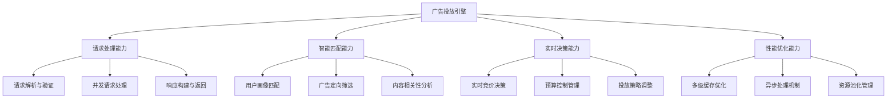

### 1.3 技术架构原则

| 设计原则     | 具体要求               | 实现策略                   |
| ------------ | ---------------------- | -------------------------- |
| 高内聚低耦合 | 模块功能单一，接口清晰 | 微服务架构，领域驱动设计   |
| 无状态设计   | 服务实例无状态，易扩展 | 状态外部化，会话管理分离   |
| 异步优先     | 非阻塞处理，提升并发   | 异步编程模式，事件驱动     |
| 缓存优先     | 减少数据访问延迟       | 多级缓存，预计算策略       |
| 容错设计     | 故障隔离，优雅降级     | 熔断器，重试机制，降级策略 |

## 2. 系统架构设计

### 2.1 整体架构

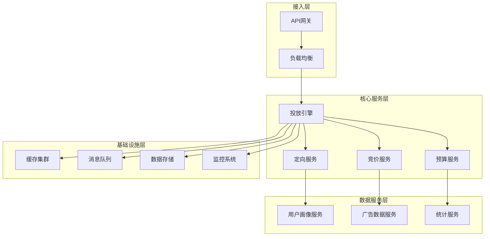

### 2.2 核心模块设计

#### 2.2.1 请求处理模块

| 组件名称     | 功能职责                   | 关键技术点                       |
| ------------ | -------------------------- | -------------------------------- |
| 请求解析器   | 解析广告请求，提取关键信息 | 高性能JSON解析，参数验证         |
| 上下文构建器 | 构建请求处理上下文         | 用户识别，环境检测，特征提取     |
| 请求路由器   | 将请求路由到合适的处理器   | 负载均衡，服务发现，健康检查     |
| 响应构建器   | 构建标准化广告响应         | 模板引擎，动态内容生成，格式适配 |

#### 2.2.2 智能匹配模块

| 组件名称     | 功能职责                 | 关键技术点                     |
| ------------ | ------------------------ | ------------------------------ |
| 用户画像匹配 | 基于用户特征进行广告匹配 | 标签匹配，相似度计算，机器学习 |
| 地理位置定向 | 基于地理位置进行精准定向 | GIS算法，地理围栏，位置服务    |
| 设备环境定向 | 基于设备和环境进行定向   | 设备识别，浏览器检测，网络环境 |
| 时间定向     | 基于时间维度进行投放控制 | 时区处理，时段匹配，日程规划   |

#### 2.2.3 决策引擎模块

| 组件名称 | 功能职责             | 关键技术点                     |
| -------- | -------------------- | ------------------------------ |
| 竞价引擎 | 执行广告竞价逻辑     | 竞价算法，价格计算，排序机制   |
| 预算控制 | 管理广告主预算消耗   | 令牌桶算法，实时计算，阈值控制 |
| 质量评估 | 评估广告质量和相关性 | CTR预估，CVR预估，质量打分     |
| 投放策略 | 执行投放策略和优化   | 策略引擎，规则匹配，效果优化   |

### 2.3 数据流设计

#### 2.3.1 请求处理流程

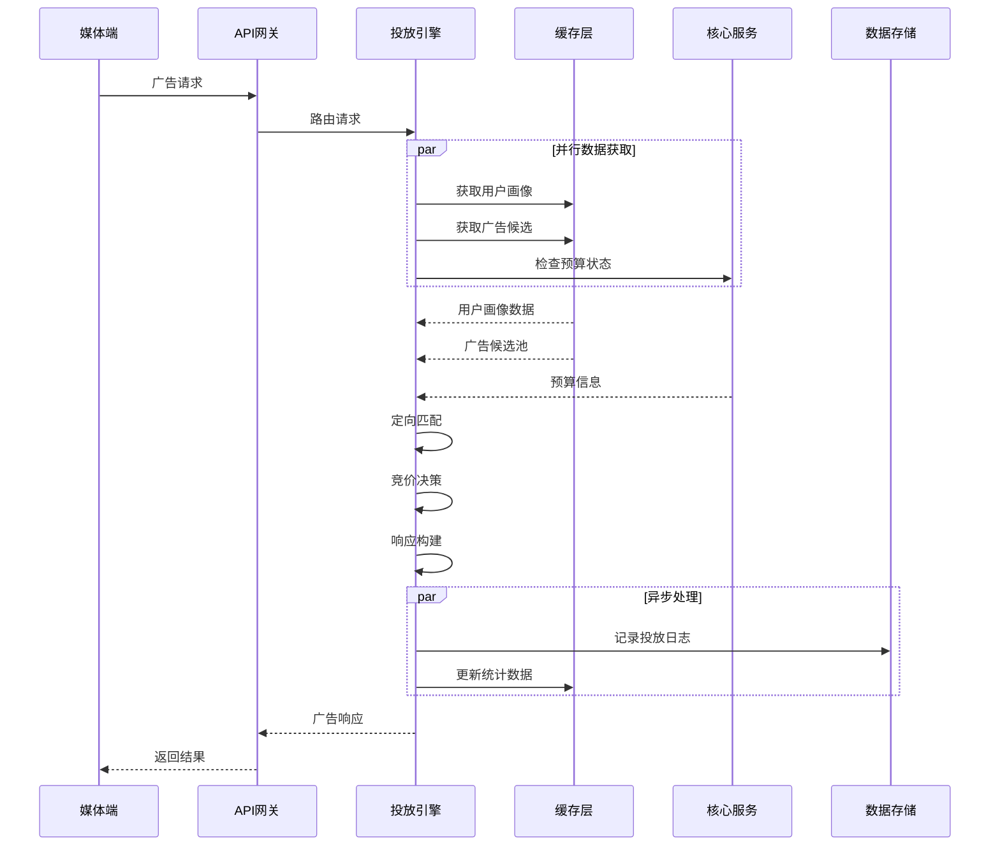

#### 2.3.2 数据缓存策略

| 缓存层级     | 缓存内容               | 更新策略   | TTL设置      |
| ------------ | ---------------------- | ---------- | ------------ |
| L1本地缓存   | 热点广告数据，用户画像 | 定时刷新   | 5-15分钟     |
| L2分布式缓存 | 广告库存，预算状态     | 事件驱动   | 30分钟-2小时 |
| L3数据预热   | 活跃广告，热门标签     | 批量预加载 | 4-24小时     |
| CDN边缘缓存  | 创意素材，静态资源     | 版本控制   | 7-30天       |

## 3. 算法设计

### 3.1 广告召回算法

#### 3.1.1 召回策略设计

| 召回策略     | 召回方式             | 适用场景       | 召回量控制   |
| ------------ | -------------------- | -------------- | ------------ |
| 精确匹配召回 | 基于关键标签精确匹配 | 高质量精准投放 | 1000-5000个  |
| 相似度召回   | 基于用户画像相似度   | 扩大投放覆盖面 | 5000-10000个 |
| 协同过滤召回 | 基于用户行为协同过滤 | 个性化推荐     | 3000-8000个  |
| 热门广告召回 | 基于广告热度和表现   | 保底投放策略   | 1000-3000个  |
| 新广告召回   | 基于新广告冷启动     | 新广告探索     | 500-1000个   |

#### 3.1.2 召回融合机制

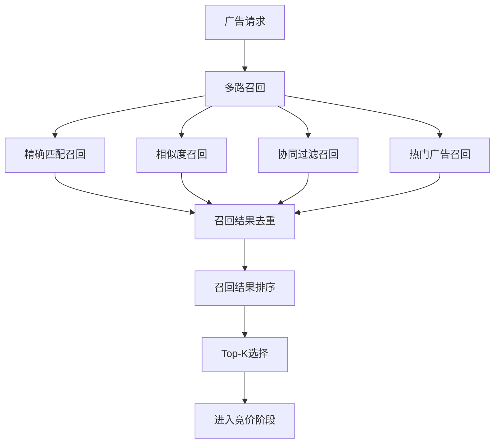

### 3.2 定向算法设计

#### 3.2.1 地理定向算法

| 定向类型       | 算法实现       | 精度要求   | 性能考虑     |
| -------------- | -------------- | ---------- | ------------ |
| 国家/省市定向  | 行政区划匹配   | 行政区级别 | IP库查询     |
| 圆形区域定向   | 经纬度距离计算 | 米级精度   | 快速距离算法 |
| 多边形区域定向 | 点在多边形判断 | 自定义边界 | 空间索引优化 |
| 商圈定向       | POI距离计算    | 商业区范围 | 预计算优化   |

#### 3.2.2 用户画像定向算法

| 定向维度     | 匹配策略       | 算法复杂度 | 匹配精度 |
| ------------ | -------------- | ---------- | -------- |
| 人口属性定向 | 精确值匹配     | O(1)       | 100%     |
| 兴趣标签定向 | 标签相似度计算 | O(n)       | 85-95%   |
| 行为特征定向 | 特征向量相似度 | O(n²)      | 80-90%   |
| 设备属性定向 | 设备指纹匹配   | O(1)       | 95-99%   |

### 3.3 竞价算法设计

#### 3.3.1 竞价策略框架

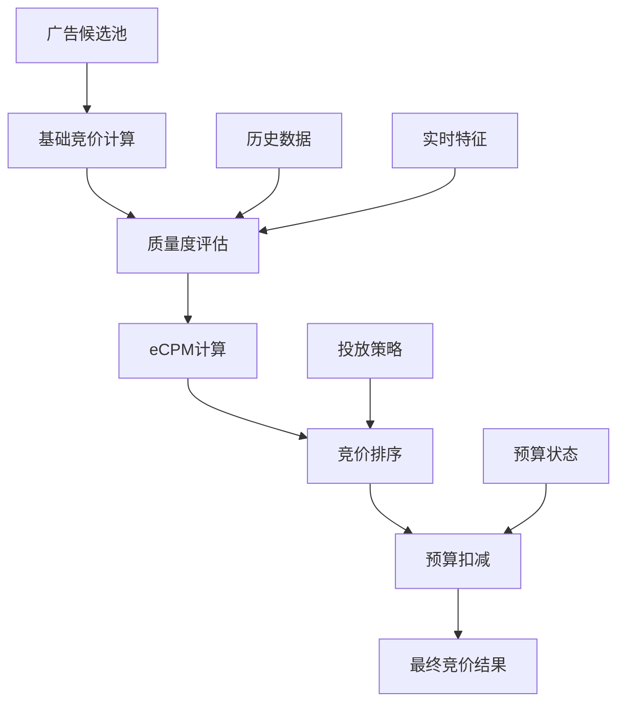

#### 3.3.2 质量度评估模型

| 评估维度   | 权重分配 | 计算方法     | 更新频率 |
| ---------- | -------- | ------------ | -------- |
| 点击率预估 | 40%      | 机器学习模型 | 实时     |
| 转化率预估 | 30%      | 深度学习模型 | 小时级   |
| 广告相关性 | 20%      | 文本相似度   | 天级     |
| 用户体验   | 10%      | 反馈评分     | 周级     |

#### 3.3.3 动态定价算法

| 定价策略     | 触发条件     | 调价幅度 | 调价频率 |
| ------------ | ------------ | -------- | -------- |
| 效果优化定价 | CTR/CVR变化  | ±10-30%  | 小时级   |
| 竞争态势定价 | 竞争激烈度   | ±5-20%   | 分钟级   |
| 预算消耗定价 | 预算消耗速度 | ±15-50%  | 实时     |
| 时段优化定价 | 不同时段表现 | ±10-25%  | 时段级   |

### 3.4 预算控制算法

#### 3.4.1 预算控制策略

| 控制策略     | 适用场景     | 控制精度 | 实现复杂度 |
| ------------ | ------------ | -------- | ---------- |
| 令牌桶控制   | 平滑消耗控制 | 高精度   | 中等       |
| 滑动窗口控制 | 突发流量控制 | 中等精度 | 简单       |
| 预测模型控制 | 智能消耗控制 | 高精度   | 复杂       |
| 分层控制     | 多级预算管理 | 高精度   | 复杂       |

#### 3.4.2 预算分配算法

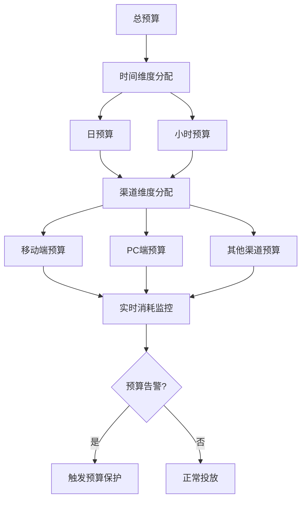

## 4. 性能优化设计

### 4.1 系统性能目标

| 性能指标    | 目标值    | 监控方式   | 优化策略             |
| ----------- | --------- | ---------- | -------------------- |
| 响应时间P50 | < 30ms    | APM监控    | 缓存优化，异步处理   |
| 响应时间P95 | < 50ms    | APM监控    | 热点数据预加载       |
| 响应时间P99 | < 100ms   | APM监控    | 服务降级，熔断机制   |
| 系统吞吐量  | > 50万QPS | 负载测试   | 水平扩展，负载均衡   |
| 错误率      | < 0.1%    | 错误监控   | 容错设计，重试机制   |
| 系统可用性  | > 99.99%  | 可用性监控 | 高可用架构，灾备方案 |

### 4.2 性能优化策略

#### 4.2.1 计算性能优化

| 优化维度 | 优化技术                 | 性能提升 | 实现难度 |
| -------- | ------------------------ | -------- | -------- |
| 算法优化 | 高效算法选择，复杂度降低 | 50-200%  | 高       |
| 并行计算 | 多线程，并行处理         | 100-400% | 中       |
| 内存优化 | 对象池，内存复用         | 20-50%   | 中       |
| CPU优化  | 指令优化，分支预测       | 10-30%   | 高       |

#### 4.2.2 I/O性能优化

| 优化维度  | 优化技术           | 性能提升   | 实现难度 |
| --------- | ------------------ | ---------- | -------- |
| 网络I/O   | 连接池，长连接复用 | 100-300%   | 中       |
| 磁盘I/O   | SSD存储，异步I/O   | 200-500%   | 低       |
| 数据库I/O | 索引优化，查询优化 | 300-1000%  | 中       |
| 缓存I/O   | 内存缓存，预加载   | 1000-5000% | 中       |

#### 4.2.3 架构性能优化

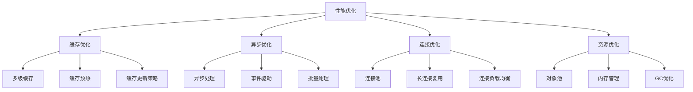

### 4.3 扩展性设计

#### 4.3.1 水平扩展能力

| 扩展维度 | 扩展策略           | 扩展上限  | 扩展成本 |
| -------- | ------------------ | --------- | -------- |
| 计算节点 | 无状态服务水平扩展 | 1000+节点 | 线性     |
| 存储节点 | 分片存储，读写分离 | PB级别    | 线性     |
| 缓存节点 | 分布式缓存集群     | TB级别    | 线性     |
| 网络带宽 | CDN加速，边缘计算  | 无限制    | 递减     |

#### 4.3.2 弹性伸缩机制

| 伸缩触发器 | 伸缩指标 | 伸缩策略 | 响应时间   |
| ---------- | -------- | -------- | ---------- |
| CPU使用率  | > 70%    | 自动扩容 | 2-5分钟    |
| 内存使用率 | > 80%    | 自动扩容 | 2-5分钟    |
| 请求量     | > 阈值   | 预测扩容 | 1-3分钟    |
| 响应时间   | > SLA    | 紧急扩容 | 30秒-2分钟 |

## 5. 容错与可靠性设计

### 5.1 容错机制

#### 5.1.1 故障检测与隔离

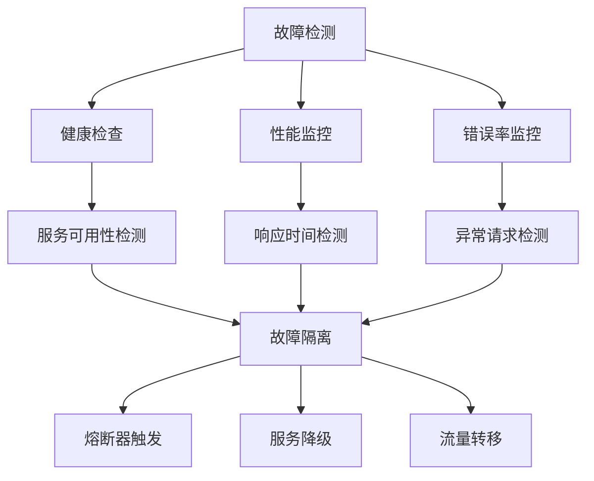

#### 5.1.2 容错策略配置

| 故障类型   | 检测方式     | 处理策略           | 恢复机制       |
| ---------- | ------------ | ------------------ | -------------- |
| 服务不可用 | 健康检查失败 | 流量切换到备用服务 | 自动重试探测   |
| 响应超时   | 请求超时监控 | 快速失败，降级处理 | 指数退避重试   |
| 错误率过高 | 错误率统计   | 熔断器保护         | 半开状态探测   |
| 资源耗尽   | 资源使用监控 | 限流保护           | 资源释放后恢复 |

### 5.2 高可用架构

#### 5.2.1 多层高可用设计

| 架构层次 | 高可用策略     | 可用性目标 | 故障恢复时间 |
| -------- | -------------- | ---------- | ------------ |
| 接入层   | 多节点负载均衡 | 99.9%      | < 30秒       |
| 服务层   | 多实例部署     | 99.95%     | < 2分钟      |
| 数据层   | 主从复制，分片 | 99.99%     | < 5分钟      |
| 基础设施 | 多可用区部署   | 99.99%     | < 10分钟     |

#### 5.2.2 灾难恢复方案

| 灾难场景 | 恢复策略     | RTO目标  | RPO目标  |
| -------- | ------------ | -------- | -------- |
| 单机故障 | 自动故障转移 | < 1分钟  | 0        |
| 机房故障 | 跨机房切换   | < 10分钟 | < 5分钟  |
| 地域故障 | 跨地域切换   | < 30分钟 | < 15分钟 |
| 全局故障 | 灾备系统启动 | < 2小时  | < 1小时  |

### 5.3 数据一致性保证

#### 5.3.1 一致性级别选择

| 数据类型 | 一致性要求 | 实现方式 | 性能影响 |
| -------- | ---------- | -------- | -------- |
| 用户账户 | 强一致性   | 同步复制 | 高       |
| 广告配置 | 最终一致性 | 异步复制 | 低       |
| 预算数据 | 单调一致性 | 读写分离 | 中       |
| 统计数据 | 最终一致性 | 批量同步 | 低       |

#### 5.3.2 一致性维护机制

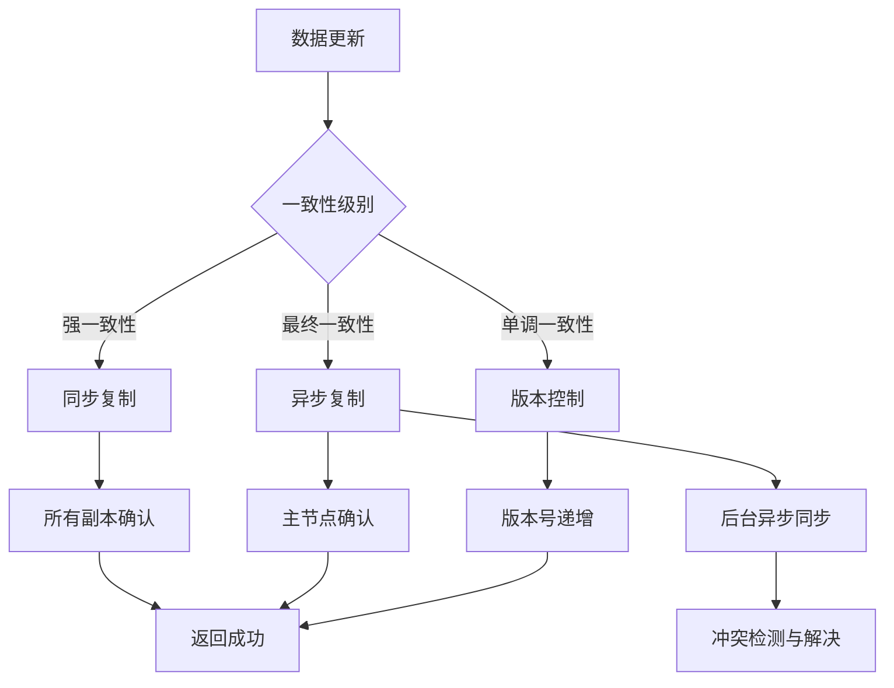

## 6. 监控与运维设计

### 6.1 监控体系

#### 6.1.1 监控指标分类

| 监控类别     | 关键指标               | 监控频率 | 告警阈值 |
| ------------ | ---------------------- | -------- | -------- |
| 基础设施监控 | CPU、内存、网络、磁盘  | 30秒     | >80%     |
| 应用性能监控 | QPS、响应时间、错误率  | 实时     | SLA要求  |
| 业务指标监控 | 填充率、点击率、转化率 | 分钟级   | 业务基线 |
| 安全监控     | 异常访问、攻击检测     | 实时     | 风险等级 |

#### 6.1.2 监控数据流

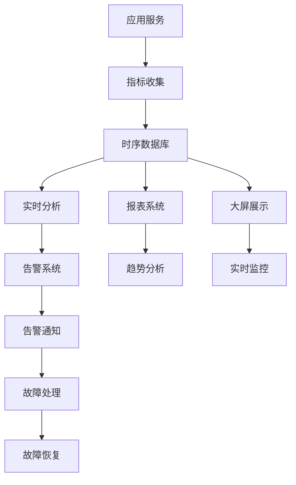

### 6.2 告警机制

#### 6.2.1 告警策略配置

| 告警级别 | 触发条件     | 通知方式       | 响应时间 |
| -------- | ------------ | -------------- | -------- |
| 紧急告警 | 系统不可用   | 电话+短信+邮件 | 立即     |
| 重要告警 | 性能严重下降 | 短信+邮件      | 5分钟内  |
| 警告告警 | 指标异常     | 邮件           | 15分钟内 |
| 信息告警 | 状态变更     | 系统通知       | 30分钟内 |

#### 6.2.2 智能告警优化

| 优化策略 | 实现方式     | 优化效果        |
| -------- | ------------ | --------------- |
| 告警去重 | 相似告警合并 | 减少50%告警数量 |
| 告警聚合 | 相关告警关联 | 提升30%处理效率 |
| 告警抑制 | 维护期间抑制 | 避免99%无效告警 |
| 智能分析 | 异常检测算法 | 提前20%发现问题 |

### 6.3 运维自动化

#### 6.3.1 自动化运维能力

| 自动化场景 | 自动化程度 | 人工介入 | 成功率 |
| ---------- | ---------- | -------- | ------ |
| 服务部署   | 全自动     | 审批确认 | 99%    |
| 故障恢复   | 半自动     | 异常处理 | 90%    |
| 扩容缩容   | 全自动     | 策略配置 | 95%    |
| 性能优化   | 半自动     | 策略调整 | 85%    |

#### 6.3.2 运维工作流

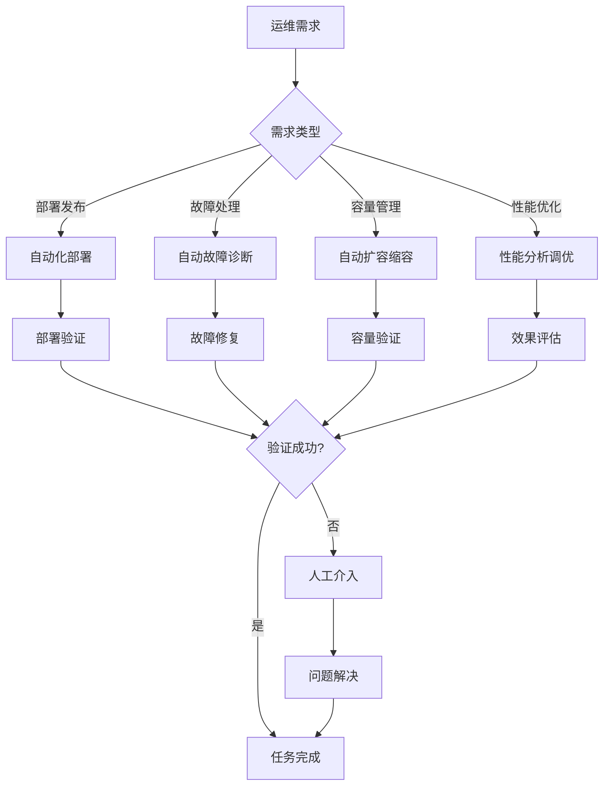

## 7. 安全设计

### 7.1 安全防护体系

#### 7.1.1 多层安全防护

| 防护层次 | 防护措施         | 防护目标     |
| -------- | ---------------- | ------------ |
| 网络层   | 防火墙、DDoS防护 | 阻断恶意流量 |
| 应用层   | WAF、API网关     | 防止应用攻击 |
| 数据层   | 加密、脱敏       | 保护敏感数据 |
| 业务层   | 反作弊、风控     | 防止业务欺诈 |

#### 7.1.2 安全控制矩阵

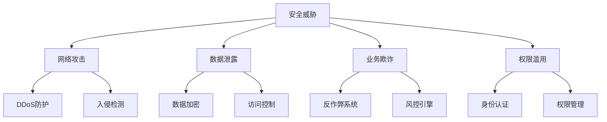

### 7.2 数据安全

#### 7.2.1 数据分类分级

| 数据类别     | 敏感级别 | 保护措施           | 访问控制     |
| ------------ | -------- | ------------------ | ------------ |
| 用户隐私数据 | 高敏感   | 强加密，匿名化     | 最小权限原则 |
| 商业机密数据 | 中敏感   | 加密存储，审计日志 | 角色权限控制 |
| 业务运营数据 | 低敏感   | 访问控制，备份     | 部门权限控制 |
| 公开数据     | 无敏感   | 基础保护           | 公开访问     |

#### 7.2.2 数据安全技术

| 安全技术 | 应用场景     | 安全强度 | 性能影响 |
| -------- | ------------ | -------- | -------- |
| AES加密  | 敏感数据存储 | 高       | 低       |
| RSA加密  | 密钥交换     | 高       | 中       |
| 数据脱敏 | 测试环境     | 中       | 低       |
| 数据水印 | 数据溯源     | 中       | 低       |

### 7.3 反作弊系统

#### 7.3.1 作弊识别策略

| 作弊类型 | 识别特征     | 检测算法 | 处理策略   |
| -------- | ------------ | -------- | ---------- |
| 虚假流量 | 异常访问模式 | 统计分析 | 流量过滤   |
| 刷量作弊 | 重复行为特征 | 机器学习 | 账户封禁   |
| 恶意点击 | 点击时间模式 | 时序分析 | 点击过滤   |
| 设备作弊 | 设备指纹异常 | 指纹识别 | 设备黑名单 |

#### 7.3.2 风控决策引擎

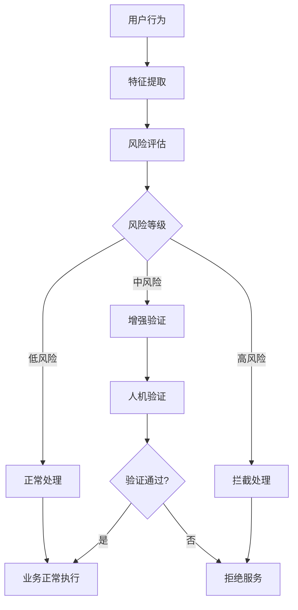

### 10.1 技术栈演进

#### 8.1.1 当前技术栈评估

| 技术组件 | 当前状态       | 发展趋势 | 演进计划         |
| -------- | -------------- | -------- | ---------------- |
| 开发框架 | .NET 9         | 持续演进 | 跟随最新版本     |
| 数据库   | SQL Server     | 云原生化 | 考虑分布式数据库 |
| 缓存系统 | Redis          | 持续优化 | 多级缓存架构     |
| 消息队列 | RabbitMQ/Kafka | 云原生化 | 事件驱动架构     |
| 容器化   | Docker + K8s   | 标准化   | Service Mesh     |

#### 10.1.2 新技术引入策略

| 新技术    | 应用价值 | 引入风险   | 引入策略   |
| --------- | -------- | ---------- | ---------- |
| AI/ML技术 | 智能优化 | 模型复杂性 | 渐进式引入 |
| 边缘计算  | 降低延迟 | 部署复杂性 | 试点验证   |
| 区块链    | 数据可信 | 性能问题   | 探索研究   |
| 量子计算  | 计算性能 | 技术不成熟 | 长期关注   |

### 10.2 架构演进路线

#### 10.2.1 短期目标(6-12个月)

| 演进目标   | 具体措施               | 预期收益        |
| ---------- | ---------------------- | --------------- |
| 性能优化   | 缓存架构升级，算法优化 | 响应时间提升30% |
| 智能化水平 | 机器学习模型上线       | 投放效果提升15% |
| 运维自动化 | 监控告警系统完善       | 运维效率提升50% |
| 安全加固   | 安全防护体系建设       | 安全风险降低80% |

#### 10.2.2 中期目标(1-2年)

| 演进目标   | 具体措施          | 预期收益        |
| ---------- | ----------------- | --------------- |
| 云原生架构 | 微服务架构优化    | 扩展性提升200%  |
| 边缘计算   | CDN和边缘节点部署 | 全球延迟降低50% |
| AI驱动     | 深度学习模型应用  | 投放ROI提升25%  |
| 实时计算   | 流式处理架构      | 实时性提升10倍  |

#### 10.2.3 长期目标(2-5年)

| 演进目标   | 具体措施       | 预期收益           |
| ---------- | -------------- | ------------------ |
| 全球化部署 | 多地域服务架构 | 支持全球业务       |
| 量子计算   | 量子算法研究   | 计算能力革命性提升 |
| 自适应系统 | 系统自我优化   | 无人值守运行       |
| 生态开放   | 平台API开放    | 构建生态系统       |

### 10.3 持续优化机制

#### 10.3.1 性能优化闭环

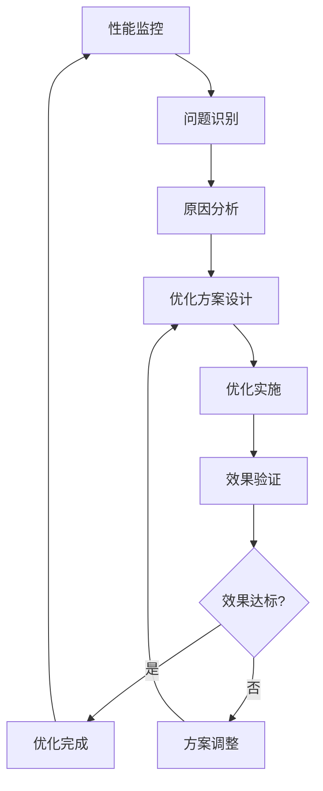

#### 10.3.2 技术债务管理

| 债务类型     | 评估标准               | 清理策略 | 清理周期 |
| ------------ | ---------------------- | -------- | -------- |
| 代码质量债务 | 代码复杂度，测试覆盖率 | 重构优化 | 每月     |
| 架构设计债务 | 耦合度，可维护性       | 架构重构 | 每季度   |
| 技术选型债务 | 技术老化度，社区活跃度 | 技术升级 | 每年     |
| 性能债务     | 性能指标，用户体验     | 性能优化 | 持续     |

## 9. Visual Studio解决方案架构映射

### 9.1 核心模块项目映射

基于系统整体技术架构中定义的Visual Studio解决方案结构，广告投放引擎的各个核心模块在解决方案中的具体实现位置如下：

#### 9.1.1 接入层模块映射

| 架构模块 | 解决方案项目                            | 项目职责                      | 技术栈                   |
| -------- | --------------------------------------- | ----------------------------- | ------------------------ |
| API网关  | `Lorn.ADSP.Gateway`                     | API路由、限流、认证、负载均衡 | ASP.NET Core 9.0, Ocelot |
| 负载均衡 | `Lorn.ADSP.Infrastructure.LoadBalancer` | 服务发现、健康检查、流量分发  | .NET 9, Consul           |

#### 9.1.2 核心服务层模块映射

| 架构模块 | 解决方案项目                           | 项目职责                         | 核心组件                                 |
| -------- | -------------------------------------- | -------------------------------- | ---------------------------------------- |
| 投放引擎 | `Lorn.ADSP.AdEngine`                   | 广告请求处理、响应构建、流程编排 | 请求解析器、上下文构建器、响应构建器     |
| 定向服务 | `Lorn.ADSP.Targeting`                  | 用户画像匹配、地理定向、设备定向 | 召回-过滤-排序三阶段编排器、策略工厂     |
| 竞价服务 | `Lorn.ADSP.Bidding`                    | 实时竞价、价格计算、质量评估     | 召回-过滤-排序三阶段编排器、竞价策略工厂 |
| 预算服务 | `Lorn.ADSP.Campaign`                   | 预算控制、消耗监控、分配管理     | 预算控制、令牌桶算法、预算分配算法       |
| 抽象层   | `Lorn.ADSP.Core.AdEngine.Abstractions` | 定义统一策略接口、编排器抽象     | 策略基础接口、处理管道接口、工厂接口     |

#### 9.1.3 数据服务层模块映射

| 架构模块     | 解决方案项目          | 项目职责                         | 数据来源                     |
| ------------ | --------------------- | -------------------------------- | ---------------------------- |
| 用户画像服务 | `Lorn.ADSP.Analytics` | 用户特征分析、画像构建、标签管理 | DMP数据、行为数据、属性数据  |
| 广告数据服务 | `Lorn.ADSP.Creative`  | 广告创意管理、素材存储、内容审核 | 广告主上传、创意库、审核系统 |
| 统计服务     | `Lorn.ADSP.Reporting` | 实时统计、报表生成、数据分析     | 投放日志、点击数据、转化数据 |

#### 9.1.4 基础设施层模块映射

| 架构模块           | 解决方案项目                                              | 项目职责                                 | 实现技术                      |
| ------------------ | --------------------------------------------------------- | ---------------------------------------- | ----------------------------- |
| 缓存集群           | `Lorn.ADSP.Infrastructure.Caching`                        | 多级缓存、缓存策略、数据预热             | Redis, Memory Cache           |
| 消息队列           | `Lorn.ADSP.Data.MessageQueue`                             | 异步消息、事件驱动、削峰填谷             | RabbitMQ, Kafka               |
| **数据访问抽象**   | `Core/Lorn.ADSP.Core.Domain/Repositories/`                | 仓储接口、工作单元接口、规格模式接口定义 | .NET 9 Interfaces             |
| **数据访问实现**   | `Infrastructure/Lorn.ADSP.Infrastructure.Data/`           | 仓储实现、工作单元实现、DbContext配置    | Entity Framework Core 8.0+    |
| **数据库提供程序** | `Infrastructure/Lorn.ADSP.Infrastructure.Data.Providers/` | 多数据库提供程序、连接管理、迁移服务     | SQL Server, MySQL, PostgreSQL |
| 监控系统           | `Lorn.ADSP.Infrastructure.Monitoring`                     | 性能监控、告警通知、健康检查             | Prometheus, Grafana           |

##### 数据访问层详细映射

###### 接口抽象层映射

| 接口模块     | 项目位置                                     | 接口定义                     | 功能描述                 |
| ------------ | -------------------------------------------- | ---------------------------- | ------------------------ |
| 仓储接口     | `Core/Lorn.ADSP.Core.Domain/Repositories/`   | `IRepository<T>`             | 通用CRUD操作接口         |
| 只读仓储接口 | `Core/Lorn.ADSP.Core.Domain/Repositories/`   | `IReadOnlyRepository<T>`     | 只读查询操作接口         |
| 工作单元接口 | `Core/Lorn.ADSP.Core.Domain/Repositories/`   | `IUnitOfWork`                | 事务管理和多仓储协调接口 |
| 只读工作单元 | `Core/Lorn.ADSP.Core.Domain/Repositories/`   | `IReadOnlyUnitOfWork`        | 只读查询工作单元接口     |
| 规格模式接口 | `Core/Lorn.ADSP.Core.Domain/Specifications/` | `ISpecification<T>`          | 查询条件封装和组合接口   |
| 业务仓储接口 | `Core/Lorn.ADSP.Core.Domain/Repositories/`   | `IAdvertisementRepository`等 | 特定业务实体的仓储接口   |

###### 实现层映射

| 实现模块      | 项目位置                                                       | 实现类                               | 功能描述                     |
| ------------- | -------------------------------------------------------------- | ------------------------------------ | ---------------------------- |
| 通用仓储实现  | `Infrastructure/Lorn.ADSP.Infrastructure.Data/Repositories/`   | `Repository<T>`                      | 通用仓储模式实现             |
| 只读仓储实现  | `Infrastructure/Lorn.ADSP.Infrastructure.Data/Repositories/`   | `ReadOnlyRepository<T>`              | 查询优化的只读仓储实现       |
| 工作单元实现  | `Infrastructure/Lorn.ADSP.Infrastructure.Data/UnitOfWork/`     | `UnitOfWork`                         | 事务管理和资源协调实现       |
| 只读工作单元  | `Infrastructure/Lorn.ADSP.Infrastructure.Data/UnitOfWork/`     | `ReadOnlyUnitOfWork`                 | 只读查询工作单元实现         |
| DbContext配置 | `Infrastructure/Lorn.ADSP.Infrastructure.Data/Context/`        | `IAdspDbContext`                     | 数据库上下文抽象接口         |
| 实体配置      | `Infrastructure/Lorn.ADSP.Infrastructure.Data/Configurations/` | `AdvertisementEntityConfiguration`等 | Entity Framework实体映射配置 |
| 业务仓储实现  | `Infrastructure/Lorn.ADSP.Infrastructure.Data/Repositories/`   | `AdvertisementRepository`等          | 特定业务逻辑的仓储实现       |

###### 数据库提供程序映射

| 提供程序模块       | 项目位置                                                             | 实现类                    | 支持数据库           |
| ------------------ | -------------------------------------------------------------------- | ------------------------- | -------------------- |
| 提供程序工厂       | `Infrastructure/Lorn.ADSP.Infrastructure.Data.Providers/`            | `DatabaseProviderFactory` | 数据库提供程序工厂   |
| SQL Server提供程序 | `Infrastructure/Lorn.ADSP.Infrastructure.Data.Providers/SqlServer/`  | `SqlServerAdspDbContext`  | SQL Server数据库支持 |
| MySQL提供程序      | `Infrastructure/Lorn.ADSP.Infrastructure.Data.Providers/MySQL/`      | `MySqlAdspDbContext`      | MySQL数据库支持      |
| PostgreSQL提供程序 | `Infrastructure/Lorn.ADSP.Infrastructure.Data.Providers/PostgreSQL/` | `PostgreSqlAdspDbContext` | PostgreSQL数据库支持 |
| SQLite提供程序     | `Infrastructure/Lorn.ADSP.Infrastructure.Data.Providers/SQLite/`     | `SqliteAdspDbContext`     | SQLite数据库支持     |
| 迁移服务           | `Infrastructure/Lorn.ADSP.Infrastructure.Data.Providers/`            | `IMigrationService`       | 数据库迁移和版本管理 |

###### 依赖注入配置映射

| 配置模块     | 项目位置                                                             | 配置类                        | 配置内容               |
| ------------ | -------------------------------------------------------------------- | ----------------------------- | ---------------------- |
| 服务注册扩展 | `Infrastructure/Lorn.ADSP.Infrastructure.Data/Extensions/`           | `ServiceCollectionExtensions` | 数据访问层服务注册配置 |
| 数据库配置   | `Infrastructure/Lorn.ADSP.Infrastructure.Data/Configuration/`        | `DatabaseConfiguration`       | 数据库连接和性能配置   |
| 提供程序注册 | `Infrastructure/Lorn.ADSP.Infrastructure.Data.Providers/Extensions/` | `DatabaseProviderExtensions`  | 特定数据库提供程序注册 |

### 9.2 算法实现项目映射

基于新的抽象层设计，所有算法实现都遵循统一的策略接口模式，通过`Lorn.ADSP.Core.AdEngine.Abstractions`项目定义的接口进行标准化实现。

#### 9.2.1 广告召回算法实现

| 算法模块     | 解决方案项目          | 实现位置                                               | 策略接口实现            |
| ------------ | --------------------- | ------------------------------------------------------ | ----------------------- |
| 精确匹配召回 | `Lorn.ADSP.Targeting` | `/Strategies/Recall/ExactMatchRecallStrategy.cs`       | `IAdRecallStrategy`     |
| 相似度召回   | `Lorn.ADSP.Targeting` | `/Strategies/Recall/SimilarityRecallStrategy.cs`       | `IAdRecallStrategy`     |
| 协同过滤召回 | `Lorn.ADSP.Analytics` | `/Strategies/Recall/CollaborativeFilteringStrategy.cs` | `IAdRecallStrategy`     |
| 热门广告召回 | `Lorn.ADSP.AdEngine`  | `/Strategies/Recall/PopularAdRecallStrategy.cs`        | `IAdRecallStrategy`     |
| 用户画像召回 | `Lorn.ADSP.Targeting` | `/Strategies/Recall/UserProfileRecallStrategy.cs`      | `IAdRecallStrategy`     |
| 内容召回     | `Lorn.ADSP.Creative`  | `/Strategies/Recall/ContentBasedRecallStrategy.cs`     | `IAdRecallStrategy`     |
| 召回编排器   | `Lorn.ADSP.AdEngine`  | `/Services/RecallOrchestrationService.cs`              | `IAdProcessingPipeline` |

#### 9.2.2 广告过滤算法实现

| 算法模块     | 解决方案项目          | 实现位置                                         | 策略接口实现            |
| ------------ | --------------------- | ------------------------------------------------ | ----------------------- |
| 定向条件过滤 | `Lorn.ADSP.Targeting` | `/Strategies/Filter/TargetingFilterStrategy.cs`  | `IAdFilterStrategy`     |
| 频次控制过滤 | `Lorn.ADSP.AdEngine`  | `/Strategies/Filter/FrequencyFilterStrategy.cs`  | `IAdFilterStrategy`     |
| 预算过滤     | `Lorn.ADSP.Campaign`  | `/Strategies/Filter/BudgetFilterStrategy.cs`     | `IAdFilterStrategy`     |
| 黑名单过滤   | `Lorn.ADSP.AdEngine`  | `/Strategies/Filter/BlacklistFilterStrategy.cs`  | `IAdFilterStrategy`     |
| 质量过滤     | `Lorn.ADSP.Creative`  | `/Strategies/Filter/QualityFilterStrategy.cs`    | `IAdFilterStrategy`     |
| 合规过滤     | `Lorn.ADSP.Creative`  | `/Strategies/Filter/ComplianceFilterStrategy.cs` | `IAdFilterStrategy`     |
| 过滤编排器   | `Lorn.ADSP.AdEngine`  | `/Services/FilterOrchestrationService.cs`        | `IAdProcessingPipeline` |

#### 9.2.3 广告排序算法实现

| 算法模块     | 解决方案项目          | 实现位置                                             | 策略接口实现            |
| ------------ | --------------------- | ---------------------------------------------------- | ----------------------- |
| 粗排策略     | `Lorn.ADSP.Bidding`   | `/Strategies/Ranking/CoarseRankingStrategy.cs`       | `IAdRankingStrategy`    |
| 精排策略     | `Lorn.ADSP.Bidding`   | `/Strategies/Ranking/FineRankingStrategy.cs`         | `IAdRankingStrategy`    |
| 重排策略     | `Lorn.ADSP.Bidding`   | `/Strategies/Ranking/ReRankingStrategy.cs`           | `IAdRankingStrategy`    |
| 个性化排序   | `Lorn.ADSP.Analytics` | `/Strategies/Ranking/PersonalizedRankingStrategy.cs` | `IAdRankingStrategy`    |
| 业务规则排序 | `Lorn.ADSP.AdEngine`  | `/Strategies/Ranking/BusinessRuleRankingStrategy.cs` | `IAdRankingStrategy`    |
| eCPM排序     | `Lorn.ADSP.Bidding`   | `/Strategies/Ranking/ECpmRankingStrategy.cs`         | `IAdRankingStrategy`    |
| 排序编排器   | `Lorn.ADSP.AdEngine`  | `/Services/RankingOrchestrationService.cs`           | `IAdProcessingPipeline` |

#### 9.2.4 策略工厂和配置实现

| 组件模块 | 解决方案项目                          | 实现位置                                    | 接口实现                   |
| -------- | ------------------------------------- | ------------------------------------------- | -------------------------- |
| 策略工厂 | `Lorn.ADSP.AdEngine`                  | `/Factory/AdStrategyFactory.cs`             | `IAdStrategyFactory`       |
| 配置管理 | `Lorn.ADSP.AdEngine`                  | `/Configuration/AdStrategyConfiguration.cs` | `IAdStrategyConfiguration` |
| 性能监控 | `Lorn.ADSP.Infrastructure.Monitoring` | `/Metrics/AdStrategyMetrics.cs`             | `IAdStrategyMetrics`       |
| 处理管道 | `Lorn.ADSP.AdEngine`                  | `/Pipeline/AdProcessingPipeline.cs`         | `IAdProcessingPipeline`    |

#### 9.2.5 上下文实现映射

| 上下文类型 | 解决方案项目         | 实现位置                          | 接口实现               |
| ---------- | -------------------- | --------------------------------- | ---------------------- |
| 召回上下文 | `Lorn.ADSP.AdEngine` | `/Context/AdRecallContext.cs`     | `IAdRecallContext`     |
| 过滤上下文 | `Lorn.ADSP.AdEngine` | `/Context/AdFilterContext.cs`     | `IAdFilterContext`     |
| 排序上下文 | `Lorn.ADSP.AdEngine` | `/Context/AdRankingContext.cs`    | `IAdRankingContext`    |
| 基础上下文 | `Lorn.ADSP.AdEngine` | `/Context/AdProcessingContext.cs` | `IAdProcessingContext` |

#### 9.2.6 抽象层设计优势

采用统一抽象接口设计带来的核心优势：

**统一性与一致性**
- 召回、过滤、排序三个阶段都处理广告集合作为输入输出，使用统一的`IAdProcessingStrategy`基础接口
- 所有策略实现遵循相同的接口规范，降低学习成本和维护复杂度
- 统一的错误处理、日志记录、性能监控机制

**高度可扩展性**
- 策略模式支持新算法的无缝接入，无需修改现有代码
- 支持运行时动态配置和切换算法策略
- 通过依赖注入容器实现策略的自动发现和注册

**类型安全保障**
- 强类型约束和泛型设计确保编译时类型检查
- 避免运行时类型转换错误和性能损耗
- 清晰的接口契约定义确保API使用的正确性

**性能优化考量**
- 异步接口设计支持高并发处理
- 使用`IReadOnlyList`等只读集合避免不必要的数据复制
- 基于`record`类型的不可变数据传输对象提升性能

**可测试性增强**
- 清晰的接口边界便于编写单元测试
- 支持通过Mock框架进行策略组件的隔离测试
- 便于集成测试和端到端测试的编写

**配置驱动架构**
- 支持通过配置文件动态组装算法策略
- 实现A/B测试和灰度发布机制
- 支持不同环境的策略配置差异化管理

> **参考文档**: 详细的抽象层设计文档请参考：`docs_TecDesign/广告投放引擎/广告引擎抽象层设计.md`

| 令牌桶控制   | `Lorn.ADSP.Campaign`  | `/Algorithms/Budget/TokenBucketBudgetControl.cs`   | `ITokenBucketService`      |
| 滑动窗口控制 | `Lorn.ADSP.Campaign`  | `/Algorithms/Budget/SlidingWindowBudgetControl.cs` | `ISlidingWindowService`    |
| 预测模型控制 | `Lorn.ADSP.Analytics` | `/MachineLearning/BudgetPredictionModel.cs`        | `IBudgetPredictionService` |
| 预算分配算法 | `Lorn.ADSP.Campaign`  | `/Services/BudgetAllocationService.cs`             | `IBudgetAllocationService` |

### 9.3 核心服务交互架构

#### 9.3.1 服务间通信映射

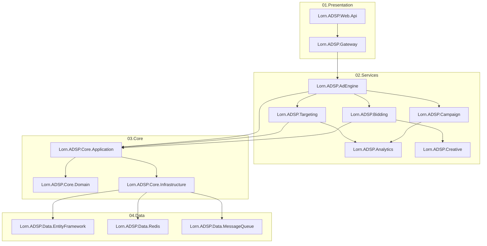

#### 9.3.2 请求处理流程项目映射

| 处理阶段 | 主要项目              | 调用的服务项目                      | 核心接口                     |
| -------- | --------------------- | ----------------------------------- | ---------------------------- |
| 请求接入 | `Lorn.ADSP.Gateway`   | `Lorn.ADSP.Infrastructure.Security` | `IAuthenticationService`     |
| 请求解析 | `Lorn.ADSP.AdEngine`  | `Lorn.ADSP.Core.Application`        | `IAdRequestParsingService`   |
| 用户识别 | `Lorn.ADSP.AdEngine`  | `Lorn.ADSP.Analytics`               | `IUserIdentificationService` |
| 广告召回 | `Lorn.ADSP.AdEngine`  | `Lorn.ADSP.Targeting`               | `IAdRecallService`           |
| 定向匹配 | `Lorn.ADSP.Targeting` | `Lorn.ADSP.Analytics`               | `ITargetingMatchingService`  |
| 竞价决策 | `Lorn.ADSP.Bidding`   | `Lorn.ADSP.Campaign`                | `IBiddingDecisionService`    |
| 预算检查 | `Lorn.ADSP.Campaign`  | `Lorn.ADSP.Data.Redis`              | `IBudgetCheckService`        |
| 响应构建 | `Lorn.ADSP.AdEngine`  | `Lorn.ADSP.Creative`                | `IAdResponseBuildingService` |
| 数据记录 | `Lorn.ADSP.AdEngine`  | `Lorn.ADSP.Data.MessageQueue`       | `IDeliveryLoggingService`    |

### 9.4 数据模型项目映射

#### 9.4.1 领域实体映射

| 领域实体     | 定义项目                | 实现位置                        | 相关值对象                                         |
| ------------ | ----------------------- | ------------------------------- | -------------------------------------------------- |
| 广告实体     | `Lorn.ADSP.Core.Domain` | `/Entities/Advertisement.cs`    | `AdSize`, `AdFormat`, `AdContent`                  |
| 广告活动实体 | `Lorn.ADSP.Core.Domain` | `/Entities/Campaign.cs`         | `BudgetInfo`, `TargetingPolicy`, `DeliveryPolicy`  |
| 用户画像实体 | `Lorn.ADSP.Core.Domain` | `/Entities/UserProfile.cs`      | `Demographics`, `Interests`, `Behaviors`           |
| 投放记录聚合 | `Lorn.ADSP.Core.Domain` | `/Aggregates/DeliveryRecord.cs` | `DeliveryContext`, `BiddingResult`, `QualityScore` |

#### 9.4.2 数据访问项目映射

| 数据访问模式 | 实现项目                         | 主要职责               | 技术实现            |
| ------------ | -------------------------------- | ---------------------- | ------------------- |
| 关系数据访问 | `Lorn.ADSP.Data.EntityFramework` | 业务数据CRUD、事务管理 | EF Core, SQL Server |
| 缓存数据访问 | `Lorn.ADSP.Data.Redis`           | 热点数据缓存、会话存储 | StackExchange.Redis |
| 搜索数据访问 | `Lorn.ADSP.Data.Elasticsearch`   | 全文搜索、日志分析     | Elasticsearch.Net   |
| 消息数据访问 | `Lorn.ADSP.Data.MessageQueue`    | 异步消息、事件发布     | RabbitMQ, Kafka     |

### 9.5 外部集成项目映射

#### 9.5.1 协议实现项目映射

| 协议标准    | 实现项目                     | 主要功能                  | 相关服务             |
| ----------- | ---------------------------- | ------------------------- | -------------------- |
| OpenRTB协议 | `Lorn.ADSP.External.OpenRTB` | RTB请求响应处理、协议适配 | `Lorn.ADSP.Bidding`  |
| VAST标准    | `Lorn.ADSP.External.VAST`    | 视频广告模板、播放控制    | `Lorn.ADSP.Creative` |
| DSP集成     | `Lorn.ADSP.External.DSP`     | 第三方DSP对接、竞价转发   | `Lorn.ADSP.Bidding`  |
| SSP集成     | `Lorn.ADSP.External.SSP`     | 媒体资源接入、流量变现    | `Lorn.ADSP.AdEngine` |

#### 9.5.2 第三方服务集成

| 集成服务     | 实现项目                       | 集成目的               | 调用方式   |
| ------------ | ------------------------------ | ---------------------- | ---------- |
| 用户识别服务 | `Lorn.ADSP.External.DMP`       | 用户画像增强、数据补充 | HTTP API   |
| 地理位置服务 | `Lorn.ADSP.External.GeoIP`     | IP地址解析、位置定向   | 本地库查询 |
| 反作弊服务   | `Lorn.ADSP.External.AntiFraud` | 流量质量检测、作弊识别 | gRPC调用   |
| 支付结算服务 | `Lorn.ADSP.External.Payment`   | 广告费用结算、财务对账 | REST API   |

### 9.6 测试项目映射

#### 9.6.1 测试策略项目映射

| 测试类型   | 测试项目                      | 测试范围                       | 测试工具                 |
| ---------- | ----------------------------- | ------------------------------ | ------------------------ |
| 单元测试   | `Lorn.ADSP.Tests.Unit`        | 核心算法、业务逻辑、工具类     | xUnit, Moq               |
| 集成测试   | `Lorn.ADSP.Tests.Integration` | 服务间通信、数据访问、外部集成 | xUnit, TestContainers    |
| 性能测试   | `Lorn.ADSP.Tests.Performance` | 响应时间、吞吐量、资源消耗     | NBomber, BenchmarkDotNet |
| 端到端测试 | `Lorn.ADSP.Tests.E2E`         | 完整业务流程、用户场景         | Selenium, SpecFlow       |

#### 9.6.2 测试覆盖目标

| 项目模块              | 单元测试覆盖率 | 集成测试覆盖率 | 关键测试场景           |
| --------------------- | -------------- | -------------- | ---------------------- |
| `Lorn.ADSP.AdEngine`  | > 90%          | > 80%          | 广告请求处理、异常场景 |
| `Lorn.ADSP.Targeting` | > 95%          | > 85%          | 定向算法、匹配精度     |
| `Lorn.ADSP.Bidding`   | > 95%          | > 85%          | 竞价逻辑、价格计算     |
| `Lorn.ADSP.Campaign`  | > 90%          | > 80%          | 预算控制、消耗监控     |
| `Lorn.ADSP.Analytics` | > 85%          | > 75%          | 数据分析、机器学习     |

### 9.7 部署和运维项目映射

#### 9.7.1 部署工具项目

| 部署场景   | 工具项目                          | 主要功能                 | 部署目标              |
| ---------- | --------------------------------- | ------------------------ | --------------------- |
| 应用部署   | `Lorn.ADSP.Tools.Deployment`      | Docker镜像构建、K8s部署  | 容器化环境            |
| 数据库迁移 | `Lorn.ADSP.Tools.DataMigration`   | 数据库版本管理、数据迁移 | SQL Server            |
| 配置管理   | `Lorn.ADSP.Infrastructure.Config` | 配置中心、环境变量管理   | Consul, K8s ConfigMap |
| 负载测试   | `Lorn.ADSP.Tools.LoadTesting`     | 压力测试、性能基准       | 测试环境              |

#### 9.7.2 监控运维项目

| 运维场景     | 项目组件                              | 监控对象             | 告警策略           |
| ------------ | ------------------------------------- | -------------------- | ------------------ |
| 基础设施监控 | `Lorn.ADSP.Infrastructure.Monitoring` | 服务器资源、服务状态 | 资源阈值、服务异常 |
| 应用性能监控 | `Lorn.ADSP.Infrastructure.Logging`    | 请求响应时间、错误率 | 性能SLA、异常增长  |
| 业务指标监控 | `Lorn.ADSP.Reporting`                 | 广告填充率、点击率   | 业务基线、异常波动 |
| 安全监控     | `Lorn.ADSP.Infrastructure.Security`   | 异常访问、攻击检测   | 安全事件、风险等级 |

## 10. 技术演进规划

### 10.1 技术栈演进

#### 10.1.1 当前技术栈评估

| 技术组件 | 当前状态       | 发展趋势 | 演进计划         |
| -------- | -------------- | -------- | ---------------- |
| 开发框架 | .NET 9         | 持续演进 | 跟随最新版本     |
| 数据库   | SQL Server     | 云原生化 | 考虑分布式数据库 |
| 缓存系统 | Redis          | 持续优化 | 多级缓存架构     |
| 消息队列 | RabbitMQ/Kafka | 云原生化 | 事件驱动架构     |
| 容器化   | Docker + K8s   | 标准化   | Service Mesh     |

#### 10.1.2 新技术引入策略

| 新技术    | 应用价值 | 引入风险   | 引入策略   |
| --------- | -------- | ---------- | ---------- |
| AI/ML技术 | 智能优化 | 模型复杂性 | 渐进式引入 |
| 边缘计算  | 降低延迟 | 部署复杂性 | 试点验证   |
| 区块链    | 数据可信 | 性能问题   | 探索研究   |
| 量子计算  | 计算性能 | 技术不成熟 | 长期关注   |

### 10.2 架构演进路线

#### 10.2.1 短期目标(6-12个月)

| 演进目标   | 具体措施               | 预期收益        | 实现项目                              |
| ---------- | ---------------------- | --------------- | ------------------------------------- |
| 性能优化   | 缓存架构升级，算法优化 | 响应时间提升30% | `Lorn.ADSP.Infrastructure.Caching`    |
| 智能化水平 | 机器学习模型上线       | 投放效果提升15% | `Lorn.ADSP.Analytics`                 |
| 运维自动化 | 监控告警系统完善       | 运维效率提升50% | `Lorn.ADSP.Infrastructure.Monitoring` |
| 安全加固   | 安全防护体系建设       | 安全风险降低80% | `Lorn.ADSP.Infrastructure.Security`   |

#### 10.2.2 中期目标(1-2年)

| 演进目标   | 具体措施          | 预期收益        | 实现项目                              |
| ---------- | ----------------- | --------------- | ------------------------------------- |
| 云原生架构 | 微服务架构优化    | 扩展性提升200%  | 所有`Lorn.ADSP.Services`项目          |
| 边缘计算   | CDN和边缘节点部署 | 全球延迟降低50% | `Lorn.ADSP.Infrastructure.Edge`       |
| AI驱动     | 深度学习模型应用  | 投放ROI提升25%  | `Lorn.ADSP.Analytics.MachineLearning` |
| 实时计算   | 流式处理架构      | 实时性提升10倍  | `Lorn.ADSP.Data.StreamProcessing`     |

#### 10.2.3 长期目标(2-5年)

| 演进目标   | 具体措施       | 预期收益           | 战略意义           |
| ---------- | -------------- | ------------------ | ------------------ |
| 全球化部署 | 多地域服务架构 | 支持全球业务       | 国际化市场扩展     |
| 量子计算   | 量子算法研究   | 计算能力革命性提升 | 下一代技术领先优势 |
| 自适应系统 | 系统自我优化   | 无人值守运行       | 运维成本显著降低   |
| 生态开放   | 平台API开放    | 构建生态系统       | 建立行业技术标准   |

### 10.3 持续优化机制

#### 10.3.1 性能优化闭环

**实现项目映射：**
- 性能监控：`Lorn.ADSP.Infrastructure.Monitoring`
- 问题识别和分析：`Lorn.ADSP.Tools.Analysis`  
- 优化实施：各业务项目的性能优化模块
- 效果验证：`Lorn.ADSP.Tests.Performance`

#### 10.3.2 技术债务管理

| 债务类型     | 评估标准               | 清理策略 | 清理周期 | 负责项目                      |
| ------------ | ---------------------- | -------- | -------- | ----------------------------- |
| 代码质量债务 | 代码复杂度，测试覆盖率 | 重构优化 | 每月     | 所有业务逻辑项目              |
| 架构设计债务 | 耦合度，可维护性       | 架构重构 | 每季度   | `Lorn.ADSP.Core`系列项目      |
| 技术选型债务 | 技术老化度，社区活跃度 | 技术升级 | 每年     | `Lorn.ADSP.Infrastructure`    |
| 性能债务     | 性能指标，用户体验     | 性能优化 | 持续     | `Lorn.ADSP.Tests.Performance` |

### 10.4 技术风险管控

#### 10.4.1 技术风险识别

| 风险类别 | 风险描述             | 影响程度 | 发生概率 | 应对策略           |
| -------- | -------------------- | -------- | -------- | ------------------ |
| 技术老化 | 核心技术栈过时       | 高       | 中       | 渐进式技术升级     |
| 性能瓶颈 | 系统性能无法满足需求 | 高       | 高       | 提前性能优化和扩容 |
| 安全漏洞 | 系统存在安全隐患     | 高       | 中       | 定期安全审计和加固 |
| 依赖风险 | 第三方服务不可用     | 中       | 中       | 多供应商策略       |
| 技能缺失 | 团队技术能力不足     | 中       | 低       | 持续技术培训       |

#### 10.4.2 风险应对机制

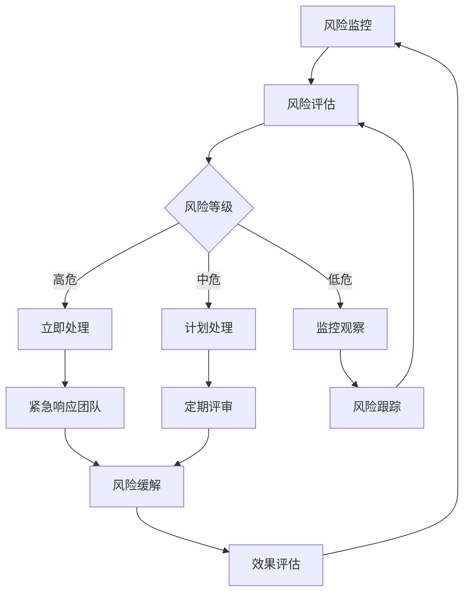

### 10.5 技术创新投入

#### 10.5.1 创新投入规划

| 创新领域   | 投入占比 | 主要方向           | 预期产出             | 实现时间  |
| ---------- | -------- | ------------------ | -------------------- | --------- |
| AI/ML算法  | 30%      | 智能投放、效果预测 | 算法模型、专利申请   | 6-18个月  |
| 边缘计算   | 25%      | 边缘部署、就近服务 | 边缘架构、延迟优化   | 12-24个月 |
| 实时计算   | 20%      | 流式处理、实时决策 | 实时引擎、毫秒级响应 | 9-18个月  |
| 区块链技术 | 15%      | 数据可信、透明结算 | 区块链平台、信任机制 | 18-36个月 |
| 量子计算   | 10%      | 量子算法、计算加速 | 技术储备、概念验证   | 24-60个月 |

#### 10.5.2 创新管理流程

| 阶段     | 主要活动             | 评审标准             | 输出物             | 项目归属               |
| -------- | -------------------- | -------------------- | ------------------ | ---------------------- |
| 创意孵化 | 技术调研、概念验证   | 技术可行性、业务价值 | 技术调研报告       | `Lorn.ADSP.Research`   |
| 原型开发 | 快速原型、功能验证   | 功能完整性、性能指标 | 原型系统、测试报告 | `Lorn.ADSP.Prototype`  |
| 试点应用 | 小规模部署、效果验证 | 实际效果、稳定性     | 试点报告、优化方案 | 相关业务项目           |
| 规模推广 | 全面部署、持续优化   | 规模效应、投入产出比 | 正式产品、运营数据 | `Lorn.ADSP.Production` |

### 10.6 团队技术能力建设

#### 10.6.1 技术能力矩阵

| 技术领域      | 当前水平 | 目标水平 | 提升策略       | 培训项目                             |
| ------------- | -------- | -------- | -------------- | ------------------------------------ |
| .NET Core高级 | 中级     | 高级     | 项目实践+培训  | `Lorn.ADSP.Training.DotNet`          |
| 微服务架构    | 初级     | 中级     | 架构设计+实践  | `Lorn.ADSP.Training.Microservices`   |
| 机器学习      | 初级     | 中级     | 算法学习+应用  | `Lorn.ADSP.Training.MachineLearning` |
| 云原生技术    | 中级     | 高级     | 容器化+K8s实践 | `Lorn.ADSP.Training.CloudNative`     |
| 大数据处理    | 初级     | 中级     | 数据处理+分析  | `Lorn.ADSP.Training.BigData`         |
| 性能优化      | 中级     | 高级     | 性能调优+监控  | `Lorn.ADSP.Training.Performance`     |

#### 10.6.2 知识管理体系

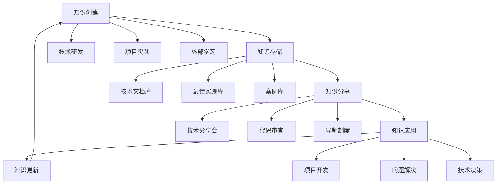

**知识管理项目实现：**
- 技术文档管理：`Lorn.ADSP.Knowledge.Documentation`
- 最佳实践库：`Lorn.ADSP.Knowledge.BestPractices`
- 培训管理系统：`Lorn.ADSP.Knowledge.Training`

### 10.7 技术标准化

#### 10.7.1 开发标准

| 标准类别 | 标准内容               | 实施工具                 | 检查频率 |
| -------- | ---------------------- | ------------------------ | -------- |
| 编码规范 | C#编码标准、命名规范   | EditorConfig, StyleCop   | 每次提交 |
| 架构标准 | 分层架构、模块划分     | ArchUnit, 架构审查       | 每周     |
| 测试标准 | 单元测试、集成测试覆盖 | xUnit, Coverage工具      | 每日构建 |
| 安全标准 | 代码安全、漏洞扫描     | SonarQube, 安全扫描工具  | 每次发布 |
| 性能标准 | 响应时间、吞吐量要求   | BenchmarkDotNet, APM工具 | 每次发布 |

#### 10.7.2 质量保证体系

| 质量环节 | 质量活动             | 质量标准               | 工具支持             |
| -------- | -------------------- | ---------------------- | -------------------- |
| 开发阶段 | 代码审查、静态分析   | 代码质量、安全扫描     | SonarQube, Veracode  |
| 测试阶段 | 自动化测试、性能测试 | 测试覆盖率、性能指标   | xUnit, NBomber       |
| 部署阶段 | 自动化部署、环境验证 | 部署成功率、环境一致性 | Azure DevOps, Docker |
| 运行阶段 | 监控告警、问题处理   | 系统可用性、响应时间   | Prometheus, Grafana  |

### 10.8 开源生态建设

#### 10.8.1 开源策略

| 开源模块 | 开源范围             | 开源价值       | 维护策略     |
| -------- | -------------------- | -------------- | ------------ |
| 基础组件 | 通用工具类、扩展方法 | 提升社区影响力 | 社区共建     |
| 算法框架 | 广告算法框架         | 建立技术标准   | 核心团队维护 |
| 性能工具 | 性能测试、监控工具   | 推广最佳实践   | 社区共建     |
| 开发工具 | SDK、代码生成器      | 降低接入门槛   | 产品化运营   |

#### 10.8.2 技术影响力建设

| 建设方向 | 具体行动             | 目标指标            | 实施计划   |
| -------- | -------------------- | ------------------- | ---------- |
| 技术文章 | 技术博客、论文发表   | 月均2篇高质量文章   | 持续进行   |
| 开源项目 | GitHub项目、贡献代码 | 年度3个有影响力项目 | 按季度规划 |
| 技术演讲 | 会议分享、技术沙龙   | 年度10+场技术分享   | 按需参与   |
| 标准制定 | 参与行业标准制定     | 参与2+个行业标准    | 长期投入   |

## 11. 总结

广告投放引擎作为整个广告平台的核心，其技术设计需要在性能、可靠性、扩展性和创新性之间找到最佳平衡点。通过本技术设计文档，我们明确了：

### 11.1 核心设计原则
- **高性能优先**：确保毫秒级响应时间和高并发处理能力
- **可靠性保证**：通过多层容错和高可用设计保证系统稳定运行
- **扩展性支撑**：支持水平扩展以应对业务快速增长
- **标准化遵循**：严格遵循IAB等行业标准确保生态兼容性

### 11.2 关键技术突破
- **智能算法融合**：多种召回和定向算法的有机结合
- **实时决策优化**：毫秒级的竞价和预算控制决策
- **分布式架构**：云原生的微服务架构设计
- **AI驱动增强**：机器学习在投放优化中的深度应用

### 11.3 项目实施路径
通过Visual Studio解决方案的合理架构划分，确保了：
- **职责清晰**：每个项目都有明确的功能边界和实现职责
- **依赖合理**：项目间依赖关系符合分层架构和依赖倒置原则  
- **可测试性**：完善的测试项目覆盖确保代码质量
- **可维护性**：标准化的代码结构便于长期维护和演进

### 11.4 技术演进展望
- **短期**：通过性能优化和智能化升级提升核心竞争力
- **中期**：通过云原生和边缘计算实现全球化部署
- **长期**：通过AI驱动和量子计算等前沿技术保持技术领先

本技术设计文档将作为广告投放引擎开发的重要指导，确保项目能够高质量、高效率地实现预期目标，为Lorn.ADSP广告平台的成功奠定坚实的技术基础。