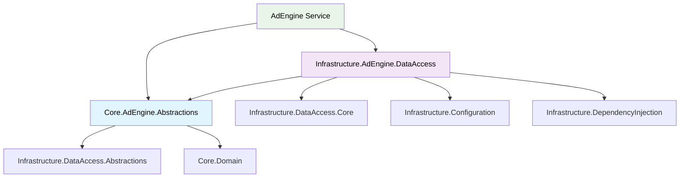
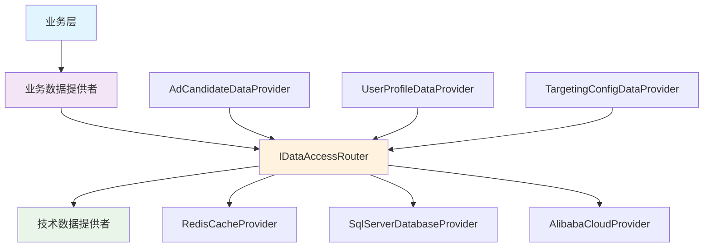

# 广告投放引擎数据访问层技术设计

## 设计概述

广告投放引擎数据访问层是基于系统统一基础设施的业务特化层，专门为广告投放引擎提供高性能数据访问能力。本设计**严格遵循"不重复造轮子"原则**，直接使用已有的数据访问基础设施、配置管理和依赖注入组件，只实现广告投放业务特有的数据提供者。

### 核心设计原则

**基础设施复用原则**：
- **完全基于统一数据访问层**：使用 `Lorn.ADSP.Infrastructure.DataAccess.Core` 的 `BusinessDataProviderBase` 基类
- **完全基于统一配置管理**：使用 `Lorn.ADSP.Infrastructure.Configuration` 的配置基础设施  
- **完全基于统一依赖注入**：使用 `Lorn.ADSP.Infrastructure.DependencyInjection` 的组件发现机制
- **完全基于领域模型设计**：使用 `Lorn.ADSP.Core.Domain` 中定义的所有实体和值对象

**业务特化原则**：
- **单一职责**：数据提供者仅负责纯数据访问，不包含任何业务逻辑
- **领域专用**：针对广告投放业务场景的数据访问优化
- **性能优先**：支持实时竞价场景的毫秒级响应要求
- **缓存优先**：基于广告业务特点的缓存策略优化

### 架构位置和依赖关系

```mermaid
graph TD
    subgraph "现有基础设施（引用使用）"
        A[数据访问层技术设计] --> A1[BusinessDataProviderBase]
        A --> A2[IDataAccessRouter]
        A --> A3[IRepository<T>]
        
        B[统一配置基础设施] --> B1[配置管理]
        B --> B2[配置验证]
        B --> B3[热重载]
        
        C[统一依赖注入] --> C1[组件发现]
        C --> C2[自动注册]
        C --> C3[生命周期管理]
        
        D[领域模型设计] --> D1[实体定义]
        D --> D2[值对象定义]
        D --> D3[聚合根设计]
    end
    
    subgraph "广告引擎数据访问层（本设计范围）"
        E[业务数据提供者] --> E1[AdCandidateDataProvider]
        E --> E2[UserProfileDataProvider]
        E --> E3[TargetingConfigDataProvider]
        
        F[业务特化接口] --> F1[IAdCandidateDataProvider]
        F --> F2[IUserProfileDataProvider]
        F --> F3[ITargetingConfigDataProvider]
        
        G[广告引擎专用配置] --> G1[缓存策略配置]
        G --> G2[性能指标配置]
        G --> G3[路由优化配置]
    end
    
    E1 --> A1
    E2 --> A1
    E3 --> A1
    
    E --> B
    E --> C
    E --> D
    
    style A fill:#e8f5e8
    style B fill:#e8f5e8  
    style C fill:#e8f5e8
    style D fill:#e8f5e8
    style E fill:#fff3e0
    style F fill:#fff3e0
    style G fill:#fff3e0
```


## 1. 项目结构和依赖关系

### 1.1 Visual Studio解决方案中的项目位置

广告投放引擎数据访问层**不创建新的基础设施项目**，而是基于现有项目实现业务特化：

```text
Lorn.ADSP.sln
├── Core/                                          # 核心业务层
│   ├── Lorn.ADSP.Core.Domain/                     # 【引用】领域模型（已存在）
│   │   ├── Entities/                              # 【引用】所有领域实体
│   │   ├── ValueObjects/                          # 【引用】所有值对象
│   │   └── Aggregates/                            # 【引用】所有聚合根
│   │
│   └── Lorn.ADSP.Core.AdEngine.Abstractions/     # 【新建】广告引擎抽象接口
│       ├── Interfaces/                            # 广告引擎特化接口定义
│       │   ├── IAdCandidateDataProvider.cs       # 广告候选数据提供者接口
│       │   ├── IUserProfileDataProvider.cs       # 用户画像数据提供者接口
│       │   └── ITargetingConfigDataProvider.cs   # 定向配置数据提供者接口
│       ├── Models/                                # 请求响应模型
│       │   ├── AdCandidateRequest.cs             # 广告候选查询请求
│       │   ├── UserProfileRequest.cs             # 用户画像查询请求
│       │   └── TargetingConfigRequest.cs         # 定向配置查询请求
│       └── Enums/                                 # 广告引擎专用枚举
│           ├── AdEngineDomain.cs                 # 广告引擎领域枚举
│           └── AdEngineOperation.cs              # 广告引擎操作枚举
│
├── Infrastructure/                                # 基础设施层
│   ├── Lorn.ADSP.Infrastructure.DataAccess.*/    # 【引用】统一数据访问基础设施（已存在）
│   ├── Lorn.ADSP.Infrastructure.Configuration/   # 【引用】统一配置基础设施（已存在）
│   ├── Lorn.ADSP.Infrastructure.DependencyInjection/ # 【引用】统一依赖注入基础设施（已存在）
│   │
│   └── Lorn.ADSP.Infrastructure.AdEngine.DataAccess/ # 【新建】广告引擎数据访问实现
│       ├── Providers/                             # 业务数据提供者实现
│       │   ├── AdCandidateDataProvider.cs        # 继承BusinessDataProviderBase
│       │   ├── UserProfileDataProvider.cs        # 继承BusinessDataProviderBase
│       │   └── TargetingConfigDataProvider.cs    # 继承BusinessDataProviderBase
│       ├── Configuration/                         # 广告引擎专用配置选项
│       │   └── AdEngineDataAccessOptions.cs      # 使用统一配置基础设施
│       └── Extensions/                            # 服务注册扩展
│           └── ServiceCollectionExtensions.cs    # 使用统一依赖注入基础设施
│
└── Services/                                      # 服务层
    └── Lorn.ADSP.AdEngine/                       # 【引用】广告引擎服务（已存在）
```

### 1.2 项目依赖关系



**依赖关系说明**：

- **抽象层**：仅依赖基础设施抽象和领域模型，不依赖具体实现
- **实现层**：依赖抽象层和基础设施核心组件，继承BusinessDataProviderBase
- **服务层**：通过抽象接口使用数据访问能力，不直接依赖实现

### 1.3 基础设施引用说明

**引用的基础设施组件**：

| 基础设施组件               | 引用方式     | 使用场景                     |
| -------------------------- | ------------ | ---------------------------- |
| `BusinessDataProviderBase` | 类继承       | 所有数据提供者的基类         |
| `IDataAccessRouter`        | 构造函数注入 | 自动路由到缓存或数据库       |
| `IRepository<T>`           | 自动注入     | 基类内部访问数据库           |
| `IAdEngineCacheProvider`   | 自动注入     | 基类内部管理缓存             |
| 统一配置基础设施           | 配置约定     | 自动绑定配置选项             |
| 统一依赖注入基础设施       | 特性标记     | 自动发现和注册组件           |
| 领域实体和值对象           | 直接引用     | 作为数据提供者的输入输出类型 |

**不重复实现的组件**：

- ❌ 缓存管理器（使用统一数据访问层的缓存基础设施）
- ❌ 数据库连接池（使用统一数据访问层的连接管理）
- ❌ 配置管理器（使用统一配置基础设施）
- ❌ 健康检查器（使用统一基础设施的健康检查）
- ❌ 监控指标（使用统一基础设施的监控组件）
## 2. 广告引擎特化接口设计

基于现有的 `IDataAccessProvider` 基础接口，广告投放引擎定义业务特化的数据提供者接口。这些接口专注于广告投放业务场景的数据访问需求。

### 2.1 核心业务接口

**位置**：`Lorn.ADSP.Core.AdEngine.Abstractions/Interfaces/`

```csharp
/// <summary>
/// 广告候选数据提供者接口
/// 职责：提供广告候选相关的纯数据访问操作
/// 基于数据模型分层设计中标记为"需要存储"的实体
/// </summary>
public interface IAdCandidateDataProvider : IDataAccessProvider
{
    /// <summary>
    /// 根据广告位ID获取活跃的广告活动列表
    /// 注意：只返回数据库中的原始记录，不进行业务逻辑过滤
    /// </summary>
    Task<List<Campaign>> GetActiveCampaignsByPlacementAsync(string placementId, CancellationToken cancellationToken = default);
    
    /// <summary>
    /// 批量获取广告创意信息
    /// </summary>
    Task<Dictionary<Guid, List<Creative>>> GetCreativesByCampaignIdsAsync(List<Guid> campaignIds, CancellationToken cancellationToken = default);
    
    /// <summary>
    /// 批量获取广告位配置信息
    /// </summary>
    Task<Dictionary<string, AdSlotConfiguration>> GetAdSlotConfigurationsBatchAsync(List<string> placementIds, CancellationToken cancellationToken = default);
    
    /// <summary>
    /// 获取广告主的所有广告
    /// </summary>
    Task<List<Advertisement>> GetAdvertisementsByAdvertiserAsync(Guid advertiserId, CancellationToken cancellationToken = default);
}

/// <summary>
/// 用户画像数据提供者接口
/// 职责：提供用户画像相关的纯数据访问操作
/// 基于数据模型分层设计中的UserProfile及其支持实体
/// </summary>
public interface IUserProfileDataProvider : IDataAccessProvider
{
    /// <summary>
    /// 获取用户基础画像信息（包含人口统计学信息、兴趣、行为、标签）
    /// </summary>
    Task<UserProfile> GetUserProfileAsync(string userId, CancellationToken cancellationToken = default);
    
    /// <summary>
    /// 批量获取用户画像信息
    /// </summary>
    Task<Dictionary<string, UserProfile>> GetUserProfilesBatchAsync(List<string> userIds, CancellationToken cancellationToken = default);
    
    /// <summary>
    /// 获取用户的人口统计学信息
    /// </summary>
    Task<List<UserDemographic>> GetUserDemographicsAsync(Guid userProfileId, CancellationToken cancellationToken = default);
    
    /// <summary>
    /// 获取用户兴趣信息
    /// </summary>
    Task<List<UserInterest>> GetUserInterestsAsync(Guid userProfileId, CancellationToken cancellationToken = default);
    
    /// <summary>
    /// 获取用户行为数据
    /// </summary>
    Task<List<UserBehavior>> GetUserBehaviorsAsync(Guid userProfileId, DateTime? fromDate = null, CancellationToken cancellationToken = default);
    
    /// <summary>
    /// 获取用户标签
    /// </summary>
    Task<List<UserTag>> GetUserTagsAsync(Guid userProfileId, CancellationToken cancellationToken = default);
}

/// <summary>
/// 定向配置数据提供者接口
/// 职责：提供定向配置相关的纯数据访问操作
/// 基于数据模型分层设计中的TargetingConfig及其支持实体
/// </summary>
public interface ITargetingConfigDataProvider : IDataAccessProvider
{
    /// <summary>
    /// 获取广告活动的定向配置（包含定向条件和动态参数）
    /// </summary>
    Task<TargetingConfig> GetTargetingConfigurationAsync(Guid campaignId, CancellationToken cancellationToken = default);
    
    /// <summary>
    /// 批量获取定向配置
    /// </summary>
    Task<Dictionary<Guid, TargetingConfig>> GetTargetingConfigurationsBatchAsync(List<Guid> campaignIds, CancellationToken cancellationToken = default);
    
    /// <summary>
    /// 获取定向策略模板
    /// </summary>
    Task<TargetingPolicy> GetTargetingPolicyAsync(Guid policyId, CancellationToken cancellationToken = default);
    
    /// <summary>
    /// 获取定向条件
    /// </summary>
    Task<List<TargetingCriteria>> GetTargetingCriteriaAsync(Guid targetingConfigId, CancellationToken cancellationToken = default);
    
    /// <summary>
    /// 获取动态参数
    /// </summary>
    Task<List<DynamicParameter>> GetDynamicParametersAsync(Guid targetingConfigId, CancellationToken cancellationToken = default);
    
    /// <summary>
    /// 获取公共定向策略模板列表
    /// </summary>
    Task<List<TargetingPolicy>> GetPublicTargetingPoliciesAsync(string category = null, CancellationToken cancellationToken = default);
}

/// <summary>
/// 投放记录数据提供者接口
/// 职责：提供投放记录相关的纯数据访问操作
/// 基于数据模型分层设计中的DeliveryRecord实体
/// </summary>
public interface IDeliveryRecordDataProvider : IDataAccessProvider
{
    /// <summary>
    /// 记录广告投放
    /// </summary>
    Task<Guid> CreateDeliveryRecordAsync(DeliveryRecord record, CancellationToken cancellationToken = default);
    
    /// <summary>
    /// 获取广告活动的投放记录
    /// </summary>
    Task<List<DeliveryRecord>> GetDeliveryRecordsByCampaignAsync(Guid campaignId, DateTime? fromDate = null, DateTime? toDate = null, CancellationToken cancellationToken = default);
    
    /// <summary>
    /// 批量获取投放记录
    /// </summary>
    Task<List<DeliveryRecord>> GetDeliveryRecordsBatchAsync(List<Guid> recordIds, CancellationToken cancellationToken = default);
    
    /// <summary>
    /// 更新投放记录状态
    /// </summary>
    Task UpdateDeliveryRecordStatusAsync(Guid recordId, DeliveryStatus status, CancellationToken cancellationToken = default);
}
```

### 2.2 基础设施依赖说明

**重要**：广告引擎数据访问层完全基于现有基础设施，不重复实现任何架构组件：

| 基础设施组件               | 引用位置                             | 使用方式                             |
| -------------------------- | ------------------------------------ | ------------------------------------ |
| `BusinessDataProviderBase` | `Infrastructure.DataAccess.Core`     | 继承基类，获得完整数据访问能力       |
| `IDataAccessRouter`        | `Infrastructure.DataAccess.Core`     | 自动注入，处理缓存和数据库路由       |
| `IRepository<T>`           | `Infrastructure.DataAccess.Core`     | 自动注入，提供数据库访问能力         |
| 统一缓存基础设施           | `Infrastructure.DataAccess.*`        | 基类自动处理多级缓存逻辑             |
| 统一配置基础设施           | `Infrastructure.Configuration`       | 使用配置约定自动绑定配置选项         |
| 统一依赖注入基础设施       | `Infrastructure.DependencyInjection` | 使用特性标记自动发现和注册组件       |
| 领域实体和值对象           | `Core.Domain.Entities`               | 直接引用，作为数据访问的输入输出类型 |

**架构透明性**：

- **缓存策略**：完全由 `IDataAccessRouter` 和基类处理，业务层无感知
- **路由决策**：统一基础设施根据配置自动选择最优数据源
- **性能监控**：基类自动记录所有性能指标和访问统计
- **故障处理**：统一的重试、熔断和降级策略

## 3. 数据提供者实现指导

### 3.1 基于 BusinessDataProviderBase 的实现模式

所有广告引擎数据提供者都必须继承统一数据访问层的 `BusinessDataProviderBase` 基类，该基类已经处理了：

- **缓存优先逻辑**：自动实现缓存查询→数据库查询→缓存回写的完整流程
- **路由决策处理**：通过 `IDataAccessRouter` 自动选择合适的技术提供者
- **异常处理机制**：统一的错误处理、重试和降级策略
- **性能监控**：自动记录性能指标和访问统计

### 3.2 实现样例

**AdCandidateDataProvider 实现样例**：

```csharp
[Component(ConfigurationSection = "DataProviders:AdCandidate")]
public class AdCandidateDataProvider : BusinessDataProviderBase, IAdCandidateDataProvider
{
    private readonly AdEngineDbContext _context;
    
    public AdCandidateDataProvider(AdEngineDbContext context, ILogger<AdCandidateDataProvider> logger, IDataAccessRouter router)
        : base(logger, router)
    {
        _context = context ?? throw new ArgumentNullException(nameof(context));
    }

    protected override DataProviderMetadata CreateMetadata()
    {
        return new DataProviderMetadata
        {
            ProviderId = "AdCandidateDataProvider_v1.0",
            ProviderName = "广告候选数据提供者",
            ProviderType = DataProviderType.BusinessLogic,
            BusinessEntity = "AdCandidate",
            SupportedOperations = new[] { "GetCandidates", "BatchQuery" },
            Priority = 100
        };
    }

    public async Task<List<Campaign>> GetActiveCampaignsByPlacementAsync(
        string placementId, CancellationToken cancellationToken = default)
    {
        var context = new DataAccessContext
        {
            OperationType = "GetActiveCampaignsByPlacement",
            EntityType = "Campaign",
            Parameters = new Dictionary<string, object> { ["PlacementId"] = placementId }
        };

        // 使用基类的数据访问模式：缓存查询→数据库查询→缓存回写
        return await GetAsync<List<Campaign>>(context, async () =>
        {
            // 仅返回数据库中的原始数据，不进行业务逻辑过滤
            return await _context.Campaigns
                .Include(c => c.Advertiser)
                .Include(c => c.BudgetConstraints)
                .Include(c => c.TargetingConfig)
                .Where(c => c.Status == CampaignStatus.Active)
                .Where(c => c.StartTime <= DateTime.UtcNow && c.EndTime >= DateTime.UtcNow)
                .ToListAsync(cancellationToken);
        }, cancellationToken) ?? new List<Campaign>();
    }

    public async Task<Dictionary<Guid, List<Creative>>> GetCreativesByCampaignIdsAsync(
        List<Guid> campaignIds, CancellationToken cancellationToken = default)
    {
        var context = new DataAccessContext
        {
            OperationType = "GetCreativesByCampaignIds",
            EntityType = "Creative",
            Parameters = new Dictionary<string, object> { ["CampaignIds"] = campaignIds }
        };

        return await GetAsync<Dictionary<Guid, List<Creative>>>(context, async () =>
        {
            var creatives = await _context.Creatives
                .Include(c => c.Assets)
                .Where(c => campaignIds.Contains(c.CampaignId) && c.Status == CreativeStatus.Approved)
                .ToListAsync(cancellationToken);
            
            return creatives.GroupBy(c => c.CampaignId)
                           .ToDictionary(g => g.Key, g => g.ToList());
        }, cancellationToken) ?? new Dictionary<Guid, List<Creative>>();
    }

    public async Task<Dictionary<string, AdSlotConfiguration>> GetAdSlotConfigurationsBatchAsync(
        List<string> placementIds, CancellationToken cancellationToken = default)
    {
        var context = new DataAccessContext
        {
            OperationType = "GetAdSlotConfigurationsBatch",
            EntityType = "AdSlotConfiguration",
            Parameters = new Dictionary<string, object> { ["PlacementIds"] = placementIds }
        };

        return await GetAsync<Dictionary<string, AdSlotConfiguration>>(context, async () =>
        {
            var configurations = await _context.AdSlotConfigurations
                .Include(c => c.SizeSpecifications)
                .Include(c => c.FormatRequirements)
                .Where(c => placementIds.Contains(c.PlacementId))
                .ToListAsync(cancellationToken);
            
            return configurations.ToDictionary(c => c.PlacementId, c => c);
        }, cancellationToken) ?? new Dictionary<string, AdSlotConfiguration>();
    }

    public async Task<List<Advertisement>> GetAdvertisementsByAdvertiserAsync(
        Guid advertiserId, CancellationToken cancellationToken = default)
    {
        var context = new DataAccessContext
        {
            OperationType = "GetAdvertisementsByAdvertiser",
            EntityType = "Advertisement",
            Parameters = new Dictionary<string, object> { ["AdvertiserId"] = advertiserId }
        };

        return await GetAsync<List<Advertisement>>(context, async () =>
        {
            return await _context.Advertisements
                .Include(a => a.Campaign)
                .Include(a => a.Creatives)
                .Where(a => a.Campaign.AdvertiserId == advertiserId)
                .Where(a => a.Status == AdvertisementStatus.Active)
                .ToListAsync(cancellationToken);
        }, cancellationToken) ?? new List<Advertisement>();
    }
}
```

**UserProfileDataProvider 实现样例**：

```csharp
[Component(ConfigurationSection = "DataProviders:UserProfile")]
public class UserProfileDataProvider : BusinessDataProviderBase, IUserProfileDataProvider
{
    private readonly AdEngineDbContext _context;
    
    public UserProfileDataProvider(AdEngineDbContext context, ILogger<UserProfileDataProvider> logger, IDataAccessRouter router)
        : base(logger, router)
    {
        _context = context ?? throw new ArgumentNullException(nameof(context));
    }

    protected override DataProviderMetadata CreateMetadata()
    {
        return new DataProviderMetadata
        {
            ProviderId = "UserProfileDataProvider_v1.0",
            ProviderName = "用户画像数据提供者",
            ProviderType = DataProviderType.BusinessLogic,
            BusinessEntity = "UserProfile",
            SupportedOperations = new[] { "GetProfile", "BatchQuery" },
            Priority = 90
        };
    }

    public async Task<UserProfile> GetUserProfileAsync(string userId, CancellationToken cancellationToken = default)
    {
        var context = new DataAccessContext
        {
            OperationType = "GetUserProfile",
            EntityType = "UserProfile",
            Parameters = new Dictionary<string, object> { ["UserId"] = userId }
        };

        return await GetAsync<UserProfile>(context, async () =>
        {
            return await _context.UserProfiles
                .Include(up => up.Demographics)
                .Include(up => up.Interests)
                .Include(up => up.Behaviors)
                .Include(up => up.Tags)
                .FirstOrDefaultAsync(up => up.UserId == userId, cancellationToken);
        }, cancellationToken);
    }

    public async Task<Dictionary<string, UserProfile>> GetUserProfilesBatchAsync(
        List<string> userIds, CancellationToken cancellationToken = default)
    {
        var context = new DataAccessContext
        {
            OperationType = "GetUserProfilesBatch",
            EntityType = "UserProfile",
            Parameters = new Dictionary<string, object> { ["UserIds"] = userIds }
        };

        return await GetAsync<Dictionary<string, UserProfile>>(context, async () =>
        {
            var profiles = await _context.UserProfiles
                .Include(up => up.Demographics)
                .Include(up => up.Interests)
                .Include(up => up.Behaviors)
                .Include(up => up.Tags)
                .Where(up => userIds.Contains(up.UserId))
                .ToListAsync(cancellationToken);
            
            return profiles.ToDictionary(p => p.UserId, p => p);
        }, cancellationToken) ?? new Dictionary<string, UserProfile>();
    }

    // 其他接口方法实现...
}
```

### 3.3 配置和注册

**配置选项**（使用统一配置基础设施）：

```json
{
  "DataProviders": {
    "AdCandidate": {
      "TimeoutMs": 5,
      "MaxBatchSize": 50,
      "CacheSettings": {
        "DefaultTTL": "00:05:00",
        "SlidingExpiration": true
      }
    },
    "UserProfile": {
      "TimeoutMs": 20,
      "MaxBatchSize": 100,
      "CacheSettings": {
        "DefaultTTL": "01:00:00",
        "SlidingExpiration": true
      }
    },
    "TargetingConfig": {
      "TimeoutMs": 30,
      "MaxBatchSize": 30,
      "CacheSettings": {
        "DefaultTTL": "04:00:00",
        "SlidingExpiration": false
      }
    },
    "DeliveryRecord": {
      "TimeoutMs": 10,
      "MaxBatchSize": 200,
      "CacheSettings": {
        "DefaultTTL": "00:30:00",
        "SlidingExpiration": true
      }
    }
  },
  "EntityFramework": {
    "AdEngine": {
      "ConnectionString": "Server=...;Database=AdEngine;...",
      "QueryTimeout": 30,
      "EnableSensitiveDataLogging": false,
      "EnableDetailedErrors": false,
      "MaxRetryCount": 3,
      "MaxRetryDelay": "00:00:30"
    }
  }
}
```

**服务注册**（使用统一依赖注入基础设施）：

```csharp
public static class ServiceCollectionExtensions
{
    public static IServiceCollection AddAdEngineDataAccess(
        this IServiceCollection services, IConfiguration configuration)
    {
        // Entity Framework Core DbContext注册
        services.AddDbContext<AdEngineDbContext>(options =>
        {
            var connectionString = configuration.GetConnectionString("AdEngine");
            options.UseSqlServer(connectionString, sqlOptions =>
            {
                sqlOptions.CommandTimeout(30);
                sqlOptions.EnableRetryOnFailure(
                    maxRetryCount: 3,
                    maxRetryDelay: TimeSpan.FromSeconds(30),
                    errorNumbersToAdd: null);
            });
            
            // 性能和诊断设置
            options.EnableSensitiveDataLogging(false);
            options.EnableDetailedErrors(false);
            options.ConfigureWarnings(warnings => warnings.Throw(RelationalEventId.QueryPossibleUnintendedUseOfEqualsWarning));
        });

        // 广告引擎数据提供者注册（基于统一配置约定自动发现和注册）
        services.AddScoped<IAdCandidateDataProvider, AdCandidateDataProvider>();
        services.AddScoped<IUserProfileDataProvider, UserProfileDataProvider>();
        services.AddScoped<ITargetingConfigDataProvider, TargetingConfigDataProvider>();
        services.AddScoped<IDeliveryRecordDataProvider, DeliveryRecordDataProvider>();
        
        // 注册数据访问相关的基础设施服务
        services.AddScoped<IDataAccessRouter, DataAccessRouter>();
        services.AddMemoryCache(); // 用于数据提供者的缓存功能
        
        return services;
    }
}
```

**数据迁移和初始化**：

```csharp
public static class DatabaseInitializationExtensions
{
    public static async Task InitializeAdEngineDatabase(this IServiceProvider serviceProvider)
    {
        using var scope = serviceProvider.CreateScope();
        var context = scope.ServiceProvider.GetRequiredService<AdEngineDbContext>();
        var logger = scope.ServiceProvider.GetRequiredService<ILogger<AdEngineDbContext>>();
        
        try
        {
            // 应用挂起的迁移
            await context.Database.MigrateAsync();
            
            // 数据库种子数据初始化（如果需要）
            await SeedDefaultData(context);
            
            logger.LogInformation("广告引擎数据库初始化成功");
        }
        catch (Exception ex)
        {
            logger.LogError(ex, "广告引擎数据库初始化失败");
            throw;
        }
    }
    
    private static async Task SeedDefaultData(AdEngineDbContext context)
    {
        // 创建默认的定向策略模板
        if (!await context.TargetingPolicies.AnyAsync())
        {
            var defaultPolicies = new[]
            {
                new TargetingPolicy
                {
                    Id = Guid.NewGuid(),
                    Name = "基础人口统计学定向",
                    Category = "Demographics",
                    IsPublic = true,
                    Description = "基于年龄、性别、地理位置的基础定向策略"
                },
                new TargetingPolicy
                {
                    Id = Guid.NewGuid(),
                    Name = "兴趣定向策略",
                    Category = "Interest",
                    IsPublic = true,
                    Description = "基于用户兴趣和行为的定向策略"
                }
            };
            
            context.TargetingPolicies.AddRange(defaultPolicies);
            await context.SaveChangesAsync();
        }
    }
}
```

### 3.4 职责边界

**✅ 数据提供者应该做的**：

1. **纯数据访问操作**：
   - 基本 CRUD 操作（Create、Read、Update、Delete）
   - 复杂查询操作（Join、聚合、分页等）
   - 批量数据操作

2. **数据格式转换**：
   - 数据库记录 → 领域实体对象
   - 简单的数据类型转换和映射
   - 枚举值和常量的转换

3. **基本数据验证**：
   - 参数非空验证
   - 数据格式验证（如日期格式、ID格式等）
   - 数据完整性约束检查

4. **Entity Framework Core 特定操作**：
   - Include/ThenInclude 关联数据加载
   - 导航属性的正确使用
   - 查询优化和性能调优

**❌ 数据提供者禁止做的**：

1. **业务逻辑计算**：
   - 定向条件匹配算法
   - 竞价逻辑和价格计算
   - 广告投放决策逻辑
   - 用户画像评分计算

2. **复杂业务过滤**：
   - 基于多个业务规则的数据过滤
   - 动态策略执行
   - 个性化推荐逻辑

3. **手动资源管理**：
   - 手动缓存管理（由基类和配置处理）
   - 手动连接池管理
   - 手动事务管理（除非明确需要）
   - 手动路由决策（由基础设施处理）

4. **外部服务调用**：
   - 调用其他微服务
   - 调用第三方API
   - 消息队列操作

### 3.5 Entity Framework Core 最佳实践

**查询优化**：

```csharp
// ✅ 正确的做法：预加载相关数据
var campaigns = await _context.Campaigns
    .Include(c => c.Advertiser)
    .Include(c => c.TargetingConfig)
        .ThenInclude(tc => tc.Criteria)
    .Where(c => c.Status == CampaignStatus.Active)
    .ToListAsync(cancellationToken);

// ❌ 错误的做法：N+1 查询问题
var campaigns = await _context.Campaigns
    .Where(c => c.Status == CampaignStatus.Active)
    .ToListAsync(cancellationToken);
// 然后在循环中访问 campaign.TargetingConfig（会触发额外查询）
```

**异步操作**：

```csharp
// ✅ 正确的做法：使用异步方法
public async Task<List<Campaign>> GetCampaignsAsync(CancellationToken cancellationToken)
{
    return await _context.Campaigns
        .Where(c => c.Status == CampaignStatus.Active)
        .ToListAsync(cancellationToken);
}

// ❌ 错误的做法：阻塞异步操作
public List<Campaign> GetCampaigns()
{
    return _context.Campaigns
        .Where(c => c.Status == CampaignStatus.Active)
        .ToList(); // 同步操作可能导致死锁
}
```

**Guid 主键处理**：

```csharp
// ✅ 正确的做法：使用 Guid 主键查询
public async Task<Campaign> GetCampaignAsync(Guid campaignId, CancellationToken cancellationToken)
{
    return await _context.Campaigns
        .FirstOrDefaultAsync(c => c.Id == campaignId, cancellationToken);
}

// ✅ 正确的做法：批量 Guid 查询
public async Task<List<Campaign>> GetCampaignsBatchAsync(List<Guid> campaignIds, CancellationToken cancellationToken)
{
    return await _context.Campaigns
        .Where(c => campaignIds.Contains(c.Id))
        .ToListAsync(cancellationToken);
}
```

### 3.6 实现要点总结

**基于 BusinessDataProviderBase 的关键实现要点**：

1. **构造函数模式**：继承基类，注入 `ILogger` 和 `IDataAccessRouter`
2. **元数据实现**：必须实现 `CreateMetadata()` 方法提供提供者信息
3. **业务方法实现**：构建 `DataAccessContext`，调用基类 `GetAsync<T>()` 方法
4. **职责边界**：只负责数据访问，不实现业务逻辑
5. **基础设施透明**：基类自动处理缓存、路由、错误处理等

### 3.6 Entity Framework Core 数据库迁移配置

**重要说明**：基于数据模型分层设计文档中的最新标记，广告引擎数据访问层需要为需要持久化存储的实体配置相应的DbContext和Entity Framework Core映射。

#### 3.6.1 AdEngineDbContext 设计

```csharp
/// <summary>
/// 广告引擎数据库上下文
/// 基于数据模型分层设计中标记为"需要存储"的实体
/// </summary>
public class AdEngineDbContext : DbContext
{
    public AdEngineDbContext(DbContextOptions<AdEngineDbContext> options) : base(options) { }

    #region 核心业务实体 DbSet 定义
    
    // 核心业务实体（标记为✅需要存储）
    public DbSet<Advertisement> Advertisements { get; set; }
    public DbSet<Campaign> Campaigns { get; set; }
    public DbSet<Advertiser> Advertisers { get; set; }
    public DbSet<MediaResource> MediaResources { get; set; }
    public DbSet<DeliveryRecord> DeliveryRecords { get; set; }
    public DbSet<UserProfile> UserProfiles { get; set; }
    public DbSet<TargetingConfig> TargetingConfigs { get; set; }
    public DbSet<TargetingPolicy> TargetingPolicies { get; set; }
    
    // 值对象实体（标记为✅需要存储）
    public DbSet<AuditInfo> AuditInfos { get; set; }
    public DbSet<BudgetInfo> BudgetInfos { get; set; }
    public DbSet<DeliveryPolicy> DeliveryPolicies { get; set; }
    public DbSet<BiddingStrategy> BiddingStrategies { get; set; }
    public DbSet<PerformanceMetrics> PerformanceMetrics { get; set; }
    public DbSet<UserContext> UserContexts { get; set; }
    public DbSet<DeliveryContext> DeliveryContexts { get; set; }
    public DbSet<AdSlotConfiguration> AdSlotConfigurations { get; set; }
    public DbSet<TrafficProfile> TrafficProfiles { get; set; }
    public DbSet<QualificationInfo> QualificationInfos { get; set; }
    public DbSet<BillingInfo> BillingInfos { get; set; }
    public DbSet<Creative> Creatives { get; set; }
    public DbSet<AdPlacement> AdPlacements { get; set; }
    public DbSet<Publisher> Publishers { get; set; }
    
    // 支持实体（用于替代复杂类型）
    public DbSet<UserDemographic> UserDemographics { get; set; }
    public DbSet<UserInterest> UserInterests { get; set; }
    public DbSet<UserBehavior> UserBehaviors { get; set; }
    public DbSet<UserTag> UserTags { get; set; }
    public DbSet<TargetingCriteria> TargetingCriterias { get; set; }
    public DbSet<DynamicParameter> DynamicParameters { get; set; }
    public DbSet<TargetingCriteriaTemplate> TargetingCriteriaTemplates { get; set; }
    public DbSet<PolicyTag> PolicyTags { get; set; }
    public DbSet<WeightedScore> WeightedScores { get; set; }
    public DbSet<AdCandidateContext> AdCandidateContexts { get; set; }
    public DbSet<AdContextPlacement> AdContextPlacements { get; set; }
    public DbSet<AdContextEnvironment> AdContextEnvironments { get; set; }
    
    #endregion
    
    // 注意：以下实体标记为❌临时数据，不在DbContext中定义DbSet
    // - AdCandidate (临时处理对象)
    // - AdContext (请求期间临时对象)  
    // - AdRequest (请求期间临时对象)
    // - OverallMatchResult (计算结果临时对象)
    // - MatchResult (计算结果值对象)
    // - MatchConfidence (统计结果值对象)

    protected override void OnModelCreating(ModelBuilder modelBuilder)
    {
        base.OnModelCreating(modelBuilder);
        
        // 应用所有实体配置
        ConfigureEntityBase(modelBuilder);
        ConfigureCoreEntities(modelBuilder);
        ConfigureValueObjects(modelBuilder);
        ConfigureSupportEntities(modelBuilder);
        ConfigureIndexes(modelBuilder);
        ConfigureEnumMappings(modelBuilder);
        IgnoreTemporaryProperties(modelBuilder);
    }
    
    #region 实体配置方法
    
    /// <summary>
    /// 配置实体基类属性
    /// </summary>
    private void ConfigureEntityBase(ModelBuilder modelBuilder)
    {
        // 为所有继承EntityBase的实体配置公共属性
        foreach (var entityType in modelBuilder.Model.GetEntityTypes()
            .Where(t => typeof(EntityBase).IsAssignableFrom(t.ClrType)))
        {
            // 配置Guid主键
            modelBuilder.Entity(entityType.ClrType).HasKey("Id");
            modelBuilder.Entity(entityType.ClrType).Property("Id").HasDefaultValueSql("NEWID()");
            
            // 配置公共审计字段
            modelBuilder.Entity(entityType.ClrType).Property("CreatedAt").IsRequired();
            modelBuilder.Entity(entityType.ClrType).Property("UpdatedAt").IsRequired();
            modelBuilder.Entity(entityType.ClrType).Property("CreatedBy").HasMaxLength(100);
            modelBuilder.Entity(entityType.ClrType).Property("UpdatedBy").HasMaxLength(100);
            modelBuilder.Entity(entityType.ClrType).Property("IsDeleted").HasDefaultValue(false);
        }
    }
    
    /// <summary>
    /// 配置核心业务实体关系
    /// </summary>
    private void ConfigureCoreEntities(ModelBuilder modelBuilder)
    {
        // Advertisement 实体配置
        modelBuilder.Entity<Advertisement>(entity =>
        {
            entity.HasKey(e => e.Id);
            entity.Property(e => e.Title).IsRequired().HasMaxLength(200);
            entity.Property(e => e.Description).HasMaxLength(1000);
            entity.Property(e => e.Type).HasConversion<int>();
            entity.Property(e => e.Status).HasConversion<int>();
            
            // 导航属性配置
            entity.HasOne(a => a.Advertiser)
                  .WithMany(a => a.Advertisements)
                  .HasForeignKey(a => a.AdvertiserId)
                  .OnDelete(DeleteBehavior.Restrict);
                  
            entity.HasOne(a => a.AuditInfo)
                  .WithOne()
                  .HasForeignKey<Advertisement>("AuditInfoId")
                  .OnDelete(DeleteBehavior.Cascade);
                  
            entity.HasMany(a => a.Campaigns)
                  .WithOne(c => c.Advertisement)
                  .HasForeignKey(c => c.AdvertisementId)
                  .OnDelete(DeleteBehavior.Cascade);
                  
            entity.HasMany(a => a.Creatives)
                  .WithOne(c => c.Advertisement)
                  .HasForeignKey(c => c.AdvertisementId)
                  .OnDelete(DeleteBehavior.Cascade);
        });
        
        // Campaign 实体配置
        modelBuilder.Entity<Campaign>(entity =>
        {
            entity.HasKey(e => e.Id);
            entity.Property(e => e.Name).IsRequired().HasMaxLength(200);
            entity.Property(e => e.Description).HasMaxLength(1000);
            entity.Property(e => e.Status).HasConversion<int>();
            entity.Property(e => e.StartDate).IsRequired();
            entity.Property(e => e.EndDate).IsRequired();
            
            // 导航属性配置
            entity.HasOne(c => c.TargetingConfig)
                  .WithOne()
                  .HasForeignKey<Campaign>("TargetingConfigId")
                  .OnDelete(DeleteBehavior.Cascade);
                  
            entity.HasOne(c => c.DeliveryPolicy)
                  .WithOne()
                  .HasForeignKey<Campaign>("DeliveryPolicyId")
                  .OnDelete(DeleteBehavior.Cascade);
                  
            entity.HasOne(c => c.BudgetInfo)
                  .WithOne()
                  .HasForeignKey<Campaign>("BudgetInfoId")
                  .OnDelete(DeleteBehavior.Cascade);
                  
            entity.HasOne(c => c.BiddingStrategy)
                  .WithOne()
                  .HasForeignKey<Campaign>("BiddingStrategyId")
                  .OnDelete(DeleteBehavior.Cascade);
                  
            entity.HasMany(c => c.DeliveryRecords)
                  .WithOne(d => d.Campaign)
                  .HasForeignKey(d => d.CampaignId)
                  .OnDelete(DeleteBehavior.Restrict);
        });
        
        // UserProfile 实体配置
        modelBuilder.Entity<UserProfile>(entity =>
        {
            entity.HasKey(e => e.Id);
            entity.Property(e => e.UserId).IsRequired().HasMaxLength(100);
            entity.Property(e => e.SegmentId).HasMaxLength(100);
            entity.Property(e => e.DataSource).HasMaxLength(100);
            entity.Property(e => e.Status).HasConversion<int>();
            
            // 用户画像关联关系
            entity.HasMany(u => u.Demographics)
                  .WithOne(d => d.UserProfile)
                  .HasForeignKey(d => d.UserProfileId)
                  .OnDelete(DeleteBehavior.Cascade);
                  
            entity.HasMany(u => u.Interests)
                  .WithOne(i => i.UserProfile)
                  .HasForeignKey(i => i.UserProfileId)
                  .OnDelete(DeleteBehavior.Cascade);
                  
            entity.HasMany(u => u.Behaviors)
                  .WithOne(b => b.UserProfile)
                  .HasForeignKey(b => b.UserProfileId)
                  .OnDelete(DeleteBehavior.Cascade);
                  
            entity.HasMany(u => u.Tags)
                  .WithOne(t => t.UserProfile)
                  .HasForeignKey(t => t.UserProfileId)
                  .OnDelete(DeleteBehavior.Cascade);
                  
            // 唯一索引
            entity.HasIndex(u => u.UserId).IsUnique();
        });
        
        // TargetingConfig 实体配置
        modelBuilder.Entity<TargetingConfig>(entity =>
        {
            entity.HasKey(e => e.Id);
            entity.Property(e => e.ConfigId).IsRequired().HasMaxLength(100);
            entity.Property(e => e.Weight).HasColumnType("decimal(5,4)");
            entity.Property(e => e.CreatedFrom).HasMaxLength(200);
            
            // 定向配置关联关系
            entity.HasOne(t => t.SourcePolicy)
                  .WithMany()
                  .HasForeignKey(t => t.SourcePolicyId)
                  .OnDelete(DeleteBehavior.Restrict);
                  
            entity.HasMany(t => t.Criteria)
                  .WithOne(c => c.TargetingConfig)
                  .HasForeignKey(c => c.TargetingConfigId)
                  .OnDelete(DeleteBehavior.Cascade);
                  
            entity.HasMany(t => t.DynamicParameters)
                  .WithOne(p => p.TargetingConfig)
                  .HasForeignKey(p => p.TargetingConfigId)
                  .OnDelete(DeleteBehavior.Cascade);
        });
        
        // 其他核心实体配置...
    }
    
    /// <summary>
    /// 配置值对象实体
    /// </summary>
    private void ConfigureValueObjects(ModelBuilder modelBuilder)
    {
        // AuditInfo 配置
        modelBuilder.Entity<AuditInfo>(entity =>
        {
            entity.HasKey(e => e.Id);
            entity.Property(e => e.Status).HasConversion<int>();
            entity.Property(e => e.ReviewerComment).HasMaxLength(1000);
        });
        
        // BudgetInfo 配置
        modelBuilder.Entity<BudgetInfo>(entity =>
        {
            entity.HasKey(e => e.Id);
            entity.Property(e => e.TotalBudget).HasColumnType("decimal(18,4)");
            entity.Property(e => e.DailyBudget).HasColumnType("decimal(18,4)");
            entity.Property(e => e.SpentAmount).HasColumnType("decimal(18,4)");
            entity.Property(e => e.RemainingBudget).HasColumnType("decimal(18,4)");
            entity.Property(e => e.Type).HasConversion<int>();
        });
        
        // 其他值对象配置...
    }
    
    /// <summary>
    /// 配置支持实体（用于替代复杂类型）
    /// </summary>
    private void ConfigureSupportEntities(ModelBuilder modelBuilder)
    {
        // UserDemographic 配置
        modelBuilder.Entity<UserDemographic>(entity =>
        {
            entity.HasKey(e => e.Id);
            entity.Property(e => e.PropertyName).IsRequired().HasMaxLength(100);
            entity.Property(e => e.PropertyValue).HasMaxLength(500);
            entity.Property(e => e.DataType).HasMaxLength(50);
            
            entity.HasIndex(e => new { e.UserProfileId, e.PropertyName }).IsUnique();
        });
        
        // UserInterest 配置
        modelBuilder.Entity<UserInterest>(entity =>
        {
            entity.HasKey(e => e.Id);
            entity.Property(e => e.Category).IsRequired().HasMaxLength(100);
            entity.Property(e => e.Score).HasColumnType("decimal(5,4)");
            
            entity.HasIndex(e => new { e.UserProfileId, e.Category }).IsUnique();
        });
        
        // UserBehavior 配置
        modelBuilder.Entity<UserBehavior>(entity =>
        {
            entity.HasKey(e => e.Id);
            entity.Property(e => e.BehaviorType).IsRequired().HasMaxLength(100);
            entity.Property(e => e.BehaviorValue).HasMaxLength(500);
            
            entity.HasIndex(e => new { e.UserProfileId, e.BehaviorType, e.OccurredAt });
        });
        
        // UserTag 配置
        modelBuilder.Entity<UserTag>(entity =>
        {
            entity.HasKey(e => e.Id);
            entity.Property(e => e.TagName).IsRequired().HasMaxLength(100);
            entity.Property(e => e.TagSource).HasMaxLength(100);
            
            entity.HasIndex(e => new { e.UserProfileId, e.TagName }).IsUnique();
        });
        
        // TargetingCriteria 配置
        modelBuilder.Entity<TargetingCriteria>(entity =>
        {
            entity.HasKey(e => e.Id);
            entity.Property(e => e.CriteriaType).IsRequired().HasMaxLength(100);
            entity.Property(e => e.CriteriaConfig).HasColumnType("nvarchar(max)"); // JSON 存储
            entity.Property(e => e.Weight).HasColumnType("decimal(5,4)");
        });
        
        // DynamicParameter 配置
        modelBuilder.Entity<DynamicParameter>(entity =>
        {
            entity.HasKey(e => e.Id);
            entity.Property(e => e.ParameterName).IsRequired().HasMaxLength(100);
            entity.Property(e => e.ParameterValue).HasMaxLength(500);
            entity.Property(e => e.ParameterType).HasMaxLength(50);
            
            entity.HasIndex(e => new { e.TargetingConfigId, e.ParameterName }).IsUnique();
        });
        
        // 其他支持实体配置...
    }
    
    /// <summary>
    /// 配置数据库索引
    /// </summary>
    private void ConfigureIndexes(ModelBuilder modelBuilder)
    {
        // 性能优化索引
        modelBuilder.Entity<Campaign>()
            .HasIndex(c => new { c.Status, c.StartDate, c.EndDate })
            .HasDatabaseName("IX_Campaign_Status_DateRange");
            
        modelBuilder.Entity<DeliveryRecord>()
            .HasIndex(d => new { d.CampaignId, d.DeliveredAt })
            .HasDatabaseName("IX_DeliveryRecord_Campaign_Date");
            
        modelBuilder.Entity<UserProfile>()
            .HasIndex(u => new { u.SegmentId, u.LastUpdateTime })
            .HasDatabaseName("IX_UserProfile_Segment_LastUpdate");
        
        // 业务查询优化索引
        modelBuilder.Entity<Advertisement>()
            .HasIndex(a => new { a.Status, a.Type })
            .HasDatabaseName("IX_Advertisement_Status_Type");
    }
    
    /// <summary>
    /// 配置枚举映射
    /// </summary>
    private void ConfigureEnumMappings(ModelBuilder modelBuilder)
    {
        // 配置所有枚举类型的数据库映射
        modelBuilder.Entity<Advertisement>()
            .Property(e => e.Type).HasConversion<int>();
        modelBuilder.Entity<Advertisement>()
            .Property(e => e.Status).HasConversion<int>();
            
        modelBuilder.Entity<Campaign>()
            .Property(e => e.Status).HasConversion<int>();
            
        modelBuilder.Entity<Advertiser>()
            .Property(e => e.Status).HasConversion<int>();
            
        modelBuilder.Entity<MediaResource>()
            .Property(e => e.Type).HasConversion<int>();
        modelBuilder.Entity<MediaResource>()
            .Property(e => e.Status).HasConversion<int>();
            
        modelBuilder.Entity<DeliveryRecord>()
            .Property(e => e.Status).HasConversion<int>();
            
        modelBuilder.Entity<UserProfile>()
            .Property(e => e.Status).HasConversion<int>();
    }
    
    /// <summary>
    /// 排除临时属性和计算方法
    /// </summary>
    private void IgnoreTemporaryProperties(ModelBuilder modelBuilder)
    {
        // Campaign 临时计算方法
        modelBuilder.Entity<Campaign>()
            .Ignore(c => c.CheckBudgetAvailability)
            .Ignore(c => c.GetDailySpend);
            
        // MediaResource 临时计算方法
        modelBuilder.Entity<MediaResource>()
            .Ignore(m => m.GetAvailableInventory);
            
        // DeliveryRecord 临时计算方法
        modelBuilder.Entity<DeliveryRecord>()
            .Ignore(d => d.CalculateCost)
            .Ignore(d => d.GenerateReport);
            
        // UserProfile 临时计算方法
        modelBuilder.Entity<UserProfile>()
            .Ignore(u => u.GetUserSegments)
            .Ignore(u => u.HasTag)
            .Ignore(u => u.GetInterestScore)
            .Ignore(u => u.GetBehaviorPattern)
            .Ignore(u => u.IsTargetAudience);
            
        // TargetingConfig 临时计算方法
        modelBuilder.Entity<TargetingConfig>()
            .Ignore(t => t.GetCriteria)
            .Ignore(t => t.HasCriteria)
            .Ignore(t => t.ValidateConfig)
            .Ignore(t => t.Clone);
            
        // TargetingPolicy 临时计算方法
        modelBuilder.Entity<TargetingPolicy>()
            .Ignore(t => t.CreateConfig)
            .Ignore(t => t.Validate)
            .Ignore(t => t.Clone)
            .Ignore(t => t.GetCriteriaTemplate)
            .Ignore(t => t.GetUsageStatistics);
    }
    
    #endregion
}
```

#### 3.6.2 数据库迁移配置

**迁移命令和最佳实践**：

```bash
# 添加新迁移
dotnet ef migrations add InitialAdEngineDatabase --project Infrastructure/Lorn.ADSP.Infrastructure.AdEngine.DataAccess

# 更新数据库
dotnet ef database update --project Infrastructure/Lorn.ADSP.Infrastructure.AdEngine.DataAccess

# 生成SQL脚本（用于生产环境）
dotnet ef migrations script --project Infrastructure/Lorn.ADSP.Infrastructure.AdEngine.DataAccess --output AdEngine.sql
```

**种子数据配置**：

```csharp
public static class AdEngineSeedData
{
    public static void SeedData(AdEngineDbContext context)
    {
        // 种子数据：定向策略模板
        if (!context.TargetingPolicies.Any())
        {
            var policies = new List<TargetingPolicy>
            {
                new TargetingPolicy
                {
                    Id = Guid.NewGuid(),
                    PolicyId = "DEFAULT_GEO_TARGETING",
                    Name = "默认地理定向策略",
                    Description = "基于用户地理位置的基础定向策略",
                    Version = 1,
                    Status = PolicyStatus.Published,
                    Category = "Geographic",
                    IsPublic = true,
                    CreatedAt = DateTime.UtcNow,
                    UpdatedAt = DateTime.UtcNow,
                    CreatedBy = "System",
                    UpdatedBy = "System"
                }
            };
            
            context.TargetingPolicies.AddRange(policies);
            context.SaveChanges();
        }
    }
}
```

#### 3.6.3 连接字符串配置

```json
{
  "ConnectionStrings": {
    "AdEngineDatabase": "Server=(localdb)\\mssqllocaldb;Database=Lorn_ADSP_AdEngine;Trusted_Connection=true;MultipleActiveResultSets=true"
  },
  "AdEngineDataAccess": {
    "EnableSensitiveDataLogging": false,
    "CommandTimeout": 30,
    "EnableRetryOnFailure": true,
    "MaxRetryCount": 3,
    "MaxRetryDelay": "00:00:05"
  }
}
```

### 3.7 技术数据提供者设计说明

**重要说明**：技术数据提供者（如 Redis 缓存提供者、SQL Server 数据库提供者）的实现应该基于统一数据访问层技术设计中的标准实现，不需要在广告引擎中重复实现。

**技术提供者的职责**：

- **RedisCacheProvider**：实现 `IDataAccessProvider` 接口，提供纯粹的缓存访问能力
- **SqlServerDatabaseProvider**：实现 `IDataAccessProvider` 接口，提供纯粹的数据库访问能力
- **路由决策**：由 `IDataAccessRouter` 根据配置决定使用哪个技术提供者

**架构分层清晰性**：



## 4. 广告引擎专用优化

### 4.1 预测性缓存预热

针对广告投放业务的特殊性，实现预测性缓存预热服务：

```csharp
public class PredictiveCacheWarmupService : IHostedService
{
    public async Task StartAsync(CancellationToken cancellationToken)
    {
        // 1. 分析历史访问模式
        var accessPatterns = await _analyticsService.GetAccessPatternsAsync(
            DateTime.UtcNow.AddDays(-7), 
            DateTime.UtcNow, 
            cancellationToken);
        
        // 2. 预测热点数据
        var hotDataPredictions = _predictionEngine.PredictHotData(accessPatterns);
        
        // 3. 预热缓存
        foreach (var prediction in hotDataPredictions)
        {
            await WarmupCacheForPredictionAsync(prediction, cancellationToken);
        }
    }
    
    private async Task WarmupCacheForPredictionAsync(
        HotDataPrediction prediction, 
        CancellationToken cancellationToken)
    {
        switch (prediction.DataType)
        {
            case "AdCandidate":
                await _adCandidateProvider.WarmupCandidateCacheAsync(
                    prediction.Keys, cancellationToken);
                break;
                
            case "UserProfile":
                await _userProfileProvider.WarmupUserProfileCacheAsync(
                    prediction.Keys, cancellationToken);
                break;
                
            case "TargetingConfig":
                await _targetingConfigProvider.WarmupTargetingConfigCacheAsync(
                    prediction.Keys, cancellationToken);
                break;
        }
    }
}
```

### 4.2 智能批量聚合

```csharp
public class BatchOperationOptimizer
{
    private readonly ConcurrentDictionary<string, BatchRequest> _pendingBatches = new();
    
    public async Task<T> ExecuteWithBatchingAsync<T>(
        string batchKey,
        Func<List<object>, Task<Dictionary<object, T>>> batchExecutor,
        object request,
        TimeSpan maxWaitTime)
    {
        var batch = _pendingBatches.GetOrAdd(batchKey, key => new BatchRequest
        {
            BatchKey = key,
            MaxWaitTime = maxWaitTime,
            BatchExecutor = async requests => 
            {
                var typedRequests = requests.Cast<object>().ToList();
                var results = await batchExecutor(typedRequests);
                return results.ToDictionary(kv => kv.Key, kv => (object)kv.Value);
            }
        });
        
        return await batch.AddRequestAsync<T>(request);
    }
}
```

## 5. 配置和部署

### 5.1 完整配置示例

**重要说明**：配置示例基于统一配置基础设施，只展示广告引擎特有的配置部分。

```json
{
  "DataProviders": {
    "AdCandidate": {
      "TimeoutMs": 5,
      "MaxBatchSize": 50,
      "CacheSettings": {
        "DefaultTTL": "00:05:00"
      }
    },
    "UserProfile": {
      "TimeoutMs": 20,
      "CacheSettings": {
        "DefaultTTL": "01:00:00"
      },
      "PrivacyMode": {
        "Enabled": true,
        "DataMasking": true,
        "AutoExpiration": true
      }
    },
    "TargetingConfig": {
      "TimeoutMs": 30,
      "CacheSettings": {
        "DefaultTTL": "04:00:00"
      }
    }
  }
}
```

### 5.2 依赖注入配置

**使用统一依赖注入基础设施**：

```csharp
public static class ServiceCollectionExtensions
{
    public static IServiceCollection AddAdEngineDataAccess(
        this IServiceCollection services, IConfiguration configuration)
    {
        // 广告引擎数据提供者（基于统一配置约定自动发现和注册）
        services.AddScoped<IAdCandidateDataProvider, AdCandidateDataProvider>();
        services.AddScoped<IUserProfileDataProvider, UserProfileDataProvider>();
        services.AddScoped<ITargetingConfigDataProvider, TargetingConfigDataProvider>();
        
        return services;
    }
}
```

## 6. 总结

### 6.1 架构优势

1. **完全复用基础设施**：基于统一数据访问层的 `BusinessDataProviderBase` 基类
2. **零重复实现**：所有缓存、路由、监控功能由基础设施自动提供
3. **业务专注性**：数据提供者只关注业务数据访问，不关心技术细节
4. **架构一致性**：与系统统一配置和依赖注入架构完全兼容

### 6.2 关键特性

- **基础设施透明**：开发者无需关心缓存和路由的技术实现
- **配置驱动**：通过配置文件控制所有数据访问行为
- **自动发现**：基于约定的组件自动注册和发现
- **性能保障**：基类自动提供性能监控和优化

### 6.3 实现指导

| 实现步骤   | 具体内容                               | 注意事项                           |
| ---------- | -------------------------------------- | ---------------------------------- |
| 接口定义   | 在 `Core.AdEngine.Abstractions` 中定义 | 只定义接口，不定义实体类           |
| 数据提供者 | 继承 `BusinessDataProviderBase`        | 专注业务逻辑，不实现基础设施       |
| 配置文件   | 添加 `DataProviders` 配置节            | 使用统一配置基础设施的约定         |
| 服务注册   | 调用扩展方法注册服务                   | 基于统一依赖注入基础设施的自动发现 |

这个广告投放引擎数据访问层设计严格遵循"不重复造轮子"原则，充分利用系统现有的统一基础设施，为广告投放引擎提供了专业化且高效的数据访问能力。
