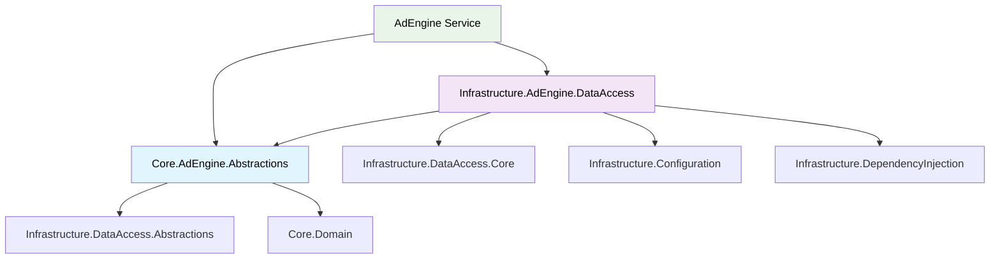
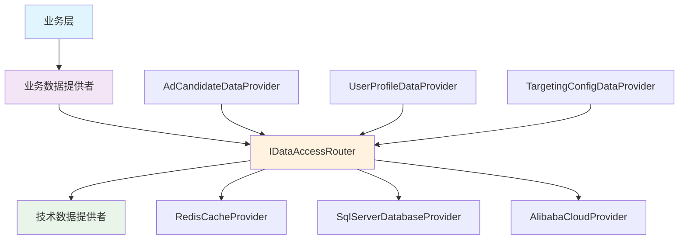

# 广告投放引擎数据访问层技术设计

## 设计概述

广告投放引擎数据访问层是基于系统统一基础设施的业务特化层，专门为广告投放引擎提供高性能数据访问能力。本设计**严格遵循"不重复造轮子"原则**，直接使用已有的数据访问基础设施、配置管理和依赖注入组件，只实现广告投放业务特有的数据提供者。

### 核心设计原则

**基础设施复用原则**：
- **完全基于统一数据访问层**：使用 `Lorn.ADSP.Infrastructure.DataAccess.Core` 的 `BusinessDataProviderBase` 基类
- **完全基于统一配置管理**：使用 `Lorn.ADSP.Infrastructure.Configuration` 的配置基础设施  
- **完全基于统一依赖注入**：使用 `Lorn.ADSP.Infrastructure.DependencyInjection` 的组件发现机制
- **完全基于领域模型设计**：使用 `Lorn.ADSP.Core.Domain` 中定义的所有实体和值对象

**业务特化原则**：
- **单一职责**：数据提供者仅负责纯数据访问，不包含任何业务逻辑
- **领域专用**：针对广告投放业务场景的数据访问优化
- **性能优先**：支持实时竞价场景的毫秒级响应要求
- **缓存优先**：基于广告业务特点的缓存策略优化

### 架构位置和依赖关系

```mermaid
graph TD
    subgraph "现有基础设施（引用使用）"
        A[数据访问层技术设计] --> A1[BusinessDataProviderBase]
        A --> A2[IDataAccessRouter]
        A --> A3[IRepository<T>]
        
        B[统一配置基础设施] --> B1[配置管理]
        B --> B2[配置验证]
        B --> B3[热重载]
        
        C[统一依赖注入] --> C1[组件发现]
        C --> C2[自动注册]
        C --> C3[生命周期管理]
        
        D[领域模型设计] --> D1[实体定义]
        D --> D2[值对象定义]
        D --> D3[聚合根设计]
    end
    
    subgraph "广告引擎数据访问层（本设计范围）"
        E[业务数据提供者] --> E1[AdCandidateDataProvider]
        E --> E2[UserProfileDataProvider]
        E --> E3[TargetingConfigDataProvider]
        
        F[业务特化接口] --> F1[IAdCandidateDataProvider]
        F --> F2[IUserProfileDataProvider]
        F --> F3[ITargetingConfigDataProvider]
        
        G[广告引擎专用配置] --> G1[缓存策略配置]
        G --> G2[性能指标配置]
        G --> G3[路由优化配置]
    end
    
    E1 --> A1
    E2 --> A1
    E3 --> A1
    
    E --> B
    E --> C
    E --> D
    
    style A fill:#e8f5e8
    style B fill:#e8f5e8  
    style C fill:#e8f5e8
    style D fill:#e8f5e8
    style E fill:#fff3e0
    style F fill:#fff3e0
    style G fill:#fff3e0
```


## 1. 项目结构和依赖关系

### 1.1 Visual Studio解决方案中的项目位置

广告投放引擎数据访问层**不创建新的基础设施项目**，而是基于现有项目实现业务特化：

```text
Lorn.ADSP.sln
├── Core/                                          # 核心业务层
│   ├── Lorn.ADSP.Core.Domain/                     # 【引用】领域模型（已存在）
│   │   ├── Entities/                              # 【引用】所有领域实体
│   │   ├── ValueObjects/                          # 【引用】所有值对象
│   │   └── Aggregates/                            # 【引用】所有聚合根
│   │
│   └── Lorn.ADSP.Core.AdEngine.Abstractions/     # 【新建】广告引擎抽象接口
│       ├── Interfaces/                            # 广告引擎特化接口定义
│       │   ├── IAdCandidateDataProvider.cs       # 广告候选数据提供者接口
│       │   ├── IUserProfileDataProvider.cs       # 用户画像数据提供者接口
│       │   └── ITargetingConfigDataProvider.cs   # 定向配置数据提供者接口
│       ├── Models/                                # 请求响应模型
│       │   ├── AdCandidateRequest.cs             # 广告候选查询请求
│       │   ├── UserProfileRequest.cs             # 用户画像查询请求
│       │   └── TargetingConfigRequest.cs         # 定向配置查询请求
│       └── Enums/                                 # 广告引擎专用枚举
│           ├── AdEngineDomain.cs                 # 广告引擎领域枚举
│           └── AdEngineOperation.cs              # 广告引擎操作枚举
│
├── Infrastructure/                                # 基础设施层
│   ├── Lorn.ADSP.Infrastructure.DataAccess.*/    # 【引用】统一数据访问基础设施（已存在）
│   ├── Lorn.ADSP.Infrastructure.Configuration/   # 【引用】统一配置基础设施（已存在）
│   ├── Lorn.ADSP.Infrastructure.DependencyInjection/ # 【引用】统一依赖注入基础设施（已存在）
│   │
│   └── Lorn.ADSP.Infrastructure.AdEngine.DataAccess/ # 【新建】广告引擎数据访问实现
│       ├── Providers/                             # 业务数据提供者实现
│       │   ├── AdCandidateDataProvider.cs        # 继承BusinessDataProviderBase
│       │   ├── UserProfileDataProvider.cs        # 继承BusinessDataProviderBase
│       │   └── TargetingConfigDataProvider.cs    # 继承BusinessDataProviderBase
│       ├── Configuration/                         # 广告引擎专用配置选项
│       │   └── AdEngineDataAccessOptions.cs      # 使用统一配置基础设施
│       └── Extensions/                            # 服务注册扩展
│           └── ServiceCollectionExtensions.cs    # 使用统一依赖注入基础设施
│
└── Services/                                      # 服务层
    └── Lorn.ADSP.AdEngine/                       # 【引用】广告引擎服务（已存在）
```

### 1.2 项目依赖关系



**依赖关系说明**：

- **抽象层**：仅依赖基础设施抽象和领域模型，不依赖具体实现
- **实现层**：依赖抽象层和基础设施核心组件，继承BusinessDataProviderBase
- **服务层**：通过抽象接口使用数据访问能力，不直接依赖实现

### 1.3 基础设施引用说明

**引用的基础设施组件**：

| 基础设施组件               | 引用方式     | 使用场景                     |
| -------------------------- | ------------ | ---------------------------- |
| `BusinessDataProviderBase` | 类继承       | 所有数据提供者的基类         |
| `IDataAccessRouter`        | 构造函数注入 | 自动路由到缓存或数据库       |
| `IRepository<T>`           | 自动注入     | 基类内部访问数据库           |
| `IAdEngineCacheProvider`   | 自动注入     | 基类内部管理缓存             |
| 统一配置基础设施           | 配置约定     | 自动绑定配置选项             |
| 统一依赖注入基础设施       | 特性标记     | 自动发现和注册组件           |
| 领域实体和值对象           | 直接引用     | 作为数据提供者的输入输出类型 |

**不重复实现的组件**：

- ❌ 缓存管理器（使用统一数据访问层的缓存基础设施）
- ❌ 数据库连接池（使用统一数据访问层的连接管理）
- ❌ 配置管理器（使用统一配置基础设施）
- ❌ 健康检查器（使用统一基础设施的健康检查）
- ❌ 监控指标（使用统一基础设施的监控组件）
## 2. 广告引擎特化接口设计

基于现有的 `IDataAccessProvider` 基础接口，广告投放引擎定义业务特化的数据提供者接口。这些接口专注于广告投放业务场景的数据访问需求。

### 2.1 核心业务接口

**位置**：`Lorn.ADSP.Core.AdEngine.Abstractions/Interfaces/`

```csharp
/// <summary>
/// 广告候选数据提供者接口
/// 职责：提供广告候选相关的纯数据访问操作
/// </summary>
public interface IAdCandidateDataProvider : IDataAccessProvider
{
    /// <summary>
    /// 根据广告位ID获取活跃的广告活动列表
    /// 注意：只返回数据库中的原始记录，不进行业务逻辑过滤
    /// </summary>
    Task<List<Campaign>> GetActiveCampaignsByPlacementAsync(string placementId, CancellationToken cancellationToken = default);
    
    /// <summary>
    /// 批量获取广告创意信息
    /// </summary>
    Task<Dictionary<string, List<Creative>>> GetCreativesByCampaignIdsAsync(List<string> campaignIds, CancellationToken cancellationToken = default);
    
    /// <summary>
    /// 批量获取广告位配置信息
    /// </summary>
    Task<Dictionary<string, PlacementConfiguration>> GetPlacementConfigurationsBatchAsync(List<string> placementIds, CancellationToken cancellationToken = default);
}

/// <summary>
/// 用户画像数据提供者接口
/// 职责：提供用户画像相关的纯数据访问操作
/// </summary>
public interface IUserProfileDataProvider : IDataAccessProvider
{
    /// <summary>
    /// 获取用户基础画像信息
    /// </summary>
    Task<UserProfile> GetUserProfileAsync(string userId, CancellationToken cancellationToken = default);
    
    /// <summary>
    /// 批量获取用户画像信息
    /// </summary>
    Task<Dictionary<string, UserProfile>> GetUserProfilesBatchAsync(List<string> userIds, CancellationToken cancellationToken = default);
    
    /// <summary>
    /// 根据设备ID获取关联的用户ID
    /// </summary>
    Task<string> GetUserIdByDeviceAsync(string deviceId, CancellationToken cancellationToken = default);
}

/// <summary>
/// 定向配置数据提供者接口
/// 职责：提供定向配置相关的纯数据访问操作
/// </summary>
public interface ITargetingConfigDataProvider : IDataAccessProvider
{
    /// <summary>
    /// 获取广告活动的定向配置
    /// </summary>
    Task<TargetingConfiguration> GetTargetingConfigurationAsync(string campaignId, CancellationToken cancellationToken = default);
    
    /// <summary>
    /// 批量获取定向配置
    /// </summary>
    Task<Dictionary<string, TargetingConfiguration>> GetTargetingConfigurationsBatchAsync(List<string> campaignIds, CancellationToken cancellationToken = default);
    
    /// <summary>
    /// 获取全局定向规则
    /// </summary>
    Task<List<GlobalTargetingRule>> GetGlobalTargetingRulesAsync(string ruleType, CancellationToken cancellationToken = default);
}
```

### 2.2 基础设施依赖说明

**重要**：广告引擎数据访问层完全基于现有基础设施，不重复实现任何架构组件：

| 基础设施组件               | 引用位置                             | 使用方式                             |
| -------------------------- | ------------------------------------ | ------------------------------------ |
| `BusinessDataProviderBase` | `Infrastructure.DataAccess.Core`     | 继承基类，获得完整数据访问能力       |
| `IDataAccessRouter`        | `Infrastructure.DataAccess.Core`     | 自动注入，处理缓存和数据库路由       |
| `IRepository<T>`           | `Infrastructure.DataAccess.Core`     | 自动注入，提供数据库访问能力         |
| 统一缓存基础设施           | `Infrastructure.DataAccess.*`        | 基类自动处理多级缓存逻辑             |
| 统一配置基础设施           | `Infrastructure.Configuration`       | 使用配置约定自动绑定配置选项         |
| 统一依赖注入基础设施       | `Infrastructure.DependencyInjection` | 使用特性标记自动发现和注册组件       |
| 领域实体和值对象           | `Core.Domain.Entities`               | 直接引用，作为数据访问的输入输出类型 |

**架构透明性**：

- **缓存策略**：完全由 `IDataAccessRouter` 和基类处理，业务层无感知
- **路由决策**：统一基础设施根据配置自动选择最优数据源
- **性能监控**：基类自动记录所有性能指标和访问统计
- **故障处理**：统一的重试、熔断和降级策略

## 3. 数据提供者实现指导

### 3.1 基于 BusinessDataProviderBase 的实现模式

所有广告引擎数据提供者都必须继承统一数据访问层的 `BusinessDataProviderBase` 基类，该基类已经处理了：

- **缓存优先逻辑**：自动实现缓存查询→数据库查询→缓存回写的完整流程
- **路由决策处理**：通过 `IDataAccessRouter` 自动选择合适的技术提供者
- **异常处理机制**：统一的错误处理、重试和降级策略
- **性能监控**：自动记录性能指标和访问统计

### 3.2 实现样例

**AdCandidateDataProvider 实现样例**：

```csharp
[Component(ConfigurationSection = "DataProviders:AdCandidate")]
public class AdCandidateDataProvider : BusinessDataProviderBase, IAdCandidateDataProvider
{
    public AdCandidateDataProvider(ILogger<AdCandidateDataProvider> logger, IDataAccessRouter router)
        : base(logger, router)
    {
    }

    protected override DataProviderMetadata CreateMetadata()
    {
        return new DataProviderMetadata
        {
            ProviderId = "AdCandidateDataProvider_v1.0",
            ProviderName = "广告候选数据提供者",
            ProviderType = DataProviderType.BusinessLogic,
            BusinessEntity = "AdCandidate",
            SupportedOperations = new[] { "GetCandidates", "BatchQuery" },
            Priority = 100
        };
    }

    public async Task<List<Campaign>> GetActiveCampaignsByPlacementAsync(
        string placementId, CancellationToken cancellationToken = default)
    {
        var context = new DataAccessContext
        {
            OperationType = "GetActiveCampaignsByPlacement",
            EntityType = "Campaign",
            Parameters = new Dictionary<string, object> { ["PlacementId"] = placementId }
        };

        // 基类自动处理：缓存查询→数据库查询→缓存回写
        return await GetAsync<List<Campaign>>(context, cancellationToken) ?? new List<Campaign>();
    }

    // 其他接口方法实现...
}
```

### 3.3 配置和注册

**配置选项**（使用统一配置基础设施）：

```json
{
  "DataProviders": {
    "AdCandidate": {
      "TimeoutMs": 5,
      "MaxBatchSize": 50,
      "CacheSettings": {
        "DefaultTTL": "00:05:00"
      }
    },
    "UserProfile": {
      "TimeoutMs": 20,
      "CacheSettings": {
        "DefaultTTL": "01:00:00"
      }
    },
    "TargetingConfig": {
      "TimeoutMs": 30,
      "CacheSettings": {
        "DefaultTTL": "04:00:00"
      }
    }
  }
}
```

**服务注册**（使用统一依赖注入基础设施）：

```csharp
public static class ServiceCollectionExtensions
{
    public static IServiceCollection AddAdEngineDataAccess(
        this IServiceCollection services, IConfiguration configuration)
    {
        // 广告引擎数据提供者（基于统一配置约定自动发现和注册）
        services.AddScoped<IAdCandidateDataProvider, AdCandidateDataProvider>();
        services.AddScoped<IUserProfileDataProvider, UserProfileDataProvider>();
        services.AddScoped<ITargetingConfigDataProvider, TargetingConfigDataProvider>();
        
        return services;
    }
}
```

### 3.4 职责边界

**✅ 数据提供者应该做的**：

- 纯数据访问操作（CRUD）
- 数据格式转换（存储格式→领域模型）
- 基本的数据验证（非空、格式等）

**❌ 数据提供者禁止做的**：

- 业务逻辑计算（定向匹配、竞价等）
- 复杂数据过滤（应由策略层处理）
- 手动缓存管理（基类已处理）
- 手动路由决策（基类已处理）

### 3.5 实现要点总结

**基于 BusinessDataProviderBase 的关键实现要点**：

1. **构造函数模式**：继承基类，注入 `ILogger` 和 `IDataAccessRouter`
2. **元数据实现**：必须实现 `CreateMetadata()` 方法提供提供者信息
3. **业务方法实现**：构建 `DataAccessContext`，调用基类 `GetAsync<T>()` 方法
4. **职责边界**：只负责数据访问，不实现业务逻辑
5. **基础设施透明**：基类自动处理缓存、路由、错误处理等

### 3.6 技术数据提供者设计说明

**重要说明**：技术数据提供者（如 Redis 缓存提供者、SQL Server 数据库提供者）的实现应该基于统一数据访问层技术设计中的标准实现，不需要在广告引擎中重复实现。

**技术提供者的职责**：

- **RedisCacheProvider**：实现 `IDataAccessProvider` 接口，提供纯粹的缓存访问能力
- **SqlServerDatabaseProvider**：实现 `IDataAccessProvider` 接口，提供纯粹的数据库访问能力
- **路由决策**：由 `IDataAccessRouter` 根据配置决定使用哪个技术提供者

**架构分层清晰性**：



## 4. 广告引擎专用优化

### 4.1 预测性缓存预热

针对广告投放业务的特殊性，实现预测性缓存预热服务：

```csharp
public class PredictiveCacheWarmupService : IHostedService
{
    public async Task StartAsync(CancellationToken cancellationToken)
    {
        // 1. 分析历史访问模式
        var accessPatterns = await _analyticsService.GetAccessPatternsAsync(
            DateTime.UtcNow.AddDays(-7), 
            DateTime.UtcNow, 
            cancellationToken);
        
        // 2. 预测热点数据
        var hotDataPredictions = _predictionEngine.PredictHotData(accessPatterns);
        
        // 3. 预热缓存
        foreach (var prediction in hotDataPredictions)
        {
            await WarmupCacheForPredictionAsync(prediction, cancellationToken);
        }
    }
    
    private async Task WarmupCacheForPredictionAsync(
        HotDataPrediction prediction, 
        CancellationToken cancellationToken)
    {
        switch (prediction.DataType)
        {
            case "AdCandidate":
                await _adCandidateProvider.WarmupCandidateCacheAsync(
                    prediction.Keys, cancellationToken);
                break;
                
            case "UserProfile":
                await _userProfileProvider.WarmupUserProfileCacheAsync(
                    prediction.Keys, cancellationToken);
                break;
                
            case "TargetingConfig":
                await _targetingConfigProvider.WarmupTargetingConfigCacheAsync(
                    prediction.Keys, cancellationToken);
                break;
        }
    }
}
```

### 4.2 智能批量聚合

```csharp
public class BatchOperationOptimizer
{
    private readonly ConcurrentDictionary<string, BatchRequest> _pendingBatches = new();
    
    public async Task<T> ExecuteWithBatchingAsync<T>(
        string batchKey,
        Func<List<object>, Task<Dictionary<object, T>>> batchExecutor,
        object request,
        TimeSpan maxWaitTime)
    {
        var batch = _pendingBatches.GetOrAdd(batchKey, key => new BatchRequest
        {
            BatchKey = key,
            MaxWaitTime = maxWaitTime,
            BatchExecutor = async requests => 
            {
                var typedRequests = requests.Cast<object>().ToList();
                var results = await batchExecutor(typedRequests);
                return results.ToDictionary(kv => kv.Key, kv => (object)kv.Value);
            }
        });
        
        return await batch.AddRequestAsync<T>(request);
    }
}
```

## 5. 配置和部署

### 5.1 完整配置示例

**重要说明**：配置示例基于统一配置基础设施，只展示广告引擎特有的配置部分。

```json
{
  "DataProviders": {
    "AdCandidate": {
      "TimeoutMs": 5,
      "MaxBatchSize": 50,
      "CacheSettings": {
        "DefaultTTL": "00:05:00"
      }
    },
    "UserProfile": {
      "TimeoutMs": 20,
      "CacheSettings": {
        "DefaultTTL": "01:00:00"
      },
      "PrivacyMode": {
        "Enabled": true,
        "DataMasking": true,
        "AutoExpiration": true
      }
    },
    "TargetingConfig": {
      "TimeoutMs": 30,
      "CacheSettings": {
        "DefaultTTL": "04:00:00"
      }
    }
  }
}
```

### 5.2 依赖注入配置

**使用统一依赖注入基础设施**：

```csharp
public static class ServiceCollectionExtensions
{
    public static IServiceCollection AddAdEngineDataAccess(
        this IServiceCollection services, IConfiguration configuration)
    {
        // 广告引擎数据提供者（基于统一配置约定自动发现和注册）
        services.AddScoped<IAdCandidateDataProvider, AdCandidateDataProvider>();
        services.AddScoped<IUserProfileDataProvider, UserProfileDataProvider>();
        services.AddScoped<ITargetingConfigDataProvider, TargetingConfigDataProvider>();
        
        return services;
    }
}
```

## 6. 总结

### 6.1 架构优势

1. **完全复用基础设施**：基于统一数据访问层的 `BusinessDataProviderBase` 基类
2. **零重复实现**：所有缓存、路由、监控功能由基础设施自动提供
3. **业务专注性**：数据提供者只关注业务数据访问，不关心技术细节
4. **架构一致性**：与系统统一配置和依赖注入架构完全兼容

### 6.2 关键特性

- **基础设施透明**：开发者无需关心缓存和路由的技术实现
- **配置驱动**：通过配置文件控制所有数据访问行为
- **自动发现**：基于约定的组件自动注册和发现
- **性能保障**：基类自动提供性能监控和优化

### 6.3 实现指导

| 实现步骤   | 具体内容                               | 注意事项                           |
| ---------- | -------------------------------------- | ---------------------------------- |
| 接口定义   | 在 `Core.AdEngine.Abstractions` 中定义 | 只定义接口，不定义实体类           |
| 数据提供者 | 继承 `BusinessDataProviderBase`        | 专注业务逻辑，不实现基础设施       |
| 配置文件   | 添加 `DataProviders` 配置节            | 使用统一配置基础设施的约定         |
| 服务注册   | 调用扩展方法注册服务                   | 基于统一依赖注入基础设施的自动发现 |

这个广告投放引擎数据访问层设计严格遵循"不重复造轮子"原则，充分利用系统现有的统一基础设施，为广告投放引擎提供了专业化且高效的数据访问能力。
