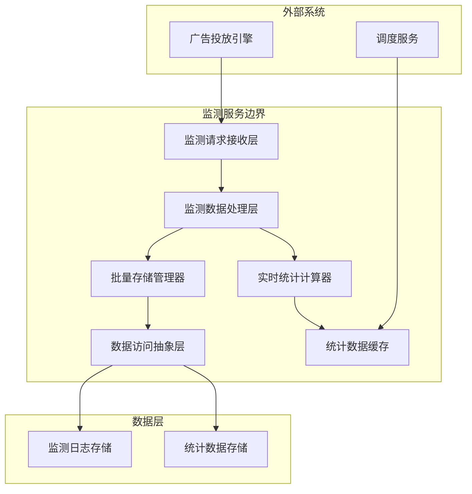
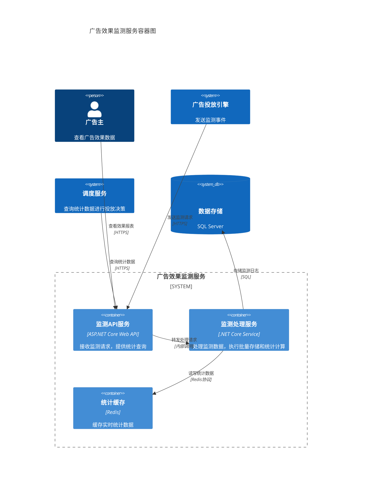
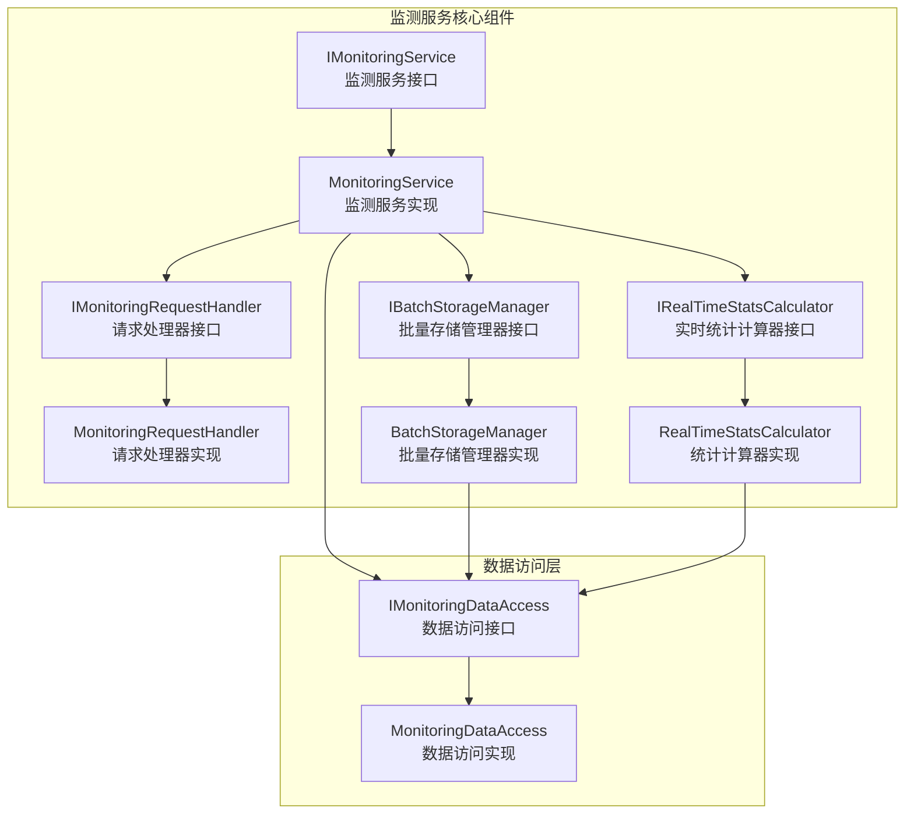
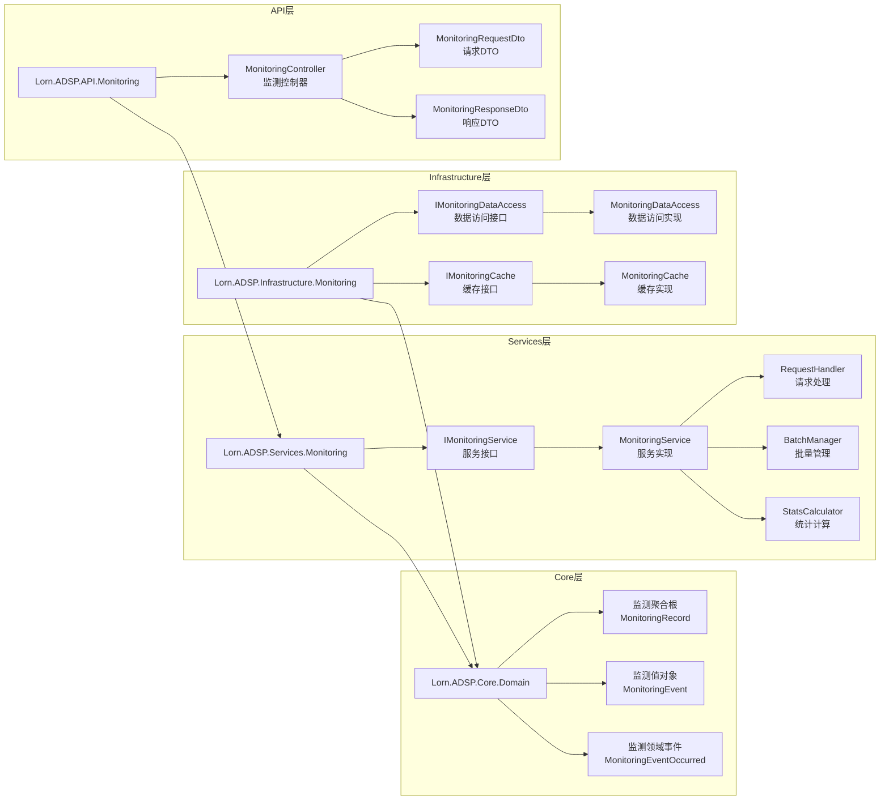
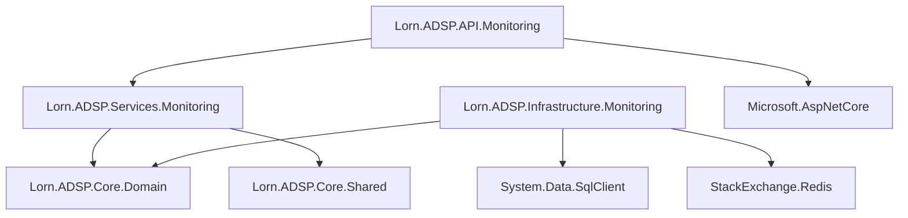
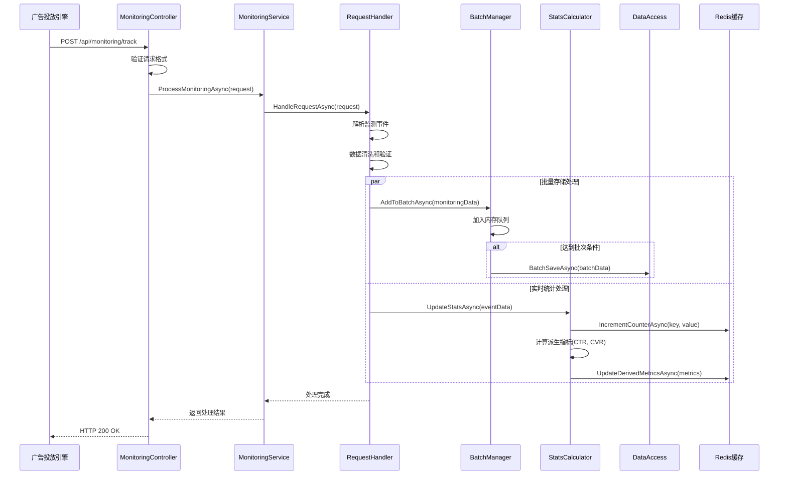
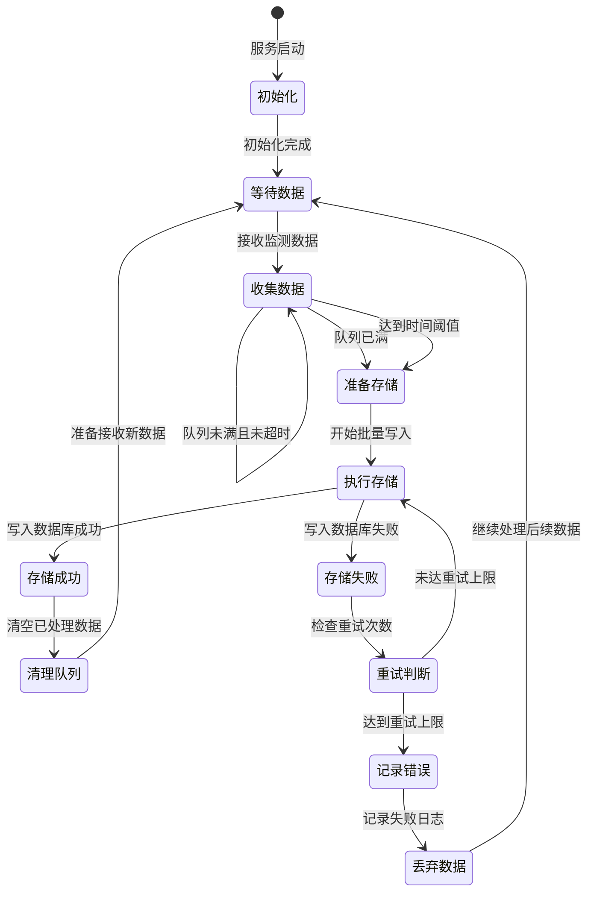
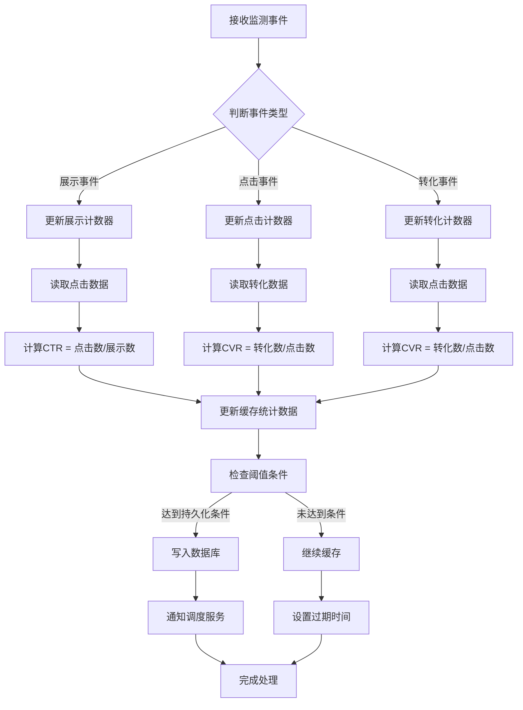
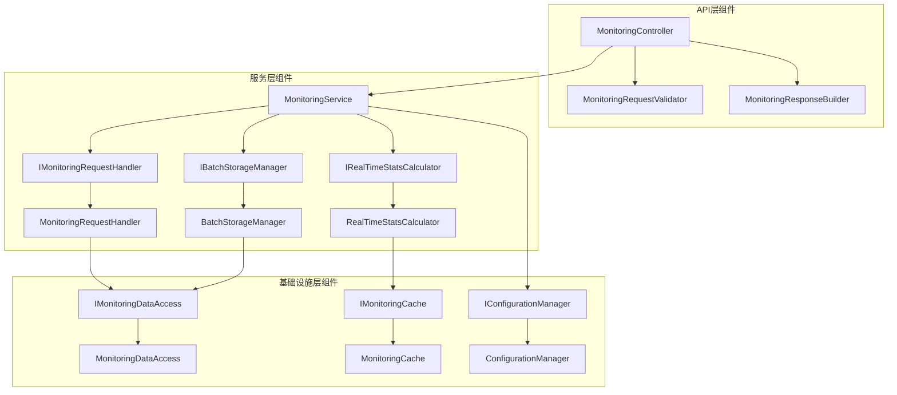

# 广告效果监测服务技术设计

## 1. 系统概述

广告效果监测服务是广告投放引擎的重要组成部分，负责处理广告展示、点击等监测事件的收集、存储和统计。本服务遵循系统解耦设计原则，通过抽象层与数据库解耦，确保系统的可维护性和可扩展性。

### 1.1 核心功能

- 监测请求接收和处理
- 监测日志批次化存储
- 数据统计计算
- 为调度服务提供统计数据

### 1.2 设计原则

- 高性能：支持高并发监测请求处理
- 可扩展：支持不同类型监测事件扩展
- 解耦设计：通过抽象层与数据库解耦
- 批量处理：提高存储效率

## 2. 系统架构设计

### 2.1 整体架构

- **核心功能**：监测数据接收、验证、批次存储、实时统计计算
- **接口提供**：为调度服务提供统计数据查询接口
- **边界外功能**：不包含监测数据的深度分析、报表生成、业务智能等高级功能

### 2.2 系统架构图(C4 Model - 容器视图)

### 2.3 核心组件设计

## 3. Visual Studio项目架构映射

### 3.1 项目结构设计

### 3.2 项目依赖关系

## 4. 核心模块设计

### 4.1 监测请求处理序列图

### 4.2 批量存储状态图

### 4.3 统计数据计算流程图

### 4.4 组件关系图

## 5. 开发实现指导

### 5.1 监测服务主接口设计

**项目位置**: `Lorn.ADSP.Services.Monitoring`

**接口职责**: 定义监测服务的核心功能契约

**接口设计要求**:

- 接口名称: `IMonitoringService`
- 继承自: `IService` (基础服务接口)
- 生命周期: Scoped (请求级别)

**方法签名设计**:

- `ProcessMonitoringRequestAsync`: 处理监测请求
  - 输入参数: MonitoringRequestDto (包含事件类型、广告ID、时间戳、用户标识等)
  - 返回类型: Task\<MonitoringResponseDto\>
  - 异常处理: 抛出 MonitoringException 业务异常

- `GetStatisticsAsync`: 获取统计数据
  - 输入参数: StatisticsQueryDto (查询条件、时间范围、维度等)
  - 返回类型: Task\<StatisticsResultDto\>
  - 支持分页和排序

- `GetRealTimeStatsAsync`: 获取实时统计
  - 输入参数: string[] adIds (广告ID列表)
  - 返回类型: Task\<Dictionary\<string, RealTimeStatsDto\>\>
  - 从缓存读取数据

### 5.2 监测请求处理器设计

**项目位置**: `Lorn.ADSP.Services.Monitoring`

**类职责**: 处理和验证监测请求数据

**设计要求**:

- 类名称: `MonitoringRequestHandler`
- 实现接口: `IMonitoringRequestHandler`
- 依赖注入: `ILogger<MonitoringRequestHandler>`, `IValidationService`

**核心方法设计**:

- `HandleRequestAsync`: 主处理方法
  - 验证请求参数完整性和有效性
  - 解析监测事件类型和业务数据
  - 进行数据清洗和标准化处理
  - 创建监测领域对象

**数据验证规则**:

- 广告ID: 必填，格式验证，存在性检查
- 时间戳: 必填，范围验证(不能超过当前时间24小时)
- 事件类型: 必填，枚举值验证
- 用户标识: 选填，格式验证

### 5.3 批量存储管理器设计

**项目位置**: `Lorn.ADSP.Services.Monitoring`

**类职责**: 管理监测数据的批量存储逻辑

**设计要求**:

- 类名称: `BatchStorageManager`
- 实现接口: `IBatchStorageManager`
- 生命周期: Singleton (单例模式)
- 线程安全: 使用 ConcurrentQueue 和锁机制

**核心功能设计**:

- 内存队列管理: 使用 `ConcurrentQueue<MonitoringLogEntity>` 存储待处理数据
- 批次控制: 支持按数量和时间两种触发条件
- 异步处理: 使用 `Task.Run` 或 `BackgroundService` 实现后台处理
- 重试机制: 实现指数退避重试策略

**配置参数设计**:

- `BatchSize`: 批次大小 (默认: 1000)
- `FlushIntervalSeconds`: 刷新间隔秒数 (默认: 30)
- `MaxRetryCount`: 最大重试次数 (默认: 3)
- `RetryDelaySeconds`: 重试延迟秒数 (默认: 5)

**状态监控设计**:

- 队列当前大小统计
- 处理成功/失败计数器
- 平均处理时间统计
- 错误率监控指标

### 5.4 实时统计计算器设计

**项目位置**: `Lorn.ADSP.Services.Monitoring`

**类职责**: 实时计算和维护广告统计指标

**设计要求**:

- 类名称: `RealTimeStatsCalculator`
- 实现接口: `IRealTimeStatsCalculator`
- 依赖注入: `IMonitoringCache`, `ILogger<RealTimeStatsCalculator>`

**统计维度设计**:

- 广告维度: 按 AdId 聚合统计
- 时间维度: 支持小时、天、周、月级别
- 地域维度: 按地理位置聚合
- 设备维度: 按设备类型聚合

**核心指标计算**:

- 基础指标: 展示数 (Impressions)、点击数 (Clicks)、转化数 (Conversions)
- 派生指标: CTR (点击率)、CVR (转化率)、CPC (点击成本)、CPM (千次展示成本)
- 实时更新: 使用 Redis 的原子操作保证数据一致性

**缓存策略设计**:

- 缓存键命名规范: `stats:{dimension}:{period}:{id}`
- 过期时间设置: 实时数据1小时，历史数据24小时
- 数据同步机制: 定期将缓存数据持久化到数据库

### 5.5 数据访问抽象层设计

**接口定义项目**: `Lorn.ADSP.Core.Domain`
**实现项目**: `Lorn.ADSP.Infrastructure.Monitoring`

**接口设计**: `IMonitoringDataAccess`

- 继承自: `IRepository<MonitoringRecord>`
- 职责范围: 监测数据的持久化操作

**核心方法设计**:

- `BatchSaveMonitoringLogsAsync`: 批量保存监测日志
  - 参数: `IEnumerable<MonitoringLogEntity> logs`
  - 返回: `Task<bool>` (操作是否成功)
  - 事务控制: 使用数据库事务确保数据一致性

- `GetStatisticsByConditionAsync`: 条件查询统计数据
  - 参数: `StatisticsQueryCondition condition`
  - 返回: `Task<IEnumerable<StatisticsEntity>>`
  - 性能要求: 支持索引优化和分页查询

- `UpdateStatisticsBatchAsync`: 批量更新统计数据
  - 参数: `IEnumerable<StatisticsUpdateDto> updates`
  - 返回: `Task<int>` (更新记录数)
  - 支持乐观锁并发控制

**实现设计要求**:

- 连接管理: 使用连接池，避免连接泄漏
- 异常处理: 统一包装数据访问异常
- 性能监控: 记录查询执行时间和性能指标
- 数据库兼容: 支持 SQL Server、MySQL 等多种数据库

### 5.6 监测API控制器设计

**项目位置**: `Lorn.ADSP.API.Monitoring`

**类职责**: 提供监测相关的HTTP API接口

**设计要求**:

- 类名称: `MonitoringController`
- 继承自: `ApiControllerBase`
- 路由前缀: `[Route("api/[controller]")]`

**API接口设计**:

- `POST /api/monitoring/track`: 接收监测事件
  - 请求体: `MonitoringRequestDto`
  - 响应: `MonitoringResponseDto`
  - HTTP状态码: 200成功, 400请求错误, 500服务器错误

- `GET /api/monitoring/stats`: 查询统计数据
  - 查询参数: adId, startTime, endTime, dimension
  - 响应: `StatisticsResultDto`
  - 支持缓存控制头

- `GET /api/monitoring/realtime/{adId}`: 获取实时统计
  - 路径参数: adId (广告ID)
  - 响应: `RealTimeStatsDto`
  - 缓存策略: 30秒缓存

**错误处理设计**:

- 统一异常处理: 使用全局异常过滤器
- 错误响应格式: 标准化错误响应DTO
- 日志记录: 记录所有异常和错误信息

### 5.7 配置管理设计

**项目位置**: `Lorn.ADSP.Services.Monitoring`

**配置类设计**:

- `MonitoringServiceOptions`: 监测服务配置选项
- `BatchProcessingOptions`: 批处理配置选项
- `CacheOptions`: 缓存配置选项

**配置来源**:

- appsettings.json: 基础配置
- 环境变量: 环境特定配置
- Azure Key Vault: 敏感配置信息

**配置验证**:

- 使用 DataAnnotations 进行配置验证
- 服务启动时验证配置完整性
- 提供配置错误的详细提示信息

## 6. 性能和可靠性设计

### 6.1 性能优化策略

**批量处理优化**:

- 内存缓冲区设计: 使用环形缓冲区提高内存利用率
- 异步I/O操作: 所有数据库和缓存操作使用异步模式
- 连接池管理: 合理配置数据库连接池大小

**缓存策略设计**:

- 多级缓存: L1本地缓存 + L2分布式缓存
- 缓存更新策略: Write-Through 和 Write-Behind 混合模式
- 缓存预热: 系统启动时预加载热点数据

**数据库优化**:

- 索引设计: 为查询字段创建合适的索引
- 分区策略: 按时间维度对大表进行分区
- 读写分离: 查询操作使用只读副本

### 6.2 可靠性保障设计

**数据一致性**:

- 事务管理: 使用分布式事务确保跨系统数据一致性
- 幂等性设计: 支持请求重复处理的幂等性
- 数据校验: 多层数据验证确保数据质量

**错误处理策略**:

- 重试机制: 指数退避重试算法
- 熔断器模式: 防止级联故障
- 降级策略: 在系统压力下提供基础功能

**监控和告警**:

- 健康检查: 实现 IHealthCheck 接口
- 性能监控: 集成 Application Insights
- 业务监控: 关键业务指标实时监控

## 7. 扩展性设计

### 7.1 监测事件类型扩展

**扩展机制设计**:

- 事件类型枚举: 支持动态添加新的事件类型
- 处理器注册: 使用工厂模式注册不同类型的事件处理器
- 数据结构扩展: 支持自定义事件属性和扩展字段

**新事件类型支持**:

- 视频播放事件: 播放开始、暂停、完成等
- 交互事件: hover、滚动、停留等用户行为
- 转化事件: 注册、购买、下载等业务转化

### 7.2 存储后端扩展

**抽象设计**:

- 存储提供程序接口: `IStorageProvider`
- 配置驱动: 通过配置切换不同存储后端
- 插件架构: 支持第三方存储插件

**支持的存储类型**:

- 关系型数据库: SQL Server、MySQL、PostgreSQL
- NoSQL数据库: MongoDB、CosmosDB
- 时序数据库: InfluxDB、TimescaleDB
- 对象存储: Azure Blob Storage、AWS S3

### 7.3 计算引擎扩展

**计算框架集成**:

- 流处理框架: Apache Kafka、Azure Event Hubs
- 批处理框架: Apache Spark、Azure Data Factory
- 机器学习: ML.NET、Azure Machine Learning

**扩展点设计**:

- 计算任务调度: 支持定时和事件驱动的计算任务
- 自定义指标: 允许业务方定义专有的统计指标
- 数据导出: 支持将计算结果导出到不同的目标系统

这份技术设计文档为广告效果监测服务提供了完整的技术架构指导，确保开发团队能够实现高性能、高可用的监测服务系统。所有设计都严格遵循.NET最佳实践和现代软件架构原则。
