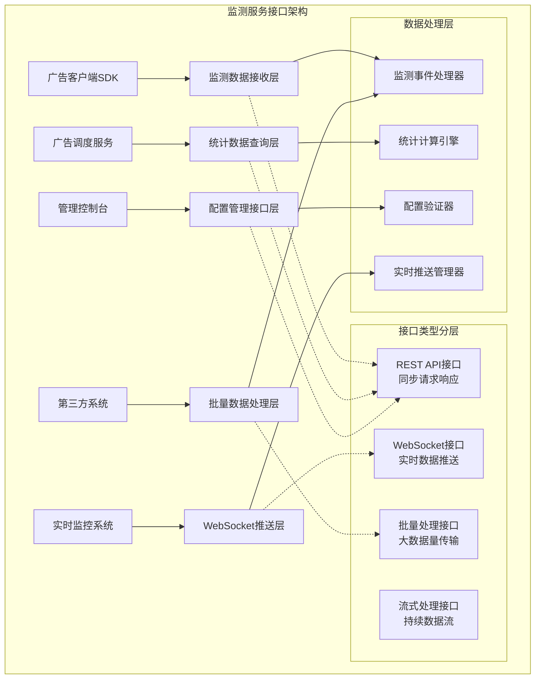
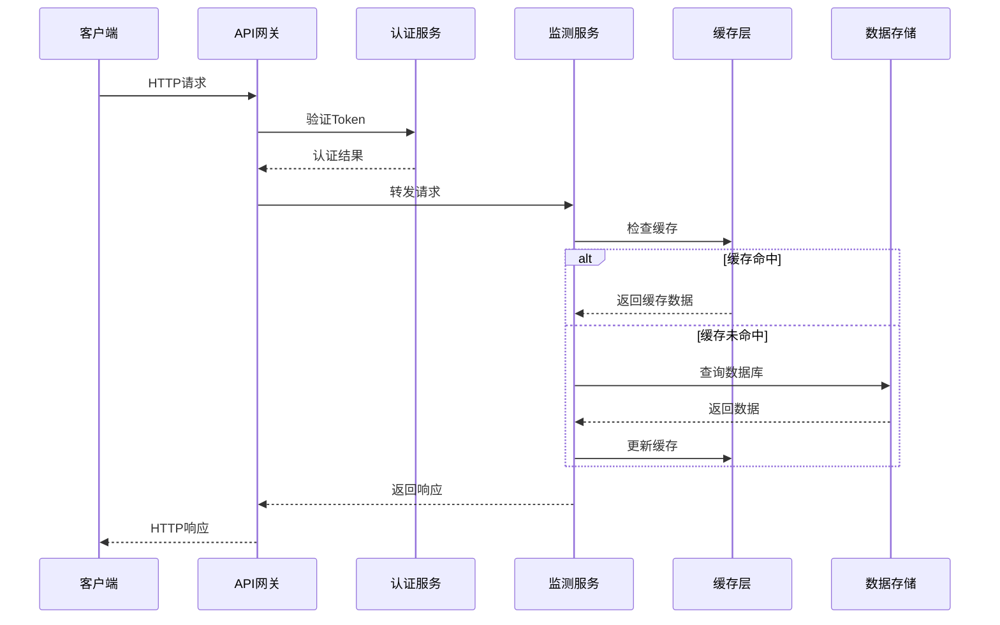
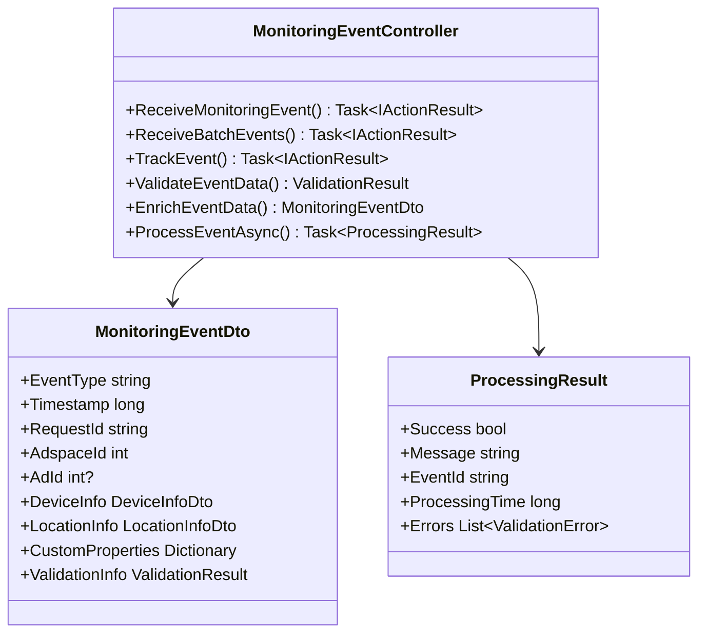
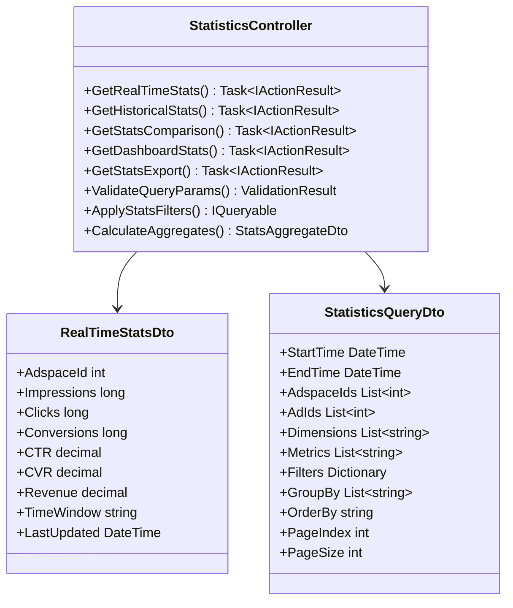
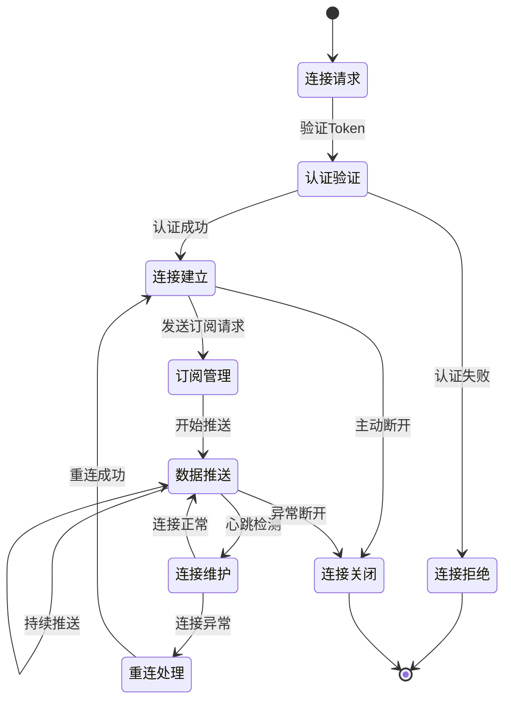
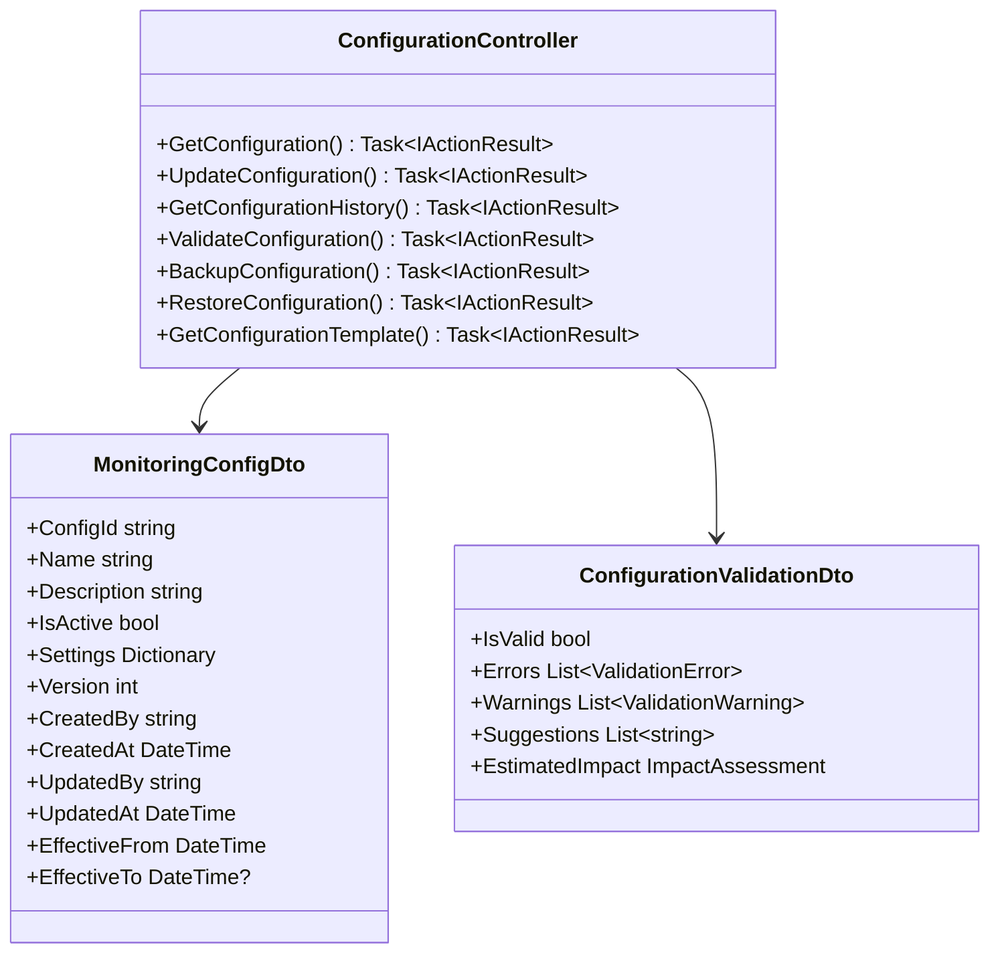
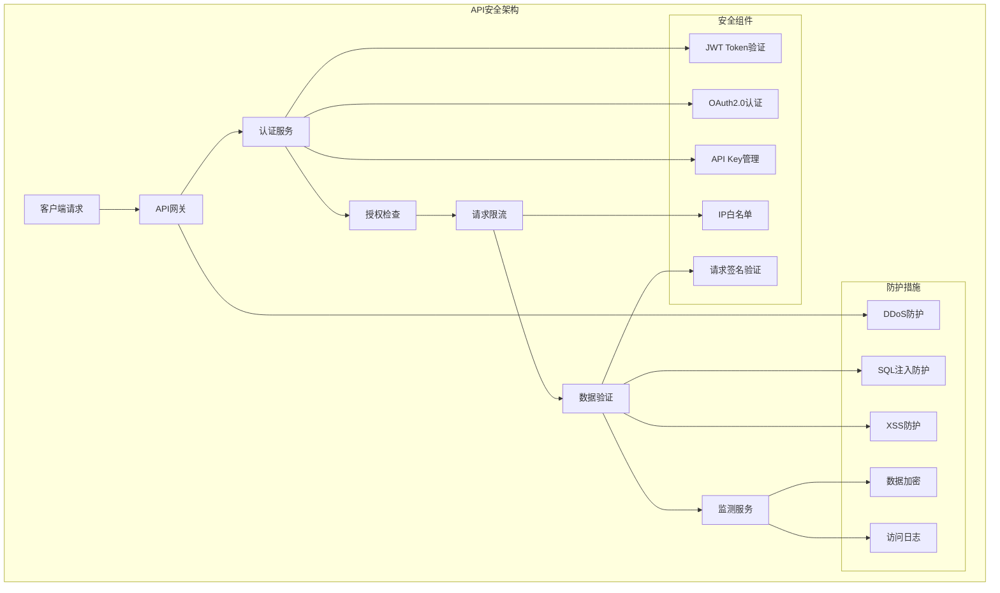

# 广告效果监测服务接口设计

## 设计概述

广告效果监测服务接口设计定义了监测数据接收、统计数据查询和管理配置的完整API接口规范。设计遵循RESTful API设计原则，支持HTTP/HTTPS协议、WebSocket实时推送和批量处理接口，为广告客户端、调度服务和管理平台提供高性能、高可用的监测服务接口。

## 接口架构设计

### 整体接口架构



### 接口服务时序设计



## 监测数据接收接口设计

### 单条监测数据接收接口



**接口规范**：

`POST /api/monitoring/track`

**功能描述**：

- 接收单条监测事件数据，支持完整的JSON格式数据传输
- 提供实时数据验证和处理结果反馈
- 支持多种监测事件类型的统一处理接口

**请求规范**：

- `Content-Type`: application/json
- `Authorization`: Bearer {token}
- 请求体大小限制: 最大1MB
- 超时设置: 30秒

**请求参数设计**：

1. **核心事件信息**:
   - `eventType`: 监测事件类型(impression/click/conversion等)
   - `timestamp`: 事件发生时间戳(Unix时间戳，毫秒级)
   - `requestId`: 请求唯一标识符，用于幂等性控制
   - `adspaceId`: 广告位标识符，必填字段
   - `adId`: 广告标识符，展示事件时必填

2. **上下文信息**:
   - `deviceInfo`: 设备信息对象，包含设备类型、操作系统等
   - `locationInfo`: 位置信息对象，包含地理位置和网络信息
   - `customProperties`: 自定义属性字典，支持业务扩展

3. **质量控制信息**:
   - `validationInfo`: 客户端验证信息
   - `dataQuality`: 数据质量评分

**响应设计**：

1. **成功响应（200 OK）**:

```json
{
  "success": true,
  "message": "Event processed successfully",
  "data": {
    "eventId": "evt_1234567890",
    "processingTime": 25,
    "status": "processed"
  },
  "timestamp": 1640995200000
}
```

1. **验证失败响应（400 Bad Request）**:

```json
{
  "success": false,
  "message": "Validation failed",
  "errors": [
    {
      "field": "eventType",
      "code": "INVALID_VALUE",
      "message": "Event type must be one of: impression, click, conversion"
    }
  ],
  "timestamp": 1640995200000
}
```

1. **服务器错误响应（500 Internal Server Error）**:

```json
{
  "success": false,
  "message": "Internal server error",
  "errorCode": "PROCESSING_ERROR",
  "correlationId": "req_1234567890",
  "timestamp": 1640995200000
}
```

### 批量监测数据接收接口

**接口规范**：

`POST /api/monitoring/batch`

**功能描述**：

- 支持大批量监测事件数据的高效传输
- 提供批量数据验证和处理策略
- 支持部分成功处理和错误反馈机制

**批量处理策略**：

1. **数据验证策略**:
   - 单条验证失败不影响其他数据处理
   - 提供验证失败数据的详细错误信息
   - 支持验证失败数据的重试机制

2. **性能优化策略**:
   - 异步批量写入数据库
   - 并行验证处理
   - 内存批次缓冲区管理

3. **错误处理策略**:
   - 验证错误：返回具体错误信息
   - 处理错误：记录错误日志并返回错误标识
   - 系统错误：返回统一错误响应

**请求体设计**：

```json
{
  "batchId": "batch_1234567890",
  "events": [
    {
      "eventType": "impression",
      "timestamp": 1640995200000,
      "requestId": "req_001",
      "adspaceId": 12345,
      "adId": 67890,
      "deviceInfo": {
        "deviceType": "mobile",
        "osName": "iOS",
        "browserName": "Safari"
      },
      "locationInfo": {
        "country": "CN",
        "region": "Beijing",
        "city": "Beijing"
      }
    }
  ],
  "processingOptions": {
    "validateOnly": false,
    "continueOnError": true,
    "maxProcessingTime": 60000
  }
}
```

### GET方式监测数据接收接口

**接口规范**：

`GET /api/monitoring/pixel`

**功能描述**：

- 支持通过GET请求进行监测数据收集
- 主要用于跨域监测和简单事件追踪
- 提供图片响应模式，适用于Web页面嵌入

**请求参数设计**：

1. **必填参数**:
   - `et`: 事件类型(event_type简写)
   - `ts`: 时间戳
   - `aid`: 广告位ID
   - `rid`: 请求ID

2. **可选参数**:
   - `ad`: 广告ID
   - `dt`: 设备类型
   - `os`: 操作系统
   - `br`: 浏览器类型
   - `ip`: IP地址(通常从请求头获取)

**响应设计**：

- 返回1x1透明像素GIF图片
- HTTP状态码200表示处理成功
- 设置适当的缓存控制头
- 响应时间要求 < 50ms

**使用示例**：

```html

```

## 统计数据查询接口设计

### 实时统计数据查询接口



**接口规范**：

`GET /api/statistics/realtime/{adspaceId}`

**功能描述**：

- 提供广告位级别的实时统计数据查询
- 支持多种时间窗口的实时数据聚合
- 提供缓存优化的高性能查询响应

**查询参数设计**：

1. **时间参数**:
   - `time_window` (可选): 时间窗口类型（minute/hour/day），默认hour
   - `timezone` (可选): 时区设置，默认UTC

2. **过滤参数**:
   - `ad_ids` (可选): 广告ID列表，逗号分隔
   - `device_types` (可选): 设备类型过滤
   - `include_metrics` (可选): 包含的指标列表

3. **格式参数**:
   - `format` (可选): 响应格式(json/xml)，默认json
   - `locale` (可选): 本地化设置

**响应数据结构**：

```json
{
  "success": true,
  "data": {
    "adspaceId": 12345,
    "timeWindow": "hour",
    "periodStart": "2024-01-15T10:00:00Z",
    "periodEnd": "2024-01-15T11:00:00Z",
    "metrics": {
      "impressions": 15420,
      "clicks": 234,
      "conversions": 18,
      "ctr": 1.52,
      "cvr": 7.69,
      "revenue": 450.75,
      "ecpm": 29.23
    },
    "breakdown": [
      {
        "dimension": "device_type",
        "values": [
          {
            "name": "mobile",
            "impressions": 10234,
            "clicks": 167,
            "conversions": 12
          },
          {
            "name": "desktop",
            "impressions": 5186,
            "clicks": 67,
            "conversions": 6
          }
        ]
      }
    ],
    "lastUpdated": "2024-01-15T10:55:30Z"
  },
  "cache": {
    "hit": true,
    "ttl": 300,
    "nextUpdate": "2024-01-15T11:00:00Z"
  }
}
```

### 历史统计数据查询接口

**接口规范**：

`POST /api/statistics/query`

**功能描述**：

- 提供历史统计数据的复杂查询功能
- 支持多维度数据聚合和对比分析
- 提供灵活的查询条件和结果格式化

**查询请求设计**：

1. **时间范围查询**:
   - 支持绝对时间和相对时间查询
   - 支持多个时间段对比查询
   - 提供预设时间段快捷选择

2. **维度和指标选择**:
   - 支持动态维度组合查询
   - 支持计算字段和自定义指标
   - 提供指标聚合方式选择

3. **过滤和排序**:
   - 支持复杂过滤条件组合
   - 支持多字段排序
   - 提供结果分页和限制

**请求体示例**：

```json
{
  "timeRange": {
    "start": "2024-01-01T00:00:00Z",
    "end": "2024-01-31T23:59:59Z",
    "granularity": "day"
  },
  "dimensions": ["adspace_id", "device_type", "country"],
  "metrics": ["impressions", "clicks", "conversions", "revenue"],
  "filters": [
    {
      "field": "adspace_id",
      "operator": "in",
      "values": [12345, 12346, 12347]
    },
    {
      "field": "impressions",
      "operator": "gte",
      "value": 100
    }
  ],
  "groupBy": ["adspace_id", "device_type"],
  "orderBy": [
    {
      "field": "impressions",
      "direction": "desc"
    }
  ],
  "pagination": {
    "pageIndex": 0,
    "pageSize": 100
  },
  "options": {
    "includeZeroValues": false,
    "calculateTotals": true,
    "format": "detailed"
  }
}
```

## WebSocket实时推送接口设计

### WebSocket连接管理



**接口规范**：

`WS /api/realtime/subscribe`

**功能描述**：

- 提供实时统计数据的推送服务
- 支持多种订阅模式和数据过滤
- 提供连接状态管理和自动重连机制

**连接建立流程**：

1. **订阅创建**:
   - 客户端发送WebSocket连接请求
   - 服务端验证认证Token
   - 建立连接并返回连接确认

2. **订阅配置**:
   - 客户端发送订阅配置消息
   - 指定订阅的数据类型和过滤条件
   - 服务端确认订阅并开始推送

3. **数据推送**:
   - 服务端按配置推送实时数据
   - 支持增量推送和全量推送
   - 提供推送频率和批次控制

**订阅消息格式**：

```json
{
  "action": "subscribe",
  "subscriptions": [
    {
      "type": "realtime_stats",
      "adspaceIds": [12345, 12346],
      "metrics": ["impressions", "clicks", "ctr"],
      "interval": 5000,
      "filters": {
        "device_type": ["mobile", "desktop"]
      }
    },
    {
      "type": "alert_notifications",
      "severity": ["warning", "error"],
      "categories": ["performance", "security"]
    }
  ],
  "options": {
    "compression": true,
    "batchSize": 50,
    "maxLatency": 1000
  }
}
```

**推送数据格式**：

```json
{
  "type": "realtime_stats",
  "timestamp": 1640995200000,
  "data": [
    {
      "adspaceId": 12345,
      "metrics": {
        "impressions": 1523,
        "clicks": 23,
        "ctr": 1.51
      },
      "updateTime": "2024-01-15T10:55:00Z"
    }
  ],
  "metadata": {
    "sequence": 12345,
    "compression": "gzip",
    "checksum": "abc123def456"
  }
}
```

## 配置管理接口设计

### 监测配置管理



**接口规范**：

`GET|POST|PUT|DELETE /api/configuration/monitoring`

**功能描述**：

- 提供监测配置的完整生命周期管理
- 支持配置版本控制和历史追踪
- 提供配置验证和影响评估功能

**核心管理功能**：

1. **配置CRUD操作**:
   - 创建新配置：POST请求创建配置
   - 查询配置：GET请求获取当前或历史配置
   - 更新配置：PUT请求更新指定配置
   - 删除配置：DELETE请求删除配置

2. **配置验证功能**:
   - 语法验证：检查配置格式和语法正确性
   - 业务验证：检查配置的业务逻辑合理性
   - 兼容性验证：检查配置与现有系统的兼容性
   - 影响评估：评估配置变更的影响范围

3. **版本管理功能**:
   - 版本历史：维护配置的完整变更历史
   - 版本对比：支持不同版本配置的对比
   - 版本回滚：支持快速回滚到历史版本
   - 分支管理：支持配置的分支和合并

## 安全与性能设计

### 6.1 安全机制设计



**安全要求设计**：

1. **Token认证**:

   - JWT Bearer Token认证机制
   - Token过期时间配置和自动刷新
   - Token权限范围控制和细粒度授权

2. **API Key管理**:

   - 每个客户端分配唯一API Key
   - API Key的生成、轮换和撤销管理
   - API Key权限绑定和使用监控

3. **请求安全**:

   - 请求签名验证防止篡改
   - 时间戳验证防止重放攻击
   - IP白名单和地理位置限制

4. **传输安全**:

   - 强制HTTPS传输加密
   - TLS 1.2+协议要求
   - 证书验证和密钥管理

5. **数据安全**:

   - 敏感数据字段加密存储
   - 数据脱敏和匿名化处理
   - 数据访问权限控制

### 6.2 性能优化设计

**性能指标要求**：

1. **响应时间要求**:

   - 监测数据接收接口：P99响应时间 < 50ms
   - 统计数据查询接口：P95响应时间 < 200ms
   - 批量数据处理接口：P90响应时间 < 2s

2. **吞吐量要求**:

   - 监测数据接收：支持10,000+ QPS
   - 统计数据查询：支持1,000+ QPS
   - WebSocket并发连接：支持5,000+连接

3. **可用性要求**:

   - 服务可用性：99.9%以上
   - 数据一致性：最终一致性，延迟 < 5s
   - 故障恢复时间：RTO < 30s，RPO < 10s

## 开发实现指导

### 7.1 Visual Studio项目结构

**API层项目结构**：

- `Services/Lorn.ADSP.Services.Monitoring/Controllers/`目录实现所有API控制器
- 控制器命名规范：`{功能名}Controller.cs`
- 每个控制器专注单一业务领域，遵循单一职责原则

**控制器设计原则**：

1. **单一职责原则**:

   - 每个控制器只处理一类业务功能
   - 控制器方法保持简洁，复杂逻辑委托给服务层
   - 统一的异常处理和响应格式

2. **RESTful设计**:

   - HTTP方法语义正确使用(GET/POST/PUT/DELETE)
   - URL设计符合RESTful规范
   - 状态码使用符合HTTP标准

3. **性能优化**:

   - 异步方法实现，避免阻塞调用
   - 合理使用缓存减少数据库访问
   - 分页查询避免大数据量返回

### 7.2 DTO设计和映射

**DTO层设计要求**：

- 位置：`Services/Lorn.ADSP.Services.Monitoring/Models/DTOs/`
- 命名规范：`{业务对象名}Dto.cs`
- 数据注解验证：使用DataAnnotations进行字段验证
- 使用AutoMapper实现DTO和实体的映射

### 7.3 中间件配置

**必需中间件**：

- 集成JWT Bearer Token认证中间件
- 集成全局异常处理中间件
- 集成请求限流中间件
- 集成CORS跨域处理中间件
- 集成请求响应日志中间件

### 7.4 测试策略

**测试覆盖要求**：

- 控制器方法的单元测试覆盖
- API接口的集成测试覆盖
- API接口的端到端测试
- 性能测试和负载测试
- API文档的自动化验证

### 7.5 API文档

**Swagger文档配置**：

```json
{
  "swagger": "2.0",
  "info": {
    "title": "广告效果监测服务API",
    "version": "v1.0",
    "description": "提供广告监测数据接收、统计查询和配置管理的API接口"
  },
  "host": "api.adsp.com",
  "basePath": "/api",
  "schemes": ["https"],
  "securityDefinitions": {
    "Bearer": {
      "type": "apiKey",
      "name": "Authorization",
      "in": "header"
    }
  }
}
```

**OpenAPI规范示例**：

```json
{
  "openapi": "3.0.1",
  "info": {
    "title": "Monitoring API",
    "version": "1.0.0"
  },
  "paths": {
    "/api/monitoring/track": {
      "post": {
        "tags": ["Monitoring"],
        "summary": "接收监测事件",
        "requestBody": {
          "required": true,
          "content": {
            "application/json": {
              "schema": {
                "$ref": "#/components/schemas/MonitoringEventDto"
              }
            }
          }
        },
        "responses": {
          "200": {
            "description": "处理成功",
            "content": {
              "application/json": {
                "schema": {
                  "$ref": "#/components/schemas/ProcessingResult"
                }
              }
            }
          }
        }
      }
    }
  }
}
```

## 开发实现示例

### 8.1 监测事件接收控制器实现

**项目位置**: `Services/Lorn.ADSP.Services.Monitoring/Controllers/MonitoringEventController.cs`

**实现要求**:

```csharp
[ApiController]
[Route("api/monitoring")]
[Authorize]
public class MonitoringEventController : ControllerBase
{
    private readonly IMonitoringService _monitoringService;
    private readonly ILogger<MonitoringEventController> _logger;
    private readonly IMapper _mapper;

    // 单条事件接收
    [HttpPost("track")]
    [ProducesResponseType(typeof(ProcessingResult), 200)]
    [ProducesResponseType(typeof(ValidationResult), 400)]
    public async Task<IActionResult> ReceiveMonitoringEvent(
        [FromBody] MonitoringEventDto eventDto)
    {
        // 参数验证
        var validationResult = await ValidateEventData(eventDto);
        if (!validationResult.IsValid)
        {
            return BadRequest(validationResult);
        }

        // 数据处理
        var result = await _monitoringService.ProcessEventAsync(eventDto);
        
        return Ok(result);
    }

    // 批量事件接收  
    [HttpPost("batch")]
    [ProducesResponseType(typeof(BatchProcessingResult), 200)]
    public async Task<IActionResult> ReceiveBatchEvents(
        [FromBody] BatchMonitoringRequestDto batchRequest)
    {
        // 批量处理逻辑
        var result = await _monitoringService.ProcessBatchEventsAsync(batchRequest);
        
        return Ok(result);
    }

    // GET方式事件追踪
    [HttpGet("pixel")]
    [ProducesResponseType(typeof(FileContentResult), 200)]
    public async Task<IActionResult> TrackEvent(
        [FromQuery] string et, [FromQuery] long ts, 
        [FromQuery] int aid, [FromQuery] string rid)
    {
        // 参数解析和处理
        var eventDto = MapQueryParamsToDto(et, ts, aid, rid);
        await _monitoringService.ProcessEventAsync(eventDto);
        
        // 返回1x1透明像素图片
        var pixelData = Convert.FromBase64String("R0lGODlhAQABAIAAAAAAAP///yH5BAEAAAAALAAAAAABAAEAAAIBRAA7");
        return File(pixelData, "image/gif");
    }
}
```

### 8.2 统计数据查询控制器实现

**项目位置**: `Services/Lorn.ADSP.Services.Monitoring/Controllers/StatisticsController.cs`

**实现要求**:

```csharp
[ApiController]
[Route("api/statistics")]
[Authorize]
public class StatisticsController : ControllerBase
{
    private readonly IStatisticsService _statisticsService;
    private readonly IMemoryCache _cache;
    private readonly ILogger<StatisticsController> _logger;

    // 实时统计查询
    [HttpGet("realtime/{adspaceId}")]
    [ResponseCache(Duration = 60)]
    [ProducesResponseType(typeof(RealTimeStatsDto), 200)]
    public async Task<IActionResult> GetRealTimeStats(
        int adspaceId,
        [FromQuery] string timeWindow = "hour",
        [FromQuery] string[] adIds = null)
    {
        // 缓存键生成
        var cacheKey = $"realtime_stats_{adspaceId}_{timeWindow}_{string.Join(",", adIds ?? new string[0])}";
        
        // 检查缓存
        if (_cache.TryGetValue(cacheKey, out RealTimeStatsDto cachedStats))
        {
            return Ok(new { success = true, data = cachedStats, cache = new { hit = true } });
        }

        // 查询数据
        var stats = await _statisticsService.GetRealTimeStatsAsync(adspaceId, timeWindow, adIds);
        
        // 更新缓存
        _cache.Set(cacheKey, stats, TimeSpan.FromMinutes(5));
        
        return Ok(new { success = true, data = stats, cache = new { hit = false } });
    }

    // 历史统计查询
    [HttpPost("query")]
    [ProducesResponseType(typeof(StatisticsQueryResult), 200)]
    public async Task<IActionResult> QueryHistoricalStats(
        [FromBody] StatisticsQueryDto queryDto)
    {
        // 查询验证
        var validationResult = ValidateQuery(queryDto);
        if (!validationResult.IsValid)
        {
            return BadRequest(validationResult);
        }

        // 执行查询
        var result = await _statisticsService.QueryStatisticsAsync(queryDto);
        
        return Ok(result);
    }
}
```

### 8.3 WebSocket实时推送服务实现

**项目位置**: `Services/Lorn.ADSP.Services.Monitoring/Hubs/RealTimeStatsHub.cs`

**实现要求**:

```csharp
[Authorize]
public class RealTimeStatsHub : Hub
{
    private readonly IRealtimePushService _pushService;
    private readonly ILogger<RealTimeStatsHub> _logger;

    public async Task Subscribe(SubscriptionConfigDto config)
    {
        try
        {
            // 验证订阅配置
            var validationResult = ValidateSubscription(config);
            if (!validationResult.IsValid)
            {
                await Clients.Caller.SendAsync("SubscriptionError", validationResult.Errors);
                return;
            }

            // 加入订阅组
            foreach (var subscription in config.Subscriptions)
            {
                var groupName = GenerateGroupName(subscription);
                await Groups.AddToGroupAsync(Context.ConnectionId, groupName);
            }

            // 发送订阅确认
            await Clients.Caller.SendAsync("SubscriptionConfirmed", new { 
                subscriptions = config.Subscriptions.Count,
                connectionId = Context.ConnectionId 
            });

            // 启动数据推送
            await _pushService.StartPushingAsync(Context.ConnectionId, config);
        }
        catch (Exception ex)
        {
            _logger.LogError(ex, "订阅处理失败");
            await Clients.Caller.SendAsync("SubscriptionError", new { message = "订阅处理失败" });
        }
    }

    public async Task Unsubscribe(string subscriptionType)
    {
        // 退出相关订阅组
        var groupName = GenerateGroupName(subscriptionType);
        await Groups.RemoveFromGroupAsync(Context.ConnectionId, groupName);
        
        // 停止推送
        await _pushService.StopPushingAsync(Context.ConnectionId, subscriptionType);
    }

    public override async Task OnDisconnectedAsync(Exception exception)
    {
        // 清理连接相关资源
        await _pushService.CleanupConnectionAsync(Context.ConnectionId);
        await base.OnDisconnectedAsync(exception);
    }
}
```

这份接口设计文档为广告效果监测服务提供了完整的API接口规范，确保开发团队能够实现高性能、高可用的监测服务接口。所有设计都严格遵循RESTful API设计原则和.NET最佳实践。
