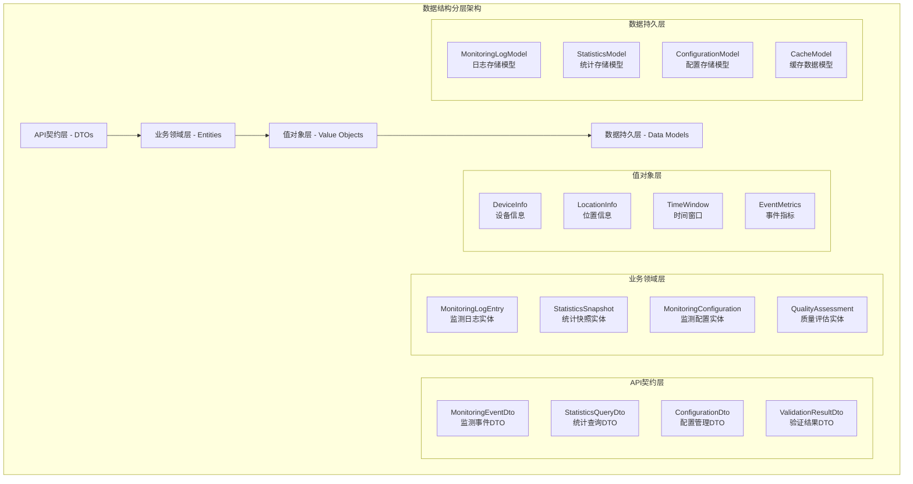
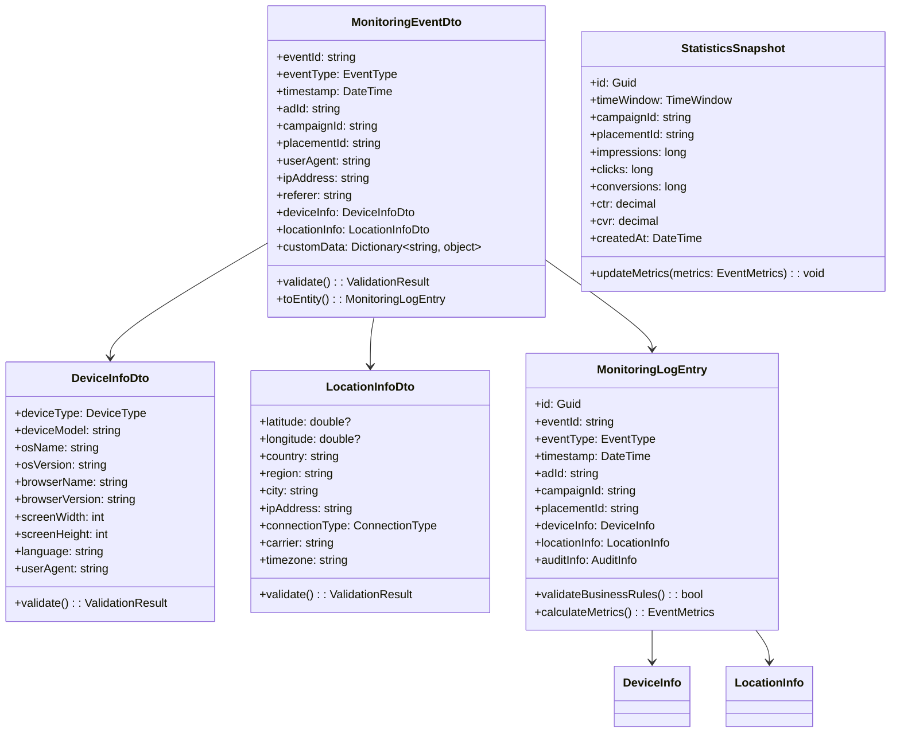
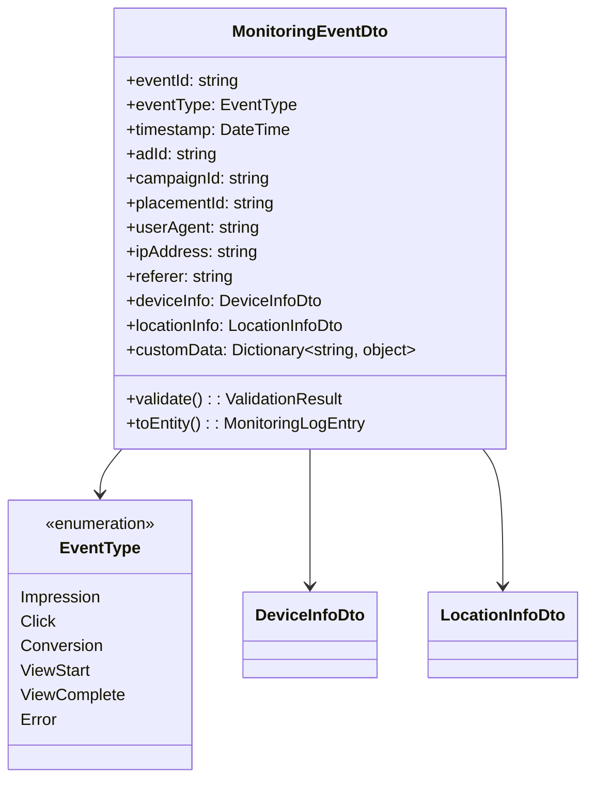
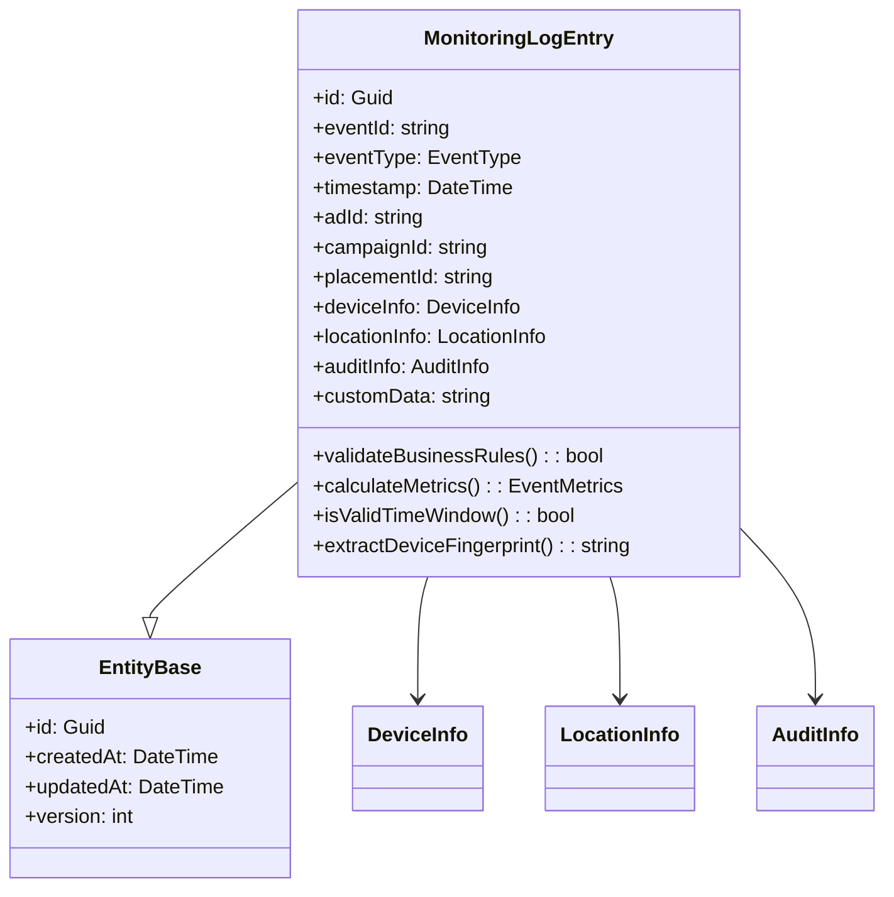
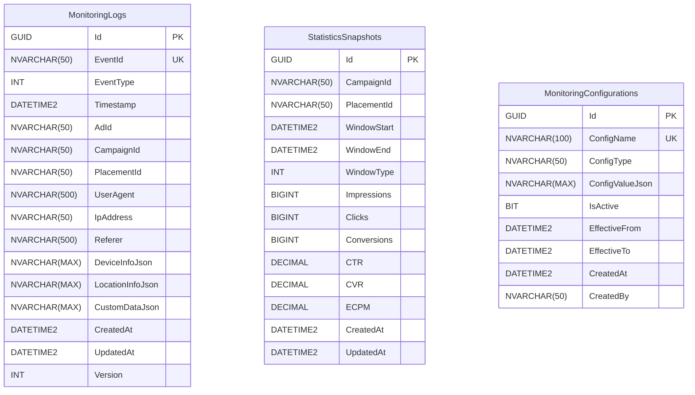
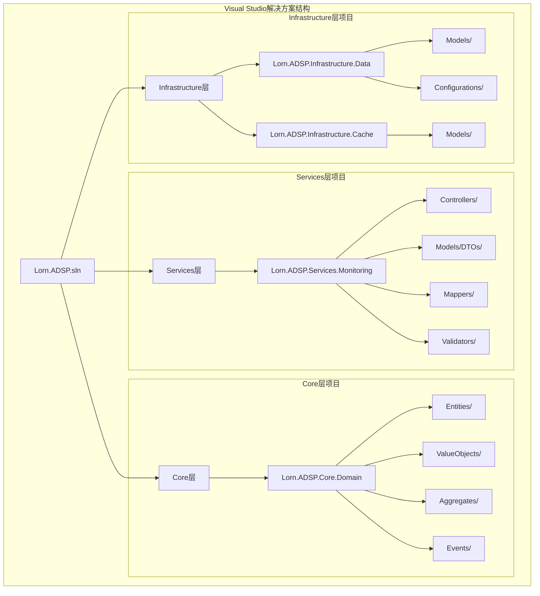
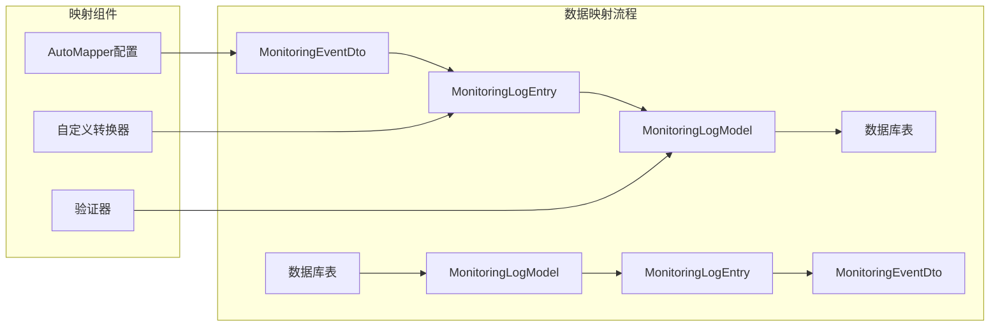
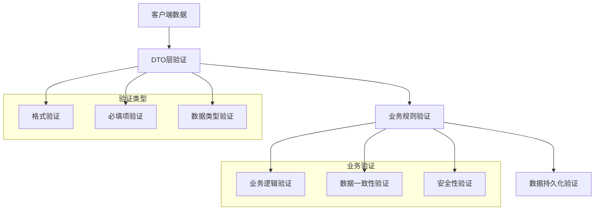
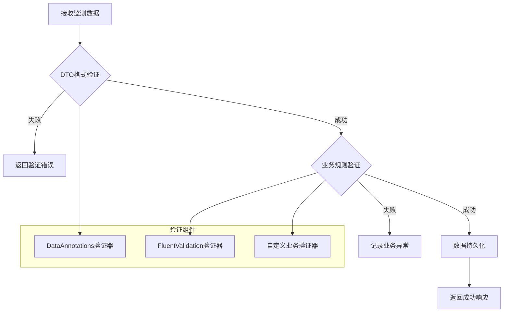
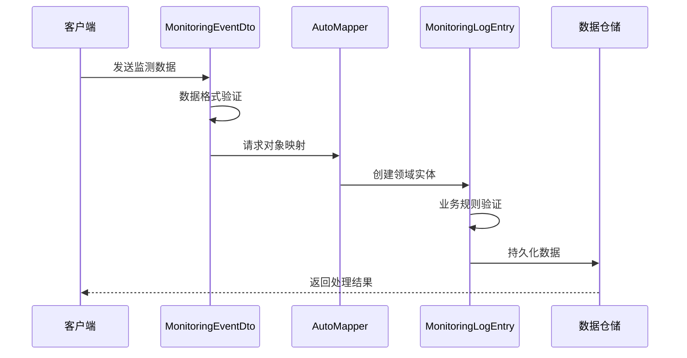

# 广告效果监测服务数据结构设计

## 设计概述

本文档定义了广告效果监测服务的完整数据结构架构，包括监测事件数据模型、统计汇总数据模型、配置管理数据模型以及相关的数据传输对象。设计严格遵循领域驱动设计(DDD)原则和分层架构模式，确保数据结构的一致性、可扩展性和高性能。

## 数据结构分层架构

## 核心数据模型类图

## DTO层设计

### 3.1 监测事件DTO

**UML类图**：

**项目位置**：`Services/Lorn.ADSP.Services.Monitoring/Models/DTOs/MonitoringEventDto.cs`

**设计说明**：

- 监测事件的数据传输对象，标准化客户端到服务端的数据格式
- 支持多种监测事件类型，包括展示、点击、转化等
- 包含完整的上下文信息，用于后续的数据分析和报表生成
- 遵循IAB监测标准，确保与广告生态系统的兼容性

**字段设计要求**：

1. **基础事件信息**：
   - eventId：全局唯一事件标识符，支持幂等性处理
   - eventType：标准化事件类型枚举，扩展IAB定义的事件类型
   - timestamp：精确到毫秒的UTC时间戳

2. **广告关联信息**：
   - adId、campaignId、placementId：建立广告投放链路追踪
   - 支持多级广告组织结构的数据关联

3. **环境上下文信息**：
   - userAgent、ipAddress、referer：标准Web环境信息
   - deviceInfo：设备环境详细信息
   - locationInfo：地理位置和网络环境

4. **扩展数据支持**：
   - customData：支持业务特定的扩展字段
   - 使用强类型Dictionary确保数据安全

### 3.2 设备信息DTO

**项目位置**：`Services/Lorn.ADSP.Services.Monitoring/Models/DTOs/DeviceInfoDto.cs`

**设计说明**：

- 设备信息传输对象，标准化设备识别和环境数据格式
- 支持移动设备、桌面设备、智能电视等多种设备类型
- 包含设备指纹相关信息，用于反作弊和用户识别
- 遵循IAB设备信息标准，确保与广告生态系统兼容

**字段设计要求**：

1. **基础设备信息**：
   - deviceType：设备类型枚举（手机、平板、桌面、智能电视等）
   - deviceModel：设备型号，用于设备兼容性分析
   - osName/osVersion：操作系统信息，支持定向投放

2. **浏览器环境**：
   - browserName/browserVersion：浏览器信息，影响广告展示效果
   - language：用户语言偏好，支持多语言广告投放

3. **显示环境**：
   - screenWidth/screenHeight：屏幕分辨率，用于广告尺寸优化
   - 支持高分辨率和多屏显示场景

### 3.3 位置信息DTO

**项目位置**：`Services/Lorn.ADSP.Services.Monitoring/Models/DTOs/LocationInfoDto.cs`

**设计说明**：

- 位置信息传输对象，标准化地理位置和网络环境数据
- 支持GPS精确定位和IP地址粗略定位两种模式
- 包含网络环境信息，用于网络质量分析和定向投放
- 遵循隐私保护原则，支持位置数据脱敏和模糊化

**字段设计要求**：

1. **地理位置信息**：
   - latitude/longitude：GPS坐标，可选字段支持隐私保护
   - country/region/city：行政区域信息，支持地域定向

2. **网络环境信息**：
   - ipAddress：用户IP地址，用于网络质量分析
   - connectionType：连接类型（WiFi、4G、5G等）
   - carrier：运营商信息，支持运营商定向投放

3. **时区信息**：
   - timezone：用户时区，用于时间相关的广告投放优化

## 领域实体设计

### 4.1 监测日志实体

**项目位置**：`Core/Lorn.ADSP.Core.Domain/Entities/MonitoringLogEntry.cs`

**设计说明**：

- 监测日志的领域实体，表示单个监测事件的完整记录
- 继承自EntityBase基类，包含实体标识和审计信息
- 包含业务规则验证和数据完整性检查逻辑
- 支持事件指标计算和统计数据生成

**UML类图**：

### 4.2 统计快照实体

**项目位置**：`Core/Lorn.ADSP.Core.Domain/Entities/StatisticsSnapshot.cs`

**设计说明**：

- 统计快照实体，表示特定时间窗口内的监测数据聚合结果
- 支持多维度统计，包括广告活动、广告位、时间等维度
- 包含核心广告指标计算逻辑（CTR、CVR等）
- 支持实时统计更新和批量统计重计算

### 4.3 监测配置实体

**项目位置**：`Core/Lorn.ADSP.Core.Domain/Entities/MonitoringConfiguration.cs`

**设计说明**：

- 监测配置实体，管理监测服务的运行参数和业务规则
- 包含数据质量阈值、统计计算规则、报警规则等配置
- 支持配置版本管理和灰度发布
- 提供配置验证和冲突检测功能

## 值对象设计

### 5.1 设备信息值对象

**项目位置**：`Core/Lorn.ADSP.Core.Domain/ValueObjects/DeviceInfo.cs`

**设计说明**：

- 设备信息值对象，封装设备识别和环境数据的不变性
- 实现值对象相等性比较和哈希码计算
- 包含设备指纹生成和设备类型识别逻辑

### 5.2 位置信息值对象

**项目位置**：`Core/Lorn.ADSP.Core.Domain/ValueObjects/LocationInfo.cs`

**设计说明**：

- 位置信息值对象，封装地理位置和网络环境数据
- 支持位置精度控制和隐私保护
- 包含地理距离计算和区域匹配逻辑

### 5.3 时间窗口值对象

**项目位置**：`Core/Lorn.ADSP.Core.Domain/ValueObjects/TimeWindow.cs`

**设计说明**：

- 时间窗口值对象，定义统计时间范围和粒度
- 支持多种时间粒度（小时、天、周、月）
- 包含时间窗口重叠检测和合并逻辑

### 5.4 事件指标值对象

**项目位置**：`Core/Lorn.ADSP.Core.Domain/ValueObjects/EventMetrics.cs`

**设计说明**：

- 事件指标值对象，封装监测事件的统计指标
- 包含CTR、CVR、ECPM等核心广告指标计算
- 支持指标聚合和权重计算

## 数据库表结构设计

### 6.1 监测日志表

**UML表结构图**：

**表设计要求**：

1. **分区策略**：

   - 按时间分区：按月分区存储历史数据
   - 支持自动分区管理和历史数据归档

2. **索引设计**：

   - 主键索引：Id字段聚集索引
   - 唯一索引：EventId字段唯一索引
   - 复合索引：(CampaignId, Timestamp), (PlacementId, Timestamp)
   - 统计索引：支持常用统计查询的覆盖索引

3. **数据类型优化**：

   - 使用NVARCHAR存储Unicode字符串
   - JSON字段存储复杂对象，支持JSON查询
   - DATETIME2提供毫秒精度时间戳

## 项目结构映射

### 7.1 Visual Studio项目结构

**结构映射图**：

**文件映射关系**：

1. **API层文件**：

   - `Services/Lorn.ADSP.Services.Monitoring/Controllers/MonitoringController.cs`：监测API控制器
   - `Services/Lorn.ADSP.Services.Monitoring/Models/DTOs/MonitoringEventDto.cs`：监测事件DTO

2. **业务层文件**：

   - `Core/Lorn.ADSP.Core.Domain/Entities/MonitoringLogEntry.cs`：监测日志实体
   - `Core/Lorn.ADSP.Core.Domain/ValueObjects/DeviceInfo.cs`：设备信息值对象

3. **数据层文件**：

   - `Infrastructure/Lorn.ADSP.Infrastructure.Data/Models/MonitoringLogModel.cs`：监测日志数据模型
   - `Infrastructure/Lorn.ADSP.Infrastructure.Data/Configurations/MonitoringLogConfiguration.cs`：EF配置
   - `Infrastructure/Lorn.ADSP.Infrastructure.Cache/Models/MonitoringCacheModel.cs`：缓存数据模型

## 数据映射设计

### 8.1 对象映射策略

**映射架构图**：

**实现要求**：

1. **AutoMapper配置**：

   - 使用AutoMapper进行对象映射，减少手动映射代码
   - 配置自定义类型转换器，处理复杂对象映射
   - 实现双向映射，支持数据的往返转换

2. **映射配置文件**：

   - `Services/Lorn.ADSP.Services.Monitoring/Mappers/MonitoringMappingProfile.cs`

## 验证与质量控制

### 9.1 数据验证层次

**验证架构图**：

**验证规则**：

1. **DTO层验证**：数据格式和必填项验证
2. **业务层验证**：业务规则和逻辑一致性验证
3. **数据层验证**：数据完整性和约束验证

### 9.2 数据质量评估

**质量指标**：

1. **完整性评分**：必填字段完整度
2. **准确性评分**：数据格式正确性
3. **一致性评分**：关联数据一致性
4. **时效性评分**：数据新鲜度

## 异常处理设计

### 10.1 异常分类体系

**异常处理架构**：

1. **数据层异常**：数据库连接、SQL执行异常
2. **业务层异常**：业务规则违反、数据验证失败
3. **系统层异常**：网络超时、资源不足等系统级异常

## 性能优化设计

### 11.1 数据分区策略

**分区设计**：

- 时间分片：按日期范围分割数据
- 支持并行查询和维护操作
- 自动分区管理和历史数据清理

### 11.2 缓存策略

**缓存层次**：

1. **应用缓存**：热点数据内存缓存
2. **分布式缓存**：Redis集群缓存
3. **数据库缓存**：查询结果集缓存

### 11.3 查询优化

**优化策略**：

- 索引优化：合理设计复合索引
- 查询优化：SQL语句和执行计划优化
- 批量处理：批量插入和更新操作

## 扩展性设计

### 12.1 数据结构扩展

**扩展机制**：

- 数据库分库分表：支持数据库集群扩展
- 字段扩展：JSON字段存储动态扩展数据
- 版本管理：数据结构版本兼容性管理

### 12.2 接口扩展

**扩展点**：

- API版本管理：支持多版本并存
- 消息格式扩展：支持新的监测事件类型
- 协议扩展：支持新的数据传输协议

### 12.3 组件扩展

**扩展设计**：

- 数据验证器：可扩展验证规则
- 数据转换器：可插拔数据转换组件
- 存储适配器：支持多种存储后端

## 监控与运维

### 13.1 数据质量监控

**监控指标**：

- 数据完整性指标：缺失字段比例
- 数据准确性指标：格式错误比例
- 数据一致性指标：关联数据不一致比例

### 13.2 性能监控

**性能指标**：

- 接口性能：响应时间、吞吐量、错误率
- 数据库性能：查询响应时间、连接池使用率
- 缓存性能：命中率、内存使用率

### 13.3 运维管理

**运维功能**：

- 数据归档：自动归档历史数据
- 数据清理：定期清理过期数据
- 配置管理：动态配置更新和回滚

## 开发实现指导

### 14.1 数据验证实现

**验证流程图**：

**实现要求**：

1. **DTO验证器开发**：
   - 在`Services/Lorn.ADSP.Services.Monitoring/Validators/`目录下实现验证器
   - 使用FluentValidation框架进行复杂验证规则定义
   - 支持异步验证和批量验证

2. **业务规则验证**：
   - 在领域实体中实现业务规则验证方法
   - 使用Specification模式进行复杂业务规则组合
   - 提供详细的验证错误信息和建议

### 14.2 数据映射实现

**映射配置示例流程**：

**实现要求**：

1. **映射配置**：
   - 在`MonitoringMappingProfile`中配置所有映射关系
   - 实现自定义转换器处理复杂类型映射
   - 配置条件映射和忽略字段

2. **性能优化**：
   - 使用编译时映射提高性能
   - 缓存映射表达式减少反射开销
   - 实现批量映射优化大量数据处理

### 14.3 数据访问实现

**数据访问架构**：

- 在`Infrastructure/Lorn.ADSP.Infrastructure.Data/`目录实现数据访问层
- 使用Repository模式封装数据访问逻辑
- 实现工作单元模式保证事务一致性
- 配置Entity Framework映射和查询优化

这份数据结构设计文档为广告效果监测服务提供了完整的数据架构指导，确保开发团队能够实现高性能、可扩展的监测数据处理系统。所有设计都严格遵循.NET最佳实践和DDD领域驱动设计原则。
