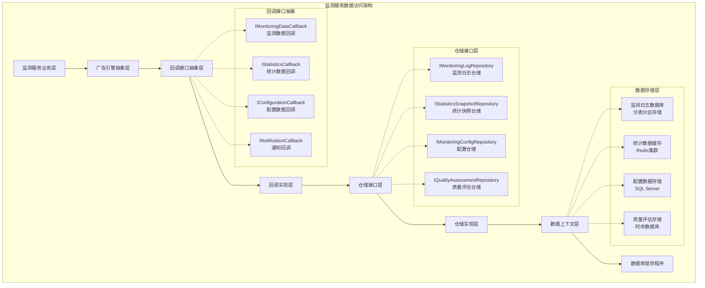
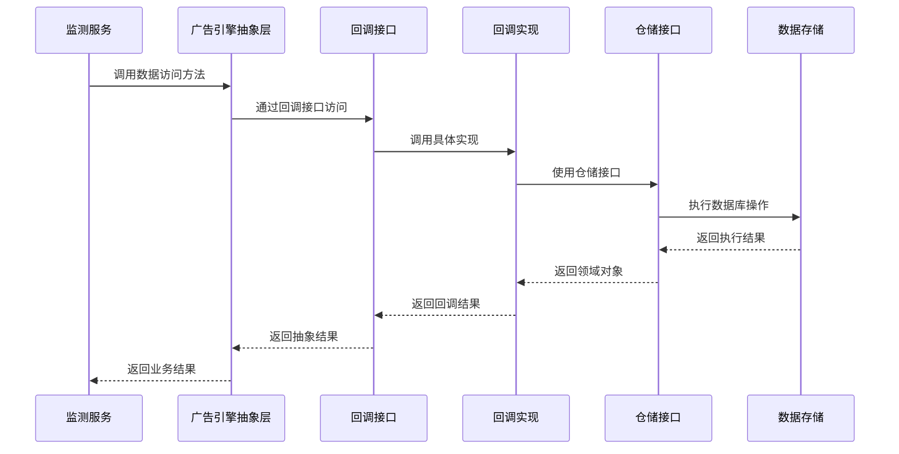
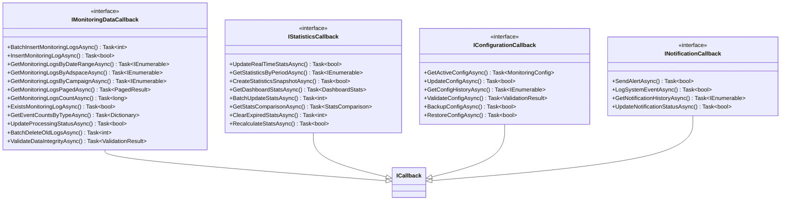
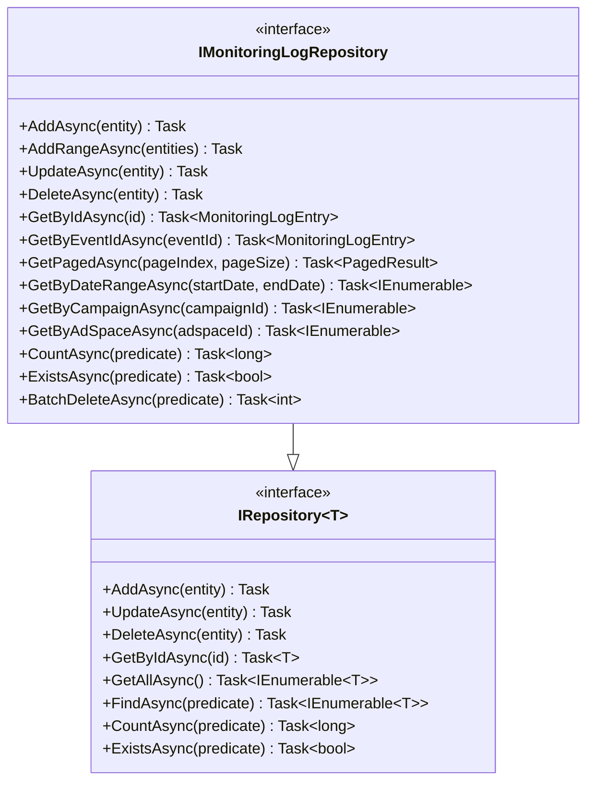
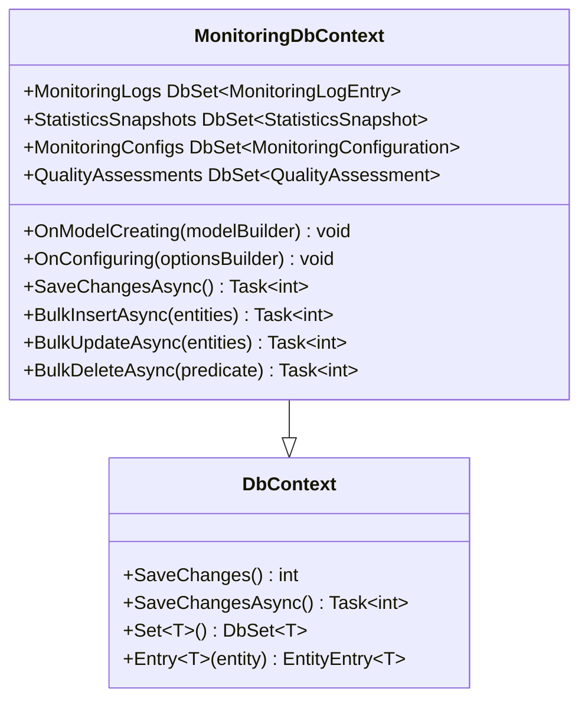
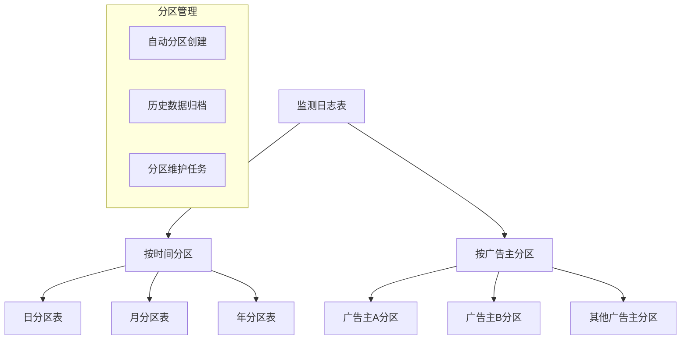
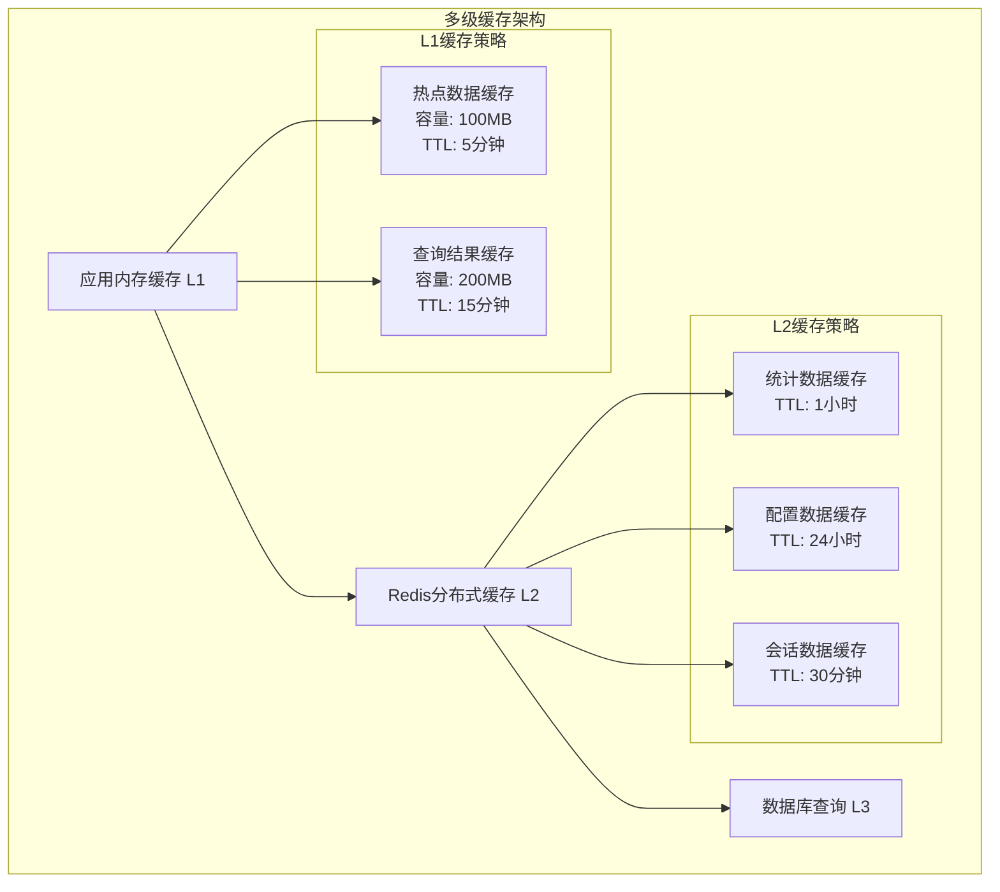
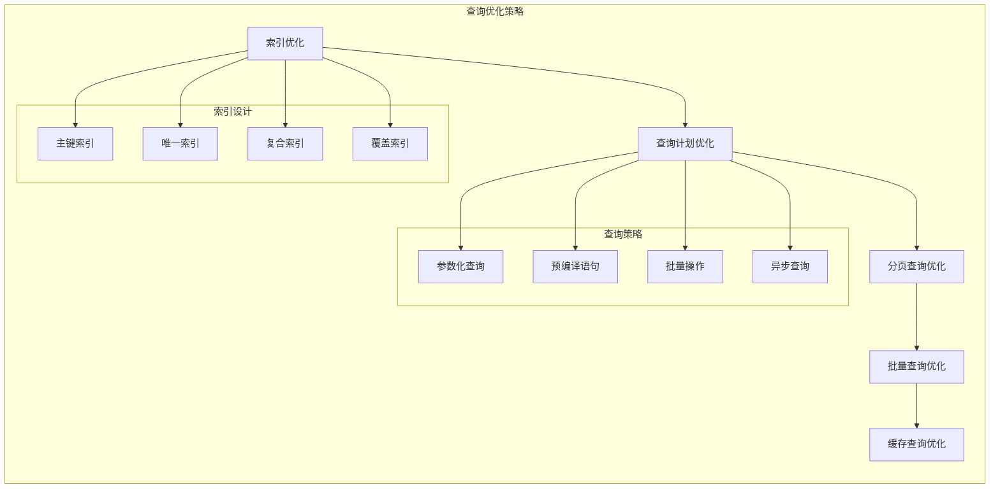

# 广告效果监测服务数据访问层设计

## 设计概述

广告效果监测服务数据访问层基于广告引擎抽象层架构，通过回调接口机制实现与具体数据存储技术的完全解耦。设计遵循仓储模式(Repository Pattern)和工作单元模式(Unit of Work Pattern)，提供高性能、高可用的监测数据存储和查询能力，支持大规模监测数据的批量写入和实时统计查询。

## 数据访问架构设计

### 整体架构图

### 数据访问流程设计

## 回调接口设计

### 监测数据访问回调接口

### 3.1 监测数据回调接口详细设计

**项目位置**: `Services/Lorn.ADSP.Services.Monitoring/Abstractions/IMonitoringDataCallback.cs`

**设计职责**:

- 提供监测日志数据的完整CRUD操作接口
- 支持批量高性能数据写入和查询操作
- 实现监测数据的生命周期管理
- 提供数据统计和分析支持

**核心方法设计**:

1. **数据写入方法**:

   - `BatchInsertMonitoringLogsAsync`: 批量插入监测日志，支持事务处理
   - `InsertMonitoringLogAsync`: 单条记录插入，用于特殊场景

2. **数据查询方法**:

   - `GetMonitoringLogsByDateRangeAsync`: 按时间范围查询，支持跨表查询
   - `GetMonitoringLogsByAdspaceAsync`: 按广告位查询，用于效果分析
   - `GetMonitoringLogsByCampaignAsync`: 按活动查询，支持活动效果统计
   - `GetMonitoringLogsPagedAsync`: 分页查询，支持大数据量展示

3. **数据管理方法**:

   - `GetMonitoringLogsCountAsync`: 获取记录总数，用于统计和监控
   - `ExistsMonitoringLogAsync`: 检查记录存在性，支持重复检测
   - `UpdateProcessingStatusAsync`: 更新处理状态，支持工作流跟踪
   - `BatchDeleteOldLogsAsync`: 批量删除历史数据，支持数据归档

### 3.2 统计数据回调接口详细设计

**项目位置**: `Services/Lorn.ADSP.Services.Monitoring/Abstractions/IStatisticsCallback.cs`

**设计职责**:

- 提供实时统计数据的存储和查询功能
- 支持多维度统计数据的聚合计算
- 实现统计快照和历史数据管理
- 提供统计数据的对比和分析功能

**核心方法设计**:

1. **实时统计方法**:

   - `UpdateRealTimeStatsAsync`: 更新实时统计数据，支持原子操作
   - `GetStatisticsByPeriodAsync`: 按时间周期查询统计数据
   - `BatchUpdateStatsAsync`: 批量更新统计数据，提高性能

2. **快照管理方法**:

   - `CreateStatisticsSnapshotAsync`: 创建统计快照，支持定期备份
   - `GetDashboardStatsAsync`: 获取仪表板统计数据
   - `GetStatsComparisonAsync`: 获取统计对比数据，支持同比环比

3. **数据维护方法**:

   - `ClearExpiredStatsAsync`: 清理过期统计数据
   - `RecalculateStatsAsync`: 重新计算统计数据，支持数据修复

## 仓储接口设计

### 4.1 监测日志仓储接口

**项目位置**: `Core/Lorn.ADSP.Core.Domain/Repositories/IMonitoringLogRepository.cs`

**设计职责**:

- 继承通用仓储接口IRepository\<MonitoringLogEntry\>
- 提供监测日志特定的查询和操作方法
- 支持大规模数据的高性能查询
- 实现数据分页和条件过滤

**核心方法设计**:

1. **批量操作方法**:

   - `AddRangeAsync`: 批量添加监测日志，支持事务控制
   - `BatchDeleteAsync`: 批量删除操作，支持条件删除

2. **专用查询方法**:

   - `GetByEventIdAsync`: 按事件ID查询，支持去重检查
   - `GetByDateRangeAsync`: 按时间范围查询，支持分区优化
   - `GetByCampaignAsync`: 按活动查询，支持活动效果分析
   - `GetByAdSpaceAsync`: 按广告位查询，支持媒体效果分析

### 4.2 统计快照仓储接口

**项目位置**: `Core/Lorn.ADSP.Core.Domain/Repositories/IStatisticsSnapshotRepository.cs`

**设计职责**:

- 管理统计快照数据的存储和查询
- 支持多维度统计数据的聚合操作
- 实现统计数据的版本管理和历史追踪
- 提供统计数据的对比和趋势分析

**核心方法设计**:

1. **快照管理方法**:

   - `CreateSnapshotAsync`: 创建统计快照
   - `GetLatestSnapshotAsync`: 获取最新快照数据
   - `GetSnapshotsByPeriodAsync`: 按周期获取快照历史
   - `CompareSnapshotsAsync`: 对比不同时期的快照数据

2. **聚合查询方法**:

   - `GetAggregatedStatsAsync`: 获取聚合统计数据
   - `GetTrendAnalysisAsync`: 获取趋势分析数据
   - `GetTopPerformingAdsAsync`: 获取表现最佳的广告

## 数据上下文设计

### 5.1 监测数据上下文

**项目位置**: `Infrastructure/Lorn.ADSP.Infrastructure.Data/Contexts/MonitoringDbContext.cs`

**设计职责**:

- 管理监测相关实体的数据库映射
- 提供Entity Framework配置和优化
- 实现批量操作和性能优化
- 支持数据库连接管理和事务控制

**核心实体集合**:

1. **核心实体集合**:

   - `MonitoringLogs`: 监测日志实体集合
   - `StatisticsSnapshots`: 统计快照实体集合
   - `MonitoringConfigs`: 监测配置实体集合
   - `QualityAssessments`: 质量评估实体集合

2. **配置方法**:

   - `OnModelCreating`: 实体关系配置和约束定义
   - `OnConfiguring`: 数据库连接配置和性能优化
   - 索引配置: 为查询字段创建高效索引
   - 分区配置: 实现表分区和数据归档策略

## 分区和缓存策略

### 6.1 数据分区设计

**分区策略设计**:

1. **监测日志分区**:

   - 按日期分区: 提高查询性能和维护效率
   - 按广告主分区: 支持租户隔离和并行查询
   - 自动分区管理: 定期创建新分区和清理历史分区

2. **统计数据分区**:

   - 按时间维度分区: 支持不同粒度的统计查询
   - 按业务维度分区: 提高特定查询的性能

3. **分区维护**:

4. **按广告主分区**:

   - 租户数据隔离: 确保不同广告主数据的安全隔离
   - 并行查询优化: 支持多个广告主数据的并行处理
   - 资源配额管理: 控制单个广告主的资源使用

### 6.2 缓存策略设计

**缓存设计要求**:

1. **L1内存缓存**:

   - 热点数据缓存: 频繁访问的统计数据和配置信息
   - 查询结果缓存: 复杂查询的结果集缓存
   - 过期策略: 基于LRU算法的自动过期和清理

2. **L2分布式缓存**:

   - 统计数据缓存: 实时统计数据和历史趋势数据
   - 配置数据缓存: 系统配置和业务规则缓存
   - 集群支持: Redis集群模式，支持高可用和负载均衡

3. **缓存更新策略**:

4. **写入策略**:

   - Write-Through: 同步更新缓存和数据库
   - Write-Behind: 批量异步写入，提高性能
   - Cache-Aside: 应用程序管理缓存更新逻辑

5. **一致性保证**:

   - 版本控制: 使用版本号确保数据一致性
   - 分布式锁: Redis分布式锁防止并发更新冲突
   - 事件通知: 数据变更事件通知缓存更新

## 性能优化设计

### 7.1 查询优化

**性能优化要求**:

1. **查询性能指标**:

   - 单次查询响应时间 < 100ms
   - 批量操作吞吐量 > 10000 TPS
   - 并发查询支持 > 1000 连接
   - 缓存命中率 > 95%

2. **优化策略**:

   - 索引优化: 为常用查询字段创建合适的索引
   - 查询优化: 使用查询计划分析和SQL优化
   - 连接池优化: 合理配置数据库连接池参数
   - 批量操作: 使用批量插入和更新提高性能

## 开发实现指导

### 8.1 Visual Studio项目结构

**项目组织要求**:

- `Services/Lorn.ADSP.Services.Monitoring/Abstractions/`目录实现所有回调接口定义
- 每个回调接口单独文件，命名规范为`I{功能名}Callback.cs`
- `Infrastructure/Lorn.ADSP.Infrastructure.Monitoring/Callbacks/`目录实现回调接口
- 实现类命名规范为`{功能名}Callback.cs`，实现对应的接口
- `Core/Lorn.ADSP.Core.Domain/Repositories/`目录定义仓储接口
- 仓储接口命名规范为`I{实体名}Repository.cs`
- `Infrastructure/Lorn.ADSP.Infrastructure.Data/Repositories/`目录实现仓储
- 仓储实现命名规范为`{实体名}Repository.cs`

### 8.2 配置管理

**配置要求**:

- 支持多数据库连接字符串配置
- 数据库提供程序可配置切换(SQL Server, MySQL, PostgreSQL)
- Redis连接配置和集群配置
- 缓存策略参数配置(TTL, 容量限制, 过期策略)
- 性能监控和日志配置

### 8.3 依赖注入配置

**服务注册要求**:

- 回调接口注册为Scoped生命周期
- 仓储接口注册为Scoped生命周期  
- 数据上下文注册为Scoped生命周期
- 缓存服务注册为Singleton生命周期
- 配置选项使用Options模式注册

### 8.4 单元测试指导

**测试要求**:

- 回调接口模拟测试: 使用Moq框架模拟回调接口
- 仓储单元测试: 使用InMemory数据库进行仓储测试
- 集成测试: 使用TestContainers进行数据库集成测试
- 性能测试: 使用NBomber进行负载和性能测试
- 数据一致性测试: 验证并发访问下的数据一致性

### 8.5 错误处理和日志

**错误处理要求**:

- 统一异常处理: 定义数据访问层专用异常类型
- 重试机制: 对临时性错误实现指数退避重试
- 熔断器: 对依赖服务实现熔断保护
- 超时控制: 所有数据库操作设置合理超时时间

**日志要求**:

- 结构化日志: 使用Serilog进行结构化日志记录
- 性能日志: 记录查询执行时间和性能指标
- 业务日志: 记录重要业务操作和状态变更
- 错误日志: 详细记录异常信息和上下文

这份数据访问层设计文档为广告效果监测服务提供了完整的数据访问架构指导，确保开发团队能够实现高性能、高可用的数据访问层。所有设计都严格遵循.NET最佳实践和企业级应用架构原则。
