# 广告调度服务技术架构设计

## 1. 核心技术架构概述

### 1.1 技术设计目标

广告调度服务作为广告投放引擎的核心组件，需要满足广告业务的特殊技术要求：

- **实时调度能力**：支持分钟级投放调度，满足广告投放的时效性要求
- **高可用性设计**：99.99%的系统可用性，确保广告投放的连续性
- **大规模并发**：支持万级广告活动同时调度，百万级QPS的数据处理能力
- **智能决策支持**：集成AI算法，实现预算优化、节奏控制、效果预测
- **IAB标准兼容**：严格遵循OpenRTB、VAST等广告行业标准
- **数据一致性**：确保跨服务的广告数据强一致性
- **弹性扩展**：支持水平扩展，适应广告业务的快速增长

### 1.2 技术架构原则

**领域驱动设计(DDD)**：
- 广告调度领域的清晰边界定义
- 聚合根设计确保业务一致性
- 领域事件驱动的异步通信

**微服务架构**：
- 按业务能力拆分服务
- 独立部署和扩展
- 服务间松耦合通信

**事件驱动架构**：
- 基于事件的异步通信模式
- 保证最终一致性
- 支持复杂的业务流程编排

## 2. 系统架构设计

### 2.1 C4模型架构设计

#### 2.1.1 上下文层级架构


#### 2.1.2 容器层级架构


#### 2.1.3 组件层级架构


### 2.2 技术架构分层设计


## 3. 核心技术设计

### 3.1 分布式调度架构设计

#### 3.1.1 调度任务分发策略


**设计要点**：
- **一致性哈希**：确保相同广告活动总是路由到同一节点
- **分布式锁**：防止重复执行，使用Redis实现
- **故障转移**：节点失效时自动重新分配任务
- **负载均衡**：基于节点负载和处理能力动态分配

#### 3.1.2 调度状态管理设计


### 3.2 数据一致性架构设计

#### 3.2.1 分布式事务设计


#### 3.2.2 事件驱动架构设计


### 3.3 性能优化架构设计

#### 3.3.1 多级缓存架构


#### 3.3.2 异步处理架构

```mermaid
flowchart LR
    A[同步请求] --> B[请求接收器]
    B --> C[任务队列]
    C --> D[异步处理器]
    D --> E[结果存储]
    E --> F[通知机制]
    
    subgraph "异步处理管道"
        G[高优先级队列]
        H[普通优先级队列]
        I[低优先级队列]
    end
    
    subgraph "处理器集群"
        J[处理器1]
        K[处理器2]
        L[处理器N]
    end
    
    C --> G
    C --> H
    C --> I
    
    G --> J
    H --> K
    I --> L
    
    J --> E
    K --> E
    L --> E
    
    style C fill:#ff6b6b
    style E fill:#4ecdc4
    style F fill:#45b7d1
```



## 4. 项目架构映射设计

### 4.1 Visual Studio解决方案结构

```text
Lorn.ADSP.sln
├── Services/
│   └── Lorn.ADSP.Services.Scheduling/              # 调度服务主项目
│       ├── Controllers/                             # API控制器
│       │   ├── ScheduleController.cs               # 调度任务管理
│       │   ├── ConfigurationController.cs          # 配置管理
│       │   └── MonitoringController.cs             # 监控查询
│       ├── Services/                               # 应用服务
│       │   ├── IScheduleOrchestrationService.cs    # 调度编排接口
│       │   ├── ScheduleOrchestrationService.cs     # 调度编排实现
│       │   ├── IConfigurationManagementService.cs  # 配置管理接口
│       │   └── ConfigurationManagementService.cs   # 配置管理实现
│       ├── Domain/                                 # 领域服务
│       │   ├── Engines/                           # 调度引擎
│       │   │   ├── IScheduleEngine.cs
│       │   │   └── ScheduleEngine.cs
│       │   ├── DataCollection/                    # 数据收集
│       │   │   ├── IDataCollectionService.cs
│       │   │   └── DataCollectionService.cs
│       │   ├── Settlement/                        # 结算计算
│       │   │   ├── ISettlementService.cs
│       │   │   └── SettlementService.cs
│       │   └── QuotaDistribution/                 # 配额分发
│       │       ├── IQuotaDistributionService.cs
│       │       └── QuotaDistributionService.cs
│       ├── Infrastructure/                         # 基础设施
│       │   ├── Persistence/                       # 数据持久化
│       │   ├── External/                          # 外部集成
│       │   ├── Caching/                          # 缓存实现
│       │   └── Messaging/                        # 消息处理
│       ├── Configuration/                          # 配置相关
│       ├── Middleware/                            # 中间件
│       └── Extensions/                            # 扩展方法
├── Core/
│   ├── Lorn.ADSP.Core.Domain/                    # 领域模型
│   │   └── Scheduling/                           # 调度领域
│   │       ├── Entities/                         # 实体
│   │       ├── ValueObjects/                     # 值对象
│   │       ├── Events/                           # 领域事件
│   │       └── Services/                         # 领域服务接口
│   └── Lorn.ADSP.Core.Shared/                    # 共享组件
│       ├── Enums/                               # 枚举定义
│       ├── Constants/                           # 常量定义
│       └── Extensions/                          # 扩展方法
├── Infrastructure/
│   ├── Lorn.ADSP.Infrastructure.Persistence/     # 数据访问
│   │   ├── Repositories/                        # 仓储实现
│   │   ├── EntityConfigurations/                # 实体配置
│   │   └── Contexts/                           # 数据上下文
│   ├── Lorn.ADSP.Infrastructure.Caching/         # 缓存实现
│   │   ├── Redis/                              # Redis缓存
│   │   └── Memory/                             # 内存缓存
│   ├── Lorn.ADSP.Infrastructure.Messaging/       # 消息队列
│   │   ├── Kafka/                              # Kafka实现
│   │   └── RabbitMQ/                           # RabbitMQ实现
│   └── Lorn.ADSP.Infrastructure.External/        # 外部集成
│       ├── AdEngine/                           # 广告引擎集成
│       ├── DataCollection/                     # 数据收集集成
│       └── ML/                                # 机器学习集成
└── Tests/
    ├── Lorn.ADSP.Services.Scheduling.Tests/      # 服务层测试
    ├── Lorn.ADSP.Core.Domain.Tests/             # 领域层测试
    └── Lorn.ADSP.Infrastructure.Tests/          # 基础设施测试
```

### 4.2 依赖注入容器配置设计

**服务注册策略**：

```text
Program.cs 中的服务配置结构：

1. 核心服务注册 (AddSchedulingServices)
   - 调度引擎服务
   - 数据收集服务
   - 结算计算服务
   - 配额分发服务

2. 基础设施服务注册 (AddInfrastructure)
   - 数据访问层服务
   - 缓存服务
   - 消息队列服务
   - 外部集成服务

3. 跨切面服务注册 (AddCrossCuttingConcerns)
   - 日志服务
   - 监控服务
   - 健康检查服务
   - 安全认证服务

4. 配置绑定 (AddConfiguration)
   - 调度配置
   - 数据库配置
   - 缓存配置
   - 外部服务配置
```

## 5. 外部集成架构设计

### 5.1 广告投放引擎集成


### 5.2 数据收集系统集成


### 5.3 机器学习平台集成

**AI服务集成设计**：


## 6. 部署架构设计

### 6.1 容器化部署架构


### 6.2 高可用部署设计

**多可用区部署架构**：


## 7. 安全架构设计

### 7.1 认证授权架构


### 7.2 数据安全架构

**数据保护策略**：


## 8. 监控与运维架构设计

### 8.1 监控架构设计


### 8.2 运维自动化架构

**DevOps流水线设计**：


---

本技术架构设计为广告调度服务提供了完整的技术蓝图，涵盖了系统架构、技术选型、部署策略、安全设计等各个方面。开发团队可以基于此架构设计进行详细的系统实现。
