# 广告调度服务数据流程技术设计

## 1. 数据流程核心架构

### 1.1 数据流程设计目标

广告调度服务的数据流程承载着广告投放生态系统的核心数据流转，需要满足以下技术要求：

- **实时性保证**：数据收集到分发的全流程延迟控制在3分钟内
- **数据完整性**：确保数据收集完整性达到99.99%，无数据丢失
- **高吞吐能力**：支持每分钟处理百万级广告事件数据
- **弹性容错**：具备自动故障恢复和数据修复能力
- **一致性保证**：确保跨系统数据的最终一致性
- **可追溯性**：完整的数据血缘和处理轨迹记录
- **安全合规**：满足GDPR等数据保护法规要求

### 1.2 数据流程技术架构

#### 1.2.1 整体数据流架构

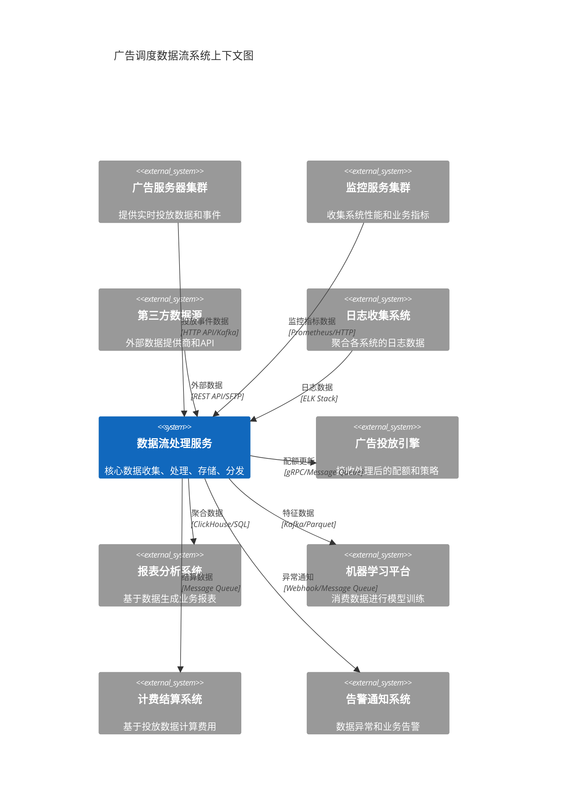
```mermaid
C4Context
    title 广告调度数据流系统上下文图
    
    System_Ext(adServerCluster, "广告服务器集群", "提供实时投放数据和事件")
    System_Ext(monitoringCluster, "监控服务集群", "收集系统性能和业务指标")
    System_Ext(thirdPartyData, "第三方数据源", "外部数据提供商和API")
    System_Ext(logCollectionSystem, "日志收集系统", "聚合各系统的日志数据")
    
    System(dataFlowService, "数据流处理服务", "核心数据收集、处理、存储、分发")
    
    System_Ext(adEngineCluster, "广告投放引擎", "接收处理后的配额和策略")
    System_Ext(reportingSystem, "报表分析系统", "基于数据生成业务报表")
    System_Ext(mlPlatform, "机器学习平台", "消费数据进行模型训练")
    System_Ext(billingSystem, "计费结算系统", "基于投放数据计算费用")
    System_Ext(alertingSystem, "告警通知系统", "数据异常和业务告警")
    
    Rel(adServerCluster, dataFlowService, "投放事件数据", "HTTP API/Kafka")
    Rel(monitoringCluster, dataFlowService, "监控指标数据", "Prometheus/HTTP")
    Rel(thirdPartyData, dataFlowService, "外部数据", "REST API/SFTP")
    Rel(logCollectionSystem, dataFlowService, "日志数据", "ELK Stack")
    
    Rel(dataFlowService, adEngineCluster, "配额更新", "gRPC/Message Queue")
    Rel(dataFlowService, reportingSystem, "聚合数据", "ClickHouse/SQL")
    Rel(dataFlowService, mlPlatform, "特征数据", "Kafka/Parquet")
    Rel(dataFlowService, billingSystem, "结算数据", "Message Queue")
    Rel(dataFlowService, alertingSystem, "异常通知", "Webhook/Message Queue")
```

#### 1.2.2 数据流处理管道架构

```mermaid
C4Container
    title 数据流处理管道容器架构图
    
    Container_Boundary(ingestion, "数据摄取层") {
        Container(dataCollectors, "数据收集器集群", ".NET 9", "多源数据并行收集")
        Container(streamProcessor, "流处理器", "Apache Kafka", "实时数据流处理")
        Container(apiGateway, "数据API网关", ".NET 9", "统一数据接入点")
    }
    
    Container_Boundary(processing, "数据处理层") {
        Container(realTimeProcessor, "实时处理引擎", ".NET 9", "流式数据处理和计算")
        Container(batchProcessor, "批处理引擎", ".NET 9", "大批量数据处理")
        Container(dataValidator, "数据验证器", ".NET 9", "数据质量检查和修复")
        Container(dataTransformer, "数据转换器", ".NET 9", "数据格式转换和清洗")
    }
    
    Container_Boundary(storage, "数据存储层") {
        Container(hotStorage, "热数据存储", "Redis Cluster", "实时数据和缓存")
        Container(warmStorage, "温数据存储", "PostgreSQL", "近期数据和事务")
        Container(coldStorage, "冷数据存储", "ClickHouse", "历史数据和分析")
        Container(archiveStorage, "归档存储", "S3/MinIO", "长期数据归档")
    }
    
    Container_Boundary(distribution, "数据分发层") {
        Container(realTimeDistributor, "实时分发器", ".NET 9", "实时数据推送")
        Container(batchDistributor, "批量分发器", ".NET 9", "批量数据分发")
        Container(eventPublisher, "事件发布器", "Apache Kafka", "事件驱动通知")
    }
    
    Container_Boundary(monitoring, "监控管控层") {
        Container(dataQualityMonitor, "数据质量监控", ".NET 9", "数据质量实时监控")
        Container(flowMetrics, "流程指标收集", "Prometheus", "性能指标收集")
        Container(alertManager, "告警管理器", "AlertManager", "异常告警处理")
    }
    
    Container_Ext(externalSources, "外部数据源", "各类数据提供方")
    Container_Ext(downstreamSystems, "下游系统", "数据消费方")
    
    Rel(externalSources, dataCollectors, "数据拉取", "HTTP/gRPC")
    Rel(externalSources, apiGateway, "数据推送", "HTTP API")
    Rel(dataCollectors, streamProcessor, "数据流", "Kafka Protocol")
    Rel(apiGateway, streamProcessor, "数据流", "Kafka Protocol")
    
    Rel(streamProcessor, realTimeProcessor, "实时流", "Kafka Consumer")
    Rel(streamProcessor, batchProcessor, "批处理流", "Kafka Consumer")
    Rel(realTimeProcessor, dataValidator, "处理数据", "In-Process")
    Rel(batchProcessor, dataValidator, "批量数据", "In-Process")
    Rel(dataValidator, dataTransformer, "验证数据", "In-Process")
    
    Rel(dataTransformer, hotStorage, "实时数据", "Redis Protocol")
    Rel(dataTransformer, warmStorage, "事务数据", "SQL")
    Rel(dataTransformer, coldStorage, "分析数据", "HTTP")
    Rel(dataTransformer, archiveStorage, "归档数据", "S3 API")
    
    Rel(hotStorage, realTimeDistributor, "热数据", "Redis Protocol")
    Rel(warmStorage, batchDistributor, "温数据", "SQL")
    Rel(coldStorage, batchDistributor, "冷数据", "HTTP")
    Rel(realTimeDistributor, eventPublisher, "分发事件", "Kafka Producer")
    Rel(batchDistributor, eventPublisher, "批量事件", "Kafka Producer")
    
    Rel(eventPublisher, downstreamSystems, "数据分发", "Kafka Consumer")
    Rel(realTimeDistributor, downstreamSystems, "实时推送", "gRPC/HTTP")
    
    Rel(dataQualityMonitor, flowMetrics, "质量指标", "Prometheus")
    Rel(flowMetrics, alertManager, "告警指标", "HTTP")
    Rel(alertManager, downstreamSystems, "告警通知", "Webhook")
```

#### 1.2.3 数据流状态管理架构

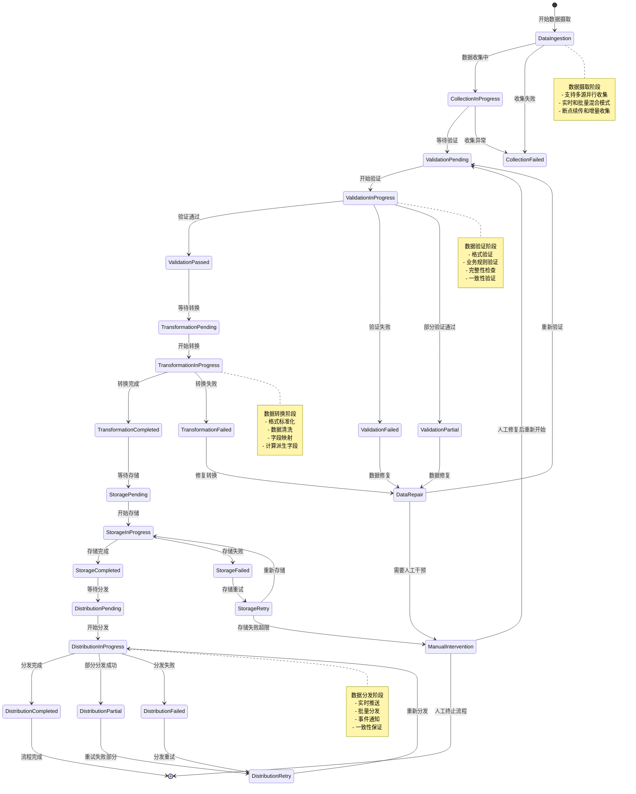
```mermaid
stateDiagram-v2
    [*] --> DataIngestion: 开始数据摄取
    
    DataIngestion --> CollectionInProgress: 数据收集中
    DataIngestion --> CollectionFailed: 收集失败
    
    CollectionInProgress --> ValidationPending: 等待验证
    CollectionInProgress --> CollectionFailed: 收集异常
    
    ValidationPending --> ValidationInProgress: 开始验证
    ValidationInProgress --> ValidationPassed: 验证通过
    ValidationInProgress --> ValidationFailed: 验证失败
    ValidationInProgress --> ValidationPartial: 部分验证通过
    
    ValidationPassed --> TransformationPending: 等待转换
    ValidationPartial --> DataRepair: 数据修复
    ValidationFailed --> DataRepair: 数据修复
    
    DataRepair --> ValidationPending: 重新验证
    DataRepair --> ManualIntervention: 需要人工干预
    
    TransformationPending --> TransformationInProgress: 开始转换
    TransformationInProgress --> TransformationCompleted: 转换完成
    TransformationInProgress --> TransformationFailed: 转换失败
    
    TransformationCompleted --> StoragePending: 等待存储
    TransformationFailed --> DataRepair: 修复转换
    
    StoragePending --> StorageInProgress: 开始存储
    StorageInProgress --> StorageCompleted: 存储完成
    StorageInProgress --> StorageFailed: 存储失败
    
    StorageCompleted --> DistributionPending: 等待分发
    StorageFailed --> StorageRetry: 存储重试
    StorageRetry --> StorageInProgress: 重新存储
    StorageRetry --> ManualIntervention: 存储失败超限
    
    DistributionPending --> DistributionInProgress: 开始分发
    DistributionInProgress --> DistributionCompleted: 分发完成
    DistributionInProgress --> DistributionPartial: 部分分发成功
    DistributionInProgress --> DistributionFailed: 分发失败
    
    DistributionCompleted --> [*]: 流程完成
    DistributionPartial --> DistributionRetry: 重试失败部分
    DistributionFailed --> DistributionRetry: 分发重试
    DistributionRetry --> DistributionInProgress: 重新分发
    
    ManualIntervention --> ValidationPending: 人工修复后重新开始
    ManualIntervention --> [*]: 人工终止流程
    
    note right of DataIngestion
        数据摄取阶段
        - 支持多源并行收集
        - 实时和批量混合模式
        - 断点续传和增量收集
    end note
    
    note right of ValidationInProgress
        数据验证阶段
        - 格式验证
        - 业务规则验证
        - 完整性检查
        - 一致性验证
    end note
    
    note right of TransformationInProgress
        数据转换阶段
        - 格式标准化
        - 数据清洗
        - 字段映射
        - 计算派生字段
    end note
    
    note right of DistributionInProgress
        数据分发阶段
        - 实时推送
        - 批量分发
        - 事件通知
        - 一致性保证
    end note
```

## 2. 数据收集架构设计

### 2.1 多源数据收集设计

#### 2.1.1 数据源分类与收集策略

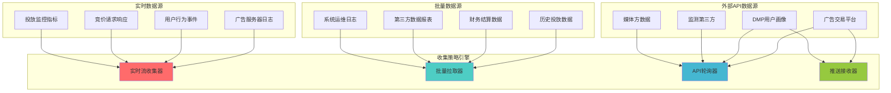
```mermaid
graph TB
    subgraph "实时数据源"
        A1[广告服务器日志]
        A2[用户行为事件]
        A3[竞价请求响应]
        A4[投放监控指标]
    end
    
    subgraph "批量数据源"
        B1[历史投放数据]
        B2[财务结算数据]
        B3[第三方数据报表]
        B4[系统运维日志]
    end
    
    subgraph "外部API数据源"
        C1[广告交易平台]
        C2[DMP用户画像]
        C3[监测第三方]
        C4[媒体方数据]
    end
    
    subgraph "收集策略引擎"
        D1[实时流收集器]
        D2[批量拉取器]
        D3[API轮询器]
        D4[推送接收器]
    end
    
    A1 --> D1
    A2 --> D1
    A3 --> D1
    A4 --> D1
    
    B1 --> D2
    B2 --> D2
    B3 --> D2
    B4 --> D2
    
    C1 --> D3
    C2 --> D3
    C3 --> D3
    C4 --> D3
    
    C1 --> D4
    C2 --> D4
    
    style D1 fill:#ff6b6b
    style D2 fill:#4ecdc4
    style D3 fill:#45b7d1
    style D4 fill:#96c93f
```

#### 2.1.2 并行收集架构设计

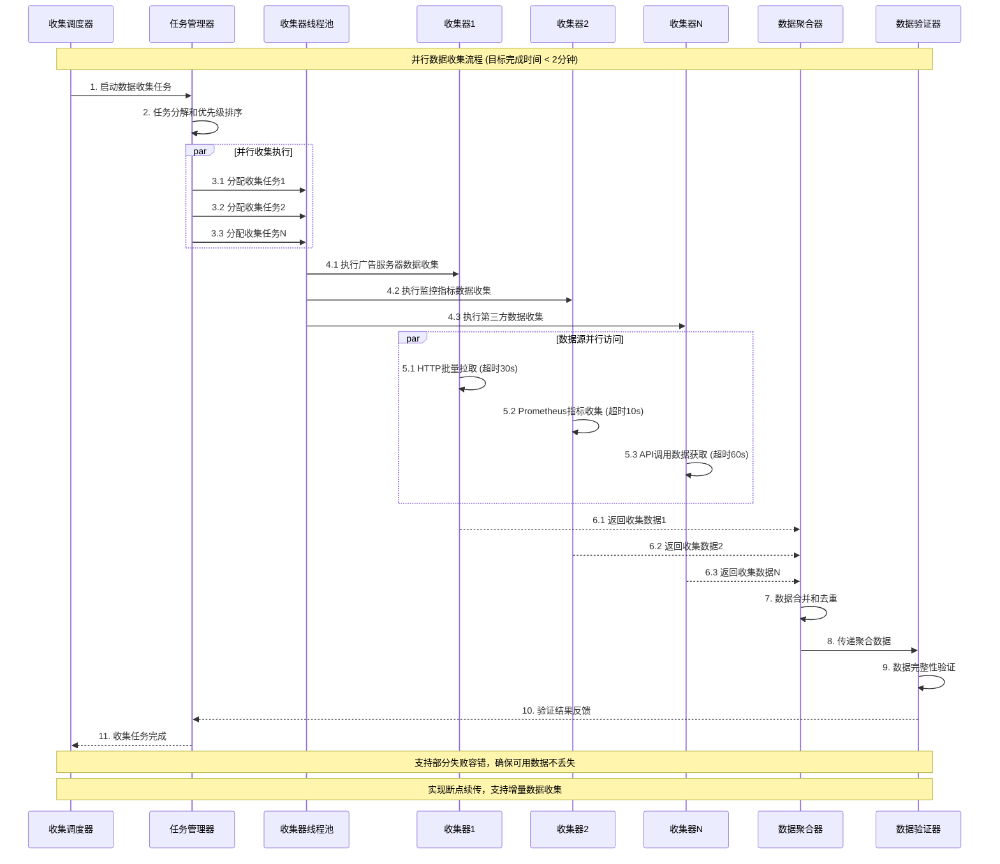
```mermaid
sequenceDiagram
    participant Scheduler as 收集调度器
    participant TaskManager as 任务管理器
    participant Pool as 收集器线程池
    participant Collector1 as 收集器1
    participant Collector2 as 收集器2
    participant CollectorN as 收集器N
    participant Aggregator as 数据聚合器
    participant Validator as 数据验证器
    
    Note over Scheduler,Validator: 并行数据收集流程 (目标完成时间 < 2分钟)
    
    Scheduler->>TaskManager: 1. 启动数据收集任务
    TaskManager->>TaskManager: 2. 任务分解和优先级排序
    
    par 并行收集执行
        TaskManager->>Pool: 3.1 分配收集任务1
        TaskManager->>Pool: 3.2 分配收集任务2
        TaskManager->>Pool: 3.3 分配收集任务N
    end
    
    Pool->>Collector1: 4.1 执行广告服务器数据收集
    Pool->>Collector2: 4.2 执行监控指标数据收集
    Pool->>CollectorN: 4.3 执行第三方数据收集
    
    par 数据源并行访问
        Collector1->>Collector1: 5.1 HTTP批量拉取 (超时30s)
        Collector2->>Collector2: 5.2 Prometheus指标收集 (超时10s)
        CollectorN->>CollectorN: 5.3 API调用数据获取 (超时60s)
    end
    
    Collector1-->>Aggregator: 6.1 返回收集数据1
    Collector2-->>Aggregator: 6.2 返回收集数据2
    CollectorN-->>Aggregator: 6.3 返回收集数据N
    
    Aggregator->>Aggregator: 7. 数据合并和去重
    Aggregator->>Validator: 8. 传递聚合数据
    Validator->>Validator: 9. 数据完整性验证
    Validator-->>TaskManager: 10. 验证结果反馈
    TaskManager-->>Scheduler: 11. 收集任务完成
    
    Note over Scheduler,Validator: 支持部分失败容错，确保可用数据不丢失
    Note over Scheduler,Validator: 实现断点续传，支持增量数据收集
```

### 2.2 数据质量保证设计

#### 2.2.1 数据验证规则引擎

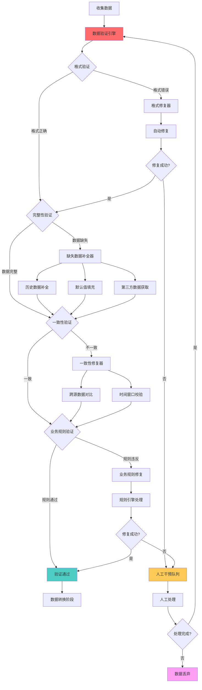
```mermaid
flowchart TD
    A[收集数据] --> B[数据验证引擎]
    B --> C{格式验证}
    C -->|格式错误| D[格式修复器]
    C -->|格式正确| E{完整性验证}
    
    D --> F[自动修复]
    F --> G{修复成功?}
    G -->|是| E
    G -->|否| H[人工干预队列]
    
    E -->|数据缺失| I[缺失数据补全器]
    E -->|数据完整| J{一致性验证}
    
    I --> K[历史数据补全]
    I --> L[默认值填充]
    I --> M[第三方数据获取]
    K --> J
    L --> J
    M --> J
    
    J -->|不一致| N[一致性修复器]
    J -->|一致| O{业务规则验证}
    
    N --> P[跨源数据对比]
    N --> Q[时间窗口校验]
    P --> O
    Q --> O
    
    O -->|规则违反| R[业务规则修复]
    O -->|规则通过| S[验证通过]
    
    R --> T[规则引擎处理]
    T --> U{修复成功?}
    U -->|是| S
    U -->|否| H
    
    S --> V[数据转换阶段]
    H --> W[人工处理]
    W --> X{处理完成?}
    X -->|是| B
    X -->|否| Y[数据丢弃]
    
    style B fill:#ff6b6b
    style S fill:#4ecdc4
    style H fill:#feca57
    style Y fill:#ff9ff3
```

#### 2.2.2 数据血缘追踪设计

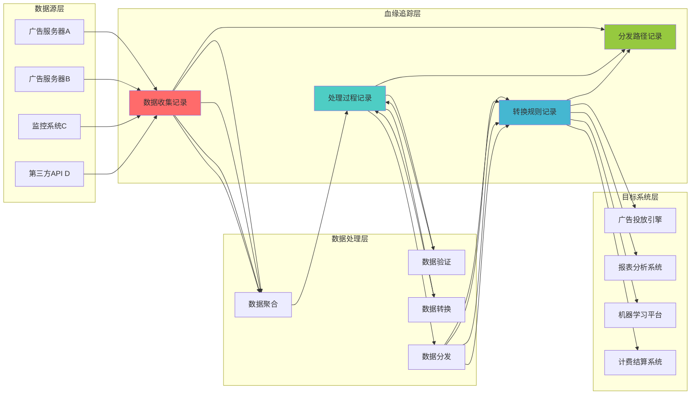
```mermaid
graph LR
    subgraph "数据源层"
        A1[广告服务器A]
        A2[广告服务器B]
        A3[监控系统C]
        A4[第三方API D]
    end
    
    subgraph "血缘追踪层"
        B1[数据收集记录]
        B2[处理过程记录]
        B3[转换规则记录]
        B4[分发路径记录]
    end
    
    subgraph "数据处理层"
        C1[数据聚合]
        C2[数据验证]
        C3[数据转换]
        C4[数据分发]
    end
    
    subgraph "目标系统层"
        D1[广告投放引擎]
        D2[报表分析系统]
        D3[机器学习平台]
        D4[计费结算系统]
    end
    
    A1 --> B1 --> C1
    A2 --> B1 --> C1
    A3 --> B1 --> C1
    A4 --> B1 --> C1
    
    C1 --> B2 --> C2
    C2 --> B2 --> C3
    C3 --> B2 --> C4
    
    C4 --> B3 --> D1
    C4 --> B3 --> D2
    C4 --> B3 --> D3
    C4 --> B3 --> D4
    
    B1 --> B4
    B2 --> B4
    B3 --> B4
    
    style B1 fill:#ff6b6b
    style B2 fill:#4ecdc4
    style B3 fill:#45b7d1
    style B4 fill:#96c93f
```

## 3. 数据处理架构设计

### 3.1 流式处理与批处理架构

#### 3.1.1 Lambda架构实现设计

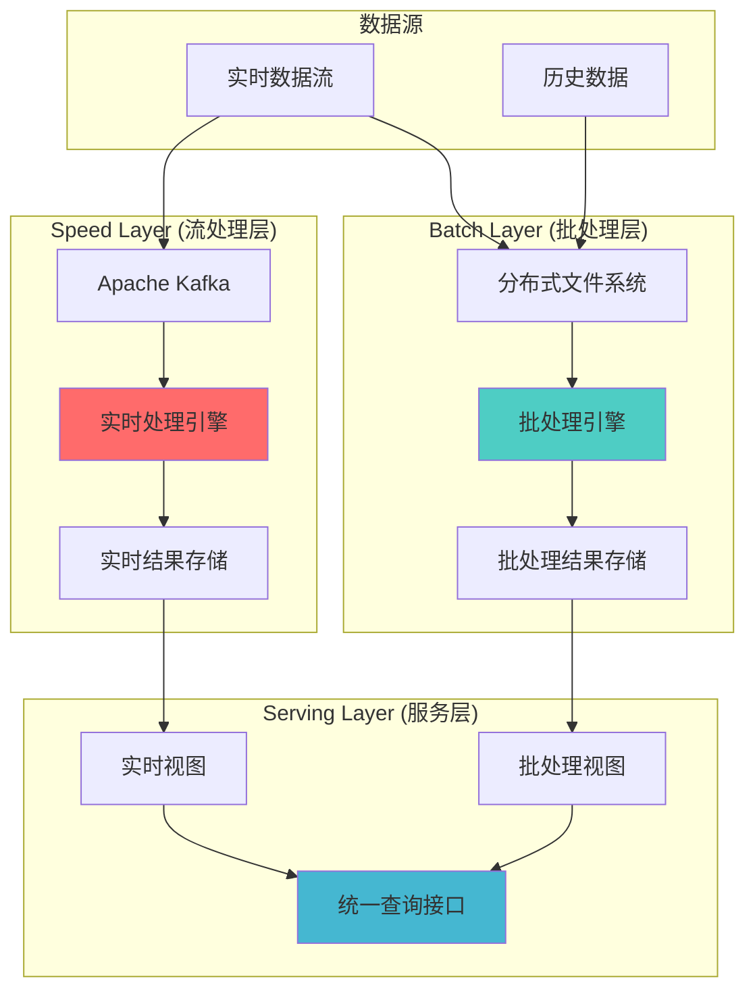
```mermaid
graph TB
    subgraph "数据源"
        A[实时数据流]
        B[历史数据]
    end
    
    subgraph "Speed Layer (流处理层)"
        C[Apache Kafka]
        D[实时处理引擎]
        E[实时结果存储]
    end
    
    subgraph "Batch Layer (批处理层)"
        F[分布式文件系统]
        G[批处理引擎]
        H[批处理结果存储]
    end
    
    subgraph "Serving Layer (服务层)"
        I[实时视图]
        J[批处理视图]
        K[统一查询接口]
    end
    
    A --> C
    A --> F
    B --> F
    
    C --> D
    D --> E
    
    F --> G
    G --> H
    
    E --> I
    H --> J
    I --> K
    J --> K
    
    style D fill:#ff6b6b
    style G fill:#4ecdc4
    style K fill:#45b7d1
```

#### 3.1.2 数据处理管道设计

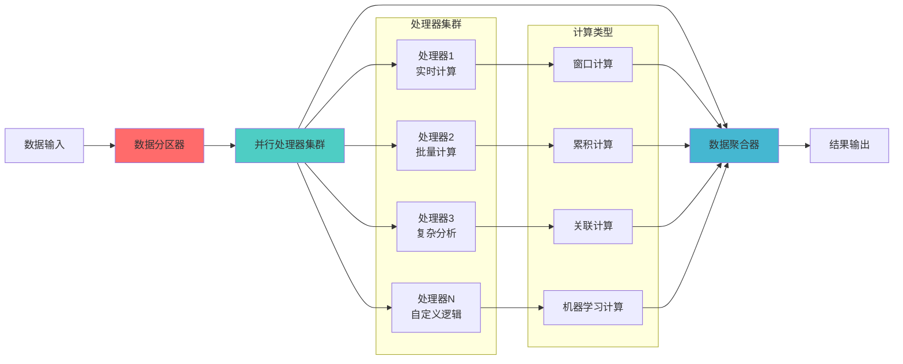
```mermaid
flowchart LR
    A[数据输入] --> B[数据分区器]
    B --> C[并行处理器集群]
    C --> D[数据聚合器]
    D --> E[结果输出]
    
    subgraph "处理器集群"
        F[处理器1<br/>实时计算]
        G[处理器2<br/>批量计算]
        H[处理器3<br/>复杂分析]
        I[处理器N<br/>自定义逻辑]
    end
    
    subgraph "计算类型"
        J[窗口计算]
        K[累积计算]
        L[关联计算]
        M[机器学习计算]
    end
    
    C --> F
    C --> G
    C --> H
    C --> I
    
    F --> J
    G --> K
    H --> L
    I --> M
    
    J --> D
    K --> D
    L --> D
    M --> D
    
    style B fill:#ff6b6b
    style C fill:#4ecdc4
    style D fill:#45b7d1
```

### 3.2 数据转换与计算设计

#### 3.2.1 ETL流程设计

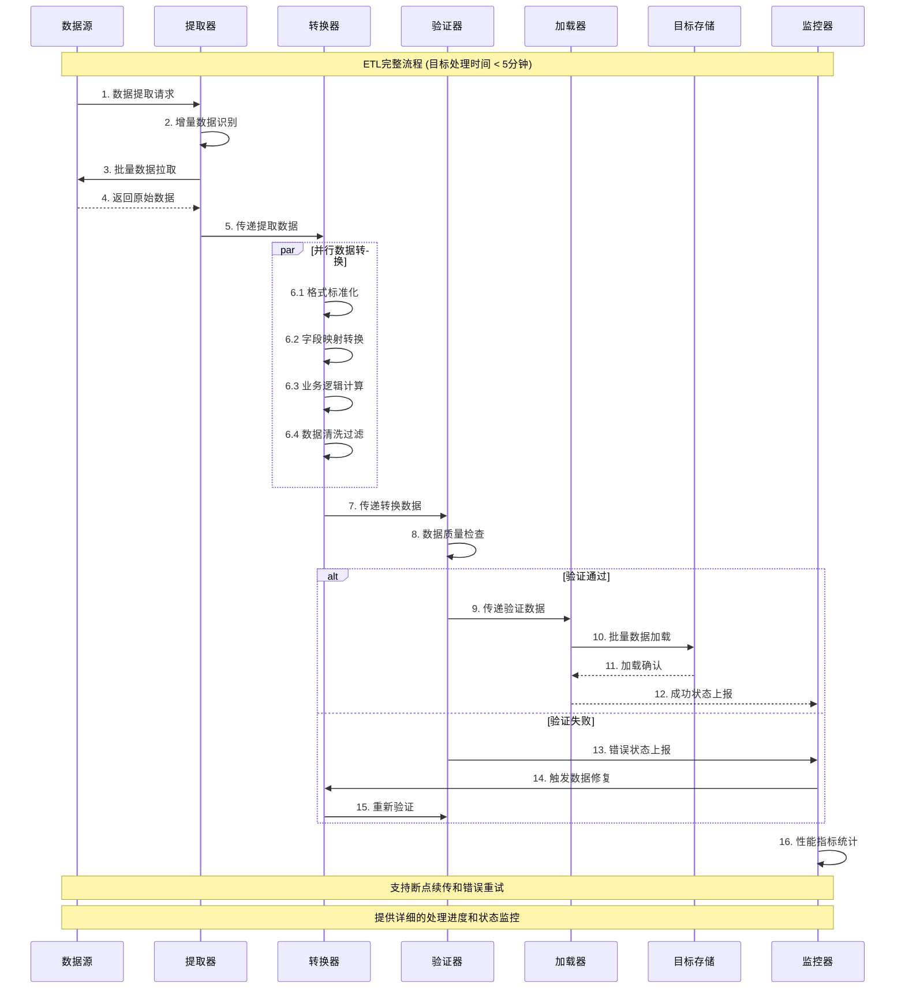
```mermaid
sequenceDiagram
    participant Source as 数据源
    participant Extractor as 提取器
    participant Transformer as 转换器
    participant Validator as 验证器
    participant Loader as 加载器
    participant Target as 目标存储
    participant Monitor as 监控器
    
    Note over Source,Monitor: ETL完整流程 (目标处理时间 < 5分钟)
    
    Source->>Extractor: 1. 数据提取请求
    Extractor->>Extractor: 2. 增量数据识别
    Extractor->>Source: 3. 批量数据拉取
    Source-->>Extractor: 4. 返回原始数据
    
    Extractor->>Transformer: 5. 传递提取数据
    
    par 并行数据转换
        Transformer->>Transformer: 6.1 格式标准化
        Transformer->>Transformer: 6.2 字段映射转换
        Transformer->>Transformer: 6.3 业务逻辑计算
        Transformer->>Transformer: 6.4 数据清洗过滤
    end
    
    Transformer->>Validator: 7. 传递转换数据
    Validator->>Validator: 8. 数据质量检查
    
    alt 验证通过
        Validator->>Loader: 9. 传递验证数据
        Loader->>Target: 10. 批量数据加载
        Target-->>Loader: 11. 加载确认
        Loader-->>Monitor: 12. 成功状态上报
    else 验证失败
        Validator->>Monitor: 13. 错误状态上报
        Monitor->>Transformer: 14. 触发数据修复
        Transformer->>Validator: 15. 重新验证
    end
    
    Monitor->>Monitor: 16. 性能指标统计
    
    Note over Source,Monitor: 支持断点续传和错误重试
    Note over Source,Monitor: 提供详细的处理进度和状态监控
```

#### 3.2.2 计算引擎架构设计

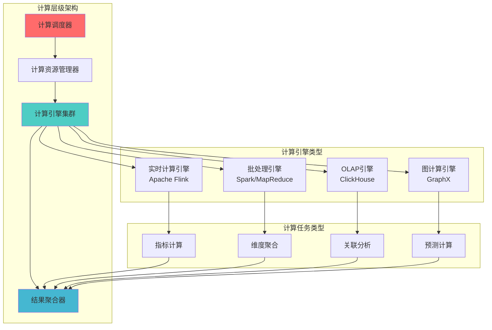
```mermaid
graph TB
    subgraph "计算层级架构"
        A[计算调度器]
        B[计算资源管理器]
        C[计算引擎集群]
        D[结果聚合器]
    end
    
    subgraph "计算引擎类型"
        E[实时计算引擎<br/>Apache Flink]
        F[批处理引擎<br/>Spark/MapReduce]
        G[OLAP引擎<br/>ClickHouse]
        H[图计算引擎<br/>GraphX]
    end
    
    subgraph "计算任务类型"
        I[指标计算]
        J[维度聚合]
        K[关联分析]
        L[预测计算]
    end
    
    A --> B
    B --> C
    C --> D
    
    C --> E
    C --> F
    C --> G
    C --> H
    
    E --> I
    F --> J
    G --> K
    H --> L
    
    I --> D
    J --> D
    K --> D
    L --> D
    
    style A fill:#ff6b6b
    style C fill:#4ecdc4
    style D fill:#45b7d1
```

## 4. 数据存储架构设计

### 4.1 分层存储架构设计

#### 4.1.1 存储层级与策略

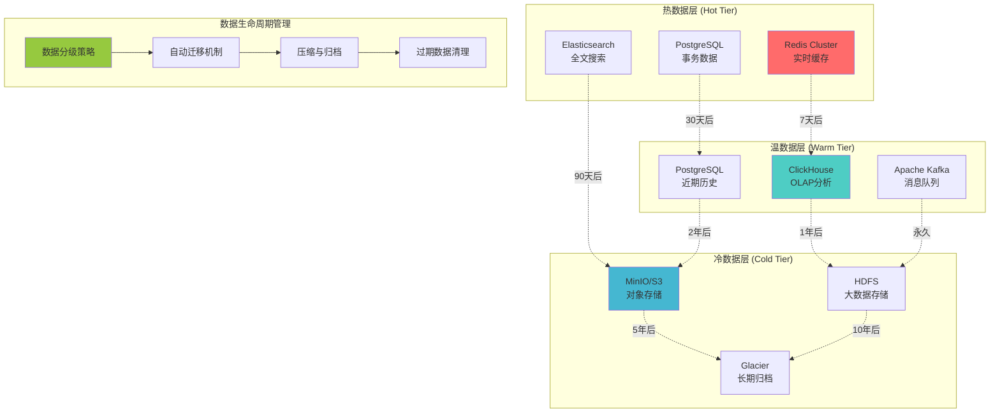
```mermaid
graph TB
    subgraph "热数据层 (Hot Tier)"
        A1[Redis Cluster<br/>实时缓存]
        A2[PostgreSQL<br/>事务数据]
        A3[Elasticsearch<br/>全文搜索]
    end
    
    subgraph "温数据层 (Warm Tier)"
        B1[ClickHouse<br/>OLAP分析]
        B2[PostgreSQL<br/>近期历史]
        B3[Apache Kafka<br/>消息队列]
    end
    
    subgraph "冷数据层 (Cold Tier)"
        C1[MinIO/S3<br/>对象存储]
        C2[HDFS<br/>大数据存储]
        C3[Glacier<br/>长期归档]
    end
    
    subgraph "数据生命周期管理"
        D1[数据分级策略]
        D2[自动迁移机制]
        D3[压缩与归档]
        D4[过期数据清理]
    end
    
    A1 -.->|7天后| B1
    A2 -.->|30天后| B2
    A3 -.->|90天后| C1
    
    B1 -.->|1年后| C2
    B2 -.->|2年后| C1
    B3 -.->|永久| C2
    
    C1 -.->|5年后| C3
    C2 -.->|10年后| C3
    
    D1 --> D2
    D2 --> D3
    D3 --> D4
    
    style A1 fill:#ff6b6b
    style B1 fill:#4ecdc4
    style C1 fill:#45b7d1
    style D1 fill:#96c93f
```

#### 4.1.2 数据分区与索引策略

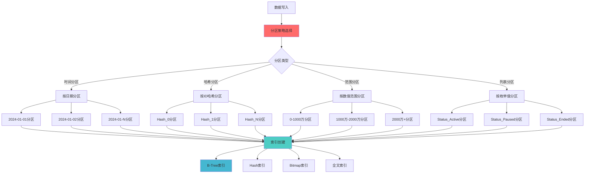
```mermaid
flowchart TD
    A[数据写入] --> B[分区策略选择]
    B --> C{分区类型}
    
    C -->|时间分区| D[按日期分区]
    C -->|哈希分区| E[按ID哈希分区]
    C -->|范围分区| F[按数值范围分区]
    C -->|列表分区| G[按枚举值分区]
    
    D --> H[2024-01-01分区]
    D --> I[2024-01-02分区]
    D --> J[2024-01-N分区]
    
    E --> K[Hash_0分区]
    E --> L[Hash_1分区]
    E --> M[Hash_N分区]
    
    F --> N[0-1000万分区]
    F --> O[1000万-2000万分区]
    F --> P[2000万+分区]
    
    G --> Q[Status_Active分区]
    G --> R[Status_Paused分区]
    G --> S[Status_Ended分区]
    
    H --> T[索引创建]
    I --> T
    J --> T
    K --> T
    L --> T
    M --> T
    N --> T
    O --> T
    P --> T
    Q --> T
    R --> T
    S --> T
    
    T --> U[B-Tree索引]
    T --> V[Hash索引]
    T --> W[Bitmap索引]
    T --> X[全文索引]
    
    style B fill:#ff6b6b
    style T fill:#4ecdc4
    style U fill:#45b7d1
```

### 4.2 数据一致性保证设计

#### 4.2.1 分布式一致性架构

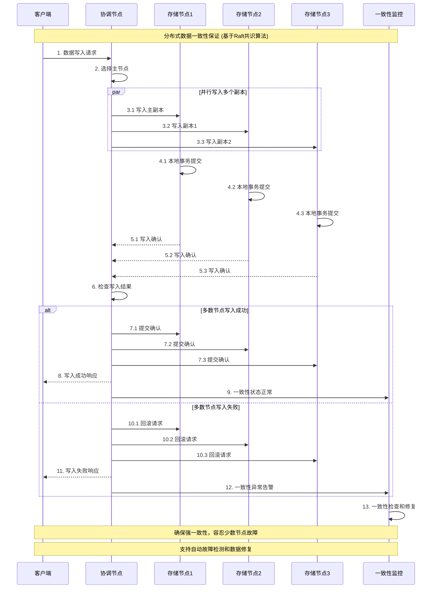
```mermaid
sequenceDiagram
    participant Client as 客户端
    participant Coordinator as 协调节点
    participant Node1 as 存储节点1
    participant Node2 as 存储节点2
    participant Node3 as 存储节点3
    participant Monitor as 一致性监控
    
    Note over Client,Monitor: 分布式数据一致性保证 (基于Raft共识算法)
    
    Client->>Coordinator: 1. 数据写入请求
    Coordinator->>Coordinator: 2. 选择主节点
    
    par 并行写入多个副本
        Coordinator->>Node1: 3.1 写入主副本
        Coordinator->>Node2: 3.2 写入副本1
        Coordinator->>Node3: 3.3 写入副本2
    end
    
    Node1->>Node1: 4.1 本地事务提交
    Node2->>Node2: 4.2 本地事务提交
    Node3->>Node3: 4.3 本地事务提交
    
    Node1-->>Coordinator: 5.1 写入确认
    Node2-->>Coordinator: 5.2 写入确认
    Node3-->>Coordinator: 5.3 写入确认
    
    Coordinator->>Coordinator: 6. 检查写入结果
    
    alt 多数节点写入成功
        Coordinator->>Node1: 7.1 提交确认
        Coordinator->>Node2: 7.2 提交确认
        Coordinator->>Node3: 7.3 提交确认
        Coordinator-->>Client: 8. 写入成功响应
        Coordinator->>Monitor: 9. 一致性状态正常
    else 多数节点写入失败
        Coordinator->>Node1: 10.1 回滚请求
        Coordinator->>Node2: 10.2 回滚请求
        Coordinator->>Node3: 10.3 回滚请求
        Coordinator-->>Client: 11. 写入失败响应
        Coordinator->>Monitor: 12. 一致性异常告警
    end
    
    Monitor->>Monitor: 13. 一致性检查和修复
    
    Note over Client,Monitor: 确保强一致性，容忍少数节点故障
    Note over Client,Monitor: 支持自动故障检测和数据修复
```

#### 4.2.2 最终一致性设计

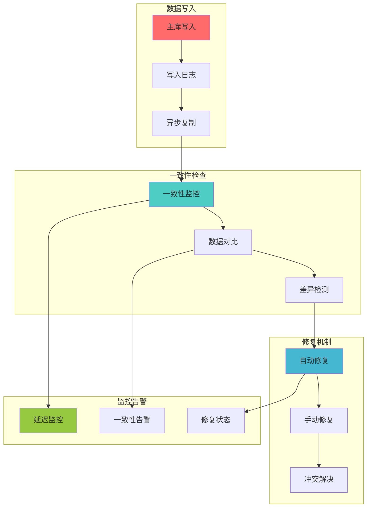
```mermaid
graph TB
    subgraph "数据写入"
        A[主库写入]
        B[写入日志]
        C[异步复制]
    end
    
    subgraph "一致性检查"
        D[一致性监控]
        E[数据对比]
        F[差异检测]
    end
    
    subgraph "修复机制"
        G[自动修复]
        H[手动修复]
        I[冲突解决]
    end
    
    subgraph "监控告警"
        J[延迟监控]
        K[一致性告警]
        L[修复状态]
    end
    
    A --> B
    B --> C
    C --> D
    
    D --> E
    E --> F
    F --> G
    
    G --> H
    H --> I
    
    D --> J
    E --> K
    G --> L
    
    style A fill:#ff6b6b
    style D fill:#4ecdc4
    style G fill:#45b7d1
    style J fill:#96c93f
```

## 5. 数据分发架构设计

### 5.1 实时分发与批量分发设计

#### 5.1.1 混合分发架构

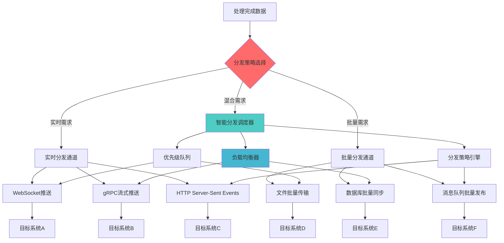
```mermaid
flowchart TD
    A[处理完成数据] --> B{分发策略选择}
    
    B -->|实时需求| C[实时分发通道]
    B -->|批量需求| D[批量分发通道]
    B -->|混合需求| E[智能分发调度器]
    
    C --> F[WebSocket推送]
    C --> G[gRPC流式推送]
    C --> H[HTTP Server-Sent Events]
    
    D --> I[文件批量传输]
    D --> J[数据库批量同步]
    D --> K[消息队列批量发布]
    
    E --> L[优先级队列]
    E --> M[负载均衡器]
    E --> N[分发策略引擎]
    
    F --> O[目标系统A]
    G --> P[目标系统B]
    H --> Q[目标系统C]
    I --> R[目标系统D]
    J --> S[目标系统E]
    K --> T[目标系统F]
    
    L --> F
    L --> I
    M --> G
    M --> J
    N --> H
    N --> K
    
    style B fill:#ff6b6b
    style E fill:#4ecdc4
    style M fill:#45b7d1
```

#### 5.1.2 分发可靠性保证设计

```mermaid
sequenceDiagram
    participant Distributor as 分发器
    participant DeliveryService as 投递服务
    participant RetryManager as 重试管理器
    participant DeadLetterQueue as 死信队列
    participant TargetSystem as 目标系统
    participant Monitor as 分发监控
    
    Note over Distributor,Monitor: 可靠数据分发流程
    
    Distributor->>DeliveryService: 1. 数据分发请求
    DeliveryService->>TargetSystem: 2. 数据投递
    
    alt 投递成功
        TargetSystem-->>DeliveryService: 3. 成功确认
        DeliveryService-->>Distributor: 4. 投递成功通知
        DeliveryService->>Monitor: 5. 成功指标上报
    else 投递失败
        TargetSystem-->>DeliveryService: 6. 失败响应/超时
        DeliveryService->>RetryManager: 7. 触发重试机制
        
        loop 重试循环
            RetryManager->>RetryManager: 8. 计算退避延迟
            RetryManager->>DeliveryService: 9. 重新投递
            DeliveryService->>TargetSystem: 10. 再次投递
            
            alt 重试成功
                TargetSystem-->>DeliveryService: 11. 成功确认
                DeliveryService-->>RetryManager: 12. 重试成功
                RetryManager-->>Distributor: 13. 最终成功通知
                break 重试结束
            else 重试仍失败且未达最大次数
                TargetSystem-->>DeliveryService: 14. 失败响应
                Note over RetryManager: 继续重试循环
            else 达到最大重试次数
                DeliveryService->>DeadLetterQueue: 15. 移入死信队列
                DeadLetterQueue->>Monitor: 16. 死信告警
                RetryManager-->>Distributor: 17. 最终失败通知
                break 重试结束
            end
        end
    end
    
    Monitor->>Monitor: 18. 分发指标统计
    
    Note over Distributor,Monitor: 支持指数退避重试策略
    Note over Distributor,Monitor: 提供死信队列人工干预机制
```

### 5.2 事件驱动分发设计

#### 5.2.1 事件分发架构

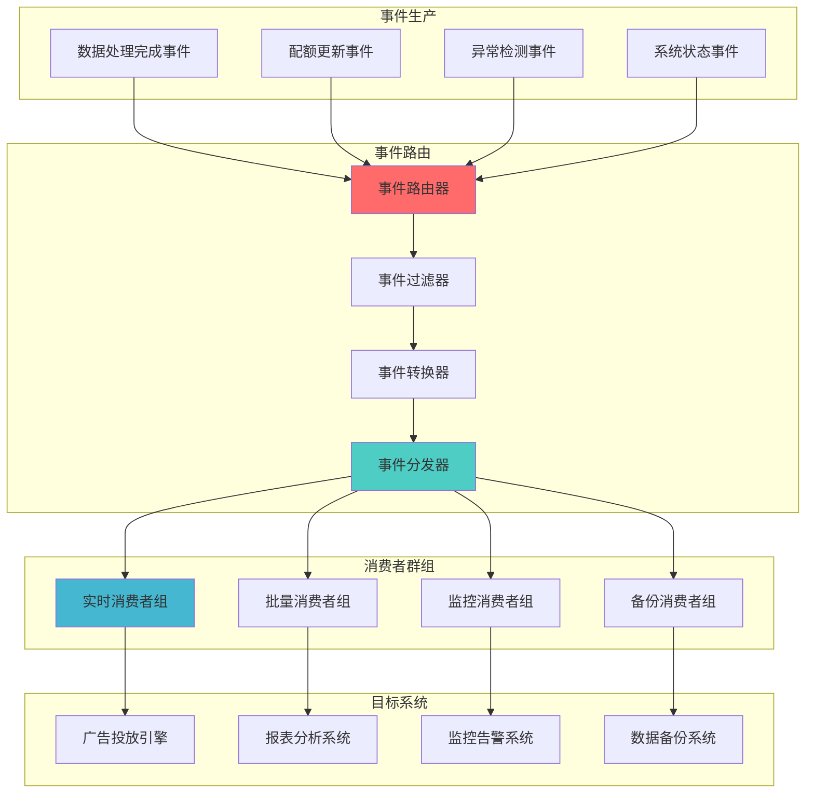
```mermaid
graph TB
    subgraph "事件生产"
        A[数据处理完成事件]
        B[配额更新事件]
        C[异常检测事件]
        D[系统状态事件]
    end
    
    subgraph "事件路由"
        E[事件路由器]
        F[事件过滤器]
        G[事件转换器]
        H[事件分发器]
    end
    
    subgraph "消费者群组"
        I[实时消费者组]
        J[批量消费者组]
        K[监控消费者组]
        L[备份消费者组]
    end
    
    subgraph "目标系统"
        M[广告投放引擎]
        N[报表分析系统]
        O[监控告警系统]
        P[数据备份系统]
    end
    
    A --> E
    B --> E
    C --> E
    D --> E
    
    E --> F
    F --> G
    G --> H
    
    H --> I
    H --> J
    H --> K
    H --> L
    
    I --> M
    J --> N
    K --> O
    L --> P
    
    style E fill:#ff6b6b
    style H fill:#4ecdc4
    style I fill:#45b7d1
```

#### 5.2.2 事件溯源与回放设计

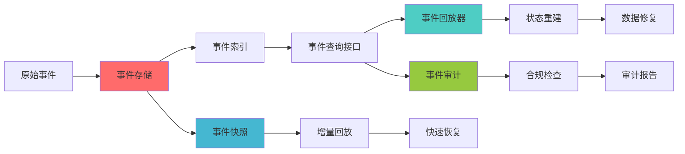
```mermaid
flowchart LR
    A[原始事件] --> B[事件存储]
    B --> C[事件索引]
    C --> D[事件查询接口]
    
    D --> E[事件回放器]
    E --> F[状态重建]
    F --> G[数据修复]
    
    B --> H[事件快照]
    H --> I[增量回放]
    I --> J[快速恢复]
    
    D --> K[事件审计]
    K --> L[合规检查]
    L --> M[审计报告]
    
    style B fill:#ff6b6b
    style E fill:#4ecdc4
    style H fill:#45b7d1
    style K fill:#96c93f
```

## 6. 性能优化设计

### 6.1 数据处理性能优化

#### 6.1.1 并行处理优化架构

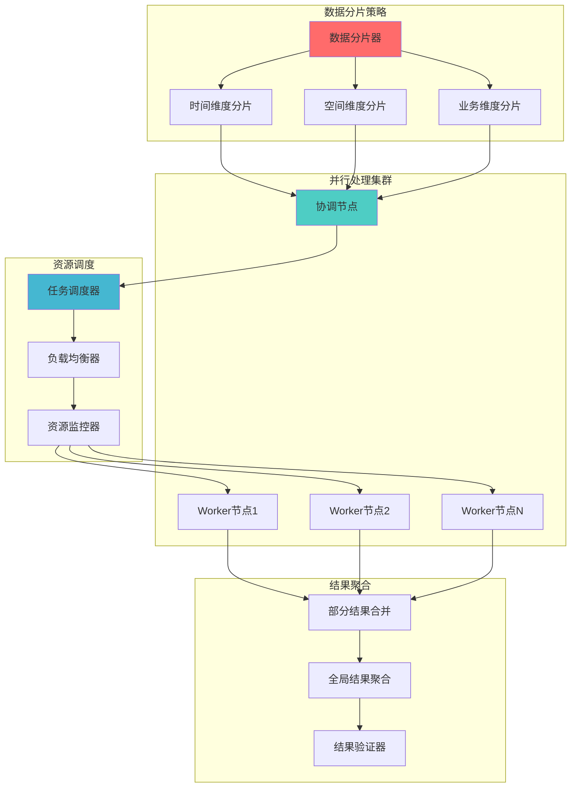
```mermaid
graph TB
    subgraph "数据分片策略"
        A[数据分片器]
        B[时间维度分片]
        C[空间维度分片]
        D[业务维度分片]
    end
    
    subgraph "并行处理集群"
        E[Worker节点1]
        F[Worker节点2]
        G[Worker节点N]
        H[协调节点]
    end
    
    subgraph "资源调度"
        I[任务调度器]
        J[负载均衡器]
        K[资源监控器]
    end
    
    subgraph "结果聚合"
        L[部分结果合并]
        M[全局结果聚合]
        N[结果验证器]
    end
    
    A --> B
    A --> C
    A --> D
    
    B --> H
    C --> H
    D --> H
    
    H --> I
    I --> J
    J --> K
    
    K --> E
    K --> F
    K --> G
    
    E --> L
    F --> L
    G --> L
    
    L --> M
    M --> N
    
    style A fill:#ff6b6b
    style H fill:#4ecdc4
    style I fill:#45b7d1
```

#### 6.1.2 缓存优化策略

```mermaid
flowchart TD
    A[数据请求] --> B{缓存层级检查}
    
    B -->|L1命中| C[进程内缓存]
    B -->|L1未命中| D{L2缓存检查}
    
    D -->|L2命中| E[Redis分布式缓存]
    D -->|L2未命中| F{L3缓存检查}
    
    F -->|L3命中| G[数据库查询缓存]
    F -->|L3未命中| H[原始数据源]
    
    C --> I[返回结果]
    E --> J[更新L1缓存]
    G --> K[更新L2缓存]
    H --> L[更新所有缓存层]
    
    J --> I
    K --> J
    L --> K
    
    I --> M[缓存命中率统计]
    
    subgraph "缓存策略"
        N[LRU淘汰策略]
        O[TTL过期策略]
        P[预热策略]
        Q[一致性策略]
    end
    
    M --> N
    M --> O
    M --> P
    M --> Q
    
    style B fill:#ff6b6b
    style E fill:#4ecdc4
    style H fill:#45b7d1
```

### 6.2 存储性能优化

#### 6.2.1 读写优化设计

```mermaid
graph TB
    subgraph "写入优化"
        A[批量写入]
        B[异步写入]
        C[写入缓冲区]
        D[压缩存储]
    end
    
    subgraph "读取优化"
        E[索引优化]
        F[分区裁剪]
        G[列式存储]
        H[预聚合]
    end
    
    subgraph "存储引擎优化"
        I[LSM-Tree]
        J[B+ Tree]
        K[Column Store]
        L[Time Series]
    end
    
    subgraph "硬件优化"
        M[SSD存储]
        N[内存缓存]
        O[网络优化]
        P[CPU并行]
    end
    
    A --> I
    B --> I
    C --> J
    D --> K
    
    E --> J
    F --> K
    G --> K
    H --> L
    
    I --> M
    J --> N
    K --> O
    L --> P
    
    style A fill:#ff6b6b
    style E fill:#4ecdc4
    style I fill:#45b7d1
    style M fill:#96c93f
```

## 7. 监控与运维设计

### 7.1 数据流程监控设计

#### 7.1.1 全链路监控架构

```mermaid
graph TB
    subgraph "监控数据收集"
        A[应用指标收集]
        B[系统指标收集]
        C[业务指标收集]
        D[自定义指标收集]
    end
    
    subgraph "指标处理"
        E[指标聚合]
        F[指标计算]
        G[异常检测]
        H[趋势分析]
    end
    
    subgraph "存储与查询"
        I[时序数据库]
        J[指标查询引擎]
        K[历史数据归档]
    end
    
    subgraph "可视化与告警"
        L[实时仪表盘]
        M[历史趋势图]
        N[告警规则引擎]
        O[通知分发系统]
    end
    
    A --> E
    B --> E
    C --> F
    D --> F
    
    E --> G
    F --> G
    G --> H
    
    E --> I
    F --> I
    H --> I
    
    I --> J
    J --> K
    
    J --> L
    J --> M
    G --> N
    N --> O
    
    style A fill:#ff6b6b
    style E fill:#4ecdc4
    style I fill:#45b7d1
    style N fill:#96c93f
```

#### 7.1.2 关键指标监控设计

**业务指标监控**：

```mermaid
graph LR
    subgraph "数据质量指标"
        A1[数据完整性率]
        A2[数据准确性率]
        A3[数据及时性]
        A4[数据一致性]
    end
    
    subgraph "处理性能指标"
        B1[处理延迟]
        B2[处理吞吐量]
        B3[错误率]
        B4[重试率]
    end
    
    subgraph "系统资源指标"
        C1[CPU使用率]
        C2[内存使用率]
        C3[磁盘I/O]
        C4[网络带宽]
    end
    
    subgraph "业务影响指标"
        D1[SLA达成率]
        D2[用户满意度]
        D3[业务价值实现]
        D4[成本效益比]
    end
    
    A1 --> E[综合质量评分]
    A2 --> E
    A3 --> E
    A4 --> E
    
    B1 --> F[性能健康评分]
    B2 --> F
    B3 --> F
    B4 --> F
    
    C1 --> G[资源健康评分]
    C2 --> G
    C3 --> G
    C4 --> G
    
    D1 --> H[业务价值评分]
    D2 --> H
    D3 --> H
    D4 --> H
    
    E --> I[数据流程健康度]
    F --> I
    G --> I
    H --> I
    
    style E fill:#ff6b6b
    style F fill:#4ecdc4
    style G fill:#45b7d1
    style I fill:#96c93f
```

### 7.2 故障处理与恢复设计

#### 7.2.1 故障检测与响应架构

```mermaid
stateDiagram-v2
    [*] --> Normal: 系统正常运行
    
    Normal --> Monitoring: 持续监控
    Monitoring --> Normal: 指标正常
    Monitoring --> AlertTriggered: 异常检测
    
    AlertTriggered --> Investigating: 开始调查
    AlertTriggered --> AutoHealing: 自动修复
    
    Investigating --> ManualIntervention: 需要人工干预
    Investigating --> AutoHealing: 可自动修复
    
    AutoHealing --> HealingInProgress: 修复中
    HealingInProgress --> Normal: 修复成功
    HealingInProgress --> Failed: 修复失败
    
    Failed --> ManualIntervention: 升级处理
    ManualIntervention --> HumanFixing: 人工修复中
    HumanFixing --> Normal: 修复完成
    HumanFixing --> Escalation: 升级处理
    
    Escalation --> ExpertIntervention: 专家介入
    ExpertIntervention --> Normal: 问题解决
    ExpertIntervention --> SystemShutdown: 系统停机
    
    SystemShutdown --> Maintenance: 维护模式
    Maintenance --> Normal: 维护完成
    
    note right of Monitoring
        监控内容包括：
        - 数据流量异常
        - 处理延迟超限
        - 错误率飙升
        - 资源使用异常
    end note
    
    note right of AutoHealing
        自动修复包括：
        - 服务重启
        - 流量切换
        - 资源扩容
        - 缓存清理
    end note
```

#### 7.2.2 灾难恢复设计

```mermaid
flowchart TD
    A[灾难检测] --> B{灾难类型}
    
    B -->|数据损坏| C[数据恢复流程]
    B -->|服务故障| D[服务恢复流程]
    B -->|网络中断| E[网络恢复流程]
    B -->|机房故障| F[跨域切换流程]
    
    C --> C1[备份数据验证]
    C1 --> C2[增量数据恢复]
    C2 --> C3[数据一致性检查]
    C3 --> G[恢复完成]
    
    D --> D1[服务健康检查]
    D1 --> D2[服务实例重启]
    D2 --> D3[负载重新分配]
    D3 --> G
    
    E --> E1[网络连通性测试]
    E1 --> E2[备用网络启用]
    E2 --> E3[路由重新配置]
    E3 --> G
    
    F --> F1[异地数据中心激活]
    F1 --> F2[DNS切换]
    F2 --> F3[数据同步验证]
    F3 --> G
    
    G --> H[业务功能验证]
    H --> I[恢复完成通知]
    
    style A fill:#ff6b6b
    style G fill:#4ecdc4
    style I fill:#45b7d1
```

---

本数据流程技术设计为广告调度服务的数据处理提供了完整的技术架构，涵盖数据收集、处理、存储、分发的全生命周期管理，确保数据的实时性、准确性和可靠性。
