# 广告调度服务调度策略技术设计

## 1. 调度策略核心技术架构

### 1.1 技术设计目标

广告调度策略系统是广告投放引擎的核心决策组件，专注于实现高性能、智能化的广告调度决策。技术设计目标如下：

- **超低延迟响应**：单次调度决策响应时间 ≤ 50ms，满足OpenRTB协议要求的100ms内响应
- **高并发处理能力**：支持单机10万QPS的调度决策请求，集群模式下支持百万级QPS
- **智能决策算法**：集成机器学习模型，实现CTR/CVR预估、出价优化、流量分配等智能决策
- **策略动态配置**：支持策略参数的热更新，无需重启服务即可调整调度策略
- **多维度优化**：同时优化收益、填充率、用户体验多个维度的KPI指标
- **故障自愈能力**：具备策略降级、异常检测、自动恢复等容错机制

### 1.2 核心技术架构设计

#### 1.2.1 系统架构C4模型

**Context Level（上下文层级）**


**Container Level（容器层级）**


#### 1.2.2 调度策略分层架构


## 2. 核心调度策略算法设计

### 2.1 策略类型与技术特征

#### 2.1.1 实时竞价调度策略（RTB Strategy）

**技术特征**：

- 响应时间：< 50ms (OpenRTB协议要求)
- 并发处理：支持单机50k QPS
- 决策算法：基于CTR/CVR预估的智能出价
- 数据依赖：实时用户画像、广告创意特征、媒体上下文

**核心算法组件**：


#### 2.1.2 保量广告调度策略（Guaranteed Strategy）

**技术特征**：

- 投放保证：100%完成量级目标
- 节奏控制：平滑投放，避免流量突发
- 预算管理：实时预算监控和分配
- 优先级管理：支持多级优先级调度

**调度算法流程**：


#### 2.1.3 智能流量分配策略（Traffic Allocation Strategy）

**技术特征**：

- 多维优化：收益、填充率、用户体验多目标优化
- 动态调整：基于实时数据动态调整分配权重
- A/B测试：支持策略的在线实验和效果评估
- 长期学习：基于历史数据的长期效果优化

**分配算法架构**：


### 2.2 调度决策引擎核心设计

#### 2.2.1 决策流程序列图


#### 2.2.2 决策引擎状态机设计


## 3. 核心组件类图设计

### 3.1 策略引擎核心类图

```mermaid
classDiagram
    class IScheduleStrategyEngine {
        <<interface>>
        +ExecuteAsync(context: ScheduleContext) : Task~ScheduleDecision~
        +ValidateContext(context: ScheduleContext) : ValidationResult
        +GetSupportedStrategies() : IEnumerable~StrategyType~
        +GetEngineStatus() : EngineStatus
    }
    
    class ScheduleStrategyEngine {
        -IFeatureExtractionService featureService
        -IModelInferenceService modelService
        -IConfigurationService configService
        -IPerformanceMonitor monitor
        -ICacheService cache
        +ExecuteAsync(context: ScheduleContext) : Task~ScheduleDecision~
        +ValidateContext(context: ScheduleContext) : ValidationResult
        -SelectStrategy(context: ScheduleContext) : IScheduleStrategy
        -ExecuteStrategy(strategy: IScheduleStrategy, context: ScheduleContext) : Task~ScheduleDecision~
        -HandleException(ex: Exception, context: ScheduleContext) : ScheduleDecision
    }
    
    class IScheduleStrategy {
        <<interface>>
        +Name : string
        +Priority : int
        +IsEnabled : bool
        +SupportedScenarios : IEnumerable~ScenarioType~
        +ExecuteAsync(context: ScheduleContext, config: StrategyConfig) : Task~ScheduleDecision~
        +CanHandle(context: ScheduleContext) : bool
        +GetRequiredFeatures() : IEnumerable~FeatureType~
    }
    
    class RTBScheduleStrategy {
        -ICTRModel ctrModel
        -ICVRModel cvrModel
        -IBidCalculator bidCalculator
        +ExecuteAsync(context: ScheduleContext, config: StrategyConfig) : Task~ScheduleDecision~
        +CanHandle(context: ScheduleContext) : bool
        -CalculateBid(ctr: double, cvr: double, config: RTBConfig) : BidAmount
        -ValidateOpenRTBRequest(request: BidRequest) : bool
    }
    
    class GuaranteedScheduleStrategy {
        -IBudgetService budgetService
        -IPacingService pacingService
        -IInventoryService inventoryService
        +ExecuteAsync(context: ScheduleContext, config: StrategyConfig) : Task~ScheduleDecision~
        +CanHandle(context: ScheduleContext) : bool
        -CheckBudgetAvailability(campaignId: string) : BudgetStatus
        -CalculatePacingRate(campaign: Campaign) : double
    }
    
    class TrafficAllocationStrategy {
        -IExperimentService experimentService
        -IAllocationOptimizer optimizer
        -IEffectTracker effectTracker
        +ExecuteAsync(context: ScheduleContext, config: StrategyConfig) : Task~ScheduleDecision~
        +CanHandle(context: ScheduleContext) : bool
        -OptimizeAllocation(request: AllocationRequest) : AllocationResult
        -TrackEffect(decision: ScheduleDecision) : void
    }
    
    IScheduleStrategyEngine <|-- ScheduleStrategyEngine
    IScheduleStrategy <|-- RTBScheduleStrategy
    IScheduleStrategy <|-- GuaranteedScheduleStrategy
    IScheduleStrategy <|-- TrafficAllocationStrategy
    
    ScheduleStrategyEngine *-- IFeatureExtractionService
    ScheduleStrategyEngine *-- IModelInferenceService
    ScheduleStrategyEngine --> ScheduleContext
    ScheduleStrategyEngine --> ScheduleDecision
```



### 3.2 特征工程组件类图


### 3.3 模型推理组件类图


## 4. 数据结构与接口设计

### 4.1 核心数据结构

#### 4.1.1 调度上下文数据结构

**ScheduleContext** - 调度决策的输入上下文

```csharp
public class ScheduleContext
{
    public string RequestId { get; set; }
    public DateTime Timestamp { get; set; }
    public RequestType RequestType { get; set; }
    public UserProfile UserProfile { get; set; }
    public AdSlotInfo AdSlotInfo { get; set; }
    public MediaContext MediaContext { get; set; }
    public BudgetConstraints BudgetConstraints { get; set; }
    public TargetingCriteria TargetingCriteria { get; set; }
    public PerformanceMetrics PerformanceMetrics { get; set; }
    public Dictionary<string, object> ExternalData { get; set; }
}
```

#### 4.1.2 决策结果数据结构

**ScheduleDecision** - 调度决策的输出结果

```csharp
public class ScheduleDecision
{
    public string DecisionId { get; set; }
    public string Strategy { get; set; }
    public double Confidence { get; set; }
    public TimeSpan ExecutionTime { get; set; }
    public IEnumerable<AdSelection> SelectedAds { get; set; }
    public decimal? BidAmount { get; set; }
    public double? AllocationWeight { get; set; }
    public string ReasonCode { get; set; }
    public DateTime? NextScheduleTime { get; set; }
    public PerformancePrediction PerformancePrediction { get; set; }
    public Dictionary<string, object> Metadata { get; set; }
}
```

#### 4.1.3 特征向量数据结构

**FeatureVector** - 机器学习模型的输入特征

```csharp
public class FeatureVector
{
    public Dictionary<string, double> Features { get; set; }
    public FeatureMetadata Metadata { get; set; }
    public DateTime Timestamp { get; set; }
    public string Version { get; set; }
    
    public void AddFeature(string name, double value);
    public double? GetFeature(string name);
    public FeatureVector Normalize();
    public ValidationResult Validate();
}
```

### 4.2 核心接口设计

#### 4.2.1 策略引擎接口

```csharp
public interface IScheduleStrategyEngine
{
    Task<ScheduleDecision> ExecuteAsync(ScheduleContext context);
    ValidationResult ValidateContext(ScheduleContext context);
    IEnumerable<StrategyType> GetSupportedStrategies();
    EngineStatus GetEngineStatus();
    Task ConfigureStrategyAsync(StrategyConfiguration config);
}
```

#### 4.2.2 特征提取接口

```csharp
public interface IFeatureExtractionService
{
    Task<FeatureVector> ExtractFeaturesAsync(ScheduleContext context);
    Task<IEnumerable<FeatureVector>> ExtractBatchFeaturesAsync(IEnumerable<ScheduleContext> contexts);
    FeatureMetadata GetFeatureMetadata();
    ValidationResult ValidateFeatures(FeatureVector features);
    Task PrewarmCacheAsync(string cacheKey);
}
```

#### 4.2.3 模型推理接口

```csharp
public interface IModelInferenceService
{
    Task<T> PredictAsync<T>(ModelType modelType, FeatureVector features);
    Task<IEnumerable<T>> PredictBatchAsync<T>(ModelType modelType, IEnumerable<FeatureVector> features);
    ModelStatus GetModelStatus(ModelType modelType);
    Task<bool> ReloadModelAsync(ModelType modelType);
    ModelMetrics GetModelMetrics(ModelType modelType);
}
```

## 5. Visual Studio项目架构映射

### 5.1 项目结构设计

```text
Lorn.ADSP.sln
├── Services/
│   └── Lorn.ADSP.Services.ScheduleStrategy/
│       ├── Engines/                    # 调度引擎实现
│       │   ├── IScheduleStrategyEngine.cs
│       │   └── ScheduleStrategyEngine.cs
│       ├── Strategies/                 # 具体策略实现
│       │   ├── IScheduleStrategy.cs
│       │   ├── RTBScheduleStrategy.cs
│       │   ├── GuaranteedScheduleStrategy.cs
│       │   └── TrafficAllocationStrategy.cs
│       ├── Features/                   # 特征工程
│       │   ├── IFeatureExtractionService.cs
│       │   ├── FeatureExtractionService.cs
│       │   └── Extractors/
│       ├── Models/                     # 模型推理
│       │   ├── IModelInferenceService.cs
│       │   ├── ModelInferenceService.cs
│       │   └── Implementations/
│       ├── Configuration/              # 配置管理
│       │   ├── IConfigurationService.cs
│       │   └── ConfigurationService.cs
│       └── Infrastructure/             # 基础设施
│           ├── Caching/
│           ├── Monitoring/
│           └── Messaging/
├── Core/
│   └── Lorn.ADSP.Core.Domain/
│       └── ScheduleStrategy/           # 领域对象
│           ├── ScheduleContext.cs
│           ├── ScheduleDecision.cs
│           ├── FeatureVector.cs
│           └── ValueObjects/
└── Infrastructure/
    └── Lorn.ADSP.Infrastructure.ML/    # ML集成
        ├── TensorFlowIntegration/
        ├── ModelManagement/
        └── FeatureStore/
```

### 5.2 依赖注入配置

在 `Services/Lorn.ADSP.Services.ScheduleStrategy/` 项目中的 `ServiceCollectionExtensions.cs`：

```csharp
public static class ServiceCollectionExtensions
{
    public static IServiceCollection AddScheduleStrategy(this IServiceCollection services, IConfiguration configuration)
    {
        // 策略引擎注册
        services.AddScoped<IScheduleStrategyEngine, ScheduleStrategyEngine>();
        
        // 具体策略注册
        services.AddScoped<IScheduleStrategy, RTBScheduleStrategy>();
        services.AddScoped<IScheduleStrategy, GuaranteedScheduleStrategy>();
        services.AddScoped<IScheduleStrategy, TrafficAllocationStrategy>();
        
        // 特征工程服务注册
        services.AddScoped<IFeatureExtractionService, FeatureExtractionService>();
        services.AddScoped<IUserFeatureExtractor, UserFeatureExtractor>();
        services.AddScoped<IAdFeatureExtractor, AdFeatureExtractor>();
        services.AddScoped<IContextFeatureExtractor, ContextFeatureExtractor>();
        
        // 模型推理服务注册
        services.AddScoped<IModelInferenceService, ModelInferenceService>();
        services.AddScoped<IModelManager, ModelManager>();
        
        // 配置服务注册
        services.AddScoped<IConfigurationService, ConfigurationService>();
        
        // 缓存服务注册
        services.AddScoped<ICacheService, RedisCacheService>();
        
        // 性能监控注册
        services.AddScoped<IPerformanceMonitor, PerformanceMonitor>();
        
        return services;
    }
}
```

## 6. 性能优化与监控设计

### 6.1 性能优化策略

#### 6.1.1 缓存优化策略

**多级缓存架构**：


**缓存实现要求**：

- **L1内存缓存**：位于 `Services/Lorn.ADSP.Services.ScheduleStrategy/Infrastructure/Caching/MemoryCacheService.cs`
  - 缓存热点特征数据，TTL = 5分钟
  - 缓存最近模型预测结果，TTL = 1分钟
  - 实现LRU淘汰策略，最大缓存条目50,000

- **L2分布式缓存**：位于 `Infrastructure/Lorn.ADSP.Infrastructure.Caching/RedisCacheService.cs`
  - 缓存用户画像数据，TTL = 30分钟
  - 缓存广告特征数据，TTL = 10分钟
  - 支持缓存预热和批量更新

#### 6.1.2 并发处理优化

**异步处理管道**：


**实现要求**：

- **TaskScheduler配置**：在 `ScheduleStrategyEngine.cs` 中配置专用任务调度器
  - 最大并发线程数：Environment.ProcessorCount * 4
  - 支持优先级队列，RTB请求优先级最高
  - 实现请求熔断机制，超时时间50ms

- **批处理优化**：在 `ModelInferenceService.cs` 中实现批量推理
  - 支持动态batch size调整（16-128范围）
  - 实现请求合并，减少模型调用次数
  - 支持模型推理结果的批量缓存

### 6.2 监控与告警设计

#### 6.2.1 关键指标监控

**性能指标监控**：


**监控实现要求**：

- **指标收集**：在 `Infrastructure/Monitoring/PerformanceMonitor.cs` 中实现
  - 集成OpenTelemetry进行分布式链路追踪
  - 使用Prometheus格式暴露指标端点
  - 实现自定义业务指标收集器

- **告警规则**：配置文件位于 `Configuration/monitoring-rules.yml`
  - 响应时间 > 100ms 触发警告
  - 错误率 > 5% 触发严重告警
  - QPS下降 > 20% 触发性能告警
  - 模型推理失败率 > 1% 触发模型告警

#### 6.2.2 健康检查设计

**健康检查组件**：


**实现要求**：

- **健康检查端点**：在 `Controllers/HealthController.cs` 中实现
  - `/health/live`：存活性检查
  - `/health/ready`：就绪性检查
  - `/health/detailed`：详细健康状态

- **依赖检查**：在 `HealthChecks/` 目录下实现各组件健康检查
  - 数据库连接检查：`DatabaseHealthCheck.cs`
  - 缓存服务检查：`CacheHealthCheck.cs`
  - 模型服务检查：`ModelServiceHealthCheck.cs`
  - 外部API检查：`ExternalApiHealthCheck.cs`

## 7. 扩展性与插件化设计

### 7.1 策略插件化架构

**插件加载机制**：


**实现要求**：

- **插件接口定义**：在 `Plugins/IStrategyPlugin.cs` 中定义
  - 支持策略元数据描述
  - 支持动态加载和卸载
  - 支持版本兼容性检查

- **插件管理器**：在 `Plugins/StrategyPluginManager.cs` 中实现
  - 支持从目录动态加载DLL
  - 支持插件依赖管理
  - 支持插件隔离和沙盒执行

### 7.2 A/B测试框架集成

**实验框架设计**：


**实现要求**：

- **实验配置**：在 `Experiments/ExperimentConfiguration.cs` 中定义
  - 支持基于用户ID的一致性分流
  - 支持流量比例动态调整
  - 支持实验生命周期管理

- **效果跟踪**：在 `Experiments/ExperimentTracker.cs` 中实现
  - 实时效果指标计算
  - 统计显著性检验
  - 实验报告自动生成

## 8. 安全与合规设计

### 8.1 数据安全保护

**敏感数据处理**：


**实现要求**：

- **数据脱敏**：在 `Security/DataMasking/` 目录下实现
  - 用户ID进行哈希处理
  - 地理位置数据精度降级
  - 行为数据聚合脱敏

- **访问控制**：在 `Security/AccessControl/` 目录下实现
  - 基于角色的访问控制（RBAC）
  - API访问令牌管理
  - 操作日志审计

### 8.2 合规性检查

**GDPR合规检查**：


**实现要求**：

- **合规检查器**：在 `Compliance/GDPRComplianceChecker.cs` 中实现
  - 用户同意状态验证
  - 数据保留期限检查
  - 数据删除请求处理

- **隐私保护**：在 `Privacy/` 目录下实现
  - 差分隐私算法集成
  - 用户画像匿名化
  - 数据最小化原则实施

---

本技术设计文档为广告调度服务的调度策略组件提供了完整的技术架构设计，包括系统架构、核心算法、组件设计、接口定义、性能优化、监控告警、扩展性和安全合规等各个方面。开发团队可以基于此设计文档进行详细的代码实现工作。
