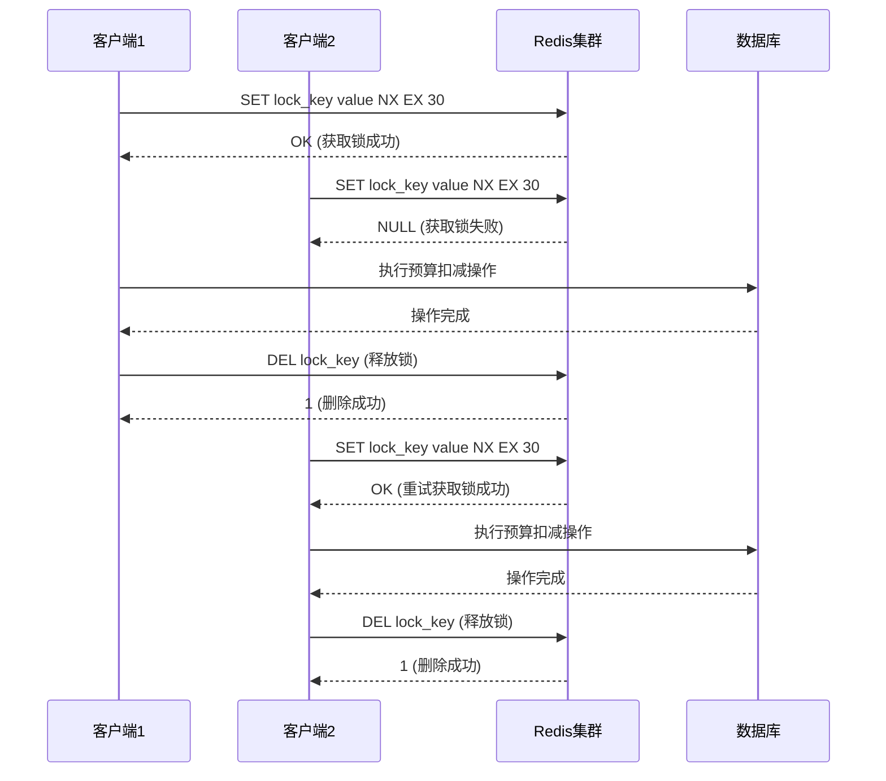
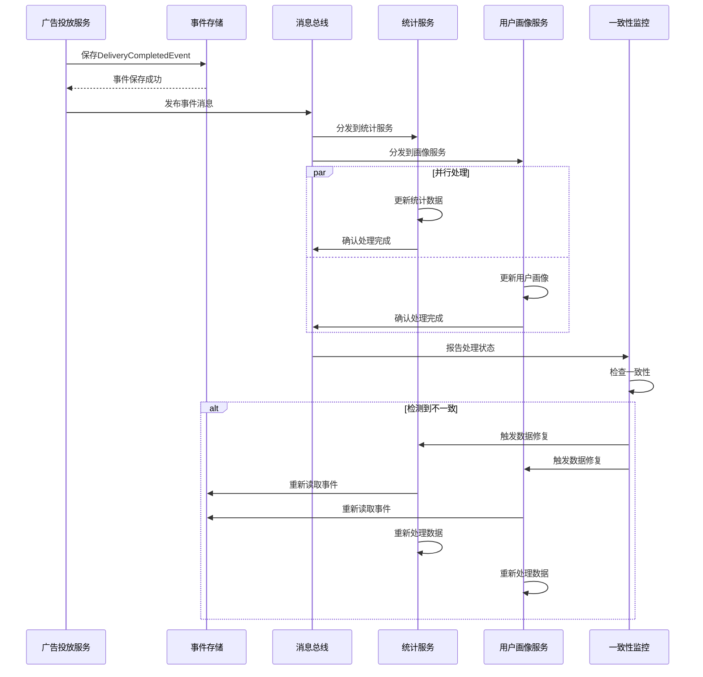
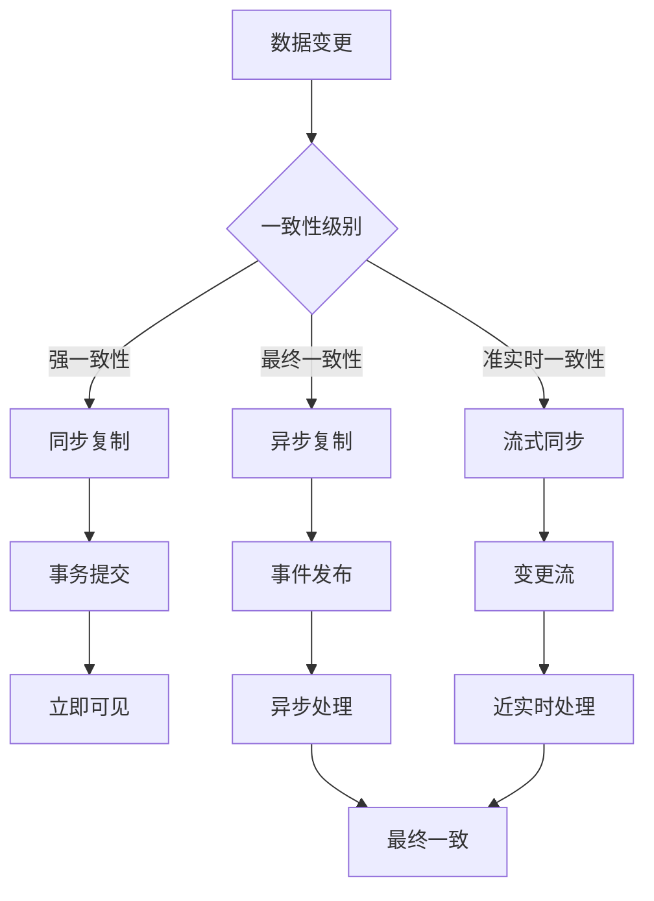
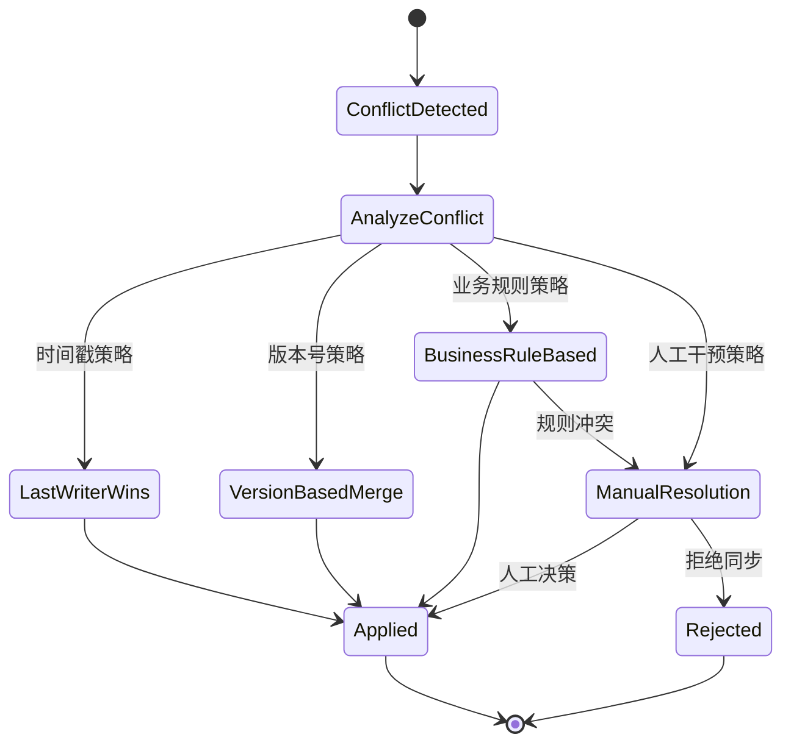

## 4. 数据一致性设计

### 4.1 一致性级别定义

#### 4.1.1 强一致性场景

| 业务场景 | 一致性要求 | 实现策略           | 性能影响 |
| -------- | ---------- | ------------------ | -------- |
| 预算控制 | 实时一致性 | 分布式锁、事务控制 | 高       |
| 频次控制 | 严格一致性 | 集中式计数器       | 中       |
| 审核状态 | 即时一致性 | 同步更新、状态机   | 中       |
| 账户余额 | 强一致性   | 数据库事务、幂等性 | 高       |

##### 强一致性架构设计

```mermaid
classDiagram
    class ConsistencyManager {
        +IDistributedLock DistributedLock
        +ITransactionManager TransactionManager
        +IConsistencyValidator Validator
        +ExecuteWithStrongConsistency~T~(Func~T~ operation) T
        +ValidateConsistency(ConsistencyContext context) ConsistencyResult
        +ResolveConflict(ConflictContext context) ConflictResolution
        +GetConsistencyLevel(string operationType) ConsistencyLevel
    }
    
    class BudgetConsistencyManager {
        +IConcurrentBudgetStore BudgetStore
        +IDistributedCounter Counter
        +string LockKeyPrefix
        +TimeSpan LockTimeout
        +bool TrySpendBudget(int campaignId, decimal amount) SpendResult
        +RefreshBudgetFromSource(int campaignId) BudgetInfo
        +ValidateBudgetIntegrity(int campaignId) ValidationResult
        +GetBudgetSnapshot(int campaignId) BudgetSnapshot
    }
    
    class FrequencyConsistencyManager {
        +IFrequencyCounter Counter
        +IUserFrequencyStore FrequencyStore
        +Dictionary~string,FrequencyRule~ Rules
        +bool CheckFrequencyLimit(string userId, string campaignId) bool
        +IncrementFrequency(string userId, string campaignId) FrequencyResult
        +ResetFrequencyCounter(string userId, string campaignId)
        +GetUserFrequencyStats(string userId) FrequencyStats
    }
    
    class AuditConsistencyManager {
        +IAuditStateMachine StateMachine
        +IAuditEventStore EventStore
        +Dictionary~AuditStatus,List~AuditStatus~~ ValidTransitions
        +bool TransitionAuditStatus(int adId, AuditStatus newStatus, string comment) bool
        +GetAuditHistory(int adId) List~AuditEvent~
        +ValidateTransition(AuditStatus from, AuditStatus to) bool
        +PublishAuditEvent(AuditEvent auditEvent)
    }
    
    class DistributedLock {
        +string LockKey
        +TimeSpan LockTimeout
        +string LockValue
        +DateTime AcquiredAt
        +bool TryAcquire(TimeSpan timeout) bool
        +bool Renew(TimeSpan extension) bool
        +void Release()
        +bool IsExpired() bool
        +GetRemainingTime() TimeSpan
    }
    
    class TransactionCoordinator {
        +string TransactionId
        +List~ITransactionParticipant~ Participants
        +TransactionStatus Status
        +Dictionary~string,object~ Context
        +bool Prepare() bool
        +bool Commit() bool
        +bool Rollback() bool
        +AddParticipant(ITransactionParticipant participant)
        +GetTransactionStatus() TransactionStatus
    }
    
    class ConsistencyValidator {
        +List~IConsistencyRule~ Rules
        +ValidationResult Validate(object entity, ConsistencyContext context)
        +void AddRule(IConsistencyRule rule)
        +List~ConsistencyViolation~ CheckViolations(object entity)
        +bool CanResolveViolation(ConsistencyViolation violation) bool
        +ResolutionResult ResolveViolation(ConsistencyViolation violation)
    }
    
    ConsistencyManager --> BudgetConsistencyManager
    ConsistencyManager --> FrequencyConsistencyManager
    ConsistencyManager --> AuditConsistencyManager
    ConsistencyManager --> DistributedLock
    ConsistencyManager --> TransactionCoordinator
    ConsistencyManager --> ConsistencyValidator
```

##### 分布式锁实现机制

**强一致性保证机制**：

- **分布式锁**：基于Redis的分布式锁，支持超时自动释放和锁续期
- **两阶段提交**：确保跨服务操作的原子性，支持prepare-commit模式
- **补偿事务**：长时间运行事务的Saga模式实现，支持补偿操作
- **幂等性保证**：通过唯一请求ID和操作记录确保操作幂等性

#### 4.1.2 最终一致性场景

| 业务场景 | 一致性要求   | 实现策略           | 延迟容忍 |
| -------- | ------------ | ------------------ | -------- |
| 统计报表 | 最终一致性   | 异步聚合、延迟计算 | 小时级   |
| 用户画像 | 准实时一致性 | 事件驱动、流式处理 | 分钟级   |
| 日志数据 | 弱一致性     | 批量处理、定时同步 | 天级     |
| 缓存同步 | 最终一致性   | 发布订阅、版本控制 | 秒级     |

##### 最终一致性架构设计

```mermaid
classDiagram
    class EventualConsistencyManager {
        +IEventStore EventStore
        +IMessageBus MessageBus
        +IConsistencyMonitor Monitor
        +List~IEventHandler~ Handlers
        +PublishEvent(DomainEvent domainEvent)
        +RegisterHandler(IEventHandler handler)
        +CheckConsistency() ConsistencyReport
        +RepairInconsistency(InconsistencyReport report) RepairResult
    }
    
    class EventSourcingEngine {
        +IEventStore EventStore
        +ISnapshotStore SnapshotStore
        +Dictionary~Type,IEventApplier~ Appliers
        +AppendEvent(string streamId, DomainEvent domainEvent)
        +List~DomainEvent~ GetEvents(string streamId, int fromVersion)
        +T ReplayEvents~T~(string streamId) where T : AggregateRoot
        +CreateSnapshot~T~(T aggregate)
        +RestoreFromSnapshot~T~(string streamId) T
    }
    
    class StatisticsAggregator {
        +IMetricsStore MetricsStore
        +IAggregationRules Rules
        +Dictionary~string,IAggregationFunction~ Functions
        +ProcessDeliveryEvent(DeliveryEvent deliveryEvent)
        +AggregateMetrics(AggregationRequest request) AggregationResult
        +ScheduleAggregation(AggregationJob job)
        +GetAggregatedStats(StatisticsQuery query) StatisticsResult
    }
    
    class UserProfileUpdater {
        +IUserProfileStore ProfileStore
        +IRealtimeProcessor Processor
        +List~IUserDataEnricher~ Enrichers
        +UpdateProfile(UserActivity activity)
        +BatchUpdateProfiles(List~UserActivity~ activities)
        +EnrichProfile(string userId, UserProfile profile) UserProfile
        +GetProfileUpdates(DateTime since) List~ProfileUpdate~
    }
    
    class CacheInvalidator {
        +ICacheManager CacheManager
        +IInvalidationStrategy Strategy
        +Dictionary~string,List~string~~ DependencyMap
        +InvalidateCache(string cacheKey)
        +InvalidateDependentCaches(string sourceKey)
        +RefreshCache(string cacheKey, object newValue)
        +GetInvalidationPlan(List~string~ changedKeys) InvalidationPlan
    }
    
    class ConsistencyMonitor {
        +List~IConsistencyCheck~ Checks
        +IAlertManager AlertManager
        +Dictionary~string,ConsistencyThreshold~ Thresholds
        +RunConsistencyChecks() ConsistencyReport
        +DetectInconsistencies() List~InconsistencyReport~
        +TriggerRepair(InconsistencyReport report)
        +GetConsistencyMetrics() ConsistencyMetrics
    }
    
    class MessageProcessor {
        +IMessageQueue Queue
        +IRetryPolicy RetryPolicy
        +IDeadLetterHandler DeadLetterHandler
        +Dictionary~Type,IMessageHandler~ Handlers
        +ProcessMessage(Message message) ProcessResult
        +HandleProcessingFailure(Message message, Exception ex)
        +RetryFailedMessage(Message message) bool
        +SendToDeadLetter(Message message, string reason)
    }
    
    EventualConsistencyManager --> EventSourcingEngine
    EventualConsistencyManager --> StatisticsAggregator
    EventualConsistencyManager --> UserProfileUpdater
    EventualConsistencyManager --> CacheInvalidator
    EventualConsistencyManager --> ConsistencyMonitor
    EventualConsistencyManager --> MessageProcessor
```

##### 事件驱动最终一致性流程

**最终一致性保证策略**：

- **事件溯源**：通过事件流记录所有状态变更，支持数据重建和修复
- **补偿机制**：检测到不一致时自动触发数据修复流程
- **幂等处理**：确保重复处理同一事件不会产生副作用
- **监控告警**：实时监控数据一致性状态，及时发现和处理问题

### 4.2 数据同步机制

#### 4.2.1 同步策略设计

##### 数据同步架构设计

```mermaid
classDiagram
    class DataSyncCoordinator {
        +List~ISyncStrategy~ Strategies
        +ISyncConfigManager ConfigManager
        +ISyncMonitor Monitor
        +Dictionary~string,SyncJob~ ActiveJobs
        +StartSyncJob(SyncJobDefinition definition) SyncJob
        +StopSyncJob(string jobId) bool
        +GetSyncStatus(string jobId) SyncStatus
        +RegisterStrategy(ISyncStrategy strategy)
        +GetOptimalStrategy(SyncRequirement requirement) ISyncStrategy
    }
    
    class SynchronousReplicationStrategy {
        +ITransactionManager TransactionManager
        +List~IReplicationTarget~ Targets
        +ReplicationMode Mode
        +int TimeoutMs
        +SyncResult Synchronize(SyncData data)
        +bool VerifyReplication(string transactionId)
        +RollbackReplication(string transactionId)
        +GetReplicationStatus() ReplicationStatus
    }
    
    class AsynchronousReplicationStrategy {
        +IMessageQueue MessageQueue
        +IReplicationBuffer Buffer
        +BatchingConfig BatchingConfig
        +RetryPolicy RetryPolicy
        +SyncResult Synchronize(SyncData data)
        +ProcessBatch(List~SyncData~ batch)
        +HandleReplicationFailure(SyncData data, Exception ex)
        +GetBufferStatus() BufferStatus
    }
    
    class StreamingSyncStrategy {
        +IChangeDataCapture CDC
        +IStreamProcessor StreamProcessor
        +Dictionary~string,StreamHandler~ Handlers
        +TimeSpan ProcessingWindow
        +SyncResult Synchronize(SyncData data)
        +ProcessChangeStream(ChangeStream stream)
        +RegisterStreamHandler(string streamType, StreamHandler handler)
        +GetStreamingMetrics() StreamingMetrics
    }
    
    class ChangeDataCapture {
        +IChangeDetector Detector
        +IChangeLog ChangeLog
        +Dictionary~string,TableWatcher~ Watchers
        +CaptureMode Mode
        +StartCapture(string tableName)
        +StopCapture(string tableName)
        +List~ChangeRecord~ GetChanges(DateTime since)
        +CreateChangeRecord(DatabaseChange change) ChangeRecord
    }
    
    class ConflictResolver {
        +List~IConflictResolutionRule~ Rules
        +ConflictResolutionStrategy DefaultStrategy
        +Dictionary~string,ConflictStatistics~ Statistics
        +ConflictResolution ResolveConflict(DataConflict conflict)
        +RegisterRule(IConflictResolutionRule rule)
        +GetConflictHistory(string entityId) List~ConflictRecord~
        +AnalyzeConflictPatterns() ConflictAnalysis
    }
    
    class SyncMonitor {
        +Dictionary~string,SyncMetrics~ Metrics
        +IAlertManager AlertManager
        +List~SyncThreshold~ Thresholds
        +RecordSyncMetrics(string jobId, SyncMetrics metrics)
        +CheckSyncHealth(string jobId) HealthStatus
        +TriggerAlert(SyncAlert alert)
        +GetSyncDashboard() SyncDashboard
    }
    
    class DataValidator {
        +List~IValidationRule~ Rules
        +ValidationConfig Config
        +Dictionary~string,ValidationResult~ Results
        +ValidationResult ValidateData(object data, ValidationContext context)
        +bool IsDataIntegrityValid(string sourceId, string targetId)
        +GenerateValidationReport(string syncJobId) ValidationReport
        +RepairDataInconsistency(InconsistencyReport report) RepairResult
    }
    
    DataSyncCoordinator --> SynchronousReplicationStrategy
    DataSyncCoordinator --> AsynchronousReplicationStrategy
    DataSyncCoordinator --> StreamingSyncStrategy
    DataSyncCoordinator --> ConflictResolver
    DataSyncCoordinator --> SyncMonitor
    DataSyncCoordinator --> DataValidator
    
    StreamingSyncStrategy --> ChangeDataCapture
```

##### 同步冲突解决机制

**冲突解决策略**：

- **时间戳优先**：基于最后修改时间的冲突解决策略
- **版本控制**：基于乐观锁版本号的冲突检测和解决
- **业务规则**：基于业务逻辑的智能冲突解决
- **合并策略**：字段级别的智能合并算法

#### 4.2.2 冲突解决策略

| 冲突类型 | 检测方式   | 解决策略     | 实现机制   |
| -------- | ---------- | ------------ | ---------- |
| 写写冲突 | 版本号比较 | 最后写入获胜 | 乐观锁     |
| 读写冲突 | 时间戳检查 | 重试机制     | 版本控制   |
| 分区冲突 | 一致性哈希 | 数据迁移     | 分片重平衡 |
| 网络分区 | 脑裂检测   | 多数派决策   | Raft算法   |

### 4.3 事务边界设计

#### 4.3.1 聚合内事务

| 事务范围 | 业务场景           | 隔离级别        | 回滚策略 |
| -------- | ------------------ | --------------- | -------- |
| 单一聚合 | 广告创建、修改     | READ_COMMITTED  | 自动回滚 |
| 关联实体 | 活动和广告同步创建 | REPEATABLE_READ | 补偿事务 |
| 状态变更 | 审核状态流转       | SERIALIZABLE    | 状态回退 |

#### 4.3.2 跨聚合协调

| 协调模式 | 适用场景     | 实现方式           | 失败处理 |
| -------- | ------------ | ------------------ | -------- |
| Saga模式 | 长时间事务   | 编排式Saga         | 补偿操作 |
| TCC模式  | 强一致性要求 | Try-Confirm-Cancel | 资源预留 |
| 事件驱动 | 异步处理     | 领域事件           | 重试机制 |
| 消息队列 | 解耦处理     | 可靠消息           | 死信队列 |
