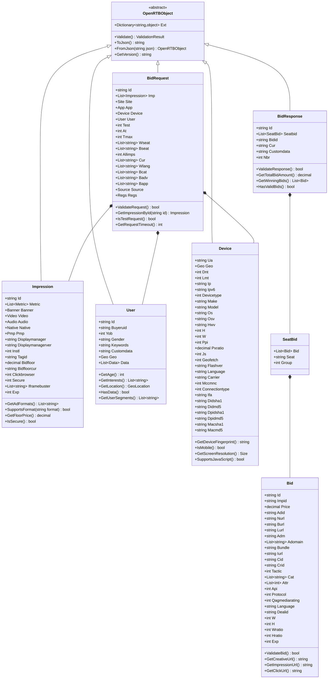
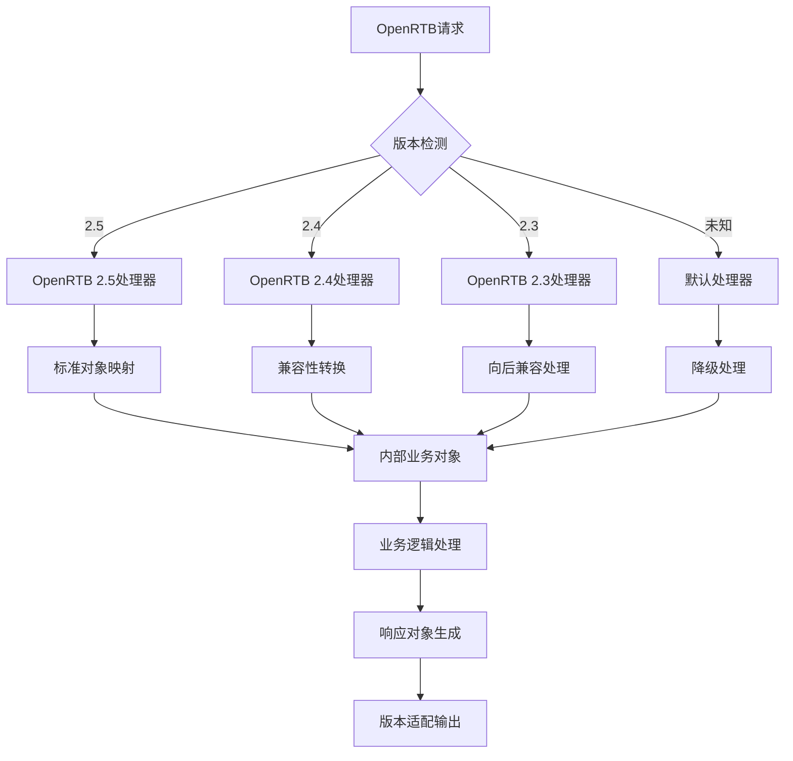
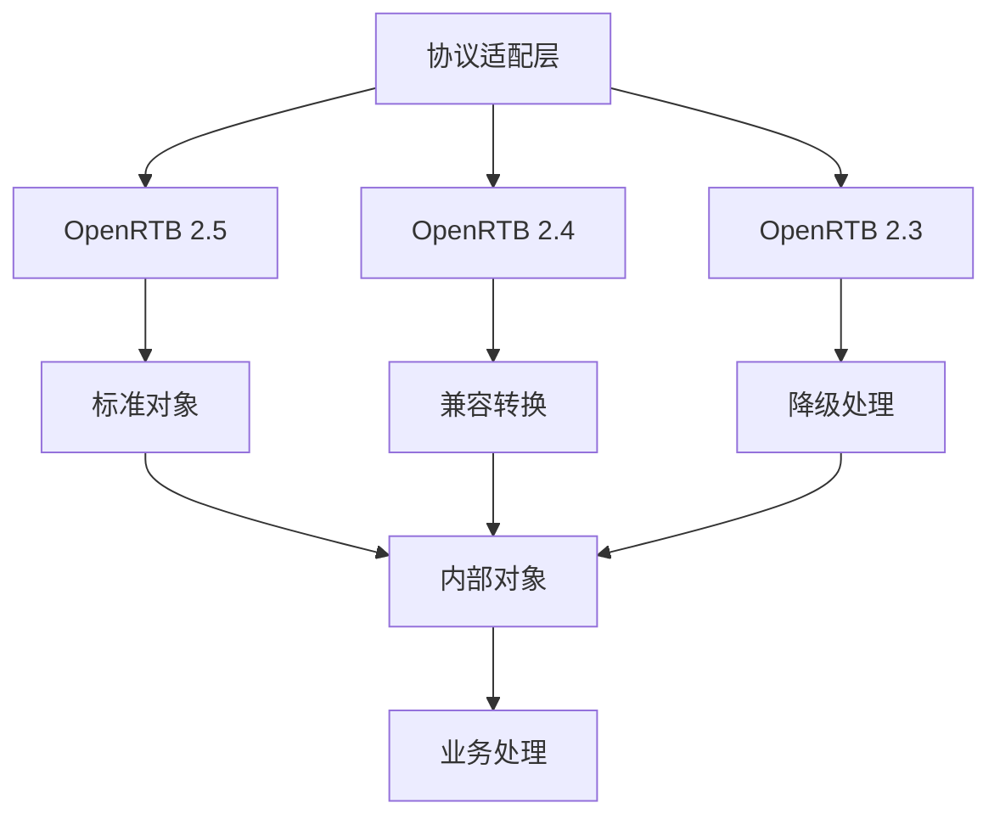
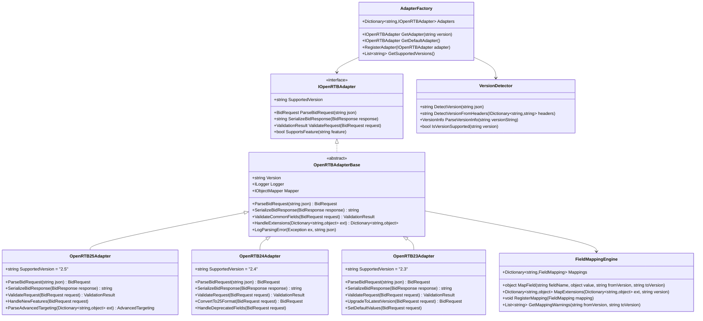
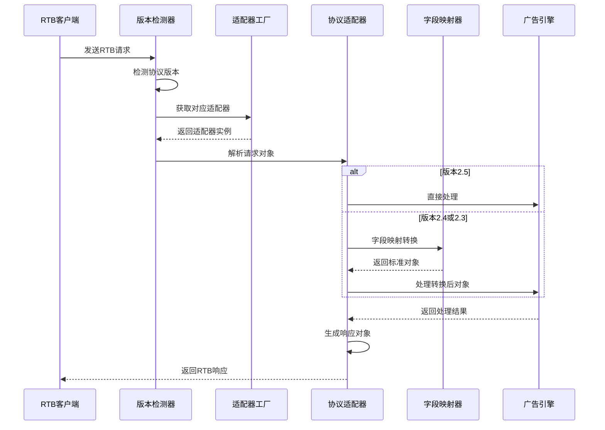
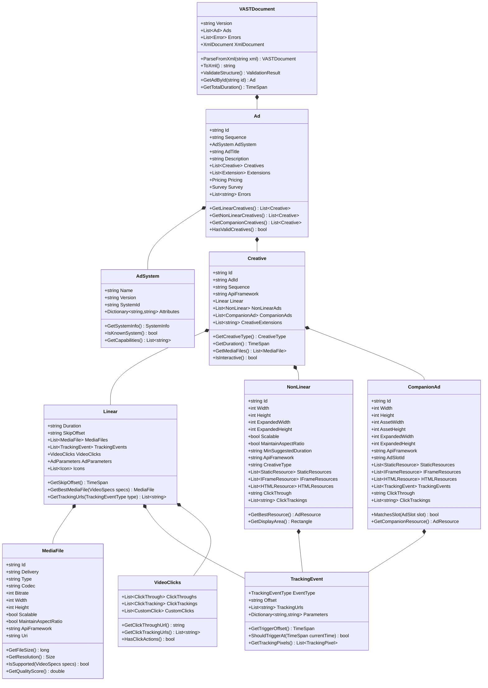
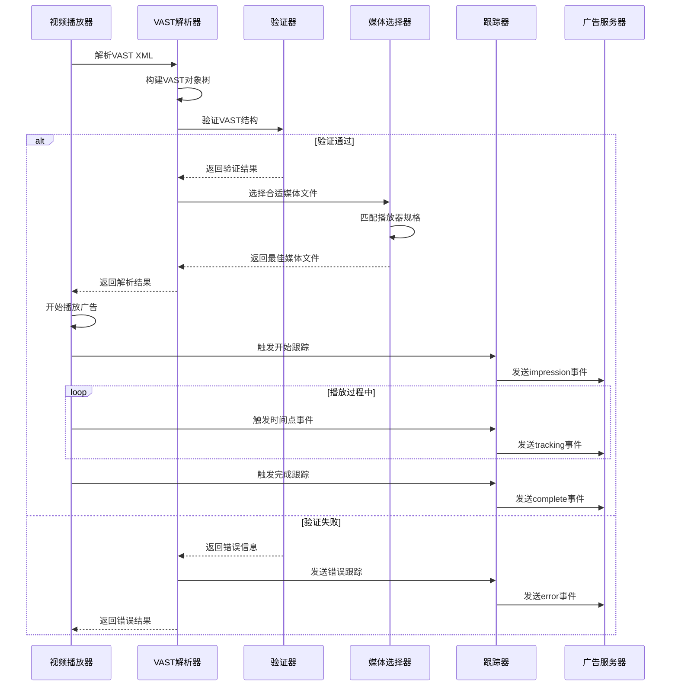
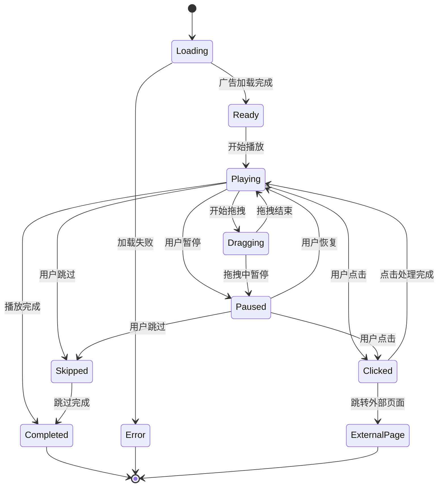

## 3. 外部协议对象设计

### 3.1 OpenRTB协议适配

#### 3.1.1 协议对象映射

| OpenRTB对象 | 业务含义 | 映射策略            | 扩展字段     |
| ----------- | -------- | ------------------- | ------------ |
| BidRequest  | 竞价请求 | 标准映射+自定义扩展 | 内部业务标识 |
| BidResponse | 竞价响应 | 标准格式+性能优化   | 调试信息     |
| Impression  | 广告展示 | 完整映射+验证逻辑   | 质量评分     |
| User        | 用户信息 | 隐私保护+画像映射   | 内部用户ID   |
| Device      | 设备信息 | 标准映射+设备指纹   | 反作弊标识   |

##### OpenRTB对象类图设计

##### OpenRTB协议版本兼容设计

**协议适配策略**：

- **向后兼容**：新版本协议兼容旧版本请求，通过字段映射和默认值处理
- **扩展字段管理**：通过Ext字段支持自定义扩展，保持协议标准性
- **验证机制**：多层次验证包括格式验证、业务规则验证、安全检查
- **性能优化**：对象池化、序列化优化、缓存策略

#### 3.1.2 协议版本兼容

##### 协议版本适配架构

**版本兼容性处理流程**：

**映射策略和规则**：

- **字段映射表**：维护不同版本间的字段对应关系和转换规则
- **默认值处理**：为缺失字段提供合理的默认值，确保业务逻辑正常运行
- **扩展字段处理**：保持自定义扩展字段的完整性，支持业务特殊需求
- **验证增强**：在版本转换过程中增加额外的验证检查，确保数据质量

### 3.2 VAST协议支持

#### 3.2.1 视频广告对象

| VAST对象       | 功能作用       | 数据结构   | 处理策略 |
| -------------- | -------------- | ---------- | -------- |
| VASTDocument   | 广告文档根节点 | XML树结构  | 解析验证 |
| AdSystem       | 广告系统信息   | 标识信息   | 系统识别 |
| Creative       | 创意内容       | 多媒体资源 | 格式适配 |
| MediaFile      | 媒体文件       | 文件元信息 | 编码支持 |
| TrackingEvents | 跟踪事件       | 事件列表   | 监测埋点 |

##### VAST对象类图设计

##### VAST处理流程设计

**VAST优化策略**：

- **媒体文件选择算法**：根据播放器能力、网络状况、设备性能选择最佳媒体文件
- **跟踪事件优化**：批量发送、去重处理、失败重试机制
- **缓存策略**：预解析VAST文档、媒体文件预加载、跟踪URL缓存
- **错误处理**：详细错误分类、降级处理、备用广告机制

#### 3.2.2 交互式广告支持

| 交互类型   | 实现方式     | 数据要求     | 技术实现 |
| ---------- | ------------ | ------------ | -------- |
| 可跳过广告 | 跳过按钮控制 | 时间节点配置 | 前端交互 |
| 可点击广告 | 点击区域定义 | 坐标和链接   | 事件处理 |
| 可暂停广告 | 暂停控制     | 状态管理     | 播放控制 |
| 可拖拽广告 | 拖拽交互     | 拖拽范围     | 手势识别 |

##### 交互式广告对象设计

```mermaid
classDiagram
    class InteractiveAd {
        <<abstract>>
        +string Id
        +InteractionType Type
        +bool IsEnabled
        +Dictionary~string,object~ Parameters
        +List~InteractionRule~ Rules
        +InteractionState State
        +HandleInteraction(InteractionEvent event) InteractionResult
        +ValidateInteraction(InteractionEvent event) bool
        +GetAvailableActions() List~InteractionAction~
    }
    
    class SkippableAd {
        +TimeSpan SkipOffset
        +bool SkipButtonVisible
        +string SkipButtonText
        +SkipButtonStyle ButtonStyle
        +List~string~ SkipTrackingUrls
        +CanSkipAt(TimeSpan currentTime) bool
        +ShowSkipButton()
        +HideSkipButton()
        +HandleSkip() SkipResult
        +TrackSkipEvent()
    }
    
    class ClickableAd {
        +List~ClickZone~ ClickZones
        +string ClickThroughUrl
        +List~string~ ClickTrackingUrls
        +bool OpenInNewWindow
        +ClickableState State
        +AddClickZone(ClickZone zone)
        +RemoveClickZone(string zoneId)
        +HandleClick(ClickEvent clickEvent) ClickResult
        +IsClickableAt(Point location) bool
        +GetClickZoneAt(Point location) ClickZone
    }
    
    class PausableAd {
        +bool IsPausable
        +bool IsPaused
        +TimeSpan PausedAt
        +TimeSpan TotalPausedTime
        +int MaxPauseCount
        +int CurrentPauseCount
        +List~string~ PauseTrackingUrls
        +List~string~ ResumeTrackingUrls
        +Pause() PauseResult
        +Resume() ResumeResult
        +CanPause() bool
        +GetPauseOverlay() PauseOverlay
    }
    
    class DraggableAd {
        +Rectangle DragBounds
        +Point CurrentPosition
        +Point InitialPosition
        +bool IsDragging
        +DragConstraints Constraints
        +List~string~ DragStartUrls
        +List~string~ DragEndUrls
        +StartDrag(Point startPoint) DragResult
        +UpdateDrag(Point currentPoint) DragResult
        +EndDrag(Point endPoint) DragResult
        +ResetPosition()
        +IsWithinBounds(Point position) bool
    }
    
    class InteractionEvent {
        +string EventId
        +InteractionType Type
        +DateTime Timestamp
        +Point Location
        +Dictionary~string,object~ EventData
        +string UserId
        +string DeviceId
        +UserAgent UserAgent
        +GetEventProperties() Dictionary~string,object~
        +Validate() bool
    }
    
    class InteractionRule {
        +string RuleId
        +string Condition
        +InteractionAction Action
        +bool IsEnabled
        +Dictionary~string,object~ Parameters
        +Evaluate(InteractionContext context) bool
        +Execute(InteractionContext context) RuleResult
    }
    
    class ClickZone {
        +string Id
        +Rectangle Area
        +string ClickUrl
        +List~string~ TrackingUrls
        +bool IsActive
        +string Tooltip
        +ClickZoneType Type
        +Contains(Point point) bool
        +GetClickData() ClickData
        +SetActive(bool active)
    }
    
    class InteractionTracker {
        +string TrackingId
        +List~TrackingPixel~ Pixels
        +Dictionary~string,List~string~~ EventUrls
        +TrackInteraction(InteractionEvent event)
        +BatchTrackEvents(List~InteractionEvent~ events)
        +GetTrackingUrls(InteractionType type) List~string~
        +SendTrackingPixel(string url, Dictionary~string,string~ params)
    }
    
    InteractiveAd <|-- SkippableAd
    InteractiveAd <|-- ClickableAd
    InteractiveAd <|-- PausableAd
    InteractiveAd <|-- DraggableAd
    
    ClickableAd *-- ClickZone
    InteractiveAd *-- InteractionRule
    InteractiveAd --> InteractionEvent
    InteractiveAd --> InteractionTracker
```

##### 交互式广告处理流程

**交互功能实现要点**：

- **事件处理机制**：统一的事件模型，支持冒泡和捕获机制
- **状态管理**：复杂交互状态的维护和同步
- **跟踪监测**：详细的交互行为跟踪和数据收集
- **用户体验优化**：流畅的交互响应和视觉反馈
- **兼容性处理**：不同设备和浏览器的兼容性适配

### 3.3 第三方集成对象

#### 3.3.1 DSP集成对象

| 集成场景 | 对象设计       | 数据格式      | 同步策略 |
| -------- | -------------- | ------------- | -------- |
| 竞价请求 | 标准化请求对象 | JSON/Protobuf | 实时同步 |
| 竞价响应 | 统一响应格式   | JSON压缩      | 实时处理 |
| 数据回传 | 效果数据对象   | 批量格式      | 定时同步 |
| 结算对账 | 账单数据对象   | CSV/Excel     | 每日同步 |

#### 3.3.2 SSP集成对象

| 集成类型 | 数据交换     | 协议支持   | 质量保证 |
| -------- | ------------ | ---------- | -------- |
| 流量接入 | 流量数据对象 | OpenRTB    | 流量验证 |
| 广告投放 | 投放指令对象 | 标准协议   | 投放监控 |
| 效果监测 | 监测数据对象 | 自定义协议 | 数据校验 |
| 收益分成 | 分成数据对象 | 财务协议   | 对账机制 |
